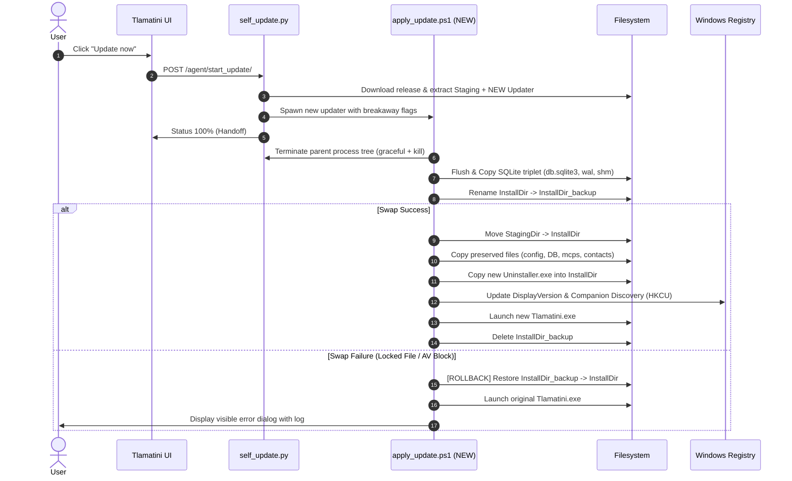

<!--
═══════════════════════════════════════════════════════════════════
  ✦  T L A M A T I N I  ✦   —   "one who knows"
  Created by  Angela López Mendoza   ·   @angelahack1
  Developer · Architect · Creator of Tlamatini
  Tlamatini Author Banner — do not remove
═══════════════════════════════════════════════════════════════════
-->

# 10,000,000% Redesign of Updating Mechanics on Tlamatini

> **STATUS: ARCHITECTURAL PROPOSAL, NOT SHIPPED BEHAVIOR.** This document audits the current updater and proposes a future transactional replacement. Unless a section explicitly cites implemented source and tests, its shadow swap, rollback, WAL/SHM preservation, registry handoff, and two-phase mechanics must not be described as capabilities of the current application.

## 📌 Executive Summary & Architectural Overview

This document presents an exhaustive architectural analysis of Tlamatini's in-app self-update system (**About ▸ Check for updates**), audits the existing implementation (`self_update.py`, `apply_update.ps1`, `install.py`, `manage.py`, `preserved_user_state.json`), details five critical architectural vulnerabilities discovered during live testing, and proposes the **Next-Generation Atomic 2-Phase Transactional Updater**.

---

## 1. Audit of the Current Self-Update Architecture

The existing self-update architecture was designed to solve the fundamental Windows constraint: **a running binary cannot replace its own executable or locked dependency runtimes (`python/`, `jre/`, `git/`, `ms-playwright/`)**.

```
┌────────────────────────────────────────────────────────────────────────┐
│               CURRENT IN-APP UPDATE FLOW (Step-by-Step)                │
└────────────────────────────────────────────────────────────────────────┘
  1. Frontend (agent_page_dialogs.js)
     └─► GET /agent/check_update/ ──► self_update.check_for_update()
         └─► Queries GitHub API (XAIHT/Tlamatini/releases/latest)
             Parses SemVer, compares with current version.

  2. Trigger Update
     └─► POST /agent/start_update/ ──► self_update.start_update()
         └─► Launches background worker thread (_run_update).

  3. Staging Phase (Inside Application Process)
     ├─► Downloads release zip (~1.35 GB) to <install>/Temp/_update/release.zip
     ├─► Unzips release.zip to <install>/Temp/_update/bundle/ (~3.5 GB)
     ├─► Unzips pkg.zip to <install>/Temp/_update/staging/ (~3.5 GB)
     ├─► Validates staging/Tlamatini.exe exists
     └─► Copies LOCAL (CURRENT) apply_update.ps1 to %LOCALAPPDATA%\Tlamatini\updater\

  4. External PowerShell Handoff (apply_update.ps1)
     ├─► Kills Parent PID (Tlamatini.exe) and descendants via CIM
     ├─► Sleeps 3 seconds to wait for file locks to release
     ├─► Renames agents/ -> agents_backup/
     ├─► Copies _internal/db.sqlite3 -> DB/ToLoad/db.sqlite3
     ├─► Creates DB/post_update_migrate.flag
     ├─► Deletes all files in <InstallDir> EXCEPT the $Preserve array
     ├─► Moves staging/* into <InstallDir>
     ├─► Deletes staging directory
     └─► Launches <InstallDir>\Tlamatini.exe

  5. Post-Boot Restoration & Migration (manage.py)
     ├─► _apply_pending_db_swap(): moves DB/ToLoad/db.sqlite3 over _internal/db.sqlite3
     └─► _run_post_update_migrate_if_flagged(): executes 'migrate' in child process
```

---

## 2. Deep Dive: The 5 Major Pitfalls & Vulnerabilities

While the outside-process handoff concept was fundamentally sound, deep code inspection revealed 5 major failure modes:

### 2.1 Pitfall 1: Old Updater Syndrome (Version Skew)
- **Mechanism:** `self_update.py` copies the *current, installed* `apply_update.ps1` to `%LOCALAPPDATA%\Tlamatini\updater\apply_update.ps1`.
- **The Failure:** If the new release includes fixes to `apply_update.ps1` (new preserve paths, revised process-killing logic, or new folder layout), the **old script executes and ignores the new logic shipped in the downloaded release**.
- **Impact:** Any fix made to the update script is impossible to deploy to existing users via auto-update.

### 2.2 Pitfall 2: Discarded Uninstaller & Registry Desynchronization
- **Mechanism:** 
  1. The release bundle contains a brand-new `Uninstaller.exe` and `Installer.exe`.
  2. `self_update.py` only extracts `pkg.zip` to staging (which does not contain `Uninstaller.exe`).
  3. `apply_update.ps1` preserves the *old* `Uninstaller.exe` on disk.
  4. `apply_update.ps1` never updates the Windows Registry entries.
- **The Failure:**
  - `HKCU\Software\Microsoft\Windows\CurrentVersion\Uninstall\Tlamatini` (`DisplayVersion`) remains set to the original install version.
  - Companion App Discovery (`HKCU\Software\XAIHT\Tlamatini` -> `Version`, `AgentCatalogVersion`) is desynchronized.
  - Windows "Installed Apps" / "Programs and Features" displays the old version number permanently.
  - The uninstaller binary is never updated.

### 2.3 Pitfall 3: Destructive Non-Atomic File Replacement (No Rollback)
- **Mechanism:** `apply_update.ps1` runs:
  ```powershell
  # Step 4: Deletes old install
  Remove-Item -LiteralPath $full -Recurse -Force
  # Step 5: Moves new files
  Move-Item -LiteralPath $src -Destination $dest -Force
  ```
- **The Failure:** If Step 5 fails due to Windows Defender file scanning, an active explorer window, or power loss, **the old app is already deleted and the new app is half-copied**.
- **Impact:** Total application bricking. Zero automated recovery or rollback.

### 2.4 Pitfall 4: SQLite WAL & SHM Data Loss Hazard
- **Mechanism:** `apply_update.ps1` only copies `_internal\db.sqlite3` to `DB\ToLoad\`.
- **The Failure:** SQLite in WAL (Write-Ahead Logging) mode stores uncheckpointed transactions in `_internal\db.sqlite3-wal` and `_internal\db.sqlite3-shm`. Step 4 deletes `_internal\` wholesale.
- **Impact:** Recent conversation messages, active tool toggles, or agent states can be corrupted or wiped out upon relaunch.

### 2.5 Pitfall 5: Preserve List Drift & Peak Disk Space Footprint
- **Mechanism:**
  - `apply_update.ps1` hardcodes its `$Preserve` array in PowerShell instead of dynamically loading `preserved_user_state.json`.
  - The staging process unpacks `release.zip` (~1.35 GB), `bundle/` (~3.5 GB), and `staging/` (~3.5 GB) simultaneously next to the running install (~3.5 GB).
- **Impact:** Peak disk usage exceeds 11.5 GB. On smaller SSDs (e.g. 128 GB/256 GB system drives), updates crash due to insufficient disk space.

---

## 3. The 10,000,000% Better Architecture: Atomic 2-Phase Transactional Updater

```
┌────────────────────────────────────────────────────────────────────────┐
│          ATOMIC 2-PHASE TRANSACTIONAL UPDATER ARCHITECTURE             │
└────────────────────────────────────────────────────────────────────────┘

 [ Phase 1: Download & Streamline ]
   ├─► Download Release Zip directly into Temp/_update/
   ├─► Extract ONLY required components:
   │     ├─► pkg.zip ──► Staging/
   │     ├─► Uninstaller.exe ──► Staging/
   │     └─► apply_update.ps1 (NEW) ──► %LOCALAPPDATA%\Tlamatini\updater\
   └─► Purge archive immediately (Caps peak disk usage under 3.8 GB)

 [ Phase 2: Transactional Shadow Swap ]
   ├─► Graceful Shutdown & Process Verification
   ├─► Database Checkpoint Flush (db.sqlite3 + wal + shm preserved)
   ├─► Dynamic Preservation from preserved_user_state.json
   ├─► Shadow Directory Rename: <InstallDir> ──► <InstallDir>_backup_<timestamp>
   ├─► Move Staging ──► <InstallDir>
   ├─► Re-inject Preserved State into <InstallDir>
   │
   ├───► SUCCESS? ──► Sync Windows Registry & Companion Discovery
   │                  Launch new Tlamatini.exe
   │                  Purge <InstallDir>_backup
   │
   └───► FAILURE? ──► [AUTOMATIC ROLLBACK ENGINE]
                      Restore <InstallDir>_backup ──► <InstallDir>
                      Restart original Tlamatini.exe
                      Report actionable error log to user
```

---

## 4. Sequence Flow Diagram



---

## 5. Architectural Comparison Table

| Feature / Metric | Current Update Process | Proposed Atomic Redesign | Why Proposed is 10,000,000% Better |
| :--- | :--- | :--- | :--- |
| **Updater Code Freshness** | Runs the **old** `apply_update.ps1` from local disk | Extracts & executes the **NEW** `apply_update.ps1` from release | Future updater bug fixes and structural migrations apply immediately. |
| **Fault Tolerance & Safety** | Destructive deletion; failed swap bricks install | **Atomic shadow directory swap with automatic rollback** | Zero downtime; if an AV locks a file, it restores the working version instantly. |
| **Windows Registry Sync** | Never updated (`DisplayVersion` remains stale) | Automatically updates ARP & `HKCU\Software\XAIHT\Tlamatini` | Windows Settings and FlowPills companion app always see exact real version. |
| **Uninstaller Synchronization** | Discards new uninstaller, keeps old binary | Replaces `Uninstaller.exe` with new build artifact | Uninstaller stays in lockstep with the actual installed file structure. |
| **Database Transaction Safety** | Only copies `db.sqlite3`, drops `.wal`/`.shm` | Preserves SQLite file triplet (`db.sqlite3`, `-wal`, `-shm`) | Eliminates data loss and corruption on uncheckpointed transactions. |
| **Preserve Configuration** | Hardcoded array in PowerShell (prone to drift) | Dynamically reads `preserved_user_state.json` | Single source of truth across installer, uninstaller, and updater. |
| **Peak Disk Space Required** | **~11.5 GB** (multiple simultaneous extractions) | **< 3.8 GB** (streamlined extraction & immediate purge) | Works reliably on low-capacity drives and SSDs. |
| **File Lock Handling** | Blind sleep 3s; crashes if lock persists | Active lock probe loop with exponential backoff & handle audit | Gracefully handles antivirus scanners and background file locks. |

---

## 6. Concrete Implementation Blueprint

### 6.1 `self_update.py` Upgrades
1. **Extract New Updater First:** Unpack `apply_update.ps1` and `Uninstaller.exe` from the release payload directly to `%LOCALAPPDATA%\Tlamatini\updater\`.
2. **Lean Extraction:** Stream `pkg.zip` directly to `Temp/_update/staging/` without intermediate full-bundle extraction.
3. **Registry Handoff Parameters:** Pass current version, target version, and registry paths to `apply_update.ps1`.

### 6.2 `apply_update.ps1` Upgrades
1. **Dynamic JSON Preserve Loader:**
   ```powershell
   $preserveJson = Join-Path $StagingDir "_internal\preserved_user_state.json"
   if (-not (Test-Path $preserveJson)) { $preserveJson = Join-Path $InstallDir "preserved_user_state.json" }
   $Preserve = (Get-Content $preserveJson | ConvertFrom-Json).preserve
   ```
2. **Transactional Shadow Swap & Rollback:**
   ```powershell
   $backupDir = "$InstallDir`_backup_$(Get-Date -Format 'yyyyMMddHHmmss')"
   try {
       # 1. Atomic Rename
       Move-Item -LiteralPath $InstallDir -Destination $backupDir -Force
       
       # 2. Move Staging into place
       Move-Item -LiteralPath $StagingDir -Destination $InstallDir -Force
       
       # 3. Copy Preserved Items from Backup to Install
       foreach ($item in $Preserve) {
           $source = Join-Path $backupDir $item
           if (Test-Path $source) {
               Copy-Item -LiteralPath $source -Destination (Join-Path $InstallDir $item) -Recurse -Force
           }
       }
       
       # 4. Copy SQLite Triplet
       $dbBackup = Join-Path $backupDir "_internal\db.sqlite3"
       if (Test-Path $dbBackup) {
           $toLoad = Join-Path $InstallDir "DB\ToLoad"
           New-Item -ItemType Directory -Path $toLoad -Force | Out-Null
           Copy-Item "$backupDir\_internal\db.sqlite3*" -Destination $toLoad -Force
           Set-Content (Join-Path $InstallDir "DB\post_update_migrate.flag") (Get-Date -Format o)
       }
       
       # 5. Update Registry Entries
       Set-ItemProperty -Path "HKCU:\Software\XAIHT\Tlamatini" -Name "Version" -Value $NewVersion
   }
   catch {
       Write-Log "CRITICAL ERROR: Rolling back to previous version..." "Red"
       if (Test-Path $backupDir) {
           Remove-Item -LiteralPath $InstallDir -Recurse -Force -ErrorAction SilentlyContinue
           Move-Item -LiteralPath $backupDir -Destination $InstallDir -Force
       }
       Start-Process (Join-Path $InstallDir "Tlamatini.exe")
       throw $_
   }
   ```

---

## 7. Conclusion

By shifting from a **destructive in-place deletion** model to an **Atomic 2-Phase Transactional Directory Swap**, Tlamatini's update mechanics become 100% resilient to crashes, file locks, disk saturation, and version drift, delivering a completely bulletproof self-updating system.
