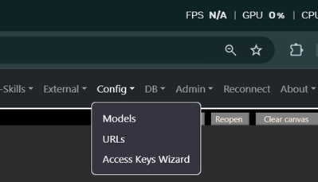
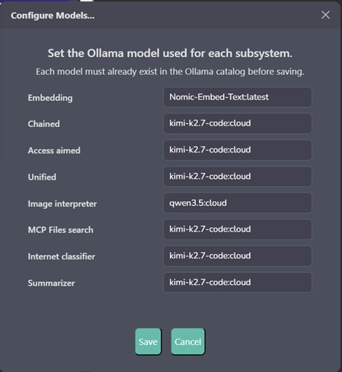
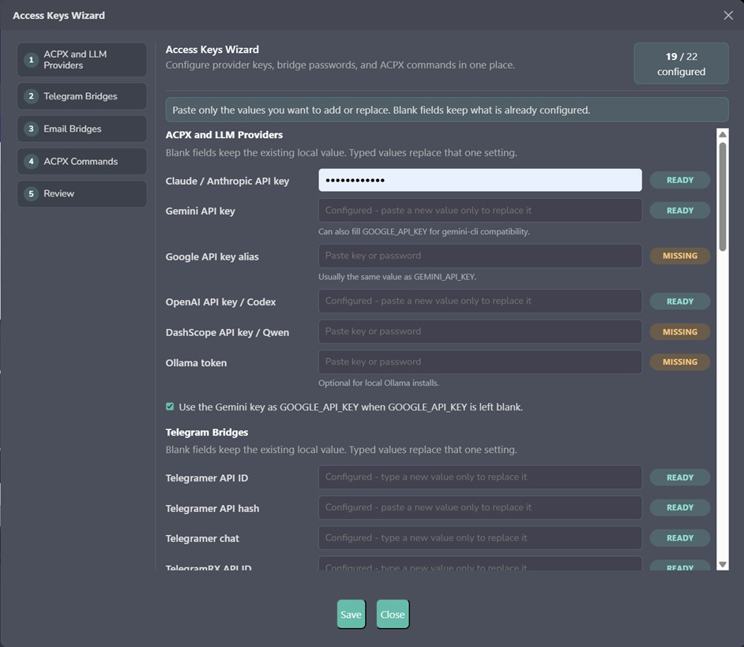
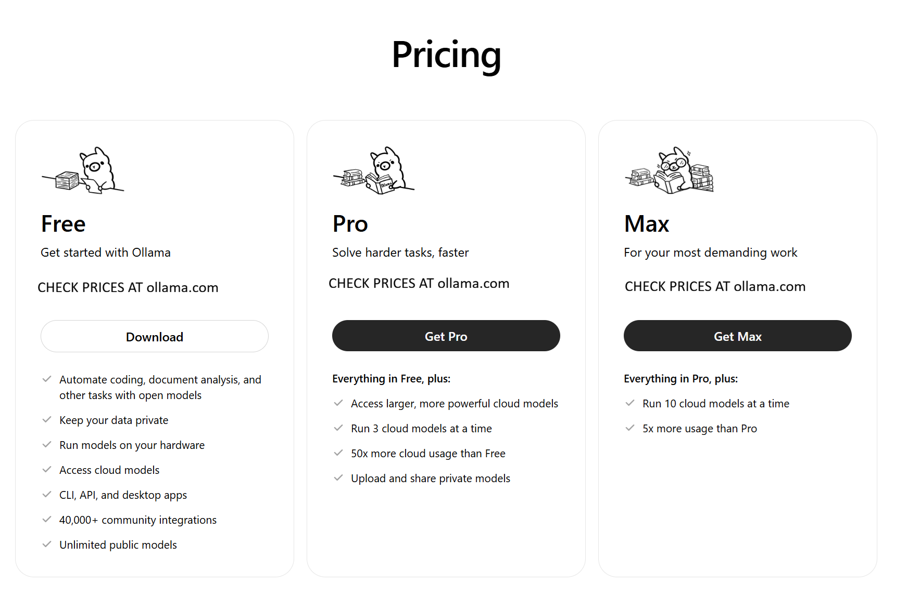

<!--
═══════════════════════════════════════════════════════════════════
  ✦  T L A M A T I N I  ✦   —   "one who knows"
  Created by  Angela López Mendoza   ·   @angelahack1
  Developer · Architect · Creator of Tlamatini
  Tlamatini Author Banner — do not remove (Angela's name is kept in every build)
═══════════════════════════════════════════════════════════════════
-->
# Tlamatini

In this book, **Blue-hat** means a defensive operator posture: Tlamatini helps inspect and respond to security signals on a Windows machine that you own or are explicitly authorised to defend. It does **not** turn her into an unsupervised endpoint-security authority, add a new database-backed workflow Agent, or make every alert a confirmed intrusion. The `security/` directory is an administrator-operated host toolkit. A human chooses when to enable it, reviews the evidence, decides whether response is justified, and owns the resulting Windows policy changes.

> **El Libro de Tlamatini** — una guía paso a paso para ejecutar, usar y dominar un asistente de desarrollo con IA desplegado localmente, con RAG, orquestación de tools Multi-Turn, delegación a CLIs externos por ACPX, un cliente MCP de Unreal para manejar Unreal Engine 5 desde el chat o el canvas, un diseñador visual de workflows, 87 tipos de agent que se arrastran y sueltan, y un Flow Compiler en el backend que convierte el canvas vivo — o un log de tool-calls generado en el chat — en un workflow validado contra el registry, con los secretos redactados y portable tanto en source como en frozen.
>
> Visita nuestro sitio en **https://xaiht.org**, o date una probadita de un minuto de Tlamatini en YouTube: **https://youtu.be/a51miZ1JIe0**.
>
> 💬 **Únete a la comunidad en Discord:** **https://discord.gg/WFQsrskgc** — pide ayuda, presume lo que construyas, reporta bugs y ayuda a darle forma al roadmap.

1. **Host enablement** changes persistent Windows settings so Tlamatini can run and observe more of the machine.
2. **Defensive monitoring and response** inspects ten signal families and can, in armed modes, add firewall blocks or force-stop selected processes.

## Habilita a Tlamatini como agente Blue-hat

Tlamatini trae su propio juego de **seguridad defensiva** en `security/`, para
cuidar la maquina donde corre — no para atacar la de nadie:

- **`tlamatini_defender.ps1`** — vigila y responde; deja su evidencia en
  `security/security_logs/`.
- **`tlamatini_whitelist_v2.ps1`** — pone en la lista blanca de Windows
  Defender lo que Tlamatini necesita ejecutar, sin abrirle la puerta a nada mas.
- **`run_defender.bat`** / **`enable_tlamatini_v2.bat`** — los lanzadores.
- **`automated_tests_of_security_assets.py`** — comprueba que los assets estan
  completos y sanos; la foto de PANTALLA COMPLETA la toma **Shoter**.

Las bitacoras de `security/security_logs/` son **tuyas**: estan en `.gitignore`
(retratan tu escritorio entero) y el actualizador las conserva a traves de una
actualizacion guardandolas en `Temp/_security_logs_carryover`.

## ⚠️ DESLINDE CLARO — CONTROL, JURISDICCIÓN Y RESPONSABILIDAD DEL USUARIO SOBRE LOS AGENTS

Cada agent en `Tlamatini/agent/agents/` se entrega intencionalmente como un **programa de Python plano** para que su código de operación pueda leerse, auditarse, editarse, restringirse o deshabilitarse por el usuario. Esta transparencia es un mecanismo de control del usuario, **no una garantía de que un agent sea seguro o adecuado para un entorno en particular**. Los agents no tienen autoridad ni jurisdicción independiente: sólo el usuario decide si se ejecutan, dónde, cómo y con qué permisos.

Cuando habilitas, configuras, modificas, encadenas o ejecutas un agent, **ese agent y su ejecución quedan bajo tu control y tu jurisdicción**. Eres el único responsable de revisar su código y su configuración; de proteger y limitar sus secretos, credenciales y permisos; de seleccionar y autorizar cada archivo, carpeta, destino de red, browser, shell, API, MCP server externo, máquina, dispositivo de hardware y sistema aguas abajo al que pueda acceder; de supervisar su output; y de cumplir con toda ley, política, licencia, contrato y autorización que aplique a tu uso.

**AL EJECUTAR UN AGENT, ACEPTAS LA RESPONSABILIDAD POR SUS ACCIONES Y CONSECUENCIAS. EN LA MÁXIMA MEDIDA PERMITIDA POR LA LEY APLICABLE, CUALQUIER BRECHA DE SEGURIDAD, EXPOSICIÓN O PÉRDIDA DE DATOS, ACCIÓN NO AUTORIZADA, FUGA DE CREDENCIALES, AUTOMATIZACIÓN INSEGURA, VIOLACIÓN LEGAL O DE POLÍTICAS, COMPROMISO DE SISTEMAS, DAÑO A DISPOSITIVOS, PÉRDIDA FINANCIERA U OTRO PERJUICIO QUE SURJA DE TU USO, CONFIGURACIÓN, MODIFICACIÓN O EJECUCIÓN DE UN AGENT O DE UN WORKFLOW DE AGENTS ES RESPONSABILIDAD DEL USUARIO QUE LO EJECUTA.** La orquestación, la documentación, los ejemplos y las protecciones de Tlamatini no autorizan el acceso a sistemas de terceros y no pueden sustituir la revisión de seguridad, los controles de permisos, el monitoreo ni el cumplimiento legal del propio usuario.

---

## ⭐ Empieza aquí — cinco pasos hacia una Tlamatini con la nube encendida

Antes de los capítulos profundos, aquí está el viaje completo en una sola página. Es lo primero y lo más importante que harás con Tlamatini, así que va al principio.

Hay un argumento económico callado escondido dentro de este software, y vale la pena decirlo en voz alta antes de que instales nada. Una suscripción de frontera — GPT-5.4, Claude Opus y sus parientes — pide alrededor de **$200 cada mes** para hablar con un solo modelo. Tlamatini le da la vuelta a esa aritmética. **La app es gratis** — nunca nos pagas a nosotros; la única cuenta es **Ollama Pro, unos $200 al *año*** (pagados a Ollama), y alrededor de esa única conexión a la nube ella envuelve **86 tipos de agent y más de 75 tools** que corren en *tu* máquina. Poder comparable, por más o menos un doceavo de la cuenta. Por eso este capítulo abre el libro.

Cinco pasos te llevan de una máquina en blanco a una Tlamatini que puede flashear una tarjeta, manejar un motor gráfico y correr un workflow entero sin supervisión.

### Paso uno — Instalar Tlamatini

Hay dos caminos hacia Tlamatini, y le acomodan a dos lectores distintos. La app en sí es **gratis** — nunca nos pagas ni un centavo; la única cuenta en todo este capítulo es la de Ollama, tres pasos más adelante. Escoge **uno** de los caminos.

**🟢 Opción A — el instalador del release (recomendado; no requiere Python).** Éste es el camino amable, y el correcto para la mayoría. Abre la **[página de Releases](https://github.com/XAIHT/Tlamatini/releases)**, descarga el instalador más reciente y ejecútalo. Lleva adentro su propio Python 3.12.10 y todas las dependencias, así que no hay nada más que instalar. Inicia Tlamatini desde su acceso directo del menú Inicio y tu browser abre en `http://127.0.0.1:8000/`, detrás del login por defecto **user / changeme**. Cuando salga una versión nueva, actualizas desde dentro de la app — **About ▸ Check for updates** — y conserva intactos tu config, tu base de datos y tus llaves.

**🔵 Opción B — desde el source (para desarrolladores).** Toma este camino si piensas leer, modificar o contribuir a su código; pide que **Python 3.12.10** y **git** ya estén en tu máquina. Bastan seis comandos:

```bash
git clone https://github.com/XAIHT/Tlamatini.git
cd Tlamatini
python -m venv venv && venv\Scripts\activate
pip install -r requirements.txt
python Tlamatini/manage.py migrate
python Tlamatini/manage.py runserver --noreload
```

> **`--noreload` es opcional (desde 2026-07-11):** un simple `python Tlamatini/manage.py runserver` ahora arranca limpio y recarga solo cuando editas el código. Antes levantaba por duplicado los puertos auxiliares de MCP `:8765` / `:50051` y tronaba con `WinError 10048`; quedó resuelto con una compuerta consciente del reloader en `agent/apps.py`.

Luego abre `http://127.0.0.1:8000/` e inicia sesión con **user / changeme**.

*(La Parte I, §3–§7 recorre ambas rutas completas; esta página es el mapa, no el territorio.)*

### Paso dos — Instalar Ollama

Tlamatini nunca le habla directamente a un modelo; habla a través de **[Ollama](https://ollama.com/download)**, el motor que sirve todos los modelos — el modelo pequeño de embedding que vive en tu propia GPU, y los modelos grandes de chat que viven en la nube. Instálalo una sola vez.

### Paso tres — Suscribirte a Ollama Pro (~$200 / año)

Éste es el paso que se gana su lugar. Entra a **[ollama.com](https://ollama.com)** y toma el plan **Ollama Pro** — más o menos **$200 por un año**. Pro es la llave que abre los **modelos `:cloud`**: mentes de clase frontera que corren en el hardware de Ollama, cobradas por año por casi lo que cuesta un solo mes de un plan rival. Luego preséntale tu máquina a tu cuenta:

```bash
ollama signin
```

### Paso cuatro — Descargar los modelos

Baja el modelo pequeño de embedding a tu propio disco, y alcanza los modelos de chat en la nube que pienses usar:

```bash
# Local — small, runs on your own GPU/CPU
ollama pull nomic-embed-text

# Cloud — served by Ollama Pro (pull, or simply sign in to use)
ollama pull glm-5.2:cloud
ollama pull qwen3.5:cloud
```

Cualquier modelo de nube sirve; los dos de arriba son la pareja recomendada actual (las capturas que siguen todavía pueden mostrar nombres de modelos anteriores).

### Paso cinco — Apuntar Tlamatini hacia los modelos

El paso final vive dentro de la propia interfaz de Tlamatini. En la navbar, abre el menú **Config** — tiene tres puertas: *Models*, *URLs* y el *Access Keys Wizard*.



Detrás de **Config ▸ Models** hay un solo diálogo donde le dices a cada subsistema qué modelo de Ollama usar — embedding, chat, interpretación de imágenes, resumen y lo demás. Escribe los nombres que bajaste en el paso cuatro (cada uno debe existir ya en tu catálogo de Ollama) y presiona **Save**.



Detrás de **Config ▸ Access Keys Wizard** se sella la conexión a la nube — y aquí una distinción única e importante decide si escribes algo o no. **Si Ollama corre en tu propia máquina (el `localhost` de siempre), no necesitas ningún token de Ollama — deja ese campo en blanco;** un Ollama local responde sin contraseña. **Sólo cuando Ollama vive en un server remoto — digamos una caja con GPU rentada en [Vast.ai](https://vast.ai) — pegas aquí un token de Ollama,** para que Tlamatini pueda autenticarse con él a través de la red. Agrega en el mismo lugar las llaves de CLIs en la nube que quieras; los campos en blanco se dejan intactos, así que sólo escribes lo que de verdad quieres cambiar. Dale **Save**, y el wizard te cuenta cuántas de sus casillas quedaron llenas.



Ésa es toda la instalación. Palomea **Multi-Turn** en la barra de herramientas del chat y entrégale a Tlamatini su primera tarea de verdad. Todo lo que sigue de este capítulo es profundidad — pero ya la tienes corriendo.

---

## Cómo leer este libro

Tlamatini hace muchas cosas. Este README está organizado para que puedas dejar de leer a la profundidad que necesites.

- **⭐ Empieza aquí** (el capítulo de aquí arriba): la instalación completa en cinco pasos — install, Ollama, Ollama Pro, modelos, config — en una sola página. *Si no lees nada más, lee esto.*
- **Parte I — Poner a correr a Tlamatini**: prerrequisitos, Ollama, **suscripción Ollama Pro/Max para los modelos `:cloud` por defecto**, instalación, primer login. *Esto se lee una vez.*
- **Parte II — Usar el Chat**: las cinco casillas de la barra de herramientas (Multi-Turn, Exec Report, ACPX, Ask Execs, internet) recorridas una por una. *Éste es el corazón del libro, amable con los principiantes.*
- **Parte III — El Diseñador Visual de Workflows**: flows de arrastrar y soltar, FlowCreator, FlowHypervisor, Parametrizer, Gatewayer.
- **Parte IV — El Bestiario de Tlamatini**: referencia compacta de un renglón por agent para los 87 workflow agents (82 renglones — algunos agents muy emparejados, p. ej. Ssher / Scper, comparten renglón).
- **Parte V — La Superficie de Tools**: cada tool que el chat puede llamar de cara al LLM, organizada por familia.
- **Parte VI — Por dentro de Tlamatini**: arquitectura, RAG, la guardia previa de memoria de embedding, el pipeline Multi-Turn, la mecánica del runtime de ACPX. *Para los curiosos.*
- **Parte VII — Referencia de Configuración**: cada perilla de `config.json`.
- **Parte VIII — Desplegar y Empaquetar**: build, instalador, modo frozen.
- **Parte IX — La Cubierta de Mando**: protocolo WebSocket, endpoints HTTP.
- **Parte X — Guía de Supervivencia**: solución de problemas, `tlamatini.log`, problemas comunes.
- **Capítulo extra §57** — Manejar Unreal Engine 5 desde Tlamatini (el agent Unrealer + el plugin MCP de Unreal). Lee esto si construyes juegos o simulaciones en UE5 y quieres una superficie de chat / canvas para el editor.
- **Capítulo extra §59** — Esculpir en Blender desde Tlamatini (el agent Blenderer + el add-on oficial MCP de Blender). Lee esto si haces arte / assets 3D en Blender y quieres una superficie de chat / canvas para el editor — y para ver por qué el protocolo de *ejecución de código* de Blender difiere de los verbos de Unreal.
- **[Activa a Tlamatini como agente Blue-hat](#activa-a-tlamatini-como-agente-blue-hat)** — el runbook completo del kit defensivo de Windows: validación de los activos, cambios permanentes en el equipo, línea base en detect-only, modos armado/watch, revisión de evidencia, falsos positivos, reversión de la respuesta y responsabilidad de quien opera.
- **Apéndice A** — Referencia de teclas de Keyboarder.
- **Apéndice B** — Glosario.
- **Apéndice C** — Changelog completo (conservado al pie de la letra).
- **Apéndice D** — Agradecimientos / Cómo contribuir / Licencia.

Si sólo tienes diez minutos, lee la Parte I §3–§7 (instalación + primer login) y luego la Parte II §12 (Multi-Turn).

---

## Videos de demostración

- [First system-usage walkthrough](https://www.youtube.com/watch?v=CkvDPSd_c-g)
- [Loading a complete project and summarizing its source code](https://www.youtube.com/watch?v=Lrpbt_dPIXw)
- [Installing OpenCV end-to-end in Multi-Turn](https://www.youtube.com/watch?v=bBlqbZVK-Wk)
- [Uninstalling Poco — Exec Report and matching flow](https://www.youtube.com/watch?v=E5vi0q5FxXQ)
- [Designing a flow with FlowCreator's help](https://www.youtube.com/watch?v=Tgoa7Tmoo0o)

---

## Activa a Tlamatini como agente Blue-hat

En este libro, **Blue-hat** significa una postura de operadora defensiva: Tlamatini ayuda a inspeccionar y a reaccionar ante señales de seguridad en una máquina Windows que sea tuya o que tengas autorización explícita para defender. **No** la convierte en una autoridad de seguridad de endpoint sin supervisión, ni agrega un workflow Agent nuevo respaldado por la base de datos, ni vuelve cada alerta una intrusión confirmada. El directorio `security/` es un kit del equipo, operado por una persona administradora: ella decide cuándo activarlo, revisa la evidencia, decide si la respuesta está justificada y se hace cargo de los cambios de política de Windows que resulten.

La distinción importa porque el kit tiene dos trabajos muy distintos:

1. **Activación del equipo:** cambia ajustes permanentes de Windows para que Tlamatini pueda correr y observar más de la máquina.
2. **Monitoreo y respuesta defensiva:** inspecciona diez familias de señales y, en modo armado, puede agregar bloqueos de firewall o detener ciertos procesos.

El patrón de operación más seguro es siempre **validar → anotar la línea base → activar → reiniciar → detect-only → investigar → armar sólo cuando esté justificado**.

### Mapa completo de los activos de `security/`

```text
<raíz-de-Tlamatini>/
├── Tlamatini.exe                         # build instalado; no existe en un checkout del código
├── agents/                               # catálogo de agents instalado, incluida Shoter
├── Tlamatini/agent/agents/               # el catálogo equivalente en el árbol de código
└── security/
    ├── README.md                         # referencia rápida local (en español)
    ├── enable_tlamatini_v2.bat           # lanzador de activación que se autoeleva
    ├── tlamatini_whitelist_v2.ps1        # configuración permanente de política/visibilidad v2.1
    ├── run_defender.bat                  # lanzador que se autoeleva para un barrido armado
    ├── tlamatini_defender.ps1            # motor de monitoreo/respuesta v2.1
    ├── automated_tests_of_security_assets.py
    └── security_logs/                    # se crea en tiempo de ejecución; está en .gitignore
        ├── alerts.log                    # flujo conciso de alertas y respuestas
        ├── monitor.log                   # flujo completo del monitor
        └── asset_tests/                  # bitácoras, HTML, JSON y capturas de la prueba visible
```

Los dos `.bat` se resuelven a sí mismos con `%~f0`, llevan esa ruta a través del UAC en una variable de entorno para que los espacios sobrevivan, localizan sus scripts acompañantes con `%~dp0` e invocan Windows PowerShell con `-NoProfile -ExecutionPolicy Bypass`. Propagan el código de error del proceso de PowerShell en lugar de aparentar éxito siempre. Los `.ps1` derivan la raíz del repositorio/instalación de `$PSScriptRoot` y `Split-Path -Parent`; no hay letra de unidad ni nombre de directorio fijo.

> **Nota de esta edición.** En `Tlamatini-Spanish` el arnés de pruebas toma sus fotos con `toma_foto()` (el árbol en inglés la llama `take_shot()`) y todas sus superficies visibles están en español. Los mensajes de consola de los dos `.ps1` se conservan **a propósito** en inglés: el arnés hace aserciones sobre frases exactas de esos archivos, así que traducirlas dejaría la prueba en verde sin comprobar nada.

- Windows 10 or Windows 11 with Microsoft Defender PowerShell cmdlets and the Windows Firewall/Security-log facilities used by the scripts.
- Administrator approval for the whitelist and defender. The asset regression test itself is non-destructive and does not require elevation.
- A machine you own or have explicit written authority to defend. The toolkit does not authorise scanning, containment, or investigation of third-party systems.
- A human operator who can review Windows events, process paths, firewall rules, and false positives before treating a signal as malicious.
- A recovery plan. There is currently **no bundled undo script** for the whitelist's persistent changes.

- Windows 10 u 11 con los cmdlets de PowerShell de Microsoft Defender y las funciones de Firewall / registro de Seguridad que los scripts usan.
- Aprobación de Administrador para la whitelist y el defender. El arnés de regresión es no destructivo y **no** requiere elevación.
- Una máquina que sea tuya o sobre la que tengas autoridad escrita explícita para defender. El kit no autoriza escanear, contener ni investigar sistemas de terceros.
- Una persona que pueda revisar eventos de Windows, rutas de procesos, reglas de firewall y falsos positivos antes de tratar una señal como maliciosa.
- Un plan de recuperación. Por ahora **no hay script de deshacer** para los cambios permanentes de la whitelist.

El kit complementa a Microsoft Defender y a la respuesta humana a incidentes. No es un motor antivirus, ni un EDR, ni un SIEM, ni un sandbox, ni un producto forense, ni una conclusión legal, ni un certificado de que el equipo está limpio.

### Valida los activos antes de tocar Windows

Corre la prueba persistente desde la raíz del repositorio/instalación:

```powershell
python security\automated_tests_of_security_assets.py
```

La prueba es deliberadamente visible. Abre una consola de PowerShell bifurcada en primer plano, analiza la sintaxis de los dos `.ps1`, carga **solamente** las definiciones de funciones del defender, revisa el clasificador de amenazas que lo protege de sí mismo, valida los tokens obligatorios del monitor, los GUIDs oficiales de ASR/auditoría, la protección del intervalo de watch, el cableado `.bat` → PowerShell, el manejo de rutas en el UAC y la propagación del código de salida, captura todo el escritorio con el agent **Shoter** de Tlamatini y muestra un `SUMMARY.html` local en Chrome/Chromium con interfaz. Una corrida exitosa sale con `0`; una verificación fallida sale con `1`.

Lo que eso demuestra es, a propósito, **estrecho**: sintaxis, ciertos contratos estáticos, los destinos de los lanzadores y el comportamiento del clasificador. **No** aplica la whitelist, no requiere permisos de administrador, no ejecuta un barrido real del defender, no valida cada mutación de política de Windows, no prueba que cada heurística sea exacta y no certifica que la máquina esté limpia. Las capturas y bitácoras que quedan en `security\security_logs\asset_tests\` pueden contener información visible de tu escritorio; trátalas como telemetría sensible del equipo.

### Anota una línea base antes de activar

La whitelist **no guarda** los ajustes que reemplaza. Antes de correrla, crea un punto de restauración de Windows o captura el estado que tu organización necesitará restaurar. Estos comandos de sólo lectura son un mínimo útil:

```powershell
Get-MpPreference | Select-Object ExclusionPath, ExclusionProcess, `
    ControlledFolderAccessAllowedApplications, AttackSurfaceReductionRules_Ids, `
    AttackSurfaceReductionRules_Actions
Get-ExecutionPolicy -List
Get-NetFirewallRule -DisplayName "Tlamatini*" -ErrorAction SilentlyContinue
auditpol /get /category:*
(Get-Item "HKLM:\SYSTEM\CurrentControlSet\Services\EventLog\Security").GetValue("CustomSD")
```

Guarda la salida en un lugar protegido y **fuera** del árbol de instalación de Tlamatini. La política de dominio, Intune, Group Policy u otro producto de seguridad pueden ser dueños de algunos de esos ajustes; coordina con ese plano de control en vez de pelearte con él localmente.

### Qué cambia realmente la activación

Corre `security\enable_tlamatini_v2.bat` una vez y aprueba el UAC. Lanza `tlamatini_whitelist_v2.ps1`; la mayoría de los cambios persisten después de que el script termina.

| Área | Implementación real | Consecuencia de seguridad |
|---|---|---|
| Microsoft Defender | Agrega toda la raíz de Tlamatini a `ExclusionPath`, agrega `Tlamatini.exe` y, cuando los encuentra, los ejecutables de Python empaquetados a `ExclusionProcess`. | Los servicios de Defender siguen encendidos, pero el contenido y los procesos excluidos reciben menos análisis. Código malicioso colocado en el árbol excluido hereda ese punto ciego. |
| Controlled Folder Access | Activa CFA si está apagado y luego agrega `Tlamatini.exe` a `ControlledFolderAccessAllowedApplications`. | Las carpetas protegidas siguen resguardadas frente a otras apps; Tlamatini recibe una excepción explícita de escritura. |
| Attack Surface Reduction | Pone seis GUIDs de reglas ASR en acción `6` (**Auditoría**), luego lee los IDs/acciones efectivos de Defender y verifica cada par antes de reportar éxito. | Esas reglas **registran** en vez de bloquear. Es una reducción real de la protección, no sólo más visibilidad; un ajuste rechazado o no verificable produce `[WARN]`. |
| PowerShell | Pone la política de ejecución del usuario actual en `RemoteSigned`. | Los scripts locales pueden correr sin firma; los descargados normalmente requieren una firma confiable salvo que se les haga bypass explícito. Los lanzadores `.bat` sí usan `Bypass`. |
| Firewall de Windows | Agrega reglas de salida `Tlamatini Outbound` y, cuando existe, `Tlamatini Python Outbound`. | Se permite salida amplia para esas rutas de ejecutable en todos los perfiles. La política de entrada existente no se toca. |
| Registro de eventos de Seguridad | Agrega al usuario elevado a `Event Log Readers`; cuando hay un `CustomSD` sin el SID, le anexa un ACE de lectura. | Otorga más visibilidad del registro de Seguridad. La membresía de grupo puede requerir una sesión nueva antes de que los procesos no elevados la vean. |
| Política de auditoría | Usa GUIDs estables de subcategoría para habilitar Inicio de sesión, Validación de credenciales, Uso de privilegios confidenciales y Administración de cuentas (éxito y error); Creación de procesos (éxito). Revisa cada código de salida de `auditpol`. | Produce los eventos que el defender lee, evita depender del idioma de Windows y puede aumentar el volumen del registro de Seguridad. |
| Líneas de comando de procesos | Pone `ProcessCreationIncludeCmdLine_Enabled=1`. | El evento 4688 gana evidencia de línea de comandos: útil, pero puede registrar argumentos sensibles. |
| Logging de PowerShell | Activa Script Block Logging. | Mejora la evidencia de scripts, pero puede registrar comandos o valores que necesitan retención restringida. |
| WMI, tareas, registro, servicios | Ejecuta `Get-CimInstance`, `Get-ScheduledTask`, lecturas de claves Run y sondeos de `Get-Service`. | Estos cuatro pasos **verifican** el acceso que la sesión elevada ya tiene; no instalan un proveedor WMI ni crean permisos aparte de tareas/registro/servicios. |

El enunciado exacto es entonces: **Defender, CFA, ASR y el firewall no se apagan globalmente, pero la whitelist crea excepciones a propósito y cambia ciertas reglas ASR de aplicación a auditoría.** Trata el árbol de Tlamatini y cada ejecutable permitido por esas excepciones como una **frontera de confianza privilegiada**.

Los seis comportamientos ASR auditados son: Office creando procesos hijos; robo de credenciales de LSASS; persistencia por suscripción a eventos WMI; contenido ejecutable de correo/webmail; procesos no confiables o sin firma desde USB; y creación de procesos vía PSExec/WMI. Sus IDs son los identificadores publicados por Microsoft, no alias inventados localmente; compáralos con la [referencia de reglas ASR de Microsoft](https://learn.microsoft.com/es-es/defender-endpoint/attack-surface-reduction-rules-reference) cada vez que el kit se actualice.

Cuando la activación termine, reinicia Tlamatini y abre una sesión nueva de PowerShell / de inicio de sesión donde sea práctico. Lee **cada** renglón `[WARN]` del lanzador: `$ErrorActionPreference="Continue"` significa que un paso fallido **no** revierte automáticamente los pasos anteriores que sí funcionaron.

### Start with detect-only

El lanzador `run_defender.bat` siempre corre un barrido **armado** por defecto. No lo uses como primera prueba de comportamiento. Abre PowerShell como Administrador y establece una línea base sin contención:

```powershell
cd <raíz-de-Tlamatini>\security
powershell -NoProfile -ExecutionPolicy Bypass -File .\tlamatini_defender.ps1 -DetectOnly
```

En modo detect-only, un candidato a respuesta se registra como `WOULD BLOCK` o `WOULD KILL` en el log de alertas. Deja correr tus cargas normales de desarrollo, automatización, firmware, navegador, pruebas de seguridad, respaldos y administración mientras revisas qué considera sospechoso la heurística. Anota las herramientas, rutas, puertos, cuentas y tareas esperadas **antes** de pasar a un modo armado.

### Modos de operación

```powershell
# Una pasada de observación; nunca bloquea ni mata
.\tlamatini_defender.ps1 -DetectOnly

# Observación continua cada 60 segundos; Ctrl+C la detiene
.\tlamatini_defender.ps1 -Watch -DetectOnly

# Observación continua con un intervalo deliberado
.\tlamatini_defender.ps1 -Watch -IntervalSeconds 30 -DetectOnly

# One-shot armed response (same mode run_defender.bat launches)
.\tlamatini_defender.ps1

# Armed watch loop
.\tlamatini_defender.ps1 -Watch -IntervalSeconds 60

# Además, mata herramientas de doble uso fuera de las rutas propias de Tlamatini
.\tlamatini_defender.ps1 -Aggressive
```

`-Watch` es un ciclo en primer plano, no un servicio de Windows ni una tarea programada. Escanea, anexa a los logs, duerme y repite hasta `Ctrl+C` o hasta que se termine el proceso. `-IntervalSeconds` se valida entre `5` y `86400`, lo que evita ciclos ocupados con cero/negativos y valores accidentales sin límite. Los ajustes de Windows de la whitelist **persisten**; el proceso de watch no.

### The ten monitor families

| Monitor | Evidence examined | Response behavior |
|---|---|---|
| Salud de Defender | Estado de tiempo real / antivirus / tamper, antigüedad de firmas, detecciones de Defender de las últimas 24 horas. | Alertas y notificaciones de escritorio; **no** reactiva Defender por su cuenta. |
| Inicios de sesión | Últimos 100 eventos de Seguridad 4624/4625, tipos de logon, cuenta e IP de origen. | Los inicios exitosos sospechosos alertan. Cinco o más eventos fallidos desde una IP no local provocan un bloqueo permanente de entrada+salida en modo armado. |
| Red | Conexiones TCP establecidas y sockets TCP a la escucha contra una lista de puertos sospechosos; lista opcional de IPs conocidas como maliciosas (vacía por omisión). | Puertos/escuchas sospechosos sólo alertan. Una coincidencia en la lista de IPs maliciosas sí puede crear un bloqueo de firewall. |
| Procesos | Nombre base, ruta, patrones de herramientas de atacante conocidas, nombres de doble uso y ejecución desde rutas Temp/AppData/Public. | Los patrones de herramientas de atacante se detienen por la fuerza en modo armado. Los de doble uso alertan salvo con `-Aggressive`. Las rutas sospechosas sólo alertan. |
| Tareas programadas | Tareas habilitadas que no son de Microsoft ni de Tlamatini, rutas de acción, PowerShell codificado e indicadores de descargar/ejecutar. | Sólo alertan. |
| Servicios | Servicios corriendo fuera de Windows/Program Files, rutas temporales o de usuario y descripciones faltantes. | Sólo alertan. |
| Persistencia en el registro | Valores de Run/RunOnce, Winlogon Shell/Userinit, AppInit DLLs y Debugger de IFEO. | Sólo alertan. |
| Directorios críticos | Extensiones de ejecutable/script/acceso directo modificadas en las últimas 24 horas bajo Temp de Windows, Public, Temp del usuario y ubicaciones de Inicio. | Sólo alertan. |
| Indicadores de ransomware | Líneas de comando recientes del evento 4688 para destrucción de instantáneas/recuperación/logs; nombres de notas de rescate y ráfagas de cinco o más extensiones cifradas en datos del usuario. | Alertas críticas y notificaciones; **no** detiene el proceso ni restaura archivos. |
| Abuso de cuentas/privilegios | Eventos de Seguridad 4720/4728/4732/4756 de las últimas 24 horas más la membresía actual de Administradores locales. | Sólo alertas e inventario en el log. |

El monitor es principalmente **heurístico**. Una herramienta de desarrollo, una utilería legítima de red team, un instalador, un actualizador, una tarea administrativa, una herramienta de respaldo, un archivo comprimido cifrado, un servicio inusual o un cambio de cuenta autorizado pueden coincidir con estas señales. Al revés, un atacante real puede evadir nombres fijos, extensiones, puertos y ventanas de eventos. Trata cada resultado como una **pista que necesita corroboración**.

### Clasificación «propia»: guardia de disponibilidad, no prueba de confianza

El defender construye dos raíces propias reconocidas: la carpeta padre del directorio `security/` activo y `%LOCALAPPDATA%\Tlamatini` cuando existe. `Test-IsSelf` compara la ruta de un proceso/archivo contra esas raíces. Un proceso que coincide **no** se mata automáticamente. Nombres como `nmap`, `ncat`, `john` y `hashcat` se clasifican como doble uso y sólo alertan por omisión; `-Aggressive` puede detenerlos cuando corren fuera de una raíz propia.

Esto protege de una terminación accidental el trabajo de Nmapper, Kalier, Discoverer y compañía, pero **una coincidencia de ruta no es una verificación de firma ni de procedencia**. Si un atacante coloca una carga dentro de un árbol de Tlamatini reconocido/excluido, tanto la regla de «propio» del defender como la exclusión de ruta de Defender reducen el escrutinio. Protege el acceso de escritura al árbol de instalación/código, revisa las modificaciones y **nunca** trates «propio» como equivalente a «confiable».

### Respuesta armada y reversión

El modo armado por defecto tiene dos acciones automáticas de contención:

1. `Block-SuspiciousIP` crea las reglas de Firewall `Tlamatini Block <IP> Inbound` y `Tlamatini Block <IP> Outbound`.
2. `Stop-SuspiciousProcess` usa `Stop-Process -Force` para un proceso clasificado por los patrones de nombre de herramientas de atacante conocidas, después de rechazar una ruta propia reconocida.

Las reglas de firewall **no expiran** y permanecen después de que el defender termina. Lístalas con:

```powershell
Get-NetFirewallRule -DisplayName "Tlamatini Block *"
```

Antes de quitar un bloqueo, correlaciona su IP de origen, las horas de los eventos, la cuenta, la evidencia de proceso/red y la política de tu organización. Después elimina **sólo** el par validado, nombrando las reglas específicas de esa IP en vez de borrar todas las reglas de Tlamatini. Conserva los renglones de log correspondientes como registro de auditoría, tanto de la contención como de la liberación.

Tampoco hay restauración automática de un proceso terminado, ni copia en cuarentena, ni captura de memoria, ni contención del árbol de procesos. Durante un incidente real, preserva la evidencia y sigue tu plan de respuesta **antes** de reiniciar software o borrar artefactos.

### Read and protect the logs

`Write-Alert` anexa cada entrada tanto a `security_logs\alerts.log` como a `security_logs\monitor.log`; este último no es hoy un flujo separado de menor nivel, así que espera duplicación sustancial y hallazgos repetidos en modo watch. No hay rotación, límite de retención, base de datos de deduplicación ni reenvío automático a un SIEM.

Severity means **triage priority**, not certainty:

- `INFO` registra salud, inventario, fronteras de barrido y verificaciones exitosas.
- `WARNING` registra heurísticas débiles, estado de protección viejo, fallas de acceso y rutas sospechosas.
- `ALERT` registra pistas más fuertes, herramientas de doble uso, inicios de sesión sospechosos, eventos de cuentas y vistas previas de respuesta en detect-only.
- `CRITICAL` registra patrones de alto riesgo, acciones armadas de contención, indicadores de ransomware, Defender deshabilitado y nombres de herramientas de atacante conocidas.

Los logs pueden contener nombres de usuario, membresía del grupo de administradores, direcciones IP, rutas de ejecutables, valores del registro, argumentos de tareas y líneas de comando. La auditoría de bloques de script y de creación de procesos también puede dejar argumentos sensibles en los registros de eventos de Windows. Restringe el acceso, define retención y redacta antes de compartir.

### Empaquetado, actualizaciones y auto-modificación

`build.py` copia todo el árbol `security/` del repositorio junto al ejecutable instalado y excluye `security_logs`, `*.log` y `__pycache__`. `copy_source_assets.py` incluye el código `.ps1`, `.bat`, `.py` y Markdown en los snapshots de auto-modificación, podando cualquier directorio llamado `security_logs`. `.gitignore` excluye igualmente `/security/security_logs/`.

En la auto-actualización, `security/` se trata como **código de la aplicación**: una versión nueva reemplaza los scripts, que es exactamente lo que quieres — un defender corregido tiene que poder llegarle a la gente. Pero `security/security_logs/` es **evidencia de quien opera**, y vive dentro de ese directorio reemplazado, así que igual que la base de datos necesita un trato aparte: `apply_update.ps1` lo aparta en `Temp/_security_logs_carryover` antes del borrado (paso 3c) y lo devuelve al nuevo `security/` después (paso 5b). Ambas mitades fallan hacia adelante: ante cualquier error la actualización termina de todos modos y la evidencia se queda en `Temp/_security_logs_carryover` en lugar de borrarse.

Estas reglas mantienen las capturas de prueba y la telemetría del equipo fuera de Git, del instalador público y de los snapshots de código fuente. **No** cifran los logs en la máquina local; eso sigue siendo responsabilidad de quien opera.

### Lista de verificación del despliegue Blue-hat

- Lee y compara (diff) cada activo de `security/` antes de elevar.
- Corre la prueba visible no destructiva y exige código de salida `0`.
- Anota las líneas base de Defender, ASR, CFA, firewall, política de ejecución, política de auditoría y registro de Seguridad.
- Confirma que la política de tu organización permite exclusiones, ASR en modo Auditoría, auditoría de línea de comandos y Script Block Logging.
- Corre la whitelist una vez, revisa **cada** advertencia y reinicia las sesiones correspondientes.
- Corre detect-only primero y documenta los falsos positivos esperados.
- Protege la raíz de Tlamatini como una frontera de confianza privilegiada/excluida.
- Arma sólo con una persona presente; evita `-Aggressive` durante desarrollo normal o pruebas de seguridad autorizadas.
- Revisa los bloqueos permanentes de firewall y la retención de logs después de cada sesión armada o de watch.
- Escala un compromiso confirmado a un proceso real de respuesta a incidentes; no te apoyes sólo en este kit.

> **Creado por Angela López Mendoza (@angelahack1)** — Tlamatini, la que sabe.

The `adding-external-mcp` skill is the supported guided path for bringing a new server into Tlamatini. It keeps setup deterministic and prevents a configuration record from being mistaken for a healthy connection:

1. Classify the server as stdio, Streamable HTTP, SSE, or WebSocket from its official launch instructions.
2. Build a secret-separated `mcpServers` entry; never place a live credential in a public catalog or generated document.
3. Import the entry through `external_mcp_import` instead of editing user state blindly.
4. Run `external_mcp_doctor` before the first activation so transport, runtime, endpoint, and placeholder-secret failures are named.
5. Activate only with operator intent and keep the global active-server cap at five.
6. Wait for a healthy connection with `external_mcp_wait`; catalog presence alone is not readiness.
7. Inspect `external_mcp_status` and `external_mcp_list_tools` before selecting a remote operation.
8. Call the proven remote tool through `external_mcp_call`, or let Multi-Turn bind its `ext__<server>__<tool>` wrapper lazily.

## 1. ¿Qué es Tlamatini?

**Tlamatini** (náhuatl para "la que sabe") es un asistente de desarrollo con IA desplegado localmente. Corre en tu browser, habla con un LLM local o en la nube, conoce tu código y de verdad puede *hacer* cosas en tu máquina — no sólo describir cómo hacerlas.

`build_complete_private_release.py` is the maintainer-only keyed path and must never be published. Before building, it synchronizes contact records from the development-tree `contacts.json` and a same-machine frozen installation into gitignored `contacts.private.json`: names are compared case- and accent-insensitively, aliases are unioned, and existing non-empty values win. That merged private file may be bundled only when the explicit private-build opt-in is set. Public builds still ship an empty contacts book, and `TlamatiniSourceCode/` never carries contact files or other contact PII.

## 48. Versioning

Tlamatini follows [Semantic Versioning 2.0.0](https://semver.org/) — `MAJOR.MINOR.PATCH` — but the **single source of truth is a git tag**, not a number sitting in any source file. You never hand-edit a version anywhere. You tag, then you build, and the three build scripts in §47 each bake the resolved value into the artefact they produce.

### What the three numbers mean

- **MAJOR** bumps when something that already shipped breaks for the user: the `.flw` file schema changes, an Agent Contract is removed, an LLM tool is renamed, a public endpoint URL changes. The first `2.0.0` is the first release where loading an old `.flw` might not just work.
- **MINOR** bumps when you add a backward-compatible feature: a new agent (ACPXer was a minor bump), a new toolbar checkbox, a new SKILL package, a new HTTP endpoint, a new optional field on an existing API.
- **PATCH** bumps for backward-compatible fixes: the conjunction-parser fix, the exec-report ordering fix, the ACPX `oneshot-prompt` capture fix — anything that closes a regression without changing surface.

Pre-releases use the standard SemVer suffixes — `2.0.0-alpha.1`, `2.0.0-beta.1`, `2.0.0-rc.1`. They sort **before** the final release, so `2.0.0-rc.2` < `2.0.0` for the Windows installer registry and for Python tooling alike.

### Cutting a release in five commands

```powershell
git status                                          # clean tree, on main
git tag -a v1.50.2s -m "Release 1.50.2s: <one-liner>"   # annotated tag
git push origin v1.50.2s
python build.py
python build_uninstaller.py
python build_installer.py
```

All three build scripts pick the tag up from `git describe --tags` automatically. The final artefact lands in `dist/Tlamatini_Release_v1.50.2s/`, named for the version so the file you hand to a user is unambiguous before they even unzip it. The current `v1.50.2s` tag remains reachable from `HEAD`, so the bare runtime version stays `1.50.2s` even though the worktree is one commit beyond the tagged commit.

### Where the version shows up in a running install

The build computes the version once and bakes it into four surfaces:

- **`Tlamatini/agent/_version.py`** — generated at build time, gitignored, read at runtime by `agent.version.get_version()`. This is what every in-process surface reads.
- **Win32 `VERSIONINFO`** — `Tlamatini.exe`, `Installer.exe`, and `Uninstaller.exe` all carry the version in their resource fork. Right-click the file → Properties → Details → ProductVersion.
- **Release folder name** — `dist/Tlamatini_Release_v1.50.2s/`.
- **Runtime surfaces** — the About dialog renders `Tlamatini v{{ version }}` (Django context processor); after the release tag/build, the startup banner prints `--- [VERSION] Tlamatini 1.50.2s` to both the console and `tlamatini.log`; `GET /agent/version/` returns `{"version":"1.50.2s","commit":"abc1234","date":"…","source":"generated"}` as an **open** endpoint suitable for a health-check.

If the four surfaces ever disagree, your build was run with a stale `$env:TLAMATINI_VERSION` or against an out-of-date `_version.py` — clear them and re-run `build.py`.

### What happens if you don't tag

The build never fails for "no version" — and the version surface is always a clean SemVer like `1.1.1`. The resolver returns the **bare base tag** reachable from HEAD; distance / commit / dirty state are deliberately stripped from the displayed version:

| Situation | Version baked in |
|---|---|
| Tag exists, HEAD exactly on `v1.2.0` | `1.2.0` |
| Tag exists, HEAD 17 commits past, clean tree | `1.2.0` |
| Tag exists, HEAD 17 commits past, uncommitted edits | `1.2.0` |
| No tags at all | `0.0.0` |
| Not a git repo (e.g. download zip) | `0.0.0+unknown` |

No `.devN`, no `+gSHA`, no `.dirty` ever appears in the version string. Distance from the tag and dirty state are git concerns and live in `git status` / `git describe --long --dirty`, not in the user-facing version.

### Overriding the resolver

There are four sources of the version, in precedence order:

1. `--version X.Y.Z` on the build script's command line (highest).
2. `$env:TLAMATINI_VERSION` exported in the shell.
3. `git describe --tags --abbrev=0 --match 'v[0-9]*'` against the working tree — the bare base tag, no distance/dirty suffix (the normal path).
4. The sentinel `0.0.0+unknown` (lowest — only fires when there is no git at all).

`build.py` exports `$env:TLAMATINI_VERSION` after it resolves, so `build_installer.py` and `build_uninstaller.py` in the same shell see exactly the same value — the three artefacts cannot disagree. Even on an untagged commit, the git-derived dev version stays consistent across all three.

The full contract — including the recovery path for a mis-tagged release, the runtime resolver internals, the file-by-file integration map, and the FAQ — lives in [`VERSIONING.md`](VERSIONING.md) at the repo root.

## 49. What the installer does

When an end user runs `Installer.exe`:

1. Tkinter GUI to choose installation directory.
2. Extracts `pkg.zip` into `<install_path>/Tlamatini/`.
3. Locks agent venv permissions.
4. Writes `config.json` with installation settings.
5. Copies `Uninstaller.exe` into the install dir.
6. Creates desktop and Start Menu shortcuts (`Tlamatini.lnk`).
7. Registers `.flw` extension to open with Tlamatini.
8. Cleans the PyInstaller bundle path from helper subprocess environments so PowerShell helpers and Explorer restarts don't stall.

## 50. What the uninstaller does

1. Removes shortcuts (with Explorer restart for immediate effect).
2. Unregisters the `.flw` association and clears cached shell state.
3. Deletes all application files **except** `<install_path>/Tlamatini/agents/*` (preserves user-created agents).
4. Removes the install directory if empty.

## 51. Frozen-mode behavior

The Multi-Turn implementation carries frozen-build awareness in supporting runtime code:

- `config_loader.py` resolves `CONFIG_PATH`, then executable-local `config.json`, then module-local.
- `FileSearchRAGChain` resolves its default `config.json` from the executable directory in frozen mode.
- Template-agent discovery checks both `<install_dir>/agents` and `<install_dir>/Tlamatini/agent/agents`.
- `_get_agents_root()` in `chat_agent_runtime.py` resolves from `sys.executable` in frozen mode, from `__file__` in source mode — both paths are logged at INFO level.
- `_resolve_python_executable()` tries `PYTHON_HOME`, then bundled `python.exe` beside the frozen executable, then PATH.

---

# Part IX — The Command Deck (API + WebSocket)

## 52. WebSocket protocol

Endpoint: `ws://<host>/ws/agent/`.

### Client → Server (chat)

```json
{
  "message": "Your question here",
  "multi_turn_enabled": true,
  "exec_report_enabled": true,
  "acpx_enabled": true
}
```

Optional toggles. `multi_turn_enabled=false` falls back to legacy one-shot.

### Client → Server (control)

| Type | Purpose |
|---|---|
| `set-canvas-as-context` | Use the current canvas file as context |
| `unset-canvas-as-context` | Remove the canvas file from context |
| `set-directory-as-context` | Load a directory as context |
| `set-file-as-context` | Load a single file as context |
| `cancel-current` | Cancel the current generation |
| `reconnect-llm-agent` | Rebuild the current LLM/RAG chain |
| `clean-history-and-reconnect` | Clear chat history and rebuild |
| `clear-context` | Remove persisted context and rebuild |
| `cancel-all` | Cancel all active generation |
| `save-files-from-db` | Persist canvas / DB-backed files |
| `enable-llm-internet-access` | Enable internet access for the LLM |
| `disable-llm-internet-access` | Disable internet access for the LLM |
| `view-context-dir-in-canvas` | Show the current context directory tree in the canvas |
| `set-file-omissions` | Update file omission patterns |
| `set-mcps` | Persist MCP enablement |
| `set-tools` | Persist tool enablement |
| `set-agents` | Persist agent enablement |

### Server → Client

```json
{ "message": "Processing request...", "username": "Tlamatini" }
```

```json
{ "type": "session-restored", "context_type": "directory", "context_path": "/path/to/project" }
```

A Multi-Turn message also carries `tool_calls_log` and `multi_turn_used`. The Create Flow button appears whenever ≥1 agent in that log executed successfully; the old `answer_success` classifier flag was removed 2026-07-06.

## 53. HTTP endpoints

The backend currently exposes 104 routes. Highlights:

### Pages

| Endpoint | Method |
|---|---|
| `/` | GET/POST (login) |
| `/welcome/` | GET |
| `/agent/` | GET (chat) |
| `/agentic_control_panel/` | GET (designer) |
| `/logout/` | GET |

### Data loading

| Endpoint | Method |
|---|---|
| `/load_canvas/<filename>/` | GET |
| `/load_prompt/<prompt_name>/` | GET |
| `/load_omissions/<omission_name>/` | GET |
| `/load_mcp/<mcp_name>/` | GET |
| `/load_tool/<tool_name>/` | GET |
| `/load_agent/<agent_name>/` | GET |
| `/load_agent_description/<agent_name>/` | GET |
| `/load_agent_config/<agent_name>/` | GET |

### Agent management

| Endpoint | Method |
|---|---|
| `/save_agent_config/<agent_name>/` | POST |
| `/deploy_agent_template/<agent_name>/` | POST |
| `/ensure_agent_exists/<agent_name>/` | GET |
| `/execute_starter_agent/<agent_name>/` | POST |
| `/execute_ender_agent/<agent_name>/` | POST |
| `/check_starter_log/<agent_name>/` | GET |
| `/check_ender_log/<agent_name>/` | GET |
| `/check_agents_running/<agent_name>/` | GET |
| `/check_all_agents_status/` | GET |
| `/read_agent_log/<agent_name>/` | GET |
| `/restart_agent/<agent_name>/` | POST |
| `/restart_agents/` | POST |
| `/asker_choice/<agent_name>/` | POST |
| `/execute_flowhypervisor/<agent_name>/` | POST |
| `/check_flowhypervisor_alert/<agent_name>/` | GET |
| `/validate_flow/` | GET |

### Flow Compiler & Agent Contracts (since commit `0bea21d`, May 2026)

| Endpoint | Method | Notes |
|---|---|---|
| `/agent/compile_flow/` | POST | Backend Flow Compiler. Body: `{ "mode": "dry_run"\|"write", "flow": <ACP snapshot> }`. Save / Validate use `dry_run`; Start uses `write` to materialize `config.yaml` and `interconnection-scheme.csv` into the session pool. |
| `/agent/flow_from_tool_calls/` | POST | Chat Create-Flow normalizer. Body: `{ "tool_calls_log": [...], "flow_data": <legacy draft> }`. Returns a registry-canonical, secret-redacted `.flw` JSON. |
| `/agent/agent_contracts/` | GET | Returns the live `AgentContract` registry summary — connection-field shape, parametrizer source-fields, secret paths, singleton/long-running/never-starts-targets/excluded-from-validation flags. Used for diagnostics and for any out-of-tree client (e.g. a future MCP server) that needs to introspect the agent surface. |

### Connection updates (canvas auto-configuration)

`/update_<agent>_connection/<agent_name>/` for every agent type that has connections — Starter, Ender, Stopper, Raiser, Emailer, Monitor-Log, Notifier, Executer, Pythonxer, Sqler, Whatsapper, Recmailer, OR, AND, Croner, Mover, Mouser, Keyboarder, Windower, Sleeper, Cleaner, Deleter, Asker, Forker, Dockerer, Pser, Kuberneter, Apirer, Jenkinser, Crawler, Summarizer, FlowHypervisor, Counter, File-Interpreter, Image-Interpreter, Gatewayer, Gateway-Relayer, Node-Manager, File-Creator, File-Extractor, J-Decompiler, Kyber-KeyGen/Cipher/DeCipher, Parametrizer, FlowBacker, Barrier, Googler, TeleTlamatini, ACPXer.

Plus the Parametrizer-specific pair:

| Endpoint | Method |
|---|---|
| `/get_parametrizer_dialog_data/<agent_name>/` | GET |
| `/save_parametrizer_scheme/<agent_name>/` | POST |

### Session & pool

| Endpoint | Method |
|---|---|
| `/session_state/` | GET |
| `/save_session_state/` | POST |
| `/clear_session_state/` | POST |
| `/clear_pool/` | POST |
| `/cleanup_session/` | POST |
| `/clear_agent_logs/` | POST |
| `/clear_pos_files/` | POST |
| `/reanimate_agents/` | POST |
| `/save_paused_agents/` | POST |
| `/load_paused_agents/` | GET |
| `/delete_paused_agents/` | POST |
| `/delete_agent_pool_dir/<agent_name>/` | POST |
| `/get_session_running_processes/` | GET |
| `/kill_session_processes/` | POST |

### Open in… external editors

| Endpoint | Method |
|---|---|
| `/agent/detect_installed_apps/` | GET — returns which of File Explorer / VS Code / Antigravity are installed |
| `/agent/open_in_app/` | POST — accepts `app_id` plus `directory` or `agent_name`; resolves the current session pool instance directory |

---

### Chat image ingest (screenshot paste / drag-and-drop)

| Endpoint | Method |
|---|---|
| `/agent/paste_image/` | POST — multipart `image` field. Re-encodes the clipboard bitmap to JPEG (Pillow; alpha flattened onto white; 25 MB cap) and writes it to `<app>/Temp/image_<timestamp>.jpg`. Returns `{ success, path, filename, directory, width, height, bytes }`; the chat page splices `path` into the message at the caret. |

---

# Part X — Survival Guide (Troubleshooting)

## 54. Common issues

### Ollama connection failed

- Run `ollama serve` in a dedicated terminal.
- Check `ollama_base_url` in `config.json` is `http://127.0.0.1:11434`.
- `ollama list` shows your pulled models.
- Remote Ollama? Set `ollama_token` for bearer auth.

### RAG context not loading

- Look for the green confirmation banner after Set Context.
- Check file permissions and that files are text (not binary).
- Hit `max_doc_chars`? Bump the limit.
- "Out of memory" during embedding? You're now in fallback mode — answers still work, retrieval quality degrades. Fix by switching to a smaller embedding model.

### Multi-Turn not engaging

- Did you tick the **Multi-Turn** checkbox?
- `enable_unified_agent: true` in `config.json`?
- Look for `[Planner._select]` in the console — it shows scoring decisions.
- "Tool X is not available"? The planner did not select X. Verify X is enabled in the Tools dialog and that your prompt has matching keywords.

### ACPX child not capturing answers

If transcripts only show outbound prompts and no inbound responses, your build is older than May 2026. Update — the fix is `transport="oneshot-prompt"` for claude/gemini/cursor/qwen/codex (re-spawn per turn with `-p "<task>"`).

### Frozen build uses wrong config

- Place `config.json` next to the executable, or set `CONFIG_PATH`.
- Verify `agents/` directory exists in the install.
- Rebuild if `README.md`, `jd-cli/`, or template directories are missing.

### WebSocket disconnections

- Check network stability.
- Increase Daphne timeouts.
- Verify no proxy is interfering.
- Browser console for errors.

### Agent not starting

- Check the agent's log in the pool directory.
- `config.yaml` valid YAML?
- Port conflicts with MCP servers? Change ports in config.
- Use **Read Log** in the workflow designer.

### Memory issues

- Reduce `chunk_size` and `k_vector` / `k_bm25`.
- Lower `max_chunks_per_file`.
- Reduce `max_context_chars`.

### Image analysis fails

- Claude path: check `ANTHROPIC_API_KEY` (and that you have credits).
- Qwen path: verify the vision model is pulled (`ollama list`) and that `image_interpreter_base_url` points at the right Ollama.
- Image format must be supported (jpg/png/gif/bmp/tiff/webp/svg/ico/heic/avif).

### Forker / Asker not routing

- Verify `pattern_a` / `pattern_b` actually appear in the source agent's log output.
- `source_agents` and `target_agents_a/b` populated by the canvas auto-config?
- Read the Forker/Asker log for pattern-matching diagnostics.
- Asker only: did the browser dialog appear? Check console errors.

## 55. Debug mode

```json
{
  "logging": {
    "verbose_metadata": true,
    "log_retrieval_metrics": true,
    "log_context_size": true,
    "log_query_rewrites": true
  }
}
```

INFO-level loggers configured in `tlamatini/settings.py`:

| Logger | What it logs |
|---|---|
| `agent.chat_agent_runtime` | Runtime dir creation, template copy, subprocess launch, PID, Python executable selection |
| `agent.tools` | Wrapped chat-agent launch lifecycle |
| `agent.mcp_agent` | Multi-turn tool invocation: which tools called, args, return values |
| `agent.global_execution_planner` | Planner scoring, selected tools, threshold, top score |
| `agent.capability_registry` | Capability scoring details |

All log lines are prefixed with timestamp and logger name (e.g. `2026-04-13 12:28:39 [agent.tools] INFO …`).

## 56. Log locations

| What | Where |
|---|---|
| Django / Multi-Turn console | stdout |
| **Application-wide** | `Tlamatini/tlamatini.log` (truncated on every start; see §37) |
| ACP workflow agent logs | `<pool_directory>/<agent_name>/<agent_name>.log` |
| Chat-launched wrapped agents | `agent/agents/pools/_chat_runs_/<agent>_<seq>_<id>/<agent>_<seq>_<id>.log` (failed runs preserved) |

---

# Bonus Chapter — § 57. The Day Tlamatini Learned to Drive Unreal Engine

> *A bonus chapter, in the spirit of the book — narrative first, reference second. Read this if you want to understand not just **how** Tlamatini talks to Unreal Engine 5, but **why** the conversation looks the way it does, and how to make it bullet-proof on your own box. If you only need the dry reference, the matching coverage lives in **README §6** and in the agent's own `agents_descriptions.md` entry.*

## 57.1. The shape of the problem

For most of the work Tlamatini does, the universe is plain text. Files have lines, lines have characters, the LLM produces a string, a tool consumes a string, and the world rearranges itself. Even the visual workflow designer is, at the end of the day, a YAML file the engine reads and obeys.

Unreal Engine is not like that. Unreal Engine is a **running editor process** holding a hierarchy of in-memory objects — actors, components, blueprints, widgets, level streaming volumes — and it does not want you to reach in from outside. It wants you to drive it through its own UI: click here, drag this into the level, type this transform, press Compile. That is fine if you are a human at a desk. It is a problem if you want a chat agent to *do* something — anything — in the editor without you needing to take your hands off the keyboard.

The **Unreal MCP** project, hosted upstream at `https://github.com/chongdashu/unreal-mcp` (MIT-licensed, UE5.5+) — and shipped in the extended, Tlamatini-tuned form we recommend at `https://github.com/XAIHT/XaihtUnrealEngineMCP.git` (the Unreal Engine MCP modified specifically for this system; see §57.2) — solves that problem from the engine side. It is a small C++ plugin that you drop into your project's `Plugins/UnrealMCP/` folder, enable from `Edit → Plugins`, and forget. From the moment the editor opens, the plugin starts listening on `127.0.0.1:55557` for **JSON commands over a TCP socket**. The wire shape is brutally simple — one command per connection, going in as `{"type": "<verb>", "params": {...}}`, coming back as `{"status": "ok"|"error", "result": {...}, "error": "..."}`. That is the whole API. There is no SDK. There is no authentication. There is just a socket, and a script that knows the right verbs.

The Tlamatini side is even simpler. The **Unrealer** agent (`agent/agents/unrealer/unrealer.py`, the 62nd entry in the catalog) is a pool subprocess that opens that socket, sends one command, captures one response, writes it as an `INI_SECTION_UNREALER<<<` block to its own log, triggers any downstream agents, and exits. The plugin does the heavy lifting; Tlamatini does the orchestration. It is, structurally, the smallest agent in the whole catalog — about 120 lines of business logic on top of the standard pool-agent boilerplate — and it gives you the entire command surface the connected plugin build exposes — up to 53 verbs across nine categories.

## 57.2. Where the plugin lives (the MCP git location, repeated for emphasis)

You install the plugin once, per Unreal project. **The build we recommend — and the one Tlamatini is developed and tested against — is Tlamatini's own extended fork, the Unreal Engine MCP modified specifically for this system:**

- **Repository**: `https://github.com/XAIHT/XaihtUnrealEngineMCP.git`
- **What it is**: the canonical `chongdashu/unreal-mcp` plugin forked and extended for Tlamatini. It ships the full **53-verb, nine-category** surface this chapter describes — the base editor / blueprint / node / project / umg verbs **plus** the System / Level / Asset / Material families and `take_screenshot` / `focus_viewport` / `set_pawn_properties` / `find_blueprint_nodes`.
- **Plugin folder name (inside your project)**: `Plugins/UnrealMCP/`
- **Default in-engine TCP port**: `55557` on `127.0.0.1`
- **Supported Unreal Engine versions**: 5.5 and newer

It is a drop-in for the upstream — same wire protocol, same port, same folder name — so Tlamatini's Unrealer needs no client-side changes to use it.

The fork is built on the canonical reference implementation, which is what Tlamatini's `UnrealConnection` adapter mirrors verbatim:

- **Repository**: `https://github.com/chongdashu/unreal-mcp`
- **License**: MIT
- **Supported Unreal Engine versions**: 5.5 and newer

The upstream alone gives you the base 28-verb surface; install the XAIHT fork above for the System / Level / Asset / Material families that demos 60/61/62 (§57.7) exercise. Two further community forks ship the same wire protocol on the same port and also work with Tlamatini's Unrealer with no client-side changes:

- `https://github.com/CrispyW0nton/Unreal-MCP-Ghost`
- `https://github.com/gingerol/vhcilab-unreal-engine-mcp`

You are also welcome to fork the plugin and add your own command verbs. Tlamatini's Unrealer does not maintain a client-side allow-list of verbs — it forwards whatever `command` + `params` pair you give it, verbatim. If your fork understands a new verb like `spawn_one_thousand_grass_blades`, your fork will get a call for `spawn_one_thousand_grass_blades`, and Tlamatini will pass the response back into the conversation the same way it does for any other verb. The decoupling is intentional, and it is the entire reason Tlamatini does not need to track the plugin's version.

## 57.3. Wiring up your UE5 project

There is no shortcut, but there are no surprises either:

1. **Clone the plugin** from your chosen upstream (or download the ZIP and unzip it).
2. **Drop the `UnrealMCP` folder** into your project's `Plugins/` directory so the path ends `<YourProject>/Plugins/UnrealMCP/UnrealMCP.uplugin`. If you do not have a `Plugins` directory in your project root, create one — UE5 expects exactly that name.
3. **Open the project in the UE5 editor.** Because the plugin is C++, the editor will offer to rebuild it for your engine version. Accept. If the project is Blueprint-only and you have never built a C++ project before, the editor will first nudge you to install Visual Studio Build Tools (Windows) or the Xcode command-line tools (macOS). This is a one-time set-up.
4. **Enable the plugin** via `Edit → Plugins`, search "UnrealMCP", tick **Enabled**, restart the editor when prompted.
5. **Confirm the listener** by opening `Window → Developer Tools → Output Log` and watching for a line such as `LogTemp: UnrealMCP listening on 127.0.0.1:55557`. That line is the *single* green light you need. Without it, every Unrealer call from Tlamatini will return `Failed to connect to Unreal at 127.0.0.1:55557` — which is the right error message, but not the one you want to chase if you can avoid it.

> A subtlety worth knowing: **you do not need to press Play (PIE)** to drive the editor through Unreal MCP. The plugin operates at editor level — spawning actors, building blueprints, compiling them — and that work happens against the open project, not the running game. Some UMG operations like `add_widget_to_viewport` queue the widget for the next PIE session, so if you are testing a HUD widget you will need to press Play to actually see it. That is an Unreal MCP behaviour, not a Tlamatini one.

## 57.4. The thirty-second conceptual model

```
┌─────────────────────────────────────────┐
│ You (in the Tlamatini chat)             │
└────────────┬────────────────────────────┘
             │ "Run Unreal command with command='spawn_actor' …"
             ▼
┌─────────────────────────────────────────┐
│ Tlamatini Multi-Turn LLM                │
│   → chat_agent_unrealer (one call)      │
└────────────┬────────────────────────────┘
             │ writes config.yaml, spawns child process
             ▼
┌─────────────────────────────────────────┐
│ unrealer.py (pool subprocess, ~120 LOC) │
│   opens socket → 127.0.0.1:55557        │
│   sends {"type":"spawn_actor", …}        │
│   reads JSON until complete             │
│   logs INI_SECTION_UNREALER<<<          │
└────────────┬────────────────────────────┘
             │ TCP/JSON
             ▼
┌─────────────────────────────────────────┐
│ UnrealMCP plugin (inside UE5 editor)    │
│   schedules work on the game thread     │
│   returns {"status":"ok", "result":…}   │
└─────────────────────────────────────────┘
```

The diagram is not lying for the sake of clarity — that **is** the whole pipeline. There is no middle service to start, no daemon to register, no broker to authenticate against. The plugin listens, the agent calls, the answer comes back.

## 57.5. The command surface, organised the way a builder thinks

The wrapped tool `chat_agent_unrealer` and the canvas **Unrealer** node both forward whatever verb you pick, so the catalog is exactly whatever your connected plugin build exposes — from the base 28 verbs up to the **53-verb, nine-category** extended surface that Tlamatini's own fork (`XAIHT/XaihtUnrealEngineMCP`, §57.2) ships. It splits into reasoning units:

- **Reading the level + observing (editor reads).** `get_actors_in_level`, `find_actors_by_name`, `get_actor_properties`, plus `focus_viewport` (aim the editor camera) and `take_screenshot` (capture the viewport to a file so the LLM can *see* the result of its own change — the observe→act loop). These are the safe, side-effect-free probes you sprinkle through any flow to give the LLM enough context to make decisions ("the level already has a `MyCube`; do I need to spawn another?").
- **Modifying the level (editor writes).** `spawn_actor`, `create_actor`, `spawn_blueprint_actor`, `delete_actor`, `set_actor_transform`, `set_actor_property`. The bread-and-butter of any procedural-content flow.
- **Authoring Blueprints (blueprint).** `create_blueprint`, `add_component_to_blueprint`, `set_static_mesh_properties`, `set_component_property`, `set_physics_properties`, `compile_blueprint`, `set_blueprint_property`, `set_pawn_properties`. You can scaffold an entire new Actor class from chat — give it a static-mesh component, configure its physics, compile it — and then spawn instances of it back into the level in the same conversation.
- **Wiring Blueprint event graphs (node).** `add_blueprint_event_node`, `add_blueprint_input_action_node`, `add_blueprint_function_node`, `connect_blueprint_nodes`, `add_blueprint_variable`, `find_blueprint_nodes`, `add_blueprint_get_self_component_reference`, `add_blueprint_self_reference`. This is the niche that ties Tlamatini to *gameplay* engineering and not just level-decoration tooling.
- **Project input + UMG widgets (project, umg).** `create_input_mapping`, `create_umg_widget_blueprint`, `add_text_block_to_widget`, `add_button_to_widget`, `bind_widget_event`, `add_widget_to_viewport`, `set_text_block_binding`. A complete HUD pipeline in seven verbs.
- **The escape hatch + introspection (system).** `execute_python` (run ANY script inside the editor — it reaches all of UE5's `unreal` Python API, so Niagara, Sequencer, landscape, audio, etc. are all in range even without a dedicated verb), `execute_console_command` (any console line / CVar — pass it as `params.console_command`, which the agent remaps to the wire's `params.command`), `get_class_info` (reflect a UClass before you set a property), `list_assets` (enumerate the content browser). `execute_python` is the single most powerful verb in the catalog.
- **Levels / world (level).** `open_level`, `new_level`, `get_current_level`, `save_current_level`, `save_all`. The AI can now change *which* map it is editing, not just what is in the current one.
- **Assets (asset).** `import_asset` (pull an FBX / texture / audio file off disk into the project), `duplicate_asset`, `rename_asset`, `delete_asset`, `save_asset`, `create_folder`.
- **Materials (material).** `create_material`, `create_material_instance`, `set_material_parameter`, `assign_material` — author a material, derive an instance, tint it, and paint it onto a level actor, all from chat.

> The plugin's *headless* tools (`build_project`, `run_automation_tests`, `run_macro`) are **not** part of this socket surface — they shell out to `UnrealEditor-Cmd` as separate processes and cannot be reached over the editor's TCP listener. Chain Unrealer nodes through a Parametrizer for the `run_macro` equivalent.

If you forget which verb does what, ask Tlamatini. The agent's `purpose` string in `chat_agent_registry.py` carries the full taxonomy, so the LLM has it in its tool-description prompt at all times.

## 57.6. The smallest possible "hello, Unreal" you can run today

Once UE5 is open with the plugin enabled and Tlamatini is running:

1. Open the chat at `http://127.0.0.1:8000/agent/`.
2. Tick **Multi-Turn**. Tick **Exec Report** too — you will want the run table.
3. Send: `"Run Unreal command with command='get_actors_in_level'."`

A few seconds later you should see:

- The chat LLM picked `chat_agent_unrealer` from the planner.
- The wrapped runtime spawned `unrealer_001_<id>` under `agent/agents/pools/_chat_runs_/`.
- The agent's log contains the outbound JSON and the inbound JSON.
- The chat answer carries a one-line summary ("Level contains N actors: …") followed by the per-step **Unrealer Operations** table.

If that round-trip works, the rest of the command surface is just paperwork. If it does not, jump to §57.10 (troubleshooting).

## 57.7. The full demo (built in, no setup beyond the plugin)

Tlamatini ships with a seeded demo prompt — `idPrompt=25`, *Unreal MCP End-to-End Editor Drive* — that puts every **base** command category (editor / blueprint / node / umg) through its paces in a single Multi-Turn run. It:

1. Sanity-probes the connection (`get_actors_in_level`).
2. Spawns a bare `StaticMeshActor` named `TlamatiniProbe_Cube` (`spawn_actor`).
3. Verifies the spawn (`find_actors_by_name`).
4. Scaffolds a brand-new Blueprint Actor (`create_blueprint`) called `BP_TlamatiniProbe`.
5. Gives it a `StaticMeshComponent` (`add_component_to_blueprint`).
6. Compiles it (`compile_blueprint`).
7. Spawns a `BP_TlamatiniProbe` instance (`spawn_blueprint_actor`) called `TlamatiniProbe_Spawned`.
8. Builds a UMG HUD widget called `WBP_TlamatiniProbeHUD` (`create_umg_widget_blueprint` → `add_text_block_to_widget` → `add_button_to_widget` → `add_widget_to_viewport`).
9. Renders the whole run as an HTML report table at the bottom of the answer.
10. Closes with a banner — ✅ FULLY OPERATIONAL, ⚠️ PARTIALLY OPERATIONAL, or ❌ UNREACHABLE — that mirrors the verdict the row-by-row table already gave you.

After the demo finishes, your project will have three new artifacts in it (one actor, one Blueprint, one widget). They are intentionally left in place so you can poke at them in the editor; delete them via the Content Browser when you are done.

If you have never run an Unreal MCP demo before, this is the **one** prompt to start with. It also doubles as a regression test — any change to the plugin, to Unrealer, to the contract registry, or to the wrapped-tool registration that breaks this prompt will be immediately visible in the final per-step table.

**Three more demos for the extended surface.** The base demo above only drives the original editor / blueprint / node / umg verbs. Migration `0100_add_unrealer_extended_demo_prompts.py` adds three tiered prompts that put the **System / Level / Asset / Material** verbs (and `take_screenshot`) through their paces — pick them from the same Prompts dropdown:

- **`idPrompt=60` — *Unreal Snapshot*** (basic): the observe→act loop — `get_current_level` → `spawn_actor` → `take_screenshot` (to `C:/Temp/unreal_snapshot.png`) → `save_current_level`.
- **`idPrompt=61` — *Unreal Scene Forge*** (medium): content authoring — `list_assets` → `create_folder` → `create_material` → `create_material_instance` → `set_material_parameter` → `spawn_actor` → `assign_material` → `take_screenshot` → `save_all`. (It is honest that `set_material_parameter` on a freshly-created *blank* material may legitimately return `status: error` — that is expected, recorded, and not aborted.)
- **`idPrompt=62` — *Unreal Python & Introspection*** (hard): the System escape hatch — `execute_console_command` → `get_class_info` → `list_assets` → `execute_python` (a multi-line script passed as a triple-quoted `params.code`) → `take_screenshot`.

All three drive `chat_agent_unrealer` exactly like the base demo (tick only **Multi-Turn**; ACPX is not required) against the same running editor + bound plugin listener.

## 57.8. Chaining Unreal calls on the visual canvas

For long unattended flows that should run from a `.flw` or a Croner schedule, the **Unrealer** node on the canvas is the right surface. One node executes one command; you chain several together with **Parametrizer** nodes between them to copy a JSON field from one Unreal response into the next Unreal call's params.

The canonical "scaffold a Blueprint and spawn an instance of it" canvas flow looks like this:

```
Starter
  → Unrealer (command: create_blueprint, params.name=BP_X, params.parent_class=Actor)
    → Parametrizer
      → Unrealer (command: add_component_to_blueprint, params.blueprint_name=BP_X, …)
        → Parametrizer
          → Unrealer (command: compile_blueprint, params.blueprint_name=BP_X)
            → Parametrizer
              → Unrealer (command: spawn_blueprint_actor, params.blueprint_name=BP_X, …)
                → Ender
```

The Parametrizer between each leg gives you a place to copy `response_body.result.name` (or any other JSON field the previous step returned) into the next step's `params`. Tlamatini's Agent Contract registry knows about Unrealer's six source fields — `host`, `port`, `command`, `status`, `error`, `response_body` — so the Parametrizer dialog will offer them in its dropdown when you wire the connection.

If you want a branching flow — "if `compile_blueprint` failed, fire a Notifier instead of continuing" — drop a Raiser between the Unrealer and the next Parametrizer and have it watch for `status: error` in the log. That is exactly the pattern any non-Unreal agent uses; nothing about Unrealer is special there.

## 57.9. The bullet-proof checklist (copy this to a sticky note)

Before you start any Tlamatini-driven Unreal session:

| Check | How |
|---|---|
| UE5 5.5+ open with a project loaded | `File → Open Project → <yours>`, leave the editor focused — not minimised to the tray |
| Plugin enabled | `Edit → Plugins → UnrealMCP = Enabled`, editor restarted since you enabled it |
| Listener bound | UE5 Output Log shows `UnrealMCP listening on 127.0.0.1:55557` |
| Port not blocked | PowerShell: `Test-NetConnection -ComputerName 127.0.0.1 -Port 55557` → `TcpTestSucceeded: True` |
| Tlamatini server up | `python Tlamatini/manage.py runserver` (or `--noreload`) shows the startup banner |
| **Multi-Turn** ticked | The toolbar checkbox left of **Exec Report** |
| Tool enabled | Tools dialog shows `Chat-Agent-Unrealer` ticked (it ships ticked by default after migration `0086`) |

Then run the seeded **Unreal MCP End-to-End Editor Drive** demo (Prompts dropdown → idPrompt 25) as your smoke test. If the demo's final banner is ✅, everything from the wire up to the LLM's understanding is healthy and you can move on to your real work.

## 57.10. When it goes wrong (and what each failure actually means)

Tlamatini's Unrealer agent is designed never to raise into the caller — every failure mode turns into a `status: error` row in the response and, if the call was driven from chat, a clean error message in the Multi-Turn loop instead of a crashed conversation. Reading those messages with a clear head is half the battle.

- **`Failed to connect to Unreal at 127.0.0.1:55557`.** The plugin's listener is not bound. Either UE5 is not running, the plugin is disabled, the plugin failed to rebuild for your current engine version, or — rarely — you have a second editor instance also bound to the same port. Open UE5's Output Log and find the `UnrealMCP listening on …` line; that is your ground truth.
- **`Timeout receiving Unreal response`.** UE5's game thread is busy. Most often this happens during `compile_blueprint` on a non-trivial graph. Widen `read_timeout` in the canvas node's `config.yaml` or in the wrapped-tool call. Do not lower `connect_timeout` to compensate; the two are independent.
- **`status: error` from a Blueprint command, no obvious reason.** Check the capitalisation of `parent_class` and similar string params — UE5 type names are case-sensitive and the plugin will not auto-resolve `actor` → `Actor`.
- **The widget appears in the Content Browser but never shows up in the game.** `add_widget_to_viewport` queues the widget at editor level; you still need to press **Play** in the editor to enter PIE and see it. This is an Unreal MCP plugin design choice, not a Tlamatini bug.
- **An actor spawn silently no-ops.** Most often: you spawned inside another object's collision volume. Raise `params.location` to `[0, 0, 150]` (or any sufficiently free patch of world space) and retry.
- **Output Log shows a backtrace from the plugin, not a JSON response.** That is an upstream plugin bug. Reproduce it with the canonical Unreal MCP Python client (the upstream repo ships one in its `Python/` folder), report it upstream, and in the meantime work around it from the Tlamatini side by avoiding that verb.

For the full debugging trail: pool-agent log lives at `<pool>/unrealer_<n>/unrealer_<n>.log`; chat-wrapped runs land under `agent/agents/pools/_chat_runs_/unrealer_<seq>_<id>/unrealer_<seq>_<id>.log`. Both contain the outbound JSON command and the inbound Unreal response verbatim. When you file a bug report — to us, or to the upstream plugin maintainers — paste those two lines, and the conversation gets a lot shorter.

## 57.11. Why this matters

A drag-and-drop workflow designer that can issue real, structured commands to a real, running Unreal Engine 5 editor is not the kind of bridge a small project usually ships. Tlamatini gets to ship it cheaply for three reasons that are worth naming explicitly, because each is the result of a design choice we made on other parts of the system long before Unreal entered the picture.

1. **The pool-subprocess model.** Every workflow agent in Tlamatini already runs as its own short-lived Python interpreter, talking to the engine over plain text logs and `INI_SECTION_<TYPE><<<` blocks. The Unreal MCP plugin's TCP/JSON protocol slotted into that model without any new runtime — the Unrealer agent is just a pool subprocess that happens to open a socket instead of running `git log` or sending an email.
2. **The Agent Contract registry.** Every agent's connection-field shape, parametrizer source fields, and `secret_paths` are declared once in `agent/services/agent_contracts.py`. Adding Unrealer was a single contract entry — and from that one entry the Flow Compiler, the canvas wiring, the Parametrizer dialog, the `.flw` save/load redaction, and the Validate dry-run all "just worked".
3. **The wrapped chat-agent runtime.** Adding `chat_agent_unrealer` was one entry in `chat_agent_registry.py` plus two migrations (one for the Agent row, one for the Tool row). The wrapped runtime did the rest — sequencing, isolation, log capture, deduplication, exec-report integration, Parametrizer-compatibility, the lot.

In other words: when a future engine — Unity, Godot, Blender, Houdini — exposes an equivalent MCP-style socket, **the cost of supporting it from Tlamatini is one new pool agent file, one contract entry, and two migrations**. The hard work is already done. That is the architectural payoff of the past year of refactoring, and Unreal MCP is the first place outside the existing 83-agent catalog where the cheque cashes for a brand-new domain.

Welcome to driving Unreal Engine 5 from chat. Mind the collision volumes.

---

The **Keyboarder** agent simulates human keyboard input through the `input_sequence` field.

- **Literal strings**: enclose in single or double quotes — `'Hello World'`.
- **Simultaneous keys**: join with `+` — `ctrl+c`, `shift+alt+delete`.
- **Sequential commands**: separate with commas — `escape, escape, ctrl+c, 'hello'`.

| Category | Supported keys |
|---|---|
| **Modifiers** | `ctrl`, `shift`, `alt`, `altgr`, `win`, `windows`, `command`, `option` |
| **Arrows** | `left`, `<-(left arrow)`, `right`, `->(right arrow)`, `up`, `up arrow`, `down`, `down arrow` |
| **Navigation** | `home`, `end`, `pageup`, `pgup`, `pagedown`, `pgdn` |
| **Editing** | `enter`, `return`, `esc`, `escape`, `backspace`, `space`, `tab`, `del`, `delete`, `insert` |
| **Locks** | `capslock`, `mayus`, `mayuscula`, `numlock`, `scrolllock` |
| **Function keys** | `f1` through `f24` |
| **Media & system** | `volumedown`, `volumeup`, `volumemute`, `playpause`, `nexttrack`, `printscreen`, `prtsc`, `pause`, `apps` |
| **Symbols & numbers** | digits `0`–`9`, common punctuation, `\n`, `\r`, and `/`, `\\`, `[`, `]`, `-`, `=`, `,`, `.`, `;`, `'`, `` ` ``, `{`, `}`, `~`, `!`, `?`, `@`, `#`, `$`, `%`, `&`, `*`, `+`, `<`, `>` |

*Commands are case-insensitive internally; literal quoted text preserves your exact capitalization.*

---

# Bonus Chapter — § 58. The ESP32 Template Project — a known-good ESP32 firmware baseline for ESP32er

This bonus chapter documents the **ESP32 Template Project** — a small, standalone
PlatformIO project that blinks an ESP32's onboard LED and prints the LED state
over the serial port. It is the ESP32 counterpart of the **STM32 Template Project
MCP** (the project STM32er drives): a clean, version-controlled,
*guaranteed-to-compile* starting point that Tlamatini's **ESP32er** agent can
build, flash and monitor, and that you can equally use on its own from the
command line or the VS Code PlatformIO IDE.

> **Read this if** you want to prove an ESP32 board + toolchain are healthy before
> writing real firmware, or you want a baseline ESP32er can drive end-to-end
> (build → upload → monitor), or you want to publish your own ESP32 firmware
> starter to GitHub.

## 58.1. Why a separate template project at all?

ESP32er and STM32er solve the same problem — "let Tlamatini scaffold, build,
flash and observe embedded firmware" — but through deliberately different plumbing:

| | **STM32er** | **ESP32er** |
|---|---|---|
| Toolchain driver | A separate **MCP server** (the STM32 Template Project MCP), because STM32CubeIDE has no single unified CLI. | The **`pio` CLI directly** — PlatformIO already ships a complete command line, so there is **no MCP server**. |
| What gets downloaded | The MCP repo (`git clone`/zip) + its Python deps. | PlatformIO Core itself (the official `get-platformio.py` installer), once. |
| The "template project" | Lives *inside* the MCP repo and is F407VG-specific. | Is a separate, self-contained project (`ESP32TemplateProject` — not yet published as a repository; ESP32er scaffolds an equivalent), board-and-framework agnostic by editing one file. |

So the ESP32 Template Project is intentionally a **plain PlatformIO project**, not
a server. ESP32er does not embed it — ESP32er can either point at a checkout of it
(set `project_dir`) or scaffold an equivalent one from scratch with
`action: create_project`. This repository is the **reference shape** that scaffold
produces, kept as a maintained, CI-tested baseline.

## 58.2. Where it lives and what's in it

The scaffold ships at **`C:\Development\ESP32TemplateProject`** and is meant to be
its own GitHub repository. That home has **not been published yet** — mirroring the
STM32 one it would be `https://github.com/XAIHT/ESP32TemplateProject`, so treat that
address as a plan rather than a link. Until it exists, ESP32er scaffolds an equivalent
project on demand with `action: create_project`:

```
ESP32TemplateProject/
├── platformio.ini             # board (esp32dev), framework (arduino), build flags
├── src/
│   └── main.cpp               # the blinking-LED firmware
├── include/  lib/  test/      # standard PlatformIO directories (each with a README)
├── .github/workflows/build.yml# CI: compiles the firmware on every push
├── scripts/
│   ├── create_github_repo.ps1 # one-shot "publish to GitHub" helper (Windows)
│   └── create_github_repo.sh  # same, for bash / Git Bash / Linux / macOS
├── .gitignore  CHANGELOG.md  LICENSE (MIT)  README.md
```

`platformio.ini` targets the generic **`esp32dev`** board with the **Arduino**
framework — exactly the defaults ESP32er's `config.yaml` uses (`board: esp32dev`,
`framework: arduino`) — and exposes two compile-time knobs:

| Build flag | Default | Meaning |
|---|---|---|
| `-DBLINK_LED_PIN=2` | GPIO 2 | The GPIO the LED is wired to (GPIO 2 is the onboard blue LED on most DevKitC / WROOM-32 boards). |
| `-DBLINK_INTERVAL_MS=500` | 500 ms | Half-period of the blink → 1 Hz. |

`src/main.cpp` is the whole firmware: in `setup()` it configures the LED pin and
opens the serial port at 115200 baud; in `loop()` it toggles the LED and prints
`LED ON` / `LED OFF`. Printing the state means you can confirm the board is alive
over the serial monitor even without watching the physical LED.

## 58.3. Using it standalone (no Tlamatini)

You need PlatformIO Core (`pip install platformio` or the official installer) and
your board's USB-serial driver (CP210x / CH34x). Then, from the project root:

```bash
pio run                 # compile (the FIRST build also pulls the espressif32
                        # platform + toolchain — several hundred MB — once)
pio run -t upload       # flash over the onboard USB-serial bootloader (no JTAG)
pio device monitor      # watch the log at 115200 baud (Ctrl+] to quit)
```

Expected serial output:

```
ESP32TemplateProject :: blink starting
LED pin = 2, interval = 500 ms
LED ON
LED OFF
LED ON
...
```

To target a different ESP32 variant, run `pio boards espressif32`, change
`board =` in `platformio.ini` (e.g. `esp32-s3-devkitc-1`, `esp32-c3-devkitm-1`),
and — if the LED is on another pin — change `-DBLINK_LED_PIN=`.

## 58.4. Driving it from ESP32er (the Tlamatini way)

ESP32er auto-bootstraps PlatformIO Core if it is missing, so the only thing you
install is the board's USB driver + Tlamatini. Point ESP32er at the project by
setting its `project_dir` to the folder that holds `platformio.ini`, then run one
`action` per invocation:

| ESP32er `action` | Effect on this project |
|---|---|
| `validate` | Preflight — confirms `pio` resolves, `platformio.ini` exists, and (for hardware actions) a serial port is connected. Refuses fail-safe rather than mis-run. |
| `build` | `pio run` — compiles `src/main.cpp`. Needs no board. |
| `upload` / `build_and_upload` | `pio run -t upload` — flashes over USB. Requires a connected serial port. |
| `monitor` | A bounded `pio device monitor` window (`monitor_seconds`, default 10 s). |
| `monitor_session` | Composite: upload, then monitor — the end-to-end "flash and watch it blink" proof in one run. |
| `write_source` / `read_source` / `list_sources` | Author / inspect files under `project_dir` — e.g. edit `src/main.cpp` to change the blink rate. |

A natural Multi-Turn chat prompt:

> *Using ESP32er, build and upload the ESP32TemplateProject at
> `C:\Development\ESP32TemplateProject` to my board on COM5, then monitor the
> serial port for 8 seconds and show me the LED log.*

ESP32er emits an `INI_SECTION_ESP32ER` block for every run (fields `action`,
`tool`, `ok`, `returncode`, `success`, `project_dir`, `port`, `environment`,
`stage`) and **always** triggers its `target_agents`, so a downstream Forker can
branch on `{success}` / `{returncode}` — making this template the first node of a
larger firmware CI flow on the canvas.

## 58.5. Publishing it to GitHub

The project is ready to become its own repository. Two helper scripts wrap the
[`gh` CLI](https://cli.github.com/) (install it and run `gh auth login` first):

```powershell
# Windows (PowerShell)
.\scripts\create_github_repo.ps1 -RepoName ESP32TemplateProject -Owner XAIHT -Visibility public
```
```bash
# bash / Git Bash / Linux / macOS
./scripts/create_github_repo.sh ESP32TemplateProject XAIHT public
```

Each script will `git init` (if needed), make the first commit, create the GitHub
repository under the given owner, push `main`, and print the URL. Equivalent by hand:

```bash
git init -b main && git add . && git commit -m "Initial commit: ESP32 blinking-LED template"
gh repo create XAIHT/ESP32TemplateProject --public --source=. --remote=origin --push
```

Once pushed, the bundled GitHub Actions workflow (`.github/workflows/build.yml`)
compiles the firmware on every push so the template never silently rots. The
template has been verified to build clean with **PlatformIO Core 6.1.19** (it
produces `firmware.bin` + `firmware.elf`).

---

# Bonus Chapter — § 59. The Day Tlamatini Learned to Sculpt in Blender

> *A bonus chapter, narrative first, reference second. Read this if you make 3D art, motion graphics, or game assets in Blender and want a chat / canvas surface for the editor — driven by the **Blenderer** agent. The dry reference lives in **README §6.11** and in the agent's own `agents_descriptions.md` entry; this chapter is the "why it looks the way it does, and how to make it bullet-proof on your box".*

## 59.1. The shape of the problem (and why Blender is *not* Unreal)

Two chapters ago Tlamatini learned to drive Unreal Engine (§57). Blender is the same *kind* of problem — a **running editor process** holding a live graph of in-memory objects (meshes, materials, modifiers, collections, lights, cameras) that does not want to be poked from outside — but the **shape of the conversation is fundamentally different**, and that difference is the whole story of this chapter.

Unreal MCP is a **verb** protocol: you send `{"type": "spawn_actor", "params": {...}}` and the plugin has a hand-written C++ handler for `spawn_actor`. The surface is a fixed menu of ~53 verbs.

The **official Blender MCP add-on** (from blender.org) took the opposite design. Its socket speaks **one** primitive: *"here is some Python — run it inside Blender and give me back what the `result` variable holds."* The wire request is literally:

```json
{"type": "execute", "code": "import bpy\nresult = {'objects': len(bpy.data.objects)}", "strict_json": false}
```

followed by a single **NUL byte** (`\0`) as the frame delimiter, and Blender answers with another NUL-terminated JSON object:

```json
{"status": "ok", "result": {"objects": 3}, "stdout": "", "stderr": ""}
```

That is breathtakingly powerful — the "command surface" is the **entire Blender Python API**, every operator, every data block, every add-on — and slightly terrifying, because now *the caller* has to write correct `bpy` code for every single thing, and remember to assign a `result` dict, and hope it's JSON-serializable. A bare LLM client (which is what blender.org recommends) puts that whole burden on the model, every turn.

Tlamatini's **Blenderer** agent splits the difference. It keeps the escape hatch — `execute_code` runs any Python you give it — but wraps the everyday operations (inspect the scene, make an object, colour it, render it) in a small **rich action catalog** of named commands that *generate* the correct, `result`-setting Python for you. You get verb-like ergonomics when you want them and the full API when you need it.

## 59.2. Where Blender MCP lives (the add-on, not a Tlamatini fork)

Unlike Unreal — where Tlamatini ships its own extended MCP fork — Blender's MCP is **official, first-party, and maintained by the Blender project**:

- **Home / docs:** https://www.blender.org/lab/mcp-server/
- **Source:** the `blender_mcp` repository on Blender's own Gitea (`projects.blender.org/lab/blender_mcp`). It has three parts: the **add-on** (the TCP socket server that runs *inside* Blender), the **`blmcp` MCP server** (a stdio↔socket bridge for generic MCP clients), and a bundled **`chat_client.py`** (a bare terminal chat).

Here is the key architectural decision Tlamatini makes, and the reason Blenderer is a better experience than the stock setup: **Tlamatini talks to the add-on socket *directly* and ignores the `blmcp` bridge and the bundled chat client entirely.** Blenderer *is* the client. So you install exactly two things — **Blender** and **the add-on** — and skip `uv`, skip running a separate MCP-server process, skip the terminal chat. Everything you already love about Tlamatini (the canvas, Multi-Turn, the Exec Report, Parametrizer pipelines, the other 86 agents) then composes on top of Blender with zero extra plumbing.

## 59.3. Installing and enabling the add-on

1. Install the **Blender MCP add-on** in Blender (Edit → Preferences → Add-ons → Install, then tick it on), following the instructions on the blender.org page above.
2. Turn on **Online access** in *Edit → Preferences → System*. The add-on refuses to open a socket while Blender is in fully-offline mode — this is the single most common "it won't connect" cause.
3. In the add-on's preferences panel, set the **host** and **port** (defaults `localhost` / `9876`) and **start the server** (there's an optional auto-start toggle so it comes up with Blender).

That's it. Blender is now listening on `localhost:9876`. Blenderer never launches Blender — it only connects to an already-running editor, exactly like Unrealer never launches UE5.

## 59.4. The thirty-second conceptual model

Hold these five facts and everything else follows:

1. **One primitive.** Every Blenderer run becomes one `{"type":"execute","code":…,"strict_json":…}` message to `localhost:9876`, NUL-framed, and one NUL-framed JSON reply.
2. **The code must set `result`.** Whatever you want back, assign it to a `result` dict. (Blenderer's baked verbs do this for you; in `execute_code` *you* do it.)
3. **`strict_json` (default `false`).** When `true`, Blender errors if `result` isn't JSON-serializable. When `false` (the robust default), non-serializable values are `repr()`'d instead of failing — friendlier for exploration.
4. **Blenderer is a generic, deterministic forwarder.** It does not run an LLM itself; it builds the code, sends it, captures the reply into an `INI_SECTION_BLENDERER` block, and **always** triggers `target_agents` (success *or* error) so a downstream Forker can branch on `{status}`.
5. **Direct socket.** No `blmcp`, no external client. The same `agent_id`-free socket is used by both the chat tool (`chat_agent_blenderer`) and the canvas **Blenderer** node — they produce identical artefacts.

## 59.5. The action catalog, organised the way a builder thinks

`command` picks what Blenderer does. Three buckets:

**Look (read-only — safe, no scene changes):**
- `ping` — is Blender alive? Returns the Blender version + the active scene.
- `scene_info` — scene name, frame range, render engine, and the object list.
- `get_objects` — the full tree: every object (name/type/location/parent/visibility/dimensions), plus collections, meshes and materials.
- `get_object_detail` (`params.object_name`) — one object in depth: transform, scale, dimensions, assigned materials, modifiers, vertex count.
- `blendfile_summary` — datablock counts for the open `.blend` (objects, meshes, materials, textures, images, cameras, lights, collections, scenes).

**Make (mutating):**
- `create_object` — `params.type` ∈ cube / sphere / cylinder / cone / plane / monkey / torus, with `params.name` and `params.location` `[x,y,z]`.
- `delete_object` (`params.object_name`).
- `set_material` — attach (or reuse) a Principled-BSDF material on `params.object_name` and set its base colour to `params.color` `[r,g,b]` or `[r,g,b,a]`; name it with `params.material`.

**Show (output to disk):**
- `screenshot` (`params.output_path`) — a window grab via `bpy.ops.screen.screenshot`.
- `render` (`params.output_path`) — a full still render via `bpy.ops.render.render(write_still=True)`.

For both output verbs, **omit `params.output_path`** and Blenderer writes a collision-proof `.png` under Tlamatini's **Temp** directory (`<app>/Temp/TlamatiniBlenderer/…`), in line with the 2026-06 temp-directory policy.

**Escape hatch:**
- `execute_code` (`params.code`) — runs your Python verbatim. Anything the catalog doesn't cover (modifiers, geometry nodes, animation, UV, sculpt, compositor, import/export, add-on calls…) lives here. Set a `result` dict to return data.

## 59.6. The smallest possible "hello, Blender"

With **Multi-Turn** ticked, type:

> Run Blender command with command='ping'

Blenderer connects to `localhost:9876`, runs a tiny snippet, and you get back `status: ok` with something like `blender_version_string: "4.x.x"` and the active scene name. If instead you see a `status: error` whose message mentions *Online access* / *Cannot connect*, jump to §59.11 — it's almost always the add-on server not started or Online access off.

## 59.7. The full demo — "BLENDER FORGE" (built in, no setup beyond the add-on)

Tlamatini ships a Catalog-of-Prompts demo called **BLENDER FORGE** (open the prompts catalog, slot 75). Run it and Tlamatini will, end to end through `chat_agent_blenderer`:

1. `ping` — confirm Blender is reachable (and bail gracefully to a banner if not).
2. `create_object` — add a **monkey** (Suzanne) named `ForgeSuzanne` at `[0,0,2]`.
3. `set_material` — give it a warm orange Principled base colour.
4. `render` — render a still (defaulting under the Temp dir).
5. Print a tidy HTML **Build Report** table — one row per call, every value taken verbatim from the `INI_SECTION_BLENDERER` blocks — and a closing **✅ FORGED** / **⚙️ BLENDER UNREACHABLE** banner.

It is deliberately safe to run repeatedly: it adds one object and one material and renders a small image. If Blender isn't running, it degrades to the "unreachable" banner instead of failing — the same fail-soft contract every Blenderer flow honours.

## 59.8. Chaining Blender calls on the visual canvas

The chat tool is great for one-offs; the **canvas** is where unattended pipelines live. Drop the **Blenderer** node (it carries a distinctive blue→orange "Blender Forge" gradient so it's easy to spot next to the cobalt Unrealer), set its `command` + `params` in the node dialog, and wire it like any other agent.

Because each Blenderer emits an `INI_SECTION_BLENDERER` block whose body is Blender's full JSON response, **Parametrizer** can copy one step's output into the next step's config. The canonical pattern:

```
Starter → Blenderer(create_object) → Parametrizer → Blenderer(set_material)
        → Parametrizer → Blenderer(render) → Notifier → Ender
```

Each Parametrizer copies the previous Blenderer's `response_body` (or a specific JSON field, via the Parametrizer dialog's interconnection-mapping UI) into the next Blenderer's `params`. Put a **Forker** after a Blenderer and branch on the section's `status` (`ok` vs `error`) for per-step exception handling — e.g. abort to a Notifier if a render fails. A **Croner** in front turns the whole thing into a nightly automated render. **FlowCreator** knows the Blenderer entry (catalog #77) and can design these flows for you from a plain-English objective.

## 59.9. `execute_code` — the universal escape hatch (and its one rule)

When you outgrow the catalog, reach for `execute_code`. The **one rule**: your code must assign a `result` dict. Example — count polygons across the scene and report the heaviest object:

> Run Blender command with command='execute_code' and params.code="import bpy; objs=[(o.name,len(o.data.polygons)) for o in bpy.data.objects if o.type=='MESH']; objs.sort(key=lambda x:-x[1]); result={'meshes':objs,'heaviest':objs[0] if objs else None}"

Tips that save you grief:
- Keep `strict_json` at `false` unless you specifically want the serialization guard — then a stray Blender object in `result` is `repr()`'d instead of erroring the whole call.
- Anything you `print()` comes back in the response's `stdout`, captured in the section body — handy for progress without polluting `result`.
- `execute_code` and `render` get **longer socket read-timeout floors** (300 s and 600 s respectively) because a heavy script or a cold-start render legitimately takes a while; Blenderer raises the timeout for you so a slow-but-valid run is never killed mid-flight.

## 59.10. The bullet-proof checklist (copy this to a sticky note)

1. Blender is **running**, the MCP add-on is **enabled**, **Online access** is **on**, and the add-on **server is started** (host/port match — default `localhost:9876`).
2. For a remote Blender, pass `host='<ip>'` / `port=<n>` per call (or set them in the node dialog); only one Blender can bind a given port.
3. Start every session with `ping` — if it isn't `ok`, fix the connection before anything else.
4. Use the **read** verbs to ground yourself (`scene_info`, `get_objects`) before mutating.
5. Let output verbs default their path to **Temp** unless you have a reason to choose one.
6. In Multi-Turn, the agent is gated by the **Ask Execs** toggle like any state-changer — tick it if you want a Proceed/Deny prompt before each Blender mutation.
7. The agent **always** fires `target_agents`; branch on `{status}` with a Forker rather than assuming success.

## 59.11. When it goes wrong (and what each failure actually means)

- **`status: error` … "Cannot connect to Blender at localhost:9876" / ConnectionRefusedError.** Blender isn't running, the add-on isn't enabled, **Online access is off**, or the add-on server wasn't started. This is the #1 cause — walk §59.3 again.
- **"did not reply within Ns" on a fast read verb.** Blender's main thread is busy or parked on a **modal dialog / blocking operator** (a popup waiting for a human, a long bake). Dismiss the dialog in Blender, or split the work; for genuinely long work raise `read_timeout`.
- **A render/`execute_code` "times out" anyway.** Rare — the per-command floors are generous — but a cold GPU/CYCLES first-frame compile or an enormous scene can exceed even those. Raise `read_timeout` for that node.
- **"Unknown command".** You wired a `command` that isn't in the catalog. Use `execute_code` for anything the catalog doesn't name — it reaches the whole API.
- **Your `execute_code` "succeeded" but `result` is empty.** You forgot to assign `result`. Blender defaults it to `{}` when your script doesn't set it; anything you `print()` is still in `stdout`.

For the full trail: the pool-agent log is `<pool>/blenderer_<n>/blenderer_<n>.log`; chat-wrapped runs land under `agent/agents/pools/_chat_runs_/blenderer_<seq>_<id>/…log`. Both contain the exact Python sent and Blender's verbatim reply.

## 59.12. Why this matters

blender.org's own recommendation is to point a generic MCP client (Claude Desktop, or their bundled terminal `chat_client.py`) at the `blmcp` bridge and chat with it. That works — and it's a flat, single-window, you-versus-one-model experience. Tlamatini takes the *same* official add-on and gives it a body: a visual canvas where a dozen Blender steps wire into a render pipeline, a Multi-Turn operator loop that does the modelling for you, an Exec Report that shows every command and its verdict, Parametrizer chains that pass a created object's name into the next step's material, a FlowHypervisor watching for stalls, and 81 sibling agents so a Blender render can be the *middle* of a workflow that started with a web crawl and ends with a Telegram message. Same engine underneath; an order of magnitude more leverage on top. That is the point of Blenderer.

---

# Bonus Chapter — § 60. The Day Tlamatini Learned to Build a House

> *A bonus chapter, narrative first, reference second. Read this if you want a light you can flick from your phone, a temperature sensor that whispers its readings to a dashboard, or a doorbell that texts you — built not by soldering a weekend away over a C++ compiler, but by describing the thing you want in a few lines of YAML and letting Tlamatini's **ESPHomer** agent do the rest. The dry reference lives in **README §3.19** and in the agent's own `agents_descriptions.md` entry; this chapter is the "why it looks the way it does, and how to make it work on your kitchen table".*

## 60.1. A different kind of firmware

The three firmware agents you have already met in this book — STM32er, ESP32er, Arduiner — all share a quiet assumption: that *firmware is a program*. You scaffold a project, you author a `.c` or a `.cpp` or an `.ino`, you compile it into a binary, you flash that binary onto silicon, and you watch a serial port to prove it lives. It is the honest, low-level craft of embedded engineering, and Tlamatini does it beautifully across three toolchains.

ESPHome refuses that assumption. Its founding idea — *Smart Home Made Simple*, in the words of the Open Home Foundation that stewards it — is that for the overwhelmingly common case of a home-automation device (a light, a switch, a sensor, a display) you should never see a line of C++ at all. You should **describe the device**, in a small, declarative YAML file, and let ESPHome *generate* the firmware for you. Under the hood it still compiles real C++ through PlatformIO and flashes a real binary; but that machinery is hidden the way an engine is hidden under a hood. What you touch is the intent, not the implementation.

So ESPHomer is the fourth firmware agent, and the odd one out — by design. Where its siblings author source code, ESPHomer authors *configuration*. That single difference ripples through everything: the actions it offers, the file it cares about, even the built-in generator it carries in place of an interactive wizard. This chapter is about that difference and how to wield it.

## 60.2. The foundation: ESPHome, in one breath

[ESPHome](https://esphome.io) turns ESP32, ESP8266, RP2040 and BK72xx microcontrollers into smart-home devices from a YAML configuration. Four promises define it, and ESPHomer inherits all four:

- **No coding required** — a device is a YAML file, not a program.
- **Wireless updates (OTA)** — after the first USB flash, you push new firmware over WiFi.
- **Modular** — hundreds of supported sensors, switches, lights and displays, composed by listing them.
- **Local control** — the device runs on your own network and talks to a hub (most famously Home Assistant) over a native API, with no cloud dependency.

ESPHome is a Python package — `pip install esphome` — and ships a complete command-line tool, `esphome`, covering everything ESPHomer needs: validate a config, compile it, upload it over USB or over-the-air, stream its logs, clean its build. That completeness is exactly why ESPHomer, like ESP32er and Arduiner before it, drives the CLI **directly** and needs no MCP server. (STM32er needs a server only because STM32CubeIDE has no unified CLI; ESPHome has the opposite problem — too capable a CLI to bother wrapping.)

## 60.3. The thirty-second conceptual model

Hold one picture in your head and the rest follows: **a device is a `*.yaml` file.** Everything ESPHomer does is in service of that file — generate it, write it, read it back, validate it, compile it into firmware, push that firmware to a board, then listen to the board talk.

```
 new_config / write_config        config              compile               upload                 logs
   author the YAML       ──▶  validate the YAML ──▶ build firmware ──▶ flash (USB or OTA) ──▶ watch it run
```

That is the whole lifecycle. The granular actions walk it one step at a time; the composite `scaffold_compile_upload` walks the whole thing in a single call. There is no "project directory full of source" to reason about, no linker script, no `fqbn` — just a path to one YAML file (`config_path`) that every step shares.

## 60.4. Zero-config: you install only the USB driver

The operator promise that runs through every firmware agent in this book holds here too, and is if anything simpler. With `esphome_executable` left blank (the default), ESPHomer **installs ESPHome itself** — `pip install esphome` — the first time it needs it. There is no separate IDE to download as with STM32CubeIDE, no Go binary to fetch as with arduino-cli, no installer script as with PlatformIO; ESPHome is *just a Python package*, and Tlamatini already carries a Python. You run `action='bootstrap'` to do it explicitly, or trust `auto_bootstrap` (default `true`) to do it lazily on first use.

The only thing the *human* installs is the board's USB-serial driver (so the first flash can find the board) and Tlamatini. The first `compile` afterwards is slow — once — because ESPHome, through PlatformIO underneath, downloads the platform and toolchain. Every compile after that is quick. The FlowHypervisor knows this and will not flag a long *first* compile as stuck while download progress keeps printing (see its **ESPHOMER SPECIAL NOTES**).

## 60.5. The fail-safe preflight

Before ESPHomer compiles or uploads anything, it runs the same kind of safety gate its siblings run — refusing, rather than producing a doomed build. `action='validate'` reports the whole environment without building; every build/upload action runs the gate implicitly. The rules:

- `esphome` must be resolvable (or bootstrappable).
- For anything that touches the YAML — `config`, `compile`, `upload`, `logs`, `clean`, `list_artifacts` — the device YAML must exist. (Don't have one? `new_config` or `write_config` first.)
- For anything that touches **hardware** — `upload`, `run`, `logs` — a serial port must be physically connected **or** an OTA host must be supplied in `port`. ESPHome's first flash is always over USB-serial; *after* that, because every generated device carries an `ota:` block, you can update it over WiFi by passing the device's IP as `port`. ESPHomer treats a `port` that looks like a hostname or IP as an OTA target and waives the serial requirement.

A refusal is **not a crash**. A `stage: preflight` section that says "No serial port detected and no OTA host given" is the gate working exactly as designed — routable evidence a downstream Forker can branch on, never an error to flag.

## 60.6. The action catalog, organised the way a builder thinks

| What you want | `action` |
|---|---|
| Provision / check ESPHome | `bootstrap`, `validate`, `version` |
| **Make** a device YAML (headless wizard) | `new_config` |
| Hand-write / read / validate / clean a YAML | `write_config`, `read_config`, `config`, `clean` |
| Build & flash | `compile`, `upload`, `run`, `list_artifacts` |
| Watch it run (serial or OTA) | `logs` |
| **Do it all in one call** | `scaffold_compile_upload` |

Because the interactive `esphome wizard` cannot run unattended, ESPHomer ships its own **`new_config`** generator — the headless replacement. Give it a `name`, a `platform` (`esp32` / `esp8266` / `rp2040` / `bk72xx`), optionally a `board`, `led_pin`, and WiFi credentials, and it writes a minimal, *valid* device YAML to `config_path`. One call, and a flashable device exists.

## 60.7. The smallest possible device — "hello, light"

Here is the canonical first device, the one this book opened its ESPHomer story with: an on/off light on the board's onboard LED, exposed over the native API so a hub — and therefore your phone — can toggle it. Ask Tlamatini, with only the **Multi-Turn** toggle ticked:

> *"Make me a phone-controlled light on an ESP32 at `<my Templates dir>/light/tlamatini-light.yaml`, compile it, and flash it to the board."*

ESPHomer calls `new_config`, and the file it writes is this:

```yaml
esphome:
  name: tlamatini-light
esp32:
  board: esp32dev
  framework:
    type: arduino
logger:
api:                    # the hub discovers and controls the device over this
ota:
  - platform: esphome   # push new firmware over WiFi after the first USB flash
wifi:
  ssid: "YOUR_WIFI_SSID"
  password: "YOUR_WIFI_PASSWORD"
output:
  - platform: gpio
    pin: GPIO2          # onboard LED on most ESP32 DevKitC boards
    id: light_output
light:
  - platform: binary
    name: "Tlamatini Light"   # the entity your phone toggles
    output: light_output
```

Edit the two WiFi lines, and the rest of the lifecycle — `config`, `compile`, `upload` — needs nothing but that one `config_path`. Adopt the device into Home Assistant, open the app, and the toggle labelled **Tlamatini Light** is the GPIO2 LED. You have built a smart-home device, and you never opened a C++ file. (This exact file ships in the repository at `agent/agents/esphomer/ESPHomeTemplateProject/tlamatini-light.yaml` as a known-good baseline.)

Want a sensor instead of a light? ESPHome's modularity means you just *list* the component — for instance a DHT temperature/humidity sensor becomes:

```yaml
sensor:
  - platform: dht
    pin: GPIO4
    temperature:
      name: "Tlamatini Temperature"
    humidity:
      name: "Tlamatini Humidity"
    update_interval: 60s
```

Hand that to `write_config`, then `compile` and `upload`, and the readings appear on your dashboard. The shape of the work never changes: describe, validate, compile, flash, observe.

## 60.8. The one-call fast path

Most of the time you do not want five round-trips; you want the device built. `scaffold_compile_upload` collapses the whole lifecycle into a single agent run — author (via `new_config`, or `write_config` when you pass `content`), then `config`, then `compile`, then `upload`, then `logs` if you set `monitor_seconds`. It is **fail-safe**: with no board connected it still authors, validates and compiles, and reports *"compiled OK, upload skipped — connect the board and run `upload`"*. One call:

> *"Run ESPHomer with `action='scaffold_compile_upload'`, `config_path='<Templates>/light/tlamatini-light.yaml'`, `name='tlamatini-light'`, `platform='esp32'`, `board='esp32dev'`, `led_pin='GPIO2'`, `port='COM9'`."*

Every run — granular or composite — emits one atomic `INI_SECTION_ESPHOMER` block for the Exec Report and for Parametrizer to mine:

```
INI_SECTION_ESPHOMER<<<
action: compile
tool: compile
ok: true
returncode: 0
success: true
config_path: C:/.../light/tlamatini-light.yaml
name: tlamatini-light
port:
stage:

INFO Successfully compiled program.
Linking .esphome/build/tlamatini-light/.pioenvs/.../firmware.bin
>>>END_SECTION_ESPHOMER
```

A downstream Forker branches on `{success}`; Parametrizer pipes `{config_path}` into the next node. A `success: false` here — a YAML that fails to validate, an upload that finds no port — is content for the next agent to act on, not a Tlamatini fault.

## 60.9. Chaining ESPHomer on the visual canvas

The chat is for one device; the canvas is for a device *factory*. The same capability is the green **ESPHomer** node, and it wires into a fully unattended pipeline:

```
Starter
  → ESPHomer (new_config:  name, platform, board → writes the YAML)
  → Parametrizer (carry {config_path} forward)
  → ESPHomer (config:  validate the YAML)
  → ESPHomer (compile)
  → Forker (branch on {success})
        ├─ success → ESPHomer (upload) → ESPHomer (logs, monitor_seconds: 8) → File-Creator (save the boot log)
        └─ failure → Emailer (send me the compiler diagnostic)
  → Ender
```

Drop a **Gatewayer** in front of the Starter and the whole thing becomes a webhook: every push to your device-configs repository re-compiles and re-flashes the bench unit. ESPHomer ALWAYS triggers its `target_agents` — success *or* failure — precisely so the Forker can route both outcomes.

## 60.10. Two demos that ship in the box

Open the **Prompts** catalog and two ESPHomer demos are waiting, each a self-contained, narrated run that drives only `chat_agent_esphomer` with only the Multi-Turn toggle:

- **ESPHOME GENESIS** *(basic)* — the zero-config story end to end: `bootstrap` (ESPHomer pip-installs ESPHome itself) → `validate` → `new_config` (generate a device YAML) → `config` → `compile` → `list_artifacts`. **No board required** — it is pure provision-and-build, perfect for proving the toolchain on a fresh machine, and it closes with a green "ESPHOME PROVISIONED & FIRMWARE BUILT" banner and a build report.
- **SMART LIGHT** *(medium)* — the phone-controlled light of §60.7, built for real: `validate` → `new_config` → `config` → `compile` → `list_artifacts` → `upload`. The upload is board-*optional*: with no board attached, ESPHomer's preflight refuses it cleanly ("BUILT, NO BOARD"), and with a board attached it flashes and lights up.

Both are deliberately **safe to run repeatedly** — they write only into your Templates directory and never touch anything destructive.

## 60.11. When it goes wrong (and what each failure actually means)

- **`overall : FAILED` in a `stage: bootstrap` section.** ESPHomer could not `pip install esphome` — almost always no internet on the host. This *is* a legitimate error to flag; everything downstream depends on the CLI existing.
- **A `stage: preflight` section that REFUSES with "No serial port detected and no OTA host given".** Not a crash — the fail-safe gate doing its job. Connect the board over USB, or pass `port='<device-ip>'` for an OTA update.
- **The first `compile` seems to hang for minutes.** Normal, once. ESPHome is downloading the platform + toolchain through PlatformIO. As long as new progress keeps printing, it is working; only total silence beyond ~10 minutes (or an explicit error) is a real stall.
- **`config` reports the YAML is invalid.** ESPHome's validator is strict and *helpful* — it names the offending key. This is a `success: false` you should read, not fear: fix the YAML (`write_config`) and re-run.
- **An OTA `upload` can't reach the device.** The `port` IP is wrong, the device isn't on the network yet, or it has never had its *first* USB flash (OTA only works once the device is already running ESPHome with the `ota:` block). The first flash is always USB.

For the full trail, the pool-agent log is `<pool>/esphomer_<n>/esphomer_<n>.log`; chat-wrapped runs land under `agent/agents/pools/_chat_runs_/esphomer_<seq>_<id>/…log`, and contain the exact `esphome` command and its verbatim output.

## 60.12. Why this matters

The other firmware agents make Tlamatini an *embedded engineer*. ESPHomer makes her a *home builder*. The distance between "I wish that lamp turned on when I got home" and a working device used to be measured in soldering irons, Arduino sketches, and an evening lost to a serial monitor. ESPHome compressed that distance to a YAML file; ESPHomer compresses it again, to a sentence in chat — and then, because it lives inside Tlamatini, hands the result to the same canvas, Exec Report, Parametrizer chains, FlowHypervisor and 81 sibling agents as everything else. A light you flick from your phone can be the *first* step of a flow that ends in a dashboard, a notification, or a Telegram message. Same simple foundation underneath; the whole of Tlamatini on top. That is the point of ESPHomer.

---

# Appendix B — Glossary

| Term | Definition |
|---|---|
| **ACPX** | Agent Communication Protocol eXtension — Tlamatini's runtime for spawning external coding-agent CLIs as child processes and brokering them as LLM tools. |
| **Agent** | An autonomous Python process that performs a specific workflow task. |
| **Apirer** | HTTP/REST API agent. |
| **Arduiner** | Tlamatini agent that scaffolds, builds, flashes, and observes Arduino firmware by driving the **Arduino CLI** (`arduino-cli`) directly — no MCP server. The microcontroller is chosen by `fqbn`. Zero-config bootstrap downloads the arduino-cli Go binary + auto-installs the FQBN's core; ships an `ArduinoTemplateProject` scaffold. Available both as the wrapped Multi-Turn tool `chat_agent_arduiner` and as a visual canvas node. The 70th entry in the agent catalog; the direct-CLI sibling of ESP32er. |
| **ArduinoTemplateProject** | The bundled Arduino sketch scaffold Arduiner's `create_project` copies and stamps with the chosen FQBN/port in a `sketch.yaml` profile — the Arduino analog of the STM32 Template Project MCP and the ESP32 Template Project. |
| **Asker** | Interactive A/B path chooser; pauses for user dialog. |
| **ASGI** | Asynchronous Server Gateway Interface — Python standard for async web servers. |
| **Barrier** | Synchronization barrier; fires when ALL N source agents have started. |
| **BM25** | Best Matching 25 — probabilistic keyword retrieval algorithm. |
| **Camcorder** | Tlamatini agent that captures from a physical camera (webcam) via OpenCV — a photo (default) or a short video — and saves it to `Pictures/TlamatiniCamcorder`. The hardware-camera sibling of Shoter (screen capture); observational, but STILL captured in the Exec Report (2026-06-07 completeness contract: EVERY Multi-Turn agent appears). Available both as the wrapped Multi-Turn tool `chat_agent_camcorder` and as a visual canvas node. The 71st entry in the agent catalog. |
| **Recorder** | Tlamatini agent that records audio from a system input device (microphone) via `sounddevice` and saves a WAV to `Music/TlamatiniRecords` — the SOUND sibling of the capture trio (Shoter = screen, Camcorder = camera, Recorder = audio); observational, but STILL captured in the Exec Report (2026-06-07 completeness contract: EVERY Multi-Turn agent appears). Records from the default mic by default (`device_index`/`device_name` to pick another); `sample_rate: 0` = device-native. Available both as the wrapped Multi-Turn tool `chat_agent_recorder` and as a visual canvas node. The 72nd entry in the agent catalog. |
| **AudioPlayer** | Tlamatini agent that PLAYS an audio file (`audio_file`) through a system output device (speakers) via `soundfile` (decode) + `sounddevice` (stream) — the PLAYBACK counterpart of Recorder (mic-in → speakers-out); observational/output, but STILL captured in the Exec Report (2026-06-07 completeness contract: EVERY Multi-Turn agent appears). Plays to the default output by default (`device_index`/`device_name` to pick another); `volume_percent` is a software gain; **`time_played`** sets the length — `0` plays the whole file once, a positive value plays exactly that long, TRUNCATING a longer file or LOOPING a shorter one (whole repeats + a final partial segment); `sample_rate: 0` uses the file's own native rate (correct pitch). Available both as the wrapped Multi-Turn tool `chat_agent_audioplayer` and as a visual canvas node. The 73rd entry in the agent catalog. |
| **VideoPlayer** | Tlamatini agent that PLAYS a video file (`video_file`: .mp4/.mov/.mkv/.avi/.webm) WITH audio on a chosen display via `ffpyplayer` (decode + synced audio + volume; its pip wheel bundles ffmpeg+SDL, so nothing external is needed) and OpenCV for the window — the on-screen sibling of AudioPlayer; observational/output, but STILL captured in the Exec Report (2026-06-07 completeness contract: EVERY Multi-Turn agent appears) (falls back to silent OpenCV video if ffpyplayer is absent). `display_index` picks the monitor (`-1` = primary); `volume_percent` the audio level; **`time_played`** TRUNCATES a longer video or LOOPS a shorter one; `window_width`/`window_height` size the window (`0` = native), `fullscreen` fills the screen, `keep_aspect` letterboxes. Available both as the wrapped Multi-Turn tool `chat_agent_videoplayer` and as a visual canvas node. The 74th entry in the agent catalog. |
| **Video-Analyzer** | Tlamatini agent that WATCHES a recorded video and rules whether a physical system performed the requested motion — the "eye" of **Robotic-Loop-Training** and the motion-verdict sibling of Image-Interpreter. A deterministic OpenCV motion gate short-circuits no-motion clips (`FAIL_NO_MOTION`, no model call); otherwise two Ollama cloud vision models judge timestamped frames in parallel and a merge model issues the final verdict, with `PASS_OK` only on independent agreement (never a false pass). Emits a substring-safe `TLM_VERDICT::<TOKEN>` routing line so a Forker loops back to reprogram on FAIL or finishes on PASS — the loop that programmed a robotic arm from a blank page and two cameras (v1.38.0). Available both as the wrapped Multi-Turn tool `chat_agent_video_analyzer` and as a visual canvas node. The 84th entry in the agent catalog. |
| **NetSpeed-Calculator** | Tlamatini agent that measures the machine's real Internet connection and reports the answer **with its error bar** — download, upload, latency, jitter, packet loss and **bufferbloat** (the RTT increase under load, graded A+ to F, and usually the real reason a "fast" link has choppy video calls). It does not trust one speed-test site: it measures against several keyless public providers at once and fuses them with a DerSimonian-Laird random-effects meta-analysis, publishing a 95% confidence interval and an I² heterogeneity figure that says plainly whether the providers agreed. Follows RFC 6349 — parallel TCP streams, the slow-start ramp discarded, throughput sampled as a derivative rather than total÷elapsed, outliers rejected. A provider whose endpoint moved or died is skipped **with a named reason**, never as a silent `0.00 Mbps`. Available both as the wrapped Multi-Turn tool `chat_agent_netspeed_calculator` and as a visual canvas node. The 88th entry in the agent catalog. |
| **Canvas** | The right-hand code panel in the chat *and* the drag-and-drop area in the designer. Context-dependent. |
| **Cardinal** | Numeric suffix added to deployed agents to support multiple instances (e.g. `monitor_log_1`). |
| **Chunk** | A segment of a document after splitting for processing. |
| **Context Budget** | Allocation strategy that distributes the token limit across document types. |
| **Counter** | Persistent counter agent with L/G threshold routing. |
| **Crawler** | Developer-oriented web crawler (raw mode + LLM analysis). |
| **Daphne** | HTTP/HTTP2/WebSocket protocol server for ASGI. |
| **Discoverer** | Tlamatini agent that runs the **ProjectDiscovery** recon / attack-surface / vuln-discovery suite — `subfinder` / `httpx` / `naabu` / `katana` / `nuclei` / `cvemap`→`vulnx` (cvemap's API was retired Aug 2025, so the CVE search runs `vulnx`), one tool per run — by invoking each CLI directly (no MCP server), like Kalier / ESP32er / Arduiner. Zero-config: a self-installing PRIVATE Go toolchain under `<install_dir>/Go` compiles the tools on first use (no system Go, no PATH change); the PDCP key is optional — set it once in **Config ▸ Access Keys Wizard ▸ "Security Recon (ProjectDiscovery)"** (auto-injected on every run; redacted from `.flw` exports and by `regen_secrets.py` before a push) — naabu defaults to a Windows-safe CONNECT scan, and a fail-safe preflight refuses rather than mis-scan. Available both as the wrapped Multi-Turn tool `chat_agent_discoverer` and as a visual canvas node. **Authorized targets only.** |
| **Zavuerer** | Tlamatini agent that sends a message through **Zavu** (zavu.dev) — ONE unified REST API for **SMS / WhatsApp / Telegram / Email / Voice** from a single key. Instead of separately wiring Twilio + Meta's WhatsApp Cloud API + SMTP, Zavuerer POSTs to Zavu's `/v1/messages` endpoint; `channel: auto` lets Zavu's ML pick the best/cheapest channel with automatic fallback (e.g. WhatsApp fails → SMS). Direct HTTP over the Python stdlib (`urllib`, no SDK), like Kalier / Apirer. The `zavu_api_key` (free to sign up at zavu.dev, but Zavu charges pay-as-you-go to send) is set ONCE via **Config ▸ Access Keys Wizard ▸ "Unified Messaging (Zavu)"** and auto-injected on every run; with no key a send safely REFUSES (`status: refused`) instead of failing silently, and a fail-safe preflight checks the key / recipient / text / channel first. Available both as the wrapped Multi-Turn tool `chat_agent_zavuerer` and as a visual canvas node. **Authorized, opted-in recipients only** (A2P / the WhatsApp 24-hour window / GDPR). |
| **Dockerer** | Docker container management agent. |
| **Embedding** | Numerical vector representation of text for similarity comparison. |
| **ESP32er** | Tlamatini agent that scaffolds, builds, flashes, and monitors ESP32 firmware by driving **PlatformIO Core** (`pio`) directly — no MCP server (unlike STM32er). Zero-config bootstrap downloads PlatformIO via `get-platformio.py`; the `scaffold_build_upload` composite collapses create→write→build→upload into one run. Available both as the wrapped Multi-Turn tool `chat_agent_esp32er` and as a visual canvas node. The 69th entry in the agent catalog; the direct-CLI sibling of Arduiner. |
| **FAISS** | Facebook AI Similarity Search — vector similarity library. |
| **File-Creator / File-Extractor / File-Interpreter** | File creation / raw-text extraction / LLM-aided document parsing. |
| **Flow Validation** | Pre-execution structural check (no orphans, no self-connections, terminal agents reachable). |
| **FlowBacker** | Post-Ender backup of session logs/configs. |
| **FlowCreator** | LLM that designs flows from natural-language objectives. |
| **FlowHypervisor** | LLM watchdog over running agents; outputs `OK` or `ATTENTION NEEDED { … }`. |
| **Forker** | Automatic A/B path router based on log patterns. |
| **Gatewayer** | Inbound webhook / folder-drop gateway. |
| **Gateway-Relayer** | Bridges provider-native webhooks (GitHub) into Gatewayer's HMAC format. |
| **Gitter** | Git operations agent. |
| **Googler** | Resilient two-tier search + extraction/URL lists: four plain-HTTP routes first, seven visible-browser routes second, and a structured dork compiler/lawful-source presets on the visual/pool agent. |
| **Image-Interpreter** | LLM vision agent for image analysis. |
| **J-Decompiler** | Java JAR/WAR decompiler using bundled `jd-cli`. |
| **De-Compresser** | Deterministic short-running compression / decompression agent (`.gz` / `.zip` / `.7z` / `.tar.gz` / `.gz.tar`). |
| **jd-cli** | Java Decompiler CLI tool bundled with the application. |
| **Jenkinser** | CI/CD pipeline trigger agent. |
| **Kalier** | Kali Linux / MCP-Kali-Server bridge agent for AI-assisted pentesting (nmap, gobuster, dirb, nikto, sqlmap, metasploit, hydra, john, wpscan, enum4linux, raw commands). |
| **Keyboarder** | Deterministic PyAutoGUI-based keyboard automation. |
| **Kyber-KeyGen / Cipher / DeCipher** | CRYSTALS-Kyber post-quantum encryption agents. |
| **LangChain** | Framework for LLM applications. |
| **LangGraph** | Stateful, multi-actor LangChain extension. |
| **Logic Gate** | Agent that performs boolean operations (AND/OR/Barrier) on events. |
| **MCP** | Model Context Protocol — standard for tool/context communication. |
| **Mouser** | PyAutoGUI-based pointer movement agent. |
| **NodeManager** | Long-running infrastructure registry that probes nodes. |
| **Unreal MCP** | Open-source UE5 plugin (upstream `https://github.com/chongdashu/unreal-mcp`, MIT, UE5.5+) that listens on `127.0.0.1:55557` for JSON commands and dispatches them onto the editor's game thread. Tlamatini is a client of this plugin — it does not embed it. The build Tlamatini recommends and is tested against is its own extended fork, **`https://github.com/XAIHT/XaihtUnrealEngineMCP.git`** (the Unreal Engine MCP modified specifically for Tlamatini; ships the full 53-verb, nine-category surface). |
| **Unrealer** | Tlamatini agent that drives Unreal Engine 5 through the Unreal MCP plugin's TCP/JSON protocol. Available both as a wrapped Multi-Turn tool (`chat_agent_unrealer`) and as a visual canvas node. The 62nd entry in the agent catalog. |
| **Notifier** | LangGraph-based notification agent — in-browser popup + optional sound. |
| **output_agents** | Config field used by Ender, Stopper, Cleaner for downstream canvas wiring (vs `target_agents` for "agents to start"). |
| **Parametrizer** | Strict single-lane queue that maps source-agent log segments into target-agent config.yaml. |
| **Playwrighter** | Tlamatini agent that drives a REAL browser (Playwright — Chromium/Firefox/WebKit) through a scripted, interactive step list (goto/click/fill/wait_for/extract/assert/screenshot/download). Set `headless: false` to watch it and `hold_open_seconds: N` (alias `hold_open_ms`) to keep the browser visible N seconds after the last step before it closes. Available both as the wrapped Multi-Turn tool `chat_agent_playwrighter` and as a visual canvas node. The 65th entry in the agent catalog. |
| **Pool** | Directory where deployed agent instances are stored. |
| **Pser** | LLM-powered fuzzy process finder. |
| **Pythonxer** | Inline-Python agent behind a strict `compile()` + blocking-Ruff gate; ALWAYS triggers downstream regardless of outcome (exit code drives only the LED + Multi-Turn retry loop). |
| **PyAutoGUI** | Python library for mouse/keyboard control, used by Mouser and Keyboarder. |
| **RAG** | Retrieval-Augmented Generation. |
| **Reanimation Offset** | Saved log-file position to handle restarts and rotation. |
| **Recmailer** | LangGraph IMAP receiver with LLM keyword analysis. |
| **RRF** | Reciprocal Rank Fusion — method for combining ranked lists. |
| **Ruff** | Fast Python linter used by Pythonxer. |
| **Skill** | Markdown-driven extension package — a directory under `agent/skills_pkg/<name>/` with a `SKILL.md` (YAML frontmatter + body). 27 seed skills ship. |
| **STM32er** | Tlamatini agent that scaffolds, builds, flashes, and observes STM32F407VG firmware through the STM32 Template Project MCP (`https://github.com/XAIHT/STM32TemplateProjectMCP`), via a self-contained inline MCP stdio JSON-RPC client. Zero-config auto-bootstrap downloads the MCP itself and a safety preflight refuses to build/flash on a bad toolchain or wrong device family. Available both as the wrapped Multi-Turn tool `chat_agent_stm32er` and as a visual canvas node. Joined as the 68th entry in the agent catalog (now 70 with ESP32er #69 and Arduiner #70); the first of the microcontroller-firmware trio (STM32er drives an MCP server; ESP32er and Arduiner drive a CLI directly). |
| **STM32 Template Project MCP** | FastMCP stdio server (`https://github.com/XAIHT/STM32TemplateProjectMCP`) exposing 23 tools for STM32F407VG firmware scaffolding, build, flash, and serial observation. STM32er is a client of it — it does not embed it — and auto-downloads it on first use. |
| **ESP32 Template Project** | A standalone PlatformIO project (**not yet published**; its intended home is `https://github.com/XAIHT/ESP32TemplateProject`) that blinks an ESP32's onboard LED and prints the LED state over serial — the ESP32 counterpart of the STM32 Template Project MCP. Unlike the STM32 one it is a plain PlatformIO project, not a server, because ESP32er drives the `pio` CLI directly. ESP32er can build/flash/monitor a checkout of it (`project_dir`) or scaffold an equivalent with `action: create_project`. See bonus chapter §58. |
| **ESPHome** | The Open Home Foundation system (`https://esphome.io`) that turns ESP32 / ESP8266 / RP2040 / BK72xx boards into smart-home devices from a **simple YAML config — no C++**. It ships the `esphome` CLI (validate / compile / upload over USB or OTA / logs / clean) and exposes devices to a hub (e.g. Home Assistant) over a native API for local control. The foundation ESPHomer is built on. |
| **ESPHomer** | Tlamatini agent that authors, validates, compiles, uploads, and observes ESPHome smart-home device firmware by driving the `esphome` CLI directly — no MCP server. A device is a YAML file, not a program; ESPHomer ships a built-in `new_config` generator (the headless replacement for `esphome wizard`) and a zero-config `pip install esphome` bootstrap, and runs a fail-safe preflight (serial OR OTA host) before any flash. The fourth microcontroller-firmware agent and the direct-CLI sibling of ESP32er / Arduiner. Available both as the wrapped Multi-Turn tool `chat_agent_esphomer` and as a visual canvas node. See bonus chapter §60. |
| **ESPHomeTemplateProject** | The bundled ESPHome sample (`agent/agents/esphomer/ESPHomeTemplateProject/tlamatini-light.yaml`) — a known-good, phone-controllable on/off light on the onboard LED, with the native API / OTA / WiFi blocks — the ESPHome analog of the ESP32 Template Project and the ArduinoTemplateProject. |
| **LaTeXer** | LaTeX typesetter — the typesetting half of the document family (File-Extractor/File-Interpreter *read* documents, PDFer *composes* them from Markdown/HTML/images, LaTeXer *typesets* them from `.tex` source with real mathematics, bibliographies, cross-references and an index). Requires MiKTeX, which is the only prerequisite. |
| **MiKTeX** | The TeX distribution LaTeXer requires and recommends (https://miktex.org/download). Tlamatini ships no TeX distribution — a full one is several gigabytes — and MiKTeX is preferred over TeX Live/MacTeX because it downloads a missing LaTeX package *on demand, mid-compile*, so a document needing an uninstalled package still builds. |
| **Stopper** | Single-threaded pattern-based agent terminator. |
| **Summarizer** | LLM polls source logs for events. |
| **Tlamatini** | Nahuatl for "one who knows" — and the name of this assistant. The LLM responds to it as a self-reference. |
| **WebSocket** | Full-duplex protocol over TCP. |
| **Windower** | Deterministic Win32 window manager — locates an application window by title and runs one window-lifecycle operation (focus / minimize / maximize / restore / move / resize / close / topmost / arrange / list). The third member of the desktop-UI trio (Windower = the window, Mouser = clicks, Keyboarder = typing). |

---

# Appendix C — Changelog

### Recent Updates

- **Release v1.49.1 — Measured networking, WAL-safe data movement, resilient structured web discovery, guided MCP onboarding, and synchronized private contacts — 2026-08-23** — The annotated release tag resolves to `6adf3623`; local and remote `HEAD` are aligned one commit later at `abc7899a`, with the same reachable bare release identity. NetSpeed-Calculator becomes workflow agent 88 and wrapped launcher 66, measuring download/upload/latency/jitter/loss/bufferbloat across keyless providers with slow-start exclusion, derivative sampling, outlier rejection, confidence intervals, random-effects fusion, I² heterogeneity reporting, named zero-byte failures, and an Ask-Execs tier-D bandwidth warning. `agent/sqlite_copy.py` moves Backup DB, Set DB, and pre-Django hot-swap onto SQLite's online backup API, self-contained DELETE-journal destinations, `quick_check`, and WAL/SHM/journal sidecar hygiene. Googler gains a structured Google-dork compiler with syntax normalization, aliases, presets for ordinary and lawful/open-source discovery, grouped site/filetype alternatives, and URL-only file-hunt output. Its execution path now runs four server-rendered routes through plain `urllib` first, then falls back to visible installed Chrome/bundled Chromium across seven direct-results routes with bounded retries and answer-route logging; advanced Google-only operators may broaden on fallback engines. Its dedicated 73-test suite pins query correctness, HTTP-before-browser behavior, browser/config defaults, chain order, retry/fallback stopping, redirect unwrapping, and the direct-tool/canvas contract. The 29th runtime skill adds the guarded External-MCP classify/import/doctor/activate/wait/list/call lifecycle; migration 0194 adds the append-only Deep Internet Research starter; migrations 0195-0197 add NetSpeed's agent/tool/prompt rows. The private builder synchronizes same-machine contacts into gitignored `contacts.private.json`, while public builds and self-modify snapshots remain contact-empty. The source-verified release surface is **88 workflow agents**, **66 wrapped chat agents**, **108 built-in Multi-Turn tools**, **29 skills**, and **197 migrations**.

1. **Un pipeline RAG de verdad** que lee los archivos de tu proyecto, clasifica sus papeles arquitectónicos y aterriza las respuestas en tu código fuente real.
2. **El modo Multi-Turn** que convierte el chat en un operador de tools: el LLM puede correr comandos de shell, pegarle a APIs, mandar correos, tomar capturas de pantalla, escribir en ventanas, consultar SQL — y encadenar esos pasos para terminar el trabajo.
3. **ACPX**, que le permite al LLM delegar subtareas a CLIs externos de coding-agents que ya tengas instalados (Claude Code, Cursor, Codex, Gemini CLI, Qwen Code y más).
4. **Un diseñador visual de workflows** donde arrastras 82 tipos distintos de agent a un canvas (incluido el trío de firmware para microcontroladores **STM32er** / **ESP32er** / **Arduiner**, el **Unrealer** para manejar Unreal Engine 5 — ve el capítulo extra §57 — el **Camcorder** para tomar fotos/video de una webcam, el **Recorder** para capturar audio de un micrófono, sus contrapartes **AudioPlayer** / **VideoPlayer** para reproducir sonido en las bocinas y video en una pantalla, el **Talker** para sintetizar voz a partir de texto, y el **Whisperer** para transcribir la voz de vuelta a texto), los conectas y corres el resultado como un workflow `.flw` sin supervisión. Save, Validate y Start pasan el canvas por un **Flow Compiler** en el backend (`agent/services/flow_compiler.py`) que consulta un solo registry de Agent Contracts — así que un flow que corre en modo source corre idéntico en una instalación frozen de `.exe`.

Todo es local. Sin amarre a la nube (aunque los LLMs en la nube son una opción). La app entera se empaqueta en un `.exe` de Windows autónomo si quieres distribuirla.

## 2. Lo que necesitas antes de instalar

| Requisito | Recomendado | Notas |
|---|---|---|
| **Python** | 3.12.10 | **Quienes usen el instalador NO necesitan Python** — desde la **v1.17.0** el instalador lleva un Python 3.12.10 autocontenido (con todas las dependencias) a `<install_dir>\python\`, y cada agent del pool corre sobre ese intérprete cargado. Python 3.12.10 se requiere **sólo** al correr desde el source (Camino A). Es la única versión con la que Tlamatini ha sido probada por completo. |
| **Sistema operativo** | Windows 11 | El diseñador visual es multiplataforma; algunos auxiliares específicos de Windows (Mouser, Keyboarder, la asociación de archivos `.flw`) se dan mejor en Windows. |
| **Espacio en disco** | ~10 GB | La mayor parte son los modelos LLM locales que bajas por Ollama. |
| **RAM** | 16 GB mínimo | 32 GB va cómodo para los modelos de embedding más grandes. |
| **Un server local de LLM** | **Ollama** | El de por defecto. También puedes apuntar Tlamatini a la API de Anthropic para usar Claude en la nube. |
| **Un IDE o editor** | Opcional | Tlamatini trae botones integrados de "Open in VS Code / Antigravity / File Explorer" si están instalados. |

**No** necesitas derechos de administrador para instalar Tlamatini ni Ollama si sigues las rutas por usuario de los capítulos 3 y 5.

## 3. Instalación de Ollama (sin derechos de administrador)

El instalador oficial de PowerShell para Windows admite una instalación por usuario. Abre PowerShell de forma normal (*no* hagas clic derecho → Ejecutar como administrador).

### 3.1. Instala Ollama dentro de tu perfil de usuario

```powershell
$env:OLLAMA_INSTALL_DIR = "$env:LOCALAPPDATA\Programs\Ollama"
irm https://ollama.com/install.ps1 | iex
```

Esto obliga a que la instalación caiga en una carpeta que ya te pertenece (`%LOCALAPPDATA%\Programs\Ollama`) — nada a nivel de toda la máquina, ningún aviso de elevación.

### 3.2. Vuelve a abrir PowerShell y verifica

Cierra la ventana de PowerShell. Abre una nueva. Luego:

```powershell
ollama --version
```

Si ves un número de versión, Ollama quedó instalado y está en el `PATH`. Si PowerShell se queja de que no reconoce `ollama`, ciérralo una vez más, abre una ventana nueva e inténtalo otra vez — el nuevo `PATH` sólo surte efecto en las shells que se lanzan *después* de la instalación.

### 3.3. Asegúrate de que el servicio de Ollama esté arriba

Tlamatini espera a Ollama en `http://127.0.0.1:11434`. En la mayoría de las instalaciones de Windows, Ollama arranca solo. Si no está corriendo, deja una terminal dedicada abierta con:

```powershell
ollama serve
```

Verifica que responda:

```powershell
Invoke-WebRequest http://127.0.0.1:11434/api/tags -UseBasicParsing
```

Una respuesta HTTP normal (cualquier código que no sea de error) significa que Ollama es alcanzable.

## 4. Descarga de los modelos por omisión

Tlamatini viene con nombres de modelo por omisión en `Tlamatini/agent/config.json` y en varios `config.yaml` de agents. Descárgalos exactamente como están escritos:

```powershell
ollama pull Nomic-Embed-Text:latest
ollama pull kimi-k2.6:cloud
ollama pull qwen3.5:cloud
ollama pull gpt-oss:120b-cloud
ollama pull qwen3.5:397b-cloud
ollama pull glm-5.1:cloud
```

| Etiqueta del modelo | Lo usa |
|---|---|
| `Nomic-Embed-Text:latest` | Modelo de embedding del RAG (por omisión — huella ligera de VRAM, ~600 MB residentes) |
| `kimi-k2.6:cloud` | Modelo de chat por omisión + modelo del unified-agent de Multi-Turn + modelo del file-search del MCP |
| `qwen3.5:cloud` | Modelo de visión por omisión del Image-Interpreter |
| `gpt-oss:120b-cloud` | Varias plantillas de workflow agents (Monitor-Log, Notifier, Prompter, Summarizer, Pser, Recmailer, Whatsapper, File-Interpreter, FlowHypervisor) |
| `qwen3.5:397b-cloud` | Modelo por omisión de FlowCreator |
| `glm-5.1:cloud` | Modelo alterno de chat / razonamiento en la nube de alta capacidad (cámbialo en `chained-model` / `unified_agent_model`) |

Algunas descargas son grandes y lentas. Échalas a andar, vete a hacer otra cosa y regresa.

> **Puedes sustituirlos con toda libertad.** Ninguna de las etiquetas de modelo de arriba es obligatoria. Si prefieres otro modelo local, edita la entrada correspondiente en `config.json` (Part VII) o el `config.yaml` del agent. Nada más haz que el nombre del modelo coincida con algo que `ollama list` sí devuelva.

> **Embedding de alto detalle, opcional.** Si la calidad de tu retrieval sobre corpus densos y técnicos no te alcanza con `Nomic-Embed-Text:latest`, puedes cambiarlo por `qwen3-embedding:8b` desde el menú **Config → Models** dentro de la aplicación (o editando la llave `embeding-model` en `config.json` y reconectando). **Úsalo con precaución**: `qwen3-embedding:8b` pesa aproximadamente **10× más en VRAM** que el de por omisión (~6.24 GB residentes contra ~600 MB en una cuantización Q4_K_M) y hará saltar la guarda de pre-vuelo de memoria de embedding (Part §34) en GPUs de consumo de 8 GB. Descárgalo primero con `ollama pull qwen3-embedding:8b`.

## 5. Los modelos en la nube requieren un plan Pro/Max de Ollama

Cinco de las seis etiquetas de modelo por omisión del capítulo §4 llevan el sufijo `:cloud` — `kimi-k2.6:cloud`, `qwen3.5:cloud`, `gpt-oss:120b-cloud`, `qwen3.5:397b-cloud` y `glm-5.1:cloud` (sólo `Nomic-Embed-Text:latest` corre localmente). Esos modelos no están corriendo realmente en tu máquina. Viven en **Ollama Cloud**, y el comando `ollama pull <tag>:cloud` sólo registra un stub delgado en el daemon local que hace de proxy de las peticiones de inferencia hacia los servidores de Ollama. Para que esas peticiones proxeadas de veras devuelvan algo, tienen que cumplirse tres cosas: que tengas una cuenta de Ollama, que hayas iniciado sesión en el host donde corre Tlamatini, y que la cuenta esté en un nivel de suscripción que permita la carga de trabajo que vas a echar a andar.

### 5.1. Los tres niveles, en palabras llanas

Este README omite deliberadamente los montos en dólares porque los precios cambian con el tiempo. Consulta los números vigentes en **<https://ollama.com/pricing>**. Lo que importa aquí es la estructura de planes (Free, Pro, Max) y lo que cada uno te deja hacer con los modelos en la nube:



| Plan | Derechos sobre modelos en la nube | Qué tan bien le queda a Tlamatini, sin adornos |
|---|---|---|
| **Free** | 1 modelo en la nube concurrente, uso mensual ligero, acceso a un subconjunto más pequeño de modelos exclusivos de la nube. Modelos *locales* de pesos abiertos, ilimitados. | Está bien para tantear el terreno con un solo chat respaldado por la nube. **No alcanza** para correr la configuración de fábrica de Tlamatini, porque una sesión normal de Multi-Turn puede tocar con facilidad dos o tres modelos en la nube en el mismo request (el modelo de chat, el de FlowCreator cuando se dispara Create Flow, el de visión cuando corre un paso de Image-Interpreter). El segundo modelo concurrente simplemente dará 429. |
| **Pro** | 3 modelos en la nube concurrentes, ~50× la cuota mensual del Free, acceso completo a los modelos exclusivos de la nube más grandes (las etiquetas `*120b-cloud`, `*397b-cloud` con las que viene Tlamatini), y puedes subir / compartir tus propios modelos privados. | El mínimo realista para correr Tlamatini de fábrica con las etiquetas de modelo del capítulo §4 *tal como están escritas*. Cómodo para un uso interactivo de Multi-Turn + Exec Report, corridas ocasionales de FlowCreator y un puñado de relays de ACPX al día. |
| **Max** | 10 modelos en la nube concurrentes, ~5× la cuota del Pro, pensado para cargas de trabajo agénticas pesadas y sostenidas. | Recomendado si vives entre relays de ACPX de larga duración, flows supervisados por el FlowHypervisor o corridas desatendidas manejadas por Croner que encadenan muchas llamadas a la nube por hora. También es la opción correcta cuando varios wrapped chat-agents (Summarizer, File-Interpreter, Image-Interpreter, Prompter…) abren llamadas a la nube en paralelo dentro de una sola iteración de Multi-Turn. |

### 5.2. ¿Y si no quiero suscribirme?

Tlamatini no *requiere* Ollama Cloud. Las etiquetas de nube son valores por omisión de conveniencia — modelos grandes y capaces que no tienes que hospedar tú. Puedes correr toda la pila sobre modelos locales de pesos abiertos. Abre `Tlamatini/agent/config.json` y reemplaza cada etiqueta de nube por un modelo que ya hayas descargado localmente:

| Llave de config | Por omisión (nube) | Un sustituto local razonable |
|---|---|---|
| `chained-model` | `kimi-k2.6:cloud` | `qwen2.5-coder:14b` o `llama3.1:8b` |
| `unified_agent_model` | `kimi-k2.6:cloud` | igual que arriba |
| `mcp_file_search_model` | `kimi-k2.6:cloud` | igual que arriba |
| `flow_creator_model` | `qwen3.5:397b-cloud` | `qwen2.5:32b` o cualquier modelo local grande que te quepa en VRAM |
| `image_interpreter_model` | `qwen3.5:cloud` | `llama3.2-vision:11b` (un modelo de visión local — descárgalo primero con `ollama pull llama3.2-vision:11b`) |

Luego recorre también `Tlamatini/agent/agents/*/config.yaml` y reemplaza cualquier etiqueta de nube que nombren las plantillas de los agents (varios workflow agents — Prompter, Summarizer, Monitor-Log, FlowHypervisor, Recmailer, Whatsapper, File-Interpreter — todos apuntan por omisión a `gpt-oss:120b-cloud`). Después del cambio, reinicia Tlamatini. La calidad y la latencia irán al ritmo de tu hardware, pero tanto Multi-Turn como ACPX funcionan bien sobre un modelo local suficientemente grande.

### 5.3. Esta suscripción va aparte de tus llaves de API de los coding-agents

El plan de Ollama sólo rige los modelos `*:cloud` de Ollama. Si piensas usar **ACPX** (capítulo §46) para delegar subtareas a CLIs externos de coding-agents (`claude`, `cursor-agent`, `codex`, `gemini`, `qwen-code`, …), cada uno carga sus propias credenciales: la llave de API de Anthropic para `claude`, OpenAI para `codex`, Google para `gemini`, y así. Esas llaves se configuran en `Tlamatini/agent/config.json`, en los campos de nivel superior *y* en los bloques `acpx.agents.<id>.env` por agent, y son completamente independientes de tu suscripción a Ollama. La skill `setup-new-acpx-key` (capítulo §15) automatiza ese cableado.

### 5.4. Diagnóstico de la ruta de nube

| Síntoma | Causa probable | Qué intentar |
|---|---|---|
| `ollama pull kimi-k2.6:cloud` funciona pero la inferencia devuelve "unauthorized" / "401" | No has iniciado sesión en Ollama en este host. | Ejecuta `ollama signin` (o usa la aplicación de escritorio de Ollama) y confirma que `ollama whoami` imprima tu cuenta. |
| La inferencia devuelve "rate limit exceeded" / "429" justo después de un paso de Multi-Turn | El tope de modelos concurrentes o de uso mensual de tu plan está lleno. | Sube de plan, baja la concurrencia corriendo menos wrapped agents en paralelo, o cambia una de las etiquetas de nube por un modelo local en `config.json`. |
| La inferencia devuelve "model not available on this plan" | La etiqueta que descargaste está restringida a un nivel más alto (sólo Pro/Max). | Revisa en `ollama.com/pricing` qué modelos cubre cada nivel y elige una etiqueta que tu plan incluya — o sube de plan. |
| El chat de Tlamatini dice "Ollama backend unreachable" | El daemon local está caído; **no** es un problema de la nube. | `ollama serve` y `Invoke-WebRequest http://127.0.0.1:11434/api/tags -UseBasicParsing` según el capítulo §3.3. Las peticiones a la nube igual pasan por el daemon local. |

## 6. Instalación de Tlamatini

Tienes tres caminos. Escoge uno.

### Camino A — Desde el código fuente (desarrolladores, colaboradores, control total)

```bash
git clone https://github.com/XAIHT/Tlamatini.git
cd Tlamatini

python -m venv venv
# Windows:
venv\Scripts\activate
# Linux/macOS:
source venv/bin/activate

pip install -r requirements.txt

python Tlamatini/manage.py migrate
python Tlamatini/manage.py createsuperuser
python Tlamatini/manage.py collectstatic --noinput
```

Cuando terminen las migraciones y ya tengas un superusuario, echa a andar el server (capítulo 7).

### Camino B — Instalador de un clic ya compilado (usuarios finales)

Descarga el ZIP del release más reciente — **[Tlamatini v1.48.2s](https://github.com/XAIHT/Tlamatini/releases/tag/v1.48.2s)** — y descomprímelo (o usa una carpeta `Tlamatini_Release/` que alguien te haya pasado / que tú mismo hayas compilado — ve la Part VIII). Luego:

1. Abre la carpeta descomprimida.
2. Da doble clic en **`Installer.exe`**.
3. Elige un directorio de destino (cualquier carpeta en la que puedas escribir — no se necesita administrador).
4. Haz clic en **Install**.
5. El instalador crea un acceso directo en el escritorio, registra `.flw` como tipo de archivo de Tlamatini, copia el `config.json` incluido con los valores por omisión de Ollama y crea un usuario por omisión (`user` / `changeme`).

Eso es todo. Da doble clic en el acceso directo del escritorio para lanzarlo. El Python 3.12.10 que se carga, Java, Git y los browsers de Playwright vienen todos dentro del ZIP — no hay nada más que instalar salvo Ollama y los modelos de los capítulos §3–§4.

### Camino C — Compila tú mismo el instalador (quienes liberan versiones)

Ve la **Part VIII — Deploying & Packaging**. Tres scripts, ejecutados en orden: `build.py` → `build_uninstaller.py` → `build_installer.py`.

## 7. Primer inicio de sesión

Después del paso 5 (por cualquier camino), echa a andar el server:

```bash
python Tlamatini/manage.py runserver --noreload
```

> **`--noreload` es opcional (desde 2026-07-11):** el simple `python Tlamatini/manage.py runserver` también arranca limpio y recarga solo — antes iniciaba dos veces los puertos del MCP `:8765` / `:50051` y tronaba con `WinError 10048`; ya quedó arreglado en `agent/apps.py`.

(Para las compilaciones con instalador, basta con dar doble clic al acceso directo del escritorio.)

Abre `http://127.0.0.1:8000/` en tu navegador.

| Usaste... | Inicia sesión con |
|---|---|
| Camino A (desde el código fuente) | El superusuario que creaste con `createsuperuser` |
| Camino B (instalador) | `user` / `changeme` |
| Camino C (tu propia compilación) | Lo que haya configurado la compilación |

> **Cambia la contraseña por omisión.** Si usaste el `user / changeme` por omisión del instalador, lo primerito que hay que hacer después de entrar es abrir `/admin/`, buscar tu usuario y cambiar la contraseña. Sobre todo antes de exponer el host en una red.

Después de entrar llegas a la página de bienvenida. Métete a **`/agent/`** para el chat o a **`/agentic_control_panel/`** para el diseñador visual. El chat es de lo que trata la Part II.

---

# Part II — Using the Chat (the dummy walkthrough)

## 8. Un recorrido por la página del chat

Abre `/agent/`. Esto es lo que estás viendo:

```
┌─────────────────────────────────────────────────────────────────────────────┐
│ Tlamatini  [Context ▼] [Open in… ▼] [MCPs ▼] [Tools ▼] [Agents ▼] [Config ▼] [Logout] │ ← Top navigation
├─────────────────────────────────────────────────────────────────────────────┤
│ Multi-Turn ☐  Exec Report ☐  ACPX ☐  Ask Execs ☐  Add internet context ☐  │ ← Toolbar (the five checkboxes!)
├─────────────────────────────────────────────────────────────────────────────┤
│                                                                             │
│   ┌─────────────────────────────────┐   ┌───────────────────────────────┐  │
│   │  CHAT WINDOW                    │   │   CODE CANVAS                 │  │
│   │  (conversation history)         │   │   (generated code lives here, │  │
│   │                                 │   │    syntax-highlighted, with   │  │
│   │                                 │   │    copy / save buttons)       │  │
│   │                                 │   │                               │  │
│   └─────────────────────────────────┘   └───────────────────────────────┘  │
│                                                                             │
├─────────────────────────────────────────────────────────────────────────────┤
│  Type your prompt here…                                          [ Send ] │ ← Input bar
└─────────────────────────────────────────────────────────────────────────────┘
```

Las cinco casillas de la barra de herramientas son **lo** que hay que aprender. Cada una se explica en su propio capítulo más abajo. Son independientes — excepto **Ask Execs**, que solo se activa mientras **Multi-Turn** está palomeado — así que palomea la combinación que le acomode a tu tarea.

La navbar ahora también tiene un dropdown de **Config**. Expone dos diálogos validados: **Models** para los campos con los nombres de los modelos y **URLs** para los valores de los endpoints de Ollama / unified-agent / MCP. Eso significa que los ajustes de runtime más comunes ya se pueden cambiar desde la UI del chat sin editar `config.json` a mano. El divisor entre chat y canvas también se pulió para que los cambios de ancho se sientan más firmes mientras trabajas.

### Pegar una captura de pantalla en el chat (2026-07-14)

Le puedes dar una imagen a Tlamatini sin salir jamás de la caja de chat. Toma una captura (Print Screen, o un recorte), regresa a Tlamatini con Alt+Tab, haz clic donde la quieras y presiona **Ctrl+V**. Ella guarda la imagen en su propia carpeta `Temp` como `image_<timestamp>.jpg`, muestra un pequeño **chip de miniatura** justo arriba del input, y escribe el **path completo** de la imagen **en tu mensaje, en el cursor** — así puedes seguir escribiendo alrededor: *"Mira C:\Tlamatini\Temp\image_20260714_005340_168.jpg y dime por qué el botón sale cortado."* Luego envía.

Arrastrar archivos de imagen desde el Explorador hacia la columna del chat hace exactamente lo mismo. Cada imagen recibe su propio chip; hacer clic en la **×** de un chip quita tanto la miniatura como su path de tu mensaje, así que un pegado equivocado no cuesta nada.

La razón por la que te entrega un *path* en lugar de un adjunto es que un path es lo que su agent de visión realmente come: **Image-Interpreter** lee el archivo del disco y responde en texto. Palomea **Multi-Turn** y ella lo hará sola — leer la captura y luego actuar sobre lo que vio.

## 9. Tu primera pregunta (sin toggles)

Deja todas las casillas sin palomear. Este es el chat **más simple** posible: una pregunta entra, una respuesta sale.

**Prueba esto:**

> "Escribe una función de Python que valide una dirección de correo con una expresión regular. Solo la función, sin main."

El bot responde en el panel del chat. Si genera código, lo verás aparecer en el canvas de código de la derecha con un encabezado de nombre de archivo y un botón de copiar.

Lo que pasa por debajo:

1. Tu mensaje va al server por WebSocket.
2. Tlamatini decide que es una pregunta de programación (no de sistema / archivos), corre la validación de forma del prompt, y se la manda al LLM.
3. El LLM responde de un jalón. Listo.

Este es el **legacy one-shot chat path**. Es rápido, determinista y no usa ninguna tool. También está limitado a propósito: el LLM no puede correr nada en tu máquina, no puede buscar en la web, no puede leer archivos. Para eso, palomeas casillas.

## 10. Poner código como context

La mayor parte del tiempo quieres que el bot responda preguntas sobre *tu* código, no sobre Python genérico. Haz clic en **Context** en la barra de navegación de arriba:

| Entrada del menú | Qué hace |
|---|---|
| **Set directory as context** | Carga una carpeta. Tlamatini lee todos los archivos de texto que hay dentro, los parte en chunks, los embebe, construye un índice híbrido FAISS+BM25 y aterriza cada respuesta en esos archivos. |
| **Set file as context** | Carga un solo archivo (alcance menor, más rápido). |
| **Set canvas as context** | Usa el código que está mostrándose en el canvas de la derecha como context (práctico para edición iterativa). |
| **Clear context** | Quita el context actual y reconstruye la cadena vacía. |

Después de poner un context, la parte de arriba de la página muestra un banner verde con el path. Ahora pregunta:

> "¿Cómo funciona la autenticación en este proyecto?"

El bot va a citar archivos reales, referenciar clases reales y mantenerse aterrizado. Si no encuentra la respuesta en los archivos cargados, lo va a decir en lugar de alucinar.

> **¿Y si a mi modelo se le acaba la memoria?** Si Ollama regresa "model requires more system memory" mientras construye el índice de embeddings, Tlamatini **no** borra los archivos cargados. Los empaca en un context de respaldo y sigue respondiendo desde la fuente cruda hasta que los embeddings se puedan construir otra vez. La calidad de la recuperación baja; el acceso a tu código no.

Aquí aterrizó un arreglo de confiabilidad sutil pero importante: cuando un refresh del navegador restaura un context guardado, el input del chat ahora se deshabilita de inmediato y sigue deshabilitado hasta que la cadena RAG contextual haya terminado de reconstruirse de verdad. En builds anteriores, el usuario podía escribir brevemente en una sesión a medio restaurar porque el banner de bienvenida llegaba antes de que terminara el ciclo de carga del context.

## 10.5. Los archivos binarios se saltan automáticamente (y el log te dice cuáles)

La sección 10 te mostró cómo apuntar Tlamatini a una carpeta. Las carpetas reales son un desorden: junto a tu código fuente hay binarios compilados, imágenes, ZIPs, PDFs, pesos de modelos, bases de datos y sobras de builds. Nada de eso es texto legible, y meterlo al índice de embeddings te perjudica activamente — desperdicia memoria de GPU y tiempo, y entierra tu código real bajo ruido, así que las respuestas empeoran.

Desde 2026-07-26 Tlamatini se encarga de esto por ti. **Cada archivo se examina por su contenido real antes de cargarse**, y los binarios se quedan fuera calladamente. No tienes que configurar nada.

**Esto no es lo mismo que "Set file type omissions".** Ambos existen y ambos corren:

| | Qué mira | Quién decide | Ejemplo que atrapa |
|---|---|---|---|
| **Set file type omissions** (menú Context) | el **nombre** del archivo | tú | `*.doc`, `package-lock.json` |
| **Binary guard** (automático) | los **bytes** del archivo | Tlamatini | un `.pyc`, un `.so`, un PNG que alguien renombró `notes.md` |

**Es rápido.** Los tipos binarios conocidos (`.png`, `.exe`, `.zip`, …) se reconocen por la extensión y nunca se abren siquiera. Todo lo demás se juzga con una sola mirada de 8 KiB al inicio del archivo — así que revisar un video de 4 GB cuesta lo mismo que revisar un README.

**Te dice qué hizo.** Abre `tlamatini.log` y busca `BINARY-GUARD`:

```
--- [BINARY-GUARD] 3 binary file(s) OMITTED from the context / embedding chain
--- [BINARY-GUARD] Detected by: extension=2, signature=1
--- [BINARY-GUARD]   ✗ OMITTED C:\proj\assets\logo.png  [extension: known binary extension .png]
--- [BINARY-GUARD]   ✗ OMITTED C:\proj\notes.md         [signature: PNG image]
```

Así que si alguna vez te preguntas *"¿por qué ese archivo no está en mi context?"*, el log te lo responde directo — archivo por archivo, con el motivo.

**Se equivoca del lado de conservar tus archivos.** Si un archivo no se puede leer, o la evidencia es ambigua, Tlamatini lo carga como texto en lugar de descartarlo. El texto en español, francés o cualquier codificación heredada siempre se conserva. El guard solo quita aquello de lo que está seguro.

**Si lo quieres cambiar**, en `config.json`:

- `"binary_context_detection": false` — apaga todo el asunto (de regreso al comportamiento anterior).
- `"binary_detection_force_text_extensions": [".dat"]` — fuerza que una extensión se trate como texto; esto siempre gana.
- `"binary_detection_extra_binary_extensions": [".myblob"]` — agrega tus propios tipos binarios.

## 11. El toggle "Add internet context"

Palomea **Add internet context** cuando la pregunta de verdad necesite información de la web. Ejemplos:

- "¿Cuál es la última versión estable de FastAPI ahorita?"
- "Muéstrame un ejemplo actual de cómo usar la responses API de OpenAI."
- "¿Qué dice la fila `2024-11-30` del changelog de React 19?"

Tlamatini clasifica tu pregunta con una llamada chica al LLM ("¿esto necesita la web?"), luego corre una búsqueda en DuckDuckGo, trae y resume los resultados de arriba, y mete el resumen en línea dentro del context del LLM.

Déjalo **sin palomear** para todo lo que no necesite datos frescos de la web. El clasificador es rápido, pero una vuelta a la web de todos modos suma latencia.

## 12. El toggle "Multi-Turn" (convertir a Tlamatini en alguien que *hace*)

Este es el importante. Hasta que palomees **Multi-Turn**, Tlamatini solo *describe* cosas. Con Multi-Turn palomeado, Tlamatini puede *hacerlas*.

### Qué hace

Multi-Turn cambia a Tlamatini de "la que responde" a **operadora**:

- El chat se salta su validador de forma del prompt (ya no tienes que redactar las peticiones como preguntas).
- Un **planner** con alcance de request escoge las tools relevantes de entre los 63 wrapped chat-agents, las 12 tools de ACPX y las tools de Python del núcleo.
- El loop del unified-agent corre **hasta 4096 iteraciones** (`unified_agent_max_iterations`): el LLM llama una tool, ve el resultado, decide qué llamar después, y va encadenando hasta la meta.
- Los sub-agents wrapped arrancan **en silencio** en segundo plano (sin ventanas de consola brincando).

### Cuándo usarlo

- "Corre la suite de pruebas de mi proyecto y dime qué falló."
- "Crawlea esta URL, resume el resultado y mándamelo por correo."
- "Abre el Bloc de notas, escribe 'Hello world', guárdalo como `out.txt` y luego ciérralo."
- "Instala OpenCV en el `venv` de aquí y verifica que funcione." (Ve el video de demostración.)
- Cualquier tarea donde de otro modo pegarías los comandos uno por uno.

### Paso a paso: tu primera corrida en Multi-Turn

1. Palomea **Multi-Turn**. Deja las otras sin palomear por ahora.
2. Escribe:
   > "Toma una captura de mi escritorio y guárdala en `C:\Tlamatini-test\shot.png`."
3. Dale **Send**.
4. Observa el chat. Vas a ver:
   - Un mensajito estilo "Trabajando en ello…".
   - Una respuesta final como "Listo — guardado en C:\Tlamatini-test\shot.png."
5. Abre el archivo. La captura está ahí.

Lo que acaba de pasar: el planner escogió `chat_agent_shoter` (el agent Shoter wrapped), el LLM lo llamó con el `output_dir` correcto, el agent tomó una captura, el LLM leyó el resultado JSON y respondió con el path.

### Lo que verás si sale bien

- El LLM **no** te pide permiso para tomar la captura — Multi-Turn significa "eres operadora, no asesora".
- Un botón **Create Flow** aparece en el encabezado del mensaje (el capítulo 16 lo explica).
- La respuesta termina en punto, sin que se filtre el centinela `END-RESPONSE`.

### Tropiezos comunes

| Síntoma | Solución |
|---|---|
| El LLM dice "Tool X is not available" | El planner no ligó esa tool. Revisa las líneas de log `[Planner._select]` en la consola — ajusta tu prompt para que aparezcan las palabras clave relevantes, o relaja el umbral subiendo `max_selected_tools` en `config.json`. |
| El LLM intenta hacer todo en texto plano | Se te olvidó palomear Multi-Turn. Paloméalo y reenvía. |
| La tool corre pero el LLM llama la misma tool dos veces con args idénticos | Esto lo suprime el guard de deduplicación. La segunda llamada regresa "skipped — duplicate" y el LLM sigue adelante. |
| Se agotaron las 4096 iteraciones | Tu tarea probablemente cayó en un loop de sondeo (por ejemplo esperando un servicio externo). Usa `chat_agent_sleeper` en lugar de sondear a lo bruto, o parte la tarea en dos prompts. |

### Combina Multi-Turn con context

Multi-Turn y **Set context** se apilan. Si tu proyecto está cargado como context, el LLM puede preguntarle al codebase sobre sí mismo *y* correr tools sobre el resultado. Ejemplo:

> "Encuentra el archivo de este proyecto que define el modelo `User`, luego corre `python -c \"...\"` para volcar el esquema de su `__dict__`."

El planner jala `chat_agent_executer` para la llamada al shell; el context cargado le dice al LLM dónde vive el modelo.

## 13. El toggle "Exec Report" (ver cada paso)

### Qué hace

Debajo de la respuesta en prosa del LLM, Tlamatini agrega **tablas de ejecución por agent** — una tabla HTML por cada *tipo* de agent que cambia estado y que se disparó durante el request, cada fila una llamada real a una tool con un veredicto SUCCESS/FAILURE.

Esta es la vista de "muestra tu trabajo". Es la contraparte de verdad-de-campo del resumen en prosa. La prosa puede ser ambigua; las tablas no.

### Cuándo usarlo

- Siempre que estés depurando una corrida de Multi-Turn.
- Siempre que quieras convertir un chat en un flow (capítulo 16).
- Siempre que quieras estar segura de qué pasó *en realidad* en el disco / en la red.

### Paso a paso

1. Palomea **Multi-Turn** Y **Exec Report**. Los dos tienen que estar prendidos.
2. Corre una tarea de Multi-Turn que toque varias tools que cambian estado, por ejemplo:
   > "Crea el archivo `C:\test\hello.txt` con el contenido `Hi from Tlamatini`, luego léelo de vuelta y dime su tamaño."
3. Envía.
4. Después de la respuesta en prosa, baja. Vas a ver una tabla con estilo:

   ```
   ┌──────────────────────────────── List of File-Creator Operations ─┐
   │ # │  Command                                              │ ✓/✗ │
   │ 1 │  filepath='C:\test\hello.txt' content='Hi from Tla…'  │  ✓  │
   └──────────────────────────────────────────────────────────────────┘
   ┌──────────────────────────────── List of Executer Operations ─────┐
   │ # │  Command                                              │ ✓/✗ │
   │ 1 │  type C:\test\hello.txt                               │  ✓  │
   └──────────────────────────────────────────────────────────────────┘
   ```

### Qué recibe una tabla

Solo las tools que cambian estado. La lista completa está en `_EXEC_REPORT_TOOLS` en `agent/mcp_agent.py` e incluye:

- **Tools directas**: `execute_command`, `execute_file`, `unzip_file`, `decompile_java`.
- **Wrapped chat-agents**: cada `chat_agent_*` que toca el sistema (executer, pythonxer, dockerer, kuberneter, ssher, scper, sqler, mongoxer, gitter, file_creator, mover, deleter, apirer, send_email, telegrammer, whatsapper, notifier, kyber_keygen/cipher/decipher, **keyboarder**, **mouser**, **playwrighter**, jenkinser, unrealer).
- **ACPX**: `acp_spawn`, `acp_send`, `acp_send_and_wait`, `acp_kill`, `acp_relay` — todas se funden en una sola tabla "List of ACPx Operations".
- **Skills**: `invoke_skill` recibe su propia tabla.

Las tools de solo lectura (Crawler, Googler, Prompter, Summarizer, File-Interpreter, File-Extractor, Image-Interpreter, **Shoter**, Sleeper, monitor_*, recmailer, run_*, window_present) y las tools de administración nunca aparecen — no cambiaron nada que reportar.

### Un detalle de persistencia que vale la pena saber

Las tablas del Exec Report se **persisten en el historial del chat**, no solo se transmiten en vivo. Recarga la página — las tablas siguen ahí. Esto es intencional, y el orden en `process_llm_response()` es estricto: clasificar el éxito → agregar el HTML del exec-report → guardar → transmitir. No lo reordenes.


## 14. El toggle "ACPX" (delegar a CLIs externas de coding-agent)

### Qué hace

ACPX es la función más ambiciosa. Le permite a Tlamatini **lanzar CLIs externas de coding-agent** (la CLI `claude` de Anthropic, el `cursor-agent` de Cursor, el `codex` de OpenAI, el `gemini` de Google, el `qwen-code` de Alibaba, y ocho más) **como procesos hijos**, hablar con ellas por stdin/stdout, e intermediar su salida de regreso al LLM como si fueran tools nativas.

Imagínatelo así:

```
┌──────────────────────────────────────┐
│ You (in the chat)                    │
└──────────────┬───────────────────────┘
               │ "Use claude to refactor X, then have gemini critique it"
               ▼
┌──────────────────────────────────────┐
│ Tlamatini chat (the Multi-Turn LLM)  │
│   acp_doctor → acp_spawn(claude) →   │
│   acp_send_and_wait → acp_relay →    │
│   acp_spawn(gemini) → acp_kill       │
└──────────────┬───────────────────────┘
               │ subprocess.Popen
               ▼
┌──────────────────────────────────────┐
│ External CLIs running on your box    │
│   claude, gemini, cursor, codex, …   │
└──────────────────────────────────────┘
```

La inmersión completa en ACPX está en la **Part VI §46**. Este capítulo es nada más el recorrido por la barra de herramientas.

### Cuándo usarlo

Palomea **ACPX** cuando:

- Quieres delegar una sub-tarea a un LLM *distinto* del que maneja el chat de Tlamatini. (Ejemplo: tu chat corre kimi-k2.6, pero quieres que Claude Code haga el refactor de verdad porque es mejor con Python de contexto largo.)
- Quieres un **relay multi-CLI** — Claude hace la primera pasada, Gemini critica, Cursor aplica la corrección.
- Necesitas un coding agent que pueda editar archivos en el *directorio de trabajo actual* sin la ceremonia envolvente de Multi-Turn.

Despalomea **ACPX** cuando no tengas ninguna CLI externa instalada, o cuando quieras el flujo Multi-Turn heredado, anterior a ACPX. La superficie de 12 tools de ACPX se filtra fuera del planner — el LLM nunca la ve.

### Paso a paso: tu primera corrida de ACPX

**Prerrequisito:** al menos una CLI externa instalada y en el PATH. La más sencilla es la de Anthropic:

```bash
npm install -g @anthropic-ai/claude-code
claude --version
```

Luego pon tu API key en `Tlamatini/agent/config.json`:

```json
{
  "ANTHROPIC_API_KEY": "sk-ant-api03-...",
  "acpx": {
    "agents": {
      "claude": { "env": { "ANTHROPIC_API_KEY": "sk-ant-api03-..." } }
    }
  }
}
```

(Dos capas — la de nivel superior para las llamadas a Anthropic de la propia Tlamatini, y `acpx.agents.claude.env` para la CLI `claude` que se lanza. La skill `setup-new-acpx-key` automatiza esto; ve el capítulo 15.)

Ahora, en el chat, palomea **Multi-Turn** Y **ACPX** Y **Exec Report**, y escribe:

> "Usa ACPX para lanzar la CLI claude en `C:/Development/Tlamatini`, pídele que resuma CLAUDE.md en 5 viñetas, cosecha la respuesta y mata la sesión."

Vas a ver:

1. El LLM llama primero a `acp_doctor` (siempre).
2. Luego `acp_spawn(agent_id="claude", task="...summarize CLAUDE.md...")`.
3. Regresa un `session_id`; el LLM lo usa.
4. `acp_send_and_wait` para asegurar que la respuesta se drene por completo.
5. `acp_kill` para cerrar el hijo limpiamente.
6. El resumen de 5 viñetas aparece en la respuesta en prosa.
7. El Exec Report muestra una tabla "List of ACPx Operations" con las cuatro llamadas a tools.

### Errores comunes

| Síntoma | Solución |
|---|---|
| `acp_doctor` dice que `claude` no se puede resolver | La CLI no está en el `PATH`. O arreglas el `PATH`, o pones en `acpx.agents.claude.command` la ruta absoluta de `claude.cmd`. |
| El transcript sólo muestra el prompt de salida, sin respuesta | Éste era el bug de las CLIs estilo TUI (claude/gemini/cursor/qwen en Windows). Ya está corregido en los builds actuales mediante el transport `oneshot-prompt`. Si lo ves, tu build es anterior a mayo de 2026 — actualiza. |
| Sesión que se quedó corriendo | Termina siempre con `acp_kill`. El LLM tiene la regla de hacerlo, pero si un request se pasa de tiempo, llama manualmente a `acp_list_sessions` y a `acp_kill`. |
| No toma la API key | El orden importa: el `acpx.agents.<id>.env` por agent le gana a una variable exportada en la shell. Revisa bien las dos capas. |

## 14.5. El toggle "Ask Execs" (aprobar cada paso antes de que corra)

**Ask Execs** es el cinturón de seguridad con humano en el circuito. Con él encendido, Tlamatini te pide permiso *antes* de correr cada acción de una cadena Multi-Turn — y un solo **Deny** detiene toda la corrida.

Es un **modificador exclusivo de Multi-Turn**: la casilla está deshabilitada y en gris hasta que palomeas **Multi-Turn**, porque el prompt de permiso vive dentro del loop de tools de Multi-Turn. Déjalo despalomeado y Tlamatini se comporta exactamente como siempre.

### Qué ves

Cuando **Ask Execs** está encendido, antes de cada **Tool / MCP / Agent** que cambia estado y que la cadena quiere correr, ésta se *pausa* y un diálogo modal (con el mismo aspecto que cualquier otro diálogo de Tlamatini) te muestra:

- **Tlamatini Tool / MCP / Agent** — qué está a punto de ejecutarse, p. ej. `Tool: Executer`, `Agent: SSHer`, `MCP / ACPX agent: ACPx`, `Skill: summarize`.
- **Underlying tool** — el nombre crudo de la tool (`execute_command`, `chat_agent_ssher`, `acp_spawn`, …).
- **Parameters of execution** — el conjunto completo de argumentos (sólo lectura).
- **Program to be executed** — el texto del comando / script / intención (sólo lectura).
- **Shell to be executed** — `cmd.exe / PowerShell (Windows)`, `Python interpreter`, `Remote SSH shell @ <host>`, `Kali Linux (MCP-Kali-Server)`, … (sólo lectura).

Dos botones:

- **Proceed** (verde) — corre este paso y sigue al siguiente (que vuelve a preguntar).
- **Deny** (rojo) — **detiene la cadena entera de inmediato**. Ya no corre nada más.

### Qué te devuelve un Deny

1. La respuesta en prosa hasta ese punto.
2. Las tablas del **Exec Report** de los pasos que *sí* corrieron — sólo si **Exec Report** también está palomeado.
3. **Siempre**, un banner rojo grande **⛔ "Execution interrupted"** que nombra exactamente el Tool/MCP/Agent que negaste, además de su programa/comando, su shell y sus parámetros — para que tengas un registro auditable de dónde y por qué se detuvo la corrida.

### Qué NO se pregunta

Las tools de sólo lectura / sondeo (`chat_agent_run_status`, `chat_agent_run_log`, `get_current_time`, `window_present`, …) nada más *observan*; no son "ejecuciones", así que nunca disparan un prompt.

### Paso a paso: tu primera corrida con Ask Execs

1. Palomea **Multi-Turn** y luego **Ask Execs** (sólo se vuelve clickeable una vez que Multi-Turn está encendido). Palomea también **Exec Report** si quieres la tabla de la corrida.
2. Envía: *"Borra todos los archivos `*.tmp` bajo `C:/Temp`, y luego lista lo que quedó."*
3. Aparece un diálogo de permiso para el paso de borrado, mostrando el comando y la shell exactos.
4. Haz clic en **Deny** → la corrida se detiene con el banner rojo que nombra el borrado negado. Haz clic en **Proceed** → borra y continúa al paso del listado (que vuelve a preguntar).

Éste es el toggle al que hay que echar mano cada vez que un request toca operaciones destructivas o sensibles y quieres revisar con tus propios ojos cada acción antes de que corra.

> **Por dentro.** El executor de Multi-Turn corre en un worker thread y se *bloquea* esperando una ida y vuelta al navegador vía `agent/exec_permission.py` (`ExecPermissionBroker`): emite un request de permiso hacia el WebSocket y espera sobre un `threading.Event` hasta que tu respuesta Proceed/Deny lo resuelve. La ida y vuelta es **a prueba de fallas** — si el navegador se desconecta, el request se cancela o la emisión falla, la decisión toma por defecto el valor *Deny*, así que una acción sin confirmar nunca corre. Ve el capítulo §35 (el pipeline de Multi-Turn).

## 15. Combinando los cinco toggles — ejemplos resueltos

### Ejemplo A — "Configurar un nuevo agent_id de ACPX desde cero"

**Palomea:** Multi-Turn + ACPX + Exec Report.

> "Usa la skill `setup-new-acpx-key` para registrar mi API key de Gemini (pega tu key) para el agent_id `gemini`. Luego corre `acp_doctor` para verificar que funciona."

El LLM escoge `invoke_skill`, la skill se guía a sí misma para escribir `data.keys`, parchar `config.json` en ambas capas, y termina con `acp_doctor` confirmando que `gemini` se puede resolver.

### Ejemplo B — "Construir una función con tres LLMs distintos en secuencia"

**Palomea:** los cuatro (Multi-Turn + Exec Report + ACPX + internet).

> "Rastrea https://docs.python.org/3/library/asyncio-task.html y resúmelo. Luego haz que claude proponga un refactor de `myapp/worker.py` usando esos patrones nuevos. Pásale la propuesta a gemini y pídele que la critique. Aplica la crítica ya depurada al archivo con cursor. Usa `acp_relay` entre los tramos."

Éste es el flujo de relay multi-CLI. El Exec Report al final muestra cada spawn, send, relay y kill — auditable.

### Ejemplo C — "Nada más contéstame esta duda de código, por favor"

**Palomea:** nada. Pon tu proyecto como context. Pregunta:

> "¿Dónde limitamos el tamaño del connection-pool en el cliente de base de datos?"

Recibes una respuesta citada y con referencias en menos de 2 segundos. Sin tools, sin esperas, sin sobrecarga.

### Ejemplo D — "Corre mis pruebas, pero no me llenes el escritorio de ventanitas"

**Palomea:** Multi-Turn + Exec Report.

> "Corre `pytest -x -k auth` en este proyecto y resume la salida. Si algo falla, muéstrame el assert que falló."

Multi-Turn suprime las ventanas emergentes de consola para los runtimes envueltos; el Exec Report te da una tabla auditable al final.

## 16. Del chat al flow — el botón Create Flow

Cuando una corrida Multi-Turn **tiene éxito** y usó al menos una tool que cambia estado, Tlamatini dibuja un botón **Create Flow** en el encabezado del mensaje. Haz clic para descargar un archivo JSON `.flw` que refleja la secuencia exacta de tools que corrió el LLM, acomodada de izquierda a derecha, lista para cargarse en el diseñador visual.

Cómo funciona el filtro (las cuatro condiciones deben cumplirse):

| # | Condición | Por qué |
|---|---|---|
| 1 | Multi-Turn estaba encendido | Los chats de un solo tiro nunca usan tools. |
| 2 | Al menos una tool que mapea a un agent de ACP tuvo éxito | Las tools de sólo lectura quedan excluidas de la generación del flow. |
| 3 | La respuesta fue clasificada como `SUCCESS` por un clasificador basado en LLM | Esconde el botón en las fallas. |
| 4 | El usuario tiene sesión iniciada (no es anónimo) | Sentido común. |

El clasificador es una llamadita al `chained-model` con un prompt binario estricto. Falla *abriendo* (regresa SUCCESS ante un error interno) para que el botón nunca se esconda por una falla pasajera.

Cómo se ve el `.flw` generado (ejemplo de 3 tools):

```
Starter ──► Crawler ──► File-Creator ──► Ender
```

Puedes reabrirlo de inmediato en `/agentic_control_panel/` y correrlo como un workflow desatendido — el LLM ya no participa.

**Tras bambalinas** (desde el commit `0bea21d`, mayo de 2026), hacer clic en Create Flow NO se limita a volcar el borrador heredado. El navegador hace POST del borrador + `tool_calls_log` a `/agent/flow_from_tool_calls/`, que lo pasa por `agent/services/flow_spec.py::normalize_flow_payload()` y regresa `flow_spec_to_legacy_json(spec, redact=True)` — un `.flw` canónico según el registry, cuyos nombres de agent / pool coinciden con el Agent Contract registry del backend y cuyos campos secretos conocidos (p. ej. `tlamatini.password`) se eliminan antes de que el archivo siquiera toque tu disco. Si la ida y vuelta falla (instalación frozen sin conexión, backend caído), el navegador cae con gracia al borrador heredado sin normalizar, para que de todos modos obtengas un archivo utilizable.

---

## 17. El menú DB — backups y el reemplazo para la siguiente sesión

El mundo entero de Tlamatini — el historial del chat, las definiciones de los agents, las filas de toggles de Tool/MCP, el estado de la sesión, los metadatos del pool desplegado, la cuenta por usuario que resguarda el chat — vive dentro de un solo archivo SQLite: `db.sqlite3`. El desplegable **DB** de la parte superior de la página te da una forma segura, primero-GUI, de manejar ese archivo sin detener nunca a Tlamatini, sin abrir el Explorador ni acordarte de dónde queda realmente la base de datos en modo frozen contra modo source.

El desplegable tiene dos entradas:

| Entrada | Qué hace | Cuándo la usas |
|---|---|---|
| **Backup database** | Copia el `db.sqlite3` vivo a un directorio que tú elijas — deja la base de datos viva en su lugar. | Antes de cambios riesgosos (desplegar agents en masa, migrar, experimentar), o como instantánea de rutina. |
| **Set DB** | Prepara un archivo `db.sqlite3` de *tu* elección para que Tlamatini lo intercambie en el **siguiente arranque**. La base de datos actual se mueve a una carpeta de archivo con marca de tiempo. | Restaurar un backup, importar la base de datos de un colega, cambiar entre bases de datos por proyecto. |

### 17.1. Backup database — la copia de sólo lectura

`DB → Backup database` abre un diálogo con una sola entrada — el **directorio destino** donde quieres que se escriba la copia. La entrada se **valida en vivo** (con un debounce de 350 ms): mientras escribes, la página le pregunta al server `GET /agent/check_backup_directory/?path=…` y colorea la línea de estado de verde / ámbar / rojo:

| Estado | Línea de estado | Significado |
|---|---|---|
| Verde | `Directory exists. db.sqlite3 will be saved here.` | Listo para el backup. |
| Ámbar | `A filename was specified — please specify the directory only.` | Escribiste la ruta de un archivo en lugar de un directorio; Tlamatini siempre nombra la salida `db.sqlite3` para poder cargarla después. |
| Rojo | `Directory does not exist.` | La ruta no existe en disco. |

Haz clic en **Backup** y Tlamatini llama a `POST /agent/backup_db/`, que resuelve la ruta de la base de datos viva vía `settings.DATABASES['default']['NAME']` (así el modo source y el modo frozen funcionan igualito) y hace `shutil.copy2` del archivo hacia `<tu-directorio>/db.sqlite3`. Una alerta de éxito confirma la ruta destino. **La base de datos viva permanece abierta y sin cambios** — el Backup es puramente aditivo.

### 17.2. Set DB — preparar una base de datos para la siguiente sesión

`DB → Set DB` es la dirección más difícil: reemplaza la base de datos la próxima vez que Tlamatini arranque. El diálogo tiene una sola entrada — la **ruta completa a un archivo `db.sqlite3`** que quieres cargar — y el mismo comportamiento de validación en vivo que el Backup, pero con reglas más estrictas:

| Estado | Línea de estado | Significado |
|---|---|---|
| Verde | `File exists. It will be loaded on the next start-up.` | Un `db.sqlite3` real con un encabezado SQLite válido. |
| Ámbar | `File found, but its name is not "db.sqlite3". Tlamatini will still stage it as db.sqlite3.` | Algunos usuarios guardan archivos de instantánea con nombres como `db_2026-05-14.sqlite3` — de todos modos funcionan porque Tlamatini los renombra al prepararlos. |
| Ámbar | `Specify the full path to a db.sqlite3 file, not a directory.` | Escribiste un directorio; Set DB necesita la ruta de un archivo. |
| Rojo | `The selected file does not look like a SQLite database.` | Los primeros 16 bytes no coinciden con el encabezado mágico `SQLite format 3\x00`. |
| Rojo | `File does not exist.` | La ruta no existe en disco. |


La revisión del header de SQLite es una guarda de sanidad barata — atrapa el error común de "escogí el archivo equivocado" (un `.csv`, un `.flw`, una captura de pantalla, un archivo vacío) antes de que Tlamatini se comprometa a intercambiarlo.

Cuando haces clic en **Set** y el archivo pasa la validación, la página hace `POST /agent/set_db/`. La view calcula el **directorio de staging** específico del deployment — `<exe_dir>/DB/ToLoad/` en modo frozen, `<repo>/Tlamatini/DB/ToLoad/` en modo source — lo crea si hace falta, y copia tu archivo ahí como `DB/ToLoad/db.sqlite3`. **La base de datos viva NO se toca.** SQLite está abierta en el proceso mientras Tlamatini corre; reemplazarla en pleno vuelo corrompería el pool de conexiones vivo, así que Set DB *solamente hace staging*.

Inmediatamente después de que el staging tiene éxito, el diálogo se reemplaza por un segundo — un panel amarillo de advertencia ⚠ — que te dice en dos oraciones:

> **La base de datos seleccionada se cargará la próxima vez que Tlamatini arranque.**
> Si la quieres cargada de inmediato, debes reiniciar Tlamatini por completo para que el swap-in pueda correr ANTES de que Django abra la base de datos viva.

Haz clic en **OK** y el diálogo se cierra. No hay Cancel — para cuando ves este diálogo el archivo ya está en staging.

### 17.3. El swap-in de arranque (lo que "la próxima sesión" significa de verdad)

La tercera pata de la mecánica de DB — y la única sin superficie de UI — es el swap-in de arranque mismo. Vive hasta arriba de `Tlamatini/manage.py` y corre en este orden exacto antes de que se importe *cualquier cosa de Django*:

```
_apply_pending_db_swap()           ← runs BEFORE Django
    ↓
[ os.path detection: frozen or source? ]
    ↓
[ DB/ToLoad/db.sqlite3 exists? ]
    │
    ├─ NO  ──► return (no-op, normal start-up continues)
    │
    └─ YES ──► [1] mkdir DB/Older/<YYYY-MM-DD_HHMMSS>/
               [2] shutil.move(live db.sqlite3 → Older/<timestamp>/db.sqlite3)
               [3] shutil.move(DB/ToLoad/db.sqlite3 → live db.sqlite3 path)
               [4] return (Django opens the freshly-swapped file)
```

Las tres garantías que esto te da:

1. **Timing pre-Django.** Como el swap-in corre antes de la línea `from django.core.management import execute_from_command_line`, el pool de conexiones SQLite de Django nunca está sosteniendo un file descriptor rancio en el momento del intercambio. Un simple **Reconnect** desde el navbar NO basta para disparar el swap-in — debes reiniciar el proceso entero (cerrar la consola, lanzar Tlamatini otra vez).
2. **Moves atómicos, sin copias.** Ambas patas usan `shutil.move` (rename del filesystem cuando se puede, copy+delete entre mounts) así que los archivos fuente se consumen. Un segundo lanzamiento con `DB/ToLoad/` vacío es automáticamente un no-op — no hay ninguna "bandera atorada" que limpiar.
3. **Resolución de paths correcta por modo.** El modo frozen mira en `<exe_dir>/DB/ToLoad/db.sqlite3` (a donde puedes navegar en el Explorador); el modo source mira en `<repo>/Tlamatini/DB/ToLoad/db.sqlite3` (donde vive `manage.py`). El path del `db.sqlite3` vivo se calcula igual que lo hace Django — `_MEIPASS/db.sqlite3` bajo PyInstaller, `<manage.py dir>/db.sqlite3` en modo source — así que el swap-in escribe exactamente en la ubicación que Django va a abrir.

Si algo falla dentro del swap-in (archivo bloqueado en Windows, fuente corrupta, error de permisos), la función atrapa la excepción, imprime `--- [DB SWAP] Skipped due to error: <reason>` en `tlamatini.log`, y deja que Tlamatini arranque normalmente con la base de datos anterior. **Un archivo malo en ToLoad nunca debe bloquear el arranque** — eso te dejaría fuera de tu propia base de datos.

### 17.4. El rastro de auditoría de Older

Cada swap-in exitoso deja un registro completo bajo `<base>/DB/Older/<YYYY-MM-DD_HHMMSS>/db.sqlite3`. La marca de tiempo es la hora local del momento en que ocurrió el intercambio, segura para el filesystem en Windows / Linux / macOS:

```
DB/
├─ ToLoad/
│   └─ (empty most of the time; momentary home of the next-session pick)
└─ Older/
    ├─ 2026-05-14_153022/
    │   └─ db.sqlite3      ← database that was live before swap #1
    ├─ 2026-05-14_164410/
    │   └─ db.sqlite3      ← database that was live before swap #2
    └─ 2026-05-14_172908/
        └─ db.sqlite3      ← and so on
```

Como Set DB **mueve** (no copia) la base de datos viva anterior hacia Older, este archivo histórico es la única ruta de recuperación integrada. Para regresar a una base de datos previa, haces exactamente lo mismo que hiciste para cargar una nueva: copia el `db.sqlite3` archivado de vuelta a `DB/ToLoad/` y reinicia. El swap-in archiva la *actual* viva bajo una marca de tiempo fresca y promueve tu elección de rollback.

Tlamatini **nunca** borra nada de `DB/Older/`. Si los intercambios se vuelven rutina, tal vez quieras podar a mano las carpetas más viejas — pero lee cada una con cuidado primero, porque cada `db.sqlite3` contiene historial de chat, definiciones de agents, estado de sesión y tu cuenta de usuario, así que piénsalo dos veces antes de borrar cualquiera de ellas.

### 17.5. El árbol DB se embarca en ambos modos

Los directorios `DB/ToLoad/` y `DB/Older/` deben existir desde el día uno — el swap-in los abre con `os.makedirs(exist_ok=True)`, pero tenerlos pre-sembrados con documentación previene la confusión del usuario. Entonces:

- **Modo source / dev**: `Tlamatini/Tlamatini/DB/ToLoad/README.md` y `Tlamatini/Tlamatini/DB/Older/README.md` están registrados en el repo. Cada uno es una guía corta e independiente que describe el contrato, cómo usar el directorio y la receta de rollback. Sobreviven en git solamente porque git ignora los directorios vacíos; el README es el truco que conserva el árbol.
- **Modo frozen**: `build.py` extiende su tupla `empty_dirs` para incluir `"DB/ToLoad"` y `"DB/Older"`. El paso post-build de PyInstaller crea ambos bajo `dist/manage/` (que se convierte en la raíz de instalación junto a `Tlamatini.exe`), y el empaquetador de `pkg.zip` preserva los directorios vacíos mediante entradas zip explícitas. Los usuarios finales obtienen el mismo árbol `DB/{ToLoad,Older}/` desde el primerísimo lanzamiento, listo para recibir un drop o archivar un intercambio.

### 17.6. Modelo mental — tres preguntas que hacerte antes de cada operación

Cuando alcances `DB → Backup database`, pregunta:

> *"¿Quiero una copia a la que pueda regresar, mientras sigo usando la base de datos viva?"*

Cuando alcances `DB → Set DB`, pregunta:

> *"¿Estoy dispuesto a reiniciar Tlamatini? ¿Quiero que la base de datos actual se haga a un lado y sea reemplazada?"*

Cuando metas mano en `DB/Older/` a mano, pregunta:

> *"¿En cuál marca de tiempo confío? ¿Estoy a punto de sobrescribir la única base de datos corriendo con una que puede ser más vieja / más pequeña / de otra máquina?"*

El menú DB es deliberadamente pequeño — tres primitivas (backup, staging, archivo), una ventana de intercambio (reinicio de proceso), un rastro de auditoría (marcas de tiempo). Todo lo demás es pura disciplina.

---

## 17.5. El menú ACPX-Skills — administrando el catálogo de skills

Tlamatini se embarca con 27 paquetes de skills en markdown bajo `Tlamatini/agent/skills_pkg/`. Cada uno es un pequeño playbook que el LLM puede correr: `acp-router` escoge el CLI externo de coding-agent adecuado para una intención, `summarize` comprime texto a un conteo de palabras objetivo, `setup-new-acpx-key` acompaña al usuario a conectar una nueva API key, `skill-creator` arranca un SKILL.md completamente nuevo, `flow-making` convierte un objetivo en lenguaje llano en un `.flw` cargable en el canvas manejando el motor FlowCreator (reemplaza al más viejo `tlamatini-flow-from-objective`, que ahora le delega), `code-review` corre una pasada de ingeniero senior sobre un git diff (devolviendo un veredicto APPROVE / REQUEST_CHANGES) y `security-audit` barre un path con los scanners de SAST / secretos / dependencias instalados, la familia `tlamatini_*` audita y refactoriza el propio codebase de Tlamatini, y un puñado de stubs de integración (`github`, `gmail`, `notion`, `slack`, `jira`, `todoist`, `trello`, `weather`) alcanzan servicios de terceros a través de sus APIs REST. Corren dentro de un sandbox llamado el **SkillHarness**: los budgets topan iteraciones, reloj de pared y tokens; los permisos declarados de filesystem / shell / red / db regulan los efectos secundarios; los inputs y outputs declarados se validan tanto a la entrada como a la salida.

Antes de mayo de 2026, la única forma de interactuar con este catálogo era a través del propio LLM. Escribías "enlista las skills que tienes" y el chat llamaba a `list_skills` y leía las filas; escribías "usa la skill summarize para comprimir esto" y el chat llamaba a `invoke_skill('summarize', '{...}')` y mostraba el resultado. La higiene del catálogo — saber exactamente qué estaba instalado, escoger cuáles skills tenía permitido mostrar el planner, recargar el registry después de editar un SKILL.md en disco — todo eso tenía que ruteares por el modelo. Funcionaba pero se sentía mal: una pieza de administración de catálogo que le pertenece a la persona frente al teclado seguía pidiéndole permiso al modelo.

El dropdown **ACPX-Skills** cierra esa brecha. Vive entre **Agents** y **Config** en el navbar del chat y tiene cuatro entradas:

### `ACPX-Skills → Browse Skills`

Abre un modal de dos paneles: una lista filtrable por búsqueda a la izquierda con una fila por skill (un puntito verde para habilitada, un puntito gris para deshabilitada, el nombre de la skill, y una etiqueta de runtime — `IN-PROCESS` o `ACPX`), y un panel de detalle a la derecha que se llena cuando haces clic en una fila. El panel de detalle es de solo lectura y se jala fresco del registry en cada clic — muestra la descripción, el runtime (y el `acpx_agent` si `runtime: acpx`), el triple de budget (estilo `12 iter · 180 s · 30000 tokens`), las palabras clave de trigger que el planner usa para puntuar la skill contra un prompt, los arreglos `requires_tools` y `requires_mcps` (para que veas de inmediato si una skill depende de algo que deshabilitaste), los inputs y outputs (con marcadores de campo requerido y tipos por campo), el path en disco al SKILL.md, los primeros dieciséis caracteres del SHA-256 de su cuerpo, y finalmente el cuerpo markdown completo de la skill en un bloque pre con scroll. Una caja de búsqueda arriba del diálogo filtra la lista conforme escribes — haciendo match contra nombre + descripción + palabras clave. La lista muestra `N / 27` para que siempre sepas cuánto ocultó tu búsqueda. También hay una notita a la derecha cuando el registry tiene filas huérfanas en la DB — skills que la base de datos cree que existen pero cuyo SKILL.md fue borrado en disco; Diagnostics te da la lista completa.

Usa Browse cuando (a) acabas de escribir un SKILL.md nuevo y quieres confirmar que parseó bien, (b) quieres saber exactamente qué permisos está pidiendo una skill de integración de terceros antes de habilitarla, (c) estás depurando un `invoke_skill` que falla y quieres ver el cuerpo que se suponía que el LLM debía seguir.

### `ACPX-Skills → Configure Skills`

Una cuadrícula de checkboxes, una fila por skill, que replica los diálogos de **MCPs** y **Agents** que ya conoces. Cada fila es `[ ] skill-name — description`. Apaga un checkbox, haz clic en **Continue**, y un par de cosas pasan al mismo tiempo: la columna `Skill.enabled` cambia a `false` en la base de datos, y el cambio se transmite por el mismo canal WebSocket en el que viajan los toggles existentes de MCPs/Tools/Agents — el payload se codifica como `name=description=true|false,...` exactamente igual que `set-mcps` / `set-tools` / `set-agents` codifican los suyos. El nuevo handler `set-skills` del backend en `consumers.AgentConsumer.receive` parsea el payload y llama `save_skill(name, enabled)` por cada fila.

Después de que el toggle aterriza, dos consecuencias llegan de inmediato para el siguiente request:

- La tool `list_skills` del LLM filtra las filas deshabilitadas de su arreglo devuelto — las skills deshabilitadas se vuelven invisibles a la enumeración, así que el planner no las va a mostrar.
- El `invoke_skill('<disabled-skill>', '{...}')` del LLM devuelve `{"ok": false, "code": "SKILL_DISABLED"}` en vez de correr.

Regresar la fila a habilitada restaura ambos comportamientos. Esta es la perilla correcta cuando quieres ocultarle al planner una skill sin terminar, cuando no tienes la API key de una skill de integración (no tiene caso dejar que el LLM siga intentando `notion` sin `NOTION_TOKEN`), o cuando estás corriendo una demo y quieres una superficie de tools mínima para que el modelo no desperdicie turnos escogiendo opciones oscuras.

### `ACPX-Skills → Diagnostics`

Un reporte de verificación cruzada que atrapa el tipo de desfase que de otro modo solo descubrirías en runtime. Tiene cuatro secciones; cada una está colapsada cuando está limpia (✓ verde) y expandida con un conteo ⚠ rojo cuando algo anda mal:

- **Missing tool dependencies** — por cada skill cuyo `requires_tools` enlista una Tool que tienes deshabilitada en este momento en el diálogo de **Tools**. Una tool deshabilitada significa que la skill fallaría en runtime; Diagnostics lo saca a la luz antes de que el LLM lo intente.
- **Missing MCP dependencies** — la misma idea contra las filas `Mcp` deshabilitadas.
- **Unknown ACPX agents** — para las skills con `runtime: acpx`, marca cualquier valor de `acpx_agent` que no esté en la tabla viva `AcpAgent` (typo, CLI removido, etc).
- **Orphan DB rows** — filas `Skill` cuyo archivo SKILL.md ya no existe en disco; típicamente señal de que alguien borró un directorio de skill sin correr Reload.

Una franja de encabezado hasta arriba te da los conteos de un vistazo: cuántas skills hay en disco, cuántas filas de DB existen, cuántas Tools/MCPs/agents ACPX se están rastreando. El endpoint es `GET /agent/skills/_/diagnostics/` — puro read, sin writes.

### `ACPX-Skills → Reload Registry`

Una acción de un solo clic que vuelve a correr el pipeline de boot del registry: reescanea `agent/skills_pkg/`, refresca el caché de metadata de cada fila `Skill` de la DB (description, runtime, acpx_agent, frontmatter_json, body_sha256), poda cualquier fila de DB cuyo SKILL.md desapareció. El campo `enabled` que el usuario alternó se preserva. Un toast confirma el nuevo conteo.

Usa Reload después de escribir un SKILL.md nuevo o de editar uno existente. No hace falta reiniciar el server.

### La línea que la base de datos deliberadamente no cruza

El modelo `Skill` mismo era más viejo que este dropdown — se agregó allá en la migración `0071_acpx_skills.py` con una forma más rica que las filas de toggle `Tool` / `Mcp` / `Agent`: tiene `name`, `description`, `runtime`, `acpx_agent`, `enabled`, `frontmatter_json`, `body_sha256`, `last_loaded_at`. Construir esta UI de administración encima requirió una decisión pequeña pero deliberada: el dropdown **solamente** escribe el booleano `enabled`. Cada otra columna le pertenece a `agent/acpx/service.py::boot_skills()` y se sobrescribe en cada reload desde el SKILL.md en disco. El `frontmatter_json` y el `body_sha256` cacheados están ahí porque trabajo anterior los necesitaba para búsquedas rápidas; la UI de administración los ignora y lee fresco del registry en su lugar, así que el disco sigue siendo la única fuente de verdad para permisos, budgets y cuerpo.

Esto importa porque la alternativa obvia — "que el usuario sobreescriba el `max_seconds` de una skill desde el navegador" — es una trampa. El siguiente backup archivaría ese override en silencio, el siguiente `git pull` no lo mostraría en `git diff`, y un usuario en otra máquina no tendría manera de saber por qué su SKILL.md idéntico se comportaba distinto. Editar el SKILL.md y hacer clic en Reload mantiene cada cambio de comportamiento visible en un archivo y en un commit. La DB se queda en "enumeración más enable/disable", exactamente como se limitan a sí mismos los diálogos de Mcps y Agents.

### Dónde buscar en el código

- `agent/views.py` — `list_skills_view`, `skill_detail_view`, `reload_skills_view`, `skills_diagnostics_view`.
- `agent/urls.py` — `/agent/skills/`, `/agent/skills/<name>/`, `/agent/skills/_/reload/`, `/agent/skills/_/diagnostics/`.
- `agent/consumers.py` — `skill_establishment`, `get_all_skills`, `save_skill`, la nueva rama `set-skills`, los ciclos de establishment tanto en la ruta de restauración de sesión como en la de reconstrucción.
- `agent/acpx/tools.py` — `_disabled_skill_names()` más las cláusulas de gating en `list_skills` e `invoke_skill`. Falla ABIERTO ante una excepción de DB, por diseño.
- `agent/templates/agent/agent_page.html` — el dropdown, los tres contenedores de diálogo, los includes de assets.
- `agent/static/agent/js/skills_dialog.js` — los cuatro diálogos (Configure / Browse / Diagnostics / Reload) en un solo módulo.
- `agent/static/agent/css/skills_dialog.css` — estilos.
- Cobertura: 14 tests repartidos entre `SkillsAdminEndpointTests`, `SkillsToolSurfaceGatingTests`, `SkillsNavbarTemplateContractTests`.

---

# Part III — El diseñador visual de workflows

## 18. Por qué flows de arrastrar y soltar

El chat es maravilloso para tareas de una sola vez. Pero hay trabajos que quieres:

- Ejecutar con un horario (cada hora, cada lunes a las 9 a.m.)
- Ejecutar sin supervisión en un server remoto
- Ejecutar idéntico cada vez, sin creatividad del LLM en medio
- Componer en tiempo de diseño, para que los pasos sean auditables antes de que intervenga ningún LLM

Eso son los flows. Arrastras agents desde una barra lateral hacia un canvas, trazas líneas entre ellos, configuras sus parámetros, guardas el resultado como un archivo `.flw` y lo corres.

## 19. Anatomía del canvas

Abre `/agentic_control_panel/`:

```
┌─────────────────────────────────────────────────────────────────────────┐
│ ▶ Start  ⏸ Pause  ⏹ Stop  ⚠ Hypervisor  💾 Save  📂 Load  ✓ Validate  │ ← Toolbar
├──────────────────┬──────────────────────────────────────────────────────┤
│  Sidebar         │                                                      │
│  ─ Control       │                                                      │
│    Starter       │                                                      │
│    Ender         │                                                      │
│  ─ Routing       │             CANVAS                                   │
│    Forker        │       (draggable agents,                             │
│    Asker         │        connections, LEDs)                            │
│  ─ Logic Gates   │                                                      │
│    AND  OR  …    │                                                      │
│  ─ Action        │                                                      │
│    Executer      │                                                      │
│    …             │                                                      │
│  …               │                                                      │
└──────────────────┴──────────────────────────────────────────────────────┘
```

Unos cuantos hechos del canvas que necesitas interiorizar:

- **Se desplaza.** El área visible es un viewport (`#submonitor-container`). El canvas real (`#canvas-content`) crece hacia la derecha y hacia abajo conforme sueltas más agents. Usa las barras de desplazamiento con el tema aplicado.
- **Cada agent es un elemento arrastrable.** Doble clic para abrir su configuración. Clic derecho para el menú contextual (descripción, log, explorar directorio, abrir cmd, reiniciar).
- **Las conexiones son tipadas.** Una línea verde significa "arranca el destino cuando esto termine" (`target_agents`). Una línea azul significa "monitorea el log de este source" (`source_agents`). La dirección importa.
- **Los LEDs muestran el estado.** Verde = corriendo, rojo = caído mientras el flow está activo, amarillo parpadeando = pausado, gris = detenido/inactivo.

Otro cambio reciente importa si usas mucho los diálogos de configuración: los campos de cableado editados en el diálogo ahora sobreviven a la pasada de compilación. En la práctica eso significa que un `source_agents`, un `target_agents` o una lista de kill del Ender editados por el usuario se preservan, mientras el canvas sigue aportando sus conexiones vivas donde corresponde. Validate y Start ya no aplanan esas ediciones deliberadas de regreso a defaults viejos del pool.

## 20. Tu primer flow (ejemplo de 3 agents)

Objetivo: correr un comando de shell, tomar una captura de pantalla, terminar.

**Paso a paso:**

1. Arrastra **Starter** al canvas (arriba a la izquierda).
2. Arrastra **Executer** a su derecha.
3. Arrastra **Shoter** más a la derecha.
4. Arrastra **Ender** al extremo derecho.
5. Conecta: Starter → Executer → Shoter → Ender (haz clic en el borde derecho de uno y arrastra hasta el borde izquierdo del siguiente).
6. Doble clic en **Executer** y pon su `command` en `dir C:\` (o `ls /tmp` en Linux).
7. Doble clic en **Shoter** y pon `output_dir` en una carpeta donde puedas escribir.
8. Doble clic en **Ender** y confirma que su `target_agents` liste a todos los demás agents (Starter, Executer, Shoter) — el trabajo del Ender es terminarlos al completarse.
9. Haz clic en **✓ Validate** — Tlamatini corre revisiones estructurales (sin huérfanos, sin autoconexiones, agents terminales alcanzables).
10. Haz clic en **▶ Start**.

Verás los LEDs ponerse verdes, luego salidas secuenciales en el visor de logs, y luego todo se vuelve gris. Abre tu `output_dir` — ahí está la captura de pantalla.

## 21. Guardar y cargar archivos `.flw`

Haz clic en **💾 Save** y elige un nombre. Obtienes un archivo JSON con todas las posiciones de los nodos, las configuraciones y las conexiones. Distribúyelo; alguien más lo carga con **📂 Load** y obtiene el mismo flow.

Los archivos `.flw` son también lo que emite el botón **Create Flow** del chat (capítulo 16).

## 22. Pause, Resume y Stop

Los tres botones hacen cosas distintas:

| Botón | Qué pasa |
|---|---|
| **⏸ Pause** | Guarda los agents que están corriendo en `paused_agents.reanim`, mata sus procesos y **deja intactos los logs y los archivos de estado `reanim*`**. El ACP entra en estado pausado (LEDs amarillos). |
| **▶ Resume** (después de una pausa) | Reanima cada agent guardado con `AGENT_REANIMATED=1`. Cada agent lee sus archivos `reanim*` y continúa exactamente donde se quedó. |
| **⏹ Stop** | Alto en seco. El Ender corre su lógica de terminación; los archivos de reanimación se limpian. |

Por esto los workflows de larga duración (un Crawler raspando 10,000 URLs, un Parametrizer iterando por segmentos) sobreviven las pausas sin perder datos.

La ruta de stop también se volvió más difícil de romper en flows mixtos. Las builds actuales son mejores matando procesos de sesión rezagados durante la limpieza, así que una corrida mitad manual / mitad compilada tiene menos probabilidad de dejar agents zombis antes del siguiente arranque.

## 23. FlowHypervisor (tu watchdog)

Haz clic en **⚠ Hypervisor** y un agent FlowHypervisor gestionado por el sistema empieza a vigilar a todos los demás agents en ejecución. Es un LLM que:

- Lee el log de cada agent de forma incremental.
- Construye una matriz de conexiones NxN a partir del cableado del canvas.
- Busca: agents atorados (arrancaron hace más de 5 min, sin salida, sin que arranque lo que va después); cadenas rotas (un agent terminó, pero sus `target_agents` nunca arrancaron); errores fatales/críticos; restricciones de tiempo impuestas por el usuario.
- Emite exactamente **`OK`** cuando todo está sano o **`ATTENTION NEEDED { explanation }`** cuando no.

Si se dispara un problema, el navegador muestra un diálogo de alerta. Puedes anexar tus propias reglas al watchdog mediante el campo de configuración `user_instructions` del agent FlowHypervisor — útil para "no marques este falso positivo conocido" o "despiértame si X se queda callado más de 10 min."

## 24. FlowCreator — deja que un LLM diseñe el flow por ti

Arrastra un nodo **FlowCreator** al canvas, haz doble clic y escribe un objetivo en lenguaje natural:

> "Cada hora, rastrea nuestra página de status; si muestra ERROR, manda correo al ingeniero de guardia; si no, no hagas nada."

Haz clic en **Generate**. FlowCreator lee `agentic_skill.md` (su manual de diseño), produce una descripción JSON de los agents y las conexiones, y los dibuja en el canvas. Puedes editar, ajustar parámetros y correrlo.

Ésta es la función de mayor palanca para usuarios no técnicos: tú describes lo que quieres, el sistema *dibuja* el flow.

**También puedes hacerlo directo desde el chat — sin canvas.** Con Multi-Turn encendido, nada más pide: *"crea un flow que vigile mi log de GlassFish y me mande por Telegram el resumen cuando vea un error, llámalo glassfish_alert.flw"*. La tool envuelta **`chat_agent_flowcreator`** maneja el mismo motor de FlowCreator y escribe en disco el mismo **archivo `.flw`** cargable en el canvas (en la carpeta Temp de Tlamatini por defecto, o donde pases `output_dir`); Tlamatini te devuelve la ruta del archivo para abrirlo en el Control Panel. Escribe el archivo — no corre el flow, así que tú sigues controlando cuándo entra en vivo.

## 25. Parametrizer (encadenar salidas hacia la configuración del siguiente agent)

Éste es el agent que hace funcionar los pipelines de varias etapas sin editar `config.yaml` a mano.

### El problema que resuelve

Los agents de Tlamatini se comunican por medio de **archivos de log** y **archivos `config.yaml`** — no tienen memoria compartida. Así que si quieres que la respuesta de Apirer se vuelva la entrada de Kyber-Cipher, alguien tiene que copiar los datos entre agents.

Parametrizer es ese alguien. Lee segmentos de salida estructurada del log de un agent source, inyecta los valores mapeados en el `config.yaml` de un agent target, corre ese target, espera a que termine, restaura la configuración del target, avanza su cursor del source, y sólo entonces pasa al siguiente segmento del source.

### El formato unificado de sección

Todo agent "compatible con Parametrizer" emite sus resultados en **un** formato:

```
INI_SECTION_<AGENT_TYPE><<<
key1: value1
key2: value2

multi-line body content (becomes 'response_body')
>>>END_SECTION_<AGENT_TYPE>
```

Reglas:

- `<AGENT_TYPE>` es el nombre del agent en MAYÚSCULAS (`APIRER`, `CRAWLER`, `KYBER_KEYGEN`, …).
- La primera línea en blanco separa el encabezado KV del cuerpo.
- La sección completa debe emitirse en **una sola llamada a `logging.info()`** — escrituras concurrentes al log desde otros hilos podrían de otro modo entrelazarse y corromper el bloque.
- Una sección por unidad de salida. Si el agent produce N resultados, emite N secciones.

### Agents source soportados

46 agents emiten secciones compatibles con Parametrizer:

Apirer, Gitter, Kuberneter, Crawler, Summarizer, File-Interpreter, Image-Interpreter, File-Extractor, Prompter, FlowCreator, Kyber-KeyGen, Kyber-Cipher, Kyber-DeCipher, Gatewayer, Gateway-Relayer, Googler, **Playwrighter**, **ACPXer**, Shoter, **Camcorder**, **Recorder**, **AudioPlayer**, **VideoPlayer**, Mouser, **Windower**, **Unrealer**, **Blenderer**, **Reviewer**, **Analyzer**, **Kalier**, **STM32er**, **ESP32er**, **ESPHomer**, **Arduiner**, **De-Compresser**, **Talker**, **Whisperer**, **Editor**, **Grepper**, **Globber**, **Telegrammer**, **Whatsapper**, **Instant Messaging Doctor**, **MCP Doctor**, **Discoverer**, **Zavuerer**, **Video-Analyzer**.

### Cómo funciona el mapeo visual

En el canvas, haz doble clic en un nodo Parametrizer para abrir su diálogo de mapeo a la medida (no el editor de configuración estándar):

1. La columna izquierda muestra los campos de salida disponibles del agent source (cian).
2. La columna derecha muestra los parámetros del `config.yaml` del agent target, aplanados a notación de punto si están anidados (naranja).
3. Haz clic en un campo del source y luego en un parámetro del target, para trazar una línea Bezier curva que los conecte.
4. Haz clic en cualquier línea para quitarla.
5. Guarda. Tlamatini escribe el mapeo en `interconnection-scheme.csv` dentro del directorio del pool del Parametrizer desplegado.

### Ejecución iterativa

Si el source produce 5 segmentos (por ejemplo, Apirer pega a 5 endpoints), Parametrizer los procesa **uno a la vez**, en orden, con un respaldo y restauración completos de `config.yaml.bck` alrededor de cada uno. El agent target recibe una configuración limpia cada vez, y su log se archiva como `<target>_segment_1.log`, `<target>_segment_2.log`, … para que el resultado de cada segmento siga siendo inspeccionable.

### Un ejemplo canónico

```
Apirer ──▶ Parametrizer ──▶ Kyber-Cipher
```

- Apirer llama a 3 endpoints y emite 3 bloques `INI_SECTION_APIRER<<<`.
- Parametrizer mapea `response_body → buffer` (el valor a cifrar).
- Kyber-Cipher corre 3 veces, una por cada cuerpo de respuesta, cifrando cada uno.

Sin editar configuraciones a mano. Sin condiciones de carrera. A prueba de pausas.

## 26. Gatewayer (disparadores externos hacia un flow)

Gatewayer es la **puerta de entrada** — el punto de acceso que permite que sistemas externos echen a andar tu flow.

### Dos modos de disparo

| Modo | Cuándo usarlo |
|---|---|
| **HTTP webhook** | Un server de CI, un callback de un SaaS, un cron job, un curl, un botón en un portal interno — cualquier cosa que pueda hacer POST. Gatewayer autentica (`bearer` / `hmac` / `none`), valida, deduplica, persiste y arranca los `target_agents`. |
| **Folder-drop watcher** | Escenarios industriales / IoT donde un sensor escribe un archivo JSON en una carpeta compartida. Gatewayer sondea la carpeta, lee los archivos nuevos, los archiva y arranca los `target_agents`. |

### Modos de autenticación

| Modo | Qué hace |
|---|---|
| `none` | Endpoint abierto, sólo para desarrollo/pruebas. |
| `bearer` | Valida `Authorization: Bearer <token>` contra un secreto configurado. |
| `hmac` | Valida una firma HMAC SHA-256 en hexadecimal sobre `timestamp + body`, con nombres de encabezado y tolerancia de desfase de reloj configurables. |

> **Nota:** el modo `hmac` **no** es directamente compatible con proveedores como GitHub, que firman sólo el cuerpo (`X-Hub-Signature-256`) y ponen el tipo de evento en los encabezados. Para aceptar esos webhooks sin modificarlos, pon un pequeño relevo enfrente (Tlamatini incluye un agent **Gateway-Relayer** justo para esto) o parcha la lógica del HMAC.

### Ejemplo resuelto: webhook de CI firmado con HMAC → build → correo

```
HTTP POST (timestamped HMAC)
  │
  ▼
Starter → Gatewayer_1 → Executer_1 → Pythonxer_1 → Emailer_1 → Ender_1
            (port 8787,    build.sh     test.py       results
             /gatewayer)
```

Lo esencial del `config.yaml` de Gatewayer_1:

```yaml
target_agents: ["executer_1"]

http:
  enabled: true
  host: "0.0.0.0"
  port: 8787
  path: "/gatewayer"

auth:
  mode: "hmac"
  hmac_secret: "shared-secret-between-sender-and-gatewayer"
  signature_header: "X-Tlamatini-Signature"
  timestamp_header: "X-Tlamatini-Timestamp"
  max_clock_skew_sec: 600

payload:
  required_fields: ["event_type", "ref", "repository"]
  event_type_field: "event_type"

queue:
  dedup_enabled: true
  dedup_key_fields: ["body_hash"]
  dedup_window_sec: 10
```

El remitente hace POST de un JSON con `X-Tlamatini-Timestamp` y `X-Tlamatini-Signature`. Gatewayer verifica, deduplica, encola y despacha a Executer_1. La recuperación ante caídas es automática — los eventos pendientes sobreviven en `reanim_queue.json`.

Gatewayer escribe marcadores estables en el log (`GATEWAY_EVENT_ACCEPTED`, `GATEWAY_EVENT_QUEUED`, `GATEWAY_EVENT_DISPATCHED`, `GATEWAY_ERROR`), así que un agent Monitor-Log o Summarizer puede construir meta-flows que vigilen la salud de tu gateway.

---

# Part IV — El Bestiario de Tlamatini

Una referencia compacta de los 87 tipos de workflow-agent. Los capítulos destacados de **Parametrizer** (§25) y **Gatewayer** (§26) están arriba; **Unrealer** tiene un capítulo extra completo en §57, **Blenderer** en §59 y **ESPHomer** en §60.

> **Recordatorio de nomenclatura.** El `agentDescription` (definido por cada migración) es la única fuente de verdad. La llave del classmap de CSS, el aspecto en la barra lateral y el nombre del connection-handler se derivan todos de él.

> **Origen del tooltip de descripción.** Tanto el tooltip al pasar el cursor como el diálogo "Description" del clic derecho toman su texto de `agents_descriptions.md`, en la raíz del repo (la vista de Django parsea sus tablas `## Workflow Agents` y las inyecta como `agent_purpose_map`). `README.md` se conserva solo como respaldo heredado. Editar una fila de `agents_descriptions.md` cambia a la vez la documentación para humanos Y el texto vivo de la interfaz.

## Control

| Agent | Propósito |
|---|---|
| **Starter** | Punto de entrada. Lanza los primeros agents. |
| **Ender** | Termina todos los agents de `target_agents` y después lanza `output_agents` (típicamente Cleaners, FlowBackers). |
| **Stopper** | Buscador de patrones de un solo hilo que mata agents cuando aparecen patrones en los logs de origen. |
| **Cleaner** | Limpieza de logs / PIDs posterior a Ender. |
| **Sleeper** | Espera `duration_ms` y dispara lo que sigue aguas abajo. |
| **Croner** | Disparo programado (`HH:MM`). |

## Ruteo

| Agent | Propósito |
|---|---|
| **Raiser** | Vigila un log de origen buscando un patrón; arranca lo que sigue cuando lo encuentra. El "lanzador guiado por eventos". |
| **Forker** | Rutea automáticamente al Camino A o al Camino B según dos conjuntos de patrones. |
| **Asker** | Selector interactivo A/B; pausa el flow hasta que el usuario elige en el navegador. Timeout de 5 min. |
| **Counter** | Contador persistente; rutea al Camino L (`<` umbral) o al Camino G (`>=` umbral). |

## Compuertas lógicas

| Agent | Propósito |
|---|---|
| **OR** | Se dispara cuando CUALQUIERA de dos orígenes termina. |
| **AND** | Se dispara cuando AMBOS orígenes terminan. |
| **Barrier** | AND generalizado: se dispara cuando TODOS los N orígenes terminan. |

## Acción

| Agent | Propósito |
|---|---|
| **Executer** | Comando de shell. |
| **Pythonxer** | Python en línea detrás de una compuerta estricta de `compile()` + Ruff bloqueante (`ruff_blocking` por omisión true); SIEMPRE dispara lo que sigue aguas abajo sin importar el resultado (el código de salida solo gobierna el LED + el ciclo de reintento de Multi-Turn). |
| **Prompter** | Prompt al LLM → log. |
| **Summarizer** | El LLM sondea los logs de origen en busca de eventos; el modo de un solo tiro también acepta `input_text`. |
| **Crawler** | Rastreo web con captura de contenido crudo y análisis por LLM. |
| **Googler** | Búsqueda en Google vía Playwright + extracción de texto legible. |
| **Playwrighter** | Automatización interactiva de navegador por script vía Playwright (Chromium/Firefox/WebKit). Maneja un navegador REAL a través de una lista ordenada de pasos declarativos — `goto` / `click` / `fill` / `press` / `wait_for` / `extract_text` / `extract_attr` / `screenshot` / `assert_visible` / `assert_text` / `download` — para flows autenticados, renderizados con JS y de varios pasos (inicios de sesión, formularios, asistentes, scraping de SPAs, verificaciones de UI de extremo a extremo) que Crawler (descarga estática) y Googler (búsqueda) no pueden hacer. Determinista (sin LLM). Pon `headless: false` para verlo trabajar y `hold_open_seconds: N` (alias `hold_open_ms`) para mantener el navegador visible N segundos después del último paso antes de que cierre. Emite un bloque `INI_SECTION_PLAYWRIGHTER<<<` (`start_url`, `final_url`, `status`, `steps_run`, `assert_result`, `response_body`) y siempre dispara `target_agents`. Contraparte en el canvas del tool `chat_agent_playwrighter` de Multi-Turn. |
| **Apirer** | Request HTTP REST con logging estructurado. |
| **Gitter** | Operaciones de Git sobre un repo local. |
| **Ssher / Scper** | Ejecución de comandos por SSH / transferencia de archivos por SCP. |
| **Dockerer / Kuberneter** | Comandos de Docker / Kubernetes. |
| **Pser** | Buscador semántico de procesos impulsado por LLM. |
| **Jenkinser** | Disparo de pipelines de Jenkins con soporte de crumb CSRF. |
| **Sqler / Mongoxer** | Scripting de SQL Server / MongoDB (ventanas externas). |
| **Mover / Deleter** | Mover/copiar archivos / borrado (glob, recursivo, `filetype_exclusions`). |
| **Shoter** | Captura de pantalla (solo lectura). |
| **Camcorder** | Captura de cámara física (webcam) vía OpenCV (`cv2`) — el hermano de hardware de Shoter (Shoter = pantalla, Camcorder = cámara). `capture_mode` ∈ `photo` (por omisión, un `.jpg`) / `video` (un segmento `.mp4` de `video_duration_seconds`, sin audio); `camera_index` selecciona el dispositivo; `resolution_width`/`resolution_height` por omisión `0×0` = resolución nativa de la cámara (pon `W×H` para solicitar un modo — se registra lo solicitado y lo releído); `warmup_seconds` deja que el sensor se estabilice. Guarda en `Pictures/TlamatiniCamcorder` con un nombre con marca de tiempo a prueba de colisiones (se sobreescribe con `output_dir`). Observacional (solo lectura — NO aparece en el Exec Report); emite `INI_SECTION_CAMCORDER<<<` y siempre dispara `target_agents`. Necesita `opencv-python`. Contraparte en el canvas de `chat_agent_camcorder`. |
| **Recorder** | Captura de micrófono / entrada de audio vía `sounddevice`, guardada como WAV (`wave` de la biblioteca estándar) — el hermano de audio del trío de captura (Shoter = pantalla, Camcorder = cámara, Recorder = sonido). Graba del dispositivo de entrada PREDETERMINADO del sistema durante `record_seconds` (elige otro micrófono con `device_index` — el agent registra la lista numerada de dispositivos al arrancar — o por subcadena de nombre sin distinguir mayúsculas con `device_name`); `sample_rate` por omisión `0` = la frecuencia NATIVA del dispositivo (forzar una frecuencia no soportada lanza un error de PortAudio, así que el valor seguro deja que el dispositivo elija — el valor usado se relee y se registra); `channels` por omisión mono (`1`, recortado hacia abajo al máximo del dispositivo); `input_gain_percent` es ganancia digital POSTERIOR a la captura (`100` = unitaria; `200`/`50`/`0` = más fuerte/más bajo/silencio — amplificar puede SATURAR, así que se reporta `clipped_samples`). Guarda en `Music/TlamatiniRecords` con un nombre con marca de tiempo a prueba de colisiones (se sobreescribe con `output_dir`). Observacional (solo lectura — NO aparece en el Exec Report); emite `INI_SECTION_RECORDER<<<` y siempre dispara `target_agents`. Necesita `sounddevice`. Contraparte en el canvas de `chat_agent_recorder`. |
| **AudioPlayer** | REPRODUCCIÓN de un archivo de audio hacia un dispositivo de SALIDA del sistema (bocinas) vía `soundfile` (decodificación) + `sounddevice` (streaming) — la contraparte de reproducción de Recorder (micrófono-ENTRADA → bocinas-SALIDA). `audio_file` (obligatorio) es la ruta (WAV/FLAC/OGG/AIFF, MP3 con una libsndfile reciente); reproduce por omisión en la salida PREDETERMINADA del sistema (`device_index`/`device_name` para elegir otra). `volume_percent` es una ganancia por software (`100` = unitaria; se reporta el conteo de saturación). **`time_played`**: `0` = el archivo completo una vez; `N>0` = exactamente N s — un archivo más largo se TRUNCA, uno más corto se REPITE EN BUCLE (repeticiones completas + un segmento parcial final) mediante un callback de streaming con envolvente circular (sin búferes gigantes). `sample_rate` por omisión `0` = la frecuencia nativa del propio archivo (tono correcto; se lee del archivo). NO cambia el dispositivo de salida predeterminado del sistema operativo. Observacional/de salida (NO aparece en el Exec Report); emite `INI_SECTION_AUDIOPLAYER<<<` y siempre dispara `target_agents`. Necesita `sounddevice` + `soundfile`. Contraparte en el canvas de `chat_agent_audioplayer`. |
| **VideoPlayer** | REPRODUCCIÓN de un archivo de video (CON audio) en una PANTALLA elegida vía `ffpyplayer` (decodificación + audio sincronizado + volumen; su wheel de pip EMPAQUETA ffmpeg + SDL — sin ffmpeg externo, sin descargas en tiempo de ejecución — recolectado en el build congelado por `build.py --collect-all ffpyplayer`) + OpenCV (`cv2`) para la ventana; degrada a video SILENCIOSO con cv2 si ffpyplayer no está. `video_file` (obligatorio) es la ruta (.mp4/.mov/.mkv/.avi/.webm). `display_index` elige el monitor (`-1` = principal; enumerados vía `EnumDisplayMonitors` de Win32, registrados al arrancar). `volume_percent` = nivel de audio (tope de 100). **`time_played`** TRUNCA un video más largo o REPITE EN BUCLE uno más corto (repeticiones completas + parcial final). `window_width`/`window_height` dimensionan la ventana (`0` = tamaño nativo, centrada en la pantalla elegida); `fullscreen` llena el monitor; `keep_aspect` agrega bandas negras (cv2 `WINDOW_KEEPRATIO`) en vez de estirar. Observacional/de salida (NO aparece en el Exec Report); emite `INI_SECTION_VIDEOPLAYER<<<` y siempre dispara `target_agents`. Necesita `ffpyplayer` + `opencv-python`. Contraparte en el canvas de `chat_agent_videoplayer`. |
| **Talker** | TEXTO-A-VOZ (TTS): dice `input_text` en voz alta por las bocinas manejando una conexión de OLLAMA que corre un modelo neuronal de TTS (por omisión `Orpheus-3b-FT`) — recibe en streaming los tokens de audio del modelo, los decodifica a un WAV de 24 kHz con el códec **SNAC**, guarda el archivo y lo reproduce. El hermano de síntesis de voz de la familia de medios (AudioPlayer reproduce un archivo existente; Talker GENERA el habla a partir de texto). **SOLO VOZ FEMENINA por diseño** (Tlamatini es femenina; una voz masculina está PROHIBIDA — pedir una hace que Talker cierre su ejecución con "male voice is forbidden by design — NOW CLOSING.. BYE", sin sustituirla nunca): voces permitidas `tara` (por omisión) / `leah` / `jess` / `mia` / `zoe`, y `gender` solo acepta `female`. `emotion` entreteje una etiqueta paralingüística (`<laugh>` / `<sigh>` / 8 en total) en el habla; `language` es una pista; perillas de generación `temperature` / `top_p` / `top_k` / `min_p` / `repetition_penalty` / `max_tokens` / `seed`; de reproducción `device_index` / `volume_percent` / `sample_rate`. Observacional/de salida (NO aparece en el Exec Report); emite `INI_SECTION_TALKER<<<` y siempre dispara `target_agents`. Producir audio audible necesita `snac` + `torch` (con CPU basta); sin ellos degrada a `status: tokens_only` (guarda los tokens, sin sonido — no es una caída). Contraparte en el canvas del tool `chat_agent_talker` de Multi-Turn. |
| **Whisperer** | VOZ-A-TEXTO (STT / reconocimiento de voz), el hermano de Talker — convierte audio hablado en una cadena de texto. 100% autosuficiente para el micrófono: lo abre, lo configura (canales / frecuencia de muestreo / ganancia) y graba ÉL MISMO (sin depender de Recorder; `record_seconds` por omisión `30`), o transcribe un ARCHIVO de audio dado (`input_source` ∈ mic / file / auto, `audio_file`). Motor de transcripción: **faster-whisper LOCALMENTE por omisión** — detecta automáticamente una GPU NVIDIA vía CTranslate2 y SIEMPRE cae de regreso a CPU (int8) en una máquina que no la tenga (y reintenta automáticamente en CPU si la ruta de GPU falla); `model` ∈ tiny / base / small / medium / large-v3 / large-v3-turbo (por omisión `base`). También se admiten los motores en la nube `cloud-groq` / `cloud-openai`. **NOTA — Ollama NO PUEDE hacer voz-a-texto** (no tiene entrada de audio): el reconocimiento siempre lo hace el motor ASR; una pasada opcional por Ollama solo pule la puntuación de la transcripción YA TERMINADA. Observacional (NO aparece en el Exec Report); emite `INI_SECTION_WHISPERER<<<` (el cuerpo = el texto de la transcripción) y siempre dispara `target_agents`. Necesita `faster-whisper` para la transcripción local (si falta y no hay llave de nube → `status: engine_unavailable`, no una caída). Contraparte en el canvas del tool `chat_agent_whisperer` de Multi-Turn. |
| **Mouser** | Movimiento del puntero, clic, arrastre, scroll, clic-en-ventana, localizar-imagen. |
| **Keyboarder** | Escritura por teclado / combinaciones de teclas (PyAutoGUI). |
| **Windower** | Administrador determinista de ventanas de Win32 (pywin32 + ctypes). Localiza la ventana de una aplicación por título (`match_mode` ∈ substring/exact/regex, más `match_index` para desambiguar ventanas con el mismo título) y ejecuta UNA operación del ciclo de vida de la ventana: `focus`, `minimize`, `maximize`, `restore`, `move`, `resize`, `move_resize`, `close`, `topmost` / `untopmost` (siempre al frente) o `arrange` (acomodar/mosaico en las mitades izquierda/derecha/superior/inferior, los cuatro cuadrantes, al centro o completa) — o `list` para enumerar cada ventana abierta con su posición, tamaño y estado. El miembro "ventana" del trío de UI de escritorio (Windower = la ventana, Mouser = los clics, Keyboarder = la escritura). Porta el subconjunto de administración de ventanas del Windows-MCP de Microsoft (incluido el baile de transferencia de foco entre procesos con AttachThreadInput). Emite un bloque `INI_SECTION_WINDOWER<<<` (`action`, `window_title`, `matched`, `match_count`, `state`, `left`, `top`, `width`, `height`, `response_body`) y siempre dispara `target_agents`. Contraparte en el canvas del tool `chat_agent_windower` de Multi-Turn. |
| **Nmapper** | Puente LOCAL de **solo uso** a nmap para pentesters y reconocimiento de CTF — el hermano instantáneo y sin instalación de Kalier (una caja Kali REMOTA) y de Discoverer (la suite ProjectDiscovery). Corre el nmap que TÚ instalaste y **nunca lo redistribuye** (la licencia NPSL lo prohíbe): lo resuelve por PATH → Program Files → `%LOCALAPPDATA%\Tlamatini
map`; si no hay ninguno se NIEGA con calma y `action='install'` baja y lanza el instalador OFICIAL y gratuito de nmap (que además trae Npcap). El default es un escaneo TCP CONNECT **sin privilegios** (`-sT`), así que funciona sin Npcap y sin admin; en Windows sin Npcap un SYN pedido baja solo a `-sT` y `-O` se descarta (ambos con aviso). `action` ∈ `quick` / `full` / `top_ports` / `version` / `scripts` / `host_discovery` / `udp` / `custom` / `validate` / `install`. Emite `INI_SECTION_NMAPPER<<<` (`action`, `target`, `scan_technique`, `return_code`, `success`, `hosts_up`, `open_ports`, `npcap_present`, `xml_path`, `stage`) y siempre dispara `target_agents`. **Solo objetivos autorizados.** Contraparte en el canvas de la tool Multi-Turn `chat_agent_nmapper`. |
| **Kalier** | Puente de seguridad ofensiva con Kali Linux hacia el **MCP-Kali-Server** (API Flask de `server.py`; por omisión `http://127.0.0.1:5000`; `urllib` de la biblioteca estándar, autocontenido — sin dependencias de `requests`/`mcp` en el pool). `action` ∈ `command` / `nmap` / `gobuster` / `dirb` / `nikto` / `sqlmap` / `metasploit` / `hydra` / `john` / `wpscan` / `enum4linux` / `health`. Emite un bloque `INI_SECTION_KALIER<<<` (`action`, `endpoint`, `method`, `subject`, `return_code`, `success`, `timed_out`, `server_url`, `response_body`) y siempre dispara `target_agents` para que un Forker pueda ramificar sobre `{success}`/`{return_code}`. Contraparte en el canvas del tool `chat_agent_kalier` de Multi-Turn. **Solo objetivos autorizados.** |
| **File-Creator** | Escribe un archivo. |
| **File-Interpreter / File-Extractor** | Parseo de documentos (DOCX, PPTX, XLSX, PDF, …); extracción de texto crudo con respaldo tipo strings para formatos desconocidos. |
| **Image-Interpreter** | Análisis de imágenes con visión por LLM. |
| **J-Decompiler** | Decompilación de JAR/WAR/CLASS vía el `jd-cli` empaquetado. |
| **De-Compresser** | Trabajador determinista de archivos comprimidos (comprime O descomprime). Dirección inferida: la extensión de `input` o la de `output` elige la operación. Admite `.gz`, `.zip`, `.7z`, `.tar.gz`/`.gz.tar`. La contraseña viene de la variable de entorno `DE_COMPRESSER_PWD` cuando `passwordless=false`. |
| **Telegrammer** | Agent de Telegram de una sola ejecución sobre **superficies oficiales de Telegram únicamente**. El modo bot usa la Bot API oficial (`telegram.bot_token` de @BotFather); el modo opcional de sesión de usuario usa credenciales de la API de Telegram (`telegram.api_id`, `telegram.api_hash`, `telegram.session_name` / `session_string`) cuando los envíos privados a un `@username` requieren una cuenta de Telegram con sesión iniciada. `mode` ∈ `auto` / `send` / `receive`: en `send` publica `message` (o resuelve un `contact_name`) hacia un `telegram.chat_id` / `@username` legible por humanos y luego arranca `target_agents`; en `receive` espera hasta `rx_max_seconds` por una actualización entrante de la Bot API (opcionalmente filtrada con `rx_from_chat_id` / `rx_match`) y luego arranca `target_agents`. Los contactos deben conservar a las personas como `telegram: "@username"`; cualquier id numérico de ruteo de la Bot API pertenece únicamente al caché local privado de nombres de usuario de Telegrammer. FUENTE para Parametrizer — emite `INI_SECTION_TELEGRAMMER<<<` (`mode`, `direction`, `chat_id`, `status`, `message_id`, cuerpo = `response_body`) con el destinatario visible preservado. |
| **Whatsapper** | Agent de WhatsApp de una sola ejecución sobre la **WhatsApp Cloud API oficial de Meta** (Graph API — SIN pasarelas de terceros como Twilio o TextMeBot). `mode` ∈ `auto` / `send` / `receive`: en `send` publica `message` (o un `template` con `template_language` / `template_params`, o resuelve un `contact_name`) hacia `whatsapp.to` mediante `whatsapp.phone_number_id` + `whatsapp.access_token` en `whatsapp.graph_base` / `whatsapp.api_version` y luego arranca `target_agents`; en `receive` levanta el webhook oficial (`whatsapp.webhook_host` / `webhook_port` / `webhook_path`, verificado con `whatsapp.verify_token`) y espera hasta `rx_max_seconds` por un mensaje entrante (opcionalmente filtrado con `rx_from` / `rx_match`) y luego arranca `target_agents`. En cualquier caso hace su único trabajo y muere — y como ahora SÍ ARRANCA `target_agents`, ya no es un agent terminal. FUENTE para Parametrizer — emite `INI_SECTION_WHATSAPPER<<<` (`mode`, `direction`, `recipient`, `status`, `message_id`, cuerpo = `response_body`). |
| **Instant Messaging Doctor** | Acompañante de diagnóstico/reparación para **Telegrammer** y **Whatsapper**. Valida la disponibilidad del token oficial de Telegram y de la sesión de usuario, la resolución de la libreta de contactos, la alcanzabilidad del `@username` legible de Telegram, la disponibilidad del número/token/plantilla/webhook de la WhatsApp Cloud API oficial de Meta, los bloqueadores de la política de 24 horas/plantillas de WhatsApp y los extractos de log de fallas. Puede correr directamente como `chat_agent_instant_messaging_doctor` o automáticamente tras una falla de Telegrammer/Whatsapper. FUENTE para Parametrizer — emite `INI_SECTION_INSTANT_MESSAGING_DOCTOR<<<` (`platform`, `status`, `telegram_status`, `whatsapp_status`, `contact_status`, `repair_status`, `retry_status`, `actions_required`, cuerpo = `response_body`) para que Forker pueda ramificar entre "listo" y "reparaciones que requieren al operador". Usa solo APIs oficiales y jamás sugiere Twilio/TextMeBot/WhatsApp Web. |
| **TeleTlamatini** | Puente de Telegram de larga duración que expone el chat completo de Tlamatini con Multi-Turn + Exec Report a los usuarios autorizados de Telegram. |
| **ACPXer** | Contraparte visual en el canvas de los 12 tools de ACPX expuestos al LLM. Un nodo = el ciclo de vida de una sesión de CLI externa. |
| **Unrealer** | Maneja Unreal Engine 5 mediante el protocolo de socket TCP del plugin Unreal MCP (`127.0.0.1:55557` por omisión — el plugin ya debe estar corriendo dentro de una instancia del editor de UE5). Un nodo envía un comando JSON (`{"type": <verb>, "params": {...}}`) y captura la respuesta del motor en un bloque `INI_SECTION_UNREALER<<<`. Hasta una superficie de 53 comandos en nueve categorías — editor / blueprint / node / project / umg más system (`execute_python` dentro del editor + consola), level, asset y material. (Ver el capítulo extra §57.) |
| **Blenderer** | Maneja un Blender que ya está corriendo a través del socket TCP del add-on OFICIAL de Blender MCP (`localhost:9876`). A diferencia del protocolo de verbos de Unreal, el formato de Blender es de **ejecución de código**: cada corrida manda Python que Blender ejecuta. Por eso Blenderer expone un catálogo rico de acciones con `command` en vez de obligarte a escribir Python a mano: `execute_code` (crudo, con `bpy`); de solo lectura `ping` / `scene_info` / `get_objects` / `get_object_detail` / `blendfile_summary`; y que modifican o producen salida `create_object` (cube/sphere/cylinder/cone/plane/monkey/torus) / `delete_object` / `set_material` / `screenshot` / `render`. Autocontenido (socket con framing por byte NUL de la stdlib; sin dependencia de `mcp` ni del puente `blmcp`), así que todo el stack de canvas / Multi-Turn / Exec Report / Parametrizer de Tlamatini queda encima. Requiere Blender abierto con el add-on activo y el server iniciado; el agent NO lanza Blender. Emite `INI_SECTION_BLENDERER<<<` y siempre dispara `target_agents`. Contraparte en el canvas de la tool Multi-Turn `chat_agent_blenderer`. |
| **Reviewer** | Revisor de código impulsado por LLM. Resuelve un `git diff` para `repo_path` (`diff_ref` como `HEAD~1` / `origin/main`, o vacío = cambios sin commit en el árbol de trabajo + en el stage), lo envía a un modelo de Ollama con un prompt de ingeniero senior y emite un bloque `INI_SECTION_REVIEWER<<<` cuyo primer campo es un `verdict` (`APPROVE` / `REQUEST_CHANGES` / `COMMENT`). Siempre dispara `target_agents`, de modo que un Forker aguas abajo pueda ramificar sobre `{verdict}`. Contraparte en el canvas del skill `code-review`. |
| **Analyzer** | Escáner determinista de análisis estático / seguridad (sin LLM). Corre los que estén en el PATH de entre `bandit` / `semgrep` / `ruff` / `eslint` / `gitleaks` / `pip-audit` sobre `target_path`, agrega los hallazgos y emite un bloque `INI_SECTION_ANALYZER<<<` cuyo `status` es `clean` / `findings` / `error` y cuyo `total_findings` es ruteable. Siempre dispara `target_agents`, de modo que un Forker aguas abajo pueda condicionar sobre `{status}` / `{total_findings}`. Contraparte en el canvas del skill `security-audit`. |
| **STM32er** | Puente de firmware STM32 hacia el **STM32 Template Project MCP** (`https://github.com/XAIHT/STM32TemplateProjectMCP`), manejado por un cliente JSON-RPC de stdio para MCP autocontenido y en línea (sin dependencia de `mcp` en el pool). Genera el andamiaje, compila, flashea y observa firmware STM32F407VG. `action` ∈ los **23 tools del MCP** + 2 compuestos (`serial_session`, `live_monitor`) + 2 meta (`bootstrap`, `validate`). **Auto-bootstrap sin configuración**: sin un `server_script` en disco (el valor por omisión ahora está vacío), STM32er DESCARGA él mismo el MCP — un `git clone` superficial, con respaldo al zip de GitHub cuando git no está — dentro de `%LOCALAPPDATA%/Tlamatini/STM32TemplateProjectMCP`, instala con pip `mcp` + `pyserial` si faltan y valida la instalación, de modo que el usuario solo instala **STM32CubeIDE + Tlamatini** (`action: bootstrap`; llaves de configuración `auto_bootstrap` / `mcp_repo_url` / `mcp_ref` / `mcp_install_dir` / `auto_update` / `pip_install`). **Preflight de seguridad** (a prueba de fallas, misión crítica): valida el compilador / CubeIDE / make / el programador / el driver y la sonda ST-LINK / la familia del dispositivo antes de cualquier compilación o flasheo y se NIEGA en vez de compilar o flashear mal — una compilación no necesita tarjeta, mientras que flash / erase / reset / serial / SWD / `live_*` requieren un ST-LINK conectado, y un dispositivo de otra familia STM32F es rechazado (`action: validate`; llaves de configuración `preflight`, `device`). La plantilla del MCP sigue siendo específica del STM32F407VG, así que STM32er rechaza con seguridad otras familias (un fork multi-familia es trabajo futuro). Emite un bloque `INI_SECTION_STM32ER<<<` y siempre dispara `target_agents`. Contraparte en el canvas del tool `chat_agent_stm32er` de Multi-Turn. El primero del trío de firmware para microcontroladores (STM32er maneja un **servidor** MCP; ESP32er y Arduiner manejan una CLI **directamente**). **Salvedad con el puerto serial:** en la familia STM32F4-Discovery (incluida la STM32F407G-DISC1) el ST-LINK integrado **no** conecta su Puerto COM Virtual USB con los pines del USART del MCU (a diferencia de las tarjetas *Nucleo*), así que una lectura del VCP con `serial_session` no devuelve nada aunque el firmware esté corriendo — para capturar la salida del USART2 (PA2 = TX / PA3 = RX) hay que cablear un adaptador USB-TTL externo; la prueba de `live_monitor` por SWD no necesita cableado. (Ver el matiz de la demo en el changelog.) |
| **ESP32er** | Puente de firmware ESP32 construido sobre **PlatformIO Core** (`https://platformio.org`). A diferencia de STM32er — que maneja un servidor MCP aparte porque STM32CubeIDE no tiene una CLI unificada — PlatformIO ya trae una CLI `pio` completa, así que ESP32er invoca los subcomandos de `pio` **directamente** (el patrón de Kalier / Executer; **sin servidor MCP**) desde un agent que solo usa la biblioteca estándar (`subprocess` + `urllib`, sin dependencia de `pio` en el pool). `action` selecciona UNA capacidad por ejecución entre entorno/meta (`bootstrap`, `validate`, `system_info`, `boards`), ciclo de vida del proyecto (`create_project`, `write_source`, `read_source`, `list_sources`, `clean`), compilación y flasheo (`build`, `upload`, `build_and_upload`, `list_artifacts`, y el compuesto de una sola llamada **`scaffold_build_upload`** = crear→escribir→compilar→subir→monitor opcional en una sola ejecución — a prueba de fallas: omite solo la etapa de subida y devuelve un resultado de "compiló bien" cuando no hay tarjeta conectada), HIL por puerto serial (`device_list`, `monitor`, `monitor_session` = subir→monitorear), y paquetes/QA (`pkg_install`, `pkg_list`, `pkg_update`, `check`, `test`). **Auto-bootstrap sin configuración**: sin un `pio_executable` en disco y con `auto_bootstrap: true`, ESP32er descarga él mismo PlatformIO Core (el instalador oficial `get-platformio.py`, con respaldo a `pip install platformio`) dentro de `%LOCALAPPDATA%/Tlamatini/platformio`, así que el usuario instala **solo el driver USB de la tarjeta + Tlamatini**. **Preflight de seguridad** (a prueba de fallas): antes de cualquier compilación/subida valida que `pio` sea resoluble + que exista un `platformio.ini`, y para una subida/monitoreo que haya un puerto serial conectado (`pio device list`; el ESP32 se flashea por su bootloader USB-serial integrado, así que no se necesita una sonda JTAG externa para subir) — y se NIEGA en vez de correr una compilación/subida que no puede tener éxito; una plataforma distinta de espressif32 es una advertencia, no un rechazo. Emite un bloque `INI_SECTION_ESP32ER<<<` (`action`, `tool`, `ok`, `returncode`, `success`, `project_dir`, `port`, `environment`, `stage`, `response_body`) y siempre dispara `target_agents` para que un Forker pueda ramificar sobre `{success}` / `{returncode}`. Nota: la PRIMERA compilación descarga la plataforma espressif32 + el toolchain (cientos de MB). Contraparte en el canvas del tool `chat_agent_esp32er` de Multi-Turn. (Ver el ESP32 Template Project en el capítulo extra §58.) |
| **Arduiner** | Puente de firmware Arduino construido sobre la **Arduino CLI** (`https://arduino.github.io/arduino-cli/`). El tercer agent de microcontroladores y el hermano de CLI directa de ESP32er: igual que el `pio` de PlatformIO, `arduino-cli` es por sí sola una CLI completa, así que Arduiner invoca los subcomandos de `arduino-cli` **directamente** (**sin servidor MCP**) desde un agent que solo usa la biblioteca estándar (`subprocess` + `urllib` + `zipfile`/`tarfile`). **El microcontrolador se selecciona con `fqbn`** (Fully Qualified Board Name, p. ej. `arduino:avr:uno`, `arduino:avr:mega2560`, `esp32:esp32:esp32`); `port` + `baud` definen el enlace de subida/monitoreo. `action` selecciona UNA capacidad por ejecución entre entorno/meta (`bootstrap`, `validate`, `system_info`, `boards`, `device_list`), cores y bibliotecas (`core_update_index`, `core_search`, `core_list`, `core_install`, `core_uninstall`, `lib_update_index`, `lib_search`, `lib_list`, `lib_install`), ciclo de vida del proyecto (`create_project`, `write_source`, `read_source`, `list_sources`), compilación y flasheo (`build`, `upload`, `build_and_upload`, `clean`, `list_artifacts`), y HIL por puerto serial (`monitor`, `monitor_session` = subir→monitorear). **Auto-bootstrap sin configuración**: sin un `arduino_cli_executable` en disco y con `auto_bootstrap: true`, Arduiner descarga él mismo el binario de arduino-cli (el archivo de la versión para la plataforma desde `downloads.arduino.cc`, descomprimido en `%LOCALAPPDATA%/Tlamatini/arduino-cli`) y después corre `config init` + `core update-index` — una descarga de binario, no una instalación con pip — así que el usuario instala **solo el driver USB de la tarjeta + Tlamatini**. **Auto-instalación de cores**: arduino-cli NO instala plataformas automáticamente al compilar, así que antes de una compilación/subida Arduiner deriva la plataforma del FQBN y, cuando falta y `auto_core_install: true`, corre `core update-index` + `core install` (respetando `additional_urls` para cores de terceros de ESP32/STM32/RP2040); cuando está apagado se NIEGA indicando el `core install` exacto que hay que correr. **Preflight de seguridad** (a prueba de fallas): valida que `arduino-cli` sea resoluble + que existan un sketch (`.ino`) y un FQBN, y para una subida/monitoreo que haya un puerto serial conectado (`arduino-cli board list`); un FQBN mal formado es una advertencia, no un rechazo. **Proyecto plantilla uniforme**: `create_project` genera el andamiaje a partir del `ArduinoTemplateProject/` empaquetado (el análogo Arduino de las plantillas de STM32 / ESP32), renombra el `.ino` y estampa el FQBN/puerto en el perfil `sketch.yaml` de la plantilla. Emite un bloque `INI_SECTION_ARDUINER<<<` (`action`, `tool`, `ok`, `returncode`, `success`, `fqbn`, `port`, `sketch_path`, `stage`, `response_body`) y siempre dispara `target_agents`. Nota: la PRIMERA instalación de core + compilación descarga el toolchain de la tarjeta, así que es lenta. Contraparte en el canvas del tool `chat_agent_arduiner` de Multi-Turn. |
| **ESPHomer** | Puente de firmware para dispositivos domóticos con ESPHome sobre ESP32 / ESP8266 / RP2040 / BK72xx, construido sobre la **CLI `esphome`** (`https://esphome.io`) — el cuarto agent de firmware para microcontroladores y el diferente del grupo: donde STM32er / ESP32er / Arduiner escriben código fuente, ESPHomer escribe **configuración** (un dispositivo es un archivo `*.yaml`, **SIN C++**). Igual que ESP32er y Arduiner maneja la CLI **directamente** (**sin servidor MCP**) desde un agent que solo usa la biblioteca estándar (`subprocess` + `glob`). `action` selecciona UNA capacidad por ejecución entre entorno/meta (`bootstrap`, `validate`, `version`), ciclo de vida del YAML del dispositivo (**`new_config`** — un generador headless integrado que escribe un YAML de dispositivo mínimo y válido a partir de `name` / `platform` / `board` / `wifi_ssid` / `wifi_password` / `led_pin`, el reemplazo desatendido de `esphome wizard` — `write_config`, `read_config`, `config`, `clean`), compilación y flasheo (`compile`, `upload`, `run`, `list_artifacts`, y el compuesto de una sola llamada **`scaffold_compile_upload`** = escribir→configurar→compilar→subir→logs opcionales en una sola ejecución — a prueba de fallas: omite solo la etapa de subida y devuelve un resultado de "compiló bien" cuando no hay tarjeta conectada), y HIL por serial/OTA (`logs`). **Auto-bootstrap sin configuración**: sin un `esphome_executable` en disco y con `auto_bootstrap: true`, ESPHomer hace `pip install esphome` dentro del propio Python que Tlamatini lleva consigo — sin IDE, sin binario de Go, sin script instalador — así que el usuario instala **solo el driver USB de la tarjeta + Tlamatini**. **Preflight de seguridad** (a prueba de fallas): antes de cualquier compilación/subida valida que `esphome` sea resoluble + que exista un YAML de dispositivo, y para una subida/logs/ejecución que haya un puerto serial conectado O que se dé un host OTA en `port` (el primer flasheo de ESPHome es por USB-serial; después de eso, el bloque `ota:` de cada dispositivo generado te deja reflashear por WiFi pasando la IP del dispositivo como `port`) — y se NIEGA en vez de correr una compilación que no puede tener éxito. Emite un bloque `INI_SECTION_ESPHOMER<<<` (`action`, `tool`, `ok`, `returncode`, `success`, `config_path`, `name`, `port`, `stage`, `response_body`) y siempre dispara `target_agents`. Nota: la PRIMERA compilación descarga la plataforma + el toolchain (vía PlatformIO por debajo), así que es lenta. Contraparte en el canvas del tool `chat_agent_esphomer` de Multi-Turn. (Ver el capítulo extra §60.) |

## Criptografía (post-cuántica)

| Agent | Propósito |
|---|---|
| **Kyber-KeyGen** | Par de llaves pública/privada CRYSTALS-Kyber (Kyber-512/768/1024). |
| **Kyber-Cipher** | Encapsulamiento Kyber + cifrado AES-256-CTR. |
| **Kyber-DeCipher** | Desencapsulamiento Kyber + descifrado AES-256-CTR. |

## Utilería

| Agent | Propósito |
|---|---|
| **Parametrizer** | Cola estricta de un solo carril que mapea segmentos del log del agent fuente hacia la config del agent destino. (Ver §25.) |
| **FlowBacker** | Backup de los logs/configs de la sesión después del Ender. |
| **Gatewayer** | Ingreso por webhook HTTP entrante / folder-drop. (Ver §26.) |
| **Gateway-Relayer** | Puentea los webhooks del proveedor (GitHub) hacia el formato HMAC de Gatewayer. |
| **Node-Manager** | Registro vivo de infraestructura; sondea nodos por ping/TCP/SSH/WinRM/HTTP. |
| **MCP Doctor** | Diagnostica un **external MCP server catalogado SIN conectarse a él** — la enfermera de triage que consultas antes de cablear un MCP nuevo. Lee el catálogo de External-MCPs y reporta la verdad sobre una entrada: qué transport usa (stdio / streamable-http / sse / websocket), qué prerrequisito de runtime necesita (Docker / Node-NPX / UVX / Python / Java / .NET / …), si ese comando de veras está en el PATH, si sus secretos siguen siendo placeholders, qué lo está bloqueando y el único siguiente paso a dar. Emite un bloque `INI_SECTION_MCP_DOCTOR<<<` para que un Forker río abajo pueda ramificar sobre `{status}`, y siempre dispara `target_agents`. La contraparte en el canvas de la tool `external_mcp_doctor` y de la tool Multi-Turn envuelta `chat_agent_mcp_doctor`; forma parte de la función External MCPs (un cliente MCP universal manejado por configuración). |
| **Globber** | Descubrimiento de ARCHIVOS de solo lectura por patrón glob (el equivalente de Claude-Glob): encuentra archivos que casan con `pattern` (`*.py`, `**/*.md` — `**` recursivo) bajo `path`, del más nuevo al más viejo por default (`sort_by` ∈ mtime / name / none, `max_results` default 500). Solo archivos; no cambia nada. El paso de enumeración previo a Grepper / File-Interpreter / Editor — préfiérelo sobre un `dir`/`ls` de Executer. Emite `INI_SECTION_GLOBBER<<<` (`pattern`, `path`, `matches`, `truncated`, `status`, cuerpo = la lista de archivos) y siempre dispara `target_agents`. Contraparte en el canvas de la tool Multi-Turn `chat_agent_globber`. |
| **Grepper** | Búsqueda de CONTENIDO por regex, de solo lectura, sobre un archivo o un árbol completo (el equivalente de Claude-Grep): devuelve líneas `file:line:match` para un `pattern` de regex de Python, con un filtro `glob` por nombre base, `case_insensitive`, `output_mode` ∈ content / files / count, `max_results` default 200; poda los directorios ruidosos (.git / node_modules / venv / __pycache__ / dist / build) y omite binarios. El paso de descubrimiento previo a un Editor / File-Interpreter — préfiérelo sobre un `findstr`/`grep` de Executer. Emite `INI_SECTION_GREPPER<<<` (`pattern`, `path`, `glob`, `matches`, `files_searched`, `truncated`, `status`, cuerpo = las coincidencias) y siempre dispara `target_agents`. Contraparte en el canvas de la tool Multi-Turn `chat_agent_grepper`. |
| **Editor** | Búsqueda y reemplazo quirúrgico, en sitio, sobre UN archivo de texto existente (el equivalente de Claude-Edit): reemplaza un `old_string` EXACTO por `new_string`, y se niega ante una coincidencia no única a menos que `replace_all: true`; `old_string_b64` / `new_string_b64` dan un canal exacto a nivel de bytes para código con diagonales invertidas/comillas; exacto en bytes, conserva los fines de línea. Cambia el estado → SÍ aparece en el Exec Report. Préfiérelo sobre File-Creator cuando solo debe cambiar una PARTE del archivo. Emite `INI_SECTION_EDITOR<<<` (`file_path`, `status` ∈ edited / not_found / not_unique / noop / error, `occurrences`, `replacements`, cuerpo = `response_body`) y siempre dispara `target_agents` para que un Forker pueda ramificar sobre `{status}`. Contraparte en el canvas de la tool Multi-Turn `chat_agent_editor`. |
| **PDFer** | COMPOSITOR DE DOCUMENTOS — el lado de ESCRITURA de la familia documental (File-Extractor / File-Interpreter LEEN documentos, PDFer los ESCRIBE). Convierte la propia respuesta de Tlamatini, Markdown, HTML, texto plano, imágenes y/o PDFs existentes en UN solo PDF con estilo. **Cero dependencias nuevas** — las seis librerías que usa ya vienen dentro de Tlamatini. `mode` ∈ `auto` (default; olfatea el contenido) / `markdown` / `html` / `text` / `images` (`one-per-page` | `fit` | `grid`) / `mixed` / `merge` / `info` / `validate`. Estilo con `title`, `subtitle`, `author`, `page_size`, `orientation`, `margins_mm`, `toc`, `page_numbers` y tu propio `css`; `document_language` (`es`/`en`) decide el idioma de lo que PDFer mismo escribe (el pie de `página N de M`), nunca traduce tu contenido. Pulido opcional con Ollama (apagado por default; un pulido fallido nunca pierde el documento). Aterriza en **Documents/TlamatiniPDF** con nombre a prueba de colisiones. El preflight a prueba de fallas se NIEGA antes que escribir un documento vacío o equivocado. Emite `INI_SECTION_PDFER<<<` (`mode`, `source_type`, `output_path`, `page_count`, `bytes`, `images_used`, `engine`, `status`) y siempre dispara `target_agents`. Cambia el estado → sale en el Exec Report y está en la lista tier-A de Ask Execs. Contraparte en el canvas de `chat_agent_pdfer`. |
| **LaTeXer** | TIPOGRAFÍA LaTeX — el hermano tipográfico de PDFer (PDFer *compone* un PDF desde Markdown/HTML/imágenes; LaTeXer *tipografía* uno desde código `.tex` de verdad: matemáticas como Dios manda, bibliografías, referencias cruzadas numeradas e índice analítico). Trae NATIVAMENTE toda la superficie del MCP `mcp-latex-server` — **sin MCP server, sin sidecar y sin dependencias nuevas** (solo stdlib) — y le agrega compilación de PROYECTO completo (detecta solo el documento maestro y sigue cada `\input`), un ciclo real de convergencia con `biber`/`bibtex` + `makeindex` + `makeglossaries`, y diagnósticos del log de LaTeX que un humano sí puede leer. **⚠️ REQUIERE MiKTeX — es lo único que necesita** (https://miktex.org/download): Tlamatini no trae distribución de TeX porque una completa pesa varios GB, y MiKTeX es la recomendada porque **instala sola cualquier package faltante a media compilación**. Sin distribución se NIEGA con calma (`status: refused`) nombrando MiKTeX, y `action: install` baja y lanza el instalador oficial. `action` ∈ `compile` (default; resuelve la fuente en orden `tex_path` → `project_dir` → `input_text`, y con `auto_preamble` un fragmento pelón como `$E=mc^2$` se envuelve solo) / `compile_project` / `scaffold_compile` / `create_file` / `create_from_template` (article | report | book | beamer | letter | cv | homework | spanish-article) / `edit_file` / `read_file` / `list_files` / `validate_tex` (lint ESTÁTICO que no necesita LaTeX instalado) / `structure` / `clean` (borra solo la basura `.aux`, nunca tu `.tex`, `.bib` o `.pdf`) / `validate` / `install`. `shell_escape` viene APAGADO a propósito — `\write18` deja que un `.tex` ejecute comandos arbitrarios. Los PDFs aterrizan en **Documents/TlamatiniLaTeX**; los proyectos generados van bajo `<app>/Templates/LaTeXer`. Emite `INI_SECTION_LATEXER<<<` (`action`, `engine`, `distribution`, `tex_path`, `project_dir`, `output_path`, `page_count`, `bytes`, `passes`, `bibliography`, `errors`, `warnings`, `success`, `status`) y siempre dispara `target_agents`. Cambia el estado → sale en el Exec Report y está en la lista tier-A de Ask Execs. Contraparte en el canvas de `chat_agent_latexer`. |
| **Discoverer** | Puente a la suite de reconocimiento **ProjectDiscovery** — UNA tool por corrida: `subfinder` (enumeración pasiva de subdominios) / `httpx` (sondeo HTTP + fingerprint) / `naabu` (escaneo de puertos; default CONNECT seguro en Windows) / `katana` (crawler) / `nuclei` (escaneo de vulnerabilidades por template) / `cvemap`→`vulnx` (búsqueda de CVE; la API propia de cvemap fue retirada en agosto de 2025, así que la tool corre `vulnx`), más los meta `bootstrap` / `validate` / `update_templates` / `list_tools`. CLIs directos — sin MCP server, solo con la stdlib, el hermano de Kalier / ESP32er / Arduiner. **Cadena de herramientas Go PRIVADA sin configuración**: en el primer uso descarga el compilador de Go a `<install_dir>/Go` y hace `go install` de las tools en `<install_dir>/Go/bin-tools` (sin Go de sistema, sin cambiar el PATH; lento una vez, luego queda en caché). Llave PDCP OPCIONAL — se pone una sola vez en **Config ▸ Access Keys Wizard ▸ "Security Recon (ProjectDiscovery)"** (se inyecta sola en cada corrida; se redacta de los exports `.flw` y por `regen_secrets.py`). El preflight a prueba de fallas se NIEGA en vez de escanear mal. Emite `INI_SECTION_DISCOVERER<<<` (`tool`, `target`, `returncode`, `success`, `findings_count`, `json_path`, `pdcp_used`, `stage`, cuerpo = la salida) y siempre dispara `target_agents`. **Solo objetivos autorizados.** Contraparte en el canvas de la tool Multi-Turn `chat_agent_discoverer`. |
| **Zavuerer** | Puente de mensajería unificada hacia **Zavu** (zavu.dev) — UNA llave de API REST para **SMS / WhatsApp / Telegram / Email / Voz**. `action` ∈ `send` (publica `text` hacia `to` — un teléfono +E.164 o un correo — vía `POST /v1/messages`; `channel: auto` deja que el ML de Zavu escoja el mejor canal con fallback automático, p. ej. falla WhatsApp → SMS) / `health` (sondea la API + la llave). HTTP directo con la stdlib (`urllib`, sin SDK), como Kalier / Apirer. La `zavu_api_key` se pone UNA VEZ vía **Config ▸ Access Keys Wizard ▸ "Unified Messaging (Zavu)"** (el registro es gratis; el envío se paga por uso); sin llave, un envío se NIEGA de forma segura (`status: refused`), y un preflight a prueba de fallas revisa primero llave / destinatario / texto / canal. Emite `INI_SECTION_ZAVUERER<<<` (`action`, `channel`, `to`, `status`, `message_id`, `success`, `base_url`, cuerpo = `response_body`) y siempre dispara `target_agents` para que un Forker pueda ramificar sobre `{success}` / `{status}`. **Solo destinatarios autorizados que dieron su consentimiento** (A2P / la ventana de 24 horas de WhatsApp / GDPR). Contraparte en el canvas de la tool Multi-Turn `chat_agent_zavuerer`. |
| **Video-Analyzer** | El "ojo" del **Robotic-Loop-Training** y el hermano dictaminador de movimiento de Image-Interpreter: MIRA UN VIDEO GRABADO (`video_pathfilenames` = un archivo / comodín / el más reciente de una carpeta / un **pool name de Camcorder** cuya última grabación lee) y dictamina si el sistema físico ejecutó `expected_motion`. Primero corre una compuerta de movimiento DETERMINISTA con OpenCV (sin movimiento → `FAIL_NO_MOTION` SIN llamar a ningún modelo — objetivo, a prueba de alucinaciones); si no, DOS modelos de visión en la nube de Ollama juzgan los cuadros con marca de tiempo EN PARALELO (`qwen3-vl:235b-cloud` ∥ `qwen3.5:cloud`), un BARRIER espera a ambos, y `glm-5.2:cloud` los fusiona — `PASS_OK` se emite SOLO cuando ambos intérpretes coinciden de forma independiente (desacuerdo/incertidumbre → `UNCLEAR`; nunca un falso aprobado). Emite `INI_SECTION_VIDEO_ANALYZER<<<` (`video_path`, `verdict`, `verdict_token`, `confidence`, `motion_score`, `frames_analyzed`, los tres nombres de modelo, `status`, cuerpo = el reporte fusionado) Y una línea `TLM_VERDICT::<TOKEN>` a prueba de subcadenas sobre la cual ramifica un Forker (`PASS_OK` nunca es subcadena de ningún token `FAIL`, así que una falla jamás puede rutearse al éxito). Siempre dispara `target_agents`. Contraparte en el canvas de la tool Multi-Turn `chat_agent_video_analyzer`. |

## Terminales / monitoreo (NO arrancan río abajo)

| Agent | Propósito |
|---|---|
| **Monitor-Log** | Monitor de archivos de log impulsado por LLM. |
| **Monitor-Netstat** | Monitor de puertos de red impulsado por LLM. |
| **Emailer** | Correo SMTP al detectar un patrón. |
| **RecMailer** | Receptor IMAP con análisis de palabras clave por LLM. |
| **Notifier** | Popup en el navegador + sonido opcional al detectar un patrón (LangGraph). |
| **FlowHypervisor** | Perro guardián LLM sobre los agents en ejecución. (Ver §23.) |

## IA / diseño

| Agent | Propósito |
|---|---|
| **FlowCreator** | LLM que diseña flows a partir de objetivos en lenguaje natural. (Ver §24.) |

---

# Part V — The Tool Surface

Todas las tools que el LLM del chat puede llamar en modo Multi-Turn. Las tools se pueden habilitar/deshabilitar una por una desde el **Tools Dialog** del chat.

## 27. Tools centrales

| Tool | Qué hace |
|---|---|
| `get_current_time` | Devuelve la fecha y hora actuales. |
| `execute_command` | Comando de shell. |
| `execute_file` | Corre un script de Python en una terminal nueva. |
| `execute_netstat` | Diagnóstico de red. |
| `launch_view_image` | Abre una imagen en un visor. |
| `unzip_file` | Extrae archivos ZIP. |
| `decompile_java` | Descompila JAR/WAR con el `jd-cli` incluido. |
| `opus_analyze_image` | Análisis de imagen con Claude Opus. |
| `qwen_analyze_image` | Análisis de imagen con Qwen vía Ollama. |
| `googler` | Búsqueda web con Playwright + extracción de texto legible. |
| `agent_parametrizer` | Configura desde el chat un agent de workflow de plantilla. |
| `agent_starter` | Arranca desde el chat un agent de workflow de plantilla. |
| `agent_stopper` | Detiene un agent de workflow de plantilla. |
| `agent_stat_getter` | Consulta el estado en runtime de un agent de plantilla. |

## 28. Tools de chat-agent envueltas (46)

Cada tool envuelta lanza una copia aislada y secuenciada del runtime de una plantilla de agent de workflow bajo `agent/agents/pools/_chat_runs_/{agent}_{seq:03d}_{short_id}/`. Las corridas fallidas se conservan.

| Familia | Nombres de las tools |
|---|---|
| **Ejecución y archivos** | `chat_agent_executer`, `chat_agent_pythonxer`, `chat_agent_pser`, `chat_agent_move_file`, `chat_agent_deleter`, `chat_agent_sleeper` |
| **DevOps e infraestructura** | `chat_agent_gitter`, `chat_agent_dockerer`, `chat_agent_kuberneter`, `chat_agent_jenkinser`, `chat_agent_ssher`, `chat_agent_scper` |
| **Datos e interpretación** | `chat_agent_sqler`, `chat_agent_mongoxer`, `chat_agent_file_creator`, `chat_agent_file_extractor`, `chat_agent_file_interpreter`, `chat_agent_image_interpreter`, `chat_agent_summarize_text` |
| **Notificaciones y comunicaciones** | `chat_agent_send_email`, `chat_agent_notifier`, `chat_agent_telegrammer`, `chat_agent_whatsapper`, `chat_agent_recmailer` |
| **Automatización de la UI de escritorio** | `chat_agent_shoter` (de solo lectura), `chat_agent_camcorder` (de solo lectura — foto/video de la webcam vía OpenCV; su contraparte en el canvas es el agent de workflow Camcorder), `chat_agent_recorder` (de solo lectura — audio del micrófono → WAV vía `sounddevice`; su contraparte en el canvas es el agent de workflow Recorder), `chat_agent_audioplayer` (observacional/de salida — reproduce un archivo de audio en las bocinas vía `soundfile` + `sounddevice`, con `volume_percent` y un `time_played` que trunca o repite; su contraparte en el canvas es el agent de workflow AudioPlayer), `chat_agent_videoplayer` (observacional/de salida — reproduce un archivo de video con audio en la pantalla elegida vía `ffpyplayer` + OpenCV, con `display_index` / `volume_percent` / `time_played` que trunca o repite / tamaño de ventana / `fullscreen`; su contraparte en el canvas es el agent de workflow VideoPlayer), `chat_agent_keyboarder`, `chat_agent_mouser`, `chat_agent_windower` |
| **Ruteo** | `chat_agent_asker` |
| **Archivos comprimidos y descompilación** | `chat_agent_j_decompiler`, `chat_agent_de_compresser` |
| **Motores de juego** | `chat_agent_unrealer` (maneja un editor de Unreal Engine 5 vía el socket TCP del plugin Unreal MCP; su contraparte en el canvas es el agent de workflow Unrealer — ver §57) |
| **3D / DCC** | `chat_agent_blenderer` (maneja Blender vía el socket TCP del add-on oficial Blender MCP — un protocolo de ejecución de código con un catálogo rico de acciones; su contraparte en el canvas es el agent de workflow Blenderer — ver §59) |
| **Embebidos / firmware** | `chat_agent_stm32er` (arma el andamiaje, compila, flashea y observa firmware STM32F407VG a través del STM32 Template Project MCP — 23 tools MCP + los compuestos `serial_session` / `live_monitor` + las meta-acciones `bootstrap` / `validate`; el auto-bootstrap sin configuración descarga el MCP por su cuenta, y un preflight de seguridad se niega a compilar o flashear con una toolchain mala / sin ST-LINK / con la familia de dispositivo equivocada; su contraparte en el canvas es el agent de workflow STM32er), `chat_agent_esp32er` (firmware ESP32 vía el CLI `pio` de PlatformIO directamente — **sin MCP server**; `scaffold_build_upload` colapsa create→write→build→upload en una sola corrida; bootstrap sin configuración con `get-platformio.py` + preflight del puerto serial; su contraparte en el canvas es el agent de workflow ESP32er), `chat_agent_arduiner` (firmware de Arduino vía `arduino-cli` directamente — **sin MCP server**; el MCU se elige con `fqbn`; bootstrap sin configuración del binario de arduino-cli + instalación automática del core; incluye un andamiaje ArduinoTemplateProject; su contraparte en el canvas es el agent de workflow Arduiner) |
| **Web y navegador** | `chat_agent_playwrighter` (maneja un navegador real con una lista de pasos guionada — login, formularios, clics, esperas, extracción, capturas de pantalla, aserciones, descargas; su contraparte en el canvas es el agent de workflow Playwrighter) |
| **Crawling, monitoreo, APIs, prompts, cripto** | `chat_agent_crawler`, `chat_agent_monitor_log`, `chat_agent_monitor_netstat`, `chat_agent_apirer`, `chat_agent_prompter`, `chat_agent_kyber_keygen`, `chat_agent_kyber_cipher`, `chat_agent_kyber_deciph` |

## 29. Tools del ciclo de vida del runtime envuelto (6)

Después de lanzar un agent envuelto, puedes monitorearlo y controlarlo:

| Tool | Qué hace |
|---|---|
| `chat_agent_run_list` | Lista las corridas recientes (limitadas por `chat_agent_limit_runs`). |
| `chat_agent_run_status` | Inspecciona el estado de una corrida. |
| `chat_agent_run_log` | Lee el extracto más reciente del log. |
| `chat_agent_run_stop` | Detiene una corrida por su `run_id`. |
| `chat_agent_run_wait` | **Bloquea** hasta que una corrida llegue a un estado terminal (o hasta que se dispare `max_seconds`). Reemplaza los ciclos de sondeo activo. |
| `window_present(title)` | Ayudante rápido (<100 ms) de sí/no para "¿está abierta esta ventana?" — úsalo en lugar de `chat_agent_image_interpreter` para las compuertas de presencia de ventana. |

## 30. Tools de ACPX y Skills (12)

La superficie ACPX/Skill. Toda tool devuelve un sobre JSON. Los sobres de falla siempre son `{ ok: false, reason: "...", code: "..." }`.

| Tool | Qué hace |
|---|---|
| `acp_doctor` | Sondea la salud del runtime + enumera cada ACP agent registrado con su `resolvable` en el PATH y su `cli_version`. **Llámala siempre primero** al iniciar un flow ACPX. |
| `list_acp_agents` | Enumeración barata, sin el sondeo. |
| `acp_spawn(agent_id, task, …)` | Lanza un CLI externo como proceso hijo. Devuelve `session_id`, `transport`, `transcript_path`, `events`. **Los agents TUI regresan en menos de un segundo**; pasa `timeout_seconds>0` para forzar un drenado al lanzarlo. |
| `acp_send(session_id, text, …)` | Envía un turno de seguimiento. |
| `acp_send_and_wait(session_id, text, until_idle_seconds=10, max_wait_seconds=180)` | Envía y **bloquea hasta que el hijo se asiente**. Préfierela para los prompts de "espera la respuesta completa". |
| `acp_kill(session_id)` | Termina una sesión. Devuelve `transcript_path` para que la fila del Exec Report pueda citarlo. |
| `acp_transcript(session_id, max_chars, direction)` | Lee el transcript NDJSON en disco. Úsala para los prompts de cosecha / citar evidencia. |
| `acp_session_status(session_id)` | `{alive, pid, transcript_size, last_event_at, closed}`. |
| `acp_list_sessions` | Enumera las sesiones vivas. |
| `acp_relay(session_id_src, session_id_dst, transform, …)` | **Entrega en una sola llamada** entre sesiones. Reemplaza transcript→manipular→enviar. |
| `invoke_skill(skill_name, args_json)` | Corre un paquete SKILL.md registrado dentro del `SkillHarness`. |
| `list_skills(filter_keywords)` | Lista cada skill registrada. |


Las 27 skills semilla (`agent/skills_pkg/<name>/SKILL.md`) cubren: `hello-world`, `skill-creator`, `acp-router`, `setup-new-acpx-key`, `summarize`, `weather`, `flow-making` (objetivo → `.flw` cargable en el canvas manejando el motor FlowCreator), `create-new-agent` / `create-new-mcp` (runbooks de autoría para las propias superficies de Tlamatini), `code-review` (revisión de git-diff estilo ingeniero senior con un veredicto), `security-audit` (barrido SAST / de secretos / de dependencias con varios scanners), `kali-pentest` (runbook de evaluación autorizada Kali Linux / MCP-Kali-Server que maneja el agent Kalier), `tlamatini-*` (8 skills de mantenimiento: csrf-exempt-audit, exec-report-row-adder, allowed-hosts-tighten, planner-trace-replay, flow-from-objective — ahora delega en flow-making, flw-doctor, new-acp-agent, static-version-bumper), y ports en formato OpenClaw para `github`, `notion`, `jira`, `slack`, `gmail`, `todoist`, `trello`.

---

# Part VI — Por dentro de Tlamatini

Ésta es la sección de inmersión profunda. Sáltatela si sólo quieres usar Tlamatini.

## 31. El panorama completo

```
┌─────────────────────────────────────────────────────────────────────┐
│  Browser (Chat UI / ACP Workflow Designer)                          │
└──────────────────────────────────┬──────────────────────────────────┘
                                   │ WebSocket (ws://)
                                   ▼
┌─────────────────────────────────────────────────────────────────────┐
│  Django Channels (Daphne ASGI)                                      │
│    AgentConsumer  →  routing, session, heartbeat                    │
└──────────────────────────────────┬──────────────────────────────────┘
                                   │
       ┌───────────────────────────┼───────────────────────────┐
       ▼                           ▼                           ▼
┌──────────────────┐   ┌────────────────────┐   ┌─────────────────────┐
│  RAG Pipeline    │   │  Unified Agent     │   │  MCP Services       │
│  Document loader │   │  Multi-Turn loop   │   │  System metrics     │
│  FAISS + BM25    │   │  Tool execution    │   │  (WebSocket)        │
│  Context budget  │   │  Planner / DAG     │   │  File search (gRPC) │
│  Fallback mode   │   │  Wrapped runtimes  │   │                     │
└──────────────────┘   └────────────────────┘   └─────────────────────┘
       │                           │                           │
       └─────────────┬─────────────┴─────────────┬─────────────┘
                     ▼                           ▼
       ┌─────────────────────────┐   ┌──────────────────────────┐
       │ LLM Backends            │   │  ACPX Runtime            │
       │ Ollama  Claude  Qwen    │   │  External CLIs as kids   │
       └─────────────────────────┘   └──────────────────────────┘
```

## 32. Las Cinco Capas

El sistema está organizado en cinco capas conceptuales. Cada capa tiene una sola responsabilidad.

| Capa | Responsabilidad | Dónde vive |
|---|---|---|
| **1. Toggles persistidos** | Filas de la base de datos para `Mcp`, `Tool` y `Agent` — el estado de habilitado/deshabilitado de la UI. | `agent/models.py` |
| **2. Servicios MCP en runtime** | System-Metrics (WebSocket) y Files-Search (gRPC) corriendo como hilos daemon. | `agent/mcp_*` |
| **3. Chains que traen el context** | Sidecars LCEL que traen el context de sistema / de archivos y lo inyectan en la chain de respuesta. | `agent/chain_*_lcel.py` |
| **4. Chains principales de respuesta** | Chains Basic / History-aware / Unified. `factory.py` parcha `invoke()` con monkey-patch para conectar el context de los sidecars. | `agent/rag/chains/` |
| **5. Tools del unified-agent** | Funciones síncronas `@tool` de LangChain que devuelve `get_mcp_tools()`. Sólo están activas cuando se selecciona la chain del unified-agent. | `agent/tools.py` |

## 33. El pipeline RAG

Cuando pones un directorio como context:

1. **Carga** cada archivo de texto bajo la ruta.
2. **Trocea** en ventanas de 3000 caracteres con 800 caracteres de traslape.
3. **Extrae metadatos** — nombres de clases, nombres de funciones, imports, roles de archivo (`controller`, `data_model`, `service_layer`, …).
4. **Hace el embedding** de cada trozo usando el modelo de `config.embeding-model`.
5. **Construye** el índice FAISS.
6. **Construye** el índice BM25 en paralelo.
7. En el momento de la consulta, ambos índices devuelven sus top-K resultados; **Reciprocal Rank Fusion** los combina; el **presupuesto de context** escoge los trozos que caben en el límite de tokens, asignando 60 % a alta relevancia, 20 % a arquitectura, 15 % a relacionados y 5 % a documentación.

Si el embedding falla (por falta de memoria), entra el **fallback por memoria insuficiente**: los archivos fuente cargados se empaquetan en un bloque de context crudo y se inyectan directamente en la ruta prompt-only / unified-agent. Obtienes una calidad de recuperación reducida, no un chat borrado.

## 34. Guard de pre-vuelo de memoria de embedding (hosts con GPU)

Cuando haces clic en **Set directory as context** en el menú Context, Tlamatini está a punto de hacer algo peligrosamente explosivo: recorrer cada archivo de texto bajo la ruta, partir cada uno en trozos, empujar cada trozo por la API de embedding de Ollama para construir un índice FAISS, y sólo entonces devolver el control al chat. En una PC o una GPU de consumo éste es el momento de la verdad — si el modelo de embedding necesita más VRAM de la que la GPU puede ceder, Ollama empieza a desalojar y recargar en cada lote, y lo que debería ser una operación de treinta segundos se convierte en un atasco de varias horas mientras la RAM y la VRAM se intercambian de un lado a otro por el bus PCIe. La máquina de desarrollo con la que se calibró este codebase — una RTX 4070 Laptop con 8 188 MiB de VRAM — vive exactamente esto con el modelo de embedding por omisión `qwen3-embedding:8b`, que se queda residente en ~6.24 GB, el 77.9 % del total. Súmale un modelo de chat encima y la GPU queda pasada de capacidad.

El **guard de pre-vuelo de memoria de embedding** (`Tlamatini/agent/embedding_memory_guard.py`, introducido el 2026-05-12) atrapa el problema antes de que empiece la explosión de embedding. Corre solamente cuando se detecta una GPU NVIDIA. En hosts sólo-CPU, AMD y Apple Silicon es un no-op silencioso, y la ruta de carga heredada queda sin cambios. El guard es informativo y no bloqueante — levanta una advertencia en burbuja de chat y luego deja que la carga siga. La decisión de esperar, darle Cancel o cambiar de modelos en `config.json` le pertenece al usuario.

### Dónde se dispara el guard

Hay exactamente un hook en el codebase, y vive en `agent/consumers.py::setup_contextual_rag_chain`. Después de que el consumer transmite el banner "Loading context…" al chat (`MSG_AGENT_LOADING_CONTEXT`), y antes de que agende la pesada llamada `asyncio.to_thread(setup_llm_with_context, …)` que maneja `FAISS.from_documents(...)`, el guard corre dentro de su propio `asyncio.to_thread` — tanto para que un sondeo lento de `nvidia-smi` nunca bloquee el event loop de Channels, como para que todo el paso pueda envolverse en `try/except Exception` y así hacer cumplir un contrato estricto de fail-open.

```
WebSocket "set-directory-as-context"
        ↓
consumers.py:setup_contextual_rag_chain(path_only)
        ↓
broadcast MSG_AGENT_LOADING_CONTEXT  ──→  user sees "Loading context…"
        ↓
► embedding_memory_guard.check_embedding_memory_for_directory(...)
        │
        ├── returns None     → proceed silently
        │                      (no GPU, under threshold, or any probe failed)
        │
        └── returns warning  → broadcast HTML warning chat bubble
                             → proceed anyway (informational, non-blocking)
        ↓
asyncio.to_thread(setup_llm_with_context, ...)
        └─ OllamaEmbeddings + FAISS.from_documents(...)   ← the VRAM burst
```

Si algo sale mal dentro del guard — que falte `nvidia-smi`, que Ollama no responda, un cambio en la forma del JSON en un release futuro de Ollama — el `try/except` se traga la excepción, imprime una línea `--- [EMBED-MEM] Pre-flight check skipped (fail-open): …` en `tlamatini.log`, y la carga continúa. Un diagnóstico nunca debe bloquear al usuario. Ésta es la misma filosofía de fail-open que usa `agent/gpu_perf.py` para su hook de fijado de modelo, y se empareja de forma natural con el caché existente de `_has_nvidia_gpu()` que el guard reutiliza para su primera compuerta.

### Detección — quién paga la revisión

La primerísima acción del guard es preguntarle al sondeo cacheado `gpu_perf._has_nvidia_gpu()` si este host tiene siquiera una GPU NVIDIA. Ese helper corre `nvidia-smi -L` exactamente una vez por proceso y cachea el resultado en un booleano a nivel de módulo. En una máquina Linux o Windows sólo-CPU, con una GPU AMD, o con Apple Silicon, el sondeo devuelve `False` una vez al arrancar el server, y **cada llamada posterior al guard devuelve `None` de inmediato** — sin generar subprocesos, sin hacer llamadas HTTP, sin más costo que una sola revisión booleana.

Ésta es la garantía de portabilidad. Un `git pull` recién hecho en una máquina sin GPU se comporta exactamente igual que antes de que el guard existiera. Las 28 pruebas dedicadas de compatibilidad sin-GPU en `agent/test_embedding_memory_guard.py::NoGpuCompatibilityTests` fijan el contrato en su lugar; la más trascendente de ellas, `test_real_entry_point_call_never_raises`, llama al punto de entrada real con las rutas de código reales de subprocess + urllib y afirma que lo devuelto es **o** `None` **o** un diccionario de advertencia bien formado — nunca una excepción. La misma prueba pasa en esta máquina de desarrollo con RTX 4070 y en una imagen de CI sólo-CPU.

### Predicción de VRAM en tres niveles

Cuando la compuerta de GPU pasa, el guard predice la VRAM residente del modelo de embedding en tres niveles, en orden de prioridad — cada uno más preciso de lo que el siguiente es conveniente:

**Nivel A — el modelo ya está residente.** Un `GET /api/ps` contra el daemon de Ollama devuelve una lista de los modelos actualmente cargados, cada uno con un campo `size_vram` que son los bytes exactos que Ollama asignó a ese modelo. Si el `embeding-model` configurado aparece en la lista, el guard usa `size_vram` tal cual. Aquí no hay estimación alguna — esto es la verdad de campo del daemon.

**Nivel B — el modelo está en disco pero no cargado.** Un `POST /api/show` devuelve los metadatos del modelo: número de parámetros, nivel de cuantización, dimensión del embedding, número de capas, forma de la atención. El guard calcula los bytes de pesos como `parameter_count × bits_per_weight(quant) / 8`, y luego multiplica por un factor de sobrecarga que da cuenta del caché KV, los búferes de activación y la holgura del asignador de GGML. La tabla de bits por peso sigue los promedios estándar de llama.cpp / GGUF — `F16` son 16 bits, `Q8_0` son 8.5, `Q4_K_M` son 4.83, `Q2_K` son 2.96. Las cuantizaciones desconocidas caen a un conservador `5.0`. La sobrecarga es **×1.40** para modelos con al menos mil millones de parámetros y **×2.20** para modelos por debajo de 1 B, donde el costo proporcional de la sobrecarga fija de KV/búferes es mayor.

**Nivel C — cualquier otra cosa.** Si Ollama está caído, el modelo no se ha descargado, o es un modelo en la nube (sufijo `:cloud`), el guard devuelve `None` y deja que la carga siga. Esto es fail-open por diseño.

Los números de sobrecarga no son adivinanzas; se calibraron en esta máquina de desarrollo contra dos modelos reales:

| Modelo | params × bits/8 (crudo) | × sobrecarga = predicho | residente reportado por Ollama | error |
|---|---|---|---|---|
| `qwen3-embedding:8b` (Q4_K_M) | 4.54 GB | **6.36 GB** (× 1.40) | 6.24 GB | +1.9 % |
| `Nomic-Embed-Text:latest` (F16) | 274 MB | **603 MB** (× 2.20) | 600 MB | +0.5 % |

Ambas predicciones caen dentro del 2 % del valor medido. La división de sobrecarga en dos niveles (grande vs pequeño) da un ajuste más apretado del que habría dado cualquier multiplicador único. Cuando una familia de modelos futura demuestre que la calibración se desvía más del 10 %, las dos constantes `_OVERHEAD_*` del módulo son las únicas perillas que hay que recalibrar.

El mismo payload de `/api/show` también le dice al guard la dimensión de embedding del modelo. La clave lleva prefijo de arquitectura — `qwen3.embedding_length=4096`, `nomic-bert.embedding_length=768` — y el guard la encuentra por coincidencia de sufijo, así que una arquitectura nueva (la que sea que Ollama adopte después) no necesita cambios de código.

### ¿Contra qué VRAM está compitiendo el modelo?

El guard lee la VRAM total con `nvidia-smi --query-gpu=memory.total --format=csv,noheader,nounits`, parsea un entero por línea, y **escoge el más pequeño de los valores**. ¿Por qué el más pequeño? Porque Ollama carga cada modelo en un **solo dispositivo** por omisión. Usar la suma de todas las GPUs reportaría en silencio una restricción menor a la real en un equipo heterogéneo (por ejemplo, una tarjeta de consumo de 8 GiB emparejada con una eGPU de 4 GiB), y usar el mayor predeciría mal justamente en los casos malos que la advertencia busca atrapar. El valor de la GPU individual más pequeña es la restricción conservadora.

El umbral del 80 % compara entonces: cuando **predicted_vram ≥ 0.80 × smallest_gpu_total**, se dispara la advertencia. El umbral es un argumento de la función (por omisión `0.80`) para que el disparo pueda ajustarse por instalación. El número se escogió para dejar espacio a la sobrecarga del modelo de chat, la memoria reservada por el sistema operativo y los búferes de activación que Ollama necesita en cada lote de embedding — cualquier cosa más apretada que el 80 % ya está en la zona de "espera un throughput lento de embedding o intercambio RAM↔VRAM".

### La advertencia en burbuja de chat

Cuando el umbral se cruza, el guard devuelve un diccionario estructurado y el consumer lo renderiza como una burbuja HTML de chat — la misma superficie `agent_message` que el chat ya usa para cada mensaje del lado de Tlamatini. Un ejemplo real de esta máquina de desarrollo, con el umbral bajado artificialmente al 70 % para que `qwen3-embedding:8b` lo cruce:


> ⚠️ **Advertencia de memoria de embedding**
>
> El embedding model `qwen3-embedding:8b` necesita ~6,378 MiB de VRAM (actualmente residentes en VRAM), lo que equivale al **77.9 %** del total de la GPU más pequeña (8,188 MiB) — por encima del umbral de seguridad de 70 %.
>
> Vector store FAISS proyectado (RAM, no VRAM): ~28 MiB repartidos en 1,847 chunks con dim 4096.
>
> La carga de context va a continuar, pero espera un throughput de embedding lento o swap RAM↔VRAM. Para quitar la presión, cambia `embeding-model` en `config.json` por un modelo más chico (por ejemplo `nomic-embed-text:v1.5`) y reinicia.

Fíjate en el calificador de la fuente: *currently resident in VRAM* significa que la predicción vino del Tier A — el `/api/ps` exacto. *Estimated from model parameters* significa Tier B. El usuario siempre sabe si está viendo la verdad de campo o una extrapolación.

La línea de FAISS es una proyección informativa. El guard pre-escanea el directorio elegido igual que lo hará `CustomTextLoader`, aplicando las mismas exclusiones (`package-lock.json`, `yarn.lock`, `*.<user-omitted>`, …), y cuenta los chunks proyectados por archivo con `ceil(file_size / (chunk_size − chunk_overlap))`, con tope en `max_chunks_per_file`. Multiplicado por `embedding_dim × 4` bytes (almacenamiento de vectores float32), eso da la huella en RAM del índice FAISS. Esto **no** es VRAM; FAISS vive en el CPU. Se muestra por una sola razón: los directorios muy grandes producen índices muy grandes que pueden importar para el presupuesto de RAM del host, independientemente de la pregunta sobre la GPU.

### Ajuste, overrides y no-objetivos explícitos

El guard expone cuatro perillas, todas en el módulo:

| Perilla | Default | Cuándo cambiarla |
|---|---|---|
| `threshold` (argumento de la función) | `0.80` | Pasa `0.70` en GPUs chicas (tarjetas de 6 GB) donde 80 % ya queda demasiado justo. |
| constante `_OVERHEAD_LARGE` | `1.40` | Recalibra contra `/api/ps` si una nueva familia de modelos demuestra que se desvía más de 10 %. |
| constante `_OVERHEAD_SMALL` | `2.20` | La misma historia de calibración para modelos por debajo de 1 B. |
| diccionario `_QUANT_BITS` | tabla estándar | Agrega una entrada cuando salga un nuevo quant GGUF. |

Y cuatro cosas que el guard deliberadamente **no** hace:

No aborta la carga de context. La advertencia es informativa. Si quieres un comportamiento de abortar-al-advertir, puedes cablear un round-trip de confirmar/cancelar por WebSocket — la superficie está descrita en `agent_page_init.js`, cerca del listener de `set-dir-context`.

No estima la VRAM del modelo de chat. Sólo se revisa el embedding model, porque ése es el modelo que la ruta de carga de directorio fuerza a entrar en VRAM justo en este momento. El modelo de chat lo maneja aparte `gpu_perf.pin_ollama_model`.

No persiste las advertencias. Cada carga de context corre una revisión independiente; si cambias `config.json` y recargas, la próxima vez saldrá una predicción fresca.

No llama a `nvidia-smi` en hosts sin GPU. Ambas compuertas — el `_has_nvidia_gpu_cached()` cacheado y la consulta `_gpu_total_memory_bytes()` — hacen corto circuito antes de lanzar cualquier subprocess. `top` en una máquina sólo-CPU no mostrará ningún proceso nuevo cuando el usuario haga clic en **Set directory as context**.

### Cobertura de pruebas

El guard viene con **49 pruebas automatizadas** en `agent/test_embedding_memory_guard.py`, organizadas en siete clases `SimpleTestCase`. Dos de ellas merecen mención especial.

`PredictFromShowTests` (3 pruebas) fija las matemáticas del Tier B contra los dos modelos de referencia de los que se derivó la calibración: `qwen3-embedding:8b` debe predecir dentro de ±5 % de los 6.24 GB medidos, y `Nomic-Embed-Text:latest` dentro de límites razonables de los 600 MB medidos. Si un cambio futuro en las constantes de overhead o en la tabla de bits por peso rompe esto, la suite falla a gritos.

`NoGpuCompatibilityTests` (28 pruebas) es la prueba de portabilidad. Su matriz de cobertura recorre cada modo de falla que puede tocarle a una máquina sin NVIDIA / sin driver / sin Ollama: el binario `nvidia-smi` completamente ausente; `nvidia-smi` presente pero con el driver descargado; el binario se cuelga y `subprocess.run` lanza `TimeoutExpired`; permiso denegado; un `OSError` genérico; salida vacía o imposible de parsear; equipo multi-GPU heterogéneo; el módulo `gpu_perf` ausente o su sonda lanzando excepción; el daemon de Ollama apagado; puerto cerrado; URLs malformadas; el modelo ausente en `/api/ps`; una entrada en un host sólo-CPU; GPU detectada pero `--query-gpu` falla; GPU detectada pero Ollama apagado; lecturas patológicas de 0 MiB de GPU; `ollama_base_url` vacío; rutas de directorio borradas o inexistentes; archivos ilegibles dentro del árbol recorrido; diccionarios de advertencia parciales a los que les faltan llaves opcionales. La prueba estrella, `test_real_entry_point_call_never_raises`, hace las llamadas *reales* a `subprocess.run(["nvidia-smi", …])` y `urlopen("http://127.0.0.1:11434/…")` contra lo que sea que ofrezca el runner, y afirma que el retorno es **o** `None` **o** un diccionario de advertencia bien formado — nunca una excepción. La misma prueba pasa en esta máquina de desarrollo con RTX 4070 (devuelve `None` porque qwen3-embed queda en 77.9 %, apenitas debajo de la compuerta de 80 %) y en una imagen de CI sólo-CPU (devuelve `None` porque la compuerta de GPU falla de inmediato).

Para correr la suite completa del guard:

```
cd Tlamatini
python manage.py test agent.test_embedding_memory_guard --verbosity=2
```

Cuarenta y nueve pruebas en unos 2.3 segundos, sin preparar base de datos, sin necesidad de GPU.

## 35. Pipeline de ejecución Multi-Turn

Debajo del checkbox de la barra de herramientas, esto es lo que realmente pasa cuando marcas **Multi-Turn**:

```
1. FRONTEND
   User types message + ticks Multi-Turn
   → WebSocket sends {message, multi_turn_enabled: true,
                      exec_report_enabled: ?, acpx_enabled: ?,
                      ask_execs_enabled: ?}
                                ↓
2. WEBSOCKET CONSUMER (consumers.py)
   Saves to DB, broadcasts user message, queues LLM retrieval
                                ↓
3. RAG INTERFACE (rag/interface.py)
   Bypasses prompt-shape validation (acpx_enabled OR multi_turn_enabled)
   Bypasses path-access validation
   Passes flags into the chain payload
                                ↓
4. UNIFIED RAG CHAIN (rag/chains/unified.py)
   Retrieves docs, builds enhanced input
   Bypasses file-listing short-circuit
   Filters tools through agent.acpx.filter_acpx_tools(tools, acpx_enabled)
                                ↓
5. CAPABILITY-AWARE EXECUTOR (mcp_agent.py)
   Picks the relevant tool subset (default cap: 20 tools)
   Builds a request-scoped MultiTurnToolAgentExecutor
                                ↓
6. MULTI-TURN TOOL LOOP
   for i in 1..unified_agent_max_iterations (default 4096):
     LLM call with bind_tools(selected_tools)
     if tool_calls:
       for each call (after dedup + quota):
         if ask_execs_enabled and call is state-changing:
           BLOCK on browser Proceed/Deny (ExecPermissionBroker)
           if DENIED: record denial, HALT the whole chain
         execute, append ToolMessage
       continue
     if pure text: that's the final answer, exit loop
                                ↓
7. EXEC REPORT (if exec_report_enabled)
   Capture every state-changing tool call into _exec_report_entries
   Render <table class="exec-report-...">
   Append to llm_response BEFORE save_message (strict ordering)
   If a tool was DENIED (Ask Execs): append the red "Execution
   interrupted" banner (always, regardless of exec_report_enabled)
                                ↓
8. WEBSOCKET BROADCAST
   {message, tool_calls_log, multi_turn_used}
                                ↓
9. FRONTEND
   appendChatMessage() renders prose, then exec-report tables / denial banner
   if Multi-Turn ran with ≥1 SUCCESSFUL agent (and user not anonymous)
   → render "Create Flow" button (no whole-answer classifier gate;
     the flow is built from only the successful agents)
```

### Pasos de modelo auto-sanadores — nunca me cuelgo, nunca pierdo tu trabajo, nunca miento (2026-07-06)

Cada vez que hablo con el modelo durante una corrida Multi-Turn (el paso 6 de arriba), esa llamada pasa por un **invoker auto-sanador** (`agent/self_healing.py`). Si el modelo tiene un tropiezo — red lenta, servidor saturado, respuesta vacía — no me congelo y no me rindo:

- **Nunca me cuelgo.** Cada intento tiene un límite de tiempo (`unified_agent_llm_step_timeout_seconds`, 80 s por default); un intento que se pasa se abandona, no se espera. Después lo intento otra vez con una táctica *distinta* — reintento simple, un back-off corto, recortar los mensajes más viejos, o una llamada simple sin tools — hasta `unified_agent_llm_step_max_tactics` (4096) veces. Sólo **tú** (al presionar Cancel) — o quedarme sin tácticas — me detiene.
- **Nunca tiro el trabajo.** Si de verdad no puedo alcanzar el modelo pero ya corrieron agents, termino a partir de ese trabajo real en lugar de descartarlo, así tu botón de **Create Flow** y tu **Exec report** siguen apareciendo y la respuesta es honesta sobre lo que sí se hizo.
- **Nunca miento al respecto.** Sea como sea que termine la corrida, se antepone a la respuesta una nota corta de recuperación que te dice exactamente por lo que pasé, y mientras estoy reintentando ves aparecer mensajes de estado en vivo en el chat.

### El round-trip de permisos de Ask-Execs (paso 6, ampliado)

El executor de Multi-Turn es **síncrono** y corre en un worker thread (`sync_to_async(ask_rag, thread_sensitive=False)`), así que no puede hacer `await` de una respuesta por WebSocket directamente. `agent/exec_permission.py::ExecPermissionBroker` tiende el puente:

1. El consumer registra un broker por request, indexado por user id, antes de invocar la chain (y lo desmonta en un `finally`).
2. Antes de que corra un tool que cambia estado, el executor llama a `broker.request_permission(detail)`, que emite un frame `exec_permission_request` hacia el event loop del consumer (`asyncio.run_coroutine_threadsafe`) y luego **se bloquea en un `threading.Event`**.
3. El navegador muestra el modal y responde con un frame `exec-permission-response`; el consumer lo rutea a través de `resolve_permission(user_id, request_id, decision)`, que activa el evento y desbloquea al executor.
4. **Proceed** → el tool corre. **Deny** → se registra `_exec_denied` y el executor regresa de inmediato, deteniendo la chain; el detalle de la negación fluye de regreso por la chain → `interface.ask_rag` (`global_state['last_exec_report_denied']`) → el consumer → `response_parser` renderiza el banner rojo.

El round-trip es **a prueba de fallas**: una falla al emitir, un Cancel a medio vuelo, o un `close()` del broker (por ejemplo, el navegador se desconectó) resuelven todos en **Deny**, así que un tool que cambia estado nunca corre sin confirmación. El ciclo de espera consulta `cancel_generation` en un tick corto, de modo que un Cancel nunca deja el worker thread en deadlock. Los tools de sólo lectura / de sondeo están exentos del prompt (nada más observan).

El selector consciente de capacidades le da puntos a cada tool por coincidencia de nombre (+14 exacto), coincidencia de alias o frase de pista (+10–12), traslape de tokens con el example-request (hasta +3), traslape de tokens con la descripción (hasta +10), más un empujón de +15 basado en el historial en los seguimientos cortos (≤4 tokens significativos). El tope es de 20 tools por request por default — bajado desde 50 tras observar que la inflación por palabras clave arrastraba absolutamente todo.

## 36. Mecánica del runtime ACPX

ACPX es un port a Python del plugin ACPX de OpenClaw. El mapeo de `agent_id`, el vocabulario de `permissionMode` y el contrato del frontmatter de SKILL.md coinciden con OpenClaw al pie de la letra.

### Tres perfiles de transport

| Transport | Lo usan | Mecánica de drenado |
|---|---|---|
| `oneshot-prompt` | claude, codex, cursor, gemini, qwen | Vuelve a lanzar el CLI fresco en cada turno con el prompt como argumento del CLI (`claude -p "<task>"`, `codex exec "<task>"`, …). Cierra stdin. `proc.communicate(timeout=180)` captura stdout hasta EOF. **El único transport que captura de forma confiable a los agents TUI en Windows** — los hijos de larga vida alimentados por stdin sólo capturan el prompt de salida porque los CLI de TUI detectan un stdout entubado y se niegan a hacer flush. |
| `json-acp` | tlamatini self-host | Envelope ACP estricto: drena hasta la línea `{"done": true}`. |
| `tui-repl` | kiro, kimi, iflow, kilocode, opencode, pi, droid, copilot | REPL de larga vida. Drena mediante la **regla de inactividad consciente del transport**: se arma después de `startup_grace + idle_seconds` incluso con cero eventos (un TUI callado, por definición, ya terminó). |

### El arreglo de la regla de inactividad

Antes del rediseño, cada spawn de TUI quemaba el timeout completo de 45 s porque la regla de inactividad exigía `event_count > 0`, pero los TUI casi nunca emiten stdout cuando se les alimenta JSON por un stdin entubado (Node bufferea stdout por bloques hasta 64 KB cuando está entubado). La regla de inactividad consciente del transport dispara en `tui-repl` incluso con cero eventos. **La latencia por tramo bajó de ~91 s a ~9 s.**

### Recorte de payload por evento

Cada tool que regresa eventos limita el cuerpo de cada evento a `max_event_chars` (2048 por default) antes de devolverlo al LLM. Un REPL parlanchín que pegue de vuelta un documento largo no puede reventar el presupuesto de context del LLM en la siguiente iteración. Los eventos recortados llevan `_truncated: true`.

### Compuertas de permisos

| Modo | Qué hace |
|---|---|
| `approve-reads` (default) | Las lecturas se aprueban solas; escrituras / shell / red / db necesitan prompt. |
| `approve-all` | Aprueba todo automáticamente. **Marcado como PELIGROSO.** |
| `deny-all` | Cierre total — hasta `acp_spawn` devuelve `PERMISSION_DENIED`. `acp_doctor` sigue funcionando. |

Más una política no interactiva (`deny` / `fail`) para corridas desatendidas.

### Artefactos persistidos en disco

| Ruta | Qué |
|---|---|
| `<stateDir>/<session>.json` | `AcpSessionRecord` (session_id, agent_id, cwd, rutas, pid, timestamps, closed). |
| `<stateDir>/<session>.transcript.ndjson` | Transcripción completa por sesión: una línea `{"direction":"out", "text":..., "ts":...}` por cada salida, una `{"direction":"in", "raw":..., "ts":...}` por cada entrada. |
| `~/.tlamatini/skill-audit/<YYYY-MM>/<epoch>_<skill>_<id8>.ndjson` | Auditoría por cada `invoke_skill`. Sólo se agrega, nunca se edita. Reproducible byte por byte. |

### La contraparte visual de ACPX en el canvas

El workflow agent **ACPXer** es la contraparte en el canvas de los 12 tools que ve el LLM. Un nodo ACPXer = un ciclo de vida completo de una sesión ACPX. Refleja la mecánica del runtime de forma inline (en unas 120 líneas) porque los workflow agents del pool corren como subprocesos de Python separados y no pueden importar `agent.acpx`. El formato de la transcripción es idéntico byte por byte, así que una transcripción de ACPXer es intercambiable con una generada desde el chat.

## 37. Modelos de base de datos

13 modelos en `agent/models.py`. Los que importan en el día a día:

| Modelo | Propósito |
|---|---|
| `Agent` | Registro de tipos — un renglón por cada tipo de agent en la barra lateral (`idAgent`, `agentName`, `agentDescription`, `agentContent`). |
| `Mcp` | Renglones de toggle de la UI para los context providers MCP. |
| `Tool` | Renglones de toggle de la UI para los tools del unified agent. |
| `ChatHistory` | Mensajes del chat, con aislamiento por usuario vía `conversation_user`. |
| `AgentMessage` | Registros por mensaje, con llave foránea `conversation_user` para aislar por usuario. |
| `AcpAgent` | Refleja `agent_registry.py + config.json` con sus overrides. Se reconcilia con `service.boot_acpx()` en cada arranque. |
| `Skill` | Refleja los paquetes `SKILL.md`. Se reconcilia con `service.boot_skills()`. |
| `AcpSession` | Un renglón por cada hijo ACP real (o recientemente real). |
| `SkillInvocation` | Renglón de auditoría, sólo de agregar, por cada llamada a `invoke_skill`. |
| `ChatAgentRun` | Por cada corrida de un chat-agent envuelto — run_id, status, runtime_dir, log_path, tiempos de inicio y fin. |
| `SessionState` | Estado de sesión por usuario (TTL de 24 horas). |
| `AgentProcess` | PIDs rastreados de los agents del canvas. Se limpia al apagar. |
| `Omission` | Patrones de redacción de secretos para el context. |


## 38. El log de la aplicación (`tlamatini.log`)

`Tlamatini/manage.py` define un envoltorio `_TeeStream` que reemplaza `sys.stdout` y `sys.stderr` **antes de que Django se inicialice**. Cada print, cada logger de Django (todos usan `StreamHandler`) y el stdout/stderr de cada tool aterrizan tanto en la consola como en un solo archivo:

| Modo | Path |
|---|---|
| Source | `Tlamatini/tlamatini.log` (junto a `manage.py`) |
| Frozen (PyInstaller) | Junto al ejecutable |

Características:

- **Se trunca en cada reinicio** (modo `'w'`).
- **Sin rotación, sin tope de tamaño.** Las sesiones largas crecen sin límite — cópialo o renómbralo antes de reiniciar si necesitas el historial.
- **A nivel de stream**, aguas arriba de la configuración de logging de Django — también recoge las llamadas a `print()` y el stdout de terceros.
- **Filtro de ruido de los GET HTTP**: las líneas `"GET /…" 200/304` exitosas se silencian (los pings de estado del runtime por cada poll inundaban el log de otro modo). Los GET que no son 2xx/3xx siguen visibles — las fallas reales se siguen mostrando.

Cuando depures un problema, `tlamatini.log` es el primer artefacto a consultar.

## 39. Diagramas ASCII / de caracteres de caja en el chat

El arte ASCII, los diagramas de flujo y los diseños en columnas que genera el LLM se renderizan en el chat con una fuente de ancho fijo y respetando los espacios. Al LLM se le indica (regla 13 en `prompt.pmt`) que envuelva los diagramas en marcadores `BEGIN-DIAGRAM` / `END-DIAGRAM`. También hay detección automática: cualquier serie de líneas consecutivas que contenga caracteres de caja (`│┃|─━┌┐└┘├┤┬┴┼╭╮╯╰`), glifos de flecha (`▲▼►◄→←↑↓`) o series de arte ASCII (`+`, `-`, `=`, `|`) se envuelve automáticamente. Ambos pipelines emiten HTML `<pre class="ascii-diagram">…</pre>`.

---

# Part VII — Referencia de configuración

El archivo principal es `Tlamatini/agent/config.json`.

| Modo | Orden de resolución |
|---|---|
| Source | `Tlamatini/agent/config.json` |
| Frozen | `<install-dir>/config.json` junto al ejecutable |
| Ambos | La variable de entorno `CONFIG_PATH`, si está definida, gana sobre las dos |

## 40. Ajustes del LLM

```json
{
  "embeding-model": "Nomic-Embed-Text:latest",
  "chained-model": "kimi-k2.6:cloud",
  "ollama_base_url": "http://127.0.0.1:11434",
  "ollama_token": "",
  "ANTHROPIC_API_KEY": "config you api key here by claude",
  "GEMINI_API_KEY": "config your api key here by gemini",
  "enable_unified_agent": true,
  "unified_agent_model": "kimi-k2.6:cloud",
  "unified_agent_base_url": "http://127.0.0.1:11434",
  "unified_agent_temperature": 0.0,
  "unified_agent_max_iterations": 4096,
  "chat_agent_limit_runs": 100
}
```

| Clave | Qué hace |
|---|---|
| `embeding-model` | Modelo de embedding del RAG. |
| `chained-model` | Modelo principal del chat. |
| `unified_agent_model` | Modelo del tool-loop de Multi-Turn. Puede diferir de `chained-model`. |
| `unified_agent_max_iterations` | Tope duro del tool loop. Por omisión 4096. |
| `unified_agent_temperature` | 0.0 para que sea determinista. |
| `ollama_token` | Bearer token para un Ollama remoto autenticado. |
| `ANTHROPIC_API_KEY` / `GEMINI_API_KEY` | Claves de nivel superior para mis propias rutas en la nube (análisis de imagen, cliente Opus). |
| `enable_unified_agent` | Interruptor maestro de la cadena que llama tools. |
| `chat_agent_limit_runs` | Tope del listado de wrapped-runs. |
| `kali_server_url` | URL base del MCP-Kali-Server (`server.py`) en tu máquina Kali. Tlamatini es el **cliente embebido** — el tool `chat_agent_kalier` inyecta esto automáticamente como el `server_url` por omisión en cada run, así que los prompts de pentest en el chat nunca repiten la dirección (el LLM aún puede sobrescribirlo por llamada). Por omisión `http://127.0.0.1:5000` (funciona para el reenvío a localhost de WSL2 o un túnel SSH); editable desde `Config -> URLs`. |

Todavía puedes editar `config.json` a mano, pero ya no tienes que hacerlo en los casos comunes. El diálogo `Config -> Models` de la barra de navegación del chat escribe el subconjunto de nombres de modelo, y `Config -> URLs` escribe el subconjunto de endpoint / host / puerto. El navegador valida la forma primero, el backend valida otra vez, y `config_loader.save_config_updates()` fusiona atómicamente solo las claves cambiadas en el `config.json` que esté activo para el modo actual (source o frozen).

## 41. Ajustes del RAG

```json
{
  "chunk_size": 3000,
  "chunk_overlap": 800,
  "max_chunks_per_file": 50,
  "k_vector": 100,
  "k_bm25": 100,
  "k_fused": 150,
  "enable_bm25": true,
  "rrf_k": 60,
  "fetch_k": 300,
  "max_doc_chars": 150000,
  "max_context_chars": 250000,
  "context_budget_allocation": {
    "high_relevance": 0.60,
    "architecture": 0.20,
    "related": 0.15,
    "documentation": 0.05
  },
  "use_llm_extractor": true,
  "use_long_context_reorder": true,
  "metadata_extraction": {
    "enable_code_structure": true,
    "enable_file_role_classification": true,
    "enable_dependency_tracking": true,
    "enable_cross_references": true
  },
  "retrieval_strategy": {
    "enable_multi_stage": false,
    "enable_query_expansion": true,
    "enable_hierarchical_context": true,
    "enable_context_budget_allocation": true
  }
}
```

## 42. Ajustes de búsqueda en internet

```json
{
  "internet_classifier_model": "deepseek-v3.2:cloud",
  "internet_classifier_max_iterations": 4,
  "internet_hint_words_mode": "extend",
  "internet_hint_words": [],
  "web_summarizer_model": "deepseek-v3.2:cloud",
  "web_context_max_chars": 10000
}
```

## 43. Servicios MCP

```json
{
  "mcp_system_server_host": "127.0.0.1",
  "mcp_system_server_port": 8765,
  "mcp_files_search_server_port": 50051,
  "mcp_files_search_server_max_workers": 10,
  "mcp_files_search_model": "deepseek-v3.2:cloud",
  "max_lines_search_files": 1024
}
```

## 44. Ajustes de ACPX

El bloque `acpx` completo es **opcional**. Cuando falta o está incompleto, cada valor cae a un default seguro. En el primer arranque de un build de actualización, `agent/acpx/service.py::boot_acpx()` llama a `ensure_acpx_block_in_config_json()` y **agrega atómicamente el bloque por omisión documentado a tu `config.json` existente**.

```json
{
  "acpx": {
    "cwd": "C:/Development/Tlamatini",
    "stateDir": "C:/Users/angel/.tlamatini/acpx-state",
    "probeAgent": "gemini",
    "permissionMode": "approve-reads",
    "nonInteractivePermissions": "deny",
    "timeoutSeconds": 180,
    "agents": {
      "claude":  {
        "command": "C:/Users/angel/AppData/Roaming/npm/claude.cmd",
        "env": { "ANTHROPIC_API_KEY": "sk-ant-api03-..." }
      },
      "gemini":  {
        "command": "C:/Users/angel/AppData/Roaming/npm/gemini.cmd",
        "env": {
          "GEMINI_API_KEY": "AIza...",
          "GOOGLE_API_KEY": "AIza..."
        }
      },
      "qwen":   { "command": "qwen-code", "env": { "DASHSCOPE_API_KEY": "sk-..." } },
      "codex":  { "command": "codex",     "env": { "OPENAI_API_KEY":    "sk-..." } }
    }
  }
}
```

| Clave | Por omisión | Descripción |
|---|---|---|
| `cwd` | cwd del proceso de Django | Directorio de trabajo por omisión que se usa cuando `acp_spawn` se llama sin `cwd`. |
| `stateDir` | `~/.tlamatini/acpx-state/` | Directorio para `<session>.json` y `<session>.transcript.ndjson`. |
| `probeAgent` | el primero resoluble | El `agent_id` que usa la sonda `--version` de `acp_doctor`. |
| `permissionMode` | `approve-reads` | Uno de `approve-reads`, `approve-all` (PELIGROSO), `deny-all`. |
| `nonInteractivePermissions` | `deny` | Qué hacer cuando salta un prompt de permiso sin nadie atendiendo. `deny` o `fail`. |
| `timeoutSeconds` | 120 | Timeout por turno para el runtime embebido. |
| `agents` | `{}` | Overrides de command + `env` por `agent_id`, encima del registry integrado. |

### Configurar las API keys — dos capas, en palabras llanas

**Capa 1 — claves de nivel superior en la config** (las consumen mis propias llamadas a la nube):

```json
{ "ANTHROPIC_API_KEY": "sk-ant-...", "GEMINI_API_KEY": "AIza..." }
```

**Capa 2 — inyección de `env` por `agent_id`** (la consume el hijo ACP que se lanza):

```json
{
  "acpx": {
    "agents": {
      "claude": { "env": { "ANTHROPIC_API_KEY": "sk-ant-..." } },
      "gemini": { "env": { "GEMINI_API_KEY": "AIza...", "GOOGLE_API_KEY": "AIza..." } }
    }
  }
}
```

Cómo funciona la fusión al momento del spawn:

1. `build_agent_registry(overrides, env_overrides)` fusiona el `env` de cada agent encima de `DEFAULT_ACP_AGENTS[agent_id].env` (en conflicto gana el override).
2. `AcpSession.spawn_child()` construye el env del hijo como `{**os.environ, **self.spec.env}` — primero el env del proceso padre, luego el override por agent encima. **Un valor explícito en `acpx.agents.<id>.env` gana sobre una variable exportada en la shell.**

Variable de entorno canónica por CLI:

| Agent | Variable(s) de entorno | Dónde ponerla |
|---|---|---|
| `claude` | `ANTHROPIC_API_KEY` | En ambas capas (la de nivel superior para Tlamatini, la del agent para el `claude` que se lanza). |
| `gemini` | `GEMINI_API_KEY` (los builds recientes también aceptan `GOOGLE_API_KEY`) | En ambas capas; la del agent debería fijar los dos nombres. |
| `qwen` | `DASHSCOPE_API_KEY` | `acpx.agents.qwen.env`. |
| `codex` | `OPENAI_API_KEY` | `acpx.agents.codex.env`. |
| `cursor` | (almacén de credenciales propio) | por lo general no hace falta inyectar env. |
| `copilot` | (`gh auth login`) | por lo general no hace falta inyectar env. |
| `pi`, `droid`, `iflow`, `kilocode`, `kimi`, `kiro`, `opencode` | según el proyecto original | consulta la documentación de cada CLI. |

> **Advertencia de seguridad.** `config.json` está bajo control de git. Tres patrones más seguros:
>
> 1. **No hagas commit de las llaves.** Usa el script `regen_secrets.py`:
>    ```bash
>    python regen_secrets.py --mode push-able   # rewrite secrets to placeholders before commit
>    python regen_secrets.py --mode keyed       # restore from data.keys (gitignored) for local use
>    ```
>    O corre `git update-index --skip-worktree Tlamatini/agent/config.json` después de configurarlo localmente.
> 2. **Usa variables de entorno de la shell en desarrollo.** Exporta las llaves; deja `acpx.agents.<id>.env` vacío.
> 3. **Rota de inmediato si una llave ya se subió.** Cualquier llave filtrada debe revocarse con el proveedor antes de volver a usarla.

### La skill `setup-new-acpx-key` (el botón fácil)

En lugar de editar `config.json` a mano, en el chat (con Multi-Turn + ACPX palomeados):

> "Usa `invoke_skill` con `setup-new-acpx-key` para registrar mi llave de Anthropic para el agent_id `claude`." (pega la llave)

La skill se guía sola a través de escribir `data.keys`, parchar las dos capas de `config.json`, extender opcionalmente `regen_secrets.py` y verificar con `acp_doctor`.

## 45. Intérprete de imágenes

```json
{
  "image_interpreter_base_url": "http://127.0.0.1:11434",
  "image_interpreter_model": "qwen3.5:cloud",
  "image_interpreter_temperature": 0
}
```

## 46. Opciones avanzadas

```json
{
  "history_summary_enable": true,
  "history_summary_trigger_tokens": 150,
  "history_keep_last_turns": 3,
  "performance": { "enable_caching": true, "cache_embeddings": true, "parallel_processing": true, "max_workers": 12 },
  "logging": { "log_retrieval_metrics": true, "log_context_size": true, "log_query_rewrites": true, "verbose_metadata": true },
  "load_hidden": true,
  "ssl_verify": false,
  "max_input_tokens": 5000,
  "keep_last_turns": 3
}
```

---

# Part VIII — Despliegue y empaquetado

## 47. El pipeline de build de tres pasos

```
build.py  ──►  build_uninstaller.py  ──►  build_installer.py
   │                   │                         │
   ▼                   ▼                         ▼
pkg.zip          Uninstaller.exe        dist/Tlamatini_Release/
(app bundle)     (project root)           ├─ Installer.exe
                                          ├─ Uninstaller.exe
                                          ├─ pkg.zip
                                          └─ _internal/
```

El distribuible final es `dist/Tlamatini_Release/` — comprime la carpeta y compártela.

### Paso 1 — `build.py`

```bash
python build.py
```

Instala las dependencias, corre `collectstatic`, ejecuta PyInstaller, copia las cargas requeridas (incluyendo `README.md` y el `jd-cli/` empaquetado), corre las migraciones, crea el usuario por omisión (`user`/`changeme`), renombra el exe a `Tlamatini.exe`, copia las plantillas de agents, empaqueta los scripts de apoyo (`register_flw.ps1`, `CreateShortcut.ps1`, `Tlamatini.ps1`, `.ico`) y comprime todo en **`pkg.zip`**.

`build.py` es estricto: si falta `README.md`, falta `jd-cli/` o falta `jd-cli.bat`, sale con código distinto de cero en vez de generar un paquete a medias en silencio.

### Paso 2 — `build_uninstaller.py`

```bash
python build_uninstaller.py
```

Compila `uninstall.py` en un solo exe de Tkinter con `--onefile`. Salida: `Uninstaller.exe` en la raíz del proyecto.

### Paso 3 — `build_installer.py`

```bash
python build_installer.py
```

Requiere `pkg.zip` y `Uninstaller.exe` de los pasos 1 y 2. Compila `install.py` con `--onedir --windowed` y una pantalla de bienvenida, copia `pkg.zip` y `Uninstaller.exe` a `dist/Installer/`, y ensambla `dist/Tlamatini_Release/` con verificación SHA-256.

## 48. Versionado

Tlamatini sigue el [Versionado Semántico 2.0.0](https://semver.org/) — `MAJOR.MINOR.PATCH` — pero la **única fuente de verdad es un tag de git**, no un número guardado en algún archivo fuente. Nunca editas una versión a mano en ningún lado. Pones el tag, luego compilas, y los tres scripts de build de la §47 hornean el valor resuelto en el artefacto que producen.

### Qué significan los tres números

- **MAJOR** sube cuando algo que ya se entregó se rompe para el usuario: cambia el esquema del archivo `.flw`, se elimina un Agent Contract, se renombra un tool del LLM, cambia la URL de un endpoint público. El primer `2.0.0` es el primer release donde cargar un `.flw` viejo podría no funcionar sin más.
- **MINOR** sube cuando agregas una función retrocompatible: un agent nuevo (ACPXer fue un bump menor), una casilla nueva en la barra de herramientas, un paquete SKILL nuevo, un endpoint HTTP nuevo, un campo opcional nuevo en una API existente.
- **PATCH** sube por correcciones retrocompatibles: el arreglo del parser de conjunciones, el arreglo del orden del exec-report, el arreglo de la captura de `oneshot-prompt` de ACPX — cualquier cosa que cierre una regresión sin cambiar la superficie.

Las prelanzamientos usan los sufijos estándar de SemVer — `2.0.0-alpha.1`, `2.0.0-beta.1`, `2.0.0-rc.1`. Se ordenan **antes** del release final, así que `2.0.0-rc.2` < `2.0.0` tanto para el registro del instalador de Windows como para las herramientas de Python.

### Cortar un release en cinco comandos

```powershell
git status                                          # clean tree, on main
git tag -a v1.48.2s -m "Release 1.48.2s: <one-liner>"   # annotated tag
git push origin v1.48.2s
python build.py
python build_uninstaller.py
python build_installer.py
```

Los tres scripts de build toman el tag de `git describe --tags` automáticamente. El artefacto final aterriza en `dist/Tlamatini_Release_v1.48.2s/`, nombrado según la versión, para que el archivo que le entregues a un usuario sea inequívoco incluso antes de que lo descomprima.


### Dónde aparece la versión en una instalación en ejecución

El build calcula la versión una sola vez y la hornea en cuatro superficies:

- **`Tlamatini/agent/_version.py`** — generado en tiempo de build, gitignoreado, leído en runtime por `agent.version.get_version()`. Esto es lo que lee toda superficie in-process.
- **`VERSIONINFO` de Win32** — `Tlamatini.exe`, `Installer.exe` y `Uninstaller.exe` llevan todos la versión en su resource fork. Clic derecho al archivo → Propiedades → Detalles → ProductVersion.
- **Nombre de la carpeta de release** — `dist/Tlamatini_Release_v1.48.2s/`.
- **Superficies de runtime** — el diálogo About renderiza `Tlamatini v{{ version }}` (context processor de Django); el banner de arranque imprime `--- [VERSION] Tlamatini 1.47.0` tanto en la consola como en `tlamatini.log`; `GET /agent/version/` devuelve `{"version":"1.47.0","commit":"abc1234","date":"…","source":"generated"}` como un endpoint **abierto**, apto para un health-check.

Si alguna vez las cuatro superficies no coinciden, tu build corrió con un `$env:TLAMATINI_VERSION` rancio o contra un `_version.py` desactualizado — límpialos y vuelve a correr `build.py`.

### Qué pasa si no etiquetas

El build nunca falla por "no hay versión" — y la superficie de versión siempre es un SemVer limpio como `1.1.1`. El resolver devuelve el **tag base pelón** alcanzable desde HEAD; la distancia, el commit y el estado dirty se recortan deliberadamente de la versión mostrada:

| Situación | Versión horneada |
|---|---|
| Existe el tag, HEAD exactamente en `v1.2.0` | `1.2.0` |
| Existe el tag, HEAD 17 commits después, árbol limpio | `1.2.0` |
| Existe el tag, HEAD 17 commits después, ediciones sin commitear | `1.2.0` |
| No hay tags en absoluto | `0.0.0` |
| No es un repo de git (p. ej. un zip descargado) | `0.0.0+unknown` |

Ningún `.devN`, ningún `+gSHA`, ningún `.dirty` aparece jamás en la cadena de versión. La distancia respecto al tag y el estado dirty son asuntos de git y viven en `git status` / `git describe --long --dirty`, no en la versión que ve el usuario.

### Cómo sobreescribir el resolver

Hay cuatro fuentes de la versión, en orden de precedencia:

1. `--version X.Y.Z` en la línea de comandos del script de build (la más alta).
2. `$env:TLAMATINI_VERSION` exportada en la shell.
3. `git describe --tags --abbrev=0 --match 'v[0-9]*'` contra el working tree — el tag base pelón, sin sufijo de distancia/dirty (la ruta normal).
4. El centinela `0.0.0+unknown` (la más baja — solo se dispara cuando no hay git en absoluto).

`build.py` exporta `$env:TLAMATINI_VERSION` después de resolver, así que `build_installer.py` y `build_uninstaller.py` en la misma shell ven exactamente el mismo valor — los tres artefactos no pueden discrepar. Incluso en un commit sin tag, la versión de desarrollo derivada de git se mantiene consistente en los tres.

El contrato completo — incluyendo la ruta de recuperación para un release mal etiquetado, las interioridades del resolver de runtime, el mapa de integración archivo por archivo y las preguntas frecuentes — vive en [`VERSIONING.md`](VERSIONING.md) en la raíz del repo.

## 49. Qué hace el installer

Cuando un usuario final corre `Installer.exe`:

1. GUI de Tkinter para elegir el directorio de instalación.
2. Extrae `pkg.zip` dentro de `<install_path>/Tlamatini/`.
3. Bloquea los permisos del venv de los agents.
4. Escribe `config.json` con los ajustes de instalación.
5. Copia `Uninstaller.exe` al directorio de instalación.
6. Crea accesos directos en el escritorio y en el Menú Inicio (`Tlamatini.lnk`).
7. Registra la extensión `.flw` para que abra con Tlamatini.
8. Limpia el path del bundle de PyInstaller de los entornos de los subprocesos auxiliares, para que los helpers de PowerShell y los reinicios del Explorador no se atoren.

## 50. Qué hace el uninstaller

1. Quita los accesos directos (con reinicio del Explorador para que surta efecto de inmediato).
2. Desregistra la asociación `.flw` y limpia el estado cacheado del shell.
3. Borra todos los archivos de la aplicación **excepto** `<install_path>/Tlamatini/agents/*` (conserva los agents creados por el usuario).
4. Elimina el directorio de instalación si queda vacío.

## 51. Comportamiento en modo frozen

La implementación de Multi-Turn lleva conciencia de build frozen en el código de runtime que la sostiene:

- `config_loader.py` resuelve `CONFIG_PATH`, luego el `config.json` local al ejecutable, luego el local al módulo.
- `FileSearchRAGChain` resuelve su `config.json` por defecto desde el directorio del ejecutable en modo frozen.
- El descubrimiento de agents plantilla revisa tanto `<install_dir>/agents` como `<install_dir>/Tlamatini/agent/agents`.
- `_get_agents_root()` en `chat_agent_runtime.py` resuelve desde `sys.executable` en modo frozen y desde `__file__` en modo source — ambos paths se registran a nivel INFO.
- `_resolve_python_executable()` intenta `PYTHON_HOME`, luego el `python.exe` empacado junto al ejecutable frozen, luego el PATH.

---

# Part IX — The Command Deck (API + WebSocket)

## 52. Protocolo WebSocket

Endpoint: `ws://<host>/ws/agent/`.

### Cliente → Servidor (chat)

```json
{
  "message": "Your question here",
  "multi_turn_enabled": true,
  "exec_report_enabled": true,
  "acpx_enabled": true
}
```

Toggles opcionales. `multi_turn_enabled=false` regresa al comportamiento legacy de un solo tiro.

### Cliente → Servidor (control)

| Tipo | Propósito |
|---|---|
| `set-canvas-as-context` | Usar el archivo del canvas actual como context |
| `unset-canvas-as-context` | Quitar el archivo del canvas del context |
| `set-directory-as-context` | Cargar un directorio como context |
| `set-file-as-context` | Cargar un solo archivo como context |
| `cancel-current` | Cancelar la generación actual |
| `reconnect-llm-agent` | Reconstruir la cadena LLM/RAG actual |
| `clean-history-and-reconnect` | Limpiar el historial del chat y reconstruir |
| `clear-context` | Quitar el context persistido y reconstruir |
| `cancel-all` | Cancelar toda la generación activa |
| `save-files-from-db` | Persistir los archivos del canvas / respaldados en la DB |
| `enable-llm-internet-access` | Habilitar el acceso a internet para el LLM |
| `disable-llm-internet-access` | Deshabilitar el acceso a internet para el LLM |
| `view-context-dir-in-canvas` | Mostrar en el canvas el árbol del directorio de context actual |
| `set-file-omissions` | Actualizar los patrones de omisión de archivos |
| `set-mcps` | Persistir la habilitación de MCPs |
| `set-tools` | Persistir la habilitación de tools |
| `set-agents` | Persistir la habilitación de agents |

### Servidor → Cliente

```json
{ "message": "Processing request...", "username": "Tlamatini" }
```

```json
{ "type": "session-restored", "context_type": "directory", "context_path": "/path/to/project" }
```

Un mensaje de Multi-Turn también carga `tool_calls_log` y `multi_turn_used`. El botón Create Flow aparece siempre que ≥1 agent de ese log se haya ejecutado con éxito; la vieja bandera del clasificador `answer_success` se eliminó el 2026-07-06.

## 53. Endpoints HTTP

El backend expone actualmente 104 rutas. Lo más destacado:

### Páginas

| Endpoint | Método |
|---|---|
| `/` | GET/POST (login) |
| `/welcome/` | GET |
| `/agent/` | GET (chat) |
| `/agentic_control_panel/` | GET (designer) |
| `/logout/` | GET |

### Carga de datos

| Endpoint | Método |
|---|---|
| `/load_canvas/<filename>/` | GET |
| `/load_prompt/<prompt_name>/` | GET |
| `/load_omissions/<omission_name>/` | GET |
| `/load_mcp/<mcp_name>/` | GET |
| `/load_tool/<tool_name>/` | GET |
| `/load_agent/<agent_name>/` | GET |
| `/load_agent_description/<agent_name>/` | GET |
| `/load_agent_config/<agent_name>/` | GET |

### Gestión de agents

| Endpoint | Método |
|---|---|
| `/save_agent_config/<agent_name>/` | POST |
| `/deploy_agent_template/<agent_name>/` | POST |
| `/ensure_agent_exists/<agent_name>/` | GET |
| `/execute_starter_agent/<agent_name>/` | POST |
| `/execute_ender_agent/<agent_name>/` | POST |
| `/check_starter_log/<agent_name>/` | GET |
| `/check_ender_log/<agent_name>/` | GET |
| `/check_agents_running/<agent_name>/` | GET |
| `/check_all_agents_status/` | GET |
| `/read_agent_log/<agent_name>/` | GET |
| `/restart_agent/<agent_name>/` | POST |
| `/restart_agents/` | POST |
| `/asker_choice/<agent_name>/` | POST |
| `/execute_flowhypervisor/<agent_name>/` | POST |
| `/check_flowhypervisor_alert/<agent_name>/` | GET |
| `/validate_flow/` | GET |

### Flow Compiler y Agent Contracts (desde el commit `0bea21d`, mayo de 2026)

| Endpoint | Método | Notas |
|---|---|---|
| `/agent/compile_flow/` | POST | Flow Compiler del backend. Body: `{ "mode": "dry_run"\|"write", "flow": <ACP snapshot> }`. Save / Validate usan `dry_run`; Start usa `write` para materializar `config.yaml` e `interconnection-scheme.csv` dentro del pool de la sesión. |
| `/agent/flow_from_tool_calls/` | POST | Normalizador del Create-Flow del chat. Body: `{ "tool_calls_log": [...], "flow_data": <legacy draft> }`. Devuelve un `.flw` JSON canónico según el registro y con los secretos redactados. |
| `/agent/agent_contracts/` | GET | Devuelve el resumen vivo del registro `AgentContract` — forma del campo de conexión, source-fields del parametrizer, secret paths, banderas singleton/long-running/never-starts-targets/excluded-from-validation. Se usa para diagnósticos y para cualquier cliente fuera del árbol (p. ej. un futuro MCP server) que necesite introspeccionar la superficie de agents. |

### Actualizaciones de conexión (autoconfiguración del canvas)

`/update_<agent>_connection/<agent_name>/` para cada tipo de agent que tenga conexiones — Starter, Ender, Stopper, Raiser, Emailer, Monitor-Log, Notifier, Executer, Pythonxer, Sqler, Whatsapper, Recmailer, OR, AND, Croner, Mover, Mouser, Keyboarder, Windower, Sleeper, Cleaner, Deleter, Asker, Forker, Dockerer, Pser, Kuberneter, Apirer, Jenkinser, Crawler, Summarizer, FlowHypervisor, Counter, File-Interpreter, Image-Interpreter, Gatewayer, Gateway-Relayer, Node-Manager, File-Creator, File-Extractor, J-Decompiler, Kyber-KeyGen/Cipher/DeCipher, Parametrizer, FlowBacker, Barrier, Googler, TeleTlamatini, ACPXer.

Más el par específico del Parametrizer:

| Endpoint | Método |
|---|---|
| `/get_parametrizer_dialog_data/<agent_name>/` | GET |
| `/save_parametrizer_scheme/<agent_name>/` | POST |

### Sesión y pool

| Endpoint | Método |
|---|---|
| `/session_state/` | GET |
| `/save_session_state/` | POST |
| `/clear_session_state/` | POST |
| `/clear_pool/` | POST |
| `/cleanup_session/` | POST |
| `/clear_agent_logs/` | POST |
| `/clear_pos_files/` | POST |
| `/reanimate_agents/` | POST |
| `/save_paused_agents/` | POST |
| `/load_paused_agents/` | GET |
| `/delete_paused_agents/` | POST |
| `/delete_agent_pool_dir/<agent_name>/` | POST |
| `/get_session_running_processes/` | GET |
| `/kill_session_processes/` | POST |

### Abrir en… editores externos

| Endpoint | Método |
|---|---|
| `/agent/detect_installed_apps/` | GET — devuelve cuáles de File Explorer / VS Code / Antigravity están instalados |
| `/agent/open_in_app/` | POST — acepta `app_id` más `directory` o `agent_name`; resuelve el directorio de la instancia del pool de la sesión actual |

---

### Ingesta de imágenes en el chat (pegar captura / arrastrar y soltar)

| Endpoint | Método |
|---|---|
| `/agent/paste_image/` | POST — campo multipart `image`. Recodifica el bitmap del portapapeles a JPEG (Pillow; el canal alfa se aplana sobre blanco; tope de 25 MB) y lo escribe en `<app>/Temp/image_<timestamp>.jpg`. Devuelve `{ success, path, filename, directory, width, height, bytes }`; la página del chat inserta `path` en el mensaje en la posición del cursor. |

---

# Part X — Survival Guide (Troubleshooting)

## 54. Problemas comunes

### Falló la conexión con Ollama

- Corre `ollama serve` en una terminal dedicada.
- Revisa que `ollama_base_url` en `config.json` sea `http://127.0.0.1:11434`.
- `ollama list` muestra los modelos que ya bajaste.
- ¿Ollama remoto? Configura `ollama_token` para la autenticación bearer.

### El context del RAG no carga

- Busca el banner verde de confirmación después de Set Context.
- Revisa los permisos de archivo y que los archivos sean de texto (no binarios).
- ¿Chocaste con `max_doc_chars`? Sube el límite.
- ¿"Out of memory" durante el embedding? Ya estás en modo fallback — las respuestas siguen funcionando, pero la calidad del retrieval baja. Arréglalo cambiando a un modelo de embedding más chico.

### Multi-Turn no entra

- ¿Palomeaste la casilla **Multi-Turn**?
- ¿`enable_unified_agent: true` en `config.json`?
- Busca `[Planner._select]` en la consola — ahí se ven las decisiones de puntuación.
- ¿"Tool X is not available"? El planner no seleccionó X. Verifica que X esté habilitada en el diálogo de Tools y que tu prompt tenga palabras clave que embonen.

### El hijo de ACPX no captura respuestas

Si los transcripts solo muestran prompts de salida y ninguna respuesta de entrada, tu build es anterior a mayo de 2026. Actualiza — el arreglo es `transport="oneshot-prompt"` para claude/gemini/cursor/qwen/codex (re-spawn por turno con `-p "<task>"`).

### El build frozen usa el config equivocado

- Coloca `config.json` junto al ejecutable, o define `CONFIG_PATH`.
- Verifica que el directorio `agents/` exista en la instalación.
- Reconstruye si faltan `README.md`, `jd-cli/` o los directorios de plantillas.

### Desconexiones del WebSocket

- Revisa la estabilidad de la red.
- Aumenta los timeouts de Daphne.
- Verifica que no haya un proxy metiéndose.
- Revisa la consola del navegador en busca de errores.

### Un agent no arranca

- Revisa el log del agent en el directorio del pool.
- ¿El `config.yaml` es YAML válido?
- ¿Conflictos de puerto con los MCP servers? Cambia los puertos en el config.
- Usa **Read Log** en el workflow designer.

### Problemas de memoria

- Reduce `chunk_size` y `k_vector` / `k_bm25`.
- Baja `max_chunks_per_file`.
- Reduce `max_context_chars`.

### Falla el análisis de imágenes

- Ruta de Claude: revisa `ANTHROPIC_API_KEY` (y que tengas créditos).
- Ruta de Qwen: verifica que el modelo de visión esté descargado (`ollama list`) y que `image_interpreter_base_url` apunte al Ollama correcto.
- El formato de imagen debe estar soportado (jpg/png/gif/bmp/tiff/webp/svg/ico/heic/avif).

### Forker / Asker no enrutan

- Verifica que `pattern_a` / `pattern_b` de verdad aparezcan en la salida del log del agent fuente.
- ¿La autoconfiguración del canvas llenó `source_agents` y `target_agents_a/b`?
- Lee el log del Forker/Asker para ver los diagnósticos de coincidencia de patrones.
- Solo para Asker: ¿apareció el diálogo del navegador? Revisa los errores en la consola.

## 55. Modo de depuración

```json
{
  "logging": {
    "verbose_metadata": true,
    "log_retrieval_metrics": true,
    "log_context_size": true,
    "log_query_rewrites": true
  }
}
```

Loggers a nivel INFO configurados en `tlamatini/settings.py`:

| Logger | Qué registra |
|---|---|
| `agent.chat_agent_runtime` | Creación del directorio de runtime, copia de la plantilla, lanzamiento del subproceso, PID, selección del ejecutable de Python |
| `agent.tools` | Ciclo de vida del lanzamiento de los wrapped chat-agents |
| `agent.mcp_agent` | Invocación de tools en multi-turn: qué tools se llamaron, args, valores de retorno |
| `agent.global_execution_planner` | Puntuación del planner, tools seleccionadas, umbral, puntaje más alto |
| `agent.capability_registry` | Detalles de la puntuación de capacidades |

Todas las líneas de log llevan como prefijo la marca de tiempo y el nombre del logger (p. ej. `2026-04-13 12:28:39 [agent.tools] INFO …`).

## 56. Ubicación de los logs

| Qué | Dónde |
|---|---|
| Consola de Django / Multi-Turn | stdout |
| **De toda la aplicación** | `Tlamatini/tlamatini.log` (se trunca en cada arranque; ver §37) |
| Logs de los agents del workflow ACP | `<pool_directory>/<agent_name>/<agent_name>.log` |
| Wrapped agents lanzados desde el chat | `agent/agents/pools/_chat_runs_/<agent>_<seq>_<id>/<agent>_<seq>_<id>.log` (las corridas fallidas se conservan) |


---

# Capítulo extra — § 57. El día en que Tlamatini aprendió a manejar Unreal Engine

> *Un capítulo extra, en el espíritu del libro — primero la narración, después la referencia. Léelo si quieres entender no sólo **cómo** le habla Tlamatini a Unreal Engine 5, sino **por qué** la conversación se ve así, y cómo volverla a prueba de balas en tu propia máquina. Si sólo necesitas la referencia seca, la cobertura equivalente vive en **README §6** y en la entrada del agent en su propio `agents_descriptions.md`.*

## 57.1. La forma del problema

En casi todo el trabajo que hace Tlamatini, el universo es texto plano. Los archivos tienen líneas, las líneas tienen caracteres, el LLM produce una cadena, un tool consume una cadena, y el mundo se reacomoda. Incluso el diseñador visual de workflows es, al final del día, un archivo YAML que el engine lee y obedece.

Unreal Engine no es así. Unreal Engine es un **proceso de editor en ejecución** que sostiene una jerarquía de objetos en memoria — actors, components, blueprints, widgets, volúmenes de level streaming — y no quiere que metas la mano desde afuera. Quiere que lo manejes por su propia UI: haz clic aquí, arrastra esto al level, escribe este transform, presiona Compile. Eso está bien si eres un humano frente a un escritorio. Es un problema si quieres que un chat agent *haga* algo — lo que sea — en el editor sin que tengas que quitar las manos del teclado.

El proyecto **Unreal MCP**, alojado río arriba en `https://github.com/chongdashu/unreal-mcp` (con licencia MIT, UE5.5+) — y distribuido en la forma extendida y afinada para Tlamatini que recomendamos en `https://github.com/XAIHT/XaihtUnrealEngineMCP.git` (el Unreal Engine MCP modificado específicamente para este sistema; ver §57.2) — resuelve ese problema desde el lado del engine. Es un pequeño plugin de C++ que sueltas en la carpeta `Plugins/UnrealMCP/` de tu proyecto, habilitas desde `Edit → Plugins`, y olvidas. Desde el momento en que abre el editor, el plugin empieza a escuchar en `127.0.0.1:55557` por **comandos JSON sobre un socket TCP**. La forma del cable es brutalmente simple — un comando por conexión, que entra como `{"type": "<verb>", "params": {...}}` y regresa como `{"status": "ok"|"error", "result": {...}, "error": "..."}`. Ésa es toda la API. No hay SDK. No hay autenticación. Sólo hay un socket, y un script que conoce los verbos correctos.

El lado de Tlamatini es todavía más simple. El agent **Unrealer** (`agent/agents/unrealer/unrealer.py`, la entrada número 62 del catálogo) es un subproceso del pool que abre ese socket, envía un comando, captura una respuesta, la escribe como un bloque `INI_SECTION_UNREALER<<<` en su propio log, dispara cualquier agent río abajo y termina. El plugin hace el trabajo pesado; Tlamatini hace la orquestación. Es, estructuralmente, el agent más pequeño de todo el catálogo — unas 120 líneas de lógica de negocio encima del boilerplate estándar de los pool agents — y te entrega toda la superficie de comandos que expone la build del plugin conectada — hasta 53 verbos en nueve categorías.

## 57.2. Dónde vive el plugin (la ubicación git del MCP, repetida para que quede clara)

El plugin se instala una vez, por proyecto de Unreal. **La build que recomendamos — y contra la que Tlamatini se desarrolla y se prueba — es el fork extendido propio de Tlamatini, el Unreal Engine MCP modificado específicamente para este sistema:**

- **Repositorio**: `https://github.com/XAIHT/XaihtUnrealEngineMCP.git`
- **Qué es**: el plugin canónico `chongdashu/unreal-mcp` forkeado y extendido para Tlamatini. Trae la superficie completa de **53 verbos en nueve categorías** que describe este capítulo — los verbos base de editor / blueprint / node / project / umg **más** las familias System / Level / Asset / Material y `take_screenshot` / `focus_viewport` / `set_pawn_properties` / `find_blueprint_nodes`.
- **Nombre de la carpeta del plugin (dentro de tu proyecto)**: `Plugins/UnrealMCP/`
- **Puerto TCP por defecto dentro del engine**: `55557` en `127.0.0.1`
- **Versiones de Unreal Engine soportadas**: 5.5 y posteriores

Es un reemplazo directo del upstream — mismo protocolo de cable, mismo puerto, mismo nombre de carpeta — así que el Unrealer de Tlamatini no necesita ningún cambio del lado del cliente para usarlo.

El fork está construido sobre la implementación de referencia canónica, que es la que el adaptador `UnrealConnection` de Tlamatini refleja al pie de la letra:

- **Repositorio**: `https://github.com/chongdashu/unreal-mcp`
- **Licencia**: MIT
- **Versiones de Unreal Engine soportadas**: 5.5 y posteriores

El upstream por sí solo te da la superficie base de 28 verbos; instala el fork de XAIHT de arriba para las familias System / Level / Asset / Material que ejercitan los demos 60/61/62 (§57.7). Otros dos forks de la comunidad traen el mismo protocolo de cable en el mismo puerto y también funcionan con el Unrealer de Tlamatini sin cambios del lado del cliente:

- `https://github.com/CrispyW0nton/Unreal-MCP-Ghost`
- `https://github.com/gingerol/vhcilab-unreal-engine-mcp`

También eres bienvenida a forkear el plugin y agregar tus propios verbos de comando. El Unrealer de Tlamatini no mantiene una lista blanca de verbos del lado del cliente — reenvía tal cual el par `command` + `params` que le des. Si tu fork entiende un verbo nuevo como `spawn_one_thousand_grass_blades`, tu fork recibirá una llamada a `spawn_one_thousand_grass_blades`, y Tlamatini pasará la respuesta de vuelta a la conversación igual que con cualquier otro verbo. El desacoplamiento es intencional, y es la razón entera por la que Tlamatini no necesita seguirle la pista a la versión del plugin.

## 57.3. Cómo conectar tu proyecto de UE5

No hay atajo, pero tampoco hay sorpresas:

1. **Clona el plugin** desde el upstream que elijas (o descarga el ZIP y descomprímelo).
2. **Suelta la carpeta `UnrealMCP`** dentro del directorio `Plugins/` de tu proyecto, de modo que el path termine en `<YourProject>/Plugins/UnrealMCP/UnrealMCP.uplugin`. Si no tienes un directorio `Plugins` en la raíz del proyecto, créalo — UE5 espera exactamente ese nombre.
3. **Abre el proyecto en el editor de UE5.** Como el plugin es C++, el editor se ofrecerá a reconstruirlo para tu versión del engine. Acepta. Si el proyecto es sólo de Blueprint y nunca has compilado un proyecto de C++, el editor primero te empujará a instalar Visual Studio Build Tools (Windows) o las herramientas de línea de comandos de Xcode (macOS). Es una configuración de una sola vez.
4. **Habilita el plugin** en `Edit → Plugins`, busca "UnrealMCP", marca **Enabled** y reinicia el editor cuando te lo pida.
5. **Confirma el listener** abriendo `Window → Developer Tools → Output Log` y buscando una línea como `LogTemp: UnrealMCP listening on 127.0.0.1:55557`. Esa línea es la *única* luz verde que necesitas. Sin ella, cada llamada de Unrealer desde Tlamatini regresará `Failed to connect to Unreal at 127.0.0.1:55557` — que es el mensaje de error correcto, pero no el que quieres andar persiguiendo si lo puedes evitar.

> Un detalle que vale la pena saber: **no necesitas presionar Play (PIE)** para manejar el editor con Unreal MCP. El plugin opera a nivel de editor — creando actors, construyendo blueprints, compilándolos — y ese trabajo ocurre contra el proyecto abierto, no contra el juego en ejecución. Algunas operaciones de UMG como `add_widget_to_viewport` encolan el widget para la siguiente sesión de PIE, así que si estás probando un widget de HUD tendrás que presionar Play para verlo de verdad. Ése es un comportamiento de Unreal MCP, no de Tlamatini.

## 57.4. El modelo conceptual de treinta segundos

```
┌─────────────────────────────────────────┐
│ You (in the Tlamatini chat)             │
└────────────┬────────────────────────────┘
             │ "Run Unreal command with command='spawn_actor' …"
             ▼
┌─────────────────────────────────────────┐
│ Tlamatini Multi-Turn LLM                │
│   → chat_agent_unrealer (one call)      │
└────────────┬────────────────────────────┘
             │ writes config.yaml, spawns child process
             ▼
┌─────────────────────────────────────────┐
│ unrealer.py (pool subprocess, ~120 LOC) │
│   opens socket → 127.0.0.1:55557        │
│   sends {"type":"spawn_actor", …}        │
│   reads JSON until complete             │
│   logs INI_SECTION_UNREALER<<<          │
└────────────┬────────────────────────────┘
             │ TCP/JSON
             ▼
┌─────────────────────────────────────────┐
│ UnrealMCP plugin (inside UE5 editor)    │
│   schedules work on the game thread     │
│   returns {"status":"ok", "result":…}   │
└─────────────────────────────────────────┘
```

El diagrama no está mintiendo por afán de claridad — ése **es** todo el pipeline. No hay un servicio intermedio que arrancar, ningún daemon que registrar, ningún broker contra el cual autenticarse. El plugin escucha, el agent llama, la respuesta regresa.

## 57.5. La superficie de comandos, organizada como piensa quien construye

El tool envuelto `chat_agent_unrealer` y el nodo **Unrealer** del canvas reenvían ambos el verbo que elijas, así que el catálogo es exactamente lo que exponga la build del plugin que tengas conectada — desde los 28 verbos base hasta la superficie extendida de **53 verbos en nueve categorías** que trae el fork propio de Tlamatini (`XAIHT/XaihtUnrealEngineMCP`, §57.2). Se divide en unidades de razonamiento:

- **Leer el level + observar (lecturas del editor).** `get_actors_in_level`, `find_actors_by_name`, `get_actor_properties`, más `focus_viewport` (apuntar la cámara del editor) y `take_screenshot` (capturar el viewport a un archivo para que el LLM pueda *ver* el resultado de su propio cambio — el ciclo observar→actuar). Éstas son las sondas seguras y sin efectos secundarios que salpicas por cualquier flow para darle al LLM suficiente context para tomar decisiones ("el level ya tiene un `MyCube`; ¿necesito crear otro?").
- **Modificar el level (escrituras del editor).** `spawn_actor`, `create_actor`, `spawn_blueprint_actor`, `delete_actor`, `set_actor_transform`, `set_actor_property`. El pan de cada día de cualquier flow de contenido procedural.
- **Autoría de Blueprints (blueprint).** `create_blueprint`, `add_component_to_blueprint`, `set_static_mesh_properties`, `set_component_property`, `set_physics_properties`, `compile_blueprint`, `set_blueprint_property`, `set_pawn_properties`. Puedes armar una clase Actor completamente nueva desde el chat — darle un component de static mesh, configurar su física, compilarla — y luego crear instancias de vuelta en el level en la misma conversación.
- **Cablear los event graphs de Blueprint (node).** `add_blueprint_event_node`, `add_blueprint_input_action_node`, `add_blueprint_function_node`, `connect_blueprint_nodes`, `add_blueprint_variable`, `find_blueprint_nodes`, `add_blueprint_get_self_component_reference`, `add_blueprint_self_reference`. Éste es el nicho que amarra a Tlamatini con la ingeniería de *gameplay* y no sólo con herramientas de decoración de levels.
- **Input del proyecto + widgets de UMG (project, umg).** `create_input_mapping`, `create_umg_widget_blueprint`, `add_text_block_to_widget`, `add_button_to_widget`, `bind_widget_event`, `add_widget_to_viewport`, `set_text_block_binding`. Un pipeline de HUD completo en siete verbos.
- **La salida de emergencia + la introspección (system).** `execute_python` (correr CUALQUIER script dentro del editor — alcanza toda la API de Python `unreal` de UE5, así que Niagara, Sequencer, landscape, audio, etc. están al alcance incluso sin un verbo dedicado), `execute_console_command` (cualquier línea de consola / CVar — pásala como `params.console_command`, que el agent remapea al `params.command` del cable), `get_class_info` (reflejar una UClass antes de asignar una propiedad), `list_assets` (enumerar el content browser). `execute_python` es el verbo más poderoso de todo el catálogo.
- **Levels / mundo (level).** `open_level`, `new_level`, `get_current_level`, `save_current_level`, `save_all`. La IA ahora puede cambiar *cuál* mapa está editando, no sólo lo que hay en el actual.
- **Assets (asset).** `import_asset` (jalar un archivo FBX / textura / audio del disco hacia el proyecto), `duplicate_asset`, `rename_asset`, `delete_asset`, `save_asset`, `create_folder`.
- **Materiales (material).** `create_material`, `create_material_instance`, `set_material_parameter`, `assign_material` — crear un material, derivar una instancia, teñirla y pintarla sobre un actor del level, todo desde el chat.

> Las herramientas *headless* del plugin (`build_project`, `run_automation_tests`, `run_macro`) **no** son parte de esta superficie del socket — invocan `UnrealEditor-Cmd` como procesos aparte y no se pueden alcanzar por el listener TCP del editor. Encadena nodos Unrealer a través de un Parametrizer para el equivalente de `run_macro`.

Si se te olvida qué hace cada verbo, pregúntale a Tlamatini. La cadena `purpose` del agent en `chat_agent_registry.py` carga la taxonomía completa, así que el LLM la tiene siempre en el prompt de descripción del tool.

## 57.6. El "hola, Unreal" más pequeño posible que puedes correr hoy

Ya con UE5 abierto, el plugin habilitado y Tlamatini corriendo:

1. Abre el chat en `http://127.0.0.1:8000/agent/`.
2. Marca **Multi-Turn**. Marca también **Exec Report** — vas a querer la tabla de la corrida.
3. Envía: `"Run Unreal command with command='get_actors_in_level'."`

Unos segundos después deberías ver:

- El LLM del chat eligió `chat_agent_unrealer` desde el planner.
- El runtime envuelto creó `unrealer_001_<id>` bajo `agent/agents/pools/_chat_runs_/`.
- El log del agent contiene el JSON de salida y el JSON de entrada.
- La respuesta del chat trae un resumen de una línea ("Level contains N actors: …") seguido de la tabla **Unrealer Operations** paso por paso.

Si ese viaje de ida y vuelta funciona, el resto de la superficie de comandos es puro papeleo. Si no funciona, brinca al §57.10 (solución de problemas).

## 57.7. El demo completo (viene integrado, sin más preparativos que el plugin)

Tlamatini viene con un prompt de demo sembrado — `idPrompt=25`, *Unreal MCP End-to-End Editor Drive* — que pone a prueba cada categoría de comandos **base** (editor / blueprint / node / umg) en una sola corrida de Multi-Turn. Éste:


1. Sondea la conexión para comprobar que está sana (`get_actors_in_level`).
2. Crea un `StaticMeshActor` pelón llamado `TlamatiniProbe_Cube` (`spawn_actor`).
3. Verifica el spawn (`find_actors_by_name`).
4. Arma un Blueprint Actor nuevecito (`create_blueprint`) llamado `BP_TlamatiniProbe`.
5. Le pone un `StaticMeshComponent` (`add_component_to_blueprint`).
6. Lo compila (`compile_blueprint`).
7. Crea una instancia de `BP_TlamatiniProbe` (`spawn_blueprint_actor`) llamada `TlamatiniProbe_Spawned`.
8. Construye un widget HUD de UMG llamado `WBP_TlamatiniProbeHUD` (`create_umg_widget_blueprint` → `add_text_block_to_widget` → `add_button_to_widget` → `add_widget_to_viewport`).
9. Presenta toda la corrida como una tabla de reporte en HTML al final de la respuesta.
10. Cierra con un letrero — ✅ FULLY OPERATIONAL, ⚠️ PARTIALLY OPERATIONAL, o ❌ UNREACHABLE — que refleja el veredicto que la tabla renglón por renglón ya te dio.

Cuando termina el demo, tu proyecto se queda con tres artefactos nuevos (un actor, un Blueprint y un widget). Se dejan ahí a propósito para que los piques en el editor; bórralos desde el Content Browser cuando acabes.

Si nunca has corrido un demo de Unreal MCP, éste es **el** prompt con el que hay que empezar. También sirve de prueba de regresión: cualquier cambio al plugin, a Unrealer, al contract registry o al registro del wrapped tool que rompa este prompt se va a ver de inmediato en la tabla final paso por paso.

**Tres demos más para la superficie extendida.** El demo base de arriba nada más maneja los verbos originales de editor / blueprint / node / umg. La migración `0100_add_unrealer_extended_demo_prompts.py` agrega tres prompts escalonados que ponen a trabajar los verbos de **System / Level / Asset / Material** (y `take_screenshot`) — escógelos del mismo dropdown de Prompts:

- **`idPrompt=60` — *Unreal Snapshot*** (básico): el ciclo observar→actuar — `get_current_level` → `spawn_actor` → `take_screenshot` (a `C:/Temp/unreal_snapshot.png`) → `save_current_level`.
- **`idPrompt=61` — *Unreal Scene Forge*** (medio): autoría de contenido — `list_assets` → `create_folder` → `create_material` → `create_material_instance` → `set_material_parameter` → `spawn_actor` → `assign_material` → `take_screenshot` → `save_all`. (Es honesto en que `set_material_parameter` sobre un material *en blanco* recién creado puede legítimamente regresar `status: error` — eso se espera, se registra y no aborta nada.)
- **`idPrompt=62` — *Unreal Python & Introspection*** (difícil): la salida de emergencia de System — `execute_console_command` → `get_class_info` → `list_assets` → `execute_python` (un script de varias líneas pasado como `params.code` entre triples comillas) → `take_screenshot`.

Los tres manejan `chat_agent_unrealer` igualito que el demo base (palomea nada más **Multi-Turn**; ACPX no hace falta) contra el mismo editor corriendo y el mismo listener del plugin en el puerto.

## 57.8. Encadenar llamadas de Unreal en el canvas visual

Para flows largos y desatendidos que deban correr desde un `.flw` o desde un horario de Croner, el nodo **Unrealer** del canvas es la superficie correcta. Un nodo ejecuta un comando; encadenas varios poniendo nodos **Parametrizer** entre ellos para copiar un campo JSON de una respuesta de Unreal a los params de la siguiente llamada.

El flow canónico de "arma un Blueprint y crea una instancia de él" en el canvas se ve así:

```
Starter
  → Unrealer (command: create_blueprint, params.name=BP_X, params.parent_class=Actor)
    → Parametrizer
      → Unrealer (command: add_component_to_blueprint, params.blueprint_name=BP_X, …)
        → Parametrizer
          → Unrealer (command: compile_blueprint, params.blueprint_name=BP_X)
            → Parametrizer
              → Unrealer (command: spawn_blueprint_actor, params.blueprint_name=BP_X, …)
                → Ender
```

El Parametrizer entre cada tramo te da el lugar donde copiar `response_body.result.name` (o cualquier otro campo JSON que haya regresado el paso anterior) a los `params` del paso siguiente. El Agent Contract registry de Tlamatini conoce los seis source fields de Unrealer — `host`, `port`, `command`, `status`, `error`, `response_body` — así que el diálogo del Parametrizer te los va a ofrecer en su dropdown cuando conectes el cable.

Si quieres un flow con ramas — "si `compile_blueprint` falló, dispara un Notifier en lugar de seguir" — mete un Raiser entre el Unrealer y el siguiente Parametrizer y ponlo a vigilar `status: error` en el log. Ése es exactamente el patrón que usa cualquier agent que no sea de Unreal; Unrealer no tiene nada de especial ahí.

## 57.9. La lista a prueba de balas (cópiala a un post-it)

Antes de arrancar cualquier sesión de Unreal manejada por Tlamatini:

| Revisión | Cómo |
|---|---|
| UE5 5.5+ abierto con un proyecto cargado | `File → Open Project → <el tuyo>`, deja el editor con el foco — no minimizado a la bandeja |
| Plugin habilitado | `Edit → Plugins → UnrealMCP = Enabled`, con el editor reiniciado desde que lo habilitaste |
| Listener enlazado | El Output Log de UE5 muestra `UnrealMCP listening on 127.0.0.1:55557` |
| Puerto sin bloquear | PowerShell: `Test-NetConnection -ComputerName 127.0.0.1 -Port 55557` → `TcpTestSucceeded: True` |
| Server de Tlamatini arriba | `python Tlamatini/manage.py runserver` (o `--noreload`) muestra el banner de arranque |
| **Multi-Turn** palomeado | El checkbox de la barra que está a la izquierda de **Exec Report** |
| Tool habilitado | El diálogo de Tools muestra `Chat-Agent-Unrealer` palomeado (viene palomeado de fábrica después de la migración `0086`) |

Luego corre el demo sembrado **Unreal MCP End-to-End Editor Drive** (dropdown de Prompts → idPrompt 25) como tu prueba de humo. Si el letrero final del demo sale ✅, todo desde el cable hasta el entendimiento del LLM está sano y ya puedes irte a tu trabajo de verdad.

## 57.10. Cuando sale mal (y qué significa realmente cada falla)

El agent Unrealer de Tlamatini está diseñado para nunca aventarle una excepción a quien lo llama — cada modo de falla se convierte en un renglón `status: error` en la respuesta y, si la llamada vino desde el chat, en un mensaje de error limpio dentro del ciclo Multi-Turn en lugar de una conversación estrellada. Leer esos mensajes con la cabeza fría es la mitad de la batalla.

- **`Failed to connect to Unreal at 127.0.0.1:55557`.** El listener del plugin no está enlazado. O UE5 no está corriendo, o el plugin está deshabilitado, o el plugin no logró recompilarse para tu versión de engine, o —rara vez— tienes una segunda instancia del editor enlazada al mismo puerto. Abre el Output Log de UE5 y busca la línea `UnrealMCP listening on …`; ésa es tu verdad de fondo.
- **`Timeout receiving Unreal response`.** El game thread de UE5 está ocupado. Casi siempre pasa durante `compile_blueprint` sobre una gráfica que no es trivial. Amplía `read_timeout` en el `config.yaml` del nodo del canvas o en la llamada del wrapped tool. No bajes `connect_timeout` para compensar; los dos son independientes.
- **`status: error` de un comando de Blueprint, sin razón aparente.** Revisa las mayúsculas de `parent_class` y de parámetros de texto parecidos — los nombres de tipo de UE5 distinguen mayúsculas y el plugin no va a resolver solito `actor` → `Actor`.
- **El widget aparece en el Content Browser pero nunca sale en el juego.** `add_widget_to_viewport` encola el widget a nivel de editor; todavía tienes que darle **Play** en el editor para entrar a PIE y verlo. Esto es una decisión de diseño del plugin Unreal MCP, no un bug de Tlamatini.
- **Un spawn de actor no hace nada, en silencio.** Casi siempre: lo creaste dentro del volumen de colisión de otro objeto. Sube `params.location` a `[0, 0, 150]` (o a cualquier pedazo de mundo suficientemente libre) y vuelve a intentar.
- **El Output Log muestra un backtrace del plugin, no una respuesta JSON.** Ése es un bug del plugin, río arriba. Reprodúcelo con el cliente canónico de Python de Unreal MCP (el repo de arriba trae uno en su carpeta `Python/`), repórtalo allá, y mientras tanto trabájale por el lado de Tlamatini evitando ese verbo.

Para el rastro completo de depuración: el log del pool agent vive en `<pool>/unrealer_<n>/unrealer_<n>.log`; las corridas envueltas desde el chat caen en `agent/agents/pools/_chat_runs_/unrealer_<seq>_<id>/unrealer_<seq>_<id>.log`. Los dos contienen el comando JSON de salida y la respuesta de Unreal de entrada, textuales. Cuando levantes un reporte de bug —con nosotros o con quienes mantienen el plugin río arriba— pega esas dos líneas, y la conversación se vuelve mucho más corta.

## 57.11. Por qué esto importa

Un diseñador de workflows de arrastrar y soltar que puede mandarle comandos reales y estructurados a un editor de Unreal Engine 5 real y corriendo no es el tipo de puente que un proyecto chico normalmente entrega. Tlamatini puede entregarlo barato por tres razones que vale la pena nombrar explícitamente, porque cada una es resultado de una decisión de diseño que tomamos en otras partes del sistema mucho antes de que Unreal entrara al cuadro.

1. **El modelo de pool-subprocess.** Cada workflow agent de Tlamatini ya corre como su propio intérprete de Python de vida corta, hablando con el motor por logs de texto plano y bloques `INI_SECTION_<TYPE><<<`. El protocolo TCP/JSON del plugin Unreal MCP encajó en ese modelo sin ningún runtime nuevo — el agent Unrealer no es más que un pool subprocess al que le toca abrir un socket en vez de correr `git log` o mandar un correo.
2. **El Agent Contract registry.** La forma de los connection fields de cada agent, sus parametrizer source fields y sus `secret_paths` se declaran una sola vez en `agent/services/agent_contracts.py`. Agregar Unrealer fue una sola entrada de contract — y a partir de esa única entrada el Flow Compiler, el cableado del canvas, el diálogo del Parametrizer, la redacción al guardar/cargar `.flw` y el dry-run de Validate "simplemente funcionaron".
3. **El runtime de wrapped chat-agent.** Agregar `chat_agent_unrealer` fue una entrada en `chat_agent_registry.py` más dos migraciones (una para el renglón del Agent, otra para el del Tool). El wrapped runtime hizo todo lo demás — secuenciación, aislamiento, captura del log, deduplicación, integración con el exec-report, compatibilidad con Parametrizer, todo.

En otras palabras: cuando un motor futuro —Unity, Godot, Blender, Houdini— exponga un socket equivalente estilo MCP, **el costo de soportarlo desde Tlamatini es un archivo nuevo de pool agent, una entrada de contract y dos migraciones**. El trabajo difícil ya está hecho. Ése es el pago arquitectónico del último año de refactorización, y Unreal MCP es el primer lugar fuera del catálogo existente de 83 agents donde el cheque se cobra para un dominio completamente nuevo.

Bienvenida a manejar Unreal Engine 5 desde el chat. Aguas con los volúmenes de colisión.

---

El agent **Keyboarder** simula entrada humana de teclado por medio del campo `input_sequence`.

- **Cadenas literales**: enciérralas en comillas simples o dobles — `'Hello World'`.
- **Teclas simultáneas**: únelas con `+` — `ctrl+c`, `shift+alt+delete`.
- **Comandos secuenciales**: sepáralos con comas — `escape, escape, ctrl+c, 'hello'`.

| Categoría | Teclas soportadas |
|---|---|
| **Modificadoras** | `ctrl`, `shift`, `alt`, `altgr`, `win`, `windows`, `command`, `option` |
| **Flechas** | `left`, `<-(left arrow)`, `right`, `->(right arrow)`, `up`, `up arrow`, `down`, `down arrow` |
| **Navegación** | `home`, `end`, `pageup`, `pgup`, `pagedown`, `pgdn` |
| **Edición** | `enter`, `return`, `esc`, `escape`, `backspace`, `space`, `tab`, `del`, `delete`, `insert` |
| **Bloqueos** | `capslock`, `mayus`, `mayuscula`, `numlock`, `scrolllock` |
| **Teclas de función** | de `f1` a `f24` |
| **Medios y sistema** | `volumedown`, `volumeup`, `volumemute`, `playpause`, `nexttrack`, `printscreen`, `prtsc`, `pause`, `apps` |
| **Símbolos y números** | dígitos `0`–`9`, puntuación común, `\n`, `\r`, y `/`, `\\`, `[`, `]`, `-`, `=`, `,`, `.`, `;`, `'`, `` ` ``, `{`, `}`, `~`, `!`, `?`, `@`, `#`, `$`, `%`, `&`, `*`, `+`, `<`, `>` |

*Los comandos no distinguen mayúsculas por dentro; el texto literal entre comillas conserva exactamente las mayúsculas que escribiste.*

---

# Capítulo extra — § 58. El ESP32 Template Project — una base de firmware ESP32 que sabemos buena, para ESP32er

Este capítulo extra documenta el **ESP32 Template Project** — un proyecto de
PlatformIO chiquito e independiente que parpadea el LED integrado de un ESP32 e
imprime el estado del LED por el puerto serial. Es la contraparte para ESP32 del
**STM32 Template Project MCP** (el proyecto que maneja STM32er): un punto de
partida limpio, versionado y *con compilación garantizada* que el agent **ESP32er**
de Tlamatini puede compilar, flashear y monitorear, y que igual puedes usar por tu
cuenta desde la línea de comandos o desde el IDE PlatformIO de VS Code.

> **Lee esto si** quieres comprobar que una tarjeta ESP32 y su toolchain están sanas
> antes de escribir firmware de verdad, o quieres una base que ESP32er pueda manejar
> de punta a punta (build → upload → monitor), o quieres publicar tu propio
> arrancador de firmware ESP32 en GitHub.

## 58.1. ¿Por qué un template project aparte, para empezar?

ESP32er y STM32er resuelven el mismo problema — "que Tlamatini pueda armar,
compilar, flashear y observar firmware embebido" — pero con plomería deliberadamente distinta:

| | **STM32er** | **ESP32er** |
|---|---|---|
| Quién maneja el toolchain | Un **MCP server** aparte (el STM32 Template Project MCP), porque STM32CubeIDE no tiene una sola CLI unificada. | El **CLI `pio` directo** — PlatformIO ya trae una línea de comandos completa, así que **no hay MCP server**. |
| Qué se descarga | El repo del MCP (`git clone`/zip) más sus dependencias de Python. | El propio PlatformIO Core (el instalador oficial `get-platformio.py`), una sola vez. |
| El "template project" | Vive *dentro* del repo del MCP y es específico del F407VG. | Es un proyecto aparte y autocontenido (`ESP32TemplateProject` — todavía no publicado como repositorio; ESP32er arma uno equivalente), agnóstico de board y framework con editar un solo archivo. |

Así que el ESP32 Template Project es a propósito un **proyecto de PlatformIO común y
corriente**, no un server. ESP32er no lo lleva embebido — ESP32er puede apuntar a un
checkout de él (poniendo `project_dir`) o armar uno equivalente desde cero con
`action: create_project`. Este repositorio es la **forma de referencia** que ese
scaffold produce, mantenida como base probada en CI.

## 58.2. Dónde vive y qué trae adentro

El scaffold se entrega en **`C:\Development\ESP32TemplateProject`** y está pensado
para ser su propio repositorio de GitHub. Esa casa **todavía no está publicada** —
espejeando la del STM32 sería `https://github.com/XAIHT/ESP32TemplateProject`, así que
tómala como un plan y no como un link. Mientras no exista, ESP32er arma un proyecto
equivalente cuando se lo pides con `action: create_project`:

```
ESP32TemplateProject/
├── platformio.ini             # board (esp32dev), framework (arduino), build flags
├── src/
│   └── main.cpp               # the blinking-LED firmware
├── include/  lib/  test/      # standard PlatformIO directories (each with a README)
├── .github/workflows/build.yml# CI: compiles the firmware on every push
├── scripts/
│   ├── create_github_repo.ps1 # one-shot "publish to GitHub" helper (Windows)
│   └── create_github_repo.sh  # same, for bash / Git Bash / Linux / macOS
├── .gitignore  CHANGELOG.md  LICENSE (MIT)  README.md
```


`platformio.ini` apunta a la board genérica **`esp32dev`** con el framework
**Arduino** — exactamente los valores por omisión que usa el `config.yaml` de
ESP32er (`board: esp32dev`, `framework: arduino`) — y expone dos perillas de
compilación:

| Build flag | Por omisión | Significado |
|---|---|---|
| `-DBLINK_LED_PIN=2` | GPIO 2 | El GPIO al que está cableado el LED (GPIO 2 es el LED azul integrado en la mayoría de las boards DevKitC / WROOM-32). |
| `-DBLINK_INTERVAL_MS=500` | 500 ms | Medio periodo del parpadeo → 1 Hz. |

`src/main.cpp` es todo el firmware: en `setup()` configura el pin del LED y abre
el puerto serial a 115200 baudios; en `loop()` conmuta el LED e imprime
`LED ON` / `LED OFF`. Imprimir el estado significa que puedes confirmar que la
board está viva por el monitor serial aun sin mirar el LED físico.

## 58.3. Usarlo por separado (sin Tlamatini)

Necesitas PlatformIO Core (`pip install platformio` o el instalador oficial) y el
driver USB-serial de tu board (CP210x / CH34x). Luego, desde la raíz del proyecto:

```bash
pio run                 # compile (the FIRST build also pulls the espressif32
                        # platform + toolchain — several hundred MB — once)
pio run -t upload       # flash over the onboard USB-serial bootloader (no JTAG)
pio device monitor      # watch the log at 115200 baud (Ctrl+] to quit)
```

Salida serial esperada:

```
ESP32TemplateProject :: blink starting
LED pin = 2, interval = 500 ms
LED ON
LED OFF
LED ON
...
```

Para apuntar a otra variante de ESP32, corre `pio boards espressif32`, cambia
`board =` en `platformio.ini` (por ejemplo `esp32-s3-devkitc-1`,
`esp32-c3-devkitm-1`) y — si el LED está en otro pin — cambia `-DBLINK_LED_PIN=`.

## 58.4. Manejarlo desde ESP32er (a la manera de Tlamatini)

ESP32er hace auto-bootstrap de PlatformIO Core si falta, así que lo único que
instalas es el driver USB de la board + Tlamatini. Apunta ESP32er al proyecto
fijando su `project_dir` a la carpeta que contiene `platformio.ini`, y luego
ejecuta un `action` por invocación:

| `action` de ESP32er | Efecto sobre este proyecto |
|---|---|
| `validate` | Preflight — confirma que `pio` resuelve, que existe `platformio.ini` y (para las acciones de hardware) que hay un puerto serial conectado. Se niega de forma fail-safe en vez de correr mal. |
| `build` | `pio run` — compila `src/main.cpp`. No necesita board. |
| `upload` / `build_and_upload` | `pio run -t upload` — flashea por USB. Requiere un puerto serial conectado. |
| `monitor` | Una ventana acotada de `pio device monitor` (`monitor_seconds`, 10 s por omisión). |
| `monitor_session` | Compuesta: upload y luego monitor — la prueba de punta a punta de "flashea y míralo parpadear" en una sola corrida. |
| `write_source` / `read_source` / `list_sources` | Escribe / inspecciona archivos bajo `project_dir` — por ejemplo, edita `src/main.cpp` para cambiar la frecuencia del parpadeo. |

Un prompt natural de chat en Multi-Turn:

> *Usando ESP32er, compila y sube el ESP32TemplateProject que está en
> `C:\Development\ESP32TemplateProject` a mi board en COM5, luego monitorea el
> puerto serial durante 8 segundos y muéstrame el log del LED.*

ESP32er emite un bloque `INI_SECTION_ESP32ER` en cada corrida (campos `action`,
`tool`, `ok`, `returncode`, `success`, `project_dir`, `port`, `environment`,
`stage`) y **siempre** dispara sus `target_agents`, así que un Forker río abajo
puede ramificar según `{success}` / `{returncode}` — lo que convierte a esta
plantilla en el primer nodo de un flow de CI de firmware más grande en el canvas.

## 58.5. Publicarlo en GitHub

El proyecto está listo para volverse su propio repositorio. Dos scripts
auxiliares envuelven el [`gh` CLI](https://cli.github.com/) (instálalo y corre
`gh auth login` primero):

```powershell
# Windows (PowerShell)
.\scripts\create_github_repo.ps1 -RepoName ESP32TemplateProject -Owner XAIHT -Visibility public
```
```bash
# bash / Git Bash / Linux / macOS
./scripts/create_github_repo.sh ESP32TemplateProject XAIHT public
```

Cada script hará `git init` (si hace falta), creará el primer commit, creará el
repositorio de GitHub bajo el owner indicado, subirá `main` e imprimirá la URL.
El equivalente a mano:

```bash
git init -b main && git add . && git commit -m "Initial commit: ESP32 blinking-LED template"
gh repo create XAIHT/ESP32TemplateProject --public --source=. --remote=origin --push
```

Una vez subido, el workflow incluido de GitHub Actions
(`.github/workflows/build.yml`) compila el firmware en cada push, para que la
plantilla nunca se pudra en silencio. La plantilla se verificó compilando limpio
con **PlatformIO Core 6.1.19** (produce `firmware.bin` + `firmware.elf`).

---

# Capítulo Bonus — § 59. El día en que Tlamatini aprendió a esculpir en Blender

> *Un capítulo bonus, narrativo primero y de referencia después. Léelo si haces arte 3D, motion graphics o assets de videojuego en Blender y quieres una superficie de chat / canvas para el editor — manejada por el agent **Blenderer**. La referencia seca vive en **README §6.11** y en la entrada propia del agent en `agents_descriptions.md`; este capítulo es el "por qué se ve como se ve, y cómo dejarlo a prueba de balas en tu máquina".*

## 59.1. La forma del problema (y por qué Blender *no* es Unreal)

Dos capítulos atrás Tlamatini aprendió a manejar Unreal Engine (§57). Blender es el mismo *tipo* de problema — un **proceso de editor corriendo** que sostiene un grafo vivo de objetos en memoria (meshes, materiales, modificadores, colecciones, luces, cámaras) al que no le gusta que lo piquen desde afuera — pero la **forma de la conversación es fundamentalmente distinta**, y esa diferencia es toda la historia de este capítulo.

Unreal MCP es un protocolo de **verbos**: mandas `{"type": "spawn_actor", "params": {...}}` y el plugin tiene un handler en C++ escrito a mano para `spawn_actor`. La superficie es un menú fijo de unos 53 verbos.

El **add-on oficial de Blender MCP** (de blender.org) tomó el diseño opuesto. Su socket habla **una** primitiva: *"aquí va algo de Python — córrelo dentro de Blender y devuélveme lo que tenga la variable `result`."* El request en el cable es literalmente:

```json
{"type": "execute", "code": "import bpy\nresult = {'objects': len(bpy.data.objects)}", "strict_json": false}
```

seguido de un solo **byte NUL** (`\0`) como delimitador de frame, y Blender contesta con otro objeto JSON terminado en NUL:

```json
{"status": "ok", "result": {"objects": 3}, "stdout": "", "stderr": ""}
```

Eso es de una potencia impresionante — la "superficie de comandos" es **toda la API de Python de Blender**, cada operador, cada bloque de datos, cada add-on — y un poco aterrador, porque ahora *quien llama* tiene que escribir código `bpy` correcto para absolutamente todo, acordarse de asignar un dict `result` y rezar para que sea serializable a JSON. Un cliente LLM pelón (que es lo que recomienda blender.org) le echa toda esa carga al modelo, en cada turno.

El agent **Blenderer** de Tlamatini parte la diferencia. Conserva la salida de emergencia — `execute_code` corre cualquier Python que le des — pero envuelve las operaciones de todos los días (inspeccionar la escena, crear un objeto, colorearlo, renderizarlo) en un pequeño **catálogo rico de actions**, comandos con nombre que *generan* por ti el Python correcto que además asigna `result`. Tienes ergonomía de verbos cuando la quieres y la API completa cuando la necesitas.

## 59.2. Dónde vive Blender MCP (el add-on, no un fork de Tlamatini)

A diferencia de Unreal — donde Tlamatini distribuye su propio fork extendido del MCP —, el MCP de Blender es **oficial, de primera mano y mantenido por el proyecto Blender**:

- **Sitio / docs:** https://www.blender.org/lab/mcp-server/
- **Fuente:** el repositorio `blender_mcp` en el Gitea propio de Blender (`projects.blender.org/lab/blender_mcp`). Tiene tres partes: el **add-on** (el server de socket TCP que corre *dentro* de Blender), el **MCP server `blmcp`** (un puente stdio↔socket para clientes MCP genéricos) y un **`chat_client.py`** incluido (un chat pelón de terminal).

Aquí está la decisión arquitectónica clave que toma Tlamatini, y la razón por la que Blenderer es mejor experiencia que el armado de fábrica: **Tlamatini le habla al socket del add-on *directamente* e ignora por completo el puente `blmcp` y el chat client incluido.** Blenderer *es* el cliente. Así que instalas exactamente dos cosas — **Blender** y **el add-on** — y te saltas `uv`, te saltas correr un proceso aparte de MCP server, te saltas el chat de terminal. Todo lo que ya adoras de Tlamatini (el canvas, Multi-Turn, el Exec Report, los pipelines de Parametrizer, los otros 83 agents) se compone entonces encima de Blender sin plomería extra.

## 59.3. Instalar y habilitar el add-on

1. Instala el **add-on de Blender MCP** en Blender (Edit → Preferences → Add-ons → Install, y luego palómalo), siguiendo las instrucciones de la página de blender.org de arriba.
2. Enciende **Online access** en *Edit → Preferences → System*. El add-on se niega a abrir un socket mientras Blender esté en modo totalmente offline — esta es de lejos la causa más común del "no conecta".
3. En el panel de preferencias del add-on, fija el **host** y el **port** (por omisión `localhost` / `9876`) y **arranca el server** (hay un toggle opcional de auto-arranque para que suba junto con Blender).

Eso es todo. Blender ya está escuchando en `localhost:9876`. Blenderer nunca lanza Blender — sólo se conecta a un editor que ya está corriendo, exactamente como Unrealer nunca lanza UE5.

## 59.4. El modelo conceptual de treinta segundos

Guarda estos cinco hechos y todo lo demás se deduce solo:

1. **Una primitiva.** Cada corrida de Blenderer se vuelve un mensaje `{"type":"execute","code":…,"strict_json":…}` a `localhost:9876`, enmarcado con NUL, y una respuesta JSON enmarcada con NUL.
2. **El código debe asignar `result`.** Lo que quieras de vuelta, asígnalo a un dict `result`. (Los verbos ya horneados de Blenderer lo hacen por ti; en `execute_code` lo haces *tú*.)
3. **`strict_json` (por omisión `false`).** Cuando es `true`, Blender lanza error si `result` no es serializable a JSON. Cuando es `false` (el valor robusto por omisión), los valores no serializables pasan por `repr()` en vez de fallar — más amable para explorar.
4. **Blenderer es un reenviador genérico y determinista.** No corre un LLM él mismo; construye el código, lo manda, captura la respuesta en un bloque `INI_SECTION_BLENDERER` y **siempre** dispara `target_agents` (con éxito *o* con error) para que un Forker río abajo pueda ramificar según `{status}`.
5. **Socket directo.** Sin `blmcp`, sin cliente externo. El mismo socket, libre de `agent_id`, lo usan tanto la tool de chat (`chat_agent_blenderer`) como el nodo **Blenderer** del canvas — producen artefactos idénticos.

## 59.5. El catálogo de actions, organizado como piensa quien construye

`command` decide qué hace Blenderer. Tres cubetas:

**Mirar (sólo lectura — seguro, sin cambios en la escena):**
- `ping` — ¿está vivo Blender? Regresa la versión de Blender + la escena activa.
- `scene_info` — nombre de la escena, rango de frames, motor de render y la lista de objetos.
- `get_objects` — el árbol completo: cada objeto (nombre/tipo/ubicación/padre/visibilidad/dimensiones), más colecciones, meshes y materiales.
- `get_object_detail` (`params.object_name`) — un objeto a fondo: transform, escala, dimensiones, materiales asignados, modificadores, conteo de vértices.
- `blendfile_summary` — conteos de datablocks del `.blend` abierto (objetos, meshes, materiales, texturas, imágenes, cámaras, luces, colecciones, escenas).

**Crear (mutante):**
- `create_object` — `params.type` ∈ cube / sphere / cylinder / cone / plane / monkey / torus, con `params.name` y `params.location` `[x,y,z]`.
- `delete_object` (`params.object_name`).
- `set_material` — adjunta (o reutiliza) un material Principled-BSDF en `params.object_name` y fija su color base a `params.color` `[r,g,b]` o `[r,g,b,a]`; nómbralo con `params.material`.

**Mostrar (salida a disco):**
- `screenshot` (`params.output_path`) — una captura de ventana vía `bpy.ops.screen.screenshot`.
- `render` (`params.output_path`) — un render fijo completo vía `bpy.ops.render.render(write_still=True)`.

Para ambos verbos de salida, **omite `params.output_path`** y Blenderer escribe un `.png` a prueba de colisiones bajo el directorio **Temp** de Tlamatini (`<app>/Temp/TlamatiniBlenderer/…`), conforme a la política de directorio temporal de 2026-06.

**Salida de emergencia:**
- `execute_code` (`params.code`) — corre tu Python tal cual. Todo lo que el catálogo no cubre (modificadores, geometry nodes, animación, UV, sculpt, compositor, import/export, llamadas a add-ons…) vive aquí. Asigna un dict `result` para devolver datos.

## 59.6. El "hola, Blender" más pequeño posible

Con **Multi-Turn** palomeado, escribe:

> Run Blender command with command='ping'

Blenderer se conecta a `localhost:9876`, corre un fragmento diminuto y recibes de vuelta `status: ok` con algo como `blender_version_string: "4.x.x"` y el nombre de la escena activa. Si en cambio ves un `status: error` cuyo mensaje menciona *Online access* / *Cannot connect*, brinca a §59.11 — casi siempre es que el server del add-on no arrancó o que Online access está apagado.

## 59.7. La demo completa — "BLENDER FORGE" (viene incluida, sin más setup que el add-on)

Tlamatini trae una demo del Catálogo de Prompts llamada **BLENDER FORGE** (abre el catálogo de prompts, ranura 75). Córrela y Tlamatini hará, de punta a punta a través de `chat_agent_blenderer`:

1. `ping` — confirmar que Blender es alcanzable (y salirse con elegancia a un banner si no).
2. `create_object` — agregar un **monkey** (Suzanne) llamado `ForgeSuzanne` en `[0,0,2]`.
3. `set_material` — darle un color base Principled naranja cálido.
4. `render` — renderizar una imagen fija (por omisión bajo el directorio Temp).
5. Imprimir una tabla HTML pulcra de **Build Report** — un renglón por llamada, cada valor tomado literal de los bloques `INI_SECTION_BLENDERER` — y un banner de cierre **✅ FORGED** / **⚙️ BLENDER UNREACHABLE**.

Es deliberadamente segura de correr una y otra vez: agrega un objeto y un material y renderiza una imagen chica. Si Blender no está corriendo, degrada al banner de "unreachable" en vez de fallar — el mismo contrato fail-soft que honra todo flow de Blenderer.

## 59.8. Encadenar llamadas de Blender en el canvas visual

La tool de chat es excelente para cosas sueltas; el **canvas** es donde viven los pipelines desatendidos. Suelta el nodo **Blenderer** (lleva un gradiente distintivo azul→naranja de "Blender Forge", fácil de distinguir junto al Unrealer cobalto), fija su `command` + `params` en el diálogo del nodo y cablea igual que con cualquier otro agent.

Como cada Blenderer emite un bloque `INI_SECTION_BLENDERER` cuyo cuerpo es la respuesta JSON completa de Blender, **Parametrizer** puede copiar la salida de un paso a la config del siguiente. El patrón canónico:

```
Starter → Blenderer(create_object) → Parametrizer → Blenderer(set_material)
        → Parametrizer → Blenderer(render) → Notifier → Ender
```


Cada Parametrizer copia el `response_body` del Blenderer anterior (o un campo JSON específico, a través de la interfaz de mapeo de interconexiones del diálogo del Parametrizer) hacia los `params` del siguiente Blenderer. Pon un **Forker** después de un Blenderer y ramifica según el `status` de la sección (`ok` contra `error`) para manejar excepciones paso a paso — por ejemplo, abortar hacia un Notifier si un render falla. Un **Croner** al frente convierte todo esto en un render automático nocturno. **FlowCreator** conoce la entrada de Blenderer (catálogo #77) y puede diseñarte estos flows a partir de un objetivo en lenguaje llano.

## 59.9. `execute_code` — la escotilla de escape universal (y su única regla)

Cuando el catálogo se te quede corto, echa mano de `execute_code`. La **única regla**: tu código debe asignar un dict `result`. Ejemplo — contar polígonos de toda la escena y reportar el objeto más pesado:

> Run Blender command with command='execute_code' and params.code="import bpy; objs=[(o.name,len(o.data.polygons)) for o in bpy.data.objects if o.type=='MESH']; objs.sort(key=lambda x:-x[1]); result={'meshes':objs,'heaviest':objs[0] if objs else None}"

Consejos que te ahorran disgustos:
- Deja `strict_json` en `false` a menos que quieras específicamente la protección de serialización — así, un objeto de Blender que se cuele en `result` se convierte con `repr()` en vez de reventar la llamada entera.
- Todo lo que mandes con `print()` regresa en el `stdout` de la respuesta, capturado en el cuerpo de la sección — muy útil para reportar avance sin ensuciar `result`.
- `execute_code` y `render` reciben **pisos de read-timeout de socket más largos** (300 s y 600 s respectivamente) porque un script pesado o un render en frío legítimamente se tardan; Blenderer sube el timeout por ti para que una corrida lenta pero válida nunca muera a medio vuelo.

## 59.10. La lista de verificación a prueba de balas (cópiala a una nota adhesiva)

1. Blender está **corriendo**, el add-on MCP está **habilitado**, el **Online access** está **encendido**, y el **server del add-on está iniciado** (host/port coinciden — por defecto `localhost:9876`).
2. Para un Blender remoto, pasa `host='<ip>'` / `port=<n>` en cada llamada (o configúralos en el diálogo del nodo); solo un Blender puede tomar un puerto dado.
3. Empieza cada sesión con `ping` — si no responde `ok`, arregla la conexión antes que nada.
4. Usa los verbos de **lectura** para ubicarte (`scene_info`, `get_objects`) antes de mutar.
5. Deja que los verbos de salida manden su path por defecto a **Temp** salvo que tengas una razón para elegir otro.
6. En Multi-Turn, el agent queda regido por el toggle **Ask Execs** como cualquier otro que cambia estado — márcalo si quieres un aviso de Proceed/Deny antes de cada mutación en Blender.
7. El agent **siempre** dispara `target_agents`; ramifica con un Forker según `{status}` en lugar de dar por hecho el éxito.

## 59.11. Cuando sale mal (y qué significa realmente cada falla)

- **`status: error` … "Cannot connect to Blender at localhost:9876" / ConnectionRefusedError.** Blender no está corriendo, el add-on no está habilitado, el **Online access está apagado**, o el server del add-on no se inició. Ésta es la causa #1 — repasa §59.3 otra vez.
- **"did not reply within Ns" en un verbo de lectura rápido.** El hilo principal de Blender está ocupado o detenido en un **diálogo modal / operador bloqueante** (una ventana emergente esperando a un humano, un bake largo). Cierra el diálogo en Blender, o parte el trabajo; para trabajo genuinamente largo sube `read_timeout`.
- **Un render o un `execute_code` "expira" de todos modos.** Es raro — los pisos por comando son generosos — pero la compilación del primer cuadro con GPU/CYCLES en frío o una escena enorme pueden rebasar incluso esos. Sube `read_timeout` para ese nodo.
- **"Unknown command".** Conectaste un `command` que no está en el catálogo. Usa `execute_code` para todo lo que el catálogo no nombre — alcanza la API completa.
- **Tu `execute_code` "tuvo éxito" pero `result` viene vacío.** Se te olvidó asignar `result`. Blender lo deja en `{}` cuando tu script no lo define; todo lo que hayas mandado con `print()` sigue estando en `stdout`.

Para el rastro completo: el log del pool-agent es `<pool>/blenderer_<n>/blenderer_<n>.log`; las corridas envueltas desde el chat aterrizan en `agent/agents/pools/_chat_runs_/blenderer_<seq>_<id>/…log`. Ambos contienen el Python exacto que se envió y la respuesta textual de Blender.

## 59.12. Por qué esto importa

La recomendación de la propia blender.org es apuntar un cliente MCP genérico (Claude Desktop, o su `chat_client.py` de terminal incluido) al puente `blmcp` y conversar con él. Eso funciona — y es una experiencia plana, de una sola ventana, tú contra un modelo. Tlamatini toma el *mismo* add-on oficial y le da un cuerpo: un canvas visual donde una docena de pasos de Blender se conectan en un pipeline de render, un loop de operador Multi-Turn que hace el modelado por ti, un Exec Report que muestra cada comando y su veredicto, cadenas de Parametrizer que pasan el nombre de un objeto creado al material del siguiente paso, un FlowHypervisor vigilando atascos, y 81 agents hermanos para que un render de Blender pueda ser el *centro* de un workflow que empezó con un rastreo web y termina con un mensaje de Telegram. El mismo motor debajo; un orden de magnitud más de palanca encima. De eso se trata Blenderer.

---

# Capítulo Extra — § 60. El día en que Tlamatini aprendió a construir una casa

> *Un capítulo extra, narrativo primero, referencia después. Lee esto si quieres una luz que puedas encender desde tu teléfono, un sensor de temperatura que susurre sus lecturas a un dashboard, o un timbre que te mande un mensaje — construido no soldando todo un fin de semana sobre un compilador de C++, sino describiendo la cosa que quieres en unas cuantas líneas de YAML y dejando que el agent **ESPHomer** de Tlamatini haga lo demás. La referencia seca vive en el **README §3.19** y en la entrada del propio agent en `agents_descriptions.md`; este capítulo es el "por qué se ve como se ve, y cómo hacerlo funcionar en la mesa de tu cocina".*

## 60.1. Un tipo distinto de firmware

Los tres agents de firmware que ya conociste en este libro — STM32er, ESP32er, Arduiner — comparten todos una suposición callada: que *el firmware es un programa*. Armas un proyecto, escribes un `.c` o un `.cpp` o un `.ino`, lo compilas en un binario, flasheas ese binario en el silicio, y observas un puerto serial para probar que vive. Es el oficio honesto y de bajo nivel de la ingeniería embebida, y Tlamatini lo hace hermosamente a través de tres toolchains.

ESPHome rechaza esa suposición. Su idea fundacional — *Smart Home Made Simple*, en palabras de la Open Home Foundation que lo cuida — es que para el caso abrumadoramente común de un dispositivo de domótica (una luz, un interruptor, un sensor, una pantalla) nunca deberías ver una sola línea de C++. Deberías **describir el dispositivo**, en un pequeño archivo YAML declarativo, y dejar que ESPHome *genere* el firmware por ti. Debajo del cofre sigue compilando C++ real a través de PlatformIO y flasheando un binario real; pero esa maquinaria queda escondida como se esconde un motor bajo el cofre. Lo que tú tocas es la intención, no la implementación.

Así que ESPHomer es el cuarto agent de firmware, y el raro de la familia — por diseño. Donde sus hermanos escriben código fuente, ESPHomer escribe *configuración*. Esa sola diferencia se propaga a todo: las acciones que ofrece, el archivo que le importa, incluso el generador integrado que carga en lugar de un asistente interactivo. Este capítulo trata de esa diferencia y de cómo empuñarla.

## 60.2. El cimiento: ESPHome, en un solo respiro

[ESPHome](https://esphome.io) convierte microcontroladores ESP32, ESP8266, RP2040 y BK72xx en dispositivos de domótica a partir de una configuración YAML. Cuatro promesas lo definen, y ESPHomer hereda las cuatro:

- **No se requiere programar** — un dispositivo es un archivo YAML, no un programa.
- **Actualizaciones inalámbricas (OTA)** — después del primer flasheo por USB, empujas firmware nuevo por WiFi.
- **Modular** — cientos de sensores, interruptores, luces y pantallas soportados, compuestos con solo listarlos.
- **Control local** — el dispositivo corre en tu propia red y habla con un hub (el más famoso, Home Assistant) por una API nativa, sin depender de la nube.

ESPHome es un paquete de Python — `pip install esphome` — y trae una herramienta de línea de comandos completa, `esphome`, que cubre todo lo que ESPHomer necesita: validar un config, compilarlo, subirlo por USB o por el aire, transmitir sus logs, limpiar su build. Esa completitud es exactamente la razón por la que ESPHomer, como ESP32er y Arduiner antes que él, maneja el CLI **directamente** y no necesita ningún MCP server. (STM32er necesita un server solo porque STM32CubeIDE no tiene un CLI unificado; ESPHome tiene el problema opuesto — un CLI demasiado capaz como para molestarse en envolverlo.)

## 60.3. El modelo conceptual de treinta segundos

Guarda una sola imagen en la cabeza y lo demás se sigue: **un dispositivo es un archivo `*.yaml`.** Todo lo que hace ESPHomer está al servicio de ese archivo — generarlo, escribirlo, leerlo de vuelta, validarlo, compilarlo en firmware, empujar ese firmware a una tarjeta, y luego escuchar a la tarjeta hablar.

```
 new_config / write_config        config              compile               upload                 logs
   author the YAML       ──▶  validate the YAML ──▶ build firmware ──▶ flash (USB or OTA) ──▶ watch it run
```

Ése es el ciclo de vida completo. Las acciones granulares lo recorren un paso a la vez; el compuesto `scaffold_compile_upload` lo recorre entero en una sola llamada. No hay ningún "directorio de proyecto lleno de fuentes" del cual preocuparse, ni linker script, ni `fqbn` — solo un path a un archivo YAML (`config_path`) que todos los pasos comparten.

## 60.4. Cero configuración: tú instalas únicamente el driver USB

La promesa al operador que recorre cada agent de firmware de este libro se sostiene también aquí, y es si acaso más simple. Con `esphome_executable` en blanco (el valor por defecto), ESPHomer **instala ESPHome él mismo** — `pip install esphome` — la primera vez que lo necesita. No hay un IDE aparte que descargar como con STM32CubeIDE, ni un binario de Go que traer como con arduino-cli, ni un script de instalación como con PlatformIO; ESPHome es *nada más un paquete de Python*, y Tlamatini ya trae consigo un Python. Corres `action='bootstrap'` para hacerlo explícitamente, o confías en `auto_bootstrap` (por defecto `true`) para que lo haga perezosamente en el primer uso.

Lo único que el *humano* instala es el driver USB-serial de la tarjeta (para que el primer flasheo pueda encontrarla) y Tlamatini. El primer `compile` posterior es lento — una vez — porque ESPHome, a través de PlatformIO por debajo, descarga la plataforma y el toolchain. Cada compilación después de ésa es rápida. El FlowHypervisor lo sabe y no marcará una *primera* compilación larga como atascada mientras siga imprimiéndose el avance de la descarga (mira sus **ESPHOMER SPECIAL NOTES**).

## 60.5. El preflight a prueba de fallas

Antes de que ESPHomer compile o suba lo que sea, corre el mismo tipo de compuerta de seguridad que corren sus hermanos — rehusándose, en vez de producir un build condenado. `action='validate'` reporta el entorno completo sin construir nada; toda acción de build/upload corre la compuerta implícitamente. Las reglas:

- `esphome` debe poder resolverse (o poder instalarse por bootstrap).
- Para cualquier cosa que toque el YAML — `config`, `compile`, `upload`, `logs`, `clean`, `list_artifacts` — el YAML del dispositivo debe existir. (¿No tienes uno? `new_config` o `write_config` primero.)
- Para cualquier cosa que toque **hardware** — `upload`, `run`, `logs` — debe haber un puerto serial físicamente conectado **o** debe darse un host OTA en `port`. El primer flasheo de ESPHome siempre es por USB-serial; *después* de ése, como todo dispositivo generado carga un bloque `ota:`, puedes actualizarlo por WiFi pasando la IP del dispositivo como `port`. ESPHomer trata un `port` que parece un hostname o una IP como un destino OTA y perdona el requisito del serial.

Una negativa **no es un crash**. Una sección con `stage: preflight` que dice "No serial port detected and no OTA host given" es la compuerta funcionando exactamente como se diseñó — evidencia enrutable sobre la cual un Forker downstream puede ramificar, nunca un error que haya que marcar.

## 60.6. El catálogo de acciones, organizado como piensa quien construye

| Lo que quieres | `action` |
|---|---|
| Provisionar / revisar ESPHome | `bootstrap`, `validate`, `version` |
| **Crear** un YAML de dispositivo (asistente headless) | `new_config` |
| Escribir a mano / leer / validar / limpiar un YAML | `write_config`, `read_config`, `config`, `clean` |
| Construir y flashear | `compile`, `upload`, `run`, `list_artifacts` |
| Verlo correr (serial u OTA) | `logs` |
| **Hacerlo todo en una sola llamada** | `scaffold_compile_upload` |

Como el `esphome wizard` interactivo no puede correr desatendido, ESPHomer trae su propio generador **`new_config`** — el reemplazo headless. Dale un `name`, una `platform` (`esp32` / `esp8266` / `rp2040` / `bk72xx`), opcionalmente un `board`, un `led_pin`, y credenciales de WiFi, y escribe un YAML de dispositivo mínimo y *válido* en `config_path`. Una llamada, y ya existe un dispositivo flasheable.

## 60.7. El dispositivo más pequeño posible — "hola, luz"

Aquí está el primer dispositivo canónico, con el que este libro abrió su historia de ESPHomer: una luz de encendido/apagado sobre el LED integrado de la tarjeta, expuesta por la API nativa para que un hub — y por lo tanto tu teléfono — pueda alternarla. Pídeselo a Tlamatini, con únicamente el toggle **Multi-Turn** marcado:

> *"Hazme una luz controlada desde el teléfono en un ESP32 en `<mi directorio Templates>/light/tlamatini-light.yaml`, compílala, y flashéala a la tarjeta."*

ESPHomer llama a `new_config`, y el archivo que escribe es éste:

```yaml
esphome:
  name: tlamatini-light
esp32:
  board: esp32dev
  framework:
    type: arduino
logger:
api:                    # the hub discovers and controls the device over this
ota:
  - platform: esphome   # push new firmware over WiFi after the first USB flash
wifi:
  ssid: "YOUR_WIFI_SSID"
  password: "YOUR_WIFI_PASSWORD"
output:
  - platform: gpio
    pin: GPIO2          # onboard LED on most ESP32 DevKitC boards
    id: light_output
light:
  - platform: binary
    name: "Tlamatini Light"   # the entity your phone toggles
    output: light_output
```

Edita las dos líneas de WiFi, y el resto del ciclo de vida — `config`, `compile`, `upload` — no necesita nada más que ese único `config_path`. Adopta el dispositivo en Home Assistant, abre la app, y el interruptor etiquetado **Tlamatini Light** es el LED de GPIO2. Construiste un dispositivo de domótica, y nunca abriste un archivo de C++. (Este archivo exacto viene en el repositorio en `agent/agents/esphomer/ESPHomeTemplateProject/tlamatini-light.yaml` como una base conocida y funcional.)

¿Quieres un sensor en vez de una luz? La modularidad de ESPHome significa que nada más *listas* el componente — por ejemplo, un sensor de temperatura/humedad DHT queda así:

```yaml
sensor:
  - platform: dht
    pin: GPIO4
    temperature:
      name: "Tlamatini Temperature"
    humidity:
      name: "Tlamatini Humidity"
    update_interval: 60s
```

Pásale eso a `write_config`, luego `compile` y `upload`, y las lecturas aparecen en tu dashboard. La forma del trabajo nunca cambia: describir, validar, compilar, flashear, observar.

## 60.8. La ruta rápida de una sola llamada

Casi siempre no quieres cinco viajes de ida y vuelta; quieres el dispositivo construido. `scaffold_compile_upload` colapsa todo el ciclo de vida en una sola corrida del agent — redactar (con `new_config`, o `write_config` cuando pasas `content`), luego `config`, luego `compile`, luego `upload`, y luego `logs` si estableces `monitor_seconds`. Es **a prueba de fallos**: sin ninguna tarjeta conectada de todos modos redacta, valida y compila, y reporta *"compiled OK, upload skipped — connect the board and run `upload`"*. Una llamada:

> *"Corre ESPHomer con `action='scaffold_compile_upload'`, `config_path='<Templates>/light/tlamatini-light.yaml'`, `name='tlamatini-light'`, `platform='esp32'`, `board='esp32dev'`, `led_pin='GPIO2'`, `port='COM9'`."*

Cada corrida — granular o compuesta — emite un bloque atómico `INI_SECTION_ESPHOMER` para el Exec Report y para que Parametrizer lo explote:

```
INI_SECTION_ESPHOMER<<<
action: compile
tool: compile
ok: true
returncode: 0
success: true
config_path: C:/.../light/tlamatini-light.yaml
name: tlamatini-light
port:
stage:

INFO Successfully compiled program.
Linking .esphome/build/tlamatini-light/.pioenvs/.../firmware.bin
>>>END_SECTION_ESPHOMER
```

Un Forker río abajo se ramifica según `{success}`; Parametrizer canaliza `{config_path}` hacia el siguiente nodo. Un `success: false` aquí — un YAML que no pasa la validación, un upload que no encuentra puerto — es contenido sobre el cual el siguiente agent debe actuar, no una falla de Tlamatini.

## 60.9. Encadenar ESPHomer en el canvas visual

El chat es para un dispositivo; el canvas es para una *fábrica* de dispositivos. La misma capacidad es el nodo verde **ESPHomer**, y se conecta a un pipeline completamente desatendido:

```
Starter
  → ESPHomer (new_config:  name, platform, board → writes the YAML)
  → Parametrizer (carry {config_path} forward)
  → ESPHomer (config:  validate the YAML)
  → ESPHomer (compile)
  → Forker (branch on {success})
        ├─ success → ESPHomer (upload) → ESPHomer (logs, monitor_seconds: 8) → File-Creator (save the boot log)
        └─ failure → Emailer (send me the compiler diagnostic)
  → Ender
```

Coloca un **Gatewayer** delante del Starter y todo el conjunto se convierte en un webhook: cada push a tu repositorio de configs de dispositivos vuelve a compilar y a flashear la unidad de banco. ESPHomer SIEMPRE dispara sus `target_agents` — con éxito *o* con falla — precisamente para que el Forker pueda enrutar ambos desenlaces.

## 60.10. Dos demos que vienen en la caja

Abre el catálogo de **Prompts** y hay dos demos de ESPHomer esperando, cada una una corrida narrada y autocontenida que maneja solo `chat_agent_esphomer` con solo el toggle de Multi-Turn:

- **ESPHOME GENESIS** *(básica)* — la historia de configuración cero de principio a fin: `bootstrap` (ESPHomer instala ESPHome con pip por sí misma) → `validate` → `new_config` (generar un YAML de dispositivo) → `config` → `compile` → `list_artifacts`. **No se requiere tarjeta** — es puro aprovisionar-y-construir, perfecto para probar el toolchain en una máquina recién estrenada, y cierra con un banner verde "ESPHOME PROVISIONED & FIRMWARE BUILT" y un reporte de build.
- **SMART LIGHT** *(media)* — la luz controlada desde el teléfono del §60.7, construida de verdad: `validate` → `new_config` → `config` → `compile` → `list_artifacts` → `upload`. El upload es *opcional* en cuanto a tarjeta: sin tarjeta conectada, el preflight de ESPHomer lo rechaza limpiamente ("BUILT, NO BOARD"), y con una tarjeta conectada flashea y la luz enciende.

Ambas son deliberadamente **seguras de correr repetidamente** — solo escriben dentro de tu directorio Templates y nunca tocan nada destructivo.

## 60.11. Cuando sale mal (y qué significa realmente cada falla)

- **`overall : FAILED` en una sección `stage: bootstrap`.** ESPHomer no pudo hacer `pip install esphome` — casi siempre porque el host no tiene internet. Este *sí* es un error legítimo que hay que señalar; todo lo que viene después depende de que el CLI exista.
- **Una sección `stage: preflight` que RECHAZA con "No serial port detected and no OTA host given".** No es un crash — es la compuerta a prueba de fallos haciendo su trabajo. Conecta la tarjeta por USB, o pasa `port='<device-ip>'` para una actualización OTA.
- **El primer `compile` parece colgarse por minutos.** Es normal, una vez. ESPHome está descargando la plataforma + el toolchain a través de PlatformIO. Mientras siga imprimiendo progreso nuevo, está trabajando; solo el silencio total más allá de ~10 minutos (o un error explícito) es un atasco real.
- **`config` reporta que el YAML es inválido.** El validador de ESPHome es estricto y *servicial* — nombra la llave ofensora. Este es un `success: false` que debes leer, no temer: arregla el YAML (`write_config`) y vuelve a correr.
- **Un `upload` por OTA no alcanza el dispositivo.** La IP de `port` está mal, el dispositivo todavía no está en la red, o nunca ha recibido su *primer* flasheo por USB (OTA solo funciona una vez que el dispositivo ya corre ESPHome con el bloque `ota:`). El primer flasheo siempre es por USB.

Para el rastro completo, el log del pool-agent es `<pool>/esphomer_<n>/esphomer_<n>.log`; las corridas envueltas desde el chat caen bajo `agent/agents/pools/_chat_runs_/esphomer_<seq>_<id>/…log`, y contienen el comando `esphome` exacto y su salida textual.

## 60.12. Por qué esto importa

Los otros agents de firmware hacen de Tlamatini una *ingeniera embebida*. ESPHomer la hace una *constructora de casas*. La distancia entre "ojalá esa lámpara se encendiera cuando llego a casa" y un dispositivo funcionando solía medirse en cautines, sketches de Arduino y una tarde perdida frente a un monitor serial. ESPHome comprimió esa distancia a un archivo YAML; ESPHomer la comprime otra vez, a una frase en el chat — y luego, porque vive dentro de Tlamatini, entrega el resultado al mismo canvas, Exec Report, cadenas de Parametrizer, FlowHypervisor y 81 agents hermanos que todo lo demás. Una luz que enciendes desde tu teléfono puede ser el *primer* paso de un flow que termina en un dashboard, una notificación o un mensaje de Telegram. La misma base sencilla debajo; todo Tlamatini encima. Ese es el punto de ESPHomer.

---

# Apéndice B — Glosario

| Término | Definición |
|---|---|
| **ACPX** | Agent Communication Protocol eXtension — el runtime de Tlamatini para lanzar CLIs externos de coding-agent como procesos hijos e intermediarlos como tools del LLM. |
| **Agent** | Un proceso de Python autónomo que realiza una tarea específica del workflow. |
| **Apirer** | Agent de API HTTP/REST. |
| **Arduiner** | Agent de Tlamatini que arma el andamiaje, compila, flashea y observa firmware de Arduino manejando el **Arduino CLI** (`arduino-cli`) directamente — sin MCP server. El microcontrolador se elige con `fqbn`. El bootstrap de configuración cero descarga el binario Go de arduino-cli e instala automáticamente el core del FQBN; incluye un andamiaje `ArduinoTemplateProject`. Disponible tanto como el tool envuelto de Multi-Turn `chat_agent_arduiner` como nodo visual del canvas. La entrada 70 del catálogo de agents; el hermano de CLI directo de ESP32er. |
| **ArduinoTemplateProject** | El andamiaje de sketch de Arduino incluido que el `create_project` de Arduiner copia y sella con el FQBN/puerto elegido en un perfil `sketch.yaml` — el análogo Arduino del STM32 Template Project MCP y del ESP32 Template Project. |
| **Asker** | Selector interactivo de ruta A/B; se detiene para dialogar con el usuario. |
| **ASGI** | Asynchronous Server Gateway Interface — el estándar de Python para servidores web asíncronos. |
| **Barrier** | Barrera de sincronización; dispara cuando TODOS los N source agents han arrancado. |
| **BM25** | Best Matching 25 — algoritmo probabilístico de recuperación por palabras clave. |
| **Camcorder** | Agent de Tlamatini que captura desde una cámara física (webcam) por medio de OpenCV — una foto (por defecto) o un video corto — y lo guarda en `Pictures/TlamatiniCamcorder`. El hermano de cámara física de Shoter (captura de pantalla); observacional, pero SÍ queda capturado en el Exec Report (contrato de completitud del 2026-06-07: TODO agent de Multi-Turn aparece). Disponible tanto como el tool envuelto de Multi-Turn `chat_agent_camcorder` como nodo visual del canvas. La entrada 71 del catálogo de agents. |
| **Recorder** | Agent de Tlamatini que graba audio desde un dispositivo de entrada del sistema (micrófono) por medio de `sounddevice` y guarda un WAV en `Music/TlamatiniRecords` — el hermano de SONIDO del trío de captura (Shoter = pantalla, Camcorder = cámara, Recorder = audio); observacional, pero SÍ queda capturado en el Exec Report (contrato de completitud del 2026-06-07: TODO agent de Multi-Turn aparece). Graba del micrófono por defecto (`device_index`/`device_name` para elegir otro); `sample_rate: 0` = nativo del dispositivo. Disponible tanto como el tool envuelto de Multi-Turn `chat_agent_recorder` como nodo visual del canvas. La entrada 72 del catálogo de agents. |
| **AudioPlayer** | Agent de Tlamatini que REPRODUCE un archivo de audio (`audio_file`) por un dispositivo de salida del sistema (bocinas) por medio de `soundfile` (decodificación) + `sounddevice` (stream) — la contraparte de REPRODUCCIÓN de Recorder (micrófono-adentro → bocinas-afuera); observacional/de salida, pero SÍ queda capturado en el Exec Report (contrato de completitud del 2026-06-07: TODO agent de Multi-Turn aparece). Reproduce por la salida por defecto (`device_index`/`device_name` para elegir otra); `volume_percent` es una ganancia por software; **`time_played`** fija la duración — `0` reproduce el archivo entero una vez, un valor positivo reproduce exactamente ese tiempo, TRUNCANDO un archivo más largo o REPITIENDO EN CICLO uno más corto (repeticiones completas + un segmento parcial final); `sample_rate: 0` usa la tasa nativa del propio archivo (tono correcto). Disponible tanto como el tool envuelto de Multi-Turn `chat_agent_audioplayer` como nodo visual del canvas. La entrada 73 del catálogo de agents. |
| **VideoPlayer** | Agent de Tlamatini que REPRODUCE un archivo de video (`video_file`: .mp4/.mov/.mkv/.avi/.webm) CON audio en la pantalla que elijas por medio de `ffpyplayer` (decodificación + audio sincronizado + volumen; su wheel de pip trae ffmpeg+SDL, así que no hace falta nada externo) y OpenCV para la ventana — el hermano en pantalla de AudioPlayer; observacional/de salida, pero SÍ queda capturado en el Exec Report (contrato de completitud del 2026-06-07: TODO agent de Multi-Turn aparece) (cae a video silencioso solo con OpenCV si ffpyplayer no está). `display_index` elige el monitor (`-1` = principal); `volume_percent` el nivel de audio; **`time_played`** TRUNCA un video más largo o REPITE EN CICLO uno más corto; `window_width`/`window_height` dimensionan la ventana (`0` = nativo), `fullscreen` llena la pantalla, `keep_aspect` pone bandas negras. Disponible tanto como el tool envuelto de Multi-Turn `chat_agent_videoplayer` como nodo visual del canvas. La entrada 74 del catálogo de agents. |
| **Video-Analyzer** | Agent de Tlamatini que MIRA un video grabado y dictamina si un sistema físico realizó el movimiento solicitado — el "ojo" del **Robotic-Loop-Training** y el hermano de veredicto de movimiento de Image-Interpreter. Una compuerta determinista de movimiento en OpenCV corta de tajo los clips sin movimiento (`FAIL_NO_MOTION`, sin llamada al modelo); de lo contrario dos modelos de visión en la nube de Ollama juzgan cuadros con marca de tiempo en paralelo y un modelo de fusión emite el veredicto final, con `PASS_OK` solo si coinciden de forma independiente (nunca un falso aprobado). Emite una línea de enrutamiento `TLM_VERDICT::<TOKEN>` a prueba de subcadenas para que un Forker regrese en ciclo a reprogramar con FAIL o termine con PASS — el ciclo que programó un brazo robótico desde una página en blanco y dos cámaras (v1.38.0). Disponible tanto como el tool envuelto de Multi-Turn `chat_agent_video_analyzer` como nodo visual del canvas. La entrada 84 del catálogo de agents. |
| **Canvas** | El panel derecho de código en el chat *y* el área de arrastrar-y-soltar del diseñador. Depende del contexto. |
| **Cardinal** | Sufijo numérico que se agrega a los agents desplegados para soportar múltiples instancias (p. ej. `monitor_log_1`). |
| **Chunk** | Un segmento de un documento después de partirlo para procesarlo. |
| **Context Budget** | Estrategia de asignación que reparte el límite de tokens entre los tipos de documento. |
| **Counter** | Agent contador persistente con enrutamiento por umbral L/G. |
| **Crawler** | Crawler web orientado a desarrolladores (modo crudo + análisis con LLM). |
| **Daphne** | Servidor de protocolo HTTP/HTTP2/WebSocket para ASGI. |
| **Discoverer** | Agent de Tlamatini que corre la suite de reconocimiento / superficie de ataque / descubrimiento de vulnerabilidades de **ProjectDiscovery** — `subfinder` / `httpx` / `naabu` / `katana` / `nuclei` / `cvemap`→`vulnx` (la API de cvemap se retiró en agosto de 2025, así que la búsqueda de CVE corre `vulnx`), un tool por corrida — invocando cada CLI directamente (sin MCP server), como Kalier / ESP32er / Arduiner. Configuración cero: un toolchain PRIVADO de Go que se instala solo bajo `<install_dir>/Go` compila los tools en el primer uso (sin Go del sistema, sin cambiar el PATH); la llave PDCP es opcional — configúrala una vez en **Config ▸ Access Keys Wizard ▸ "Security Recon (ProjectDiscovery)"** (se inyecta automáticamente en cada corrida; se redacta de las exportaciones `.flw` y por `regen_secrets.py` antes de un push) — naabu usa por defecto un escaneo CONNECT seguro en Windows, y un preflight a prueba de fallos rechaza antes que escanear mal. Disponible tanto como el tool envuelto de Multi-Turn `chat_agent_discoverer` como nodo visual del canvas. **Solo objetivos autorizados.** |
| **Zavuerer** | Agent de Tlamatini que envía un mensaje a través de **Zavu** (zavu.dev) — UNA sola API REST unificada para **SMS / WhatsApp / Telegram / Email / Voz** desde una sola llave. En lugar de cablear por separado Twilio + la WhatsApp Cloud API de Meta + SMTP, Zavuerer hace POST al endpoint `/v1/messages` de Zavu; `channel: auto` deja que el ML de Zavu elija el canal mejor/más barato con respaldo automático (p. ej. si falla WhatsApp → SMS). HTTP directo sobre la biblioteca estándar de Python (`urllib`, sin SDK), como Kalier / Apirer. La `zavu_api_key` (registrarse en zavu.dev es gratis, pero Zavu cobra por envío conforme se usa) se configura UNA vez en **Config ▸ Access Keys Wizard ▸ "Unified Messaging (Zavu)"** y se inyecta automáticamente en cada corrida; sin llave, un envío RECHAZA de forma segura (`status: refused`) en vez de fallar en silencio, y un preflight a prueba de fallos revisa primero la llave / el destinatario / el texto / el canal. Disponible tanto como el tool envuelto de Multi-Turn `chat_agent_zavuerer` como nodo visual del canvas. **Solo destinatarios autorizados que dieron su consentimiento** (A2P / la ventana de 24 horas de WhatsApp / GDPR). |
| **Dockerer** | Agent de administración de contenedores Docker. |
| **Embedding** | Representación vectorial numérica de un texto para comparar similitud. |
| **ESP32er** | Agent de Tlamatini que arma el andamiaje, compila, flashea y monitorea firmware de ESP32 manejando **PlatformIO Core** (`pio`) directamente — sin MCP server (a diferencia de STM32er). El bootstrap de configuración cero descarga PlatformIO con `get-platformio.py`; el compuesto `scaffold_build_upload` colapsa create→write→build→upload en una sola corrida. Disponible tanto como el tool envuelto de Multi-Turn `chat_agent_esp32er` como nodo visual del canvas. La entrada 69 del catálogo de agents; el hermano de CLI directo de Arduiner. |
| **FAISS** | Facebook AI Similarity Search — biblioteca de similitud vectorial. |
| **File-Creator / File-Extractor / File-Interpreter** | Creación de archivos / extracción de texto crudo / parseo de documentos asistido por LLM. |
| **Flow Validation** | Revisión estructural previa a la ejecución (sin huérfanos, sin autoconexiones, agents terminales alcanzables). |
| **FlowBacker** | Backup de logs/configs de la sesión después del Ender. |
| **FlowCreator** | LLM que diseña flows a partir de objetivos en lenguaje natural. |
| **FlowHypervisor** | Perro guardián LLM sobre los agents en ejecución; emite `OK` o `ATTENTION NEEDED { … }`. |
| **Forker** | Enrutador automático de ruta A/B basado en patrones del log. |
| **Gatewayer** | Gateway de webhook entrante / soltar-archivo-en-carpeta. |
| **Gateway-Relayer** | Puentea webhooks nativos de proveedores (GitHub) al formato HMAC de Gatewayer. |
| **Gitter** | Agent de operaciones de Git. |
| **Googler** | Búsqueda en Google por medio de Playwright. |
| **Image-Interpreter** | Agent de visión LLM para análisis de imágenes. |
| **J-Decompiler** | Decompilador de JAR/WAR de Java usando el `jd-cli` incluido. |
| **De-Compresser** | Agent determinista y de corta duración para comprimir / descomprimir (`.gz` / `.zip` / `.7z` / `.tar.gz` / `.gz.tar`). |
| **jd-cli** | El tool de línea de comandos Java Decompiler que viene incluido con la aplicación. |
| **Jenkinser** | Agent que dispara pipelines de CI/CD. |
| **Kalier** | Agent puente a Kali Linux / MCP-Kali-Server para pentesting asistido por IA (nmap, gobuster, dirb, nikto, sqlmap, metasploit, hydra, john, wpscan, enum4linux, comandos crudos). |
| **Keyboarder** | Automatización determinista de teclado basada en PyAutoGUI. |
| **Kyber-KeyGen / Cipher / DeCipher** | Agents de cifrado poscuántico CRYSTALS-Kyber. |
| **LangChain** | Framework para aplicaciones de LLM. |
| **LangGraph** | Extensión de LangChain con estado y múltiples actores. |
| **Logic Gate** | Agent que realiza operaciones booleanas (AND/OR/Barrier) sobre eventos. |
| **MCP** | Model Context Protocol — estándar para la comunicación de tools/contexto. |
| **Mouser** | Agent de movimiento del puntero basado en PyAutoGUI. |
| **NodeManager** | Registro de infraestructura de larga duración que sondea nodos. |
| **Unreal MCP** | Plugin de código abierto para UE5 (upstream `https://github.com/chongdashu/unreal-mcp`, MIT, UE5.5+) que escucha en `127.0.0.1:55557` comandos JSON y los despacha al hilo de juego del editor. Tlamatini es cliente de ese plugin — no lo embebe. La versión que Tlamatini recomienda y contra la cual está probada es su propio fork extendido, **`https://github.com/XAIHT/XaihtUnrealEngineMCP.git`** (el Unreal Engine MCP modificado específicamente para Tlamatini; trae la superficie completa de 53 verbos en nueve categorías). |
| **Unrealer** | Agent de Tlamatini que maneja Unreal Engine 5 a través del protocolo TCP/JSON del plugin Unreal MCP. Disponible tanto como tool envuelto de Multi-Turn (`chat_agent_unrealer`) como nodo visual del canvas. La entrada 62 del catálogo de agents. |
| **Notifier** | Agent de notificación basado en LangGraph — popup dentro del navegador + sonido opcional. |
| **output_agents** | Campo de config que usan Ender, Stopper y Cleaner para el cableado río abajo en el canvas (frente a `target_agents`, que es "agents por arrancar"). |
| **Parametrizer** | Cola estricta de un solo carril que mapea segmentos del log del source agent al config.yaml del target agent. |
| **Playwrighter** | Agent de Tlamatini que maneja un navegador REAL (Playwright — Chromium/Firefox/WebKit) a través de una lista de pasos guionada e interactiva (goto/click/fill/wait_for/extract/assert/screenshot/download). Pon `headless: false` para verlo y `hold_open_seconds: N` (alias `hold_open_ms`) para dejar el navegador visible N segundos después del último paso antes de que cierre. Disponible tanto como el tool envuelto de Multi-Turn `chat_agent_playwrighter` como nodo visual del canvas. La entrada 65 del catálogo de agents. |
| **Pool** | Directorio donde se guardan las instancias desplegadas de los agents. |
| **Pser** | Buscador difuso de procesos impulsado por LLM. |
| **Pythonxer** | Agent de Python en línea detrás de una compuerta estricta de `compile()` + Ruff bloqueante; SIEMPRE dispara río abajo sin importar el desenlace (el código de salida solo maneja el LED + el ciclo de reintentos de Multi-Turn). |
| **PyAutoGUI** | Biblioteca de Python para control de ratón/teclado, usada por Mouser y Keyboarder. |
| **RAG** | Retrieval-Augmented Generation. |
| **Reanimation Offset** | Posición guardada dentro del archivo de log para manejar reinicios y rotación. |
| **Recmailer** | Receptor IMAP en LangGraph con análisis de palabras clave por LLM. |
| **RRF** | Reciprocal Rank Fusion — método para combinar listas ordenadas. |
| **Ruff** | Linter rápido de Python que usa Pythonxer. |
| **Skill** | Paquete de extensión dirigido por markdown — un directorio bajo `agent/skills_pkg/<name>/` con un `SKILL.md` (frontmatter YAML + cuerpo). Vienen 27 skills semilla. |
| **STM32er** | Agent de Tlamatini que arma el andamiaje, compila, flashea y observa firmware para STM32F407VG a través del STM32 Template Project MCP (`https://github.com/XAIHT/STM32TemplateProjectMCP`), con un cliente MCP stdio JSON-RPC en línea y autocontenido. El auto-bootstrap de configuración cero descarga el MCP por sí mismo y un preflight de seguridad se niega a compilar/flashear con un toolchain malo o una familia de dispositivo equivocada. Disponible tanto como el tool envuelto de Multi-Turn `chat_agent_stm32er` como nodo visual del canvas. Entró como la entrada 68 del catálogo de agents (ahora 70 con ESP32er #69 y Arduiner #70); el primero del trío de firmware para microcontroladores (STM32er maneja un MCP server; ESP32er y Arduiner manejan un CLI directamente). |
| **STM32 Template Project MCP** | Servidor stdio de FastMCP (`https://github.com/XAIHT/STM32TemplateProjectMCP`) que expone 23 tools para andamiaje, build, flasheo y observación serial de firmware STM32F407VG. STM32er es cliente de él — no lo embebe — y lo descarga automáticamente en el primer uso. |
| **ESP32 Template Project** | Un proyecto independiente de PlatformIO (**todavía no publicado**; su hogar previsto es `https://github.com/XAIHT/ESP32TemplateProject`) que parpadea el LED integrado de un ESP32 e imprime el estado del LED por serial — la contraparte ESP32 del STM32 Template Project MCP. A diferencia del de STM32, es un proyecto de PlatformIO simple, no un servidor, porque ESP32er maneja el CLI `pio` directamente. ESP32er puede compilar/flashear/monitorear una copia de él (`project_dir`) o armar el andamiaje de uno equivalente con `action: create_project`. Ve el capítulo extra §58. |
| **ESPHome** | El sistema de la Open Home Foundation (`https://esphome.io`) que convierte tarjetas ESP32 / ESP8266 / RP2040 / BK72xx en dispositivos de casa inteligente desde una **configuración YAML sencilla — sin C++**. Trae el CLI `esphome` (validate / compile / upload por USB u OTA / logs / clean) y expone los dispositivos a un hub (p. ej. Home Assistant) por una API nativa para control local. La base sobre la que está construida ESPHomer. |
| **LaTeXer** | Tipógrafo de LaTeX — la mitad tipográfica de la familia documental (File-Extractor/File-Interpreter *leen* documentos, PDFer los *compone* desde Markdown/HTML/imágenes, LaTeXer los *tipografía* desde código `.tex` de verdad: matemáticas, bibliografías, referencias cruzadas numeradas e índice analítico). Trae nativamente toda la superficie del MCP `mcp-latex-server` sin MCP server ni dependencias nuevas, y agrega compilación de proyecto completo con detección del documento maestro, un ciclo real de convergencia con biber/bibtex y makeindex, y diagnósticos legibles del log de LaTeX. Requiere **MiKTeX**. Disponible como la tool envuelta de Multi-Turn `chat_agent_latexer` y como nodo visual del canvas. |
| **MiKTeX** | La distribución de TeX que LaTeXer requiere y recomienda (https://miktex.org/download). Tlamatini no trae ninguna distribución de TeX — una completa pesa varios gigabytes — y MiKTeX es la recomendada por una razón concreta: **instala sola cualquier package de LaTeX que falte, a media compilación**, así que un documento que pide algo que nunca instalaste igual sale. TeX Live y MacTeX se detectan y se usan si ya tienes alguno, pero no pueden hacer eso. Sin ninguna distribución presente LaTeXer se niega con calma en vez de tronar, y `action: install` baja y lanza el instalador oficial. |
| **ESPHomer** | Agent de Tlamatini que redacta, valida, compila, sube y observa firmware de dispositivos de casa inteligente ESPHome manejando el CLI `esphome` directamente — sin MCP server. Un dispositivo es un archivo YAML, no un programa; ESPHomer trae un generador `new_config` integrado (el reemplazo sin interfaz de `esphome wizard`) y un bootstrap de configuración cero con `pip install esphome`, y corre un preflight a prueba de fallos (serial O host OTA) antes de cualquier flasheo. El cuarto agent de firmware para microcontroladores y el hermano de CLI directo de ESP32er / Arduiner. Disponible tanto como el tool envuelto de Multi-Turn `chat_agent_esphomer` como nodo visual del canvas. Ve el capítulo extra §60. |
| **ESPHomeTemplateProject** | La muestra de ESPHome incluida (`agent/agents/esphomer/ESPHomeTemplateProject/tlamatini-light.yaml`) — una luz de encendido/apagado conocida como buena y controlable desde el teléfono sobre el LED integrado, con los bloques de API nativa / OTA / WiFi — el análogo ESPHome del ESP32 Template Project y del ArduinoTemplateProject. |
| **Stopper** | Terminador de agents de un solo hilo basado en patrones. |
| **Summarizer** | El LLM sondea los logs de origen en busca de eventos. |
| **Tlamatini** | Náhuatl para "el que sabe" — y el nombre de esta asistente. El LLM responde a él como una autorreferencia. |
| **WebSocket** | Protocolo full-dúplex sobre TCP. |
| **Windower** | Administrador determinista de ventanas Win32 — localiza la ventana de una aplicación por su título y ejecuta una operación del ciclo de vida de la ventana (focus / minimize / maximize / restore / move / resize / close / topmost / arrange / list). El tercer miembro del trío de interfaz de escritorio (Windower = la ventana, Mouser = los clics, Keyboarder = la escritura). |


---

# Appendix C — Changelog

### Recent Updates

- **Se agregó el LaTeXer Agent — el Tipógrafo, y la Segunda Mitad de la Familia Documental — 2026-08-05** — El catálogo de agents crece a **87** con **LaTeXer**, el hermano tipográfico de PDFer. Los dos no compiten, y la decisión entre ellos la manda la FUENTE, no el hecho de que ambos terminen en un PDF: **PDFer COMPONE** un documento a partir de Markdown, HTML, texto plano e imágenes — la herramienta correcta para convertir la propia respuesta de Tlamatini en un reporte — mientras que **LaTeXer TIPOGRAFÍA** uno desde código `.tex` de verdad, que es lo que quieres en el momento en que el documento necesita matemáticas como Dios manda, una bibliografía, referencias cruzadas numeradas o un índice analítico. Entre los dos, la familia documental queda por fin completa en ambas direcciones: File-Extractor y File-Interpreter *leen* documentos, PDFer los *compone*, LaTeXer los *tipografía*. **LaTeXer embebe de forma nativa, como agent, toda la superficie de tools del MCP `mcp-latex-server`** — `create_latex_file`, `create_from_template`, `edit_latex_file`, `read_latex_file`, `list_latex_files`, `validate_latex`, `get_latex_structure` y `compile_latex` están todas presentes — pero **sin MCP server, sin FastMCP/pydantic/uv, sin un hijo stdio que cuidar y sin una entrada de catálogo que activar**. `agent/agents/latexer/latexer.py` usa sólo la stdlib (`subprocess` + `shutil` + `glob` + `re` + `urllib`) y nunca importa `agent.*`, así que se comporta idéntico en un checkout de source y en un build frozen, igual que Kalier, Nmapper y ESP32er. Y va bastante más allá de lo que embebe: compilación de **PROYECTO** completo con detección automática del documento maestro (el único `.tex` que tiene a la vez `\documentclass` y `\begin{document}`, de modo que los hijos de `\input` quedan excluidos solos) siguiendo cada `\input`; un **verdadero ciclo de convergencia** — primera pasada, luego `biber` o `bibtex` elegido automáticamente desde la fuente (`\addbibresource` → biber, `\bibliography` → bibtex), luego `makeindex`, luego `makeglossaries`, y a seguir corriendo mientras el log siga diciendo que las referencias no se han estabilizado, hasta `max_passes`; y un parser que convierte el famoso log ilegible de LaTeX en errores con nombre y número de línea, los **packages** faltantes, los warnings y las cuentas de cajas — citando la salida cruda de la herramienta cuando un build falla sin ningún error con forma de LaTeX, para que nunca se reporte "0 errores, ningún PDF" sin nada sobre lo cual actuar. **Requiere MiKTeX, y eso es lo único que requiere.** Tlamatini deliberadamente **no** trae ninguna distribución de TeX: una completa pesa varios gigabytes y el release tiene que quedarse debajo del techo de los 2 GB. Así que el usuario instala **MiKTeX** una sola vez desde https://miktex.org/download y LaTeXer queda funcional para siempre — y MiKTeX se prefiere *fuertemente* sobre TeX Live o MacTeX por una razón concreta: `--enable-installer` (expuesto como `auto_install_packages`, por defecto **true**) hace que MiKTeX **descargue un `.sty` faltante bajo demanda, a media compilación**, así que un documento que necesita un package que el usuario nunca instaló de todos modos se construye. TeX Live y MacTeX se detectan y se usan cuando ya están, pero no pueden curarse solos. Sin ninguna distribución, LaTeXer se NIEGA limpiamente (`status: refused`) nombrando a MiKTeX en vez de tronar, y `action: install` descarga y lanza el instalador oficial — el mismo modelo de "USAR, nunca redistribuir" que Nmapper usa con nmap. **Una trampa se encontró y se desarmó durante el desarrollo:** `latexmk` viene con *toda* instalación de MiKTeX, así que una simple verificación de presencia lo habría vuelto la ruta de build por defecto — pero es un **script de Perl**, y la mayoría de las máquinas Windows no tienen Perl. Por eso se sondea por **usabilidad, no por presencia**, y un latexmk inutilizable o con las manos vacías cae en silencio al ciclo de convergencia propio y lo dice. `-interaction=nonstopmode` y `stdin=DEVNULL` no son negociables — son lo que evita que LaTeX se quede colgado para siempre ante un error. `auto_preamble` (por defecto true) envuelve un fragmento pelón, así que `$E = mc^2$` es una petición completa y válida de una sola llamada. `shell_escape` está **APAGADO por defecto y así se debe quedar**: `\write18` deja que un archivo `.tex` ejecute comandos arbitrarios. Los builds corren *dentro* del propio directorio de la fuente para que `\input`, `\graphicspath` y BibTeX resuelvan exactamente como lo harían para cualquier usuario de LaTeX, y el PDF terminado se entrega en **Documents/TlamatiniLaTeX** con un nombre con timestamp a prueba de colisiones (el filename pasa por `basename`, así que jamás puede escaparse de `output_dir`), mientras que los proyectos scaffoldeados aterrizan por defecto en **Templates/LaTeXer**, según la política de Temp/Templates. `keep_aux: false` limpia después de un build EXITOSO y deliberadamente CONSERVA el `.aux`/`.log` después de uno fallido — así es como se depura — y `clean` borra solamente extensiones auxiliares, nunca un `.tex`, `.bib` o `.pdf`. El vocabulario de status es honesto por diseño: `compiled_with_errors` significa que el PDF existe pero LaTeX se quejó, y se reporta exactamente así, nunca como un éxito limpio. LaTeXer entra en la **allowlist tier-A de Ask-Execs** por *ambas* razones a la vez — escribe y edita fuentes `.tex` más un PDF en rutas libres, Y corre un compilador de verdad sobre código que a su vez puede ejecutar comandos — y queda capturado en el Exec Report como todo agent de Multi-Turn. El cableado sigue el patrón completo de agents: las migraciones `0192_add_latexer` (renglón Agent) / `0193_add_chat_agent_latexer_tool` (renglón Tool) / `0194_add_latexer_demo_prompts` — numeradas así en la edición en español porque la 0191 ya la ocupa la traducción del Catalog of Prompts —; la view `update_latexer_connection` + su ruta; los campos fuente de Parametrizer en `agent_contracts.py` + `parametrizer.py`; un nuevo gradiente de canvas de cuatro paradas, **"Scholar's Vellum"**, elegido para leerse frío y erudito junto al cálido "Crimson Parchment" de PDFer; el connector en los cuatro archivos JS del ACP más el global de `eslint.config.mjs`; el mapeo del Flow-Generator; FlowCreator (`agentic_skill.md` #87) y FlowHypervisor (`monitoring-prompt.pmt`, LATEXER SPECIAL NOTES, que le enseña al watchdog que las pasadas repetidas del compilador son el diseño y no un atasco); el override del nombre de despliegue en `agent_paths.py` — sin él, `str.title()` lo habría embarcado como **"Latexer"** en lugar de **LaTeXer**; y dos reglas nuevas en `prompt.pmt` — una de ruteo que manda `.tex`, matemáticas y bibliografías a LaTeXer en vez de a PDFer o a un `pdflatex` hecho a mano, y una entrada en la regla de Templates para que los proyectos scaffoldeados aterricen dentro de Tlamatini. El Catalog of Prompts gana **cuatro** demos de LaTeXer (ids **114-117**) dentro de la sección existente *Documents & PDF* en los ranks 60/70/80/90 — colocados deliberadamente **después** de cada tarjeta de PDFer, porque la sección debe leerse de menos a más complejo y PDFer no necesita nada instalado mientras que LaTeXer necesita MiKTeX. La cobertura es `agent/test_latexer_agent.py` (99 tests) y `agent/test_latexer_suite.py` (316 tests) — **415 tests en 47 clases** para un agent de 2,273 líneas. Sólo hacia adelante.

- **Los nombres de despliegue de los agents ahora se deciden en UN SOLO lugar (2026-07-26).** La tabla `Agent` se borra y se reconstruye desde la carpeta `agents/` en cada arranque, así que el `agentDescription` de una migración estaba siendo sobrescrito por `str.title()` — por eso PDFer aparecía en el canvas como **"Pdfer"**, y por eso 22 de 86 agents cargaban una etiqueta mutilada (Sqler, Ssher, Pser, Scper, Acpxer, Esp32Er, Esphomer, Audioplayer, Videoplayer, Flowcreator, Teletlamatini, …). El repoblado de arranque ahora resuelve a través de `agent/services/agent_paths.py::display_name_from_agent_type` (fail-open). La misma pasada reparó **once conexiones del canvas que en silencio nunca se estaban guardando**: `acp-canvas-core.js` pone el nombre de despliegue en minúsculas *sin colapsar los espacios*, y para Kyber-KeyGen, Kyber-Cipher, Kyber-DeCipher, J-Decompiler, Video-Analyzer, De-Compresser, File-Creator, File-Extractor, File-Interpreter, Image-Interpreter y Monitor-Log solamente probaba el literal con guion — así que un nombre con espacio no coincidía con nada. Esos cinco agents de archivo/monitoreo se renombraron en `agent_paths` **y** en `chat_agent_registry` juntos, porque el nombre del registry es la llave de la compuerta de habilitación por agent. Queda amarrado por `agent/test_agent_display_names.py` y por un recorrido en Chrome visible de todo el catálogo de prompts (`tests_e2e/test_prompts_catalog_visual.py`).

- **Se agregó el PDFer Agent — el Compositor de Documentos, y una nueva sección "Documents & PDF" en el Catalog of Prompts — 2026-07-26** — El catálogo de agents crece a **86** con **PDFer**, el agent que por fin cierra un hueco evidente: Tlamatini podía *leer* documentos desde el principio — File-Extractor saca el texto crudo de un PDF o de un DOCX, File-Interpreter lee uno y lo explica — pero nunca podía *escribir* uno. PDFer es el lado de ESCRITURA de esa familia. Dale la respuesta de la propia Tlamatini, algo de Markdown, algo de HTML, texto plano, una carpeta de imágenes, o un puñado de PDFs existentes, y los encuaderna en UN documento con estilo, con portada, tablas de verdad, números de página y una tabla de contenidos opcional. El uso estelar cabe en una frase — *"convierte tu última respuesta en un PDF"* — y funciona porque `mode: auto` olfatea el contenido él mismo: las respuestas de Tlamatini ya emiten tablas HTML (regla 6 del prompt), así que `auto` las encamina por la ruta HTML y se imprimen como tablas auténticas en lugar de un muro de texto. Los demás modes son explícitos: `markdown` (código cercado, tablas, TOC opcional), `html`, `text` (escapado y preservado exactamente), `images` (una por página, `fit` — donde cada página toma la propia proporción de la imagen — o un `grid`), `mixed` (una portada, tu prosa y las imágenes incrustadas como figuras con pie), `merge` (anexar varios PDFs), `info` (solo lectura: páginas, bytes, metadata) y `validate` (sondear los engines, sin escribir nada). **Todo esto no necesita ni una dependencia nueva.** `markdown`, `xhtml2pdf`, `PyMuPDF`, `reportlab`, `Pillow` y `pypdf` ya estaban fijados en `requirements.txt` y ya los usaba `agent/doc_generation`, así que PDFer se entrega sin agregar un solo paquete — y como un subproceso del pool no tiene camino de regreso a la aplicación Django, el pipeline Markdown→HTML→PDF y su hoja de estilos se portaron **en línea** desde `agent/doc_generation/mardown_to_pdf.py` en vez de importarse, exactamente como ACPXer porta el runtime de ACPX. Cada backend se importa de forma perezosa, así que una máquina a la que le falte uno degrada a un reporte claro de `engine_unavailable` en lugar de reventar. Un **pulido opcional con Ollama** (`ollama_polish`, **apagado** por defecto) permitirá que un modelo reestructure el texto crudo en Markdown limpio antes de renderizar; cuando está apagado, tus palabras se renderizan tal cual, y cuando está prendido y el modelo es inalcanzable el contenido crudo se conserva y el respaldo se declara en voz alta — un pulido fallido nunca pierde el documento. Los PDFs terminados aterrizan en **Documents/TlamatiniPDF** bajo un nombre con fecha a prueba de colisiones (`overwrite` es `false` por defecto, así que un choque de nombres se vuelve `_2`/`_3` en lugar de un pisotón silencioso), y el filename se sanea a nombre base para que jamás pueda escaparse de la carpeta elegida. Un **preflight a prueba de fallos** se rehúsa — `status: refused`, nunca un crash y nunca un archivo vacío — cuando falta el contenido, el mode es desconocido, un backend está ausente o el destino no se puede escribir, y los `target_agents` se disparan en éxito, en falla *y* en rechazo, para que un Forker río abajo siempre pueda ramificar sobre `{status}`. PDFer está puesto deliberadamente en la **allowlist tier-A de Ask-Execs**: solo *escribe* un archivo nuevo, pero `output_dir` y `filename` son de forma libre, así que puede sobrescribir algo que te importa exactamente como puede hacerlo File-Creator — a diferencia de los agents de medios (Shoter/Camcorder/Recorder), que se quedan sin compuerta porque solo escriben nombres a prueba de colisiones dentro de una única carpeta conocida y fija. El cableado sigue el patrón completo del agent — migraciones `0188_add_pdfer` (fila Agent) / `0189_add_chat_agent_pdfer_tool` (fila Tool) / `0190_add_pdfer_demo_prompts`; la vista `update_pdfer_connection` + su ruta; los campos fuente del Parametrizer en `agent_contracts.py` + `parametrizer.py`; un nuevo gradiente de canvas de cuatro paradas, **"Crimson Parchment"** (negro tinta → carmesí PDF → oro pergamino → blanco papel), más su caption correspondiente en el Exec Report; el connector a lo largo de los cuatro archivos JS de ACP y el global en `eslint.config.mjs`; el mapeo del Flow-Generator; FlowCreator (`agentic_skill.md` #86) y FlowHypervisor (`monitoring-prompt.pmt` PDFER SPECIAL NOTES); y una nueva regla de ruteo para el LLM en `prompt.pmt` que le dice que eche mano de PDFer — nunca de File-Creator, nunca de un script hecho a mano — siempre que se pida un documento. El Catalog of Prompts también gana su **primera sección nueva desde que se introdujeron las categorías**: **"Documents & PDF"**, que abre con un asistente Step-by-Step en la ranura reservada de rango 10 y le siguen cuatro muestras que escalan desde un render de Markdown en una sola llamada, pasando por convertir la propia respuesta de Tlamatini en un reporte, hasta un reporte ilustrado con capturas de pantalla. La cobertura es `agent/test_pdfer_agent.py` — 74 pruebas que manejan los renderizadores **reales** en lugar de falsos (falsearlos escondería la única falla que importa: un backend ausente del Python cargado), y que atraparon dos defectos genuinos durante el desarrollo: el contract registry estaba renderizando el nombre de despliegue como *"Pdfer"* en vez de **PDFer**, y el layout de imagen `fit` estaba produciendo en silencio páginas con forma A4 para cada imagen. Solo hacia adelante.

- **Release v1.45.1 — FlowCreator, ahora invocable desde el chat de punta a punta (y un abridor guiado que lo demuestra) — 2026-07-23** — Este release oficializa, y etiqueta, el trabajo descrito en la entrada de aquí abajo. **v1.45.0** convirtió a **FlowCreator** — la IA que *diseña* workflows completos de agents — en un **wrapped chat-agent** (`chat_agent_flowcreator`), así que ahora simplemente puedes *pedir* un flow en lenguaje llano y recibir de vuelta un archivo **`.flw`** real, cargable en el canvas, en lugar de alcanzar a FlowCreator solo como un nodo del canvas visual. **v1.45.1** agrega después su **abridor de sección Step-by-Step** al Catalog of Prompts (migración **0187**, la ranura reservada de rango 10 a la cabeza de la sección *Agents & Flows*), para que a quien llega nuevo se le guíe a construir su primerísimo flow una acción concreta a la vez. La versión pública se mueve a **1.45.1** en cada superficie estática que la cita (la insignia del README, `package.json`, `VERSIONING.md`, este libro, `agent/Tlamatini.md`, `KIMI.md` y el generador del dossier); como siempre, se deriva del git tag y nunca se escribe a mano (`agent/version.py`), y cada entrada histórica de abajo se dejó intacta. Solo hacia adelante.

- **Un flow a partir de una frase: FlowCreator se vuelve invocable desde el chat — 2026-07-22** — FlowCreator, la IA que *diseña* workflows completos de agents, siempre había vivido tras un cristal: solo podías alcanzarla como un nodo en el canvas visual, hacer clic en **Save** y ver al navegador pintar el resultado. No había manera de simplemente *pedir* — *"constrúyeme un flow que vigile el log del server de GlassFish en `C:/glassfish/domains/domain1/logs/server.log`, y cuando vea una línea ERROR, la resuma y me mande el resumen por Telegram"* — y recibir un archivo de vuelta. Ahora sí la hay. FlowCreator es un **wrapped chat-agent**, `chat_agent_flowcreator`: dale un `prompt` en lenguaje llano y un `flow_filename`, y escribe en disco un archivo **`.flw`** real, cargable en el canvas (por defecto dentro de la propia carpeta `Temp` de Tlamatini, o donde apuntes `output_dir`), que luego abres en el Agentic Control Panel. El ejemplo exacto de Angela produjo, al primer intento, un flow de siete agents — `Starter → Monitor-Log → Raiser → Summarizer → Parametrizer → Telegrammer → Ender` — la forma que ella describió, en una sola llamada. Hacerlo honesto tomó más que cableado: el script de FlowCreator terminaba con `sys.exit(0)` en *todas* las rutas, incluyendo "no se dio prompt", "Ollama inalcanzable" y "respuesta imparseable" — y como el wrapped runtime lee el éxito del código de salida, una corrida que construyó **nada** te habría sido reportada como un éxito triunfal, con fila verde y todo. Esa mentira quedó corregida: se prende una bandera `_FAILED` en cada ruta de falla y `main()` sale con código distinto de cero cuando en realidad no se creó un flow, así que una falla se lee como falla — mientras que la ruta del canvas, que se guía por `flow_result.json` y el archivo PID en vez del código de salida, queda completamente intacta. El convertidor que transforma el `flow_result.json` interno de FlowCreator en un `.flw` propio (mapeando conexiones por índice a conexiones por id, acuñando ids de nodo, respetando las reglas de singleton y de casing de despliegue) está **incorporado a la carpeta del propio agent** como `result_to_flw.py`, porque un subproceso del pool jamás puede importar la aplicación principal — tiene que llevar sus herramientas consigo. La nueva tool está registrada en `chat_agent_registry.py`, sembrada por la migración **0186** (su fila Tool más la demo obligatoria del Catalog of Prompts, en *Agents & Flows*), capturada automáticamente en el Exec Report, y su encabezado ampliado `INI_SECTION_FLOWCREATOR` (`status`, `flw_path`, `flow_filename`, `agent_count`, `connection_count`) ahora es direccionable por un Parametrizer río abajo. Escribe el archivo; **no** corre el flow — eso sigue siendo decisión tuya. Solo hacia adelante.

- **Release v1.44.0 — Una sola gramática para el Catalog of Prompts: `[[ ]]` las llenas tú, `{{ }}` las llena el runtime, `< >` es solo de reporte — 2026-07-21** — El **Catalog of Prompts** (el modal `#prompts-catalog`) había crecido a cientos de prompts de ejemplo escritos en otros tantos dialectitos — algunos te decían que escribieras un valor en línea, algunos escondían un marcador de máquina que se veía idéntico, y un par hasta traían clavada una ruta desechable como `C:/Temp` que rompía la propia política de Temp de Tlamatini. Este release le da a cada tarjeta **una sola gramática de parámetros**, para que un humano y la máquina nunca puedan confundirse sobre de quién es el trabajo de llenar un espacio: **`[[ ... ]]`** marca un valor que llenas **tú** — siempre recolectado en un bloque de llenado en la **parte de arriba** del prompt, seguido de una línea de guardia para lo no llenado, así que una demo de un clic sigue corriendo con los valores por defecto declarados; **`{{ ... }}`** marca un valor que Tlamatini llena en **runtime**; y **`< ... >`** queda reservado **solo para ranuras de reporte** (un lugar donde se imprime la respuesta), nunca un input. La estandarización se entregó como cuatro migraciones que tocan **únicamente `promptContent`** — `idPrompt`, `promptName`, `category`, `sort_rank` y `hidden` se dejan en paz, así que el orden y la contigüidad del catálogo se preservan byte por byte: **0181** agrega la columna `sort_rank` y cambia el orden dentro de la sección de `idPrompt` a `sort_rank` (sigues *anexando* un prompt nuevo en `max(id)+1`, pero su rango decide dónde aparece de verdad la tarjeta, así que ya nunca hace falta renumerar — **el rango 10 está reservado en cada sección para el abridor Step-by-Step de esa sección**, y un `sort_rank = 0` sin rango se ordena al *final*, nunca al principio); **0182** siembra un **abridor de sección Step-by-Step** guiado a la cabeza de cada categoría, así que ahora cada sección abre con un asistente; y **0183 / 0184 / 0185** reescriben los prompts existentes en las trece categorías sobre el contrato compartido `[[ ]]`/`{{ }}`/`< >` por lotes (0183 también arregló la ruptura de política de `C:/Temp` en el prompt #75 de Nmapper). Queda amarrado por `agent/test_prompt_catalog_contiguous.py`, que afirma el orden por rango de sección y el abridor reservado de rango 10. La versión pública se mueve a **1.44.0** en cada superficie estática que la cita (insignia del README, `package.json`, `VERSIONING.md`, este libro, `agent/Tlamatini.md` y el generador del dossier); como siempre, se deriva del git tag y nunca se escribe a mano (`agent/version.py`), y las entradas históricas de abajo se dejaron intactas. Solo hacia adelante.

- **Los tres dioses del reconocimiento corren libres: OOB_shift_reaper + NAMU — 2026-07-19** — Kalier (Kali remoto), Nmapper (nmap local) y Discoverer (la suite de ProjectDiscovery) hacen trabajo que legítimamente toma *minutos* — un barrido nmap de todos los puertos, una enumeración de subdominios, una corrida de nuclei — pero el watchdog de hijos ociosos de Tlamatini estaba afinado para llamadas de shell con latencia de chat y los segaba a media exploración, así que un reconocimiento largo se leía como un hijo "colgado" y lo mataban. El arreglo es una **ventana de corrida libre** deliberada: cada uno de esos tres agents puede correr **sin interrupción hasta `OOB_shift_reaper` segundos (3600 por defecto)** antes de que al watchdog siquiera se le permita considerarlo ocioso, porque una exploración que muele en silencio en una máquina remota está *trabajando*, no atorada. Custodiando esa permisividad está **NAMU — el "Dios de los Dioses"**: cuando la propia Tlamatini se está apagando, la ventana de corrida libre queda **ANULADA** — NAMU corre *primero*, antes de los barridos genéricos, y mata en árbol a cada hijo de reconocimiento **de inmediato**, sin importar cuánto le quedara de ventana, para que nada sobreviva a su salida. Solo objetivos autorizados, y esta es una perilla afinada por desarrolladores. Solo hacia adelante.

- **Screenshot → Chat: pega (Ctrl+V) o suelta una imagen directo en el prompt — 2026-07-14** — Darle una imagen a Tlamatini antes significaba salirse de la conversación: guardar la captura en algún lado, buscar su path, escribir el path. Ahora nomás la **pegas**. Print Screen (o un recorte) → Alt+Tab de regreso a Tlamatini → **Ctrl+V**, y el bitmap del portapapeles se sube a un endpoint nuevo, `POST /agent/paste_image/`, que lo recodifica a JPEG con Pillow (la transparencia se aplana sobre blanco, tope de 25 MB) y lo escribe en su **propio directorio `Temp`** como `image_<YYYYmmdd>_<HHMMSS>_<ms>.jpg` — obedeciendo la política de Temp del 2026-06-02 a través de `path_guard.resolve_temp_path()`, así que nada queda regado fuera de Tlamatini. Enseguida el browser inserta el **path absoluto de la imagen en la caja de chat, en el cursor** — a media oración, justo donde lo dejaste — y muestra un **chip con miniatura** arriba del input cuya `×` quita a la vez el chip y el path. Arrastrar archivos de imagen desde el Explorador sobre la columna de chat hace lo mismo; la zona de drop está deliberadamente acotada a `#main-chat-container` para que nunca pelee con el handler de drop de `.json` a nivel document del diálogo de External-MCP. La decisión de diseño que lo vuelve *útil* y no nada más bonito es que a ella se le entrega un **path, no un adjunto**: un path es precisamente lo que come **Image-Interpreter**, así que lo siguiente que escribas — *"…¿qué está mal en esta captura?"* — ya es un prompt de Multi-Turn completo y accionable, y `prompt.pmt` ahora le enseña a reconocer un `image_<timestamp>.jpg` bajo Temp como *la* imagen a la que se refiere el usuario, interpretarla de inmediato y jamás pedirle que vuelva a adjuntar algo que ya le dio. Dos verdades de implementación se aprendieron a la mala en la prueba visible en vivo y hoy están fijadas en el fix log: el **listener de paste vive en `document`, no en el textarea** (después de Alt+Tab el foco está en `<body>`, así que un listener acotado al textarea nunca dispararía — el cursor se recuerda aparte), y **`agent_page_layout.js::computeFormMinHeight()` tiene que contar la nueva fila de chips**, porque esa función fija `#tools-chat-form-container` a una altura explícita en píxeles y cualquier fila no contada empuja en silencio el textarea y el botón de Send fuera de la pantalla. Superficies nuevas: `agent/static/agent/js/chat_image_paste.js` (un IIFE autocontenido que no declara **ningún** global entre archivos — el contrato de const-poison se respeta), `views.paste_image_view` + la ruta `paste_image/`, `#chat-image-chips` / `#chat-drop-overlay` en `agent_page.html`, y el estilo `.chat-img-*`. Probado en vivo 16/16 en el escritorio real de Angela con teclazos reales: un bitmap de portapapeles de 2560×1600 aterrizó en Temp como un JPEG de 199 KB, su path se insertó a media oración, la miniatura se renderizó, la eliminación del chip quedó limpia y la barra de input siguió completamente visible en pantalla.

- **Release v1.40.1 — El puerto es tuyo: el web port de Tlamatini se vuelve configurable — 2026-07-13** — Hasta ahora el web port de Tlamatini era **8000, y nada más 8000** — el número estaba horneado en `manage.py`, así que en una máquina donde Windows tenía *reservado* ese puerto no había escapatoria desde una instalación frozen salvo reconstruirla desde el source. Es una falla real y desagradable: cuando Hyper-V / WSL / Docker se apropia del 8000 dentro de uno de los **rangos de exclusión** de puertos dinámicos de Windows (`netsh interface ipv4 show excludedportrange protocol=tcp`), Daphne no puede hacer bind y Tlamatini muere al arrancar con **`WinError 10013`** — *"an attempt was made to access a socket in a way forbidden by its access permissions"* — un mensaje que no le dice al usuario nada sobre qué hacer después. Así que el puerto se salió del código y se metió a su configuración: **`config.json` → `django_port`** (por defecto `8000`). Cambias una línea, reinicias, y ella levanta donde le pediste — **sin rebuild, sin editar código**. Tres helpers de pura stdlib en `manage.py` hacen el trabajo, escritos a propósito para correr *antes* de que Django siquiera se importe: `_resolve_config_path()` (respeta `CONFIG_PATH`, si no el vecino del exe frozen, si no `agent/config.json`), `_resolve_django_port()` (lee y valida el rango de la llave) y `_apply_configured_port()` (la inyecta en `sys.argv`). La pasada de cierre del mismo día tapó la mitad que faltaba: el primer corte solo le había enseñado la llave a los caminos de lanzamiento **frozen**, así que `python manage.py runserver` y `manage.py startserver` **seguían haciendo bind al 8000 en silencio, ignorándola** — `main()` ahora aplica el resolver una sola vez, fuera de la rama frozen, de modo que los cinco caminos por fin coinciden (doble clic frozen, asociación de archivo `.flw`, el browser que ella abre sola, `runserver` desde source y `startserver`). Dos invariantes cargan el peso y están fijadas por **24 tests** (`agent/test_django_port_config.py`): la resolución es **fail-open** — una llave ausente, un archivo ausente, JSON no parseable, un valor no numérico o fuera de `1–65535` caen todos de vuelta al 8000 e imprimen una línea `--- [PORT] …`, porque un typo en un archivo de configuración nunca debe poder impedirle arrancar — y un **puerto explícito en la línea de comandos siempre gana** (`runserver 9100` jamás se pone en duda, y el inyector nunca añade dos veces sobre la reescritura frozen). Lo que la llave deliberadamente *no* alcanza: un lanzamiento directo de `daphne`/`uvicorn` se salta `manage.py` por completo, sus dos listeners auxiliares de MCP (`:8765`, `:50051`) son un eje aparte con sus propias llaves, y el bridge de TeleTlamatini conserva su propio `tlamatini.base_url`. Documentado en todos lados donde importa — `README.md` (una receta de cara al usuario, "¿el puerto 8000 ya está ocupado?"), `CLAUDE.md`, `docs/claude/architecture.md`, `docs/claude/gotchas.md`, el fix log y `agent/Tlamatini.md`, donde ahora se le indica que nunca diga *"Tlamatini corre en el 8000"* como si fuera algo fijo. La versión pública se mueve a **1.40.1** en cada superficie estática que la cita (badge del README, `package.json`, `VERSIONING.md`, este libro, `agent/Tlamatini.md`); como siempre sigue derivada del git tag y jamás hardcodeada (`agent/version.py`), y las entradas históricas de v1.40.0 / v1.39.5 de más abajo quedaron intactas. Solo hacia adelante.

- **Release v1.40.0 — Descubrimiento de la app compañera Tlamatini-FlowPills: Tlamatini publica dónde viven sus agents — 2026-07-12** — Una aplicación hermana de XAIHT, **Tlamatini-FlowPills**, tiene que encontrar el catálogo de templates de agents de Tlamatini al arrancar **sin importar Python, sin correr Tlamatini y sin escanear discos**. Así que Tlamatini ahora publica tres superficies de descubrimiento de solo lectura, **exclusivas de HKCU y fail-open**, más un contrato de búsqueda documentado. (1) Una llave de registro por usuario, **`HKCU\Software\XAIHT\Tlamatini`**, que carga seis valores — `InstallLocation`, `AgentsRoot` (la raíz exacta, se lee primero), `SourceAgentsRoot`, `AgentManifestPath`, `Version` y `AgentCatalogVersion` (`<count>-<sha8>`) — escritos por el instalador y refrescados en **cada arranque**, de modo que hasta un checkout de source que ya corrió una vez es descubrible. (2) Un **`_tlamatini_agents_manifest.json`** legible por máquina escrito junto a los agents: cada template completo (`<type>.py` + `config.yaml`; `pools`/`__pycache__` excluidos) con un `sha256` por archivo, rehasheado en cada arranque y reescrito únicamente cuando el contenido de veras cambia. (3) Un marcador **`.tlamatini-preserved-agents.json`** que el desinstalador deja cuando preserva el directorio `agents/` — cargando el path del manifest y un `manifest_sha256` — con la llave de descubrimiento **conservada a propósito** para que las apps compañeras sigan encontrando los agents preservados. El motor es `agent/agent_manifest.py` + `agent/windows_app_registration.py`, cableado en `apps.py`, `install.py`, `uninstall.py` y `build.py`; el contrato completo vive en `docs/companion-app-discovery.md`. Un segundo sprint de endurecimiento lo volvió a prueba de balas: el descubrimiento se agenda **PRIMERO en `AgentConfig.ready()`**, antes de cualquier import de MCP / modelo / ACPX, en su propio hilo daemon con una compuerta de idempotencia dedicada, para que una falla de import o de arranque en cualquier otro lado jamás pueda suprimir la publicación; el instalador registra el descubrimiento **de forma independiente** de la entrada de Installed-Apps de Windows (un `Uninstaller.exe` ausente o un tropiezo del ARP ya no esconden un catálogo válido); los seis valores del registro **siempre se reescriben** (vacíos cuando se desconocen) para que no sobreviva metadata rancia; y las lecturas del manifest toleran BOM (`utf-8-sig`). La cobertura creció a **17 tests enfocados** que corren de forma segura respecto a secretos (`python -m unittest agent.test_agent_manifest`) y no cambian **ningún** archivo de configuración rastreado. Todo se queda en HKCU nada más, sin admin, fail-open y de solo lectura respecto a Tlamatini salvo su propio archivo de manifest y su propia llave. La versión pública se mueve a **1.40.0** en cada superficie estática que la cita (badge del README, `package.json`, `VERSIONING.md`, este libro, `agent/Tlamatini.md`); como siempre sigue derivada del git tag y jamás hardcodeada (`agent/version.py`), y las entradas históricas de v1.39.5 / v1.39.4 de más abajo quedaron intactas. Solo hacia adelante.

- **Release v1.39.5 — Un solo prompt hasta un proyecto de Unreal Engine 5.8 listo para compilar — 2026-07-12** — Tlamatini ya puede levantar un **proyecto C++ nuevecito de Unreal Engine 5.8** desde una sola tarjeta del Catalog-of-Prompts. Tú llenas nada más dos marcadores `[[ ]]` — el NOMBRE del proyecto y el DIRECTORIO donde va (la misma forma de llenar-el-espacio que el prompt para agregar un contacto, `prompt-106`) — y Tlamatini corre un scaffolder determinista (`scaffold_unreal_project.py`, en el repo `XaihtUnrealEngineMCP`) que copia y renombra el template `MCPGameProject`, fija EngineAssociation a 5.8, encuentra en disco el UE 5.8 instalado aun cuando no esté registrado, cablea el plugin de editor **UnrealMCP** y genera la solución de **Visual Studio 2026** — y luego te entrega un proyecto que abres, compilas y corres. Una vez arriba el editor, el plugin UnrealMCP arranca solo su listener TCP en `127.0.0.1:55557`, así que el agent **Unrealer** puede manejar el editor vivo de inmediato (probado de punta a punta: scaffold → build verde en 5.8 → `get_actors_in_level`). Llegar ahí implicó enseñarle al template un puñado de verdades genuinas de UE-5.8 / VS-2026, cada una cazada por un build real y no adivinada: la versión de build-settings tuvo que moverse a **V7 / `IncludeOrderVersion.Unreal5_8`** (V6 es un rechazo duro contra el engine instalado de 5.8); un **`Directory.Build.targets`** en la raíz del proyecto evita que el nuevo paso `SetEnv` de VS 2026 meta la lista de includes de Unreal, de ~35,000 caracteres, en la variable de entorno `INCLUDE` y reviente el límite de 32,767 caracteres de Windows (el infame *"The SetEnv task failed unexpectedly"*); la llamada de screenshot de `FImageUtils` se movió a `PNGCompressImageArray`; y el plugin **Visual Studio Tools** de Microsoft — que VS 2026 inyecta en silencio al abrir por primera vez y que ya no compila en 5.8 porque Epic borró el header agregador `BlueprintGraphClasses.h` — ahora viene **empaquetado ya arreglado** en el template (un cambio de una línea a `K2Node_CallFunction.h`, el arreglo propio de Angela desde `AngysLastChance`), dado que Visual Studio nunca sobrescribe un plugin que ya está presente. El prompt te dice que compiles el **proyecto**, nunca la solución completa, para que targets de engine sin relación no atiborren la Error List. El propio agent Unrealer ganó dos correcciones de exactitud verificadas contra el C++ del plugin: `assign_material` ahora manda el slot bajo la llave de cable que el plugin realmente lee (`slot_index`), y los paths de contenido de materiales se normalizan de `/Content` a `/Game`. La versión pública ahora es **1.39.5** en cada superficie estática que la cita; como siempre sigue derivada del git tag y jamás hardcodeada (`agent/version.py`), y las afirmaciones históricas — la entrada de la línea de versión v1.39.4, los hitos de v1.38.x — quedaron intactas. Solo hacia adelante.

- **Release v1.39.4 — La línea de versión se pone al día: la ola de ciberseguridad de Nmapper y luego un diálogo de arranque que sí se cierra — 2026-07-11** — La versión pública ahora es **1.39.4** en cada rincón que declare una. Tres tags aterrizaron uno tras otro: **v1.39.2** fue una pasada masiva de sincronización de contenido y versión; **v1.39.3** entregó el agent **Nmapper** (#85) — el bridge local de `nmap` solo-para-targets-autorizados, pensado para pentesters y jugadores de CTF, descrito a detalle en la entrada de abajo — junto con mejoras generales de ciberseguridad; y **v1.39.4** arregló el **diálogo de arranque que no se podía cerrar**, así que un lanzamiento fresco ya no se queda atorado detrás de un overlay imposible de quitar. HEAD carga hoy un commit más, el arreglo de localización del Catalog-of-Prompts. La versión en sí sigue **derivada del git tag y jamás hardcodeada** (`agent/version.py` → `git describe`), de modo que el diálogo About, el banner de arranque `--- [VERSION]`, `GET /agent/version/` y el ProductVersion del `.exe` resuelven a `1.39.4` por su cuenta; lo que esta pasada alineó es cada superficie *estática* que la cita — `package.json`, el badge de versión del README, el ejemplo trabajado de `VERSIONING.md`, el capítulo de corte de release de este libro, el archivo de autoconocimiento de la propia Tlamatini (`agent/Tlamatini.md`) y la prosa de "release actual" del generador de docs PDF/PPTX. Las afirmaciones históricas se dejaron intactas a propósito: las entradas de const-poison de v1.38.1, el hito de robotic-loop de v1.38.0 y las mediciones de build registradas de v1.36.0 siguen diciendo lo que de veras pasó. Solo hacia adelante — nada de historia reescrita.
- **Se agregó el agent Nmapper — el puente LOCAL, de solo-uso, a nmap para pentesters y CTF (Descarga → Copia un prompt → Parametriza → Envía → Gana) — 2026-07-11** — El catálogo de agents crece a **85** con **Nmapper**, un puente local a `nmap` construido para el momento en que un pentester más necesita velocidad: un CTF. El encargo fue *"nada de instalaciones largas"* — descarga Tlamatini, copia un prompt de ejemplo, parametriza `{TARGET}`, envía, gana — y la respuesta honesta de ingeniería resultó ser **solo-uso**, no empaquetado. La licencia de nmap (la **NPSL**) prohíbe incrustar nmap dentro de un producto redistribuido sin una licencia **OEM** de paga, y el ZIP de Windows libremente redistribuible ahora también está restringido por OEM, así que Tlamatini **nunca distribuye nmap**. En vez de eso Nmapper EJECUTA un `nmap` real que el usuario ya instaló, resolviéndolo en este orden — `nmap_executable` explícito → PATH → `C:\Program Files (x86)\Nmap\nmap.exe` / `C:\Program Files\Nmap\nmap.exe` → una copia en `%LOCALAPPDATA%\Tlamatini\nmap`. Cuando no encuentra ninguno **SE NIEGA con elegancia** (un preflight a prueba de fallos, nunca una caída) y da la guía de instalación de una sola vez, y `action='install'` (o `auto_install`) descarga + lanza el instalador **OFICIAL y GRATUITO** de nmap desde nmap.org — la descarga propia del usuario y su instalación como administrador, que además trae **Npcap** y con ello habilita SYN / detección de OS / UDP crudo. Eso es *uso, no redistribución*: legalmente limpio, y aun así de un clic. El **valor por omisión es un scan TCP connect sin privilegios** (`-sT -sV -sC -Pn -T4`) que **no requiere Npcap ni administrador**, así que un nmap recién instalado escanea de inmediato; en Windows sin Npcap las funciones de paquete crudo degradan con elegancia — un scan SYN solicitado **baja automáticamente a `-sT`** y `-O` se descarta (ambos con advertencia), un scan `udp` se rechaza (sin fallback a connect) — exactamente la disciplina de Discoverer/naabu. `action` selecciona UNA capacidad por corrida: **quick** (el abridor de CTF, `--top-ports 1000`), **full** (los 65535 puertos TCP), **top_ports**, **version**, **scripts** (NSE dirigido), **host_discovery** (`-sn`), **udp**, **custom** (una base segura más `custom_args` validados para rechazar metacaracteres de shell), **validate** e **install**. Corre con `-oX` (parseado con el `xml.etree` de la stdlib hacia `hosts_up` / `open_ports`) más `-oN` (el reporte humano), emite un bloque atómico `INI_SECTION_NMAPPER<<<` (`action`, `target`, `scan_technique`, `ports`, `return_code`, `success`, `hosts_up`, `open_ports`, `npcap_present`, `xml_path`, `output_path`, `stage`) y SIEMPRE dispara `target_agents` (incluso ante una negativa a prueba de fallos) para que un Forker aguas abajo pueda ramificar sobre `{success}` / `{open_ports}`. Es un hermano de CLI directo, solo-stdlib, de Kalier y Discoverer (nunca importa `agent.*`) y es deliberadamente **DISTINTO** de ambos: **Kalier** es un transporte delgado hacia una caja Kali REMOTA (requiere una instalación completa de Kali + un server corriendo) y **Discoverer** es la suite pasiva / de superficie de ataque de ProjectDiscovery — Nmapper es el nmap LOCAL instantáneo, sin instalación, que vuelve realidad el sueño de *"laptop Windows pelona → ganar un CTF"*. Dos superficies salen al parejo (el mismo patrón dual de Kalier / Discoverer): el nodo visual **Nmapper** en el canvas (un nuevo gradiente ámbar *"Radar Sweep"*) y la tool envuelta de Multi-Turn **`chat_agent_nmapper`**, que queda automáticamente bajo la compuerta de Ask-Execs y capturada en el Exec Report. El cableado sigue el patrón de agent de 8 pasos — migraciones `0170_add_nmapper` (Agent) / `0171_add_chat_agent_nmapper_tool` (Tool) / `0172_add_nmapper_demo_prompts` (tres prompts SEGUROS y escalonados de CTF contra **scanme.nmap.org**, el host de pruebas autorizado del propio proyecto Nmap); la vista `update_nmapper_connection` + su ruta; los campos fuente de Parametrizer en `agent_contracts.py` + `parametrizer.py`; el conector a lo largo de los cuatro archivos JS de ACP + el global en `eslint.config.mjs`; el mapeo del Flow-Generator; FlowCreator (`agentic_skill.md` #85) y FlowHypervisor (`monitoring-prompt.pmt` NMAPPER SPECIAL NOTES); y la documentación (`README.md`, `agents_descriptions.md`, `docs/claude/agents.md`, `CLAUDE.md`, `prompt.pmt`). **⚠️ SOLO OBJETIVOS AUTORIZADOS** — Nmapper dispara paquetes directamente desde tu propia máquina; escanea únicamente hosts que te pertenezcan o que estés explícitamente autorizado a probar, y trata la salida del scan (banners/títulos/cadenas de servicio) como datos no confiables.

- **Releases v1.38.0 + v1.38.1 — El bucle robótico se cierra, y luego un rescate del frontend en la misma semana — 2026-07-07 / 2026-07-09** — **v1.38.0** (*"Tlamatini ahora es más agéntica de larga duración"*) es el tag hito: Tlamatini demostró que es una asistente que de verdad hace **bucles** al programar un **brazo robótico desde una página en blanco y dos cámaras**, cerrando el círculo del **Robotic-Loop-Training** de punta a punta — STM32er graba el firmware, Camcorder registra el movimiento físico, **Video-Analyzer** (agent #84, etiquetado por primera vez en v1.36.0) dictamina el intento con su compuerta determinista de movimiento en OpenCV más dos modelos de visión en la nube en paralelo y emite un token `TLM_VERDICT::` a prueba de subcadenas, y un Forker regresa al inicio para reprogramar ante un FAIL o termina ante un PASS. El tag va montado sobre la ola de confiabilidad que tiene debajo: el **invocador de pasos de modelo con auto-sanación** (nunca se cuelga, nunca descarta trabajo real, nunca miente — 2026-07-06), la compuerta simplificada de Create-Flow (construida solo con los agents exitosos; el clasificador de la respuesta completa ya no existe), un layout más limpio del `.flw` generado, y el endurecimiento de la llave PDCP de Discoverer + `cvemap`→`vulnx`. **v1.38.1 — Recuperación del estado del frontend (hotfix)** se repone del incidente del **"envenenamiento por const"** del 2026-07-08 (commit `85ee4e6c`): una pasada automatizada de estilo reescribió de `let` a `const` los globales JS mutables entre archivos; ESLint por archivo no puede ver una reasignación entre archivos, así que el lint quedó en verde mientras el navegador moría al cargar con *"TypeError: Assignment to constant variable"*, matando la página de chat y el diseñador visual. El arreglo (`af356c31`) restauró `let` en cada global reasignado en runtime dentro de `agent_page_state.js` / `acp-globals.js`, agregó rompe-cachés para que todo navegador abandone los scripts envenenados en caché, liberó `test_frontend_mutable_state.py` — la verificación de regresión que ESLint estructuralmente no puede hacer, y que cuida tanto el código fuente COMO los staticfiles recolectados — e introdujo **`GET /agent/list_prompts/`**: el Catálogo de Prompts ahora carga en UN solo request (se acabó el ruido de 404 esperados en la consola; el bucle de sondeo heredado se queda como fallback sin conexión). Arreglo hacia adelante — no se reescribió historia — y `package.json` alineado a **1.38.1**.

- **Image-Interpreter pasa a tres modelos — dos ojos en paralelo y un jefe de redacción — 2026-07-04** — El agent Image-Interpreter fue reconstruido alrededor de un pipeline de TRES modelos. Para cada imagen, DOS intérpretes de visión corren ahora **en paralelo**, cada uno sobre su **propia conexión dedicada a Ollama**: `interpreter_model_1` (por omisión **qwen3.5:cloud**) funciona como motor forense de medición — el mejor OCR de su clase, cada elemento de mockup/GUI inventariado con posición % / tamaño % / colores / tipografías / texto literal — mientras que `interpreter_model_2` (por omisión **gemma4:cloud**) lee la imagen de forma holística — intención de diseño, jerarquía visual, personas descritas exhaustivamente con hipótesis razonadas de identidad. Una **barrera** espera hasta que AMBAS interpretaciones hayan llegado, y solo entonces `merging_model` (por omisión **glm-5.2:cloud**) las funde en UN reporte definitivo (unión de hechos, reglas de resolución de conflictos, bitácora de discrepancias). Los CUATRO prompts — los tres prompts diseñados por modelo más `prompt_user` — se entregan como valores por omisión completos y totalmente redactados en el diálogo de configuración del agent en el canvas, y todos ellos reciben el **nombre de archivo** de la imagen como pista de identidad (un archivo nombrado como una persona a menudo retrata a esa persona). A prueba de fallos por diseño: un intérprete caído aún permite fusionar a partir del sobreviviente, un merger caído entrega ambas interpretaciones crudas concatenadas, y el bloque `INI_SECTION_IMAGE_INTERPRETER` ahora lleva `interpreter_model_1/2`, `merging_model` y `status` para el ruteo aguas abajo de Parametrizer/Forker.

- **Release v1.32.0 — Más rápida, más segura y debidamente acreditada a Angela López Mendoza — 2026-06-29** — Los releases de v1.27 a **v1.32.0** son una ola de mantenimiento e identidad puesta encima de la reconstrucción de mensajería que viene abajo, en cuatro hilos. **(1) Rendimiento — las palancas del "3X".** La ruta del chat se volvió notablemente más rápida: un detector de la capa de servicio de Ollama, un manejador de embeddings precalentado y `keep_alive` llevado a las cadenas básica y de recuperación (para que el caché KV del prefijo estable del system prompt se reutilice entre turnos), más una reescritura de O(N²) a O(N) del segador de procesos huérfanos que venía clavando un núcleo y atorando los chats largos — junto con alrededor de **140** pruebas nuevas. **(2) Guardia de datos privados.** Una disciplina de privacidad hacia adelante: los datos sensibles se eliminan solo en commits NUEVOS — la historia de git jamás se reescribe — respaldada por las pruebas automatizadas de `test_private_data_guard.py` y un banner global en MAYÚSCULAS al SessionStart que se muestra al inicio de cada sesión de Claude Code en la máquina. **(3) Endurecimiento del build de release público.** `build.py` mantiene los datos delicados del repo de desarrollo fuera de los releases enviados, el verificador de release público bloquea solo PII verdadera (correos / handles / teléfonos) en lugar de nombres ordinarios, y nunca borra los archivos operativos que de hecho necesita (`data.keys`, `.private_targets.json`). **(4) Autoría — Angela López Mendoza, en todas partes.** Angela queda ahora estampada como la creadora a lo largo de todo el producto: la ventana About acredita a **ANGELA LÓPEZ MENDOZA** en mayúsculas, el PDF y el PPTX generados llevan su nombre tanto a la vista como en los metadatos del documento, los metadatos del build y del paquete la incrustan, `prompt.pmt` instruye al LLM a respetarla siempre como la creadora, y cada archivo fuente lleva un banner de autoría. Al constructor del release público se le prohíbe explícitamente borrar su nombre alguna vez — puede enmascarar otra PII, ese nombre nunca.

- **Un interruptor, dos voces — Telegrammer y Whatsapper ahora eligen QUIÉN envía ("como yo" vs "como el bot") — 2026-06-27** — Los dos agents de mensajería ganaron la función que la gente pide primero: *manda esto desde MI cuenta, no desde un bot*. Ambos llevan ahora una perilla `provider` que elige la **identidad** con la que sale el mensaje, y la configuras en español llano — literalmente di *"mándalo como yo"* o *"como el bot"* en el chat — sin IDs que memorizar. La mecánica difiere por plataforma porque las plataformas difieren, y vale la pena entender la diferencia una vez.

  **Telegrammer — dos voces oficiales.** Telegram es generoso: ofrece *dos* APIs oficiales, así que Telegrammer puede enviar bajo cualquiera de ellas, limpiamente, sin trucos no oficiales.
    - `provider=bot` → envía **como el bot** (el Bot API, con un token de `@BotFather`). Bueno para canales, grupos y cualquiera que le haya dado *Start* a tu bot.
    - `provider=user` → envía **como tu propia cuenta de Telegram** (el API oficial de sesión de usuario / MTProto). Esta es la que puede mandar DM directo a un `@username` privado, exactamente como si lo escribieras en tu teléfono.
    - `provider=auto` (el valor por omisión) → tu cuenta para `@usernames` privados y números `+phone`, el bot para ids numéricos y canales.
    - Las palabras llanas se mapean directo: *me / myself / personal / "desde mi cuenta"* → `user`; *bot / "como el bot" / "como un bot"* → `bot`. ("mándalo como yo" == "como yo" == "yo".)
    - **Login de una sola vez:** la primera vez que envías *como tú*, Telegrammer abre una ventanita de login pidiendo tu teléfono y el código que Telegram te manda por mensaje (usa tu propio `api_id` / `api_hash` de <https://my.telegram.org>). Después de eso la sesión queda recordada para siempre en esa instalación — cada envío posterior "como yo" pasa directo, y tu **bot nunca es tocado** por este login.

    Muestras funcionales — chat:
    ```text
    Tlamatini, send a Telegram to Ana as me: "running 10 min late".
    Tlamatini, send a Telegram to the @build_alerts channel as the bot: "main is green ✅".
    Tlamatini, telegram Mom from my own account and say I landed safely.
    ```
    La llamada exacta a la tool que hace el modelo para la primera:
    ```text
    chat_agent_telegrammer(mode='send', provider='me', contact_name='Ana', message='running 10 min late')
    ```
    Muestra funcional — el `config.yaml` de un nodo de canvas / `.flw` (enviar como tú):
    ```yaml
    mode: send
    provider: user            # auto | bot | user  ("me"/"personal" also resolve to user)
    message: "Hi from my own account"
    contact_name: "Ana"       # resolved from contacts.json (telegram: "@ana_lazcano")
    telegram:
      bot_token: <TELEGRAM_BOT_TOKEN goes here>     # still used by bot/auto routes
      api_id:   1234567                             # from https://my.telegram.org
      api_hash: 0123456789abcdef0123456789abcdef
      session_name: telegrammer_user_session        # remembers your login
      chat_id: "@your_telegram_username"             # default recipient (contact_name='me')
    ```

  **Whatsapper — tu propio número, por la vía no oficial.** WhatsApp es lo opuesto de Telegram aquí: Meta ofrece **una sola** API oficial — la Cloud API de negocios, con su System User, sus plantillas de mensaje y sus reglas de ventana de 24 horas. **No** existe una API oficial de "enviar desde mi número personal". Así que Whatsapper ahora ofrece una elección deliberada:
    - `provider=cloud` (el valor por omisión, sin cambios) → la API **oficial** WhatsApp Cloud de Meta. Envía desde tu número de **negocio**; los primeros mensajes en frío requieren un `template` aprobado; el texto libre solo se entrega dentro de la ventana de servicio al cliente de 24 horas. Estable y con soporte.
    - `provider=web` → envía desde tu **propio número personal** automatizando **WhatsApp Web** a través de un perfil real de navegador Playwright con sesión iniciada — lo mismo que haces a mano en <https://web.whatsapp.com>. Sin plantillas. Sin System User. Sin verificación de negocio.
    - Palabras llanas: *me / myself / personal / "desde mi propio WhatsApp"* → `web`; *oficial / negocio / "como el negocio"* → `cloud`.
    - **Login de QR de una sola vez:** el primer envío por `web` abre una ventana real del navegador mostrando el **código QR** de WhatsApp. En tu teléfono: **WhatsApp → Dispositivos vinculados → Vincular un dispositivo**, escanéalo una vez, y el login queda recordado en una carpeta de perfil privada — los envíos posteriores pasan directo, igual que WhatsApp Web/Desktop.
    - **El intercambio honesto** (esto es no oficial — entiéndelo antes de apoyarte en ello):

      | | `provider=web` (personal) | `provider=cloud` (oficial) |
      |---|---|---|
      | Envía desde | **Tu propio número** | El número de negocio |
      | Plantillas / System User | **No hacen falta** | Requeridos para envíos en frío |
      | Regla de ventana de 24 horas | Ninguna | Aplica |
      | ¿Aprobado por Meta? | **No** — automatiza WhatsApp Web | Sí |
      | Riesgo | Meta puede **banear el número**; se rompe si WhatsApp cambia su app web | Estable, con soporte |
      | Configuración | Un escaneo de QR | El onboarding completo de la Cloud API |

    Muestras funcionales — chat:
    ```text
    Tlamatini, WhatsApp Ana as me: "I'm outside, come down 🙂".
    Tlamatini, send a WhatsApp from my own number to Dad and say dinner's ready.
    Tlamatini, WhatsApp the customer as the business using template hello_world (en_US).
    ```
    Muestra funcional — `config.yaml` (enviar desde tu propio número):
    ```yaml
    mode: send
    provider: web             # cloud (default) | web   ("me"/"personal" => web)
    message: "Hi from my own WhatsApp"
    contact_name: "Ana"       # resolved from contacts.json (whatsapp: "+52 1 55 5555 5555")
    whatsapp:
      web:
        headless: false       # FIRST run MUST be headed so you can scan the QR
        login_wait_seconds: 120
        settle_seconds: 8
        profile_dir: ""       # blank = a managed, remembered per-install login profile
    ```

  El **Catálogo de Prompts** ganó tres demos listos para correr para que lo pruebes en un clic (todos envían solo a *ti mismo*, y se detienen limpiamente si la identidad todavía no está configurada): *"TELEGRAM 'AS ME'"* (`provider='me'`), *"TELEGRAM 'AS THE BOT'"* (`provider='bot'`) y *"WHATSAPP 'AS ME'"* (`provider='me'` → WhatsApp Web). Sembrados por las migraciones `0156` (dos prompts de Telegram) y `0157` (un prompt de WhatsApp), y mantenidos contiguos en el catálogo.

  **Bajo el cofre / para quienes construyen:** el selector es un resolvedor pequeño e indulgente en cada agent (`_resolve_provider` + `_normalize_provider_word`) que pasa a minúsculas, colapsa espacios/guiones, quita un `send`/`as` inicial y mapea una lista generosa de palabras hacia las rutas canónicas; una palabra desconocida cae con seguridad al valor por omisión (Telegram → `auto`, WhatsApp → `cloud`) en vez de fallar. La ruta personal de WhatsApp es un `WhatsAppWebClient` autocontenido (contexto persistente de Playwright, deep link a `web.whatsapp.com/send`, selectores de respaldo para la caja de redacción y el botón Send, estados claros `login_required` / `invalid_number`) — se eligió Playwright porque Tlamatini ya lo trae (Googler/Playwrighter), así que **no se agregó ningún runtime de Node**. Se actualizaron las descripciones de las tools de chat y ambas guías `HOW_TO_GET_YOUR_*_ASSETS.md` (la de WhatsApp ahora tiene una sección *"Option B: Send From Your Own Number"*). Cobertura: **37 pruebas automatizadas nuevas** (`agent/test_telegrammer_identity.py` + `agent/test_whatsapper_identity.py`) que fijan la resolución de provider, la normalización, el ruteo de envío, el deep link de WhatsApp Web, las guardas de navegador ausente y los prompts de demo — todas en verde, ruff limpio, grafo de migraciones válido. Los envíos "como yo" en vivo (login por código telefónico de Telegram; escaneo de QR de WhatsApp) son el único paso que se hace de forma interactiva con la operadora. **Solo en código fuente** por ahora — una instalación congelada lo toma tras un rebuild con `build.py` + `migrate`.
- **Dos agents de mensajería, solo APIs oficiales — Telegrammer + Whatsapper consolidados en send/receive, gateways de terceros retirados — 2026-06-22; contrato de @username endurecido + Instant Messaging Doctor añadido — 2026-06-23** — La superficie de mensajería se redujo a exactamente **dos** agents de send/receive, cada uno sobre la API oficial de su plataforma, cada uno un solo worker que envía o recibe. **Telegramer se renombró a Telegrammer** y ahora usa **únicamente superficies oficiales de Telegram**: la Bot API con un `bot_token` de @BotFather, más una sesión de usuario oficial de Telegram opcional (`api_id` / `api_hash` / `session_name` o `session_string`) para los envíos privados a `@username` que un bot no puede iniciar en frío. Lleva un `mode` (`auto` / `send` / `receive`): `send` publica `message` (o un `contact_name` resuelto) en un `telegram.chat_id` / `@username` visible; `receive` espera hasta `rx_max_seconds` un update entrante de la Bot API (filtrado opcionalmente por `rx_from_chat_id` / `rx_match`). Los contactos deben guardar a las personas como `telegram: "@username"`; las rutas numéricas de la Bot API son entradas internas de caché bajo `.tlamatini`, jamás el contrato del libro de contactos humano. En cualquier caso hace su único trabajo, arranca `target_agents` y muere — y como fuente de Parametrizer emite `INI_SECTION_TELEGRAMMER<<<` (`mode`, `direction`, `chat_id`, `status`, `message_id`, body = `response_body`) con el destinatario visible preservado. **Whatsapper conservó su nombre pero se reconstruyó sobre la WhatsApp Cloud API oficial de Meta** (Graph API): los mismos tres modos, `send` publicando `message` / un `template` (`template_language` / `template_params`) / un `contact_name` hacia `whatsapp.to` vía `whatsapp.phone_number_id` + `whatsapp.access_token`, y `receive` levantando el webhook oficial (`whatsapp.webhook_host` / `webhook_port` / `webhook_path`, verificado por `whatsapp.verify_token`). Ahora **arranca `target_agents`** — así que ya no es un agent terminal — y emite `INI_SECTION_WHATSAPPER<<<` (`mode`, `direction`, `recipient`, `status`, `message_id`, body = `response_body`). **Instant Messaging Doctor** se añadió como el compañero de diagnóstico/reparación y como tool envuelta de Multi-Turn `chat_agent_instant_messaging_doctor`: las fallas de Telegrammer/Whatsapper lo lanzan automáticamente con el mismo contexto de contacto/mensaje/log de falla, y los flows críticos pueden llamarlo primero para validar tokens, contactos, la alcanzabilidad del `@username` de Telegram, la preparación de número/template/webhook de Meta y las siguientes acciones de reparación a través de `INI_SECTION_INSTANT_MESSAGING_DOCTOR<<<`. Dos agents se **retiraron por completo**: **TelegramRX** (recibir ahora es simplemente el modo `receive` de Telegrammer) y **WhatsTlamatini** (TeleTlamatini queda como el puente de Telegram de larga duración). Se eliminó **todo gateway de terceros** — **sin Twilio, sin TextMeBot, sin gateway de WhatsApp Web** — dejando el stack de comunicaciones sobre APIs de primera parte únicamente.

- **La era de los External MCPs — Tlamatini se conecta a cualquier MCP desde un archivo JSON, a través de cuatro transports, con un doctor en la puerta — junio de 2026** — Hasta ahora la superficie de tools de Tlamatini eran *sus* tools: los 78 pool agents, los child-CLIs de ACPX, las Skills. Este es el release donde caen las paredes. Ponle enfrente un JSON de configuración — el mismo bloque `mcpServers` que ya pegas en un cliente MCP de escritorio, un fragmento de un solo server `{ "command": ..., "args": ... }`, o nada más un `{ "url": ... }` — y Tlamatini se conecta a **cualquier MCP server externo** y enlaza sus tools remotas como propias, con el nombre `ext__<server>__<tool>`. El motor es un **cliente MCP universal** manejado por configuración (`agent/external_mcp_manager.py`, catalogado en `agent/external_mcps.json`) que habla **cuatro transports**: `stdio` para procesos locales, **Streamable HTTP** para endpoints HTTP ya en marcha, el legacy **HTTP+SSE**, y **WebSocket** JSON-RPC — de modo que un puente de Roblox Studio, un server de Redis, una **memory** de grafo de conocimiento, **SQLite**, un server de **fetch** web, todos la alcanzan de la misma manera sin importar cómo hablen. Los servers se conectan **de forma perezosa en un hilo de fondo**, así que uno lento nunca bloquea el chat; a lo más **cinco** permanecen activos a la vez (un tope deliberado y sensato); y todo se administra desde un nuevo diálogo de barra de navegación **"External ▸ MCPs"** — con búsqueda y con **arrastra-un-`.json`-para-importar** — respaldado por tres endpoints y ocho tools supervisoras de cara al LLM (`external_mcp_status` / `reconnect` / `doctor` / `list_tools` / `call` / `import` / `set_active` / `wait`), para que el modelo pueda inspeccionar, elegir, llamar y agregar MCPs *ella misma*. El contrato de diseño completo vive en `docs/external_mcp_bulletproof_architecture.md`.

  Llegando junto con eso viene un agent nuevo — **MCP Doctor** (el **78º**), la enfermera de triage a la que consultas *antes* de cablear un MCP nuevo. Lee el catálogo y, **sin conectarse a nada**, te dice la verdad sobre una entrada: qué transport usa, qué runtime necesita (Docker, Node/NPX, UVX, Python, Java, .NET, …), si ese comando de verdad está en tu PATH, si los secretos siguen siendo placeholders, qué lo está bloqueando y el único siguiente paso que deberías dar. Se entrega en ambas superficies — el nodo visual de canvas **MCP Doctor** y la tool envuelta de Multi-Turn **`chat_agent_mcp_doctor`** — emite un bloque `INI_SECTION_MCP_DOCTOR` para que un Forker río abajo pueda ramificar sobre `{status}`, y llegó con las migraciones `0141`–`0143` (prompt 81 del catálogo). Combínalo con el nuevo modo de barra de herramientas **Step-by-Step** — Tlamatini te entrega *una* acción concreta a la vez y espera tu `READY` (o una captura de pantalla, un log, la salida de un comando) antes de la siguiente — y poner en marcha un MCP recién llegado deja de ser un muro de adivinanzas y se vuelve una conversación tranquila, marcada por READY: importar, doctor, arreglar el único bloqueador que ella nombra, activar, prueba de humo.

  Dos cambios más callados son los que hacen que todo esto funcione en la práctica. Primero, **Multi-Turn ahora enlaza *todo* su conjunto de tools habilitadas** — el viejo planner de alcance por request que reducía las tools enlazadas a un subconjunto puntuado por palabras clave estaba matando de hambre al loop del operador (el bug de "parece que no tengo una tool para escribir archivos"); ahora la superficie completa está frente a ella en cada turno (ACPX sigue filtrado por su propia casilla), y el costo de cargarla se recorta con descripciones de tool de una sola línea en el prompt más la reutilización del prefijo por `keep_alive` de Ollama. Segundo, la prueba: una **suite visible de 10 MCPs con Playwright** (`.claude/skills/tlamatini-daily-chat-test/harness/mcp_playwright_suite.py`, reutilizando el harness del daily-chat-test) maneja la interfaz de chat *en vivo* a través de diez MCPs sin llave — **memory, sqlite, redis, fetch, time, everything, sequentialthinking, filesystem, git, puppeteer** — encadenando cada uno una tool de MCP externo hacia una escritura de File-Creator, con Multi-Turn y Exec Report ambos encendidos. El marcador al final: **10 / 10 PASS**.

- **El snapshot de auto-modificación saca dientes — `copy_source_assets.py` genera un árbol de fuentes completo y reconstruible — 2026-06-12** — La bandera de build `--self-modify` solía copiar un árbol estático, casi vacío, de relleno; ahora construye la cosa real. Un script auxiliar nuevo en la raíz del repo, **`copy_source_assets.py`**, es invocado por `build.py --self-modify` para **generar el snapshot `TlamatiniSourceCode/` fresco desde el repositorio vivo** directo hacia la distribución — un espejo completo de todo lo que una reconstrucción necesita: cada `.py`, `.js`, `.css`, `.html`, `.yaml` y `.pmt`, los cinco helpers de PowerShell, el pipeline de build entero (`build.py`, `build_installer.py`, `build_uninstaller.py`, `versioning.py`, `install.py`, `uninstall.py`, `pyinstaller_hooks/`), las 76 plantillas de agent, los paquetes SKILL.md, la documentación, las pruebas — más los binarios *pequeños* que una reconstrucción genuinamente requiere (los iconos `.ico`, los sonidos `.wav`, el `.svg` del spinner). Lo que deja fuera deliberadamente es igual de importante: el material pesado (`.pdf`, `.pptx`, la galería `agent/images` y los videos demo — unos 44 MB), `jd-cli.jar` (que ya está en la raíz de la instalación), el estado regenerable (`staticfiles/`, pools, cachés, logs, bases de datos), y **todos los secretos** — `data.keys` se excluye de plano y las llaves de API en `config.json` / los `config.yaml` de agent se lavan hasta los familiares placeholders `<KEY goes here>`. El snapshot se documenta a sí mismo: un `_SOURCE_SNAPSHOT_MANIFEST.json` registra conteos, tamaños y la lista de restauración, y un `_REBUILD_INSTRUCTIONS.md` deletrea el runbook completo de tomar → modificar → integrar → **regenerar `Tlamatini.exe`** — copiar de vuelta los dos binarios omitidos y las llaves vivas desde la raíz de instalación, `pip install -r requirements.txt`, `collectstatic`, y luego `python build.py --self-modify` (que a su vez regenera el *siguiente* snapshot, así que el ciclo se cierra). Una Tlamatini capaz de auto-modificarse ya puede seguir esas instrucciones de principio a fin y reconstruirse cuando un usuario le pide cambiar su propia funcionalidad. La primera generación en vivo: **685 archivos, 9.84 MB, cero errores, cero llaves filtradas**. Si la generación del snapshot llegara a fallar, el build cae de vuelta a la copia del árbol estático legacy en lugar de abortar.

- **Indicador "REC" de micrófono con latencia cero + una prueba de build solo-CPU / libre de CUDA — v1.19.0, 2026-06-08** — Grabar audio ya no es una caja negra. La ruta de grabación de micrófono de **Whisperer** *y* el agent **Recorder** ahora encienden una **luz "REC"** viva en consola en el instante en que empiezan a escuchar — un punto rojo parpadeante junto a una barra VU de color alimentada por las muestras de audio *reales* — manejada por un `InputStream` con callback: la luz se enciende **al primer bloque de audio real** (~20 ms, cómodamente bajo un presupuesto de 50 ms) y se apaga **en el instante en que el stream se detiene**, así que ves de un vistazo que el micrófono de verdad está capturando. Como los pool agents se lanzan **desprendidos y sin consola**, el agent ahora hace `AllocConsole()` (o revela) su propia ventana y pinta el indicador en `CONOUT$` en vez de grabar silenciosamente hacia la nada. De pasada, **el `record_seconds` por omisión de Whisperer cambió de 5 a 30**, para que una corrida improvisada de "transcribe lo que digo" capture un clip útil sin que el usuario tenga que subir la perilla. El release también añade una clase de prueba de build **`NoGpuCudaFreeContractTests`** que *demuestra* que el build es **solo-CPU / libre de CUDA** y que ambos agents de audio corren en una máquina sin GPU: verifica que la rueda de torch para CPU sea la que se empaqueta, que las ruedas `nvidia*` estén podadas, y que faster-whisper / CTranslate2 tomen su ruta de respaldo en CPU. Sin agents nuevos — el catálogo se mantiene en **76**; este es un release de usabilidad + verificación para los dos agents de audio.

- **Agregado el agent Whisperer — speech-to-text autosuficiente, el hermano de Talker — v1.18.0, 2026-06-08** — El catálogo de agents crece a **76** con **Whisperer**, el agent de **speech-to-text (STT / reconocimiento de voz)** de Tlamatini y la contraparte natural del text-to-speech de Talker: convierte audio hablado en una cadena de texto plano. Es **100% autosuficiente para el micrófono** — abre, configura (canales, sample rate, ganancia por software) y graba el micrófono *él mismo* (`sounddevice` + `numpy`, mezcla a mono + remuestreo a 16 kHz), **sin depender del agent Recorder** — o bien transcribe un **archivo** de audio dado (`input_source` ∈ mic / file / auto, `audio_file`); el valor por omisión al grabar del micrófono es **`record_seconds: 30`**. El reconocimiento corre sobre **faster-whisper LOCALMENTE por omisión**: **detecta automáticamente una GPU NVIDIA** vía CTranslate2 y **SIEMPRE cae de vuelta a CPU (int8)** en una máquina que no tenga una — y reintenta automáticamente en CPU si la ruta de GPU falla por cualquier motivo — así que una PC sin GPU utilizable *siempre* obtiene su transcripción; `model` ∈ tiny / base / small / medium / large-v3 / large-v3-turbo (por omisión `base`). También se soportan los motores en la nube `cloud-groq` / `cloud-openai`. Una nota de honestidad crucial horneada en el diseño: **Ollama no puede hacer speech-to-text** (no tiene entrada de audio), así que el reconocimiento lo hace *siempre* el motor de ASR — una pasada opcional de Ollama solo arregla la puntuación y las mayúsculas de la transcripción *ya terminada* (y si esa pasada falla, la transcripción cruda queda en pie). Whisperer es **observacional** (audio adentro → texto afuera), así que **NO** está en el Exec Report. Dos superficies se entregan al parejo, el mismo patrón dual que el resto de la familia multimedia: el nodo visual de canvas **Whisperer** y la tool envuelta de Multi-Turn **`chat_agent_whisperer`** (el LLM pasa la operación como un request libre de key=value). Emite un solo bloque atómico `INI_SECTION_WHISPERER<<<` cuyo **body es el texto de la transcripción**, para que un Parametrizer río abajo pueda encauzar las palabras adelante, y SIEMPRE dispara `target_agents` (incluso ante un error — un Forker puede ramificar sobre `{status}` ∈ transcribed / empty / engine_unavailable / error). Necesita `sounddevice` + `numpy` para el micrófono y `faster-whisper` para la transcripción local (ausentes y sin llave de nube → `status: engine_unavailable`, *no* un crash). El cableado sigue el patrón establecido de 8 pasos para agents, con las migraciones `0123` / `0124` / `0125`; `requirements.txt` ahora fija `faster-whisper==1.1.1`; la cobertura son 40 pruebas en verde (ruff / ESLint / migrate limpios).

- **Agregado el agent Talker — text-to-speech solo con voz femenina vía Ollama + SNAC — v1.17.2, 2026-06-07** — El catálogo de agents crece a **75** con **Talker**, el agent de **text-to-speech (TTS)** de Tlamatini: dice `input_text` en voz alta por las bocinas manejando una conexión de **OLLAMA** que corre un modelo neuronal de TTS (por omisión **`Orpheus-3b-FT`**). Construye un prompt de Orpheus, transmite los **tokens** de audio del modelo sobre la API HTTP de Ollama, los decodifica a una forma de onda mono de 24 kHz con el códec neuronal **SNAC**, guarda un WAV y lo reproduce — el hermano de síntesis de voz de la familia multimedia (AudioPlayer reproduce un *archivo* existente; Talker *genera* habla a partir de texto). Es **SOLO DE VOZ FEMENINA por diseño** — Tlamatini es femenina, y una voz masculina está **PROHIBIDA**: pedir una hace que Talker **cierre su ejecución** con "male voice is forbidden by design — NOW CLOSING.. BYE", sin sustituir nunca por otra voz y sin sonar nunca masculina. Las voces permitidas son el conjunto femenino `tara` (por omisión) / `leah` / `jess` / `mia` / `zoe`, y `gender` solo acepta `female`. La superficie es rica: `emotion` teje una de **8 etiquetas paralingüísticas** (`<laugh>` / `<sigh>` / …) dentro del habla, `language` es una pista, las perillas de generación `temperature` / `top_p` / `top_k` / `min_p` / `repetition_penalty` / `max_tokens` / `seed` están todas expuestas, y la reproducción se afina con `device_index` / `volume_percent` / `sample_rate`. Talker es **observacional/de salida**, así que **NO** está en el Exec Report. Dos superficies se entregan al parejo: el nodo visual de canvas **Talker** y la tool envuelta de Multi-Turn **`chat_agent_talker`**; emite un solo bloque atómico `INI_SECTION_TALKER<<<` para Parametrizer y siempre dispara `target_agents`. Traer los tokens solo necesita la biblioteca estándar, pero **producir audio audible necesita `snac` + `torch`** (con CPU basta) — sin ellos Talker guarda los tokens y reporta `status: tokens_only` (degradación elegante, no un crash). El cableado sigue el patrón establecido de 8 pasos para agents, con las migraciones `0120` / `0121`; la cobertura son 56 pruebas en verde (ruff / ESLint / migrate limpios).

- **Instalación a prueba de balas — el instalador ahora carga su propio Python, más arreglos a la cadena de prompting — v1.17.0, 2026-06-05** — El release rediseña el proceso de instalación para que sea **a prueba de balas**: el instalador entrega un **Python 3.12.10 autocontenido** (con todas las dependencias de los pool agents ya instaladas) dentro de `<install_dir>\python\`, y **todos** los pool agents ahora corren sobre ese intérprete cargado sin excepción — inmunes a un Python de sistema ausente, de versión equivocada o eclipsado por el PATH, y a un `PYTHON_HOME` rancio. `build.py` empaqueta y verifica el intérprete cargado (`bundle_carried_python` más una verificación previa dura `CARRIED_PYTHON_VERSION = 3.12.10`), el `get_user_python_home` / `get_python_command` / `_resolve_python_executable` de cada agent ahora **siempre prefieren `<install_dir>\python`**, y un usuario final instala **solo Ollama + los modelos** — ya no hay una instalación de Python aparte. De pasada: una **mejora a la cadena de prompting** y varios arreglos al README / al flujo de instalación. El **Quickstart** (capítulos §3–§7) y la lista de modelos (capítulo §4) se refrescaron para este release; el conjunto de modelos por omisión ahora es `glm-5.1:cloud`, `gpt-oss:120b-cloud`, `qwen3.5:397b-cloud`, `qwen3.5:cloud`, `kimi-k2.6:cloud`, y el local `Nomic-Embed-Text:latest`. Las instalaciones congeladas se producen con un `python build.py` → `build_uninstaller.py` → `build_installer.py` frescos (el paquete del Python cargado se crea durante `build.py`).

- **Se agregó el VideoPlayer Agent — reproducción de video en pantalla (con audio) sobre `ffpyplayer` + OpenCV, el agent número 74 — v1.15.0, 2026-06-04** — El catálogo de agents llega a **74** con **VideoPlayer**, el hermano en pantalla de AudioPlayer: donde AudioPlayer maneja las *bocinas*, VideoPlayer reproduce un **archivo de video con sonido en un display elegido**. Decodifica y reproduce el audio con **`ffpyplayer`** — cuyo wheel de pip **empaqueta ffmpeg + SDL dentro del propio paquete**, así que viaja completo por `requirements.txt` y el `--collect-all ffpyplayer` de PyInstaller **sin ffmpeg externo y sin descargas en runtime** — y dibuja la ventana con el **OpenCV** (`cv2`) que ya venía empaquetado; si alguna vez ffpyplayer no está disponible, degrada con gracia a video **mudo, solo con OpenCV** (de modo que el núcleo cumple la vara de "empaqueta sin problemas" incluso en el peor caso). `video_file` (obligatorio) acepta cualquier contenedor de ffmpeg (`.mp4`/`.mov`/`.mkv`/`.avi`/`.webm`); `display_index` elige el monitor (`-1` = el primario; los monitores se enumeran con la API Win32 `EnumDisplayMonitors` y se registran en el log al arrancar); `volume_percent` es el nivel de audio (con tope en 100). **`time_played`** define la duración: `0` reproduce el video entero una vez, mientras que un valor positivo reproduce *exactamente* ese tiempo — un video más largo se **TRUNCA**, uno más corto se pone en **LOOP** (repeticiones completas más un segmento parcial final), impulsado por un ciclo de reloj de pared. `window_width`/`window_height` dimensionan la ventana (`0` = el tamaño nativo del video, centrada en el display elegido), `fullscreen` llena el monitor, y `keep_aspect` (true por defecto) pone barras negras vía `WINDOW_KEEPRATIO` de cv2 en lugar de estirar la imagen. *(Análisis de parámetros de video adicionales: la velocidad de reproducción/fps, la resolución de decodificación/códec, y la selección de pista de audio/subtítulos se OMITEN deliberadamente — se usa el timing nativo del archivo, el tamaño de la ventana controla solo el escalado de despliegue, y la selección de pistas es avanzada y rara vez necesaria.)* Es observacional/de salida (no cambia ningún estado persistente), así que **NO aparece en el Exec Report**. Dos superficies viajan a la par: el nodo de canvas visual **VideoPlayer** y el tool de Multi-Turn envuelto **`chat_agent_videoplayer`** — la cuenta de chat-agents envueltos sube a **49** (total de tools de Multi-Turn → **81**). Emite un bloque atómico `INI_SECTION_VIDEOPLAYER<<<` (`input_path`, `display_index`, `display_geometry`, `video_width`/`video_height`, `window_width`/`window_height`, `fullscreen`, `volume_percent`, `backend`, `has_audio`, `file_duration_seconds`, `time_played_requested`, `played_seconds`, `play_mode`, `loops`, `partial_segment`, `format`, `status`, `response_body`) para el Parametrizer y SIEMPRE dispara `target_agents` (la ruta de error emite `status: error`). Las filas de Agent + Tool llegan por las migraciones `0118` / `0119`; `requirements.txt` agrega `ffpyplayer` y `build.py` agrega `--collect-all ffpyplayer` más una verificación en `_agent_libs`. Cobertura: 38 pruebas (un reloj falso y un backend falso ejercitan las matemáticas reales de truncado/loop; backends falsos de ffpyplayer/cv2), todas en verde; verificado **de punta a punta** poniendo en loop un clip real de 2 segundos para llenar un `time_played` de 5 segundos en una ventana del escritorio. Las instalaciones congeladas necesitan un `python build.py` + `migrate`.

- **Se agregó el AudioPlayer Agent — reproducción de audio en las bocinas sobre `soundfile` + `sounddevice`, el agent número 73 — v1.15.0, 2026-06-04** — El catálogo de agents llega a **73** con **AudioPlayer**, la **contraparte de reproducción de Recorder**: donde Recorder captura el *micrófono*, AudioPlayer reproduce un archivo de audio en un **dispositivo de salida (bocinas)** del sistema — completando la familia de media-I/O (Shoter = pantalla, Camcorder = cámara-in, Recorder = mic-in, AudioPlayer = bocinas-out). Decodifica el archivo con **`soundfile`** (libsndfile — WAV/FLAC/OGG/AIFF, y MP3 con una libsndfile reciente) y lo transmite con **`sounddevice`**; ambos viajan como wheels de pip con sus binarios nativos incluidos (sin dependencias externas). `audio_file` (obligatorio) es la ruta a reproducir; por defecto suena en el **dispositivo de salida PREDETERMINADO** del sistema (`device_index`/`device_name` para elegir otro — el agent registra en el log la lista numerada de dispositivos de salida al arrancar). `volume_percent` es una **ganancia digital por software** (`100` = unidad, `200` = más fuerte, `0` = silencio) aplicada a las muestras decodificadas — *no* es el control de volumen del sistema operativo — y la cuenta de muestras que topan contra el riel se reporta como `clipped_samples`. **`time_played`** define la duración: `0` reproduce el archivo entero una vez, un valor positivo reproduce *exactamente* ese tiempo — un archivo más largo se **TRUNCA**, uno más corto se pone en **LOOP** (repeticiones completas más un segmento parcial final) usando un **callback de envolvimiento en streaming**, de modo que un `time_played` enorme sobre un archivo diminuto nunca reserva un búfer gigantesco. **Política de sample rate**: `sample_rate` toma por defecto **`0` = la tasa NATIVA del propio archivo** — la tasa se lee del archivo, así que la usuaria no tiene que suministrarla y el audio suena con el tono correcto; un valor distinto de cero fuerza la tasa de salida y altera tono/tempo (no se remuestrea). **No** cambia el endpoint de audio predeterminado de Windows (es una elección por reproducción, nada más). Es observacional/de salida, así que **NO aparece en el Exec Report**. Dos superficies viajan a la par: el nodo de canvas visual **AudioPlayer** y el tool de Multi-Turn envuelto **`chat_agent_audioplayer`**. Emite un bloque atómico `INI_SECTION_AUDIOPLAYER<<<` (`input_path`, `input_dir`, `filename`, `device_index`, `device_name`, `file_sample_rate`, `play_sample_rate`, `channels`, `volume_percent`, `clipped_samples`, `file_duration_seconds`, `time_played_requested`, `played_seconds`, `play_mode`, `loops`, `partial_segment`, `format`, `status`, `response_body`) para el Parametrizer y SIEMPRE dispara `target_agents` (la ruta de error emite `status: error`). Las filas de Agent + Tool llegan por las migraciones `0116` / `0117`; `requirements.txt` agrega `soundfile`. Cobertura: 43 pruebas (soundfile y sounddevice falsos ejercitan las matemáticas reales de truncado/loop con exactitud de frame), todas en verde; verificado **de punta a punta** poniendo en loop un tono real de 1 segundo para llenar un `time_played` de 3 segundos por las bocinas predeterminadas. Las instalaciones congeladas necesitan un `python build.py` + `migrate`.

- **Se agregó el Recorder Agent — captura de audio del micrófono a WAV sobre `sounddevice`, el agent número 72 — v1.14.0, 2026-06-04** — El catálogo de agents llega a **72** con **Recorder**, el puente de Tlamatini hacia un **dispositivo de entrada de audio** (micrófono) del sistema, construido sobre `sounddevice`, con el WAV escrito por el módulo `wave` de la biblioteca estándar. Es el **hermano de audio** del par de captura que salió junto con él en este mismo release `v1.14.0`: donde **Shoter** captura la *pantalla* y **Camcorder** la *cámara*, **Recorder** captura el *sonido* — completando el trío pantalla / cámara / micrófono. Como ambos, es puramente **observacional** — graba y no cambia nada en la máquina — así que, exactamente igual que Shoter y Camcorder, **NO aparece en el Exec Report**. Por defecto graba del **dispositivo de entrada predeterminado del sistema** durante `record_seconds` segundos; elige un micrófono específico en una máquina con varios usando `device_index` (el agent registra en el log la lista numerada de dispositivos de entrada de PortAudio al arrancar) o por una subcadena de nombre sin distinguir mayúsculas con `device_name`. **Política de sample rate**: `sample_rate` toma por defecto **`0` = la tasa nativa predeterminada del dispositivo** (el default robusto y recomendado — forzar una tasa que el driver no soporta levanta un error de PortAudio; la tasa realmente usada se lee de vuelta, se registra en el log y se escribe en el bloque de salida); pon `44100` / `48000` / `16000` para forzar una. `channels` toma por defecto mono (`1`) y se recorta hacia abajo al máximo que reporte el dispositivo, de modo que pedir de más nunca puede tumbar la captura. `input_gain_percent` aplica una ganancia digital POSTERIOR a la captura (`100` = unidad/idéntico byte a byte, `200` = +6 dB, `50` = −6 dB, `0` = silencio) — amplifica el piso de ruido y una señal caliente se SATURA, así que la cuenta de muestras que topan contra el riel de int16 se reporta como `clipped_samples` en el bloque de salida para que un Forker aguas abajo reaccione. El resultado se guarda en la carpeta conocida de **Música** (`~/Music`, localizada, p. ej. "Música") bajo una subcarpeta `TlamatiniRecords`, con un nombre de archivo con marca de tiempo a prueba de colisiones (cambia la carpeta padre con `output_dir`). Emite un bloque atómico `INI_SECTION_RECORDER<<<` (`output_path`, `output_dir`, `filename`, `device_index`, `device_name`, `sample_rate`, `channels`, `duration_seconds`, `gain_percent`, `clipped_samples`, `format`, `response_body`) para que un Parametrizer aguas abajo pueda encauzar la ruta capturada, y SIEMPRE dispara `target_agents` una vez escrito el archivo. Dos superficies viajan a la par (el mismo patrón dual que Camcorder): el nodo de canvas visual **Recorder** y el tool de Multi-Turn envuelto **`chat_agent_recorder`** — la cuenta de chat-agents envueltos sube a **47** (total de tools de Multi-Turn → **79**). El cableado sigue el patrón establecido de 8 pasos para agents, con las filas de Agent + Tool agregadas por las migraciones `0114` / `0115`; `requirements.txt` agrega `sounddevice`. El **prompt de monitoreo del FlowHypervisor** también se extendió para cubrir a Recorder (y a sus hermanos ESP32er / Arduiner / Camcorder) en su categorización de agents, su timing, sus marcadores de arranque y sus reglas de qué no marcar. Cobertura: 30 pruebas, todas en verde; verificado **de punta a punta contra un micrófono real** y a través del tool envuelto. Las instalaciones congeladas necesitan un `python build.py` (empaqueta `sounddevice` y el nuevo directorio del agent) más un `migrate` para sembrar las filas.

- **Se agregó el Camcorder Agent — captura de foto y video con webcam sobre OpenCV, el agent número 71 — v1.14.0, 2026-06-03** — El catálogo de agents crece a **71** con **Camcorder**, el puente de Tlamatini hacia una **cámara** física (webcam) construido sobre **OpenCV** (`cv2`). Es deliberadamente el hermano de hardware-cámara de **Shoter**: donde Shoter captura la *pantalla*, Camcorder captura la *cámara*, y como Shoter es puramente **observacional** — solo graba lo que ve el lente y no cambia nada en la máquina — así que, exactamente igual que Shoter, **NO aparece en el Exec Report**. Su campo `capture_mode` selecciona uno de dos comportamientos por corrida: **`photo`** (el **PREDETERMINADO** — una sola imagen fija, guardada como `.jpg`) o **`video`** (un segmento de `video_duration_seconds`, sin audio, guardado como `.mp4` vía el códec `mp4v` a un objetivo `video_fps` que se lee de vuelta del dispositivo cuando es razonable). `camera_index` elige el dispositivo (0 = la cámara predeterminada del sistema; 1, 2, … para cámaras adicionales). Un breve **análisis de resolución** guio el diseño: las webcams solo soportan un conjunto *discreto* de modos de captura, y forzar uno no soportado hace que OpenCV salte silenciosamente al más cercano — así que `resolution_width`/`resolution_height` toman por defecto **`0×0` = el modo nativo de la cámara** (el default robusto y recomendado), y cuando SÍ pides un `W×H`, el valor que el driver realmente aplicó se lee de vuelta y se escribe tanto en el log como en el bloque de salida. Una ventana de `warmup_seconds` deja que los sensores baratos ajusten la exposición antes de la toma (para que el primer frame no salga negro). El resultado se guarda en la carpeta conocida de **Imágenes** (resuelta con `SHGetKnownFolderPath` FOLDERID_Pictures a través de `ctypes`, con respaldo a `~/Pictures`) bajo una subcarpeta `TlamatiniCamcorder`, con un nombre de archivo a prueba de colisiones `camcorder_<media>_<YYYYmmdd>_<HHMMSS>_<ms>_cam<idx>.<ext>` (cambia la carpeta padre con `output_dir`). Emite un bloque atómico `INI_SECTION_CAMCORDER<<<` (`output_path`, `output_dir`, `filename`, `media_type`, `camera_index`, `duration_seconds`, `resolution`, `fps`, `response_body`) para que un Parametrizer aguas abajo pueda encauzar la ruta capturada hacia el siguiente agent, y SIEMPRE dispara `target_agents` una vez escrito el archivo. Dos superficies viajan a la par (el mismo patrón dual de cada agent reciente): el nodo de canvas visual **Camcorder** y el tool de Multi-Turn envuelto **`chat_agent_camcorder`** — la cuenta de chat-agents envueltos sube a **46**. El cableado sigue el patrón establecido de 8 pasos para agents, con las filas de Agent + Tool agregadas por las migraciones `0112` / `0113`; `requirements.txt` ahora fija `opencv-python==4.13.0.92`. Cobertura: 22 pruebas, todas en verde; ruff / ESLint / `manage.py check` limpios — y se verificó **de punta a punta contra una cámara real** (una foto JPEG de 640×480 y un MP4 de 3 segundos, ambos guardados en el `Pictures/TlamatiniCamcorder` de la usuaria). Las instalaciones congeladas necesitan un `python build.py` (empaqueta OpenCV y el nuevo directorio del agent) más un `migrate` para sembrar las filas.

- **Se agregó el Arduiner Agent — firmware de Arduino sobre `arduino-cli`, el agent número 70 — v1.13.0, 2026-06-03** — El catálogo de agents crece a **70** con **Arduiner**, el puente de Tlamatini hacia el **Arduino CLI** (`https://arduino.github.io/arduino-cli/`) y el tercer miembro de la familia de firmware para microcontroladores. Como el `pio` de PlatformIO en ESP32er — y a diferencia de STM32er, que maneja un MCP server aparte porque STM32CubeIDE no tiene un CLI unificado — `arduino-cli` es en sí mismo un CLI completo, así que Arduiner invoca subcomandos de `arduino-cli` **directamente** (el patrón Kalier / Executer / ESP32er; **sin MCP server**) desde un agent que solo usa la biblioteca estándar (`subprocess` + `urllib` + `zipfile`/`tarfile`). **El microcontrolador se selecciona con `fqbn`** (Fully Qualified Board Name — `arduino:avr:uno`, `arduino:avr:mega2560`, `arduino:samd:mkr1000`, `esp32:esp32:esp32`, …), y `port` + `baud` establecen el enlace de carga/monitoreo. Su campo `action` selecciona UNA capacidad por corrida entre entorno/meta (`bootstrap`, `validate`, `system_info`, `boards`, `device_list`), cores y bibliotecas (`core_*`, `lib_*`), ciclo de vida del proyecto (`create_project`, `write_source`, `read_source`, `list_sources`), compilación y flasheo (`build`, `upload`, `build_and_upload`, `clean`, `list_artifacts`), y HIL serial (`monitor`, `monitor_session` = upload→monitor). **Auto-bootstrap sin configuración**: sin un `arduino_cli_executable` en disco y con `auto_bootstrap: true`, Arduiner descarga el binario de arduino-cli él mismo — el archivo de release de la plataforma desde `downloads.arduino.cc`, descomprimido en `%LOCALAPPDATA%/Tlamatini/arduino-cli`, luego `config init` + `core update-index` — una descarga de *binario*, no una instalación con pip — de modo que la usuaria instala **solo el driver USB de la tarjeta + Tlamatini**. **Auto-instalación de cores**: arduino-cli, a diferencia de PlatformIO, NO instala plataformas automáticamente al compilar, así que antes de una compilación/carga Arduiner deduce la plataforma del FQBN y, cuando falta y `auto_core_install: true`, ejecuta `core update-index` + `core install` (respetando `additional_urls` para cores de terceros de ESP32/STM32/RP2040); cuando está apagado, SE NIEGA indicando el `core install` exacto que hay que correr. **Preflight de seguridad** (a prueba de fallos): valida que `arduino-cli` sea resoluble y que existan un sketch (`.ino`) y un FQBN, y para una carga/monitoreo que haya un puerto serial conectado (`arduino-cli board list`), y SE NIEGA en vez de correr una compilación/carga que no puede tener éxito; un FQBN mal formado es una advertencia, no una negativa (arduino-cli es multi-fabricante — no hay riesgo de linker script compartido como en STM32). **Proyecto plantilla uniforme**: `create_project` genera el andamiaje desde el `ArduinoTemplateProject/` incluido — el análogo Arduino del STM32 Template Project de STM32er y del andamiaje `pio` de ESP32er — copiándolo, renombrando el `.ino` y estampando el FQBN/puerto en el perfil `sketch.yaml` de la plantilla (el par nativo de Arduino de `platformio.ini`). Emite un bloque `INI_SECTION_ARDUINER<<<` y SIEMPRE dispara `target_agents`, de modo que un Forker aguas abajo puede ramificar sobre `{success}` / `{returncode}`. Dos superficies viajan a la par (el mismo patrón dual que STM32er / ESP32er): el nodo de canvas visual **Arduiner** y el tool de Multi-Turn envuelto **`chat_agent_arduiner`** — la cuenta de chat-agents envueltos sube a **45**. El cableado sigue el patrón establecido de 8 pasos para agents, con las filas de Agent + Tool agregadas por las migraciones `0109` / `0110` / `0111`; con la NOTA de que la PRIMERA instalación de core + compilación descarga el toolchain de la tarjeta (así que es lenta). Cobertura: 39 pruebas, todas en verde; ruff / ESLint / `manage.py check` limpios. Viajando junto en este release: la **skill `flow-making`** (2026-06-01, catálogo de skills → **27**) que convierte un objetivo en lenguaje llano en un `.flw` cargable en el canvas envolviendo el motor de FlowCreator, y la **política de directorios Temp y Templates** (2026-06-02) — cada archivo *transitorio* que Tlamatini escribe vive ahora bajo un único directorio `Temp` en la raíz de la aplicación (`TLAMATINI_TEMP`; nunca `C:\Temp`, `%TEMP%`, ni el temp del sistema), mientras que los agents de firmware/motores (STM32er / ESP32er / **Arduiner** / Unrealer) ponen por defecto los árboles de proyecto que generan en un directorio `Templates` en la raíz de la aplicación (`TLAMATINI_TEMPLATES`) salvo que la usuaria indique otra ruta. `manage.py` + `settings.py` fijan `TMP`/`TEMP`/`TMPDIR` + `tempfile.tempdir` a `<app>/Temp` y cada pool agent lanzado lo hereda; las Reglas 15/16 de `prompt.pmt` inyectan las rutas absolutas para que el LLM también respete la política. Las instalaciones congeladas necesitan un `python build.py` para incluir el nuevo agent + el andamiaje de plantilla y un `migrate` para sembrar las filas.

- **Se agregó el agent ESP32er — firmware de ESP32 sin configuración sobre PlatformIO, el agent número 69 — v1.12.0, 2026-05-31** — El catálogo de agents crece a **69** con **ESP32er**, el puente de Tlamatini hacia **PlatformIO Core** (`https://platformio.org`) y el segundo miembro de la familia de firmware para microcontroladores. La decisión arquitectónica que lo define: a diferencia de STM32er — que maneja un MCP server aparte porque STM32CubeIDE no tiene un CLI unificado — PlatformIO ya trae un CLI `pio` completo, así que ESP32er invoca los subcomandos de `pio` **directamente** (el patrón de Kalier / Executer; **sin MCP server**) desde un agent hecho sólo con la biblioteca estándar (`subprocess` + `urllib`, sin dependencia de `pio` en el pool). Su campo `action` selecciona UNA capacidad por corrida entre entorno/meta (`bootstrap`, `validate`, `system_info`, `boards`), ciclo de vida del proyecto (`create_project`, `write_source`, `read_source`, `list_sources`, `clean`), build y flash (`build`, `upload`, `build_and_upload`, `list_artifacts`, y el compuesto de ciclo de vida en una sola llamada **`scaffold_build_upload`** = create_project→write_source→build→upload→monitor opcional en UNA SOLA corrida del agent — la vía rápida que colapsa la vieja cadena de cuatro llamadas separadas y sus idas y vueltas de Multi-Turn; a prueba de fallas, se salta únicamente la etapa de upload y devuelve un resultado "compiló bien" cuando no hay tarjeta conectada), HIL serial (`device_list`, `monitor`, `monitor_session` = upload→monitor), y paquetes/QA (`pkg_install`, `pkg_list`, `pkg_update`, `check`, `test`). **Auto-bootstrap sin configuración**: si no hay un `pio_executable` en disco y `auto_bootstrap: true`, ESP32er descarga PlatformIO Core por su cuenta — el instalador oficial `get-platformio.py` (con un respaldo `pip install platformio`) hacia `%LOCALAPPDATA%/Tlamatini/platformio` — de modo que el usuario instala **sólo el driver USB de la tarjeta + Tlamatini**. **Preflight de seguridad** (a prueba de fallas): antes de cualquier build/upload valida que `pio` se resuelva y que exista un `platformio.ini`, y para un upload/monitor que haya un puerto serial conectado (`pio device list`; el ESP32 se flashea por su bootloader USB-serial integrado, así que NO se necesita una sonda JTAG externa para el upload — sólo `debug` la necesitaría), y REHÚSA en lugar de correr un build/upload que no puede tener éxito; una plataforma distinta de espressif32 es una advertencia, no un rechazo (PlatformIO es multi-objetivo — no hay riesgo de linker script compartido como en STM32). Emite un bloque `INI_SECTION_ESP32ER<<<` y SIEMPRE dispara `target_agents`. Dos superficies salen sincronizadas: el nodo visual **ESP32er** en el canvas y el tool envuelto de Multi-Turn **`chat_agent_esp32er`**; los renglones de Agent + Tool se agregan por las migraciones `0105` / `0106`. NOTA: el PRIMER build descarga la plataforma espressif32 + el toolchain (cientos de MB); la depuración paso a paso sin cabeza (`pio debug -x`, necesita JTAG) queda como seguimiento planeado. Cobertura: 31 pruebas, todas en verde; ruff / ESLint limpios. Un **ESP32 Template Project** acompañante (una base de blink de PlatformIO independiente; ve el capítulo extra §58 de este libro) le da a ESP32er una forma de referencia conocida y buena desde la cual compilar/flashear/monitorear o generar el andamiaje. Las instalaciones congeladas necesitan un `python build.py` + `migrate`.

- **Se agregó la skill `flow-making` — convertir un prompt sencillo en un `.flw` cargable en el canvas, más una guía dedicada para escribir skills — 2026-06-01** — El catálogo de skills crece a **27** con **`flow-making`**, un paquete `SKILL.md` in-process que convierte un objetivo de una línea en un flow `.flw` real, cargable en el canvas del ACP. La pregunta de diseño — *¿envolver el agent FlowCreator, o construir una skill de ACPX?* — se resolvió a favor de **envolver FlowCreator**: ese agent ya codifica el catálogo completo de 69 agents, los contratos de conexión y las reglas de diseño en su `agentic_skill.md`, y su `flow_result.json` ya es el payload de nodos/conexiones del canvas — así que reusarlo compra corrección de gratis, mientras que una síntesis desde cero hecha por el LLM (o un CLI ajeno de ACPX que nunca ha visto el catálogo de Tlamatini) alucinaría tipos de agent y emitiría un flow que no carga. La skill trae dos auxiliares de sólo biblioteca estándar bajo `scripts/`: **`make_flow.py`** (el conductor de un solo tiro — copia la plantilla de FlowCreator a un directorio de runtime aislado, escribe su `config.yaml` como JSON-que-también-es-YAML-válido, corre `flowcreator.py` y luego convierte el resultado) y **`result_to_flw.py`** (el convertidor determinista de `flow_result.json → .flw` que emite exactamente la forma `schemaVersion: 2` `{nodes, connections, artifacts}` que consume `acp-file-io.js::loadDiagram` — el `text` del nodo es un nombre de despliegue que conserva guiones y que en minúsculas regresa al classMap del canvas y al `switch` de restauración de conexiones, y las conexiones se indexan con enteros), más un `references/flw_schema.md` como esquema de registro. El conductor es **a prueba de fallas**: cuando Ollama está caído o falta el modelo, devuelve una línea limpia `ERROR …`, nunca un `.flw` a medias. La skill heredada **`tlamatini-flow-from-objective`** — cuyo cuerpo especificaba una forma de `.flw` *obsoleta* (`{version, agents, connections:[{from,to,kind}]}`) que jamás cargaría — quedó **superada**: su cuerpo ahora delega en `flow-making` y lleva el esquema corregido. Una nueva guía en la raíz del repo, **`Tlamatini/.skills/create_new_skill.md`** (hermana de `.agents/workflows/create_new_agent.md` y `.mcps/create_new_mcp.md`), documenta de principio a fin cómo escribir cualquier `SKILL.md` — los dos runtimes (`in-process` vs `acpx`), el contrato del frontmatter y los rangos del esquema, el descubrimiento + el caché de 30 s de vigencia, `_meta/lint.py` + `quick_validate.py`, y las trampas de la superficie ACPX — citando a `flow-making` como el ejemplo canónico trabajado. Por último, una nueva demo del **Catálogo de Prompts**, **`idPrompt=69` ALARM FLOW FORGE** (migración `0108_add_flow_making_demo_prompt.py`, el catálogo ahora contiguo **1–69**), construye `alarm_every_3_hours.flw` (un flow de "cada 3 horas, mándame por Telegram que pasó otra vuelta de 3 horas") y lo guarda en el Escritorio. Se fijaron dos contratos nada obvios para que funcione desde el catálogo: (1) `execute_command` corre **sin `cwd`**, heredando la raíz de Django, así que la ruta del script en el runbook es `agent/skills_pkg/…`, **no** el prefijo `Tlamatini/agent/…` de la raíz del repo; y (2) `invoke_skill` / `list_skills` son tools de la superficie ACPX, así que un prompt del catálogo debe **nombrar literalmente `invoke_skill`** para que `tools_dialog.js::classifyPromptModes` habilite automáticamente **Multi-Turn + ACPX** (de otro modo la skill queda filtrada por completo de la lista de tools del planner). La documentación se refrescó al parejo (`README` §3.12 / §5.3, `CLAUDE.md`, `KIMI.md`, `docs/claude/{acpx,mcp-tools,recent-fixes}.md`, este libro). Verificado: lint de skills 27/27 aprobadas (cuerpo < 8 KiB), el convertidor da la vuelta completa por el propio `normalize_flow_payload` del backend, ruff limpio, migración aplicada (catálogo sin huecos 1–69). Sin agents/tools nuevos — esto es una skill nueva + guía + prompt de demo; las instalaciones congeladas recogen el prompt de demo tras un `migrate`/rebuild.

- **Se agregó el ESP32 Template Project — una base de firmware de ESP32 independiente y lista para GitHub, para ESP32er — 2026-05-31** — Un nuevo proyecto independiente, **ESP32TemplateProject** (armado en `C:\Development\ESP32TemplateProject`, con hogar previsto en `https://github.com/XAIHT/ESP32TemplateProject`), le da a **ESP32er** la misma clase de base conocida y buena que el STM32 Template Project MCP le da a STM32er — pero hecha a la medida de ESP32er. Donde STM32er maneja un MCP server aparte (STM32CubeIDE no tiene un CLI unificado), ESP32er maneja el **CLI `pio` directamente**, así que la plantilla de ESP32 es un **proyecto de PlatformIO puro, no un server**: un proyecto genérico `esp32dev` / framework Arduino cuyo `src/main.cpp` parpadea el LED integrado (GPIO 2) e imprime `LED ON` / `LED OFF` por serial a 115200 baudios, con `BLINK_LED_PIN` / `BLINK_INTERVAL_MS` expuestos como build flags de `platformio.ini`. Trae la estructura estándar de PlatformIO (`src/`, `include/`, `lib/`, `test/`), una `LICENSE` MIT, un `README.md` y un `CHANGELOG.md`, un workflow de CI de GitHub Actions que compila el firmware en cada push para que nunca se pudra en silencio, y auxiliares de **publicación a GitHub** de un solo tiro (`scripts/create_github_repo.ps1` / `.sh`) que envuelven el CLI `gh` para hacer `git init` → commit → `gh repo create` → push en un solo comando. ESP32er puede o bien apuntar a un checkout (fija `project_dir`, luego corre `build` / `upload` / `monitor` / `monitor_session`) o generar el andamiaje de uno equivalente desde cero (`action: create_project`); este repo es la forma de referencia mantenida que ese andamiaje produce. Verificado: compila limpio con **PlatformIO Core 6.1.19** (produce `firmware.bin` + `firmware.elf`). Documentado a detalle en el nuevo capítulo extra de este libro, **§58 — El ESP32 Template Project**, con su entrada correspondiente en el Glosario.


- **Pythonxer — compuerta estricta de corrección + NUNCA deja un flow sin salida — 2026-05-29** — Dos cambios de comportamiento deliberados en el agent **Pythonxer**, ambos a petición enfática de la usuaria. **Primero, una compuerta estricta de corrección antes de ejecutar.** Antes de que Pythonxer corra una sola línea ahora (a) analiza el script con `compile()` — un script que ni siquiera parsea es *rechazado de tajo*, se registra con la línea/columna/fragmento exactos y jamás se ejecuta; luego (b) lo valida con Ruff, y cuando `ruff_blocking` está en true (el nuevo valor por omisión) **cualquier** hallazgo real de Ruff *aborta la ejecución* con `⛔ RUFF FAILED` y los hallazgos `[Ruff]` escritos en el log. Antes Ruff corría pero su resultado se descartaba ("no bloqueante"), así que un script roto corría de todos modos. Que Ruff falte o se le acabe el tiempo *falla abierto* — el piso de sintaxis de `compile()` sigue protegiéndote — y poner `ruff_blocking: false` restaura el viejo comportamiento consultivo (los hallazgos se registran, el script corre igual). **Segundo — y esta es la parte que cambia el diseño de flows — Pythonxer ahora SIEMPRE dispara sus agents de salida/aguas abajo, pase lo que pase:** éxito, rechazo de la compuerta, *o* falla en tiempo de ejecución. La vieja compuerta de "exit code 0 → arranca aguas abajo, distinto de cero → sáltalo" *desapareció* para Pythonxer; el exit code (0/1) todavía maneja el LED y el ciclo de arreglar-y-reintentar de Multi-Turn, pero ya no decide si el siguiente agent arranca. Pythonxer nunca vuelve a dejar un flow sin salida en silencio — y como aguas abajo siempre se dispara, **la ramificación condicional ahora debe hacerla un agent aguas abajo leyendo el resultado/log de Pythonxer** (un Forker/Raiser sobre un marcador que el script imprimió), no confiando en que Pythonxer se salte. De pasada: una corrida *envuelta* de Pythonxer que falla (`chat_agent_pythonxer`) ahora le dice al LLM de Multi-Turn que lea el log, reescriba el script completo y reintente — arreglar → volver a pasar ruff → volver a correr hasta que pase — cerrando el ciclo de punta a punta (el rompedor de repeticiones bloquea reenvíos idénticos, así que sólo avanza un script *corregido*). Y `build.py` ahora verifica duro `ruff --version` contra **ambos** Pythons, el del build y el congelado de los agents, para que la compuerta estricta tenga Ruff garantizado en modo congelado *y* en modo fuente. El `agentic_skill.md` (la referencia de FlowCreator), `agents_descriptions.md`, `docs/claude/agents.md`, `KIMI.md` y los renglones de catálogo de este libro se actualizaron todos para que el diseñador de flows con IA ya no suponga que aguas abajo se salta cuando hay falla. Las instalaciones congeladas necesitan un `python build.py` para recoger esto.

- **`execute_file` — la ventana se abre sólo cuando TÚ lo pides, y un script roto ya no reporta "éxito" — 2026-05-29** — Un arreglo real, respaldado por evidencia (diagnosticado desde `tlamatini.log`, no desde la teoría) para un comportamiento frustrante de Multi-Turn: le pedías a Tlamatini correr un script "en una ventana en primer plano", no se abría ninguna ventana, y ella reportaba éxito tan campante. La causa raíz era que Multi-Turn suprime deliberadamente las consolas visibles (para que las llamadas de tools en segundo plano no te llenen el escritorio de ventanas), y `execute_file` no tenía forma de excluirse — cada lanzamiento se iba sin cabeza en silencio, y el texto del resultado decía "executed successfully in a new terminal window" pasara lo que pasara. El arreglo pone la decisión de vuelta en **tus** manos: `execute_file` gana una bandera `foreground`, y las instrucciones del tool le dicen al LLM que la ponga **sólo cuando pides explícitamente una ventana visible / en primer plano / bifurcada** — *si no dices nada, el script corre en segundo plano sin ventana* (tu regla declarada). Encima de eso, antes de lanzar un archivo `.py`/`.pyw` Tlamatini ahora lo revisa con `compile()`: un script con error de sintaxis **no se lanza** — en vez de eso ella devuelve el error exacto (línea, columna, fragmento) y lo reescribe, en lugar de disparar un archivo roto hacia una ventana y darlo por hecho. Y el texto del resultado ahora es honesto: "Launched … (confirma el lanzamiento, no que el script haya corrido hasta el final)", nunca un falso "executed successfully". El cambio se confina a `agent/tools.py` (dos funciones); el comportamiento análogo de `execute_command` se dejó intacto a propósito. Las instalaciones congeladas necesitan un `python build.py`.

- **Se agregó el toggle "Ask Execs" — aprueba cada ejecución de Multi-Turn antes de que corra — 2026-05-29** — Una quinta casilla en la barra de herramientas del chat, **Ask Execs**, se coloca entre **ACPX** y **Add internet context** y convierte a Multi-Turn en un operador con humano en el ciclo: cuando está encendida, Tlamatini *se detiene antes de cada Tool / MCP / Agent que cambia estado* y muestra un diálogo modal (con la misma apariencia que cualquier otro diálogo de Tlamatini) nombrando exactamente lo que está por ejecutarse — el Tool/MCP/Agent y su tipo, el nombre del tool subyacente, los **parámetros de ejecución**, el **programa por ejecutar** y el **shell por ejecutar** — con botones **Proceed** (verde) y **Deny** (rojo). **Proceed** corre ese paso y la cadena continúa (volviendo a preguntar en el siguiente paso); **Deny** detiene la cadena *entera* de inmediato y la respuesta trae de regreso la prosa hasta ese punto, las tablas del **Exec Report** de lo que ya corrió (sólo si Exec Report también está marcado) y — *siempre* — un gran banner rojo **⛔ "Execution interrupted"** que nombra el Tool/MCP/Agent exacto que negaste más su programa, shell y parámetros. Es un **modificador exclusivo de Multi-Turn**: la casilla está deshabilitada y en gris hasta que Multi-Turn se marca, y cada lectura del backend la condiciona a `multi_turn_enabled` (igualito que Exec Report); sin marcar, el comportamiento es byte por byte el flujo heredado de Multi-Turn. Los tools de sólo lectura / sondeo (`chat_agent_run_status`, `chat_agent_run_log`, `get_current_time`, `window_present`, …) *no* preguntan — sólo observan. La parte difícil es arquitectónica: el executor de Multi-Turn es **síncrono** y corre en un hilo de trabajo, así que no puede hacer `await` de una respuesta del navegador. Un nuevo módulo, **`agent/exec_permission.py`** (`ExecPermissionBroker` + un registro indexado por id de usuario), tiende el puente — el executor emite un frame `exec_permission_request` hacia el event loop del consumer vía `asyncio.run_coroutine_threadsafe` y **se bloquea en un `threading.Event`** hasta que el `exec-permission-response` del navegador (ruteado por `consumers.receive` → `resolve_permission`) lo libera. El viaje redondo es **a prueba de fallas**: una falla al emitir, un Cancel a media marcha o un `close()` del broker (navegador desconectado) se resuelven todos como **Deny**, así que una acción sin confirmar nunca corre, y el ciclo de espera sondea `cancel_generation` en tics cortos para que un Cancel jamás bloquee el hilo. La bandera se enhebra por la *misma* lista blanca de reconstrucción de payload de `UnifiedAgentChain.invoke` que alguna vez dejó caer `exec_report_enabled` — `ask_execs_enabled` **y** `conversation_user_id` (el executor encuentra su broker por id de usuario) tienen que quedarse ahí — y el detalle de la negación fluye executor → ambas cadenas → `interface.ask_rag` (`global_state['last_exec_report_denied']`) → consumer → `services/response_parser`, que agrega el banner *después* de las tablas del Exec Report pero *antes* de `save_message` (para que una recarga del chat lo restaure; el banner es independiente del toggle de Exec Report). La compuerta se coloca *después* del dedup + la cuota en el ciclo de tools, así que las llamadas omitidas nunca preguntan, y sólo los tools ya ejecutados llegan al Exec Report (el negado nunca corrió). Las superficies se movieron al parejo: `agent_page.html` (casilla `#ask-execs-enabled` + el diálogo `#exec-permission-dialog-message`), `agent_page_state.js` (`isAskExecsEnabled`/`persist`/`applyStored`/`syncAskExecsAvailability`, disponibilidad atada a Multi-Turn), `agent_page_init.js` (envía `ask_execs_enabled`, cablea la casilla, resincroniza al cambiar Multi-Turn), `agent_page_dialogs.js` (`showExecPermissionDialog` — Proceed[verde]/Deny[rojo], X de la barra de título oculta + Esc apagado, cerrar==Deny, decisión idempotente), `agent_page_chat.js` (el manejador de `exec-permission-request`), `agent_page.css` (banner `.exec-denied-*` + diálogo `.exec-perm-*` + `.toolbar-toggle-disabled`) y los globals de `eslint.config.mjs`. Una trampa que vale la pena conocer: ambos frames `exec-permission-response` incluyen una llave `message` porque `consumers.receive` lee `text_data_json['message']` incondicionalmente antes de ramificar. Cobertura: 20 pruebas nuevas (`ExecPermissionBrokerTests`, `AskExecsExecutorGateTests`, `AskExecsHelperTests`, `AskExecsDenialBannerTests`, `AskExecsChainPropagationTests`) — ruff + ESLint limpios (0 errores); ni fuente ni congelado necesitan cambio de `build.py` (todo se lee en tiempo de ejecución). Sin agents/tools/skills nuevos — los conteos no cambian; esto es un modificador de seguridad del chat, no capacidad nueva.

- **Demo del Observatorio HIL de STM32 — Honesta sobre el puerto serial sin puentear de la Discovery Board — 2026-05-27** — Una corrida en vivo de la tercera demo del catálogo de STM32er, **#65 STM32 HIL OBSERVATORY**, sobre una **STM32F407G-DISC1** real sacó a la luz una falla específica de esa tarjeta en la demo *tal como estaba escrita* — no un bug del agent. La tarjeta se flasheó perfecto (el LED verde parpadeó) y el firmware corría de forma comprobable: el paso `live_monitor` leyó la global `g_blink_count` subiendo 30 → 31 → 32 directo de la RAM del MCU en marcha, por **SWD**. Pero la demo había hecho de la lectura del banner de arranque por el Virtual-COM-Port serial un paso de prueba *primario*, y esa lectura devuelve **cero bytes para siempre** en esta tarjeta, porque **el ST-LINK integrado de la familia STM32F4-Discovery no puentea internamente su USB Virtual COM Port con ninguno de los pines USART del STM32F407 destino** — *a diferencia de las tarjetas ST Nucleo, que cablean VCP ↔ USART2 en PA2/PA3*. Un firmware que imprime por USART2 no tiene a dónde mandar esos bytes en el PCB de la Discovery. Sin una indicación del tipo "una lectura vacía del VCP es lo esperado aquí, **no** reintentes", el modelo se atoró — como seis reintentos de `serial_session` con timeouts escalando (5/6/8/10/12 s, hasta inyectando un salto de línea), más `serial_connect` / `serial_read` y un `reset` suelto: 21 llamadas a STM32er para lo que debían haber sido ~9. El arreglo (migración **`0104_fix_stm32er_hil_serial_proof.py`**, una reescritura solo de contenido del prompt #65 vía `update_or_create`) vuelve la demo honesta respecto al hardware: la **lectura SWD de `live_monitor` es ahora la prueba hardware-in-the-loop *primaria* y autoritativa** (funciona en cualquier tarjeta con ST-LINK, sin cablear nada), la **lectura serial por VCP queda degradada a un bono de mejor esfuerzo, consciente de la tarjeta y a lo mucho una vez** (el prompt declara de entrada el hecho de que el VCP no está ruteado, llama a una lectura vacía *esperada*, y prohíbe el ciclo de reintento/conectar-leer), y el veredicto **"✅ SILICON VERIFIED" se re-ancla en build + flash + memoria viva** para que la demo llegue a un éxito limpio en una Discovery pelona. **Para ejercitar de verdad el banner serial**, la usuaria debe **puentear el puerto ella misma** con un adaptador externo USB-a-UART (USB-TTL) — cruzar el **RX ← PA2 (USART2_TX)** del adaptador, el **TX → PA3 (USART2_RX)** del adaptador, **GND ↔ GND** — y apuntar `serial_session` al puerto COM *de ese adaptador*; en una tarjeta Nucleo el VCP integrado ya lo lleva. Los docs se actualizaron al parejo (README §3, el recuadro de STM32er, y la fila del catálogo de agents de este libro); la fila `agent_prompt` 65 de la instalación frozen en marcha se parchó directo, así que el prompt corregido quedó vivo sin rebuild (los prompts se leen frescos de la DB en cada selección del catálogo — no hace falta reiniciar).

- **Se agregó el agent STM32er — Bridge de firmware STM32 sin configuración y con un preflight fail-safe — v1.9.0, 2026-05-26** — El catálogo de agents crece a **68** con **STM32er**, el bridge de Tlamatini hacia el **STM32 Template Project MCP** (`https://github.com/XAIHT/STM32TemplateProjectMCP`) — un server FastMCP stdio que hace scaffold, build, flash y observación de firmware STM32F407VG. STM32er le habla mediante un **client MCP stdio JSON-RPC en línea y autocontenido** (sin dependencia de `mcp` en el subproceso del pool de agents, la misma disciplina autocontenida de ACPXer / Windower / Kalier), así que funciona igualito en builds de source y frozen. Su campo `action` selecciona UNA capacidad por corrida de entre las **23 tools del MCP** más dos compuestos de conveniencia (`serial_session`, `live_monitor`) y dos meta-acciones (`bootstrap`, `validate`). Dos pilares hacen especial a este agent. Primero, el **auto-bootstrap sin configuración**: el `server_script` en disco ahora viene *vacío* por defecto, y cuando está vacío STM32er **se descarga el MCP solito** — un `git clone` superficial, cayendo al zip de GitHub cuando git no está instalado — dentro de `%LOCALAPPDATA%/Tlamatini/STM32TemplateProjectMCP`, instala con pip `mcp` + `pyserial` si faltan, y valida el resultado. El efecto neto es que la usuaria instala **nada más STM32CubeIDE y Tlamatini** y todo lo demás se materializa en el primer uso (nueva `action: bootstrap`; nuevas llaves de `config.yaml` `auto_bootstrap` (default true) / `mcp_repo_url` / `mcp_ref` / `mcp_install_dir` / `auto_update` / `pip_install`; nuevas globales de `config.json` `stm32_mcp_server_script` (ahora `""`) / `stm32_mcp_repo_url` / `stm32_mcp_install_dir`). Segundo — y esta es la parte que importa para quien flashea silicio de verdad — un **preflight de seguridad, el fail-safe de misión crítica**: antes de cualquier compilación o flasheo, STM32er valida el compilador, CubeIDE, `make`, el programador, el driver del ST-LINK *y* una sonda conectada, y la familia del dispositivo, y **SE NIEGA en vez de compilar o flashear mal**. El requisito de hardware es condicional y honesto al respecto: una *compilación* no necesita tarjeta alguna, mientras que *flash / erase / reset / serial / SWD / `live_*`* requieren un ST-LINK conectado, y un dispositivo de otra familia STM32F se rechaza de plano (nueva `action: validate`; nuevas llaves de `config.yaml` `preflight` (default true) / `device`). La plantilla del MCP sigue siendo específica de STM32F407VG, así que STM32er rechaza con seguridad otras familias — un fork multi-familia es trabajo futuro, deliberadamente dejado fuera del alcance en vez de soportado a medias. Emite un bloque atómico `INI_SECTION_STM32ER<<<` y SIEMPRE dispara `target_agents`, así que un Forker aguas abajo puede ramificar según el resultado. Dos superficies salen al parejo, el mismo patrón dual de Playwrighter / Unrealer / Windower / Kalier: el nodo visual **STM32er** en el canvas y la tool envuelta de Multi-Turn **`chat_agent_stm32er`** (el LLM pasa la operación como un request libre de tipo key=value). El cableado sigue el patrón establecido de 8 pasos para agents, con las filas de Agent y Tool agregadas por las migraciones `0101` / `0102`; `requirements.txt` ahora fija `pyserial==3.5` (`mcp==1.25.0` ya estaba). Tres nuevos prompts demo sembrados por la migración `0103` lucen la superficie a lo largo de los niveles de dificultad — **63 STM32 GENESIS**, **64 STM32 BLINKY** y **65 STM32 HIL OBSERVATORY** (el tercero, una corrida genuina hardware-in-the-loop con hardware real). Cobertura: 122 tests, y todo el asunto se verificó **de punta a punta sin configuración — descarga → build → flash → reset — en una STM32F407G-DISC1 real**. La cuenta de chat-agents envueltos sube a **43**.

- **Autoconocimiento y automodificación — Tlamatini aprende quién es y puede leer su propio source — 2026-05-25** — El AutoBot de Tlamatini volteó la atención de la asistente hacia adentro, en dos movimientos que cooperan entre sí, commiteados uno tras otro (`a927f5c` y luego `2aab751`) y escritos por el propio bot. El primero es un **mapa de autoconocimiento**: un archivo nuevo `Tlamatini/agent/Tlamatini.md`, escrito en primera persona, que le dice al LLM exactamente quién y qué es — los dos modos de runtime (frozen junto al `.exe` vs. source bajo `Tlamatini/agent/`) y cómo distinguir en cuál está corriendo, los puertos que abre (`8000` para la app web, `8765` para el MCP System-Metrics, `50051` para el servicio gRPC Files-Search), sus páginas principales, su stack técnico, todo el barrido de su superficie de capacidades, y cómo podría ponerse a mejorarse a sí misma. Su público es únicamente el LLM — así que, a diferencia de todo lo demás que emite, deliberadamente **no** sigue las reglas de HTML / contraste de `prompt.pmt`; es autorreferencia privada, nunca se le muestra a una usuaria. El mapa llega al modelo por un nuevo bloque `<self_knowledge>{self_knowledge}</self_knowledge>` en `prompt.pmt`, llenado al momento de construir el prompt por `agent/rag/config.py`: las constantes `SELF_KNOWLEDGE_FILENAME='Tlamatini.md'` y `SELF_KNOWLEDGE_PLACEHOLDER='{self_knowledge}'` anclan el contrato, `_load_self_knowledge_block(application_path)` lee el archivo y le escapa las llaves (`{`→`{{`, `}`→`}}`) para que los fragmentos de código que trae adentro no choquen con las variables propias de la plantilla f-string, y todo el asunto **falla abierto** — un archivo faltante, vacío o ilegible degrada a un aviso literal cortito y nunca lanza excepción. La sustitución ocurre una sola vez, en el único punto de carga del prompt en `load_config_and_prompt()`, así que cada chain la hereda de gratis (basic, history-aware, unified y prompt-only) sin enhebrar una variable de input nueva por todo el pipeline. El archivo se resuelve desde el directorio de la aplicación exactamente como ya lo hacen `prompt.pmt` y `config.json` — la raíz de instalación junto al ejecutable en modo frozen, `Tlamatini/agent/` en modo source — y `build.py` lo embarca tanto vía `--add-data` *como* copiándolo a la raíz de instalación para que la resolución frozen junto al exe siempre lo encuentre. Las reglas de identidad renumeradas en `prompt.pmt` ahora le dicen que lo consulte cada vez que un prompt trate de quién o qué es ella, de su arquitectura / modos / puertos / páginas / entrañas, o de mejorarse. El segundo movimiento le da dientes reales a esa última cláusula: un directorio nuevo y **opcional**, `Tlamatini/agent/TlamatiniSourceCode/`, que, cuando está presente, carga el propio árbol de source de Tlamatini para que ella pueda leerse, inspeccionarse y modificarse. Este es un *segundo eje de capacidad*, independiente del de frozen-vs-source — presente significa un build "self-able-modify", ausente significa "not-self-able-modify" — y solo se embarca cuando `build.py` se invoca con la nueva bandera `--self-modify`, que copia el árbol recursivamente a la raíz de instalación (para que resuelva como `prompt.pmt`); sin la bandera el directorio se omite por completo, y el build anuncia por cuál camino se fue con una línea `Self-modify build : YES/no`. `prompt.pmt` es explícito sobre la disciplina aquí: ella debe **verificar siempre que el directorio de veras existe** — por ejemplo con un listado rápido de directorio en Multi-Turn — antes de afirmar que puede leer o editar su propio código, y si no está lo dice claramente y se apoya en el bloque de autoconocimiento inyectado más sus docs. Viajando en la misma ventana (commit `1f36217`) va un cambio más silencioso pero de peso: el techo de iteraciones de Multi-Turn, `unified_agent_max_iterations` y los defaults correspondientes del executor, subió de **256 a 4096**, dándoles a los flows autónomos largos mucho más aire antes de topar con el límite de turnos. (Un número que *no* se movió: el tope duro separado de 256 llamadas a tools es otra cosa y se queda en 256.) Ningún agent, tool ni skill nuevo — las cuentas se mantienen en **67** agents / **42** chat-agents envueltos / **74** tools de Multi-Turn / **24** skills; esta entrega se trata de que Tlamatini se conozca a sí misma y, cuando se construya para ello, pueda meter mano y cambiarse.

- **Context de directorios anidados con el selector nativo de carpetas — 2026-05-25** — La acción del chat **Context ▸ Set directory as context** por fin puede cargar un proyecto que viva a *cualquier* profundidad bajo la raíz de la app, no solo una carpeta de primer nivel. El culpable era el `showDirectoryPicker()` del navegador, que por razones de privacidad le entrega a JavaScript solo el nombre de la carpeta *hoja* — nunca el path absoluto real — así que un proyecto muy anidado no se podía resolver en el backend. El arreglo cambia esa API del navegador por un verdadero **selector nativo de carpetas Win32** en el backend: un nuevo `views.pick_context_directory_view` detrás de la ruta `pick_context_directory/` abre el diálogo de carpetas del sistema operativo y devuelve el path absoluto genuino, mientras que `path_guard.is_within_application_root()` y `resolve_runtime_agent_path` se aflojaron para aceptar la raíz de la aplicación **o cualquier descendiente de ella** en vez de solo la raíz. En el frontend, `agent_page_init.js` ahora consulta ese endpoint, con un respaldo elegante de captura manual para hosts que no son Windows, donde el diálogo nativo no existe. Efecto neto: apúntale a Tlamatini hacia `…/big-monorepo/services/auth/src` y de verdad indexa *ese* directorio, no un path que tuviera que adivinar a partir de un nombre de carpeta pelón.

- **Prioridad del context cargado — Ya no se resume a sí misma por error — 2026-05-25** — Del nuevo bloque `<self_knowledge>` siempre inyectado se desprendió una interacción sutil: cuando una usuaria cargaba un proyecto como context y luego preguntaba algo genérico como "resume el proyecto" o "resume el código fuente" o "resume el context proporcionado", Tlamatini a veces se resumía *a sí misma* (su propio autoconocimiento recién inyectado) en vez del código que la usuaria de verdad había cargado. El arreglo hace que el `<context>` cargado por la usuaria le gane con claridad al `<self_knowledge>` siempre encendido en esas peticiones genéricas. Aterriza como un trío coordinado: una nueva cláusula de **"Loaded-context priority"** en la Regla 5 de `prompt.pmt`, una cláusula correspondiente de **"CRITICAL SCOPE"** sobre el bloque `self_knowledge` que le avisa que ese bloque es solo acerca de *ella misma* y no es el sujeto de una petición genérica de "resume lo que te di", y un encabezado de alcance determinista que emite `agent/rag/utils.py::prepend_loaded_context_scope()` y que se aplica de manera uniforme en los cuatro chains (history-aware, ambos chains unified, y basic). Así que "resume el context proporcionado" ahora significa confiablemente el proyecto sobre la mesa — no la asistente que lo está leyendo.

- **El plugin extendido de Unreal MCP ya tiene casa pública — `XAIHT/XaihtUnrealEngineMCP` — 2026-05-24** — El plugin mejorado de Unreal Engine MCP al que le apunta el agent **Unrealer** — el que hizo crecer las familias de comandos System / Level / Asset / Material y los verbos `take_screenshot` / `focus_viewport` / `set_pawn_properties` / `find_blueprint_nodes` encima de la base canónica `chongdashu/unreal-mcp` — ya está publicado como **el Unreal Engine MCP modificado específicamente para Tlamatini** en **`https://github.com/XAIHT/XaihtUnrealEngineMCP.git`**. Es el build que recomendamos y contra el que desarrollamos: un reemplazo directo del upstream (protocolo de cable idéntico, puerto `127.0.0.1:55557` idéntico, nombre de carpeta de plugin `UnrealMCP` idéntico), y la fuente de la superficie completa de **53 verbos en nueve categorías** que el capítulo extra §57 y las demos sembradas `idPrompt 60/61/62` ejercitan. Instala solo el upstream si nomás necesitas los 28 verbos base; instala este fork para todo, desde Python dentro del editor (`execute_python`) hasta la autoría de materiales. Nada cambia en el client de Tlamatini — los docs ahora nombran a este fork como la "ubicación git del MCP" canónica en README §6.2, en este libro §57.1 / §57.2 / §57.5 / glosario, en `agents_descriptions.md`, `docs/claude/agents.md`, `agentic_skill.md` #60 y `KIMI.md`. Solo una pasada de referencias en la documentación — sin cambios de código, agents ni migraciones.

- **Unrealer creció — la superficie completa de 53 comandos de Unreal MCP + tres demos nuevas — 2026-05-24** — El agent **Unrealer** aprendió todo lo que el plugin *mejorado* de Unreal MCP ya sabe hacer. Donde originalmente hablaba la superficie base de 28 verbos (editor / blueprint / node / project / umg), el fork del plugin al que apunta hizo crecer cuatro familias de comandos completamente nuevas — **system** (`execute_python`, la escotilla universal dentro del editor que alcanza toda la API `unreal` de Python de UE5, más `execute_console_command`, `get_class_info`, `list_assets`), **level** (`open_level` / `new_level` / `get_current_level` / `save_current_level` / `save_all`), **asset** (`import_asset` / `duplicate_asset` / `rename_asset` / `delete_asset` / `save_asset` / `create_folder`) y **material** (`create_material` / `create_material_instance` / `set_material_parameter` / `assign_material`) — además de nuevos verbos de editor/blueprint/node (`take_screenshot`, `focus_viewport`, `create_actor`, `set_pawn_properties`, `find_blueprint_nodes`). Eso da **53 verbos en nueve categorías**. Como `unrealer.py` reenvía cualquier `command` + `params` que le des, el agent no necesitó verbos nuevos — pero ganó tres correcciones defensivas para que los nuevos comandos de veras funcionen desde el chat y el canvas: la normalización de rutas de contenido ahora cubre los params de path de asset/material (dejando intactos los paths *de disco* reales como el `source_file` de `import_asset` y el `filepath` de `take_screenshot`); `params.console_command` se remapea al `params.command` del cable para `execute_console_command` (cuyo nombre de param chocaría con el selector `command:` propio del agent); y el catálogo de params de relleno que cada comando nuevo necesita (agregado a `config.yaml` para que los overrides punteados `params.X` del Flow Compiler resuelvan en hojas existentes) se poda de los rellenos vacíos antes de mandar el comando. Tres nuevos prompts demo sembrados lucen la superficie: **`idPrompt=60` Unreal Snapshot** (básico — spawn → `take_screenshot` → guardar, el ciclo observar→actuar), **`idPrompt=61` Unreal Scene Forge** (medio — carpeta → material → instancia → tinte → spawn → asignar → screenshot → guardar) y **`idPrompt=62` Unreal Python & Introspection** (difícil — consola → reflexión → listar → `execute_python` → screenshot). Vale la pena conocer una frontera: las tools *headless* del plugin (`build_project` / `run_automation_tests` / `run_macro`) **no** son parte de este socket del editor — se van a shell contra `UnrealEditor-Cmd` y son inalcanzables desde Unrealer; encadena nodos Unrealer a través de un Parametrizer para el equivalente de `run_macro`. Docs refrescados de punta a punta (README §6, `agents_descriptions.md`, `agentic_skill.md`, `docs/claude/agents.md`, el §57 extra de este libro), cobertura en `agent/test_unrealer_agent.py` (29 tests), migración `0100_add_unrealer_extended_demo_prompts.py` (el catálogo queda contiguo 1-62). La cuenta de agents no cambia, sigue en **67** — esto es alcance, no un agent nuevo.

- **Kalier "Embedded Client" — Configura la Kali Box una sola vez (v1.7.1) — 2026-05-23** — Un refinamiento de usabilidad que convierte la experiencia de Kalier del lado del chat en "configúralo una vez, y luego solo pide". Antes de esto, cada prompt de pentest en Multi-Turn tenía que deletrear la URL de la Kali box (*"usando Kali en http://127.0.0.1:5000, corre un nmap…"*) — la misma fricción que el `client.py --server http://IP:5000` de Claude Desktop. Ahora **Tlamatini misma es el client embebido de MCP-Kali-Server**: una nueva clave de nivel superior **`kali_server_url`** en `config.json` (por defecto `http://127.0.0.1:5000`, un valor no secreto que funciona de fábrica para el reenvío de localhost de WSL2 o un SSH tunnel) es editable a través del diálogo **`Config ▸ URLs → Kali server (Kalier)`** de la barra de navegación, y el tool envuelto **`chat_agent_kalier`** la auto-inyecta como el `server_url` por defecto en cada run. Así que *"escanea 10.0.0.5 y dame un reporte"* ahora Simplemente Funciona — el usuario (y la LLM) nunca repite la dirección. La inyección ocurre en **`tools.py::_seed_global_agent_defaults(template_dir, runtime_config)`**, llamado desde `_launch_wrapped_chat_agent` **antes** de que se apliquen las asignaciones por-llamada de la LLM, así que un `server_url=` explícito en el request todavía gana (sobrescribe una box de una sola vez); es exclusivo de Kalier, lee vía `get_config_value`, y **falla abierto** (una lectura de config en blanco/None/rota deja el default del template — un error de config nunca debe tumbar el lanzamiento de un tool envuelto). Cableado de extremo a extremo: `views.CONFIG_URL_KEYS` + `CONFIG_URL_URL_FIELDS` registran la clave, `agent_page.html` agrega el input `data-config-key="kali_server_url"`, y el `purpose` del registry cambió de "SIEMPRE pasa server_url" a "NO pases server_url normalmente — Tlamatini inyecta la box configurada; solo sobrescribe para una de una sola vez." El nodo **Kalier** independiente del canvas y su `config.yaml` quedan **sin cambios** — los runs de `.flw`/canvas todavía fijan `server_url` en el diálogo del nodo. Una nueva guía en la raíz del repo, **`Tlamatini-Kali-Setup.md`**, documenta el recorrido sin client (el camino legacy de Claude-Desktop sobrevive en `Claude-Desktop-KALI-MCP-Session.md`). Cobertura: `EmbeddedClientConfigTests` + `EmbeddedClientEndpointTests` en `agent/test_kalier_agent.py` (25 tests nuevos; ese módulo ahora con 83 en verde), ruff limpio. Los conteos de agents / tools / skills sin cambios (**67** agents / **74** tools de Multi-Turn / **42** envueltos / **24** skills) — esto es un refinamiento de configuración-UX, no una capacidad nueva. **⚠️ Solo objetivos autorizados.**

- **Se agregó el Kalier Agent — El Puente Kali Linux / MCP-Kali-Server — 2026-05-22** — El catálogo de agents crece a **67** con **Kalier**, la integración de Tlamatini del **MCP-Kali-Server** (`https://www.kali.org/tools/mcp-kali-server/`) para **penetration testing, recon y resolución de CTF** asistidos por IA. El proyecto upstream envía dos mitades — `server.py` (una Flask HTTP API que corre EN la Kali box exponiendo `/api/command`, `/api/tools/{nmap,gobuster,dirb,nikto,sqlmap,metasploit,hydra,john,wpscan,enum4linux}`, y `/health`) y `client.py` (un delgado FastMCP stdio bridge que solo reenvía a esa API). Kalier habla **directamente con la Flask API sobre HTTP usando solo la stdlib de Python (`urllib`)** — exactamente como Apirer — así que es completamente auto-contenido, no necesita los paquetes `requests`/`mcp` en el subproceso del pool de agents, y funciona idénticamente en builds de source y frozen (NO importa `agent.*` ni el código de mcp-kali-server, la misma disciplina auto-contenida que ACPXer/Windower). Apunta `server_url` a la API server corriendo (por defecto `http://127.0.0.1:5000`; para una Kali box remota tunelízala con `ssh -L 5000:localhost:5000 user@KALI_IP`). El campo `action` selecciona UNA capacidad por run: `command` (cualquier comando de shell en la Kali box), `nmap`, `gobuster`, `dirb`, `nikto`, `sqlmap`, `metasploit`, `hydra`, `john`, `wpscan`, `enum4linux`, o `health` (sondea el server + qué tools están instalados). Captura el stdout/stderr del tool en un bloque atómico `INI_SECTION_KALIER<<<` (header `action`, `endpoint`, `method`, `subject`, `return_code`, `success`, `timed_out`, `server_url`; cuerpo = la salida del tool) y SIEMPRE dispara `target_agents` (éxito O fallo) para que un Forker aguas abajo pueda ramificar sobre `{success}` / `{return_code}`. Dos superficies se envían al mismo ritmo, el mismo patrón dual que Playwrighter/Unrealer/Windower: el nodo visual **Kalier** del canvas y el tool envuelto de Multi-Turn **`chat_agent_kalier`** (la LLM pasa la operación como un request de key=value en forma libre; las `options` de metasploit se pueden pasar como un JSON string). El cableado sigue el patrón establecido de agent de 8 pasos: migrations `0097_add_kalier` (fila Agent) + `0098_add_chat_agent_kalier_tool` (fila Tool); `views.update_kalier_connection_view` + la ruta `POST /update_kalier_connection/<agent_name>/`; campos source del Parametrizer registrados en `agent/services/agent_contracts.py` (`_PARAMETRIZER_OUTPUT_FIELDS` + un contract incorporado con `secret_paths=('password',)` para que la contraseña única de hydra se redacte de los exports `.flw`) y `parametrizer.py` (`SECTION_AGENT_TYPES`); `_EXEC_REPORT_TOOLS` bajo `agent_key="kalier"` (cambia estado — corre tooling ofensivo en vivo); pistas de capacidad del planner en `capability_registry.py` para que supere en puntaje al genérico `execute_command`/`apirer` en prompts de pentest; el gradiente del canvas — deliberadamente la **única rampa monocromática** en toda la paleta de 67 agents: una rampa "matrix terminal" de un solo tono negro→verde-neón (`#000000` → `#00471B` → `#00892A` → `#39FF14`). Como todos los demás agents son un gradiente multi-tono, una rampa de un solo tono negro→neón es estructuralmente inconfundible a simple vista, la estética terminal-negra/verde-neón es el cliché canónico de la seguridad ofensiva Kali, y la base negra lo mantiene despejado tanto de los agents verde-medio (Starter/Whatsapper/Mongoxer/NodeManager) como de los agents rojo+verde (Mouser/J-Decompiler/FlowCreator); los cuatro archivos JS del ACP más el global cross-file al estilo `eslint.config.mjs`; FlowCreator (`agentic_skill.md` #66) y FlowHypervisor (`monitoring-prompt.pmt` KALIER SPECIAL NOTES — un escaneo silencioso de hasta ~3 min es normal, `success:false`/`timed_out:true` es contenido rutable no un error, solo "Cannot reach MCP-Kali-Server" es una falla real). Es un Action agent (arranca aguas abajo). Los tools de chat-agent envueltos suben a **42** y el total de tools de Multi-Turn a **74** (20 core + 42 envueltos + 12 ACPX/Skill). El catálogo de skills también crece a **24** con un nuevo `kali-pentest` SKILL.md — el compañero procedimental de runbook para la superficie del chat (evaluación autorizada y acotada: health → nmap recon → enumeración de servicios → confirmar-y-luego-explotar), el mismo patrón dual agent+skill que Reviewer→code-review y Analyzer→security-audit. **⚠️ Solo uso autorizado** — Kalier es un transporte delgado hacia tooling de seguridad ofensiva; el operador es responsable de asegurar que cada objetivo sea propio o esté explícitamente dentro del alcance. Verificado de extremo a extremo: ruff limpio, ESLint 0 errores, ambas migrations aplicadas, `manage.py check` limpio, 19 tests dirigidos (Exec-Report + flow contracts) en verde, y el planner selecciona `chat_agent_kalier` en prompts de pentest. Los compañeros de referencia viven en README §3.14 + §9.5, `agents_descriptions.md`, `docs/claude/agents.md`, y la entrada #66 de `agentic_skill.md`.

- **Perilla "Mantén el Browser Abierto" de Playwrighter — 2026-05-21** — Corrige un bug reportado donde Playwrighter cerraba el browser en el *instante* en que el último paso terminaba, así que un usuario corriendo el demo **BROWSER SPOTLIGHT** con "por favor espera 10 segundos antes de cerrar el browser para que pueda verlo" nunca alcanzaba a mirar nada — todo el run de `headless=false` pasaba en ~2 segundos. La causa raíz era que el bloque `finally` de `run_browser_flow` desmantelaba el browser sin ningún retraso, y la única manera de demorarse era que la LLM *por casualidad* agregara un paso `{"action":"wait"}` (no lo hizo, y depender de eso es frágil). La corrección agrega una perilla dedicada **`hold_open_seconds`** (con **`hold_open_ms`** como un alias más granular que gana cuando ambos están fijados) que el agent honra *después* del último paso y *antes* de cerrar el browser — en éxito **o** en un error a mitad del flow, ya que un run fallido es exactamente cuando quieres mirar la pantalla. Se honra sin importar `headless` (inofensivo cuando `headless=true`). Como el escritor de config del tool envuelto solo acepta claves de request que ya existan en `config.yaml`, ambos campos se agregaron a `agent/agents/playwrighter/config.yaml` (por defecto `0` = cerrar de inmediato); un nuevo helper `_coerce_int` significa que un valor mal formado nunca puede abortar un run que de otro modo estaría bien. Cinco superficies se mueven juntas para que la capacidad sea descubrible y alcanzable: el pool agent (`playwrighter.py`), el `config.yaml` del template, el `purpose` del tool envuelto en `agent/chat_agent_registry.py` (que ahora le dice a la LLM que pase `hold_open_seconds=<N>` cada vez que le pidas mantener el browser abierto / esperar antes de cerrar), el mapeo de nodo de Create-Flow en `agent_page_chat.js`, y el **BROWSER SPOTLIGHT** (#53) de la migration `0095` + los demos **BROWSER WIZARD** (ahora `hold_open_seconds=10`). Seis tests nuevos aterrizan en `agent/test_playwrighter_agent.py` (60 en total en verde); ruff + ESLint limpios. Conteos de agent/skill sin cambios (**66** / **23**) — esto es una corrección de comportamiento, no una capacidad nueva. Nota para instalaciones frozen existentes: los archivos del agent se parchearon en disco para que la demora funcione de inmediato, pero la LLM solo mapea *automáticamente* el lenguaje natural "espera 10 segundos" → `hold_open_seconds` después de un rebuild (la descripción del tool + los demo prompts están horneados en el ejecutable); hasta entonces, incluye `hold_open_seconds=10` explícitamente en el request.

- **Demos del Catalog-of-Prompts y Suites de Test Completas para Windower + Playwrighter — 2026-05-21** — Dos seguimientos que hacen al par desktop/browser *demostrable* y *a prueba de regresiones*. Primero, la migration `0095_add_windower_playwrighter_demo_prompts.py` siembra **cuatro nuevos demo prompts elegantes** en el Catalog of Prompts (el dropdown **Prompts** del chat), dos por agent — uno básico, uno medio — cada uno diseñado para que el agent *actúe físicamente en pantalla* mientras el usuario observa: **51 WINDOW SPOTLIGHT** (Windower básico — lanzar Notepad, maximizarlo al frente, `list`, cerrar) y **52 WINDOW CHOREOGRAPHY** (Windower medio — restaurar → arreglar a la mitad izquierda → mitad derecha → cuadrante superior-izquierdo → `move_resize` explícito → enumerar cada ventana → cerrar, un movimiento por llamada para que la ventana visiblemente baile por la pantalla); **53 BROWSER SPOTLIGHT** (Playwrighter básico — abrir `example.com` con `headless=false` para que el browser real sea visible, extraer el encabezado, afirmar el link, screenshot de página completa) y **54 BROWSER WIZARD** (Playwrighter medio — una búsqueda multi-paso en Wikipedia con `headless=false`: llenar la caja de búsqueda → clic → esperar el artículo → extraer el título + primer párrafo → afirmar → screenshot). Cada prompt renderiza el reporte HTML de estilo-casa del agent (banner en el propio gradiente del canvas del agent + una `exec-report-table` + un banner de cierre, todo seguro-al-contraste WCAG por el Prime Directive) y le recuerda al usuario marcar **solo la casilla de Multi-Turn** — NO ACPX, porque `chat_agent_windower` / `chat_agent_playwrighter` son tools de Multi-Turn envueltos estándar, no detrás de la superficie ACPX/Skill (a diferencia de los demos de *skill* Reviewer/Analyzer de 0090). Los cuatro prompts **se agregan** en los slots 51-54 sin renumerar, preservando el contrato de contigüidad sin huecos `prompt-1..54` del catálogo (el dropdown se rompe en el primer slot faltante); los round-trips forward+reverse de la migration se verificaron limpios. Segundo, aterrizan dos suites de test automatizadas completas: `agent/test_windower_agent.py` (**54 tests**) y `agent/test_playwrighter_agent.py` (**54 tests**), ambas siguiendo el patrón establecido de `test_de_compresser.py` — el módulo del pool-agent se carga vía `importlib.util.spec_from_file_location` con un guardar/restaurar del cwd, y la Win32 API / un browser real NUNCA se tocan (el `enum_windows` + `win32gui` de Windower están mockeados; Playwrighter corre contra un `playwright.sync_api` falso inyectado en `sys.modules`). Cubren los modos de coincidencia de título, la geometría de arrange/tile, la danza de foco `AttachThreadInput`, cada verbo de action de Windower y cada verbo de step de Playwrighter, el contrato de end-stage de `main()` (aguas abajo siempre disparado + exactamente un bloque INI_SECTION), y la integración completa de registry/contract/migration. Verificado: ruff limpio, ESLint 0 errores, los 108 tests nuevos en verde (162 con las suites relacionadas), sin drift de migration. Conteos de agent/skill sin cambios (**66** / **23**) — esto es demostración + endurecimiento de test, no una capacidad nueva.

- **Se agregó el Windower Agent — El Administrador de Ventanas Win32 — 2026-05-21** — El catálogo de agents crece a **66** con **Windower**, el tercer miembro del trío desktop-UI: donde **Mouser** hace clic dentro de una ventana y **Keyboarder** escribe en una, **Windower** administra la *ventana misma*. Al dispararse localiza una ventana de aplicación por título — `match_mode` ∈ `substring` (por defecto) / `exact` / `regex`, con `match_index` para elegir entre ventanas del mismo título — y corre exactamente UNA operación de ciclo-de-vida de ventana: `focus` (elevar / traer al frente), `minimize`, `maximize`, `restore`, `move`, `resize`, `move_resize`, `close` (por título), `topmost` / `untopmost` (siempre-encima), o `arrange` (encajar / tile a una región de pantalla: mitades izquierda / derecha / superior / inferior, los cuatro cuadrantes, centro, o completo). También puede `list` cada ventana abierta con su posición, tamaño, y estado. Es **determinista** (sin LLM), implementado **auto-contenido sobre la Win32 API** (pywin32 — `win32gui` / `win32con` / `win32process` — más `ctypes`), portando el subconjunto de administración-de-ventanas del **Windows-MCP** de Microsoft (`https://github.com/CursorTouch/Windows-MCP`) — incluyendo la confiable danza de transferencia-de-foco cross-process **`AttachThreadInput`** que le permite a un proceso en segundo plano elevar una ventana al frente sin que el OS rechace el request. Emite un bloque atómico `INI_SECTION_WINDOWER<<<` (header `action`, `window_title`, `matched`, `match_count`, `state`, `left`, `top`, `width`, `height`; cuerpo = una descripción del resultado o la lista de ventanas formateada), para que el Parametrizer pueda encadenar su salida (p. ej. leer `state` / geometría) hacia un agent aguas abajo, y SIEMPRE dispara `target_agents` (éxito O fallo) para que un Forker pueda ramificar sobre `{matched}` / `{state}`. Dos superficies se envían al mismo ritmo, el mismo patrón dual que Playwrighter y Unrealer: el nodo visual **Windower** del canvas (campos de `config.yaml` `action`, `window_title`, `match_mode`, `match_index`, `pos_x`, `pos_y`, `width`, `height`, `arrange_mode`, `activate_after`, `fail_if_absent`, `target_agents`) y el tool envuelto de Multi-Turn **`chat_agent_windower`** (la LLM pasa la operación como un request de key=value en forma libre). **Cambia estado** (mueve, redimensiona, enfoca, y cierra ventanas reales), así que su fila aparece en el Exec Report. El cableado sigue el patrón establecido de agent de 8 pasos: migrations `0093` (fila Agent) + `0094` (fila Tool); `views.update_windower_connection_view` + la ruta `POST /update_windower_connection/<agent_name>/`; campos source del Parametrizer registrados en `agent/services/agent_contracts.py` y `parametrizer.py`; el gradiente del canvas desktop-UI; los cuatro archivos JS del ACP más el global cross-file de `eslint.config.mjs`. Como Action agent arranca agents aguas abajo. Los tools de chat-agent envueltos suben a **41** y el total de tools de Multi-Turn a **73** (20 core + 41 envueltos + 12 ACPX/Skill). Los compañeros de referencia viven en README §9.5, `agents_descriptions.md`, `docs/claude/agents.md`, y `agent/agents/flowcreator/agentic_skill.md`.

- **Se agregó el agent Playwrighter — Automatización de Browser Interactiva por Script — 2026-05-20** — El catálogo de agents crece a **65** con **Playwrighter**, el primer agent que maneja un browser *real* a través de un flow interactivo guiado por script. Donde **Crawler** hace una descarga estática de un solo tiro con `urllib` y **Googler** solo corre una búsqueda web, Playwrighter (construido sobre **Playwright** — Chromium / Firefox / WebKit) recorre una lista ordenada de pasos declarativos — `goto`, `click`, `dblclick`, `fill`, `type`, `press`, `select`, `check`/`uncheck`, `wait_for`, `wait`, `extract_text`, `extract_attr`, `screenshot`, `assert_visible`, `assert_text`, `download` — de modo que puede iniciar sesión en un sitio, enviar un formulario de varios pasos, hacer clic a través de un asistente, extraer datos de una single-page-app renderizada con JavaScript detrás de un login, correr una verificación de UI de extremo a extremo, o capturar un screenshot de un estado específico posterior a la interacción. Es **determinista** (sin LLM), soporta un toggle `headless` (ponlo en `false` para verlo manejar) y `storage_state_in`/`storage_state_out` para llevar una sesión con login iniciado entre corridas, emite un bloque atómico `INI_SECTION_PLAYWRIGHTER<<<` (`start_url`, `final_url`, `status`, `steps_run`, `assert_result`, más un `response_body` con los valores extraídos + la traza de pasos), y SIEMPRE dispara `target_agents` (éxito O falla) para que un Forker aguas abajo pueda ramificar según `{status}` / `{assert_result}` y Parametrizer pueda canalizar los datos extraídos hacia adelante. Dos superficies se publican al parejo, el mismo patrón dual que Unrealer: el tool envuelto de Multi-Turn **`chat_agent_playwrighter`** (el LLM pasa el script completo como una sola cadena JSON en `steps_json`, porque la gramática plana de request key=value no puede expresar una lista de diccionarios; el agent le hace `json.loads` y esa gana sobre los `steps` del YAML) y el nodo visual **Playwrighter** del canvas (la lista `steps` del YAML es la forma de autoría del canvas). El cableado sigue el patrón establecido de 8 pasos para agents: migraciones `0091_add_playwrighter` (fila Agent) + `0092_add_chat_agent_playwrighter_tool` (fila Tool); `views.update_playwrighter_connection_view` + ruta de URL; campos fuente de Parametrizer registrados en `agent/services/agent_contracts.py` (`_PARAMETRIZER_OUTPUT_FIELDS`, contrato autodescubierto) y `parametrizer.py` (`SECTION_AGENT_TYPES`); `_EXEC_REPORT_TOOLS` bajo `agent_key="playwrighter"` (cambia estado — envía formularios, inicia sesión, descarga archivos); pistas de capacidad del planner afinadas para que le gane en puntaje a Googler/Crawler solo en prompts interactivos/autenticados/de varios pasos; el degradado de canvas "Theatre Spotlight" (violeta-telón → magenta-reflector → verde azulado pavorreal → menta agua, un guiño al logo de las dos máscaras de teatro de Playwright, distinto de cualquier otro degradado de 4 colores); los cuatro archivos JS de ACP más el global entre archivos de `eslint.config.mjs`. Subproceso de pool autocontenido: llama a `playwright.sync_api` directamente (sin `ThreadPoolExecutor` — eso solo lo necesita el tool `googler` en proceso, que corre dentro del bucle asyncio de Django Channels). Las cuentas de tools se mueven a **72** tools de Multi-Turn (20 base + **40** wrapped chat-agent + 12 ACPX/Skill). Verificado de extremo a extremo: ruff limpio, ESLint con 0 errores, ambas migraciones aplicadas, 19 pruebas dirigidas (captura de Exec-Report + contratos de flow) en verde, y `get_mcp_tools()` enlaza `chat_agent_playwrighter` para un total de 72. Los acompañantes de referencia viven en README §9.5, `agents_descriptions.md`, `docs/claude/agents.md`, y la entrada #64 de `agent/agents/flowcreator/agentic_skill.md`.

- **Precisión en Estado de Commit y Manejo de Secretos de Reviewer — v1.4.2, 2026-05-20** — Un parche enfocado (commit `2e1c2d0`, tag `v1.4.2`) que corrige el falso positivo más común del agent Reviewer: reportar las credenciales de la copia de trabajo *local* de la desarrolladora como "API keys committed to source". `agent/agents/reviewer/reviewer.py::build_review_prompt` ahora recibe el `diff_ref` y antepone dos bloques de anclaje al prompt del LLM. El primero es un bloque **COMMIT-STATE**: cuando `diff_ref` está vacío el diff es el working tree SIN COMMIT + el área staged (`git diff HEAD` + `git diff --staged`), así que al modelo se le indica que NO DEBE llamar a nada de ahí "committed" ni "pushed" — a lo mucho "staged" o "en el working tree"; solo un `diff_ref` no vacío que nombre historia ya en commit puede describirse como "committed". El segundo es un bloque **SECRET-HANDLING CONVENTION** que le enseña al modelo la convención de limpieza propia de Tlamatini: `agent/config.json` y `agent/agents/*/config.yaml` legítimamente guardan credenciales locales en la copia de trabajo "con llaves" y son limpiados de vuelta a marcadores `<NAME goes here>` por `regen_secrets.py --mode push-able` antes de cualquier commit (los valores reales viven solo en el `data.keys` ignorado por git), así que las copias en commit/push contienen únicamente marcadores — por lo tanto un marcador o una cadena vacía nunca es un secreto, y las credenciales de aspecto real en esos archivos administrados dentro de un diff sin commit son el estado local esperado (a lo mucho un recordatorio de severidad baja de limpiar antes de hacer commit), mientras que los secretos genuinos escritos duro en el código fuente o en cualquier archivo fuera de ese conjunto administrado se siguen marcando con toda firmeza. Las mismas dos reglas se reflejan en el gemelo de la superficie de chat `agent/skills_pkg/code_review/SKILL.md` (una nueva sección "Secret findings — read before flagging credentials" más la redacción de estado de commit en los pasos de resolución del diff y de Security), de modo que la skill `code-review` y el agent Reviewer del canvas se mantienen al parejo. Se publica junto con: la migración `0090_add_reviewer_analyzer_demo_prompts.py` que siembra dos prompts de demostración (idPrompt 26 code-review, 27 security-audit) por delante de las muestras de Multi-Turn. Sin cambio en las cuentas de agents/skills (siguen en **64** / **23**) — este es un parche de exactitud de comportamiento, no una capacidad nueva.

- **Reviewer y Analyzer — Code Review y Auditoría de Seguridad en Ambas Superficies — v1.4.2, 2026-05-20** — El catálogo de agents crece a **64** y el catálogo de skills a **23**, entregando en un solo release las recomendaciones largamente pendientes del roadmap: Reviewer (#2) y Analyzer (#3) (commit `efb8c13`, tag `v1.4.2`). **Reviewer** (`agent/agents/reviewer/`) es un revisor de código impulsado por LLM: al dispararse resuelve un `git diff` para el `repo_path` configurado — una ref como `HEAD~1` u `origin/main`, o los cambios del working tree sin commit + staged cuando `diff_ref` está vacío — envía el diff a un modelo de Ollama con un prompt riguroso de ingeniera senior, y emite un bloque `INI_SECTION_REVIEWER<<<` cuyo primer campo es un `verdict` (`APPROVE` / `REQUEST_CHANGES` / `COMMENT`) seguido de hallazgos anclados a línea. **Analyzer** (`agent/agents/analyzer/`) es su contraparte determinista — sin LLM, salida reproducible — que corre los que estén instalados en el PATH de entre `bandit`, `semgrep`, `ruff`, `eslint`, `gitleaks` y `pip-audit` sobre `target_path`, agregando sus hallazgos en un bloque `INI_SECTION_ANALYZER<<<` cuyo `status` es `clean` / `findings` / `error` y cuya cuenta `total_findings` es un campo de encabezado ruteable; los escáneres que no estén instalados se reportan como omitidos en lugar de hacer fallar la corrida. Ambos agents SIEMPRE disparan `target_agents`, así que un Forker aguas abajo puede ramificar el flow según `{verdict}` o `{status}` — auto-merge con APPROVE, bloquear un deploy si hay hallazgos, enviar un reporte por correo en cualquier otro caso. Son deliberadamente **solo de canvas** (sin tool envuelto `chat_agent_*`, y por eso no están en `_EXEC_REPORT_TOOLS`): su superficie de LLM/chat queda cubierta en cambio por dos nuevos paquetes `SKILL.md` — `code-review` (revisión de git-diff estilo ingeniera senior con veredicto) y `security-audit` (barrido multi-escáner de SAST/secretos/dependencias) — de modo que la misma capacidad es alcanzable tanto desde un canvas `.flw` como desde `invoke_skill` en un chat Multi-Turn, sin una tercera superficie redundante. El cableado sigue el patrón establecido de 8 pasos para agents: migraciones `0088_add_reviewer` / `0089_add_analyzer`; vistas de conexión por agent + rutas; campos fuente de Parametrizer registrados en `agent/services/agent_contracts.py` (`_PARAMETRIZER_OUTPUT_FIELDS`) y `parametrizer.py` (`SECTION_AGENT_TYPES`); dos degradados nuevos de canvas (Reviewer = verde azulado→índigo→violeta, Analyzer = un mapa de calor de severidad rojo oscuro→ámbar→amarillo); y los cuatro archivos JS de ACP más los globales entre archivos de `eslint.config.mjs` (la verdadera fuente de verdad para las funciones conectoras — no los comentarios `/* global */` de cada archivo). Las skills se autodescubren desde el disco, así que no necesitan migración. Verificado de extremo a extremo en modo source y frozen: `build.py` copia íntegros los árboles `agent/agents` y `agent/skills_pkg`, corre `migrate` + `collectstatic`, y publica `agents_descriptions.md`, de modo que los nuevos agents, filas de la base de datos, skills y assets estáticos aterrizan exactamente donde los resolvedores de path de la ruta frozen (`get_agents_root`, `skill_registry._default_roots`, `views._find_path`) los buscan — no existe ninguna lista blanca enumerada en ningún lado que pudiera dejar caer en silencio un tipo de agent nuevo. El acompañante de referencia vive en README §9.5, `docs/claude/agents.md`, y las entradas #62/#63 de `agent/agents/flowcreator/agentic_skill.md`.

- **Directiva Suprema sobre Legibilidad Visual + Catálogo de Prompts Ordenado — v1.3.2, 2026-05-19** — Dos cambios se publican juntos en `v1.3.2` (commit `141d104`). Primero, `agent/prompt.pmt` gana un letrero de **Prime Directive** al inicio del bloque de reglas que se impone sobre cualquier otra consideración de estilo del archivo: el texto debe ser legible sobre su fondo, cada elemento HTML con estilo que el LLM emita DEBE llevar TANTO un `background` explícito COMO un `color:` explícito en el MISMO elemento Y en cada hijo que contenga texto, el texto de cuerpo es `#0f172a` sobre cualquier fondo claro y `#ffffff` sobre cualquier fondo oscuro, la lista de grises medios (`#94a3b8` / `#9ca3af` / `#a0a0a0` / `#c0c0c0` / etc.) queda PROHIBIDA DURO para texto de cuerpo sobre un fondo de color, y cada `<tbody> <td>` DEBE ser `background:#ffffff;color:#0f172a;…` (filas pares) o `background:#f1f5f9;color:#0f172a;…` (filas impares) — las filas de encabezado pueden ser oscuras + blancas pero las celdas de cuerpo no. La Prime Directive va acompañada de un contrato completo de estilo en la renumerada Regla 14 (parejas de paleta ≥ 7:1 / WCAG AAA, plantillas de letrero y de tabla, lista de hex de grises prohibidos, el patrón de falla `'background:transparent'` → gris sobre oscuro, la autoverificación silenciosa obligatoria antes de `END-RESPONSE`); la vieja Regla 14 (resolución de conflictos) pasa a ser la Regla 15. La Directiva fue forzada a existir por tres fallas consecutivas reportadas por la usuaria (`image.png`, `image copy.png`, `image copy 2.png`) donde el LLM emitió letreros claro-sobre-claro y filas `<tbody>` oscuras con texto de cuerpo gris — los tres patrones exactos de falla quedan ahora prohibidos duro por nombre. Segundo, el catálogo sembrado del desplegable de `Prompts` queda ordenado a lo largo del camino de aprendizaje documentado en los capítulos 9-14 de BookOfTlamatini.md — Nivel 1 preguntas y respuestas solo de context → Nivel 2 métricas del sistema → Nivel 3 files-search → Nivel 4 un solo comando de shell → Nivel 5 generación de código → Nivel 6 visión → Nivel 7 acciones especializadas de un solo tool → Nivel 8 control de agents → Nivel 9 Unrealer → Niveles 10-12 sabores de Multi-Turn / ACPX de costo de configuración creciente — de modo que una usuaria primeriza escoge prompts de arriba hacia abajo sin rebotar entre niveles de dificultad. El cambio toca las migraciones `0002_populate_db.py` (rangos 1-20 y 26-28), `0062_sync_agent_control_tools_and_prompts.py` (21-24), `0063_add_agent_parametrizer_prompt.py`, `0067_add_multi_turn_demo_prompts.py`, `0072_add_acpx_demo_prompts.py`, `0073_acpx_demo_gemini_uplift.py`, `0074_simplify_demo_prompts.py`, y `0087_add_unrealer_demo_prompt.py` — el hogar canónico de cada rango de idPrompt queda documentado en el docstring de `populate_initial_values` para que una migración futura sepa qué rango le pertenece. Efecto neto: cada respuesta de chat que el LLM produce pasa a la fuerza por una ruta de emisión de HTML con contraste verificado Y el desplegable de Prompts se lee como un currículo guiado en lugar de una bitácora cronológica de demostraciones. Cobertura: las pruebas existentes de `agent/tests.py` sobre numeración de reglas y renderizado de respuestas siguen en verde.

- **Regla de Elección de Tool: Executer / Pythonxer / File-Creator por Encima de Keyboarder / Mouser — v1.3.1, 2026-05-18** — Un paquete de tres cambios coordinados (commits `9392af4` + `fae830c`) que arregla el modo de falla donde el LLM manejaba Keyboarder para teclear código fuente de Python dentro del Bloc de notas y Mouser para hacer clic por el menú Archivo → Guardar de un IDE en vez de simplemente escribir el archivo. `agent/prompt.pmt` gana una **regla de elección de tool para autoría de código** al inicio de la Regla 8 más una **regla de instrucción explícita para Keyboarder / Mouser** que codifica: para ESCRIBIR o REDACTAR código, scripts, configs, o cualquier artefacto basado en texto, SIEMPRE prefiere (en este orden) `chat_agent_file_creator` (atómico, de una sola llamada), `chat_agent_pythonxer` (Python en línea para contenido calculado), y `chat_agent_executer` (CLIs de shell/compilación); NUNCA manejes `chat_agent_keyboarder` ni `chat_agent_mouser` para teclear código fuente ni hacer clic por editores. Keyboarder/Mouser quedan reservados para automatización genuina de UI de escritorio nombrada explícitamente por la usuaria (demostración con el Bloc de notas, repetición de GUI, inyección de atajos de teclado en una app de terceros, movimiento anti-inactividad) o cuando no hay alternativa programática. La misma guía se refleja en `chat_agent_registry.py` (Executer / Pythonxer / File-Creator ganan "PREFERRED over chat_agent_keyboarder for ..." en sus cadenas de `purpose`; Keyboarder / Mouser ganan "DO NOT use this tool as part of a code-authoring or script-creation flow ..."), en `agent/tools.py` (los docstrings de los `@tool` directos `execute_file` y `execute_command` reciben el mismo párrafo), y en `agents_descriptions.md` (los tooltips de la barra lateral de Executer / Pythonxer / File-Creator / Keyboarder / Mouser llevan la nueva guía al pie de la letra para que el texto flotante del canvas empate con el comportamiento del chat). Efecto neto: una petición como "escribe un script de Python que imprima hola" produce de forma confiable `chat_agent_file_creator(filepath='C:\Temp\hello.py' and content='print(\"hello\")')` (opcionalmente seguido de `chat_agent_executer(script='python C:\Temp\hello.py')`) en lugar del desfile anterior de "abrir el Bloc de notas → teclear cada carácter con pyautogui → clic en Guardar → clic en Aceptar en el diálogo de Guardar".

- **Disponibilidad de Ruff a lo Largo de la Ejecución Multi-Turn — v1.3.1, 2026-05-18** — `Tlamatini/agent/agents/pythonxer/pythonxer.py` y `Tlamatini/agent/tools.py` fueron endurecidos para que el paso de lint con Ruff dentro de Pythonxer corra incluso cuando el tool se invoca desde un runtime envuelto de Multi-Turn donde el `venv\Scripts\ruff.exe` de la usuaria no está en el PATH (commit `2c707e3`). El agent ahora resuelve Ruff mediante una búsqueda de cuatro niveles (`sys.executable` → `python -m ruff` → binario de lint incluido → `ruff` pelón desde el PATH) y trata el "ruff not found" como una advertencia no fatal en vez de una falla del script, así que una llamada a Pythonxer dentro de un flow que la usuaria copió y pegó desde un `.flw` hacia una instalación frozen ya no se muere por un binario de lint ausente.

- **Menú de administración ACPX-Skills — Browse / Configure / Diagnostics / Reload — 2026-05-17** — La navbar del chat ganó un cuarto dropdown — **ACPX-Skills** — colocado entre **Agents** y **Config**, y con él Tlamatini por fin tiene una superficie de nivel operador para los 21 paquetes SKILL.md que trae. Hasta ahora la única manera de ver qué skills existían, decidir cuáles debía poder llamar realmente el LLM, o recargar el catálogo después de editar un SKILL.md en disco era preguntarle al propio LLM — `list_skills`, luego `invoke_skill`, ambos detrás del checkbox ACPX de la barra de herramientas y detrás de lo que al planner se le antojara exponer en ese turno en particular. Eso funcionaba, pero exigía que el LLM fuera los ojos y las manos de una tarea de higiene de catálogo que le corresponde a la persona sentada frente al teclado. Así que el dropdown se construyó para reflejar el patrón existente de Mcps / Tools / Agents lo más de cerca posible: una entrada para explorar (el modal **Browse Skills** — un panel izquierdo con la lista de cada skill, con un indicador de punto verde / punto rojo de habilitado y una caja de búsqueda, y un panel derecho de detalle que trae el cuerpo completo del SKILL.md, el frontmatter, requires, inputs/outputs, permissions y budgets frescos del registry en cada clic), una entrada para alternar (el modal **Configure Skills** — el mismo modismo de rejilla de checkboxes que ya usan los diálogos de Mcps y Agents, enviando su resultado por el mismo canal WebSocket que `set-mcps` / `set-agents` / `set-tools` con el payload codificado como `name=description=true/false,...`, decodificado por una nueva rama `set-skills` en `consumers.AgentConsumer.receive` y escrito en `Skill.enabled` vía `save_skill(name, enabled)`), una entrada para el contraste cruzado (el modal **Diagnostics** — un reporte de cuatro secciones que marca cada skill cuyo `requires_tools` referencia un Tool que deshabilitaste, cada skill cuyo `requires_mcps` referencia un MCP que deshabilitaste, cada skill `runtime: acpx` cuyo `acpx_agent` no está en el registry `AcpAgent`, y cada fila `Skill` huérfana cuyo SKILL.md fue borrado del disco sin un Reload), y una entrada para el ciclo de desarrollo (el botón **Reload Registry** — un solo POST a `/agent/skills/_/reload/` que vuelve a correr `agent/acpx/service.py::boot_skills()` para que un SKILL.md editado aparezca de inmediato, sin reiniciar el server). El toggle del diálogo Configure tiene dientes de verdad: cuando `Skill.enabled = False`, el filtrado de la superficie de tools en `agent/acpx/tools.py::_disabled_skill_names()` (llamado tanto desde `list_skills` como desde `invoke_skill`) saca la fila de la enumeración y rechaza la invocación con un envelope `{"ok": false, "code": "SKILL_DISABLED"}` — y falla ABIERTO ante cualquier excepción de la base de datos, para que una capa de administración descompuesta jamás pueda esconderle skills al LLM en silencio, que es justo el modo de falla opuesto al que me preocuparía. La decisión de diseño más grande fue una contención deliberada sobre la base de datos: el modelo `Skill` ya existía desde la migración `0071_acpx_skills.py` y tenía un esquema más rico que las filas de toggle de `Tool` / `Mcp` / `Agent` (los campos cacheados `frontmatter_json`, `body_sha256`, `last_loaded_at`, `runtime`, `acpx_agent`), pero la UI de administración *sólo* escribe el booleano `enabled` — los campos cacheados le pertenecen a `boot_skills()` y se refrescan desde el SKILL.md en disco en cada reload, así que el disco sigue siendo la única fuente de verdad para permissions, budgets y cuerpo. La regla que declaró la usuaria es "la DB sólo para enumeración y habilitar/deshabilitar, como MCPs/Agents", y la implementación la respeta: si quieres cambiar la política de red de una skill o su tope de iteraciones, editas el SKILL.md y haces clic en Reload, no una fila de base de datos que el siguiente backup archivaría en silencio. Las skills se identifican directamente por `Skill.name` (el `name` del frontmatter del SKILL.md, ya único) — no hay un parche de prefijo de id `skill-N` como el patrón `mcp-N` / `tool-N` / `agent-N`, porque no había razón para introducirlo. Archivos tocados: `agent/views.py` (`list_skills_view`, `skill_detail_view`, `reload_skills_view`, `skills_diagnostics_view`), `agent/urls.py` (4 rutas bajo `/agent/skills/`), `agent/consumers.py` (`skill_establishment`, `get_all_skills`, `save_skill`, el handler `set-skills`, los ciclos de establecimiento tanto en la ruta de restauración de sesión como en la de reconstrucción), `agent/acpx/tools.py` (el helper `_disabled_skill_names` + el filtrado en `list_skills` e `invoke_skill`), `agent/templates/agent/agent_page.html` (el dropdown de la navbar + 3 contenedores de diálogo + los includes de assets para `skills_dialog.js` y `skills_dialog.css`), `agent/static/agent/js/skills_dialog.js` (los cuatro diálogos de jQuery-UI — implementación completa en ~360 líneas, refleja el patrón existente de tools_dialog.js), `agent/static/agent/js/agent_page_init.js` (los puntos de entrada `OpenSkillsConfigureDialog`, `OpenSkillsBrowseDialog`, `OpenSkillsDiagnosticsDialog`, `ReloadSkillRegistry`), `agent/static/agent/js/agent_page_chat.js` (el handler de mensajes de sistema `type: 'skill'` que hidrata el caché a nivel de módulo `skills = []`), `agent/static/agent/js/agent_page_state.js` (la declaración `let skills = []` junto a `tools` y `agents`), `agent/static/agent/css/skills_dialog.css` (estilos), `eslint.config.mjs` (11 globales nuevas — `skills`, `computeCheckboxGridLayout`, y la familia `OpenSkills*Dialog` / `preRender` / `render` / `open` / `reload` — para que el JS nuevo pase el lint con cero errores), y una pasada completa de actualización sobre la superficie de documentación (`README.md` §3.11, el bullet de Skills en `CLAUDE.md`, `docs/claude/{architecture,acpx,frontend,gotchas,INDEX,mcp-tools}.md`, y esta entrada del Libro). Cobertura: 14 pruebas nuevas en tres clases — `SkillsAdminEndpointTests` (7 — list / detail / 404 / reload / rechazo del get / forma de diagnostics), `SkillsToolSurfaceGatingTests` (3 — list filtra las deshabilitadas, invoke rechaza con SKILL_DISABLED, invoke desconocido regresa UNKNOWN_SKILL), `SkillsNavbarTemplateContractTests` (4 — fija el HTML del dropdown para que una edición descuidada de la plantilla no tire el menú en silencio). Las 14 pasan; la corrida completa de agent-tests muestra las mismas 5 fallas preexistentes que tenía antes (multi-turn / parametrizer / acpx-config / validación de prompt) y cero regresiones nuevas. El acompañante narrativo vive en el §17.5 del Libro; el acompañante de referencia vive en README §3.11 y `docs/claude/acpx.md`.

- **Integración de Unreal MCP — Manejando Unreal Engine 5 desde Tlamatini — 2026-05-16** — Tlamatini ganó un 62º agent — **Unrealer** — y con él una superficie MCP totalmente nueva: el plugin canónico de código abierto **Unreal MCP** (`https://github.com/chongdashu/unreal-mcp`, MIT, UE5.5+) que corre dentro de una instancia del editor de Unreal Engine 5 y acepta un comando JSON por conexión TCP en `127.0.0.1:55557`. Tlamatini es el *cliente* — `agent/agents/unrealer/unrealer.py` es un subproceso de pool autocontenido (sin imports de `agent.*`, refleja en línea el adaptador `UnrealConnection` de upstream en ~80 líneas) que abre un socket TCP fresco por turno, manda `{"type": <command>, "params": {...}}`, captura la respuesta JSON del engine, normaliza el `{"success": false}` estilo Unity a la forma `{"status": "error"}` del registry, y emite el intercambio completo como un bloque atómico `INI_SECTION_UNREALER<<<` para que Parametrizer pueda cablearlo hacia agents río abajo. Dos superficies llegan al parejo: el tool envuelto de Multi-Turn **`chat_agent_unrealer`** (`chat_agent_registry.py::ChatWrappedAgentSpec(key="unrealer", …)`, con la superficie completa de 28 comandos documentada en el string `purpose` del tool para que el LLM entienda su taxonomía sin prompting extra) y el nodo visual **Unrealer** del canvas (un nodo = un comando, encadenable a través de Parametrizer hacia flows de varios pasos como *create_blueprint → compile_blueprint → spawn_blueprint_actor*). Tres migraciones aterrizan juntas: `0085_add_unrealer` (la fila Agent), `0086_add_chat_agent_unrealer_tool` (la fila Tool) y `0087_add_unrealer_demo_prompt` (un prompt de demostración de punta a punta sembrado en `idPrompt=25` que ejercita cada categoría de comandos — sondeo de sanidad del editor, spawn de actor, andamiaje-compilación-instancia de Blueprint, construcción de widget UMG, y una tabla HTML de reporte por paso — en una sola corrida guiada de Multi-Turn). Integración con el Exec Report: `chat_agent_unrealer` está registrado en `_EXEC_REPORT_TOOLS` bajo `agent_key="unrealer"` para que cada llamada aparezca como una fila en una tabla dedicada **List of Unrealer Operations** al pie de la respuesta. Campos fuente de Parametrizer registrados en `agent/services/agent_contracts.py`: `host`, `port`, `command`, `status`, `error`, `response_body`. Cobertura completa: README §6 (el nuevo capítulo de referencia) y el §57 extra del Libro (el acompañante narrativo). Soporta la superficie completa de 28 comandos de Unreal MCP en cinco categorías (8 verbos de editor, 7 verbos de blueprint, 7 verbos de node-graph, 1 verbo de proyecto, 6 verbos de UMG) — y como el tool envuelto reenvía `command` + `params` textualmente, cualquier fork que agregue un verbo nuevo (`https://github.com/CrispyW0nton/Unreal-MCP-Ghost`, `https://github.com/gingerol/vhcilab-unreal-engine-mcp`, o el tuyo) funciona sin cambios del lado del cliente.

- **El Segador de Huérfanos — Cerrando en Silencio el Cabo Suelto de `conhost.exe` — 2026-05-16** — Durante casi toda la vida de Tlamatini, quien corriera una sesión larga de Multi-Turn en Windows podía terminar mirando el Administrador de tareas y contando fantasmitas. Cada fantasma llevaba puesto el icono de Tlamatini — una máscara amarilla y negra de *la que sabe* — y cada fantasma era, en términos llanos de tabla de procesos, un `conhost.exe`: el compañero anfitrión de consola que Windows insiste en pegarle a cada hijo de línea de comandos. Cuando el hijo de consola terminaba y su padre moría antes de que el sistema operativo segara al par, el conhost se quedaba. El icono lo heredaba del EXE que originalmente había lanzado la consola; el EXE en nuestro caso era Tlamatini.exe; la herencia era leal; y la conclusión razonable de la usuaria era que Tlamatini estaba fugando procesos — o, más oscuro aún, que algo se había instalado adentro y se negaba a irse. Ninguna de las dos cosas era cierta, pero la verdad no ayudaba a las apariencias. Este release cierra la brecha por los dos lados a la vez. Un módulo nuevo — `Tlamatini/agent/orphan_reaper.py` — instala una escoba de tres niveles que barre después de cada llamada a tool de Multi-Turn que pudo haber lanzado un hijo (Nivel 1, silencioso y barato, después de cada `execute_command`, `chat_agent_*`, `acp_*`, y una lista corta de aliados), otra vez después de que cada respuesta final se entrega al chat (Nivel 2, con el barrido más amplio del pool de agents, corriendo en un hilo para que la usuaria nunca sienta la pausa), y una última vez cuando Tlamatini.exe misma se despide (Nivel 3, registrado en la misma ruta `atexit` / SIGINT / SIGBREAK que ya limpiaba el directorio de pools). Cada nivel escala `terminate → wait → kill` sobre cada candidato que encuentra, y cada nivel promete — en código y en espíritu — no lanzar jamás una excepción de vuelta a la ruta del chat: una limpieza que tumba una conversación es peor que los huérfanos que intenta desalojar. Cuando el segador de plano no puede matar algo, la usuaria no tiene que descubrir al sobreviviente por su cuenta. Aparece una segunda burbuja de chat debajo de la respuesta, con la misma voz que usa el resto de la aplicación, listando cada `name` y `PID` sobreviviente para que la usuaria pueda terminar el trabajo desde el Administrador de tareas ella misma — informada, nunca culpada. Y del lado de la prevención, se reescribieron los sitios de lanzamiento. Las rutas de Starter, Ender, FlowCreator y Restart en `views.py` ahora lanzan a sus hijos de Python con `CREATE_NEW_PROCESS_GROUP | CREATE_NO_WINDOW | DETACHED_PROCESS` y el stdio dirigido a `DEVNULL`; el runtime de ACPX ganó un helper `_kill_process_tree()` que pasa de largo el wrapper CLI de nivel superior y termina los ayudantes `node.exe` que quedan abajo; y cada script de pool-agent (Ender primero, los otros cincuenta y tantos hermanos en fila) instala un monkey-patch de `subprocess.Popen.__init__` al inicio del módulo que calladamente le agrega `CREATE_NO_WINDOW` a cualquier `Popen` descendiente cuyo llamador se le haya olvidado pedirlo. El cinturón de seguridad ya viene abrochado por defecto. Como resultado, la lista de huérfanos sobrevivientes — la segunda burbuja de chat que el segador de Tlamatini está preparado para mandar — debería estar casi siempre vacía, que es exactamente el punto: la mayoría de los usuarios nunca sabrá que nada de esto pasó, y ese es lo más fuerte que jamás se le debe permitir hablar a una pieza de plomería. Documentado en el §17 del Libro por intención y en el nuevo §10 del README por registro; el commit `dcd1613` carga el diff completo.

- **Agregado el Agent De-Compresser — 2026-05-15** — Un nuevo agent de acción determinista y de corta duración que COMPRIME o DESCOMPRIME un archivo comprimido (61º agent del catálogo). La dirección se infiere de las extensiones de archivo: si `input` termina en `.gz`, `.7z`, `.zip`, `.tar.gz` o `.gz.tar` el agent extrae hacia el directorio `output`; si `output` termina en esas extensiones el agent empaqueta `input` (un archivo O un directorio) hacia `output`. Motores por formato: `.gz` usa el módulo `gzip` de la stdlib; `.zip` usa el módulo `zipfile` de la stdlib; `.7z` usa el CLI `7z` cuando está disponible (LZMA / LZMA2 + `-mhe=on` para encabezados cifrados con AES) y recae en `py7zr`; `.tar.gz` / `.gz.tar` descomprime pasando por un `.tar` temporal y luego desempaqueta el tar (y se enruta por `7z` cuando se da una contraseña, ya que tar/gz de la stdlib no tiene cifrado nativo). Manejo de contraseñas: pasa `passwordless=true` para omitirla, o `passwordless=false` y el agent lee la contraseña de la variable de entorno del sistema operativo `DE_COMPRESSER_PWD` (si la variable falta, falla rápido hacia la etapa final). La etapa final SIEMPRE arranca cada agent en `target_agents`, incluso cuando falla, para que un Raiser sobre un Parametrizer río abajo pueda bifurcar según el campo `success=true|false` del bloque `INI_SECTION_DE_COMPRESSER<<<` emitido. Archivos involucrados: `agent/agents/de_compresser/{de_compresser.py, config.yaml}` (el agent mismo), `agent/views.py::update_de_compresser_connection_view` + `agent/urls.py` (cableado del canvas), `agent/migrations/0083_add_de_compresser.py` (fila Agent) + `0084_add_chat_agent_de_compresser_tool.py` (fila Tool para el wrapper de Multi-Turn), `agent/chat_agent_registry.py` (`ChatWrappedAgentSpec(key="de_compresser", ...)`), `agent/mcp_agent.py::_EXEC_REPORT_TOOLS` (registrado bajo `agent_key="decompresser"`), `agent/static/agent/css/agentic_control_panel.css` (gradiente Vault-Unsealed — índigo pizarra → bronce de archivo → rojo lacre → menta primaveral, intencionalmente distinto de cualquier otro gradiente de 4 colores del archivo), `agent/static/agent/css/agent_page.css` (caption del Exec Report + acento del borde de comando + membresía en el encabezado oscuro), `agent/static/agent/js/{acp-agent-connectors.js, acp-canvas-core.js, acp-canvas-undo.js, acp-file-io.js, agent_page_chat.js}` (cableado completo del canvas + mapeo del Flow-Generator para `chat_agent_de_compresser`), `agents_descriptions.md` (tooltip de la barra lateral + diálogo de Descripción del canvas), `agent/agents/flowcreator/agentic_skill.md` (entrada #54b del catálogo de la IA de FlowCreator), `agent/agents/flowhypervisor/monitoring-prompt.pmt` (el watchdog conoce el nuevo banner de arranque y la sección de Parametrizer que emite), `README.md` + `docs/claude/agents.md`. El agent es totalmente accesible desde Multi-Turn vía `chat_agent_de_compresser` (los security_hints cubren "compress", "decompress", "unzip", "extract archive", "zip up", "pack folder", "tar gz", "7z").

- **Menú DB — Respaldar base de datos + Set DB + intercambio al arranque — 2026-05-14** — Un nuevo dropdown **DB** en la parte de arriba de la página agrega dos operaciones de base de datos seguras y con GUI al frente, más una tercera invisible. **Backup database** (`DB → Backup database`, commit `47df564`) abre un diálogo con una entrada de directorio destino validada en vivo (`GET /agent/check_backup_directory/`) que hace `shutil.copy2` del `db.sqlite3` vivo hacia un directorio que tú elijas vía `POST /agent/backup_db/`, dejando intacta la base de datos viva. **Set DB** (`DB → Set DB`, la entrada nueva) hace la dirección más difícil: una entrada de ruta de archivo validada en vivo (`GET /agent/check_set_db_file/` — revisa existencia, nombre base y el encabezado mágico `SQLite format 3\x00`) coloca tu elección en `<base>/DB/ToLoad/db.sqlite3` vía `POST /agent/set_db/`, y un diálogo de advertencia amarillo ⚠ te dice que el archivo se cargará en la siguiente sesión (o reinicia ahora para que surta efecto de inmediato). La tercera pata invisible es `Tlamatini/manage.py::_apply_pending_db_swap` — una función que corre ANTES de que se importe Django, detecta el modo frozen contra el modo source y (sólo cuando `DB/ToLoad/db.sqlite3` está presente) (1) crea `DB/Older/<YYYY-MM-DD_HHMMSS>/`, (2) hace `shutil.move` de la `db.sqlite3` viva actual hacia ese archivo con fecha, (3) hace `shutil.move` de `DB/ToLoad/db.sqlite3` encima de la ruta viva, y luego regresa y deja que Django abra la base de datos recién promovida. Ambas patas usan `shutil.move` (no copia), así que un relanzamiento con `ToLoad/` vacío es automáticamente un no-op — no hay ninguna "bandera atorada" que limpiar. El momento pre-Django es toda la historia de seguridad: un simple **Reconnect** desde la navbar NO dispara el intercambio, porque la ventana del intercambio sólo está abierta antes de que el proceso de Django abra su pool de conexiones a SQLite. La resolución de rutas consciente del despliegue refleja el propio `BASE_DIR / 'db.sqlite3'` de Django — `_MEIPASS/db.sqlite3` bajo PyInstaller (la ubicación interna del bundle que Django realmente abre), `<directorio de manage.py>/db.sqlite3` en modo source — mientras que el árbol `DB/` de cara a la usuaria siempre vive junto al ejecutable (frozen) o junto a `manage.py` (source), donde la usuaria sí puede llegar navegando con el Explorador. `build.py` extiende su tupla `empty_dirs` con `"DB/ToLoad"` y `"DB/Older"` para que las instalaciones frozen lleguen con ambos directorios desde el día uno; `Tlamatini/Tlamatini/DB/{ToLoad,Older}/README.md` están registrados en el repo como los "guardianes de git" que impiden que los directorios vacíos se pierdan en modo source. El archivo Older nunca se poda automáticamente — es la única ruta de rollback integrada (copia una `db.sqlite3` de `Older/<timestamp>/` de vuelta a `ToLoad/`, reinicia, y el intercambio la promueve mientras archiva la base de datos viva *actual* bajo una fecha nueva). Contrato de modo de falla: un archivo ToLoad corrupto / bloqueado / desalineado registra `--- [DB SWAP] Skipped due to error: …` en `tlamatini.log` y deja que Tlamatini arranque normalmente con la base de datos anterior — una mala elección de ToLoad nunca debe dejarte fuera de tus propios datos. Archivos involucrados: `Tlamatini/manage.py` (el intercambio), `Tlamatini/agent/views.py::{_resolve_db_sqlite_path, check_backup_directory_view, backup_db_view, _resolve_db_to_load_directory, _file_looks_like_sqlite, check_set_db_file_view, set_db_view}`, `Tlamatini/agent/urls.py` (cuatro rutas nuevas), `Tlamatini/agent/templates/agent/agent_page.html` (el dropdown DB + dos contenedores de diálogo + el panel de advertencia), `Tlamatini/agent/static/agent/css/agent_page.css` (las reglas `backup-db-status`, `set-db-status`, `set-db-warning-icon`), `Tlamatini/agent/static/agent/js/agent_page_state.js` (referencias al DOM), `Tlamatini/agent/static/agent/js/agent_page_dialogs.js` (las fábricas `makeBackupCancelButtons` / `makeSetCancelButtons`, tres pares `preRender*` / `render*`), `Tlamatini/agent/static/agent/js/agent_page_init.js` (`OpenBackupDbDialog`, `OpenSetDbDialog`, `_saveBackupDb`, `_saveSetDb`, validadores con debounce), `eslint.config.mjs` (15 declaraciones globales nuevas) y `build.py` (la extensión de directorios vacíos). Documentado de punta a punta en el capítulo §17 del Libro y en README §3.10.

- **Guardia de Pre-Vuelo de Memoria de Embedding — 2026-05-12** — Un módulo nuevo (`agent/embedding_memory_guard.py`) atrapa la falla de "la carga del context se cuelga por horas" en hosts con GPU, antes de que arranque la ráfaga de embed. La guardia se conecta en `agent/consumers.py::setup_contextual_rag_chain` exactamente una vez: después de que el consumer difunde `MSG_AGENT_LOADING_CONTEXT` y antes de que agende la pesada llamada `asyncio.to_thread(setup_llm_with_context, …)` que maneja `FAISS.from_documents(...)`. Corre **sólo** cuando se detecta una GPU NVIDIA por medio de la sonda cacheada `gpu_perf._has_nvidia_gpu()` — los hosts sólo-CPU, AMD y Apple Silicon se saltan la revisión en silencio y la ruta de carga heredada queda sin cambios. Predicción de VRAM en tres niveles: el Nivel A lee `size_vram` literal de `GET /api/ps` cuando el modelo ya está residente (verdad exacta del daemon); el Nivel B calcula `parameter_count × bits_per_weight(quant) / 8 × overhead` a partir de `POST /api/show`, con una tabla estándar de bits-por-peso de llama.cpp / GGUF (`F16`=16, `Q8_0`=8.5, `Q4_K_M`=4.83, `Q2_K`=2.96 …) y un multiplicador de overhead de 2 niveles (×1.40 para modelos de ≥1B parámetros, ×2.20 para los de menos de 1B) calibrado contra mediciones en la RTX 4070 Laptop de la máquina de desarrollo (`qwen3-embedding:8b` predice 6.36 GB contra 6.24 GB medidos, +1.9 %; `Nomic-Embed-Text:latest` predice 603 MB contra 600 MB medidos, +0.5 %); el Nivel C devuelve `None` para modelos en la nube (sufijo `:cloud`), Ollama ausente, o cualquier falla de la sonda (fail-open). Cuando la VRAM predicha es de al menos el **80 %** de la VRAM total de la GPU *más pequeña* (la más pequeña porque Ollama carga cada modelo en un solo dispositivo por defecto), el consumer difunde una advertencia en burbuja HTML de chat que nombra el modelo, el porcentaje, el umbral y un tamaño proyectado del índice FAISS — informativa y no bloqueante. Cobertura de pruebas: **49 tests** en `agent/test_embedding_memory_guard.py`, organizados en siete clases `SimpleTestCase`; la clase `NoGpuCompatibilityTests` por sí sola son **28 tests** que cubren cada modo de falla de `nvidia-smi` / Ollama / path de entrada / caída del driver, con `test_real_entry_point_call_never_raises` como la compuerta de CI que ejercita las rutas vivas de subprocess + urllib y afirma que el retorno es **o bien** `None` **o bien** un dict de advertencia bien formado en cualquier host. El capítulo §34 del libro documenta toda la superficie de cara al usuario; el capítulo 9 del README lo refleja como el compañero de referencia.

- **Diálogos de configuración en la página de chat + confiabilidad del flujo de restauración + pulido de canvas/stop — 2026-05-09 al 2026-05-11** — La navbar de `/agent/` ahora incluye **Config -> Models** y **Config -> URLs** (commit `ac747e3`). Estos diálogos cargan un subconjunto validado de `config.json`, dejan que la usuaria edite desde el browser los campos comunes de nombre de modelo y de endpoint, y luego guardan a través de `config_loader.save_config_updates()` para que las builds en modo source y en modo frozen escriban al mismo archivo de config efectivo. Las vistas `load_config_section_view`, `save_config_models_view` y `save_config_urls_view` imponen validación del lado del server para strings, URLs, hosts y puertos. El trabajo de UI acompañante agrandó y limpió el diálogo **Configure MCPs** (`b286cd6`) y mejoró el comportamiento del divisor vertical chat/canvas en la página principal (`1e62faa`). Otro arreglo de confiabilidad (`484b8ec`) cierra la vieja carrera de la carga inicial de context: cuando se restaura una sesión guardada, el frontend ahora mantiene el input deshabilitado hasta que la cadena RAG contextual esté realmente lista, en vez de desbloquearlo brevemente después del banner de bienvenida. Del lado del workflow, las ediciones del diálogo ahora le ganan al cableado viejo del pool durante la compilación (`04502c3`), y la ruta de stop de flows mixtos es mejor matando procesos rezagados antes de la siguiente corrida (`6b0e3aa`).

- **Comillas de Emailer / RecMailer, limpieza de placeholders y pulido de textos de TeleTlamatini — 2026-05-09** — Una pasada de confiabilidad más pequeña pero visible para la usuaria aterrizó a lo largo de los agents de mensajería. Se corrigió la mecánica de comillas de Emailer y RecMailer (`c1088bb`) para que los payloads generados sobrevivan al anidamiento de comillas de manera más predecible, se limpió el manejo de placeholders (`2d27fa0`) para que los valores parametrizados sean menos propensos a derivar en texto de marcador malformado, y se pulieron los textos dinámicos de bienvenida / guía de TeleTlamatini (`8c2e5a6`) para que las conversaciones de primer contacto en Telegram se lean con más naturalidad.

- **Flow Compiler + Agent Contracts + catálogo de 60 agents — mayo 2026** — Un pipeline de backend que convierte el snapshot vivo del canvas ACP O un borrador de Create-Flow generado desde el Chat en archivos `config.yaml` validados, con secretos redactados y portables entre source y frozen (commit `0bea21d`). Cuatro módulos nuevos bajo `agent/services/`: `agent_contracts.py` (el registro `AgentContract` — forma del campo de conexión por slot para cada agent, campos fuente del parametrizer, `secret_paths`, más las banderas `singleton` / `long_running` / `never_starts_targets` / `exclude_from_validation`; cacheado con lru, normalizado por alias, descubierto en disco + overrides internos), `agent_paths.py` (resolución de pool consciente de frozen/source + normalización de canvas-id que maneja `Node Manager` → `node_manager`, `Gateway-Relayer` → `gateway_relayer`, el recorte del cardinal `(2)`), `flow_spec.py` (los dataclasses `FlowNode` / `FlowConnection` / `FlowSpec` + `normalize_flow_payload()` / `flow_spec_to_legacy_json(redact=True)` — la representación en memoria schema_version=2 por la que compilan ambas superficies del browser), y `flow_compiler.py` (`compile_flow_spec()` / `compile_flow_payload()` / `list_pool_agents_for_validation()` — cablea cada conexión según su contrato, limpia el cableado viejo antes de reescribir, redacta secretos y escribe `config.yaml` + `interconnection-scheme.csv` dentro del pool de sesión cuando se le llama con `write=True`). Tres endpoints nuevos exponen el pipeline: `POST /agent/compile_flow/` (llamado desde el nuevo `acp-flow-snapshot.js::compileCurrentACPFlow` con `mode='write'` desde Start y `mode='dry_run'` desde Validate), `POST /agent/flow_from_tool_calls/` (llamado desde `agent_page_chat.js::_normalizeChatFlowBeforeDownload`), y `GET /agent/agent_contracts/` (diagnóstico del registro). **Efecto visible para la usuaria**: Start ahora compila el canvas vivo antes de lanzar agents, así que un canvas editado-pero-sin-guardar se comporta idéntico a un `.flw` recién cargado; las descargas de Create Flow ahora son canónicas según el registro y tienen los campos secretos conocidos removidos del lado del server; Validate muestra la misma salida compilada que Start escribiría, sin tocar el disco. La cuenta del catálogo ahora es **60** (era 59 — FlowCreator siempre estuvo en disco y en `agents_descriptions.md` pero faltaba en la lista del catálogo de onboarding para la IA). Cobertura: `Tlamatini/agent/test_flow_contracts.py` fija la resolución en modo source, la normalización de alias, el contrato de la lista de matados de Ender, y el comportamiento de las mappings de Parametrizer como artefacto CSV.

- **`agents_descriptions.md` se vuelve la fuente autoritativa para los tooltips de la barra lateral y los diálogos de Description del canvas — mayo 2026** — Un archivo nuevo en la raíz del repo (commit `88dd99b`) guarda la descripción legible para cada workflow agent en tablas Markdown de `## Workflow Agents`. La vista de Django `agent.views.agentic_control_panel` lo parsea vía `_load_agent_purpose_map()` → `_resolve_agent_descriptions_search_paths()`, sondeando primero `agents_descriptions.md` (junto a `manage.py` en modo source, junto a `sys.executable` en modo frozen) y cayendo de vuelta a `README.md` sólo si está ausente o arroja cero filas. La búsqueda es insensible a mayúsculas y a puntuación — `re.sub(r'[^a-z0-9]+', '', name.lower())` mapea "Kyber-KeyGen", "Kyber KeyGen" y "kyberkeygen" a la misma fila. Editar una fila cambia tanto la documentación humana COMO el texto vivo de la UI — **no hay otra fuente de verdad**. `build.py` envía `agents_descriptions.md` junto al ejecutable en modo frozen (se extendió `required_file_copies`). Los textos de respaldo de la UI en `acp-canvas-core.js::showAgentPurposeTooltip` y `contextual_menus.js::openDescriptionDialog` se actualizaron para mencionar el archivo nuevo. El alias heredado `_load_agent_purpose_map_from_readme = _load_agent_purpose_map` se conserva para que cualquier llamador fuera del árbol siga funcionando. Cambio acompañante: se extendió `regen_secrets.py` para limpiar `emailer/config.yaml` y `recmailer/config.yaml` (los campos de app-password de Gmail). Cobertura: `agent/tests.py::AgentPurposeMapResolutionTests`.

- **Puenteo de Tres Banderas en TeleTlamatini (Multi-Turn + Exec Report + ACPX) — mayo 2026** — Cada mensaje de Telegram que TeleTlamatini reenvía a Tlamatini ahora carga `multi_turn_enabled`, `exec_report_enabled` Y `acpx_enabled` tal cual (commit `1287e56`), de modo que una usuaria de Telegram obtiene exactamente la misma superficie operativa que tendría una usuaria del browser con las tres casillas palomeadas. `TlamatiniBridge.__init__` acepta `acpx_enabled`, lo incluye en el sobre del request y lo registra en el log; `agent/agents/teletlamatini/config.yaml` viene con `acpx_enabled: true` para que un despliegue nuevo pueda manejar el esquema ACPX completo desde el arranque. El valor por defecto a nivel del resolver se queda en `False` — ese es el respaldo para despliegues heredados, no la perilla de cara a la usuaria. Emparejamiento práctico para quien esté cableando TeleTlamatini hoy: deja las tres banderas en `true` dentro de `config.yaml`, y Telegram se vuelve una consola de Tlamatini con ACPX completo — "usa ACPX para lanzar claude y pedirle que resuma la rama actual" funciona igual desde un teléfono. WhatsTlamatini se retiró después; el envío/recepción de WhatsApp ahora le pertenece al agent de vida corta Whatsapper, mientras que TeleTlamatini sigue siendo el único puente remoto de chat completo de larga duración que existe.

- **Modo Multi-Turn Autónomo + 4 Tools Envueltas Nuevas (Sleeper, Mouser, run_wait, window_present) — mayo 2026** — Una pasada enfocada en volver a Multi-Turn plenamente autónomo en tareas de UI de escritorio ("abre notepad, escribe X, espera 30 s, ciérralo" — cinco llamadas a tools, sin LLM de visión, sin polling). Ocho cambios aterrizaron juntos (commit `84de29b`):
    1. **Exención del rompe-repeticiones** para los nuevos esperadores amigables con el trabajo en segundo plano, para que no los corte en corto como duplicados.
    2. **Arreglo del analizador de `filetype_exclusions`** para que el parámetro se reenvíe correctamente a través de File-Interpreter / Image-Interpreter / File-Extractor / Mover / Deleter.
    3. **Regla 11 del prompt más estricta (ciclo de vida de UI de escritorio)** — codifica el patrón canónico `launch → interact → close (alt+f4) → handle save dialog (alt+n / alt+s) → optional verify`, **prohíbe** la compuerta "¿se abrió la ventana?" de Shoter+Image-Interpreter entre el lanzamiento y la primera acción de Keyboarder/Mouser, y agrega la matriz de decisión de localizar-luego-clicar (clic por título de ventana / locate_image / pipeline de visión / arrastre / scroll / clic encadenado).
    4. **Impulso del capability-registry** para los hermanos de UI de escritorio, para que el planner co-seleccione confiablemente Keyboarder + Mouser + Sleeper en peticiones estilo Notepad.
    5. **`output_path` de Shoter** expuesto para que la LLM pueda pasar la ruta de la captura directo a la siguiente llamada de tool.
    6. **`chat_agent_sleeper`** registrado (migración `0080_add_chat_agent_sleeper_tool`) — el esperador canónico en milisegundos; NO levantes Pythonxer para un `time.sleep`, NO uses `execute_command` con `timeout /t`.
    7. **`window_present(title)`** — un ayudante sí/no rápido (<100 ms) respaldado por `pyautogui.getWindowsWithTitle`. Reserva `chat_agent_image_interpreter` para tareas genuinas de visión (leer contenido, OCR), nunca para compuertas de "¿está X visible?" que agotan el presupuesto de 4096 iteraciones esperando llamadas de visión de 20-30 s.
    8. **`chat_agent_run_wait`** — bloquea hasta que una corrida envuelta alcanza un estado terminal (o hasta que se dispara `max_seconds`); reemplaza los ciclos de sondeo activo sobre `chat_agent_run_status`. La migración `0081_add_window_present_and_run_wait_tools` siembra ambas filas de `Tool`. La decodificación de comillas de Keyboarder y Mouser recibió un arreglo preciso de lookahead en la misma pasada (`''Hi!, I''m Tlamatini''` ahora escribe `Hi!, I'm Tlamatini` correctamente en las 5 variantes de entrada que produce la LLM).

    **Cobertura de pruebas:** suite de 266 tests en verde, cero regresiones, ruff limpio.

- **Mouser Envuelto para Multi-Turn (`chat_agent_mouser`) — mayo 2026** — Mouser se vuelve una tool de Multi-Turn de primera clase (commit `4eb6fc7`, migración `0079_add_chat_agent_mouser_tool`). Seis modos de movimiento: `click_at_window` (enfoca una ventana por subcadena del título + ancla — a prueba de balas para "haz clic dentro de Notepad antes de escribir", sin llamada de captura/visión), `locate_image` (`pyautogui.locateCenterOnScreen` contra un PNG de referencia con confianza configurable), `localized` (movimiento con suavizado hacia coordenadas absolutas con clic opcional), `random` (movimiento a lo largo de la pantalla durante una duración configurable), `drag` (botón sostenido entre dos puntos), y `scroll`. El resultado envuelto expone `movement_type`, `end_posx`, `end_posy`, `button_click`, `clicked` (bool), y `located_via` como campos de nivel superior. Mouser cambia el estado (conmuta la ventana en primer plano y dispara eventos de botón), así que la fila se captura bajo `agent_key="mouser"` en `_EXEC_REPORT_TOOLS` con su propio gradiente de leyenda que refleja `.canvas-item.mouser-agent`.

- **Keyboarder + Shoter Envueltos para Multi-Turn (`chat_agent_keyboarder` / `chat_agent_shoter`) — mayo 2026** — Ambos agents de UI de escritorio se vuelven tools de Multi-Turn (commit `93804e7`, migración `0078_add_chat_agent_keyboarder_tool`). Shoter (`chat_agent_shoter`) es captura de pantalla de sólo lectura; Keyboarder (`chat_agent_keyboarder`) acepta `input_sequence` (texto literal entre comillas simples/dobles; los nombres de teclas y los acordes unidos con `+` van sin comillas; tokens separados por comas) y `stride_delay` (ms entre pulsaciones). Desbloquea el flujo canónico "abre notepad → verifica → escribe en él". Keyboarder cambia el estado (las pulsaciones apuntan a la ventana en primer plano), así que su fila aparece en el Exec Report bajo `agent_key="keyboarder"`; Shoter sigue siendo de sólo lectura y se queda fuera del reporte a propósito. Los nombres de hotkeys de pyautogui se normalizan con `get_pyautogui_key()` (`escape→esc`, `windows→win`, `altgr→altright`, `mayus/caps→capslock`); pasa `'win+r'`, `'ctrl+alt+t'`, etc.

- **Regla de Diagramas ASCII / de Caracteres de Caja (Regla 13) — mayo 2026** — Una regla nueva del prompt (la #13 en `agent/prompt.pmt`) y su renderizador correspondiente en `agent/services/response_parser.py` aseguran que el arte ASCII / los diagramas de flujo con caracteres de caja / los layouts en columnas generados por la LLM se rendericen en el chat con fuente de ancho fijo y espacios en blanco preservados. Se le indica a la LLM que envuelva los diagramas en marcadores `BEGIN-DIAGRAM` / `END-DIAGRAM` (reflejando el par `BEGIN-CODE` / `END-CODE`, pero sin ranura para nombre de archivo). Dos pipelines alimentan al mismo renderizador: los bloques explícitos `BEGIN-DIAGRAM` Y la autodetección de líneas consecutivas que contienen caracteres de caja (`│┃|─━┌┐└┘├┤┬┴┼╭╮╯╰`), glifos de flecha (`▲▼►◄→←↑↓`), o corridas de arte ASCII (`+`, `-`, `=`, `|`). Ambos reemplazan la región coincidente con un placeholder `\x00DGRM_<idx>\x00` para que las sustituciones de negritas / código en línea / marcadores de lenguaje que corren después no puedan corromper el contenido del diagrama — los placeholders se restauran al final como `<pre class="ascii-diagram">…</pre>` en el HTML renderizado. La nueva expresión regular `REGEX_DIAGRAM_BLOCK` vive en `agent/constants.py`. Cobertura: `agent/tests.py` agrega 178 líneas de pruebas de regresión que cubren caracteres de caja, flechas, cajas con pleca y corridas de arte ASCII puro.

- **Filtro de Ruido de GET HTTP en `tlamatini.log` — mayo 2026** — `Tlamatini/tlamatini/logging_filters.py` ahora silencia las líneas exitosas `"GET /…" 200` y `"GET /…" 304` (los pings de estado del runtime por sondeo que inundaban el log unificado cada ~3 s cuando el poller del runtime estaba activo) pero conserva cualquier GET que haya devuelto un estado que no sea 2xx/3xx, así que las fallas reales siguen visibles. Combinado con el arreglo anterior que promovió las `disappearing boring log lines` (commit `8bb4047`), el log de la aplicación es ahora un artefacto de depuración con casi cero ruido durante la operación normal.

- **Interruptor de ACPX en la Barra de Herramientas (Habilitar/Deshabilitar Por Request, apagado por defecto) — mayo 2026** — La barra de herramientas del chat ahora expone tres casillas lado a lado: **Multi-Turn**, **Exec Report** y **ACPX**. La casilla nueva de ACPX (`#acpx-enabled` en `agent/templates/agent/agent_page.html`) **viene sin palomear por defecto** — la hidratación de JS en `agent_page_state.js::applyStoredAcpxState` cae a `false` cuando sessionStorage no tiene un valor previo, y cada sitio de lectura del backend deja `acpx_enabled` en `False` por defecto (el dict de `rag/interface.py::ask_rag` y sus rutas de string crudo, `rag/factory.py`, la lista blanca de reconstrucción del payload en `rag/chains/unified.py` en tres lugares, `mcp_agent.py::CapabilityAwareToolAgentExecutor.invoke`, y `consumers.py::receive` más la firma de `queue_llm_retrieval`). La bandera se envía en cada request de WebSocket; el planner / ejecutor llaman a `agent.acpx.filter_acpx_tools(tools, acpx_enabled)` para quitar la superficie completa de 12 tools de ACPX/Skill de la lista de tools enlazadas cuando la bandera es `False`. Resultado neto: el request Multi-Turn por defecto se comporta exactamente como el flujo Multi-Turn heredado previo a ACPX — el planner ni siquiera ve las tools de ACPX — y la usuaria debe palomear explícitamente la casilla para optar por el flujo asistido con ACPX.
- **Modo One-Shot de Summarizer + tool `chat_agent_summarize_text` — mayo 2026** — `agent/agents/summarizer/summarizer.py` ahora acepta una ruta one-shot: cuando `input_text` no está vacío Y `source_agents` sí lo está, el agent se salta por completo el ciclo de polling, manda `input_text` directo al LLM con el prompt resuelto (construido a partir de `target_words` si no se proporciona `system_prompt`), emite exactamente un bloque `INI_SECTION_SUMMARIZER<<<` y dispara `target_agents` siempre que el resumen no esté vacío. La tool de chat envuelta `chat_agent_summarize_text` es quien la invoca canónicamente — su `example_request` es `Summarize with input_text='<full text>' and target_words=40`.

- **Skill `setup-new-acpx-key` — mayo 2026** — Una nueva skill in-process (`agent/skills_pkg/setup_new_acpx_key/SKILL.md`, registrada como skill #21) que lleva al LLM de principio a fin por la inyección de credenciales para cualquier `agent_id` del registro de ACPX: escribe `data.keys`, parcha ambas capas de `config.json` (el nivel superior para quienes llaman como `image_interpreter.py` / `opus_client.py`; `acpx.agents.<id>.env` para el hijo que se lanza), opcionalmente extiende `regen_secrets.py` cuando se introduce una llave totalmente nueva, y luego verifica con `acp_doctor`. Documenta el mapa canónico de variables de entorno (claude → `ANTHROPIC_API_KEY`, gemini → `GEMINI_API_KEY` + el alias `GOOGLE_API_KEY`, codex → `OPENAI_API_KEY`, qwen → `DASHSCOPE_API_KEY`) y el orden de mezcla `{**os.environ, **spec.env}`, de modo que un `acpx.agents.<id>.env` explícito siempre le gana a una variable exportada en el shell.

- **`regen_secrets.py`, el limpiador/restaurador de dos modos — mayo 2026** — Un nuevo script en la raíz del repo (`regen_secrets.py`) que alterna `Tlamatini/agent/config.json` entre dos estados: `--mode push-able` reescribe los secretos reales (los `ANTHROPIC_API_KEY` / `GEMINI_API_KEY` / `OLLAMA_TOKEN` de nivel superior y los bloques `acpx.agents.<id>.env`) como marcadores `<KEY goes here>`, para que el archivo se pueda commitear sin riesgo; `--mode keyed` restaura los valores desde `data.keys` (ignorado por git, en formato `KEY=VALUE`) para que el árbol de trabajo local siga siendo usable.

- **Pulido de la ventana de consola y del icono de la app, con un acceso directo amable con las políticas restrictivas — mayo 2026** — `Tlamatini/manage.py` ahora pone el título de la ventana de consola en `Tlamatini` y le amarra el `Tlamatini.ico`. El mismo icono quedó conectado en `build.py` (el icono del exe de PyInstaller), en `templates/agent/{login,welcome,agent_page,agentic_control_panel}.html` (el favicon de cada página web) y en `register_flw.ps1`. `CreateShortcut.ps1` se reescribió para caer de vuelta en rutas con alcance de usuario cuando la máquina tiene Group Policies restrictivas que no permiten escribir en el Escritorio público ni en el menú Inicio de todos los usuarios.

- **El transport `oneshot-prompt` de ACPX — capturar las respuestas de Claude / Gemini / Cursor / Qwen / Codex en Windows — mayo 2026** — El drain consciente del transport que había llegado antes logró spawns de menos de un segundo y una regla de idle rápida, pero en Windows el texto de la respuesta de los agents TUI (Gemini CLI, Cursor, Qwen, Claude Code) **nunca se capturaba**. Sus TUIs hechas en JS detectan un stdout entubado y se niegan a hacer flush — así que el transcript sólo llevaba el prompt de salida. El arreglo: el nuevo perfil `transport="oneshot-prompt"` vuelve a lanzar el CLI desde cero en cada turno con el prompt como argumento de línea de comandos; el stdin se cierra de inmediato y `proc.communicate(timeout=180)` captura stdout y stderr hasta EOF — el mismo modo no interactivo que cada CLI trae para uso desatendido. Cinco agents migraron. Valores por omisión generosos (timeout de 180 s / idle de 10 s / gracia de 2 s). No hay estado del hijo entre turnos — cada `acp_send` es una invocación del CLI completamente nueva. La contraparte de canvas, ACPXer, se actualizó al mismo paso.

- **ACPXer — el conductor visual de sesiones ACPX — mayo 2026** — Un nuevo workflow agent (el #59 del diseñador visual ACP; migración `0076_add_acpxer`) que trae la mecánica de ACPX al canvas. Un nodo ACPXer = un ciclo de vida de sesión ACPX. Es autocontenido; NO importa `agent.acpx` (replica la mecánica del runtime en línea, porque los subprocesos del pool no pueden importar `agent.*`). Transcripts NDJSON compatibles byte a byte. Su salida `INI_SECTION_ACPXER<<<`, compatible con Parametrizer, habilita flows visuales de relevo entre varios CLI como `Starter → ACPXer(claude) → Parametrizer → ACPXer(gemini) → File-Creator → Ender`. Gradiente Aurora Conduit (azul-marino cósmico → violeta eléctrico → magenta luminoso → resplandor cian), distinto del renglón `.acpx-agent` del Exec Report.

- **Pasada de confiabilidad de ACPX — mayo 2026** — Cambios transversales que llevaron la ejecución de ACPX de "se atora 45 s por cada spawn en los agents TUI" a "spawn de menos de un segundo + 2 s de idle en REPLs silenciosos". La latencia por tramo bajó de ~91 s a **~9 s** (~10× más rápido de punta a punta). Agrupa ocho mejoras relacionadas: la superficie de tools de ACPX ampliada (5 tools nuevas, migración `0075`); la exposición de las perillas del drain en `acp_spawn`; `acp_kill` que devuelve transcript_path + agent_id + pid; el envelope enriquecido de `acp_doctor`; el recorte de payload por evento (`max_event_chars`, 2048 por omisión); el impulso del capability registry para las tools de ACPX; el rediseño del drain consciente del transport; y la documentación autoritativa de ACPX en `docs/claude/acpx.md` y en la regla 12 de `prompt.pmt`. **127 tests aledaños a ACPX en verde, 0 regresiones, ruff limpio.**

- **Se agregó el runtime de ACPX + un catálogo de 20 skills** - El nuevo paquete `agent/acpx/` implementa un runtime compatible con OpenClaw que lanza como procesos hijos los CLI de agents de código externos (Claude Code, Cursor, Codex, Copilot, Gemini, Qwen, Pi, Droid, iFlow, Kilocode, Kimi, Kiro, OpenCode, más un lugar reservado de auto-hospedaje `tlamatini`). Siete `@tool` nuevas de LangChain, sembradas como renglones conmutables por la migración `0071_acpx_skills`. Control de permisos con tres modos más una política no interactiva. Las API keys se inyectan por agent a través de `acpx.agents.<id>.env`. Los 20 paquetes `SKILL.md` semilla cubren hello-world, skill-creator, acp-router, ocho skills de mantenimiento específicas de Tlamatini y diez portes en formato OpenClaw.

- **Se agregó el agent WhatsTlamatini** - La contraparte histórica de TeleTlamatini para WhatsApp. Exponía el chat completo de Tlamatini (el comportamiento Multi-Turn de `agent_page.html`, incluidas las tablas del Exec Report por agent) sobre **WhatsApp**, mediante la WhatsApp Cloud API de Meta, y usaba un servidor de webhook hecho con la biblioteca estándar para los mensajes entrantes. Migración `0077_add_whatstlamatini.py`. Este puente se retiró después, el 22/06/2026; la superficie actual de WhatsApp es **Whatsapper**, un worker de envío/recepción de vida corta que usa la Cloud API oficial de Meta.

- **Se agregó el agent TeleTlamatini** - Un agent activo de larga vida que expone el chat completo de Tlamatini por Telegram. Se mantiene vivo esperando mensajes, pone contraseña a cada chat en el primer contacto, usa un clasificador de completitud respaldado por Ollama para decidir si cada mensaje del usuario es una petición clara y completa (y hace preguntas de seguimiento hasta que lo sea), lleva la petición al chat local de Tlamatini por WebSocket con `multi_turn_enabled=true` y `exec_report_enabled=true`, devuelve la respuesta ya armada al usuario de Telegram, y arranca los `target_agents` configurados después de cada ciclo de petición completado.

- **El tope de tools del planner de Multi-Turn bajó de 50 a 20** - `build_global_execution_plan()` y `_select_planner_tool_names()` ahora usan `max_selected_tools=20` por omisión. Después de observar sesiones de instalación de MXNet donde el planner seleccionaba todas las tools de golpe por inflación de palabras clave, el valor por omisión se redujo a 20 para forzar que el umbral de puntaje haga el filtrado de verdad.

- **Arreglo del puntaje de los mensajes de seguimiento cortos en el planner** - Mensajes de seguimiento cortos como "continue", "go ahead" o "proceed" antes puntuaban casi en cero para cualquier capacidad. Ahora el planner acepta un argumento `chat_history_text` y aplica un impulso consciente del historial de hasta +15 puntos por capacidad cuando la petición actual tiene ≤4 tokens con significado.

- **Deduplicación de los chat-agents envueltos** - `MultiTurnToolAgentExecutor.invoke()` ahora lleva por petición un conjunto `_wrapped_agent_signatures` indexado por `tool_name + sorted-JSON args`. Cuando el LLM intenta relanzar la misma tool `chat_agent_*` con argumentos idénticos, el executor corta de tajo con un `ToolMessage` que explica por qué se omitió.

- **Arreglo del ciclo asíncrono de Playwright en Googler** - La tool `googler` ahora corre su bloque `sync_playwright()` dentro de un `ThreadPoolExecutor(max_workers=1)` dedicado, con un timeout de 120 segundos. `sync_playwright()` no se puede invocar desde dentro del event loop de asyncio que Django Channels tiene corriendo.

- **Arreglo de la carrera al reconstruir el RAG en cancel-current** - `consumers.py` ahora hace `await` de `setup_rag_chain()` durante el manejo de cancel-current, en lugar de dispararlo con `asyncio.create_task(...)`. Si no, la confirmación `MSG_LLM_REESTABLISHED` llegaba al cliente antes de que terminara la reconstrucción con httpx.

- **Clasificador SUCCESS/FAILURE de la respuesta en Multi-Turn** *(ELIMINADO el 06/07/2026)* - Originalmente agregó `agent/services/answer_analizer.py` — un clasificador binario basado en LangChain que le preguntaba al `chained-model` configurado si la respuesta final reflejaba un resultado exitoso o un fracaso, y con eso controlaba el botón "Create Flow". Se **eliminó por completo** el 06/07/2026 para ahorrarse ese viaje extra al LLM: el botón ya no depende de ningún veredicto sobre la respuesta entera.

- **Botón Create-Flow-From-Answer** - Después de una corrida Multi-Turn en la que **≥1 agent se ejecutó con éxito**, el encabezado del mensaje de chat dibuja un botón **"Create Flow"** (sin el control del clasificador de respuestas desde el 06/07/2026). Al hacerle clic, recorre el `_tool_calls_log` que el executor lleva por petición, se queda **sólo con las llamadas ejecutadas con éxito** (las ejecuciones fallidas se descartan), mapea cada una al nombre visible del agent en la barra lateral, acomoda los nodos de izquierda a derecha, cablea la cadena secuencial de `target_agents` y descarga un archivo de workflow `.flw` que el usuario puede volver a abrir en el diseñador ACP.

- **Log unificado de la aplicación (`tlamatini.log`)** - `manage.py` define un envoltorio `_TeeStream` que reemplaza `sys.stdout` y `sys.stderr` antes de que Django se inicialice, así que cada print, cada logger de Django y cada línea de stdout de terceros aterriza tanto en la consola como en un solo archivo `tlamatini.log`.

- **Pipeline de regeneración de la documentación** - Se agregaron `agent/doc_generation/refresh_project_docs.py` y `agent/doc_generation/mardown_to_pdf.py` (sic) para reconstruir el `tlamatini_app_summary.pdf` de la raíz del repositorio a partir del árbol de fuentes actual.

- **Directorios de runtime secuenciados para las corridas de chat-agents envueltos** - Cada invocación de una tool `chat_agent_*` crea ahora un directorio único y secuenciado bajo `_chat_runs_/{agent}_{seq:03d}_{short_id}/`. Las corridas fallidas nunca se sobrescriben.

- **Arreglo de la selección de tools del planner** - Se corrigió un bug crítico en el que el Global Execution Planner excluía las tools de agents envueltos en las peticiones Multi-Turn. Las tools de control de corridas ya no inflan el piso del puntaje, puesto que se inyectan automáticamente.

- **Logging integral del runtime de Multi-Turn** - Se agregó logging a nivel INFO a lo largo de todo el pipeline de lanzamiento de chat-agents envueltos: `chat_agent_runtime.py`, `tools.py`, `mcp_agent.py` y `global_execution_planner.py`. Todos los loggers quedaron configurados en `tlamatini/settings.py` con salida a consola con marca de tiempo.

- **Interruptor de Multi-Turn en la UI y una ruta explícita para activarlo** - La barra de herramientas del chat principal ahora incluye una casilla **Multi-Turn** dedicada junto a **Clear history**, la conserva por sesión de navegador y reenvía `multi_turn_enabled` con cada petición.

- **Fase 1: selección de capacidades** - `capability_registry.py` ahora puntúa la afinidad entre petición y tool, y permite que las peticiones Multi-Turn marcadas amarren sólo las tools o los agents envueltos que vienen al caso, en lugar de exponer todo el universo de tools habilitadas.

- **Fase 2: selección de capacidades de context** - `rag/factory.py` ahora precarga de forma selectiva `system_context` y `files_context` para las peticiones Multi-Turn marcadas.

- **Fase 3: Global Execution Planner** - `global_execution_planner.py` ahora construye DAGs de ejecución con alcance de petición, con nodos `prefetch`, `execute`, `monitor` y `answer`, más los modos de ejecución `direct_model`, `context_only` y `tool_augmented`.

- **Endurecimiento del context de archivos enfocado para Multi-Turn** - Las peticiones sobre la raíz del proyecto, como buscar el `README.md` de la raíz, se acotan de manera más determinista.

- **Endurecimiento del runtime en modo marcado** - Las peticiones Multi-Turn marcadas suprimen las ventanas emergentes visibles de consola para los lanzamientos envueltos o en segundo plano.

- **El estado de verificación subió a verde total** - `agent/tests.py` ahora incluye cobertura de regresión del planner de Multi-Turn, del control de acceso, del lanzamiento en segundo plano y del modo congelado.

- **Sincronización del estado de la UI de context del chat principal** - `agent_page_ui.js` ahora centraliza el manejo del context restaurado.

- **Endurecimiento del respaldo de documentos cargados en el RAG** - `rag/factory.py` ahora conserva los documentos cargados con éxito como un context de respaldo empaquetado, con un manifiesto de archivos, cuando falla la construcción de la cadena de recuperación.

- **Límites de runtime configurables y prompts de demostración** - `config.json` ahora fija `unified_agent_max_iterations` y `chat_agent_limit_runs` en `100`, y `config_loader.py` centraliza la carga de configuración consciente de los modos congelado y de fuente.

- **Cableado de Keyboarder en el canvas** - `keyboarder` es ahora un participante de primera clase de la autoconfiguración del ACP.

- **Acciones de clic localizadas de Mouser** - Mouser ahora admite valores de `button_click` como `left`, `right`, `middle` y `double-left/right/middle`.

- **Se agregó el agent Keyboarder** - Emite una secuencia de teclas para emular la escritura humana en el teclado.

- **Se agregó el agent Googler** - Busca en Google una consulta configurada usando Playwright, trae las N primeras páginas de resultados, extrae el texto legible y guarda los resultados en un archivo de salida.

- **Descripciones de los agents del ACP y menús contextuales por instancia** - `agentic_control_panel()` ahora analiza la columna Purpose de `## Workflow Agents` en `README.md`, inyecta un `agent_purpose_map` en la plantilla del ACP, y el frontend lo usa para los tooltips de la barra lateral y para el nuevo diálogo **Description** del canvas. El menú de clic derecho de los agents desplegados ahora también expone **`Explore dir...`** y **`Open cmd...`**.

- **Mapeo de destinos anidados en Parametrizer** - El diálogo de Parametrizer ahora aplana los diccionarios anidados del `config.yaml` destino en llaves con notación de punto.

- **Robustez del build y del instalador** - `build.py` ahora trata `README.md` y `jd-cli/` como carga útil obligatoria de la entrega.

- **Endurecimiento del análisis de consultas con extensión** - `history_aware.py` y `unified.py` ahora exigen una frontera de carácter no alfanumérico antes de las coincidencias de extensión del estilo `.ext`.

- **Arreglo de la ruta de desarrollo de J-Decompiler** - `agent/agents/j_decompiler/j_decompiler.py` ahora sube un nivel más de directorio antes de localizar la carga útil `jd-cli/` incluida, en modo de desarrollo.

- **Ciclo de tools Multi-Turn del chat principal** - `agent/mcp_agent.py` ahora construye un `MultiTurnToolAgentExecutor` para la ruta unificada del chat.

- **Capa de runtime de los chat-agents envueltos** - Se agregaron `chat_agent_registry.py`, `chat_agent_runtime.py`, la migración `0064_add_chat_agent_run_model.py`, la migración `0065_add_chat_wrapped_agent_tools.py` y el modelo `ChatAgentRun`. La superficie de chat ya puede lanzar 32 copias de runtime aisladas `chat_agent_*` de los agents plantilla, más 4 tools de administración de corridas.

- **Aislamiento del runtime del chat respecto al control de flows del ACP** - Los barridos de procesos del ACP y de las sesiones ahora se saltan la raíz de runtime `agent/agents/pools/_chat_runs_/`.

- **Se agregó el agent J-Decompiler** - Un action agent determinista de corta duración que descompila artefactos `.class`, `.jar`, `.war` y `.ear` usando el `jd-cli` incluido.

- **Se agregó el agent Barrier** - Un agent utilitario pasivo de corta duración, de control de flow, que actúa como barrera de sincronización.

- **Se agregó el agent Parametrizer** — agent de interconexión activo y de corta duración que mapea las salidas estructuradas de los logs de un source agent hacia los parámetros del config.yaml de un target agent.

- **Se agregaron los agents Kyber-DeCipher / Kyber-Cipher / Kyber-KeyGen** — agents de criptografía post-cuántica CRYSTALS-Kyber.

- **Se agregaron los parámetros `filetype_exclusions` y `recursive`** a File-Interpreter, Image-Interpreter, File-Extractor, Mover y Deleter.

- **Se agregaron los agents File-Extractor / File-Creator / NodeManager / GatewayRelayer / Gatewayer**.

- **Instrucciones de usuario del FlowHypervisor / auto-detención del núcleo**.

- **El Crawler mejoró sustancialmente** — ahora captura el **contenido crudo** de forma predeterminada.

- **Limpieza de los assets de reanimación por parte del Ender**.

- **Guarda de concurrencia para todos los agents capaces de arrancar a otros**.

- **Aislamiento del historial de chat por usuario** (migración 0043).

- **Se mejoró el prompt de monitoreo del FlowHypervisor**.

- **El Stopper se refactorizó a un solo hilo**.

- **Se agregaron los agents Image-Interpreter / File-Interpreter / Counter**.

- **Se agregó el sistema de validación de flows** — motor de verificación estructural (`acp-validate.js`).

- **Se agregó el agent FlowHypervisor**.

- **Se agregó el agent Mouser**.

- **Se mejoró el reporte de contenido de los agents Gitter / Apirer** — formato estructurado `<command> RESPONSE { ... }`.

- **jd-cli se incluye en la instalación**.

- **Mejoras a la skill del FlowCreator**.

- **Se agregó la dependencia PyAutoGUI**.

- **Nuevos endpoints de API** (la aplicación ya expone 103 rutas).

- **Endurecimiento de seguridad P0/P1/P2** — suite de pruebas de seguridad por niveles que cubre el aislamiento de usuarios, CSRF, obligatoriedad del login, prevención de path traversal y defensa contra prompt injection.

- **Se agregó el módulo Path Guard** (`path_guard.py`) — capa centralizada de validación de paths.

- **Se mejoró la cadena de búsqueda de archivos** — se integra con `path_guard.py`.

- **Se reforzó la seguridad de la interfaz RAG** — detección con LLM del acceso indirecto a archivos y validación de paths a nivel de prompt.

- **Se mejoró el agent Crawler** — modo de captura de contenido crudo.

- **Refinamientos de interfaz** — el diálogo de MCP/agents mejoró con columnas estilizadas según la proporción áurea.

- **Configuración de ESLint** — se agregó `eslint.config.mjs` para asegurar la calidad del JavaScript del frontend.

- **Se agregaron los agents Summarizer / FlowHypervisor / Crawler / Jenkinser / Apirer / Pser / Dockerer / Telegramer / Telegramrx**. Telegramer y Telegramrx se retiraron después y quedaron unificados en el agent **Telegrammer** de envío y recepción actual.

- **Guardrails de seguridad reforzados** — el acceso al sistema de archivos local queda estrictamente limitado a los paths permitidos de forma explícita.

- **Mejora de los prompts inteligentes** — se reforzaron los prompts de consulta al LLM para Monitor-Log y Monitor-Netstat.

- **Mejoras en el path del intérprete** — se evitaron las dependencias de ejecución con el path del intérprete de Python escrito a mano dentro de los flows.

- **Se agregaron los agents Forker / Asker / Pythonxer / Stopper / Recmailer / Whatsapper / Notifier / Executer / Deleter / Mover / Sleeper / Croner / Cleaner**.

- **Se agregó el análisis de imágenes con Qwen** — análisis de imágenes con doble backend, compatible con los modelos de visión de Claude (nube) y de Qwen/Ollama (local).

- **Frontend modular** — `agent_page.js` se dividió en 8 módulos enfocados (init, chat, canvas, context, dialogs, layout, state, ui).

- **Autoconfiguración del canvas** — las conexiones entre agents en el diseñador de flows llenan automáticamente los archivos config.yaml.

- **Mejor persistencia de sesión** — estado de sesión de 24 horas con restauración automática.

- **Pipeline RAG reforzado** — mejor presupuesto de context, extracción de metadatos y estrategias avanzadas de recuperación.

- **Guardar y cargar flows** — exporta e importa los flows como archivos `.flw`.

- **Diálogo de tools** — habilita o deshabilita cada tool desde la interfaz de chat.

- **Conversión de formatos de imagen** — se agregó el módulo `converter.py`.

- **Gestión del historial de chat** — se agregó `chat_history_loader.py` para conservar el historial de conversaciones.

- **103 endpoints HTTP** — API REST completa para la gestión de agents, la actualización de conexiones y el control de sesiones.

---

# Appendix D — Agradecimientos / Contribuciones / Licencia

## Agradecimientos

- [Django](https://www.djangoproject.com/) — Framework web
- [LangChain](https://github.com/langchain-ai/langchain) — Orquestación de LLM
- [LangGraph](https://github.com/langchain-ai/langgraph) — Flows de agents con estado
- [Ollama](https://ollama.ai/) — Inferencia local de LLM
- [FAISS](https://github.com/facebookresearch/faiss) — Búsqueda vectorial por similitud
- [Anthropic](https://www.anthropic.com/) — API de Claude
- [Bootstrap](https://getbootstrap.com/) — Framework de frontend
- [Ruff](https://github.com/astral-sh/ruff) — Linter de Python
- [PyAutoGUI](https://github.com/asweigart/pyautogui) — Automatización de mouse y teclado
- [JD-CLI](https://github.com/intoolswetrust/jd-cli) — CLI descompilador de Java

## Contribuciones

1. Haz un fork del repositorio.
2. Crea una rama de feature: `git checkout -b feature/your-feature`.
3. Confirma tus cambios: `git commit -m 'Add your feature'`.
4. Empuja la rama: `git push origin feature/your-feature`.
5. Abre un Pull Request.

Lineamientos de desarrollo:

- Sigue PEP 8.
- Agrega pruebas para las nuevas funciones (la suite vive en `Tlamatini/agent/tests.py`).
- Actualiza la documentación cuando cambie la API o el comportamiento (este archivo, más `docs/claude/*.md`, más `agentic_skill.md` para los agents nuevos).
- Usa mensajes de commit con sentido.

## Licencia

Este proyecto está licenciado bajo la **Licencia MIT** — consulta [LICENSE](LICENSE) para los detalles.

---

*Para soporte o preguntas, por favor abre un issue en GitHub.*
