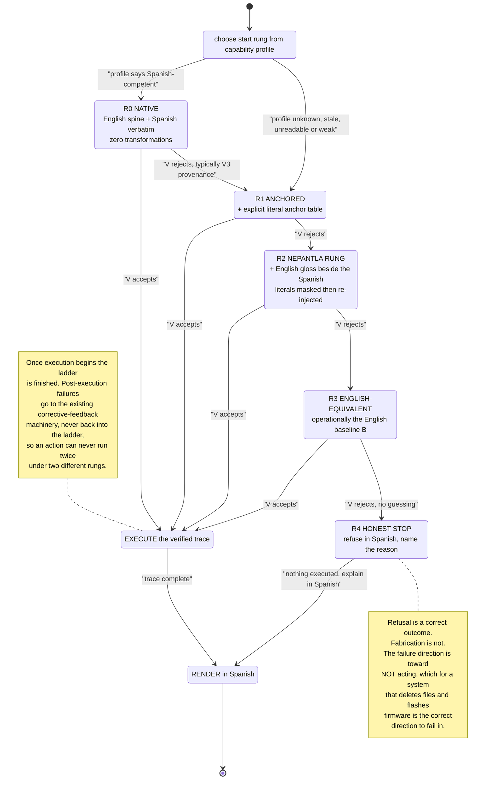
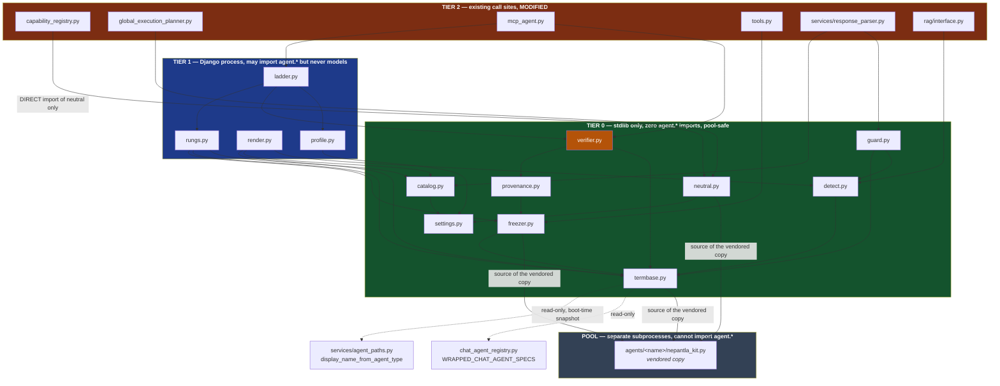
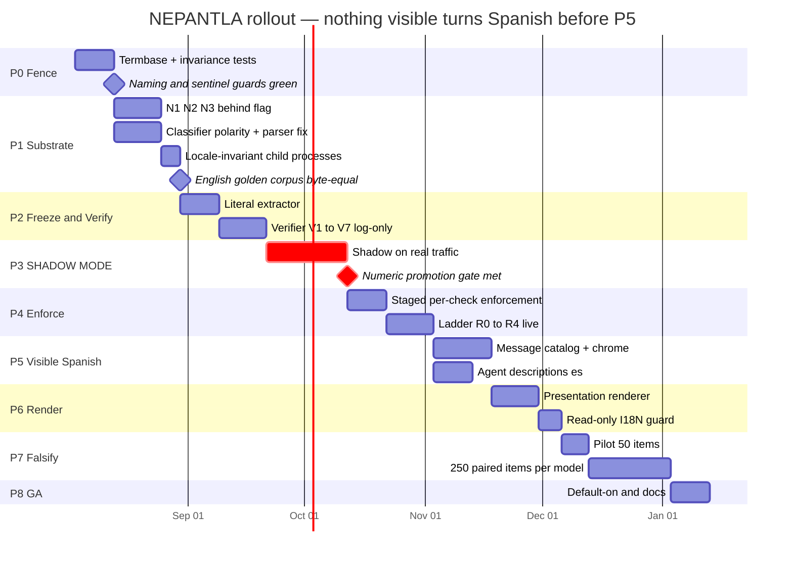
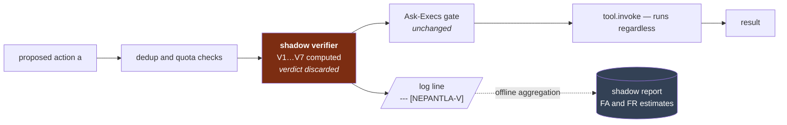

# Tlamatini — Spanish Localization: NEPANTLA Implementation Design

**Implements:** [`PAPER-v2.md`](PAPER-v2.md) — *NEPANTLA: Guaranteed Non-Inferior Execution
for a Spanish-Language LLM Operator System under Arbitrary Backend-Model Capability*
(LaTeX edition under [`paper/`](paper/)).

**Historical status:** written as a design against `v1.47.0`; no source was modified while this document was originally produced.

> **Current implementation update — 2026-09-01 / `v1.50.6s` (`1339fc7`).** The production tree now contains `agent/i18n/{policy,dnt,normalize,ui_es,termbase_en,lexicon_es,flags,model_caps}.py`, the `nepantla` template tags, Spanish prompt catalogs and dedicated tests. Channel A (GUI chrome) is translated; Channel B (user prompt) passes verbatim while a separate N1/N2/N3 scoring key is built; Channel C (model answer) is generated natively in Spanish. Machine identifiers and the embedded English technical lexicon remain invariant. Stage 0 is implemented and tested, but every production caller does not yet pass a model name and the full pre-execution PROPOSE→VERIFY→ESCALATE ladder below remains a design target. Therefore, tables marked NEW describe the intended endpoint unless a later status row explicitly says IMPLEMENTED. Current repository facts live in `docs/estado-actual-v1.50.6s.md`.

---

## What this document specifies

The paper proves that Spanish execution can be made *at least as correct as English*
for **any** backend model the operator binds, by treating cross-lingual operation as a
**verification** problem rather than a language problem. This document is how that is
built into Tlamatini.

The algorithm in four stages:

| Stage | Name | What it does |
|---|---|---|
| **1** | **FREEZE** | A lexical, language-independent extractor captures every correctness-bearing literal — paths, filenames, flags, numbers, identifiers — *before anything transforms the text*. |
| **2** | **NEUTRALISE** | Three operators (NFKD folding, boundary-aware phrase matching, canonical-key expansion) make the deterministic scoring core a function of *intent* rather than of *language*. Each is the identity on ASCII input. |
| **3** | **PROPOSE → VERIFY → ESCALATE** | The model *proposes* a tool call. A language-independent verifier (V1–V7, including **argument provenance**) checks it **before execution**. On rejection the request climbs a five-rung ladder whose terminal executable rung is operationally the English pipeline. |
| **4** | **RENDER** | The Spanish answer is produced *downstream* of the verified action, by a channel with no authority over what executed. |

Two consequences shape every decision below:

- **A miscalibrated capability probe costs latency, never correctness** (Corollary 1) — the
  profile only chooses the *starting* rung.
- **The naming invariant is a theorem, not a preference** (Corollary 2) — the guarantee holds
  only while the action vocabulary is the same set of symbols in every locale.

---

## ⛔ The invariant that governs this entire document

> **Translate what the user reads. Never translate what the machine reads.**

**Becomes Spanish:** menus, buttons, generic verbs, dialog titles, tooltips, placeholders,
instructions, wizard copy, status and error messages, validation warnings, permission
prompts, Exec Report chrome, prompt-catalog descriptions, **agent *descriptions***, and the
answer prose.

**Stays English, byte-identical, forever:** agent display names (`Emailer`, `Asker`,
`Apirer`, `Executer`, `Pythonxer`, `STM32er`, `Kyber-KeyGen`, `File-Creator`,
`De-Compresser`, `Monitor-Log`, `Node Manager`, …), tool names, argument keys,
configuration keys, CLI flags, protocol sentinels, machine verdict vocabularies, source
code and every identifier and comment in it, internal variable nomenclature, CSS classes,
element ids, `data-*` attribute values, log-line prefixes, environment variables, `.flw`
schema keys, and all user-supplied literals.

A Spanish tooltip on **Emailer** reads *"Envía correos electrónicos por SMTP cuando se
detecta un patrón en el registro."* — the sentence is Spanish, the **name is not**.

---

## Contents

1. [Architecture and the translation boundary](#1-architecture-and-the-translation-boundary)
2. [Module map and component specifications](#2-module-map-and-component-specifications)
3. [Integration points and configuration](#3-integration-points-and-configuration)
4. [Rollout, testing, packaging and risk](#4-rollout-testing-packaging-and-risk)

---


# 1. Architecture and the translation boundary

## 1. Binding Principles

This design implements NEPANTLA (PAPER-v2.md §6) inside Tlamatini as it exists at commit `3e6d514f` (v1.47.0). Everything that follows is subordinate to seven principles. They are not aspirations; each one is a rule an engineer can apply mechanically, and each one has a test that fails when it is broken.

| # | Principle | Operational statement | Why it is binding | Enforcement point |
|---|---|---|---|---|
| **P1** | **Fail-open** | Every language-layer component resolves to *today's English behaviour* on any error, missing file, unreadable cache, malformed config value or unparseable input. A language layer that raises is worse than no language layer. | Mirrors the two guards already shipping: the binary guard (`agent/rag/binary_guard.py`, banner printed at `agent/rag/factory.py:648`) and the port resolver (`Tlamatini/manage.py::_resolve_django_port`). A localization failure must never be able to stop a run. | Every `try/except` in the new modules returns the identity; no new exception type crosses into `ask_rag`. |
| **P2** | **Identity on ASCII** | The three neutralization operators N1 ∘ N2 ∘ N3 (PAPER §5.9) are provably the identity transformation on pure-ASCII input. An English prompt scores byte-identically before and after. | `_score_capability` (`agent/capability_registry.py:537`) is tuned English behaviour with years of manual balancing baked into it. Any change that perturbs it is a regression, not a feature. | Golden corpus of ~200 English prompts asserting byte-identical scores; the N2 exception set is reviewed item by item, never waved through. |
| **P3** | **Pre-execution verification** | The verifier V1–V7 runs on a **proposed** action, before `tool.invoke(...)`. A rejected proposal has changed nothing, so escalation replays planning and never state. | This is the property that makes Ladder Dominance (PAPER Theorem 1) sound. The insertion point is inside `MultiTurnToolAgentExecutor._invoke_tool` (`agent/mcp_agent.py:928`), before the invoke, after the dedup/quota checks — the same slot `_requires_exec_permission` (`agent/mcp_agent.py:799`) already occupies. | No verifier code may live downstream of an `execute`. |
| **P4** | **Presentation is downstream** | Spanish rendering happens strictly after the trace τ is fixed and verified, and it has **no authority** over the tool call. Protected spans pass through byte-identical. | Proposition 1: `s' ⟂ (ℓ(u), r) │ τ`. Downstream placement bounds a translation error to an awkward sentence; upstream placement turns it into a wrong file path. | The renderer is wired after `_render_exec_report_html` (`agent/services/response_parser.py:197`) in `process_llm_response`, before `save_message`. |
| **P5** | **Zero new dependencies** | No new package in `requirements.txt`. Folding uses `unicodedata` (stdlib), matching uses `re` (stdlib), the catalog is JSON, the termbase is derived at runtime from registries that already exist. | The carried Python (`<install>/python`) must be probed by `build.py::_CARRIED_PYTHON_REQUIRED_IMPORTS` for every dependency a pool agent touches; a new native wheel is a build-and-install event. Stdlib is free. | `pip freeze` diff must be empty across the whole localization pass. |
| **P6** | **Never on the hot path** | The capability probe runs out of band on one global worker, refuses to run while a generation is in flight, and is hard wall-clock capped. Per-request language work is O(n) in the utterance and budgeted under 4 ms total. | Angela's stated north star is per-request chat latency. On a single local GPU, "off the call stack" is not the same as "off the resource". | The English path short-circuits the entire layer at the first comparison — an English user pays one branch. |
| **P7** | **Naming invariance** | Every agent display name, tool name, argument key, config key, enumerated value, sentinel, CSS class, `data-*` value, log prefix and environment variable is byte-identical English in every locale, forever. | Corollary 2: localizing any element of the action vocabulary 𝒩 makes V1/V2/V6 locale-relative and deletes the proof. It is also already an ABI in this codebase (§2.3 below). | `agent/test_agent_display_names.py` plus a new `test_i18n_boundary.py` that fails on any Spanish string reaching a machine-channel surface. |

Two of these deserve a sentence of emphasis because they are the ones a well-meaning contributor will break.

**P4 is not "translate last for tidiness".** It is the entire reason a fully Spanish interface is compatible with a hard correctness guarantee. An upstream translation stage makes operator success decay as $p^{k}$ in the number of literals — 11.4 absolute points of failure at $k=6$, $p=0.98$ — to recover a Spanish model deficit that is 1–4 points on reasoning and approximately zero on tool selection. The intervention is an order of magnitude more harmful than the deficit it targets.

**P7 is not a style guide.** It is the hypothesis of Proposition 1 written out longhand. `Emailer` must stay `Emailer` in the Spanish build not because translating it would be untidy, but because translating it deletes the proof.

---

## 2. The Translation Boundary as an Engineering Contract

### 2.1 Two channels, one rule

Every string in Tlamatini belongs to exactly one channel. There is no third category and no "mostly presentation" hedge; a string whose channel is ambiguous is by default a **machine** string and stays English.

| | **Presentation channel** | **Machine channel** |
|---|---|---|
| Definition | Read by a human; never read back by a program | Consumed, compared, routed on, persisted or parsed by a program |
| Audience | The Spanish-speaking operator | The interpreter, the filesystem, the YAML parser, the model's tool interface, the canvas connection handlers |
| Language | **Spanish**, fully | **English, byte-identical, forever** |
| Failure mode | Cosmetic — a clumsy sentence | Catastrophic — wrong tool, wrong path, a connection silently never persisted |
| Test that guards it | Visual review, catalog completeness | `test_agent_display_names.py`, `test_i18n_boundary.py`, the golden-score corpus |

> **The rule: translate what the user reads; never translate what the machine reads.**

The boundary is implementable because Tlamatini already separates these physically. The agent *name* travels one path — `display_name_from_agent_type` (`agent/services/agent_paths.py:102`) → the boot repopulate in `agent/apps.py::AgentConfig.ready()` → `AgentConsumer.agent_establishment` (`agent/consumers.py:607`) → `populateAgentsList` (`acp-canvas-core.js:1214`) → `atomDiv.dataset.content` (line 1228) and `span.textContent` (line 1236). The agent *description* travels a completely different path — `agents_descriptions.md` → `_parse_agent_purpose_map` (`agent/views.py:93`) → `_load_agent_purpose_map` (`agent/views.py:130`) → the `agent_purpose_map` template variable (`agent/views.py:388`) → `dataset.agentPurpose` (line 1229). **Those two paths never touch.** The localization pass translates the second file and does not touch the first function. That is the whole boundary, in two code paths that already exist.

### 2.2 What becomes Spanish, and what never does — verified against the source

Left column: the concrete surface. Middle: what the Spanish build renders. Right: the verified file and symbol that owns it.

**Becomes Spanish:**

| Surface | Spanish build | Owned by (verified) |
|---|---|---|
| Sidebar tooltip / canvas Description dialog body | *"Envía un correo SMTP cuando se dispara. Remitente, contraseña, lista de destinatarios, asunto y cuerpo son configurables."* | `agents_descriptions.md:130` → `views.py:93/130/388` → `dataset.agentPurpose` (`acp-canvas-core.js:1229`) |
| Permission-dialog intro and field labels | *"Tlamatini quiere ejecutar lo siguiente antes de continuar la cadena Multi-Turn."*, *Herramienta / MCP / Agente de Tlamatini*, *Parámetros de ejecución*, *Programa a ejecutar*, *Shell a ejecutar* | `agent/templates/agent/agent_page.html:280–301` |
| Permission-dialog buttons | *Continuar* / *Denegar* | `agent_page_dialogs.js:237` and `:244` |
| Exec Report frame header | *Últimas ejecuciones* + its subtitle | `response_parser.py:233–235` |
| Exec Report caption | *Lista de operaciones de* **Emailer** | `response_parser.py:247` |
| Exec Report column headers | *Comando* · *Estado* | `response_parser.py:251–252` |
| Exec Report verdict cell | *ÉXITO* / *FALLO* | `response_parser.py:258` |
| Interrupted-execution banner | *"Ejecución interrumpida"* + its labels | `response_parser.py:272` `_render_exec_denied_banner` |
| Navbar menus, dialog titles, toolbar checkbox labels, placeholders, `aria-label`s | Fully Spanish | `agent_page.html`, `agentic_control_panel.html` |
| Catalog of Prompts category names and card copy | Fully Spanish | `views.list_prompts_view` + the `Prompt` rows |
| The answer prose | Spanish | Stage 4 renderer |

**Never becomes Spanish:**

| Class | Verified instance | File · symbol |
|---|---|---|
| Agent display names | `Emailer`, `RecMailer`, `SSHer`, `SCPer`, `SQLer`, `PSer`, `Apirer`, `Pythonxer`, `TeleTlamatini`, `J-Decompiler`, `Kyber-KeyGen`, `Kyber-Cipher`, `Kyber-DeCipher`, `STM32er`, `ESP32er`, `ESPHomer`, `PDFer`, `AudioPlayer`, `VideoPlayer`, `FlowCreator`, `MCP Doctor`, `Video-Analyzer`, `De-Compresser`, `File-Creator`, `File-Extractor`, `File-Interpreter`, `Image-Interpreter`, `Monitor-Log`, `ACPXer`, `AND`, `OR` | `agent/services/agent_paths.py:104–157` — the `overrides` map, plus the `.title()` fallback at line 160 |
| Tool names | `chat_agent_send_email`, `chat_agent_file_creator`, `execute_command`, `acp_spawn`, `invoke_skill`, `ext__<server>__<tool>` | `agent/chat_agent_registry.py`, `agent/tools.py`, `agent/acpx/tools.py` |
| Argument keys inside a wrapped-agent request | `filepath=`, `content=`, `file_path=`, `target_agents=` | parsed by `_CONJUNCTION_ASSIGNMENT_RE` (`agent/tools.py:431–434`) |
| Flow schema keys | `text` (the exported node label), `agentPurpose`, `configData`, `schemaVersion`, `connections`, plus the legacy **input-only** alias `agentName` | `agent/services/flow_spec.py:83` (alias read), `85, 96, 130, 146, 149, 150, 170, 172` |
| CSS attribute-selector values | `.agent-tool-item[data-content="Emailer"]`, `[data-content="RecMailer"]`, `[data-content="SQLer"]`, `[data-content="Pythonxer"]`, `[data-content="Asker"]`, `[data-content="Telegrammer"]`, … | `agentic_control_panel.css:2575` (`Emailer`) plus `:812, 830, 835, 919, 953, 973, 1008, 1026, 1043, 1063, 1080` (`Ender`, `Starter`, `Croner`, `Notifier`, `Stopper`, `RecMailer`, `SQLer`, `Whatsapper`, `Telegrammer`, `Pythonxer`, `Asker`) — **case-sensitive** |
| Canvas connection discriminants | `targetAgentName.toLowerCase() === 'emailer'` | `acp-canvas-core.js:887` (remove), `:1048` (removeConnectionsFor), `:1492` (mouseup/add) |
| Protocol sentinels | `END-RESPONSE`, `BEGIN-CODE<<<…>>>` / `END-CODE`, `INI_SECTION_<TYPE><<<` / `>>>END_SECTION_<TYPE>`, `TLM_VERDICT::PASS_OK` | `agent/prompt.pmt:95, 116–117, 123, 126`; the Parametrizer grammar |
| Machine verdict vocabularies | `SUCCESS` / `FAILURE` as **row values**, `completed` / `failed` / `stopped`, `APPROVE` / `REQUEST_CHANGES` | `response_parser.py:258` (the *string* is presentation; the *boolean* `row["success"]` is machine), `chat_agent_runtime.py` |
| Boundary sentinel | `<!--TLAMATINI_EXEC_REPORT_BOUNDARY-->` | `response_parser.py:55`, mirrored byte-identically in `agent_page_chat.js` |
| Log-line prefixes | `📧 EMAILER AGENT STARTED`, `--- [BINARY-GUARD]`, and the new `--- [I18N-GUARD]` | `agent/agents/emailer/emailer.py:579`; `agent/rag/factory.py:648` |
| Config keys | `unified_agent_model`, `django_port`, `binary_context_detection`, `pio_executable`, and the new `answer_language` | `agent/config.json` |
| Internal identifiers | `_score_capability`, `_tokenize`, `_STOPWORDS`, `exec_report_entries`, `_resolve_exec_report_spec` | `capability_registry.py:537, 460, 35`; `mcp_agent.py:333` |
| User-supplied literals | Every path, filename, flag, port, board id, glob, regex, git ref the operator typed | frozen as Σ(u) in Stage 1 |

Note the one genuinely subtle row. In `_render_exec_report_html` the verdict is computed as `success = bool(row.get("success"))` and only *then* turned into the display string `"SUCCESS"` / `"FAILURE"` (`response_parser.py:256–258`). The boolean is the machine channel; the string is the presentation channel; they are separated by one line of code. Spanish changes line 258 and must not touch line 256. This pattern — a machine value adjacent to its own rendering — is the shape every localization edit in this codebase should take.

### 2.3 Why naming invariance is already an ABI

Independent of the proof, the display name is load-bearing in four distinct mechanisms *today*, each of which fails differently and one of which fails **silently**:

1. **CSS matching.** `agentic_control_panel.css` selects on `[data-content="Emailer"]` — an exact, case-sensitive attribute match against the value written at `acp-canvas-core.js:1228`. Rename the display name, lose the icon gradient.
2. **Canvas connection persistence.** `acp-canvas-core.js` compares `targetAgentName.toLowerCase()` **without collapsing whitespace** (lines 887, 1048, 1492). For the hyphenated agents this is why `display_name_from_agent_type` deliberately returns `Video-Analyzer` and `De-Compresser` rather than the spaced forms — the comment at lines 142–147 records that a spaced name "matches NOTHING and the connection is silently never persisted." **No error is raised anywhere.**
3. **The per-agent enable gate.** `agent_<display>_status` keys the Configure-Agents checkbox and **fails open**, so a one-sided rename quietly disables the gate rather than erroring (comment at `agent_paths.py:148–151`).
4. **The boot repopulate.** `AgentConfig.ready()` deletes every `Agent` row on each start and rebuilds from `display_name_from_agent_type`, so a migration or a manual DB edit is overwritten on the next launch. There is exactly one place a display name is decided.

A localization pass that touched any of these would produce a build that lints clean, starts clean, renders clean — and silently stops saving canvas connections. **This is the concrete, non-theoretical reason RULE N exists.**

> **RULE N.** An agent's display name is an *identifier*, not a label. Byte-identical in every locale, in every surface, forever — exact capitalization, exact hyphens, exact spaces. What is translated is the agent's *description*, never its *name*.

---

## 3. NEPANTLA Runtime Architecture

The four stages, mapped onto the components that will host them. Stage 1 and Stage 2 are new modules; Stage 3 is an insertion inside an existing executor; Stage 4 is an append inside an existing response parser.

```mermaid
flowchart TB
    U["Utterance u &#40;Spanish&#41;<br/>WebSocket frame &rarr; AgentConsumer.receive"] --> FREEZE

    FREEZE["<b>STAGE 1 &middot; FREEZE</b><br/>extract_literals &rarr; &Sigma;&#40;u&#41;<br/>lexical, language-independent<br/>NFC only &middot; never case-fold &middot; never strip accents<br/><i>runs before anything touches u</i>"]

    FREEZE --> NEUTRAL["<b>STAGE 2 &middot; NEUTRALISE</b><br/>N1 fold &middot; N2 boundary-match &middot; N3 canonical expansion<br/>wraps _tokenize and _score_capability<br/><i>provably the identity on ASCII</i>"]

    NEUTRAL --> PLAN["build_global_execution_plan<br/>&rarr; expected action class + capability hints<br/><i>Multi-Turn still binds the FULL enabled surface</i>"]

    PLAN --> LADDER

    subgraph LADDER["<b>STAGE 3 &middot; PROPOSE then VERIFY &#40;the ladder&#41;</b>"]
        direction TB
        R0["R0 &middot; NATIVE<br/>English system spine + Spanish verbatim"]
        R1["R1 &middot; ANCHORED<br/>+ explicit &Sigma; literal table"]
        R2["R2 &middot; NEPANTLA RUNG<br/>+ English gloss beside the Spanish<br/><i>augmentation, never substitution</i>"]
        R3["R3 &middot; ENGLISH-EQUIVALENT<br/>= the English baseline B, unmodified"]
        R4["R4 &middot; HONEST STOP<br/>refuse in Spanish, name the reason"]
        R0 -->|"V rejects"| R1 -->|"V rejects"| R2 -->|"V rejects"| R3 -->|"V rejects"| R4
    end

    LADDER --> V{"<b>VERIFIER V</b><br/>V1 tool exists &middot; V2 schema &middot; V3 provenance<br/>V4 preconditions &middot; V5 gating parity<br/>V6 sentinels &middot; V7 action expectancy<br/><i>runs BEFORE tool.invoke</i>"}

    V -->|"accept"| GATE["Ask-Execs gate<br/>ExecPermissionBroker<br/><i>unchanged, Spanish chrome</i>"]
    V -->|"reject &rho;"| LADDER

    GATE --> EXEC["<b>EXECUTE</b><br/>&tau; &rarr; machine state<br/>MultiTurnToolAgentExecutor._invoke_tool"]

    EXEC --> RENDER["<b>STAGE 4 &middot; RENDER</b><br/>Spanish presentation<br/>protected spans opaque<br/><i>downstream of the decision, no authority over &tau;</i>"]

    RENDER --> GUARD["read-only I18N guard<br/>logs sentinel integrity + line-pass-rate<br/><i>never mutates the answer</i>"]

    GUARD --> OUT["Spanish answer + Spanish Exec Report<br/>English asset names verbatim"]

    PROBE[("capability profile<br/><i>chooses the START rung only</i>")] -.->|"optimisation, never a gate"| LADDER

    style FREEZE fill:#14532d,color:#fff
    style V fill:#7c2d12,color:#fff
    style R3 fill:#1e3a8a,color:#fff
    style R4 fill:#78350f,color:#fff
    style PROBE fill:#334155,color:#fff
    style GUARD fill:#3f3f46,color:#fff
```



Three properties of this picture are the design, and the rest is bookkeeping.

- **FREEZE is first.** Nothing precedes it — not the planner, not a prompt template, not a model. Whatever the pipeline does afterwards, Σ(u) is already ground truth, and V3 can always ask "does this emitted literal trace back to something the user actually wrote?"
- **V sits between proposal and execution.** That single placement is what makes rejection free and therefore what makes the ladder sound. Move the verifier one step later and Theorem 1 evaporates, because an early rung could have already mutated the filesystem.
- **PROBE is dotted, and it points at the ladder rather than at the verifier.** It selects `start`, an index. Corollary 1: a miscalibrated probe costs latency, never correctness. This is why the probe is allowed to be a cheap heuristic and why a missing profile means *start at R1*, never *refuse Spanish*.

---

## 4. One Spanish Request, End to End

The trace below is Trace A from PAPER §7.4 — *"Crea un archivo en `C:\Tlamatini\Temp\notas.txt` con el texto 'hola mundo'"* — routed through the components verified above. Note where the new stages attach: two of them are new modules, two are insertions into functions that already exist.

```mermaid
sequenceDiagram
    autonumber
    actor A as "Angela &#40;escribe en español&#41;"
    participant JS as "agent_page_init.js"
    participant C as "AgentConsumer.receive &middot; consumers.py 959"
    participant Q as "queue_llm_retrieval &middot; consumers.py 667"
    participant RAG as "ask_rag &middot; rag/interface.py 638"
    participant FR as "extract_literals &middot; NEW i18n/freeze.py"
    participant NE as "N1 N2 N3 &middot; NEW i18n/neutralize.py"
    participant CR as "_score_capability &middot; capability_registry.py 537"
    participant PL as "build_global_execution_plan &middot; planner 358"
    participant UC as "UnifiedAgentChain.invoke &middot; unified.py 313"
    participant EX as "MultiTurnToolAgentExecutor &middot; mcp_agent.py 678"
    participant SH as "SelfHealingInvoker &middot; self_healing.py 270"
    participant V as "Verifier V1-V7 &middot; NEW i18n/verify.py"
    participant PB as "ExecPermissionBroker &middot; exec_permission.py 70"
    participant TL as "chat_agent_file_creator"
    participant RP as "response_parser &middot; 197 and 272"

    A->>JS: "Crea un archivo en C&#58;\Tlamatini\Temp\notas.txt con el texto 'hola mundo'"
    JS->>C: "WebSocket frame with multi_turn_enabled, exec_report_enabled, ask_execs_enabled"
    C->>Q: "route the request, register the permission broker"
    Q->>RAG: "ask_rag with the raw Spanish question"

    rect rgb(20,83,45)
    RAG->>FR: "STAGE 1 FREEZE, before any transformation"
    FR-->>RAG: "&Sigma; = the path literal, the quoted span 'hola mundo'"
    end

    rect rgb(30,58,95)
    RAG->>NE: "STAGE 2, fold and lift into canonical keys"
    NE->>CR: "scored text, boundary-aware phrase matcher"
    CR-->>PL: "capability scores, now non-zero for file_creator"
    PL-->>UC: "expected action class = create a file"
    end

    UC->>EX: "executor payload, &Sigma; carried as immutable metadata"
    EX->>SH: "wrapped model step, 80 s watchdog"
    SH-->>EX: "PROPOSAL chat_agent_file_creator with file_path and content"

    rect rgb(124,45,18)
    EX->>V: "STAGE 3 VERIFY the proposal, nothing executed yet"
    V-->>EX: "V1 ok, V2 ok, V3 both literals trace to &Sigma;, V4-V7 ok, ACCEPT"
    end

    EX->>PB: "V5 says tier A, request permission"
    PB->>JS: "exec_permission_request, Spanish chrome, English tool name"
    JS-->>PB: "Continuar"
    PB-->>EX: "proceed"

    EX->>TL: "_invoke_tool, mcp_agent.py 928"
    TL-->>EX: "run_id, status, log excerpt"
    EX->>EX: "_resolve_exec_report_spec, mcp_agent.py 333, captures the row"

    rect rgb(63,63,70)
    EX-->>RP: "STAGE 4 RENDER, downstream of the decision"
    RP->>RP: "_render_exec_report_html, Spanish chrome, caption keeps File-Creator verbatim"
    RP->>RP: "read-only I18N guard logs sentinel integrity, never mutates"
    end

    RP->>C: "answer + EXEC_REPORT_BOUNDARY + Spanish tables, then save_message"
    C-->>A: "Respuesta en español, nombres de agente en inglés"
```

Two details in that sequence carry the guarantee and are easy to get wrong in implementation.

**Σ is created at step 5 and consumed at step 15.** It must ride the payload as immutable metadata across `ask_rag` → `UnifiedAgentChain.invoke` → the executor sub-payload. `UnifiedAgentChain.invoke` rebuilds its payload from a **hardcoded key whitelist**; `exec_report_enabled` was silently dropped by that whitelist once already, and `ask_execs_enabled` plus `conversation_user_id` had to be added for the same reason. The frozen literal set and the resolved language are exactly the same bug class. **Add `nepantla_sigma`, `answer_language` and `nepantla_start_rung` to that whitelist in the same commit that introduces them, or the feature will silently never engage.**

**The permission dialog is rendered in Spanish and names the tool in English.** `showExecPermissionDialog` (`agent_page_dialogs.js:171`) fills `#exec-perm-agent`, `#exec-perm-toolname`, `#exec-perm-program`, `#exec-perm-shell` (lines 176–180) from the detail dict built by `_extract_exec_report_command` (`mcp_agent.py:723`). The **labels** around those fields (`agent_page.html:283, 287, 291, 295, 299`) are Spanish; the **values** inside them are byte-exact machine strings. Translating a value here would mean the operator approves one thing and the machine runs another.

---

## 5. The Escalation Ladder

Each rung differs from its predecessor only by **adding information**, never by removing or replacing it. Every transition out of a rung is a verifier rejection, and every rejection is free because nothing was executed.



| Rung | What it adds | Recovers which deficiency class | Typical cost |
|---|---|---|---|
| **R0** | Nothing — Spanish verbatim under the byte-stable English system spine | none needed | 1 model call |
| **R1** | A machine-readable anchor table listing every element of Σ with "reproduce byte-for-byte, never translate, never normalise" | **C3** literal infidelity — the most common single rejection | +1 |
| **R2** | An English gloss placed *beside* the Spanish original, produced with Σ masked out and re-injected verbatim | **C2** weak comprehension | +1 |
| **R3** | The baseline's own system spine, tool schemas and generation parameters, driven by the English rendering | **C2** residual; this rung *is* $B$ | +1 |
| **R4** | Nothing executes; a Spanish refusal naming the rejection reason, the literal or tool involved, and the concrete remedy | the undecidable residue | 0 |

The gloss at R2 is a translation sitting upstream of a decision, which Principle T forbids — and the contradiction is only apparent. The literals **bypass the gloss entirely**: they are masked out before it is produced, re-injected verbatim afterwards, and then re-checked by V3. The only thing the gloss can influence is *which tool* is chosen, and that influence is additive evidence subject to the same verifier.

Reaching R3 is invisible to the operator except as a small latency cost and a status note, because the answer is still produced by Stage 4. **The user never sees English as a consequence of escalation.**

---

## 6. How a Spanish UI Renders an English Asset Name

This is the section a reviewer should read first when checking whether a localization commit is correct, because it is the pattern every surface must follow: **Spanish sentence, English name embedded verbatim.** That is also how Spanish-speaking engineers already write — *"corre el linter"*, *"revisa el commit"*, *"el flag `--noreload`"* — so the result reads naturally rather than as an untranslated remnant.

Worked before-and-after across six surfaces, using `Emailer` (and `Apirer`, `File-Creator`, `Asker` where the surface differs). Every "owned by" reference below was verified in the source.

| # | Surface | English build renders | Spanish build renders | Byte-identical part | Owned by |
|---|---|---|---|---|---|
| 1 | **Sidebar item** | `Emailer` | `Emailer` | **the whole label** | `span.textContent = description` — `acp-canvas-core.js:1236`, fed by `display_name_from_agent_type` (`agent_paths.py:108`) |
| 2 | **Sidebar tooltip / Description dialog** | *"Sends an SMTP email when triggered. Configurable sender, password, list of recipients, subject, and body."* | *"Envía un correo SMTP cuando se dispara. Remitente, contraseña, lista de destinatarios, asunto y cuerpo son configurables."* | *nothing* — this cell is pure presentation | `agents_descriptions.md:130` → `views.py:93/130/388` → `dataset.agentPurpose` (`acp-canvas-core.js:1229`) |
| 3 | **Canvas node label** | `Emailer` | `Emailer` | **the whole label** | `applyAgentTypeClass` (`acp-canvas-core.js:361`) + `[data-content="Emailer"]` (`agentic_control_panel.css`) |
| 4 | **Exec Report caption** | `List of Emailer Operations` | *Lista de operaciones de* `Emailer` | `Emailer` | `response_parser.py:247`; display comes from `_resolve_exec_report_spec` (`mcp_agent.py:333`) |
| 5 | **Exec Report headers + verdict** | `Command` · `Status` · `SUCCESS` / `FAILURE` | *Comando* · *Estado* · *ÉXITO* / *FALLO* | *nothing* — but the underlying `bool(row["success"])` at line 256 is untouched | `response_parser.py:251–252, 258` |
| 6 | **Ask-Execs permission prompt** | "Tlamatini wants to run the following…" · `Tlamatini Tool / MCP / Agent` → `Apirer` · `Underlying tool` → `chat_agent_apirer` · buttons `Proceed` / `Deny` | *"Tlamatini quiere ejecutar lo siguiente…"* · *Herramienta / MCP / Agente de Tlamatini* → `Apirer` · *Herramienta subyacente* → `chat_agent_apirer` · botones *Continuar* / *Denegar* | `Apirer`, `chat_agent_apirer`, the program and shell textarea **contents** | `agent_page.html:280–301`; `agent_page_dialogs.js:171, 176–180, 237, 244` |
| 7 | **Log line** | `📧 EMAILER AGENT STARTED` | `📧 EMAILER AGENT STARTED` | **the whole line** | `agent/agents/emailer/emailer.py:579` |
| 8 | **Generated `.flw` node** | `"text": "Emailer"` | `"text": "Emailer"` | **key and value** | `flow_spec.py:146` — the exporter writes the node label as `text`; `agentName` is only a legacy **input** alias, accepted at `:83` |
| 9 | **Answer prose** | "I launched Asker and it is waiting for your choice." | *"Ya lancé* `Asker` *y está esperando tu elección."* | `Asker` | Stage 4 renderer, protected spans |
| 10 | **Interrupted-execution banner** | "Execution interrupted" + `File-Creator` | *"Ejecución interrumpida"* + `File-Creator` | `File-Creator` | `response_parser.py:272` `_render_exec_denied_banner` |

Read the "byte-identical part" column downward and the contract becomes mechanical:

- Rows **1, 3, 7, 8** are **100% machine channel**. A Spanish build changes *nothing* on these surfaces. If a diff touches `acp-canvas-core.js:1236`, `agent_paths.py:104–157`, an `AGENT STARTED` log string, or a `.flw` key, it is wrong.
- Rows **2, 5** are **100% presentation channel**. These are the files a translator edits: `agents_descriptions.md` and the chrome strings in `response_parser.py` / `agent_page.html`.
- Rows **4, 6, 9, 10** are **mixed**, and they are where every real bug will live. The invariant for a mixed surface is: *the sentence is a Spanish template; the identifier is an interpolated opaque span.* `f'List of {display} Operations'` becomes `f'Lista de operaciones de {display}'` — the format string is translated, `display` is never touched.

The renderer enforces this with a **protected-span mask** built from Σ(u) ∪ TERMBASE, where the termbase is derived at runtime from surfaces that already exist — the `overrides` map in `agent_paths.py:104`, the tool names in `chat_agent_registry.WRAPPED_CHAT_AGENT_SPECS`, the sentinels in `prompt.pmt`, and the flow keys in `flow_spec.py`. It is **derived, never hand-maintained**, so a new agent added tomorrow is protected the day it lands without anyone remembering to add it to a list.

Finally, the guard that watches all of this is **read-only by policy**. It logs sentinel integrity and an answer-language line-pass-rate over masked prose only, under the prefix `--- [I18N-GUARD]` — deliberately shaped like the existing `--- [BINARY-GUARD]` banner (`agent/rag/factory.py:648`) so it greps the same way in `tlamatini.log`. It never rewrites the answer. An answer-rewriting pass driven by an uncalibrated language detector is a corruption engine, and because `process_llm_response` persists the answer via `save_message` **after** the Exec Report is appended, a false repair would be replayed on every chat reload forever. Repair is unlocked only by a measured false-positive rate — never by default.

---

# 2. Module map and component specifications

## 2. Module Map and Component Specifications

This part specifies the **new code**: one new package, its thirteen modules, their public
signatures, their failure modes, and the import discipline that keeps a language layer from
ever taking down the deterministic control plane it sits beside.

Everything here is written against the code as it exists at `v1.47.0`. Every path, function
and line number cited below was located by searching the tree, not recalled.

---

### 2.1 The one rule this whole package exists to preserve

NEPANTLA's guarantee (`PAPER-v2.md` §3.2, Proposition 1; §6.10, Corollary 2) holds only while
the **action vocabulary is language-invariant**. Every module below is therefore built so that
the only Spanish it can ever produce lands in the presentation channel:

| Channel | Owned by | Language |
|---|---|---|
| Machine — tool names, agent display names, argument keys, config keys, CLI flags, sentinels, CSS classes, `data-*` values, log prefixes, environment variables, `.flw` schema keys, source identifiers and comments | `termbase.py`, `verifier.py`, everything in `pool_kit/` | **English, byte-identical, forever** |
| Presentation — menus, buttons, verbs, tooltips, placeholders, instructions, messages, report chrome, agent *descriptions*, answer prose | `catalog.py`, `render.py` | **Spanish** |

`Emailer`, `Asker`, `Apirer`, `Executer`, `Pythonxer`, `STM32er`, `Kyber-KeyGen`,
`File-Creator`, `De-Compresser`, `Monitor-Log`, `Node Manager` are **identifiers**. They are
resolved today by `display_name_from_agent_type` at `Tlamatini/agent/services/agent_paths.py:102`,
whose `overrides` map is the real source of truth (the `Agent` table is deleted and rebuilt on
every boot). **No module in this package writes to that map, reads a localized variant of it,
or emits a translated agent name into any structure a program reads.** `termbase.py` consumes
it read-only, and only to build the *protected-span* set that guarantees those names survive
the Spanish renderer byte-identical.

Source code is machine channel, so **every module name, class name, function name, parameter
name, enum member and comment in this package is English.** The Spanish lives in JSON data
files, never in Python identifiers.

---

### 2.2 Package placement

```
Tlamatini/agent/nepantla/
```

A peer of `agent/rag/`, `agent/acpx/`, `agent/skills/` and `agent/services/` — the existing
convention for a cross-cutting runtime subsystem with its own lifecycle. It is deliberately
**not** placed under `agent/services/` (that package is seven modules of flow/answer
post-processing: `agent_contracts.py`, `agent_paths.py`, `filesystem.py`, `flow_compiler.py`,
`flow_spec.py`, `response_parser.py`) and **not** under `agent/rag/` (NEPANTLA wraps the
operator loop, not retrieval).

```
Tlamatini/agent/nepantla/
├── __init__.py               NEW  — DELIBERATELY EMPTY. No imports. No re-exports.
├── settings.py               NEW  — config resolution, fail-open (binary_guard pattern)
├── termbase.py               NEW  — the machine-identifier set (protected spans)
├── freezer.py                NEW  — Stage 1: literal extraction, Sigma
├── neutral.py                NEW  — N1 / N2 / N3, identity on ASCII
├── lexicon_es.json           NEW  — data-only N3 canonical-key lexicon
├── detect.py                 NEW  — closed-set language detector + prose masking
├── provenance.py             NEW  — Sigma union R(H) union D, the NFC comparison rule
├── verifier.py               NEW  — V1..V7, Verdict, RejectionReason
├── rungs.py                  NEW  — prompt builders R0..R4
├── ladder.py                 NEW  — the ladder runner
├── profile.py                NEW  — capability profile (start rung only)
├── render.py                 NEW  — Stage 4 presentation renderer
├── guard.py                  NEW  — read-only I18N guard, "--- [I18N-GUARD]"
├── catalog.py                NEW  — message catalog loader
├── messages/
│   ├── en.json               NEW  — key -> English string (the fallback floor)
│   └── es.json               NEW  — key -> Spanish string
└── pool_kit/
    ├── __init__.py           NEW  — empty
    └── nepantla_kit.py       NEW  — pool-safe vendored kit (stdlib only)
```

Data files (`lexicon_es.json`, `messages/*.json`) sit **inside the package** so PyInstaller's
`--add-data` and `copy_source_assets.py` carry them by the same rule that already carries
`agent/skills_pkg/*/SKILL.md`. Their *keys* are English identifiers; only their *values* are
Spanish.

---

### 2.3 The dependency graph



Two properties of this graph are load-bearing.

**The graph is acyclic and Tier 0 is a sink.** `verifier.py` is the single most important
module and it imports *nothing* from `agent.*`. It receives everything it needs about the live
system — the bound tool names, the argument schemas, the precondition probes, the Ask-Execs
tier function — as **injected callables** (`VerifierContext`, §2.10). That is what lets the
verifier be unit-tested without Django, vendored into a pool agent, and, critically, keeps
`mcp_agent.py → verifier.py → mcp_agent.py` from becoming an import cycle.

**`capability_registry.py` imports `neutral.py` and nothing else.** See §2.4.

---

### 2.4 Import discipline

`agent/capability_registry.py` is imported at module scope by `agent/global_execution_planner.py`
and by `agent/mcp_agent.py`, and it itself imports `WRAPPED_CHAT_AGENT_SPECS` from
`chat_agent_registry.py` at line 15. It is the hottest deterministic path in the product and it
runs on **every** request. An `ImportError` anywhere in its transitive closure does not degrade
the scorer — it kills chain construction.

| # | Rule | Enforced by |
|---|---|---|
| **I1** | `agent/nepantla/__init__.py` contains a docstring and `__all__: list[str] = []` and **zero import statements**. There is no facade. | `test_nepantla_imports.py::test_package_init_has_no_imports` — parses the file with `ast` and asserts no `Import` / `ImportFrom` node exists |
| **I2** | `capability_registry.py` imports **only** `from .nepantla.neutral import ...` — a direct module import, never `from .nepantla import ...`, never `verifier`, `ladder`, `render`, `catalog` or `profile`. | `test_nepantla_imports.py::test_capability_registry_imports_only_neutral` — AST walk over `capability_registry.py` |
| **I3** | Tier 0 modules import **only** the Python standard library plus other Tier 0 modules. No `django`, no `agent.models`, no `langchain`, no third-party package. | `test_nepantla_imports.py::test_tier0_is_stdlib_only` — AST walk over each Tier 0 file against an allowlist |
| **I4** | No module in `nepantla/` imports `agent.models`, `django.db`, or performs an ORM query at import time. Profile persistence goes through `global_state` and a JSON file next to `config.json`, never a DB table. | AST walk + a `SimpleTestCase` (no DB) that imports every module in the package |
| **I5** | `pool_kit/nepantla_kit.py` imports **only** the standard library. It never imports `agent.*` — pool agents are separate subprocesses spawned with the carried Python and have no `sys.path` back into the Django app. | `test_nepantla_pool_kit.py::test_kit_is_importable_in_isolation` — runs `python -I -c "import nepantla_kit"` in a temp dir containing only the file |
| **I6** | The vendored copies under `agent/agents/<name>/nepantla_kit.py` are **byte-identical** to `agent/nepantla/pool_kit/nepantla_kit.py`. | `test_nepantla_pool_kit.py::test_vendored_copies_match_source` — SHA-256 comparison |
| **I7** | Every `nepantla` import inside a Tier 2 file is wrapped in `try/except Exception` with a module-level `_NEPANTLA_AVAILABLE: bool` flag, and every call site is guarded by that flag. A broken language layer degrades the product to its current English behaviour; it never prevents boot. | `test_nepantla_imports.py::test_call_sites_are_guarded` |
| **I8** | No module in `nepantla/` writes to `agent/services/agent_paths.py::display_name_from_agent_type`, to `chat_agent_registry.ChatWrappedAgentSpec.display_name`, or to any structure keyed on an agent display name. Read-only, always. | `test_nepantla_naming_invariance.py` (see §2.19) |

Rule **I2** deserves its justification in one sentence, because it looks pedantic and is not: a
facade `__init__.py` that re-exported `Verifier` would drag `provenance.py` and `termbase.py`
into `capability_registry`'s import graph, and a single typo in the verifier would take the
tool scorer — and therefore the entire chat page — offline for an English user who never asked
for Spanish. An empty `__init__.py` makes that failure mode structurally unreachable rather
than merely unlikely.

---

### 2.5 `settings.py` — configuration resolution

| | |
|---|---|
| **Path** | `Tlamatini/agent/nepantla/settings.py` |
| **Status** | **NEW** |
| **Tier** | 0 — stdlib only |
| **Responsibility** | Read the NEPANTLA keys out of `config.json` once per load, validate them, and hand back an immutable settings object. Pure mirror of the pattern already proven by `resolve_settings` at `Tlamatini/agent/rag/binary_guard.py:414`. |
| **May import `agent.*`?** | **No.** It accepts the already-loaded config `dict`. The caller (`rag/factory.py`, `mcp_agent._load_config` at `mcp_agent.py:530`) owns file resolution. |

```python
@dataclass(frozen=True)
class NepantlaSettings:
    enabled: bool = True                      # master switch
    ui_language: str = "en"                   # "en" | "es"
    literal_freezing_enabled: bool = True
    neutralization_enabled: bool = True
    verifier_enabled: bool = True
    default_start_rung: str = "R1"            # used when no profile exists
    max_rung: str = "R3"                      # last executable rung
    profile_ttl_hours: float = 24.0
    guard_enabled: bool = True
    guard_log_each_line: bool = False
    renderer_wall_clock_seconds: float = 6.0
    verifier_error_fuse: int = 3              # see §2.10 failure mode


def resolve_settings(config: Mapping[str, Any] | None) -> NepantlaSettings: ...
def is_spanish_build(settings: NepantlaSettings) -> bool: ...
```

Config keys are machine channel and therefore English: `nepantla_enabled`, `ui_language`,
`nepantla_literal_freezing_enabled`, `nepantla_neutralization_enabled`,
`nepantla_verifier_enabled`, `nepantla_default_start_rung`, `nepantla_max_rung`,
`nepantla_profile_ttl_hours`, `nepantla_guard_enabled`, `nepantla_guard_log_each_line`,
`nepantla_renderer_wall_clock_seconds`, `nepantla_verifier_error_fuse`.

**Failure mode — FAIL-OPEN.** Any missing key, wrong type, out-of-range number or unparseable
value resolves to the dataclass default and never raises. `resolve_settings(None)` returns
defaults. This is the same contract the port resolver
(`Tlamatini/manage.py::_resolve_django_port`) and the binary guard already honour: a config
typo must never stop the server from starting.

---

### 2.6 `termbase.py` — the machine-identifier set

| | |
|---|---|
| **Path** | `Tlamatini/agent/nepantla/termbase.py` |
| **Status** | **NEW** |
| **Tier** | 0 — stdlib only at runtime; built from an injected snapshot |
| **Responsibility** | Own the authoritative, **English, byte-identical** set of every symbol the machine reads. It is (a) the last recogniser class in the literal freezer, (b) the protected-span mask the renderer must never translate, (c) the sentinel table V6 checks against. |
| **May import `agent.*`?** | **No at module scope.** It exposes `build_termbase(...)` which *accepts* the live registries. A thin Tier 1 helper in `render.py` and `ladder.py` supplies them. A built-in static fallback covers the pool-kit case. |

```python
class TermClass(str, Enum):
    AGENT_DISPLAY_NAME = "agent_display_name"
    TOOL_NAME          = "tool_name"
    POOL_NAME          = "pool_name"
    CONFIG_KEY         = "config_key"
    CONFIG_FIELD       = "config_field"
    SENTINEL           = "sentinel"
    VERDICT_WORD       = "verdict_word"
    CLI_FLAG           = "cli_flag"
    ENV_VAR            = "env_var"
    FLW_SCHEMA_KEY     = "flw_schema_key"
    BRAND              = "brand"


@dataclass(frozen=True)
class Termbase:
    by_class: Mapping[TermClass, frozenset[str]]
    all_terms: frozenset[str]
    max_term_words: int

    def contains(self, token: str) -> bool: ...
    def classify(self, token: str) -> TermClass | None: ...
    def protected_spans(self, text: str) -> tuple[tuple[int, int, str], ...]: ...


def build_termbase(
    *,
    agent_display_names: Iterable[str] = (),
    tool_names: Iterable[str] = (),
    config_keys: Iterable[str] = (),
    extra: Mapping[TermClass, Iterable[str]] | None = None,
) -> Termbase: ...

def builtin_termbase() -> Termbase: ...       # static fallback, no live registries
def default_termbase() -> Termbase: ...       # lru_cache(maxsize=1) over the live build
```

**Sources it is built from — all read-only:**

| `TermClass` | Live source (verified) |
|---|---|
| `AGENT_DISPLAY_NAME` | `display_name_from_agent_type` at `agent/services/agent_paths.py:102` applied over the `agents/` directory listing, plus `ChatWrappedAgentSpec.display_name` from `agent/chat_agent_registry.py:14` |
| `TOOL_NAME` | `spec.tool_name` over `WRAPPED_CHAT_AGENT_SPECS` (`agent/chat_agent_registry.py:28`), the direct `@tool` names returned by `get_mcp_tools` (`agent/tools.py:4446`), `ACPX_TOOL_NAMES` (`agent/capability_registry.py:57`), and any live `ext__<server>__<tool>` names |
| `POOL_NAME` | `normalize_agent_type` at `agent/services/agent_paths.py:64` over the same listing, plus the `<base>_<N>` cardinal form |
| `CONFIG_KEY` | the top-level key set of the loaded `config.json` |
| `CONFIG_FIELD` | the union of `parametrizer_fields` and `connection_fields` from `agent/services/agent_contracts.py` |
| `SENTINEL` | static: `END-RESPONSE`, `BEGIN-CODE`, `END-CODE`, `INI_SECTION_`, `END_SECTION_`, `TLM_VERDICT::`, `VERDICT:`, `EXEC_REPORT_BOUNDARY` (the literal `<!--TLAMATINI_EXEC_REPORT_BOUNDARY-->` at `agent/services/response_parser.py:55`), `--- [BINARY-GUARD]`, `--- [I18N-GUARD]`, `AGENT STARTED` |
| `VERDICT_WORD` | static: `APPROVE`, `REQUEST_CHANGES`, `COMMENT`, `PASS_OK`, `FAIL_NO_MOTION`, `FAIL_WRONG_MOTION`, `UNCLEAR`, `completed`, `failed`, `stopped`, `skipped`, `refused` |
| `CLI_FLAG` | shape-recognised at freeze time; the static set seeds the known ones (`--noreload`, `--self-modify`, `--collect-all`, `-sT`, `-oX`, `-p-`) |
| `ENV_VAR` | static: `TLAMATINI_TEMP`, `TLAMATINI_TEMPLATES`, `AGENT_REANIMATED`, `PDCP_API_KEY`, `CONFIG_PATH`, `OLLAMA_KEEP_ALIVE`, `FOR_DISABLE_CONSOLE_CTRL_HANDLER` |
| `FLW_SCHEMA_KEY` | static: `agentName`, `configData`, `connections`, `schemaVersion`, `agentPurpose`, `_parametrizer_mappings` |
| `BRAND` | static: `Tlamatini`, `XAIHT`, `Angela López Mendoza`, `ACPX`, `Multi-Turn`, `Exec report`, `Ask Execs`, `System-Metrics`, `Files-Search`, `NEPANTLA` |

`Angela López Mendoza` is in `BRAND` and therefore in the protected-span set. Her name is never
transformed, transliterated, or accent-stripped by any operator in this package, in any locale.

**Failure mode — FAIL-OPEN, degrading to `builtin_termbase()`.** If a live registry cannot be
read, `default_termbase()` logs once and returns the static built-in set. The consequence is a
*smaller* protected-span set, which costs renderer fidelity (an agent name might get
paraphrased in prose) and never costs execution correctness — V1 and V6 check against the
injected live tool surface, not against the termbase. `contains()` on a `None` or non-string
argument returns `False` rather than raising.

---

### 2.7 `freezer.py` — Stage 1, Native-Token Locking

| | |
|---|---|
| **Path** | `Tlamatini/agent/nepantla/freezer.py` |
| **Status** | **NEW** |
| **Tier** | 0 — stdlib only (`re`, `unicodedata`) |
| **Responsibility** | Walk the raw utterance **before anything touches it** and produce the frozen literal set Σ. Shape-based, never meaning-based, therefore language-independent. Deliberately over-extracts. |
| **May import `agent.*`?** | **No.** Takes an optional `Termbase` argument. |

```python
class LiteralClass(str, Enum):
    WINDOWS_PATH   = "windows_path"
    UNC_PATH       = "unc_path"
    POSIX_PATH     = "posix_path"
    FILENAME       = "filename"
    EXTENSION      = "extension"
    GLOB           = "glob"
    REGEX          = "regex"
    CLI_FLAG       = "cli_flag"
    QUANTITY       = "quantity"
    HOST_PORT      = "host_port"
    URL            = "url"
    EMAIL          = "email"
    GIT_REF        = "git_ref"
    ENV_VAR        = "env_var"
    IDENTIFIER     = "identifier"          # snake_case / dotted / CamelCase token
    MACHINE_TERM   = "machine_term"        # exact hit in the Termbase
    QUOTED_SPAN    = "quoted_span"
    SENTINEL       = "sentinel"


class LiteralOrigin(str, Enum):
    UTTERANCE        = "utterance"          # verbatim substring of u
    DERIVED_ANCESTOR = "derived_ancestor"   # a parent directory of an extracted path
    DERIVED_BASENAME = "derived_basename"   # the basename of an extracted path
    DERIVED_SEPARATOR= "derived_separator"  # the same path with '/' <-> '\\' swapped
    DERIVED_UNQUOTED = "derived_unquoted"   # a quoted span with its quotes removed


@dataclass(frozen=True)
class Literal:
    text: str                 # NFC-normalised, otherwise byte-exact
    raw: str                  # exactly as it appeared in u
    literal_class: LiteralClass
    origin: LiteralOrigin
    start: int                # -1 for derived entries
    end: int                  # -1 for derived entries


@dataclass(frozen=True)
class FrozenLiterals:
    available: bool                       # False ONLY when extraction itself failed
    literals: tuple[Literal, ...]
    texts: frozenset[str]                 # NFC text of every literal, incl. derived
    utterance_nfc: str

    def __contains__(self, value: str) -> bool: ...
    def by_class(self, literal_class: LiteralClass) -> tuple[Literal, ...]: ...
    def anchor_table(self, limit: int = 24) -> str: ...   # the R1 "L1 = ..." block


def extract_literals(
    utterance: str,
    *,
    termbase: "Termbase | None" = None,
    max_literals: int = 256,
) -> FrozenLiterals: ...

def mask_literals(text: str, frozen: FrozenLiterals) -> tuple[str, Mapping[str, str]]: ...
def unmask_literals(text: str, mapping: Mapping[str, str]) -> str: ...
def nfc(value: str) -> str: ...
```

#### 2.7.1 The recogniser table

Implementable as written. Patterns are `re.VERBOSE`, compiled once at module import, applied in
this order; an earlier class wins the span, and every recogniser is applied to the **NFC form of
the raw utterance** with no case folding and no accent stripping.

| # | `LiteralClass` | Shape it matches | Real example | Derived entries also added |
|---|---|---|---|---|
| 1 | `MACHINE_TERM` | Exact, case-sensitive membership in the `Termbase` (longest-match first, up to `max_term_words` tokens) | `Kyber-KeyGen`, `chat_agent_file_creator`, `TLAMATINI_TEMP`, `bluepill_f103c8` | — |
| 2 | `SENTINEL` | `INI_SECTION_[A-Z0-9_]+`, `>>>END_SECTION_[A-Z0-9_]+`, `TLM_VERDICT::[A-Z_]+`, `END-RESPONSE`, `BEGIN-CODE<<<…>>>`, `VERDICT:\s*[A-Z_]+` | `TLM_VERDICT::PASS_OK`, `INI_SECTION_GREPPER` | — |
| 3 | `UNC_PATH` | `\\\\[^\s\\]+(?:\\[^\s\\<>:"\|?*]+)+` | `\\build01\share\out.log` | ancestors |
| 4 | `WINDOWS_PATH` | `[A-Za-z]:[\\/](?:[^\s\\/<>:"\|?*]+[\\/]?)*` — drive letter, colon, separator run | `C:\Tlamatini\Templates\leg_ctrl` | `C:\Tlamatini\Templates` and `C:\Tlamatini` (ancestor), `leg_ctrl` (basename), `C:/Tlamatini/Templates/leg_ctrl` (separator) |
| 5 | `POSIX_PATH` | `(?:\.{0,2}/)?(?:[\w.@+-]+/){1,}[\w.@+-]*` — at least two slash-separated segments | `/usr/local/bin/pio` | ancestors, basename |
| 6 | `URL` | `[a-z][a-z0-9+.-]*://[^\s<>"]+` | `https://github.com/XAIHT/Tlamatini.git` | — |
| 7 | `EMAIL` | `[\w.+-]+@[\w-]+\.[\w.-]+` | `angela@xaiht.org` | — |
| 8 | `HOST_PORT` | `(?:\d{1,3}(?:\.\d{1,3}){3}\|[a-z0-9][\w.-]*)\:\d{1,5}\b` | `127.0.0.1:5000` | host alone, port alone |
| 9 | `GLOB` | Token containing `*`, `?` or `[…]` outside quotes | `*.log`, `**/*.md` | — |
| 10 | `REGEX` | A quoted or backticked span with ≥2 regex metacharacters from `^$.*+?[]{}()\|\\` | `^ERROR:.*$` | unquoted form |
| 11 | `CLI_FLAG` | `(?<![\w-])--?[A-Za-z][\w-]*(?:=\S+)?` | `--noreload`, `-sT`, `--collect-all` | value after `=` |
| 12 | `FILENAME` | `[\w.@ +()-]+\.[A-Za-z0-9]{1,8}\b` not already inside a path span | `informe_año.pdf`, `tlamatini.log`, `notas.txt` | stem, extension |
| 13 | `EXTENSION` | `(?<!\w)\.[A-Za-z0-9]{1,8}\b` standing alone | `.flw`, `.pmt` | — |
| 14 | `GIT_REF` | `\b(?:HEAD(?:~\d+)?\|origin/[\w./-]+\|[0-9a-f]{7,40})\b` | `HEAD~1`, `origin/main`, `3e6d514f` | — |
| 15 | `ENV_VAR` | `%[A-Z_][A-Z0-9_]*%`, `\$[A-Z_][A-Z0-9_]*`, or an all-caps `[A-Z][A-Z0-9_]{2,}` token that is in the `ENV_VAR` termbase class | `%LOCALAPPDATA%`, `$TLAMATINI_TEMP`, `PDCP_API_KEY` | name without sigils |
| 16 | `QUANTITY` | `[+-]?\d[\d_]*(?:[.,]\d+)?\s?(?:[A-Za-z%°]{1,4})?` — digits with optional decimal separator and unit | `115200`, `1.5`, `8 GB`, `5` | numeric part alone when a unit was attached |
| 17 | `IDENTIFIER` | `\b[a-z][a-z0-9]*(?:[_.][a-z0-9]+)+\b` (snake/dotted) or `\b[A-Z][a-z]+(?:[A-Z][a-z]+)+\b` (Camel) | `target_agents`, `django_port`, `nucleo_h743zi`, `FlowCreator` | — |
| 18 | `QUOTED_SPAN` | Balanced `'…'`, `"…"`, `«…»`, `“…”`, `` `…` `` | `'hola mundo'` | unquoted body |

**Why over-extraction is correct and cheap.** A false positive adds one entry to Σ and costs one
extra line in the R1 anchor table. A false negative silently removes a literal from V3's
protection and voids Proposition 2 for that literal. `PAPER-v2.md` §9 makes extraction recall an
evaluation target for exactly this reason. Rows 16 and 17 are the deliberately greedy ones:
`QUANTITY` will happily freeze the `5` in *"muéstrame las últimas 5 líneas"*, which is precisely
the behaviour Trace A depends on.

**Why the derived entries exist.** They collapse a whole family of would-be special cases in the
comparison rule. Instead of teaching V3 that `C:/Temp/a.txt` and `C:\Temp\a.txt` are "the same
path" — a fuzzy rule that would have to be maintained forever and would eventually let a real
difference through — the *freezer* emits both, and V3 keeps one rule: **exact NFC membership**.
Likewise `output_dir='C:\Tlamatini\Templates'` derived from a user-supplied
`C:\Tlamatini\Templates\leg_ctrl` passes because the ancestor is in Σ, tagged
`DERIVED_ANCESTOR`, and V3 accepts a derived entry only for an argument key the tool schema
declares directory-typed (§2.10).

**NFC only.** `nfc()` is `unicodedata.normalize("NFC", value)` and nothing else. No
`casefold()`, no `NFKD`-plus-strip-marks, no `os.path.normcase`. `informe_año.pdf` typed on a
Mac (decomposed `n` + U+0303) and on Windows (composed U+00F1) unify; `informe_ano.pdf` and
`informe_año.pdf` stay **different paths**, because they are. This is the one place in the
package where the aggressive folding of `neutral.N1` is forbidden, and the two functions live in
different modules so the wrong one cannot be reached by autocomplete.

**Failure mode — FAIL-OPEN, with a critical distinction.**

| Situation | Result | Downstream effect |
|---|---|---|
| Extraction succeeded, utterance genuinely contains no literals | `FrozenLiterals(available=True, texts=frozenset())` | V3 **runs** and rejects any literal the model invents. This is Trace C and it is the whole point. |
| Extraction raised, timed out, or the input was not a string | `FrozenLiterals(available=False, texts=frozenset())` | V3 is **skipped** with reason `V3_SKIPPED_NO_FREEZE`; the request degrades to today's unverified behaviour rather than refusing everything. |

Conflating those two states is the single most dangerous implementation error in this package:
treat a failed extraction as an empty Σ and every request in the product becomes an honest stop.
`available` is therefore a required positional field of the dataclass, not a defaulted one.

---

### 2.8 `neutral.py` — N1, N2, N3

| | |
|---|---|
| **Path** | `Tlamatini/agent/nepantla/neutral.py` |
| **Status** | **NEW** |
| **Tier** | 0 — stdlib only (`re`, `unicodedata`, `json`, `functools`) |
| **Responsibility** | The three language-neutralization operators from `PAPER-v2.md` §5.9, each provably the identity on pure-ASCII input. This is the **only** module `capability_registry.py` is permitted to import. |
| **May import `agent.*`?** | **No — and this is enforced.** It must be importable with nothing but the standard library, because it sits inside the import graph of the tool scorer. |

```python
# ── N1: folding ────────────────────────────────────────────────────────────
def fold_text(value: str) -> str: ...
    # NFKD -> drop combining marks -> casefold -> collapse whitespace.
    # Identity on pure ASCII.  "código" -> "codigo",  "análisis" -> "analisis"

def fold_tokens(value: str, *, stopwords: frozenset[str] = frozenset()) -> set[str]: ...
    # fold_text, then the EXISTING token rule from capability_registry.py:20

# ── N2: boundary-aware phrase matching ────────────────────────────────────
def phrase_hit(phrase: str, haystack: str) -> bool: ...
    # Boundary-anchored when BOTH edges of `phrase` are alphanumeric;
    # plain containment otherwise, so "--noreload" and multi-word hints
    # behave exactly as they do today.

@lru_cache(maxsize=4096)
def _boundary_pattern(phrase: str) -> "re.Pattern[str] | None": ...

# ── N3: canonical-key expansion ───────────────────────────────────────────
@lru_cache(maxsize=1)
def load_lexicon() -> Mapping[str, tuple[str, ...]]: ...
    # data-only, from lexicon_es.json

def expand_canonical(text: str, language: str) -> str: ...
    # Short-circuits to `text` unchanged when language == "en".
    # Appends ONLY hint tokens that ALREADY EXIST in the registry.

def lexicon_closure_violations(known_hints: Iterable[str]) -> tuple[str, ...]: ...
    # Every lexicon target must be an existing hint. Returns the offenders.
```

**The Identity Lemma is a test, not a comment.** `test_nepantla_identity.py` holds a golden
corpus of ~200 English prompts and asserts, for each, that
`_score_capability(cap, text, tokens)` produces a **byte-identical score vector** before and
after the change, over the real registry built by `build_tool_capabilities`
(`agent/capability_registry.py:488`). The N2 exception is handled explicitly rather than waived:
the small set of English scores that legitimately *change* — the accidental substring collisions
`api` inside *rapid*, `ls` inside *false*, `ue` inside *queue* — is enumerated in a
`_KNOWN_N2_REBASELINE` table in the test with a one-line justification each, and any change
outside that table fails the build.

**The N3 closure test is the guard against the bilingual-core failure.** `lexicon_es.json` maps a
Spanish intent term to one or more hint tokens **that already exist** in the registry; it may
never invent a new hint. `test_nepantla_lexicon.py::test_lexicon_is_closed_over_registry_hints`
collects every alias and every `security_hint` from `WRAPPED_CHAT_AGENT_SPECS`
(`agent/chat_agent_registry.py:28`) plus every value in `_EXTRA_HINTS_BY_TOOL_NAME`
(`agent/capability_registry.py:86`), and asserts `lexicon_closure_violations(...) == ()`. The
Spanish request is *lifted into the canonical key space*; the scorer's tuned English behaviour
stays the only behaviour.

**Failure mode — FAIL-OPEN to the identity.** `fold_text` on a non-string returns `""`.
`phrase_hit` returns the result of plain `in` containment if pattern compilation raises.
`expand_canonical` returns its input unchanged on any exception or unreadable lexicon.
`load_lexicon` returns `{}` on a missing or malformed file. Every one of these degradations
leaves the scorer with **exactly today's behaviour**, which is the correct floor.

---

### 2.9 `detect.py` — closed-set detector with prose masking

| | |
|---|---|
| **Path** | `Tlamatini/agent/nepantla/detect.py` |
| **Status** | **NEW** |
| **Tier** | 0 — stdlib only |
| **Responsibility** | Decide, over a **closed set** of `{"en", "es"}`, what language a span of text is — after masking out every span that is not prose. It is used to resolve the request language (conversation-sticky, hysteretic) and, in `guard.py`, to measure the answer's line-pass rate. |
| **May import `agent.*`?** | **No.** Takes an optional `Termbase`. |
| **No new dependency.** | A stopword-plus-character-trigram scorer, ~120 lines, per `PAPER-v2.md` §8.5. No `langdetect`, no `fasttext`, no model download. |

```python
class Language(str, Enum):
    EN = "en"
    ES = "es"
    UNKNOWN = "unknown"


@dataclass(frozen=True)
class LanguageVerdict:
    language: Language
    confidence: float          # 0.0 .. 1.0
    prose_chars: int           # characters that survived masking
    masked_ratio: float        # 1.0 means "all machine content, no prose"


def mask_non_prose(text: str, *, termbase: "Termbase | None" = None,
                   frozen: "FrozenLiterals | None" = None) -> str: ...
def detect_language(text: str, *, termbase: "Termbase | None" = None) -> LanguageVerdict: ...
def resolve_request_language(
    utterance: str,
    *,
    session_language: Language | None,
    ui_language: Language,
    hysteresis: int = 2,
) -> Language: ...
```

**Prose masking runs first and is what makes the detector usable here.** Before a single
trigram is counted, the following are replaced with a neutral placeholder: fenced and
`BEGIN-CODE<<<…>>>` code blocks, HTML tags and attribute values, every span in the `Termbase`,
every literal in Σ, every path/flag/URL/identifier shape from the freezer's recognisers, and
every `INI_SECTION_*` block. A Spanish answer that is 70% file paths and English agent names
must not be scored as English — which is exactly what an unmasked detector would do, and exactly
the miscalibration that would make an answer-rewriting guard into a corruption engine.

**Hysteresis.** `resolve_request_language` is conversation-sticky: it takes `hysteresis`
consecutive confident detections in the other language to flip a session. A single
`"ok"` / `"git push"` / `"dir"` turn — genuinely ambiguous, or code-switched — inherits the
session language rather than flipping it. This is the mechanism that survives Angela's
*"hazle un git push al repo"*.

**Failure mode — FAIL-OPEN, layered.** `detect_language` on an exception returns
`LanguageVerdict(Language.UNKNOWN, 0.0, 0, 1.0)`. `resolve_request_language` resolves
`UNKNOWN` to the session language, then to `ui_language`, then to `Language.EN`. `mask_non_prose`
returns the input unchanged on any error — which yields a *worse* detection, never a crash. No
path through this module can deny the user their language: the UI language comes from the
catalog and the config key, not from the detector.

---

### 2.10 `provenance.py` and `verifier.py` — the heart of the guarantee

This is the most detailed specification in the document because `PAPER-v2.md` §6.8 reduces the
whole non-inferiority claim to the verifier's false-accept rate on the decidable classes.

#### 2.10.1 `provenance.py`

| | |
|---|---|
| **Path** | `Tlamatini/agent/nepantla/provenance.py` |
| **Status** | **NEW** |
| **Tier** | 0 — stdlib only |
| **Responsibility** | Hold Σ(u) ∪ ℛ(ℋ) ∪ 𝒟 and answer exactly one question: *"can this emitted literal be traced to something the user actually wrote, to a prior verified result, or to a declared default?"* |
| **May import `agent.*`?** | **No.** |

```python
class ProvenanceSource(str, Enum):
    FROZEN_UTTERANCE  = "frozen_utterance"     # Sigma(u)
    FROZEN_DERIVED    = "frozen_derived"       # Sigma(u), derived entry
    PRIOR_RESULT      = "prior_result"         # R(H)
    DECLARED_DEFAULT  = "declared_default"     # D
    NONE              = "none"


@dataclass(frozen=True)
class ProvenanceHit:
    value: str
    source: ProvenanceSource
    detail: str = ""          # e.g. "turn 2, chat_agent_globber", or the config key


@dataclass
class ProvenanceLedger:
    """Sigma union R(H) union D.  Mutable ONLY by record_result()."""
    frozen: FrozenLiterals                        # Sigma(u), incl. `available`
    prior_results: tuple[str, ...] = ()           # R(H), NFC, append-only
    prior_result_detail: Mapping[str, str] = field(default_factory=dict)
    declared_defaults: frozenset[str] = frozenset()   # D
    derived_ok_keys: frozenset[str] = frozenset()     # arg keys that may take a DERIVED entry

    # ---- the ONE comparison rule -----------------------------------------
    def trace(self, value: str, *, argument_key: str = "") -> ProvenanceHit: ...
    def has_provenance(self, value: str, *, argument_key: str = "") -> bool: ...

    # ---- growth ----------------------------------------------------------
    def record_result(self, tool_name: str, result: Any, *,
                      termbase: "Termbase | None" = None,
                      turn: int = 0) -> int: ...
    def snapshot(self) -> "ProvenanceLedger": ...   # immutable copy for a verdict record


def declared_defaults_from_config(config: Mapping[str, Any]) -> frozenset[str]: ...
def declared_defaults_from_agent_template(template_config: Mapping[str, Any]) -> frozenset[str]: ...
```

**The comparison rule, stated exactly, because a naive implementation of it is where the design
fails:**

```
match(candidate, member) :=
        unicodedata.normalize("NFC", candidate)
     == unicodedata.normalize("NFC", member)
```

and nothing else. No `casefold()`. No `strip()`. No `os.path.normcase`. No accent removal. No
`NFKC` (which would silently fold typographic quotes, non-breaking spaces and full-width
characters into their ASCII lookalikes — a class of change that is invisible on screen and
therefore exactly the class a verifier must not perform). Separator variants and path ancestors
are handled by *the freezer emitting them into Σ*, not by loosening this rule.

`trace()` resolves in this fixed order and returns the first hit: `FROZEN_UTTERANCE` →
`PRIOR_RESULT` → `DECLARED_DEFAULT` → `FROZEN_DERIVED` (accepted only when `argument_key ∈
derived_ok_keys`) → `NONE`. `FROZEN_DERIVED` is deliberately last so that a value which is
*both* a verbatim user literal and an ancestor of another one is reported by its stronger source.

`record_result()` runs the freezer's recognisers over a **verified, successfully-executed**
tool result and appends every literal it finds to `prior_results` — the mechanism by which
`chat_agent_globber` returning a file list makes those paths legal arguments for a subsequent
`chat_agent_editor` call. It is called from exactly one place (`ladder.py`, after `execute()`
reports success) and never from a rejected proposal, which is what keeps ℛ(ℋ) honest.

𝒟 is built from two sources, both English: the top-level keys and *values* of `config.json`
that are themselves literals (`django_port`, `pio_executable`, `kali_server_url`, the temp and
templates roots from `path_guard.get_app_temp_root` at `agent/path_guard.py:137`), and the
template `config.yaml` defaults of the specific agent being invoked — which is how
`chat_agent_grepper(max_results=200)` passes without the user having typed `200`.

**Failure mode — FAIL-OPEN at the ledger, FAIL-CLOSED at the check.** `trace()` on a non-string
returns `ProvenanceSource.NONE` rather than raising. `record_result()` swallows every exception
and logs; a result whose literals could not be harvested simply does not widen ℛ(ℋ), which
costs an escalation and never a wrong action. But when `frozen.available` is `True` and a value
has no provenance, `has_provenance` returns `False` and the verifier rejects — that is the
guarantee, not a bug.

#### 2.10.2 `verifier.py`

| | |
|---|---|
| **Path** | `Tlamatini/agent/nepantla/verifier.py` |
| **Status** | **NEW** |
| **Tier** | 0 — stdlib only; **all live-system knowledge is injected** |
| **Responsibility** | Inspect a *proposed* action **before** execution and return accept or reject-with-reason. Knows nothing about Spanish, nothing about English, nothing about the model. |
| **May import `agent.*`?** | **No — by design and by test.** Dependency inversion via `VerifierContext` is what prevents an import cycle with `mcp_agent.py`, and what makes the module unit-testable under `SimpleTestCase` with no database and no Django app registry. |

```python
class RejectionReason(str, Enum):
    # --- V1 : tool existence -------------------------------------------------
    V1_TOOL_NOT_BOUND          = "V1_TOOL_NOT_BOUND"
    V1_TOOL_NAME_NOT_ASCII     = "V1_TOOL_NAME_NOT_ASCII"
    V1_TOOL_NAME_LOCALIZED     = "V1_TOOL_NAME_LOCALIZED"   # e.g. "enviar_correo"
    # --- V2 : schema conformance --------------------------------------------
    V2_MISSING_REQUIRED_KEY    = "V2_MISSING_REQUIRED_KEY"
    V2_UNKNOWN_KEY             = "V2_UNKNOWN_KEY"
    V2_ARGUMENT_KEY_LOCALIZED  = "V2_ARGUMENT_KEY_LOCALIZED"
    V2_TYPE_MISMATCH           = "V2_TYPE_MISMATCH"
    V2_ENUM_VALUE_NOT_DECLARED = "V2_ENUM_VALUE_NOT_DECLARED"  # a translated enum
    # --- V3 : argument provenance -------------------------------------------
    V3_LITERAL_NO_PROVENANCE   = "V3_LITERAL_NO_PROVENANCE"
    V3_LITERAL_NORMALIZED      = "V3_LITERAL_NORMALIZED"    # differs only by NFC-invisible edit
    V3_LITERAL_TRANSLATED      = "V3_LITERAL_TRANSLATED"    # a Sigma sibling of the same class exists
    V3_NUMBER_REFORMATTED      = "V3_NUMBER_REFORMATTED"    # 1.5 -> 1,5
    V3_DERIVED_KEY_NOT_ALLOWED = "V3_DERIVED_KEY_NOT_ALLOWED"
    # --- V4 : preconditions ---------------------------------------------------
    V4_TARGET_MISSING          = "V4_TARGET_MISSING"
    V4_TARGET_EXISTS           = "V4_TARGET_EXISTS"
    V4_DEVICE_ABSENT           = "V4_DEVICE_ABSENT"
    V4_PREFLIGHT_REFUSED       = "V4_PREFLIGHT_REFUSED"
    # --- V5 : gating parity ---------------------------------------------------
    V5_GATING_TIER_DOWNGRADE   = "V5_GATING_TIER_DOWNGRADE"
    V5_UNGATED_NEAR_SYNONYM    = "V5_UNGATED_NEAR_SYNONYM"
    # --- V6 : sentinel integrity ----------------------------------------------
    V6_SENTINEL_MALFORMED      = "V6_SENTINEL_MALFORMED"
    V6_SENTINEL_LOCALIZED      = "V6_SENTINEL_LOCALIZED"    # "VEREDICTO:" for "VERDICT:"
    V6_SENTINEL_UNBALANCED     = "V6_SENTINEL_UNBALANCED"
    # --- V7 : action expectancy ------------------------------------------------
    V7_PROSE_WHERE_ACTION_EXPECTED = "V7_PROSE_WHERE_ACTION_EXPECTED"
    V7_ACTION_CLASS_MISMATCH       = "V7_ACTION_CLASS_MISMATCH"
    # --- V0 : the verifier itself failed ----------------------------------------
    V0_VERIFIER_ERROR          = "V0_VERIFIER_ERROR"


class CheckStatus(str, Enum):
    PASSED  = "passed"
    FAILED  = "failed"
    SKIPPED = "skipped"     # e.g. V3 when frozen.available is False


@dataclass(frozen=True)
class CheckResult:
    check: str                       # "V1".."V7"
    status: CheckStatus
    reason: RejectionReason | None = None
    detail: str = ""                 # ENGLISH, machine channel — never localized
    offending_value: str = ""
    offending_key: str = ""
    expected_candidates: tuple[str, ...] = ()   # nearest Sigma members, for the R1 anchor


@dataclass(frozen=True)
class Verdict:
    accepted: bool
    tool_name: str
    checks: tuple[CheckResult, ...]
    reasons: tuple[RejectionReason, ...]
    elapsed_ms: float

    @property
    def first_reason(self) -> RejectionReason | None: ...
    def failed_checks(self) -> tuple[CheckResult, ...]: ...
    def to_log_line(self) -> str: ...      # ENGLISH, for tlamatini.log
    def to_catalog_keys(self) -> tuple[str, ...]: ...  # keys for the Spanish message catalog


@dataclass(frozen=True)
class ProposedAction:
    name: str
    args: Mapping[str, Any]
    call_id: str = ""
    raw_text: str = ""       # any prose the model emitted alongside, for V6/V7


@dataclass(frozen=True)
class VerifierContext:
    """Everything the verifier needs to know about the LIVE system, injected."""
    bound_tool_names: frozenset[str]
    schema_for: Callable[[str], Mapping[str, Any] | None]
    gating_tier_for: Callable[[str], bool]              # -> mcp_agent._requires_exec_permission
    precondition_probe: Callable[[ProposedAction], CheckResult] | None = None
    expected_action_classes: frozenset[str] = frozenset()
    expected_gated: bool = False
    termbase: "Termbase | None" = None
    enabled_checks: frozenset[str] = frozenset({"V1", "V2", "V3", "V4", "V5", "V6", "V7"})


def verify(action: ProposedAction, ledger: ProvenanceLedger,
           context: VerifierContext) -> Verdict: ...

def verify_all(actions: Sequence[ProposedAction], ledger: ProvenanceLedger,
               context: VerifierContext) -> tuple[Verdict, ...]: ...

def rejection_summary(verdicts: Sequence[Verdict]) -> str: ...   # ENGLISH, fed to the next rung
```

#### 2.10.3 What each check actually does

| Check | Input it reads | Decision | Grounding in the existing code |
|---|---|---|---|
| **V1** | `action.name`, `context.bound_tool_names` | `name` must be a byte-exact ASCII member of the bound set. A non-ASCII name, or a name absent from the set, rejects. | The bound set is the request-scoped surface the executor already computes — `filter_acpx_tools(self.tools, acpx_enabled)` at `agent/mcp_agent.py:2328`, then `_budget_select_tools` at `agent/mcp_agent.py:2144`. Today an unbound name is discovered only *after* dispatch, at `agent/mcp_agent.py:931`. |
| **V2** | `action.args`, `context.schema_for(name)` | Required keys present; no unknown keys; declared types satisfied; every enumerated value byte-exact from its declared set. Argument keys must be pure ASCII. | Schemas come from the LangChain tool's `args_schema`, the same objects `_estimate_tool_schema_tokens` walks at `agent/mcp_agent.py:2129`. |
| **V3** | every value in `action.args` | **The freezer's recognisers are run over each emitted value.** Every literal *shape* found in the value must satisfy `ledger.has_provenance(...)`. Prose containing no literal shape passes trivially. | This is Proposition 2 made mechanical. It needs no per-tool table: the same recogniser that froze the input decides what counts as a literal in the output. |
| **V4** | `action`, `context.precondition_probe` | Delegates to the agents' **existing fail-safe preflights** rather than duplicating them. Absent probe ⇒ `SKIPPED`. | The preflight functions already exist per-agent (`_preflight` in the STM32er / ESP32er / Arduiner / Discoverer / Nmapper templates) and `path_guard.validate_tool_path` at `agent/path_guard.py:392`. |
| **V5** | `action.name`, `context.gating_tier_for`, `context.expected_gated` | If the planner expected a gated action class and the chosen tool is ungated, reject `V5_UNGATED_NEAR_SYNONYM`. Never *adds* a gate; it detects a *downgrade*. | `gating_tier_for` is bound to `MultiTurnToolAgentExecutor._requires_exec_permission` at `agent/mcp_agent.py:799`, which consults the allowlist `_ASK_EXECS_REQUIRED_TOOLS` at `agent/mcp_agent.py:382`. The verifier reads that policy; it does not restate it. |
| **V6** | `action.raw_text`, `action.args`, `context.termbase` | Every protocol token present must be byte-exact and balanced. `INI_SECTION_X<<<` requires `>>>END_SECTION_X`; `BEGIN-CODE<<<…>>>` requires `END-CODE`; `TLM_VERDICT::` must be followed by a declared token; `VEREDICTO:` rejects as `V6_SENTINEL_LOCALIZED`. | The sentinel grammar is the one `parametrizer.py` parses and `services/response_parser.py` renders around (`EXEC_REPORT_BOUNDARY` at line 55). |
| **V7** | `action` (or its absence), `context.expected_action_classes` | If the planner expected an action class and the model returned only prose, reject. | Directly targets the §5.3 failure: `build_global_execution_plan` at `agent/global_execution_planner.py:358` emitting *"Selected tools/agents: none"* for a destructive request. |

**V3's sub-reasons are diagnostics, not extra rules.** All four
(`V3_LITERAL_NO_PROVENANCE`, `_NORMALIZED`, `_TRANSLATED`, `_NUMBER_REFORMATTED`) come from the
same single failed membership test; the classifier then compares the offending value against the
nearest Σ members of the same `LiteralClass` to pick the most useful label and to populate
`expected_candidates`, which `rungs.py` turns into the R1 anchor line. Trace B's
`…\notes.txt` for `…\notas.txt` is labelled `V3_LITERAL_TRANSLATED`, and the R1 prompt therefore
says exactly which literal to reproduce.

#### 2.10.4 Failure mode — the one justified departure from fail-open

Every other module in this package fails open. The verifier **must not**, because a verifier that
waves an unverified action through has deleted the guarantee it exists to provide. The
resolution is a two-level contract that is fail-closed per check and fail-open per subsystem:

| Level | Behaviour | Why it is safe |
|---|---|---|
| **A check raises** | Caught, converted to `CheckResult(status=FAILED, reason=V0_VERIFIER_ERROR)`, the action is **rejected** and the ladder escalates. | Rejection is **side-effect-free** — `verify()` runs strictly before `tool.invoke(...)` at `agent/mcp_agent.py:956`. The cost is one extra model call. `PAPER-v2.md` §6.8: false rejections cost latency, and the failure direction is toward *not acting*. |
| **The same check raises at `verifier_error_fuse` consecutive rungs** | The **fuse blows**: the verifier is disabled for the remainder of this request, a loud `--- [I18N-GUARD] verifier fuse blown` line is written to `tlamatini.log`, and the request completes on the R3 path — which *is* the English baseline. | This is the subsystem-level fail-open. A structurally broken verifier degrades the product to exactly its current behaviour and can never strand a user at R4 forever. |
| **`context.enabled_checks` omits a check** | That check reports `SKIPPED`, not `PASSED`. | A skipped check is visible in the rejection histogram (`PAPER-v2.md` §8.4) and cannot be mistaken for a passing one. |
| **`ledger.frozen.available is False`** | V3 reports `SKIPPED` with `V3_SKIPPED_NO_FREEZE` in `detail`. | See §2.7: a failed extraction must not be read as "the user wrote nothing". |
| **`nepantla_verifier_enabled = false`** | `verify()` returns `Verdict(accepted=True, checks=(…all SKIPPED…))`. | The operator-facing kill switch. Today's behaviour, restorable without a rebuild. |

**Hard wall-clock budget.** `verify()` is capped at `2 ms` for V1/V2/V3/V5/V6/V7 (set membership,
a schema walk, compiled-regex passes over short strings) with V4 dominating via the injected
preflight. A check that exceeds its budget is treated as a raise, i.e. it goes through the fuse
path. Cancellation is honoured between checks via the injected epoch predicate, mirroring
`is_run_cancelled` at `agent/cancellation.py:153`.

---

### 2.11 `rungs.py` — the prompt builders

| | |
|---|---|
| **Path** | `Tlamatini/agent/nepantla/rungs.py` |
| **Status** | **NEW** |
| **Tier** | 1 |
| **Responsibility** | Build the prompt for each rung. Each rung differs from the previous **only by adding information**, never by removing or replacing it. |
| **May import `agent.*`?** | Yes, narrowly — it needs the baseline system spine that `_build_system_prompt` produces at `agent/mcp_agent.py:1886`. It imports that function **directly**, never through a facade. |

```python
class Rung(str, Enum):
    R0 = "R0"   # NATIVE            — Spanish verbatim + English spine
    R1 = "R1"   # ANCHORED          — R0 + the explicit literal table
    R2 = "R2"   # BILINGUAL         — R1 + an English gloss beside the Spanish
    R3 = "R3"   # ENGLISH-EQUIVALENT— operationally the English baseline B
    R4 = "R4"   # HONEST STOP       — refuse, in Spanish, naming the reason

LADDER: tuple[Rung, ...] = (Rung.R0, Rung.R1, Rung.R2, Rung.R3, Rung.R4)
TERMINAL_EXECUTABLE_RUNG: Rung = Rung.R3


@dataclass(frozen=True)
class RungPrompt:
    rung: Rung
    system_prompt: str          # ENGLISH spine, byte-stable across rungs for KV-cache reuse
    user_content: str
    anchor_block: str = ""
    gloss_block: str = ""
    answer_directive: str = ""


def build_prompt(
    rung: Rung,
    utterance: str,
    frozen: FrozenLiterals,
    *,
    baseline_system_prompt: str,
    language: Language,
    plan_summary: str = "",
    prior_rejections: Sequence[Verdict] = (),
    gloss_provider: Callable[[str], str] | None = None,
) -> RungPrompt: ...

def build_anchor_block(frozen: FrozenLiterals, *,
                       emphasise: Sequence[str] = (), limit: int = 24) -> str: ...
def build_gloss(utterance: str, frozen: FrozenLiterals,
                gloss_provider: Callable[[str], str]) -> str: ...
def honest_stop_keys(verdicts: Sequence[Verdict]) -> tuple[str, ...]: ...
```

**The system spine is byte-stable across R0–R3.** It is the string
`_build_system_prompt(preeliminary_prompt, tools_subset, step_by_step_enabled)` already produces
at `agent/mcp_agent.py:1886`, unmodified. Everything a rung adds is appended to the *user* turn.
This preserves the stable prompt prefix that `ChatOllama keep_alive` relies on for KV-cache
reuse, so escalation costs a model call and not a full prefix recompute.

**The anchor block (R1) is machine-channel text.** Its label and its instruction are English —
`LITERALS — reproduce these byte-for-byte; never translate, never normalise:` — because it is
addressed to the model's tool interface, not to Angela. When a prior rejection carried
`expected_candidates`, those literals are hoisted to the top of the table and marked, so the
second attempt sees the exact string it damaged.

**The gloss (R2) is the one translation upstream of a decision, and it is defanged
structurally.** `build_gloss` calls `mask_literals(utterance, frozen)` from `freezer.py`,
passes the *masked* text to `gloss_provider`, then `unmask_literals` the result. Literals
therefore bypass the translation entirely: the gloss is *structurally incapable* of damaging one,
and V3 re-checks anyway. The Spanish original is retained verbatim beside the gloss —
augmentation, never substitution (`PAPER-v2.md` §6.5).

**R4 emits catalog keys, not sentences.** `honest_stop_keys` maps the failed
`RejectionReason`s to message-catalog keys; `render.py` turns them into the Spanish refusal. The
refusal names the tool and the literal **in English, verbatim**, inside a Spanish sentence —
the §2.4 pattern.

**Failure mode — FAIL-OPEN to the previous rung's prompt.** If `build_prompt` raises for a rung,
it logs and returns the prompt for the rung below it (R0's prompt for R1's failure), which is
always constructible because R0 is "baseline spine + user text verbatim". If `build_gloss`
raises or `gloss_provider` is `None`, R2 degrades to R1 — a rung that adds no information is
harmless, because the ladder advances regardless.

---

### 2.12 `ladder.py` — the runner

| | |
|---|---|
| **Path** | `Tlamatini/agent/nepantla/ladder.py` |
| **Status** | **NEW** |
| **Tier** | 1 |
| **Responsibility** | Run the propose → verify → escalate loop of `PAPER-v2.md` §6.7. **It never executes anything itself.** It receives a `propose` callable and returns a verified trace; the caller executes. |
| **May import `agent.*`?** | Yes — `agent.cancellation` (directly, for `is_run_cancelled` at `agent/cancellation.py:153`) and `agent.self_healing` are the only two. Model invocation is injected. |

```python
@dataclass(frozen=True)
class RungAttempt:
    rung: Rung
    verdicts: tuple[Verdict, ...]
    accepted: bool
    elapsed_ms: float
    model_calls: int


@dataclass(frozen=True)
class LadderOutcome:
    terminated_at: Rung
    accepted_actions: tuple[ProposedAction, ...]
    attempts: tuple[RungAttempt, ...]
    honest_stop: bool
    stop_keys: tuple[str, ...]          # catalog keys for R4
    total_model_calls: int
    notes: tuple[str, ...]              # ENGLISH, for tlamatini.log


def run_ladder(
    utterance: str,
    *,
    frozen: FrozenLiterals,
    ledger: ProvenanceLedger,
    context: VerifierContext,
    propose: Callable[[RungPrompt], Sequence[ProposedAction]],
    baseline_system_prompt: str,
    language: Language,
    start_rung: Rung = Rung.R1,
    plan_summary: str = "",
    gloss_provider: Callable[[str], str] | None = None,
    cancelled: Callable[[], bool] = lambda: False,
    settings: NepantlaSettings | None = None,
) -> LadderOutcome: ...


def record_verified_results(ledger: ProvenanceLedger,
                            executed: Sequence[tuple[ProposedAction, Any, bool]],
                            *, turn: int = 0) -> int: ...
```

**Three structural properties, each of which is a test.**

*Termination is structural.* `LADDER` is a finite tuple and the loop index advances
unconditionally on every iteration. There is no retry-in-place, no `while`, no backoff into the
same rung. `test_nepantla_ladder.py::test_always_terminates` drives a `propose` that always
returns an unverifiable action and asserts the outcome is R4 in at most five iterations.

*Escalation is side-effect-free.* `run_ladder` has no execution capability — `propose` is the
only callable it holds and it is documented and typed as pure proposal. This is the property
Theorem 1's proof requires, and it is enforced by construction rather than by discipline.

*Cancellation is checked at every rung boundary and again after every `propose` returns*, not
merely at entry, per `PAPER-v2.md` §6.12. A cancel short-circuits to
`LadderOutcome(terminated_at=<current>, accepted_actions=(), honest_stop=False)` and the caller
takes its existing cancelled path (`_cancelled_result`, reachable from `agent/mcp_agent.py:1395`).

**Failure mode — FAIL-OPEN to R3.** Any unexpected exception inside the loop is caught, appended
to `notes`, and the ladder jumps directly to `TERMINAL_EXECUTABLE_RUNG`. If R3 itself raises,
`run_ladder` returns `LadderOutcome(terminated_at=Rung.R3, accepted_actions=<the R3 proposal
unverified>, notes=(...))` **only when `settings.verifier_enabled` is already `False` or the fuse
has blown**; otherwise it returns an honest stop. In other words the failure of the *runner*
degrades to the English pipeline; the failure of the *verifier* degrades to a refusal, then to
the English pipeline once the fuse blows. Both floors are at or above the baseline.

---

### 2.13 `model_caps.py` — the per-model capability gate (Stage 0)

| | |
|---|---|
| **Path** | `Tlamatini/agent/i18n/model_caps.py` |
| **Status** | **IMPLEMENTED** — 706 lines; pinned by `agent/test_model_caps.py` (45 tests, all passing) |
| **Tier** | 0 — stdlib only (`json`, `os`, `re`, `sys`, `threading`, `unicodedata`) |
| **Responsibility** | Answer exactly one question — *"does **this** model need the canonical English keys, or should it be left alone with the user's own words?"* — and answer it **from measurement**, never from a name. |
| **May import `agent.*`?** | **No.** Not at module scope, not inside a function, not lazily. `run_probe` takes an injected `invoke(prompt) -> str` callable, so the module is importable from a pool subprocess, testable with a fake, and structurally incapable of stalling the application. |

This module replaces the `profile.py` that §2.13 previously specified. The rename is not cosmetic:
the earlier draft answered *"which rung should this model start at?"*, which Corollary 1 makes
safe to get wrong. This one answers a question that is **not** protected by Corollary 1 — whether
N3 expansion fires — and getting it wrong changes what the scorer sees. The module is therefore
built to a stricter standard than a start-rung hint, and it touches the R0–R4 ladder not at all.

---

#### 2.13.1 What is at stake, and why it is not free in either direction

N3 appends canonical English hint tokens to a folded Spanish request (§30.6). For a model whose
Spanish is thin, those tokens are the difference between the right tool and *"no tool matched"*.
For a model that already understood the sentence, the same tokens are **noise**: extra tokens that
match extra capabilities and pull the ranking off the tool the user actually asked for. Both
directions are correctness failures, so "always expand" and "never expand" are both wrong, and the
choice has to be made per model.

---

#### 2.13.2 Why there is nothing to look up — the constraint, restated as a measurement

The obvious design is a lookup: ask the provider which languages the model supports, and gate on
that. **That design is impossible.** Verified against primary sources on 2026-07-28:

| Provider | Endpoint | Schema | Language field |
|---|---|---|---|
| Anthropic | `GET /v1/models` | `id`, `display_name`, `created_at`, `type`, `max_input_tokens`, `max_tokens`, `capabilities{batch, citations, code_execution, context_management, effort, image_input, pdf_input, structured_outputs, thinking}` | **none** |
| OpenAI | `GET /v1/models` | `id`, `object`, `created`, `owned_by` — that is the complete schema | **none** |
| Google | `models.list` | `name`, `version`, `displayName`, `description`, `inputTokenLimit`, `outputTokenLimit`, `supportedGenerationMethods` | **none** |
| Ollama | `/api/show` | `capabilities[]` — exactly eight values: `completion`, `tools`, `insert`, `vision`, `embedding`, `thinking`, `image`, `audio` | **none**, and none planned in the enum |
| OpenRouter | `GET /api/v1/models` | the richest cross-provider schema in existence (`architecture`, `tokenizer`, `pricing`, modalities) | **none**, confirmed by direct inspection |

The single structured language declaration anywhere in the stack is the GGUF key
`general.languages`, and it is **not usable**. Across 15 real model files it is present in 8 and
**absent** from `qwen3`, `gemma3`, `gemma-2-9b`, `Mistral-7B-v0.3` and `Llama-2` — all strongly
multilingual — and it is **wrong where present**: `Qwen2.5-7B-Instruct` declares exactly `["en"]`,
as does `Phi-4`. Reading it through Ollama does not merely lose information, it **inverts** the
evidence: `server/routes.go` blanks any array longer than five entries unless `verbose: true`, so
Llama 3.1's real eight-language list *containing* `es` reads as `[]` while Phi-4's misleading
one-element `["en"]` survives intact. A naive reader concludes "no languages" for the
Spanish-capable model and "English only" for the one that is not.

Measured on Angela's own machine (Ollama at `127.0.0.1:11434`, 13 models), the metadata surface is
thinner still. `POST /api/show` on a **cloud** model (`gemma4:cloud`) returns a `model_info` with
exactly four keys — `gemma4.context_length`, `gemma4.embedding_length`, `general.architecture`,
`general.parameter_count` — and no tokenizer data at all. On a **local** model (`qwen3-vl:8b`) it
returns 39 keys, but `tokenizer.ggml.tokens` is `None`, so even the vocabulary size is not
derivable without `verbose: true`. Neither carries `general.languages`, `general.tags` or
`general.datasets`. What *is* returned for both, dynamically and correctly, is
`capabilities[] = ["completion", "thinking", "tools", "vision"]` — real, useful, and silent about
language.

**Consequence, and it is a constraint rather than a preference: no lookup can replace a hardcoded
model-name table. The replacement must be a measurement.** `test_module_reads_no_language_metadata`
walks the module body (with the docstring split off, since the docstring *discusses* this evidence)
and fails if `general.languages`, `model_info` or `api/show` ever appear in the code.

---

#### 2.13.3 Why tokenizer fertility is not the measurement

The attractive cheap measurement is the token tax: tokens for Spanish over tokens for equivalent
English. It is genuinely measurable — Ollama returns `prompt_eval_count` — and it was tested and
**rejected**.

Measured Spanish-per-character efficiency (chars/token ES ÷ chars/token EN, same meaning,
baseline-subtracted) on seven models: `glm-5.2:cloud` **0.76**, `qwen3.5:cloud` 0.83,
`gemma4:cloud` 0.83, `gpt-oss:120b` 0.83, `qwen3-vl:8b` 0.74, `qwen3-vl:4b` 0.74, `Orpheus-3b`
0.74. Everything lies in a 0.74–0.83 band. **Any threshold that separates that band mislabels
`glm-5.2:cloud`** — a 756B frontier model with excellent Spanish, and Angela's primary configured
model — as English-biased.

The literature explains why, and the explanation is not that the metric is bad but that its range
is wrong here. Fertility *does* predict accuracy where the range is huge: 10 LLMs × 16 African
languages give regression slopes of −0.08 to −0.18 accuracy per additional token/word, explaining
20–50% of variance (arXiv 2509.05486). It *fails* where the range is narrow: a Ukrainian zero-shot
study reports ρ = −0.43, p = 0.34 — **not significant** (arXiv 2605.14890). Spanish is decisively
the narrow case: across 24 European languages and six tokenizers, English averages 1.23 tokens/word
and Spanish 1.46, an 8–29% band (arXiv 2605.24718). There is also a **structural ceiling**: every
model in a family shares one tokenizer and therefore one fertility number, while differing
enormously in Spanish output — the metric cannot discriminate within a family *by construction*.
Two counterexamples finish it: `Phi-4` has a 100,352-entry vocabulary and declares itself
English-only; `Mistral-7B-v0.3` has 32,768 and handles Spanish. The metric orders them backwards.

**Fertility measures COST.** It is the right instrument for context budgeting and price estimation
and it should be kept for those. It does not gate language routing here.
`test_module_contains_no_token_counting_logic` asserts that none of `prompt_eval_count`,
`eval_count`, `fertility`, `tokens_per`, `chars_per_token` or `token_tax` ever appears in the
module body, so a future engineer cannot helpfully re-add it without a red test.

One incidental observation, recorded because it is interesting and **not** relied upon: the
"accent surcharge" (identical words, diacritics added) came out **negative** for every real
multilingual model — correctly-accented Spanish tokenizes *more cheaply*, because `cuánto` is one
vocabulary entry while the misspelled `cuanto` splits — and positive only for Orpheus, a 3B English
fine-tune. That is suggestive of byte-fallback detection. It is one data point against six, it is
not implemented, and nothing in this design depends on it.

---

#### 2.13.4 Public API — exactly as implemented

```python
# ── Tiers ──────────────────────────────────────────────────────────────────
FLUENT  = "fluent"     # measured competent -> leave the user's words alone
ASSIST  = "assist"     # help with canonical English keys
WEAK    = "weak"       # help, and boost the English hints
UNKNOWN = "unknown"    # no evidence -> behaves exactly as ASSIST

PROBE_VERSION: int = 2
PROBE_BATTERY: tuple[dict, ...]        # four graded tasks; see 2.13.7

# ── Identity ───────────────────────────────────────────────────────────────
def identity(model_name: str, digest: str = "") -> str: ...
def is_embedder(model_name: str) -> bool: ...          # public; not in __all__

# ── Resolution (never probes, never blocks, never raises) ──────────────────
def seed_tier(model_name: str) -> str: ...                       # L0
def tier_for(model_name: str, digest: str = "") -> str: ...
def policy_for(model_name: str, digest: str = "") -> dict: ...
def assist_enabled_for(model_name: str, digest: str = "") -> bool: ...
def profile(model_name: str, digest: str = "") -> dict: ...      # operator view

# ── Persistence ────────────────────────────────────────────────────────────
def cache_path() -> str: ...
def known(model_name: str, digest: str = "") -> dict | None: ...
def record(model_name: str, verdict: dict, digest: str = "") -> None: ...
def invalidate() -> None: ...

# ── L1 · the probe ─────────────────────────────────────────────────────────
def run_probe(model_name: str, invoke) -> dict: ...
def probe_in_background(model_name: str, invoke, digest: str = "",
                        on_done=None) -> bool: ...

# ── L2 · passive verification ──────────────────────────────────────────────
def grade_response(response_text: str) -> dict: ...
def observe(model_name: str, request_text: str, response_text: str,
            digest: str = "") -> dict | None: ...
```

`policy_for` is the single resolution primitive; `tier_for`, `assist_enabled_for` and `profile` are
all thin readers over it. `assist_enabled_for` is the only one the request path calls.

Two honest notes on the surface. `is_embedder` is public and used by `probe_in_background` and by
the tests, but it is **not** listed in `__all__` — a real, minor inconsistency, not a design
statement. And `profile()` shadows the name of the module this section replaces; it returns a
diagnostic `dict` for an operator, not a dataclass, and nothing on the request path reads it.

---

#### 2.13.5 The identity contract — and why the family name is forbidden

```python
def identity(model_name: str, digest: str = "") -> str
```

The identity is the cache key, and the rule is: **it must change if and only if the artifact
changes.**

* For a **local** model the GGUF blob **sha256 digest** is exact — it moves when the weights or the
  tokenizer move, and not otherwise. The key is `"sha256:" + digest[:32]`, with a leading
  `sha256:` on the input tolerated and stripped.
* For a **cloud** model there is no digest, so the key is the **exact model id**, NFKC-normalised
  and lowercased, with only the registry namespace dropped (`library/qwen3.5:cloud` →
  `qwen3.5:cloud`). The `:cloud` suffix and the size tag are **part of the key**.

**Never the family name.** An earlier revision collapsed `glm-5.2:cloud` and a hypothetical local
`glm-5.2` to one key. Those are different artifacts served by different stacks — different
quantisation, different serving prompt, different Spanish — and a shared verdict means one of them
is graded by evidence collected from the other. Likewise `qwen3-vl:8b` and `qwen3-vl:4b`: same
family, same tokenizer, materially different Spanish. Family-level keying is the same error as the
hardcoded name table, one level of indirection away.

Pinned by `IdentityTests::test_cloud_suffix_is_part_of_the_identity`,
`::test_size_tag_is_part_of_the_identity`, `::test_registry_namespace_is_stripped_but_tag_kept`,
`::test_digest_beats_name`, and `::test_identity_never_raises` (which feeds it `None`, `12345`,
`{"x": 1}`, `b"\x00"` and asserts a `str` comes back).

One consequence worth stating: when a digest **is** supplied the identity begins with `sha256:`,
and `seed_tier` returns `UNKNOWN` for any such key — there is no name to shape a prior from. A
digest-keyed model that has never been probed is therefore `UNKNOWN`, which behaves as `ASSIST`.
That is the correct direction.

---

#### 2.13.6 Three tiers, and the tier → policy table

Folding (N1) is free, lossless on ASCII, and always on. The tier decides only the two operations
that are *not* free.

| Tier | Meaning | `fold` | `expand` (N3) | `boost_english` |
|---|---|---|---|---|
| `FLUENT` | measured competent — leave the user's own words alone | ✅ | ❌ | ❌ |
| `ASSIST` | help with canonical English keys | ✅ | ✅ | ❌ |
| `WEAK` | help, and weight the English hints more heavily | ✅ | ✅ | ✅ |
| `UNKNOWN` | no evidence | ✅ | ✅ | ❌ |

`UNKNOWN` is **byte-identical to `ASSIST`**, deliberately, and that identity is the fail-open
posture expressed as a data structure rather than as a branch: there is no code path in which
"we do not know" resolves to "leave it alone". Pinned by
`SeedIsNotAnAuthorityTests::test_unknown_behaves_exactly_as_assist`, which compares the resolved
triple against `_POLICY[ASSIST]` directly.

The tier name says what the **system does**, not how good the model is thought to be. `ASSIST`
replaced an earlier `partial` for that reason: a tier is an instruction to the pipeline, not a
grade awarded to a model.

**`boost_english` is declared and returned but not yet consumed** by any scorer. It is part of the
contract so that the `WEAK` tier is expressible today rather than requiring a schema change later;
at present a `WEAK` model and an `ASSIST` model receive identical treatment on the request path.
Stated plainly so nobody reads the table as describing behaviour that exists.

---

#### 2.13.7 The resolution ladder — L0 / L1 / L2, with authority stated as an invariant

```
L0  SEED     a name-shaped prior.   AUTHORITY: none.
L1  PROBE    four graded tasks.     AUTHORITY: total. Overrides L0, is overridden by nothing.
L2  OBSERVE  free grading of real   AUTHORITY: demotion only. Never promotes, never bootstraps.
             production responses.
```

**L0 · SEED — ordering only, and structurally incapable of demotion.**

`seed_tier` matches the identity against fourteen regexes (`^glm[-_.]?[5-9]`,
`^qwen[-_.]?([3-9]|\d{2})`, `^claude`, `^gpt-oss`, `^deepseek[-_.]?(v[3-9]|r[1-9])`, …) and returns
**`FLUENT` or `UNKNOWN`. Never `WEAK`. Never `ASSIST` by name.** Three hard rules, each a test:

1. *A probe verdict always overrides the seed* — `::test_probe_overrides_a_fluent_seed` records a
   `WEAK` probe against `glm-5.2:cloud`, whose seed is `FLUENT`, and asserts the resolved tier is
   `WEAK` and `policy_for(...)["authoritative"]` is `True`.
2. *The seed may never produce `WEAK`* — `::test_seed_can_never_emit_weak` is a property test over
   the whole table plus adversarial ids (`phi3:mini`, `tinyllama:1.1b`, `smollm:135m`, `""`,
   `"???"`). Demotion by regex is the **unrecoverable** direction: a false "cannot do Spanish" is
   never retried, and the user sees silent degradation with no error anywhere.
3. *Absence from the table means `UNKNOWN`, never "no Spanish"* —
   `::test_absence_from_the_table_is_unknown_not_weak`.

The seed exists for exactly one purpose: to avoid assisting an almost-certainly-fluent model during
the seconds between process start and its first probe returning. It is not evidence, and
`::test_seed_only_applies_before_a_probe` pins that `policy_for(...)["source"]` flips from `"seed"`
to `"probe"` the moment a verdict is recorded.

**L1 · PROBE — the authority.**

Four graded tasks with known answers, run once per identity and cached:

| Check | Weight | What it actually tests | Grader |
|---|---|---|---|
| `language` | 1.0 | Asked in Spanish — did it **answer** in Spanish, or drift to English? The single most common real failure, and no metadata field on earth detects it. | `_g_language` — Spanish-vs-English function-word marker ratio; ≥0.75 → 1.0, ≥0.55 → 0.5, else 0.0 |
| `register` | 1.5 | Angela's rule: verbs Spanish, American technical nouns English. The prompt states the rule, so this grades **instruction-following in Spanish**, not vocabulary. | `_g_register` — `contenedor`/`vaina` is a hard 0.0; keeping both `container` and `pod` is 1.0; dodging the question is 0.5 (unproven, not failed) |
| `semantic` | 2.0 | Spanish intent → the correct tool name. **This is the job.** | `_g_semantic` — the expected tool and *no other* tool → 1.0; the expected tool plus others → 0.5; wrong or absent → 0.0 |
| `charset` | 1.0 | Do diacritics survive the round trip, or come back as mojibake? Tests the **pipe**, not the intelligence — it is a copy task. | `_g_charset` — mojibake or empty is 0.0; ≥4 accented characters 1.0; ≥1 → 0.75; flat copy → 0.25 |

Score is the weighted mean over 5.5 total weight. Thresholds: **≥ 0.85 → `FLUENT`**,
**≥ 0.45 → `ASSIST`**, else **`WEAK`**. Deliberately generous, because `WEAK` should require real
failure rather than an unimpressive score.

Two structural properties. **Every grader is a pure function of the response string** — no model
judges another model, so a verdict cannot drift between runs
(`ProbeTests::test_probe_is_deterministic`); each grader has its own test in `GraderTests`, nine in
all, including `::test_over_translation_is_a_hard_zero` and `::test_mojibake_is_a_hard_zero`. And
**a transport failure is not evidence about Spanish**: if more than one check fails to reach the
model at all, `run_probe` returns `{"tier": UNKNOWN, "inconclusive": True, "reason": ...}` and
`record()` refuses to persist it. Recording `WEAK` for a network blip would permanently damn a
model that the seed can no longer rescue. Pinned by
`::test_transport_failure_is_inconclusive_not_weak` and `::test_an_inconclusive_probe_is_never_cached`.

`probe_in_background` runs the battery on a daemon thread, at most once per identity per process
(guarded by the `_probing` set under an `RLock`), returns `True` if it started one, and **a chat
request never waits for it**. Embedding models are excluded outright — they produce no prose and
`/api/generate` rejects them — pinned by `::test_embedders_are_never_probed`.

**L2 · OBSERVE — free, passive, and demotion-only.**

The same graders run on **real production responses**, at zero token cost and microseconds of CPU.
Only the two checks that need no fixed prompt apply — `language` and `charset` — because the other
two grade an answer to a known question. Four invariants, four tests:

* *It runs only on Spanish requests.* `_spanish_ratio(request_text) < 0.6` returns immediately.
  Grading an English answer to an English question would be meaningless and would poison the
  window. `PassiveVerificationTests::test_english_requests_are_ignored` fires 50 English exchanges
  at a `FLUENT` model and asserts no `observations` key was ever written.
* *It never promotes.* `::test_observation_never_promotes` feeds a `WEAK` model 60 well-answered
  easy Spanish exchanges and asserts it is still `WEAK`. Promotion requires a probe; a run of easy
  answers is not evidence of competence on hard ones.
* *It never bootstraps.* With no standing verdict there is nothing to correct, so `observe` returns
  `None` and writes nothing — `::test_observation_without_a_probe_does_nothing`.
* *It demotes only on a sustained failure rate over a real sample* — pass rate below **0.60** over
  at least **12** observations. `::test_one_bad_answer_does_not_flip_the_gate` proves one odd
  response cannot flip the gate; `::test_sustained_english_replies_demote_to_assist` proves a
  sustained run does, and that the record carries `demoted: True`.

The window is **bounded at 200** and halved on overflow, so that neither an old failure run holds a
model down forever nor a good model banks unlimited credit against a future regression
(`::test_the_window_is_bounded`). Demotion always lands on `ASSIST`, never `WEAK`: L2 has enough
evidence to withdraw the "leave it alone" decision, and not enough to justify the strongest
intervention.

---

#### 2.13.8 The persisted record, field by field

One JSON object per identity in `model_caps.json`, written whole by `record()` and amended in place
by `observe()`.

| Field | Written by | Meaning |
|---|---|---|
| `identity` | `record` | the cache key, echoed for auditability |
| `model_name` | `record` | the raw name as the caller supplied it — the only place the pre-normalisation string survives |
| `tier` | `run_probe` | the **probe's** verdict. Never rewritten. |
| `effective_tier` | `record`, then `observe` | what resolution actually returns. Starts equal to `tier`; L2 may lower it to `ASSIST`. Keeping both means a demotion never destroys the measurement that preceded it. |
| `score` | `run_probe` | weighted mean, rounded to 4 places |
| `inconclusive` | `run_probe` | always `False` in a persisted record — `record()` returns early on `True` |
| `checks` | `run_probe` | **per-check `{score, answer}`**, plus `{error}` on a transport failure. See below. |
| `probe_version` | `run_probe` | the battery/grader generation. See §2.13.9. |
| `seed` | `run_probe` | what L0 *would* have said, captured at probe time — this is how a reader later measures whether the seed table was worth having |
| `demoted` | `record` (`False`), `observe` (`True`) | whether `effective_tier` diverges from `tier` |
| `demoted_reason` | `observe` | English, e.g. `"live Spanish pass rate 41% over 17 responses"` |
| `observations` | `observe` | `{n, passed, rate}` — the bounded L2 window |

**Why the raw features are stored.** `checks[key]["score"]` is the per-check number *before* the
weighting and *before* the threshold. Storing it means the thresholds (0.85 / 0.45) are retunable
from the existing corpus **without re-probing a single model** — a change of threshold becomes a
recomputation over the cache rather than a fleet-wide model campaign. Given that the thresholds are
explicitly unvalidated (§2.13.11), that is not a convenience; it is the mechanism by which they
become validatable at all.

**Why the model's own answers are stored.** `checks[key]["answer"]` keeps the first 500 characters
of what the model actually said. Three reasons. A grader is a heuristic and can be wrong, and a
score without its input is unfalsifiable. A human can read the record and **override** a verdict by
hand — a mis-graded model must not be un-appealable. And when a grader is later corrected, the
stored answers are a regression corpus for the new grader.
`ProbeTests::test_raw_features_are_persisted_for_retuning` asserts that every one of the four keys
survives a round trip carrying both `score` and `answer`.

**Persistence mechanics.** `cache_path()` resolves `model_caps.json` with the same precedence the
External-MCP catalog uses — `CONFIG_PATH` env → the frozen install root beside `Tlamatini.exe` →
source `agent/` — so it is **user state**: it survives a self-update, needs no migration, and is
read `utf-8-sig` so a BOM cannot break it. Writes go to `path + ".tmp"` and land via `os.replace`,
so a crashed write cannot corrupt a good verdict; a failed write cleans up its temp file and
returns silently rather than raising. The in-process cache is a module-level `dict` behind an
`RLock`, dropped by `invalidate()`.

---

#### 2.13.9 `PROBE_VERSION` and staleness — a generation counter, not a clock

`PROBE_VERSION` is currently **2**. `known()` compares it against the stored `probe_version` and
returns `None` on a mismatch, so a verdict from an older battery is treated as **absent** — the
model falls back to its seed and is re-probed — rather than as trusted.

The reasoning is that a stored `score` is only meaningful relative to the battery and graders that
produced it. Change a prompt, change a weight, add a check, fix a grader, and the old numbers are
not comparable to the new ones; averaging across the boundary or comparing to a threshold tuned on
one side of it produces a number that means nothing. So the rule for a contributor is blunt:
**bump `PROBE_VERSION` whenever `PROBE_BATTERY` or any `_g_*` grader changes.**

Note what this deliberately is **not**: there is no wall-clock TTL and no periodic re-probe. A
verdict is valid until the artifact changes (which changes the identity, §2.13.5) or the battery
changes (which changes the version). A cloud provider silently swapping the weights behind a stable
model id would go undetected by this mechanism — L2 is the only thing standing between that and a
stale verdict, and L2 can only demote. Pinned by
`FailOpenTests::test_stale_probe_version_is_treated_as_absent`.

---

#### 2.13.10 Fail-open, and why the asymmetry points this way

Every failure resolves to **`ASSIST`** — the safe middle — and never to `FLUENT`. The asymmetry
*is* the argument:

* A wrong `ASSIST` costs some hint tokens and slightly noisier scoring on a model that did not need
  them. It is visible in the logs, bounded in effect, and corrected by the next probe.
* A wrong `FLUENT` **silently withholds** the help a weak model needed. It produces *"no tool
  matched"*, it raises no error anywhere, and it reads to the user as Tlamatini simply failing in
  Spanish.

Concretely: `policy_for` wraps its whole body in `try/except` and returns the `UNKNOWN` triple with
`source: "error"` on any exception; a corrupt cache file degrades to the seed; a cache entry of the
wrong shape is dropped; `identity` never raises; `observe` never raises; `record` never raises.
Nothing in this module raises into a caller and nothing blocks a request.
`FailOpenTests::test_garbage_never_raises_and_never_claims_fluent` feeds `policy_for` seven kinds
of junk and asserts, for each, that the tier is not `FLUENT` **and** that `expand` is `True`;
`::test_a_corrupt_cache_degrades_to_the_seed` writes `{not json at all` to the cache file and
asserts resolution continues.

---

#### 2.13.11 Failure-mode summary — the §2.20 row, expanded

| Surface | On failure | Result for the user |
|---|---|---|
| `identity()` | returns `""` or a normalised junk string; never raises | the record is keyed oddly; resolution falls through to `UNKNOWN` ⇒ `ASSIST` |
| `seed_tier()` | a regex error is caught per-pattern and the loop continues | `UNKNOWN` ⇒ `ASSIST` |
| `known()` / `_load()` | missing, unreadable, non-JSON, wrong-shape or **stale-version** file ⇒ `None` | resolution degrades to the seed; today's behaviour, plus a re-probe |
| `policy_for()` | any exception ⇒ `UNKNOWN` triple, `source: "error"` | `ASSIST` — hints applied, exactly as before the gate existed |
| `run_probe()` — one check fails | that check scores 0.0, `error` recorded, the rest still count | a slightly lower score; possibly `ASSIST` instead of `FLUENT` |
| `run_probe()` — **>1 check unreachable** | `inconclusive`, **never cached** | the model keeps its seed and is re-probed later; a network blip cannot damn it |
| `record()` / `_save()` | unwritable path ⇒ temp file removed, returns silently | the verdict holds in-process and is re-probed next start |
| `probe_in_background()` | any exception ⇒ `False`, thread dies quietly | no verdict; the seed governs; **the chat request is unaffected — it never waited** |
| `observe()` | any exception ⇒ `None`; English request ⇒ `None`; no standing verdict ⇒ `None` | the standing verdict is simply not corrected this turn |
| **the module as a whole** | fails to import | `capability_registry` catches it at import, `_nepantla_caps` is `None`, and every call takes the legacy global-flag path |

Read down the right-hand column: **every degradation path lands on `ASSIST` — which is today's
behaviour with the global flag on — or on the pre-NEPANTLA behaviour itself.** No failure of this
module can remove the user's Spanish, and no failure can silently withhold help.

---

#### 2.13.12 The integration seam — `normalize_request(text, model_name="")`

The gate attaches at exactly one call site, in `agent/capability_registry.py`:

```python
def normalize_request(request_text: str, model_name: str = "") -> str:
    normalized = _normalize_text(request_text)                    # N1 — always
    if not (_NEPANTLA_LEXICON and _nepantla_expand is not None):
        return normalized

    if model_name and _nepantla_caps is not None:                 # the gate
        try:
            if not _nepantla_caps(model_name):                    # FLUENT -> stop
                return normalized
        except Exception:
            pass            # fail-open: any doubt -> ASSIST, the recoverable direction

    try:
        return _nepantla_expand(normalized)                       # N3
    except Exception:
        return normalized
```

Three properties of that shape matter.

**N1 folding is above the gate and unconditional.** Folding is lossless on ASCII and free; it is
never something a model needs to "deserve".

**The default `model_name=""` keeps every existing caller byte-identical.** The three call sites
that exist today — `capability_registry.select_tools_for_request` (:728), its second scoring entry
point (:787), and `global_execution_planner._select_planner_tool_names` (:217), plus the executor's
own use at `mcp_agent.py:2235` — all call `normalize_request(request_text)` with one argument. With
no model to ask about, the `if model_name` guard is false and the **global flag decides, exactly as
before**. The gate is therefore additive by construction: it cannot change a single existing code
path until a caller opts in by threading a name through. `IntegrationTests` pins the whole matrix
against the *real* scorer: `::test_fluent_model_keeps_the_users_own_words` (the fluent path is
strictly shorter, because expansion appends), `::test_weak_model_still_gets_the_hints` (the weak
path is byte-equal to the un-gated path), `::test_english_is_untouched_on_every_path` (an English
request is identical with no model, with a fluent model, and with a weak model — the Spanish-carrier
gate cannot fire on it), and `::test_no_model_name_is_byte_identical_to_the_legacy_path`, whose
assertion is the observable form of the claim: the one-argument call and the fluent-model call
**differ**, which is only possible if the one-argument call took the legacy expanding path.

**The gate is resolved per call, not at import.** The active model changes at runtime, and the
resolution is a dict lookup over an in-memory cache — no probe, no I/O on the hot path, no network.
The import itself is guarded (`try/except` at `capability_registry.py:28–34`), so a broken or
missing `agent.i18n` package degrades the whole feature to the legacy path rather than breaking the
scorer.

---

#### 2.13.13 Where `observe()` must be called from, and what it must not do

L2 is the only part of this module that touches the **response** path, and it is the part with the
most opportunity to do harm, because it runs on every turn. Its call site is therefore constrained
tightly.

**Where it goes.** After the answer has been persisted and broadcast — the position
`AgentConsumer._tier2_orphan_sweep()` already occupies in `agent/consumers.py`, on a thread, after
`process_llm_response` has completed the strict ordering contract (exec-report HTML appended →
denial banner appended → `EXEC_REPORT_BOUNDARY` join → `save_message` → WebSocket broadcast). The
call needs three things that are all in scope there: the resolved answer language, the user's
original request text, and the final answer string.

```
process_llm_response(...)   →  answer joined, saved, broadcast
        ↓  (thread, after the user already has the answer)
observe(model_name, request_text, response_text, digest=...)
```

**What it must NOT do, and why each constraint is real:**

* **It must never run on the reply path.** `observe()` takes an `RLock` and performs a synchronous
  JSON write. That is microseconds, but the reply path is the one thing this whole design is not
  allowed to slow down (`PAPER-v2.md` §6.11), and "microseconds" is an assumption about a local
  disk that a network share invalidates. Put it behind the broadcast.
* **It must never block, and never be awaited.** It returns `dict | None` for logging; the return
  value has no consumer on the response path and nothing may wait on it.
* **It must never promote.** This is enforced inside the module, not at the call site, and it stays
  that way — a caller must not be able to pass a flag that turns L2 into a promoter.
* **It must never run on an English request.** Also enforced inside (`_spanish_ratio < 0.6`), which
  means the call site does not need to know the language to be safe. It should still pass the real
  request text rather than a summary or a truncation, because the ratio is computed over it.
* **It must never see a system-section string.** Pass the **answer prose**, not the persisted
  `llm_response` after the `EXEC_REPORT_BOUNDARY` join. The exec-report tables are English by
  contract (§30.0) and grading them as if they were the model's Spanish would drag the language
  score toward zero on every tool-using turn — a systematic, self-inflicted demotion of every
  model that runs a tool.
* **It must never raise.** It cannot, by construction; the call site must nonetheless not depend on
  that, and belongs inside the existing `try/except` of whatever thread hosts it.

`PassiveVerificationTests::test_observe_never_raises` pins the last of these against `None`, empty
strings and integers.

---

#### 2.13.14 What is NOT yet wired — plainly

The module is implemented and its 45 tests pass. **The gate is not firing in production.**

* **No caller passes `model_name`.** All existing callers of `normalize_request` pass one argument,
  so the `if model_name` guard is false on every real request and every request takes the legacy
  path. Threading the active model name from the chain payload through
  `global_execution_planner._select_planner_tool_names`, `capability_registry.select_tools_for_request`
  and the executor's own call at `mcp_agent.py:2235` is a **core change that is still pending**,
  and it touches the payload-rebuild whitelist discipline of §30.3.
* **No caller supplies a `digest`.** The identity contract's exact-artifact branch is implemented
  and tested but unexercised; every real key today is a model id. Wiring Ollama's blob digest
  through is straightforward and not done.
* **`observe()` has no call site.** §2.13.13 specifies where it goes; nothing calls it yet, so no
  standing verdict is currently being corrected by live traffic.
* **`probe_in_background()` has no scheduler.** Nothing invokes it at model-selection time, so in
  practice no verdict is ever recorded and **L0 — the seed — is the only layer that would fire if
  the gate were switched on tomorrow.** That is worth saying loudly, because a reader could
  otherwise conclude from this section that measurement is happening. It is not, yet.
* **`boost_english` is returned and ignored** (§2.13.6).

---

#### 2.13.15 Honest limits

Four, stated because a design document that only lists strengths is an advertisement.

**The thresholds are unvalidated.** `0.85`, `0.45`, `0.60` and `12` are not derived from any
external Spanish benchmark. They encode the failure modes this section describes — demotion is
unrecoverable, so make it expensive; a transport blip is not evidence, so refuse to judge — and
they have **no measured correlation with MMLU-es or anything comparable**. The mitigation is
structural rather than empirical: raw features are persisted (§2.13.8), so the thresholds can be
retuned against the accumulated corpus once one exists, without re-probing.

**A four-task probe is a smoke test, not a benchmark.** It measures whether a model answers in
Spanish, keeps the technical register, picks one tool out of four, and preserves diacritics. It
does **not** measure long-form Spanish, hard reasoning in Spanish, domain vocabulary, or robustness
under a long context. A model can pass all four and still be poor at the actual work.

**The probe conflates instruction-following with language ability.** The `register` check
explicitly instructs the model to keep English technical nouns; a model that ignores the
instruction fails a check labelled "register" for a reason that is arguably not linguistic at all.
The weight (1.5) reflects how much Angela's register rule matters to this product, not a claim
about what is being measured.

**A re-probe clears a demotion but not the observation window.** `record()` resets
`effective_tier` and `demoted` while deliberately preserving `observations`. If a model is demoted
on a poisoned window and then re-probed `FLUENT`, the counters still show `n ≥ 12` and
`rate < 0.60`, so the very next failing observation re-demotes it immediately. That is defensible —
the historical evidence has not been refuted by a fresh probe — but it is not obvious from the
code, and it means a demotion is stickier in practice than the "a probe is the authority" framing
suggests.

---

### 2.14 `render.py` — Stage 4, the presentation renderer

| | |
|---|---|
| **Path** | `Tlamatini/agent/nepantla/render.py` |
| **Status** | **NEW** |
| **Tier** | 1 |
| **Responsibility** | Produce the Spanish the operator reads, **downstream of the verified decision**, with **no authority over τ**. Three ordered strategies: native, delegated verbalization, structured fallback. |
| **May import `agent.*`?** | Yes, narrowly — `termbase` construction needs the live registries. Never `mcp_agent`, never `ladder`. |

```python
class RenderStrategy(str, Enum):
    NATIVE            = "native"              # the model already answered in Spanish
    DELEGATED         = "delegated"           # a separate known-Spanish verbalizer
    STRUCTURED        = "structured"          # catalog + verified results, by template
    PASSTHROUGH       = "passthrough"         # error floor: return the answer unchanged


@dataclass(frozen=True)
class RenderResult:
    text: str
    strategy: RenderStrategy
    protected_span_count: int
    elapsed_ms: float
    degraded: bool = False


def render_answer(
    answer: str,
    *,
    language: Language,
    frozen: FrozenLiterals,
    termbase: Termbase,
    results: Sequence[Any] = (),
    verbalizer: Callable[[str], str] | None = None,
    catalog: "MessageCatalog | None" = None,
    deadline_seconds: float = 6.0,
) -> RenderResult: ...

def protect(text: str, frozen: FrozenLiterals,
            termbase: Termbase) -> tuple[str, Mapping[str, str]]: ...
def restore(text: str, mapping: Mapping[str, str]) -> str: ...

def render_honest_stop(stop_keys: Sequence[str], *, language: Language,
                       catalog: "MessageCatalog", frozen: FrozenLiterals,
                       offending: Mapping[str, str]) -> str: ...
```

**Protected spans are opaque, mechanically.** `protect()` replaces every span in
`frozen.texts ∪ termbase.all_terms`, every fenced and `BEGIN-CODE<<<…>>>` block, every
`INI_SECTION_*` block, every HTML tag and attribute value, and the entire
`EXEC_REPORT_BOUNDARY`-delimited system section (`agent/services/response_parser.py:55`) with an
opaque placeholder before the verbalizer sees the text, and `restore()` puts them back
byte-identically. `Emailer` in, `Emailer` out. `C:\Tlamatini\Temp\notas.txt` in, byte-identical
out. `TLM_VERDICT::PASS_OK` in, byte-identical out. `Angela López Mendoza` in, byte-identical
out. §4.4 of the paper notes that downstream protected spans *can be mechanically excluded*
rather than having to survive a semantic transformation; this function is that exclusion.

**Strategy selection short-circuits.** If `language` is `EN`, `render_answer` returns
`RenderResult(answer, PASSTHROUGH, 0, ~0.0)` at the **first comparison** — an English user pays
one branch and nothing else, which is the cost rule of `PAPER-v2.md` §6.11. If the answer is
already Spanish by `detect.detect_language` over masked prose, `NATIVE` returns it unchanged.

**Hard wall-clock cap.** `deadline_seconds` (default from
`nepantla_renderer_wall_clock_seconds`) bounds the whole call. The renderer is polish on an
answer the user has already earned; it must never be the reason a cancel does not take effect.

**Failure mode — FAIL-OPEN to `PASSTHROUGH`.** Any exception, timeout, missing verbalizer,
unreadable catalog or failed restore returns the **original answer unchanged** with
`degraded=True`. The renderer never returns a partially-restored string: `restore()` is
all-or-nothing, verified by asserting the placeholder count before and after. A renderer that
returned half-substituted text would be worse than no renderer, because the response pipeline
persists the answer and a corruption would be replayed on every chat reload.

---

### 2.15 `guard.py` — the read-only I18N guard

| | |
|---|---|
| **Path** | `Tlamatini/agent/nepantla/guard.py` |
| **Status** | **NEW** |
| **Tier** | 0 — stdlib only |
| **Responsibility** | Inspect the raw model output *before any stripping*, report two things to the log, and **never mutate anything**. |
| **May import `agent.*`?** | **No.** It `print()`s; `manage.py`'s `_TeeStream` puts the line in `tlamatini.log` in both frozen and source mode, exactly as `--- [BINARY-GUARD]` already does. |

```python
@dataclass(frozen=True)
class GuardReport:
    sentinel_ok: bool
    sentinel_findings: tuple[str, ...]        # ENGLISH descriptions
    answer_language: Language
    line_pass_rate: float                     # over MASKED prose lines only
    word_pass_rate: float
    prose_lines: int
    masked_lines: int
    mutated: bool = False                     # ALWAYS False. Pinned by test.


def inspect_readonly(raw_output: str, *, language: Language,
                     frozen: "FrozenLiterals | None" = None,
                     termbase: "Termbase | None" = None) -> GuardReport | None: ...

def format_guard_report(report: GuardReport | None, *, log_each_line: bool = False) -> str | None: ...

LOG_PREFIX: str = "--- [I18N-GUARD]"
```

**Read-only by policy, not by accident.** `PAPER-v2.md` §6.6 is explicit: an answer-rewriting
pass driven by an uncalibrated language detector is a corruption engine, and because the
response pipeline persists the answer (the strict ordering contract in
`docs/claude/exec-report.md` — exec HTML appended, *then* `save_message`), a false repair would
be replayed on every chat reload forever. Repair is unlocked only by a measured false-positive
rate. `GuardReport.mutated` exists solely so
`test_nepantla_guard.py::test_guard_never_mutates` can assert it, alongside an identity
assertion on the input string.

**Line-pass rate is computed over masked prose only** — `detect.mask_non_prose` runs first. A
Spanish answer full of English agent names and Windows paths must not be scored as English.

**Failure mode — FAIL-OPEN to silence.** Returns `None` on any exception;
`format_guard_report(None)` returns `None`; the caller logs nothing. `LOG_PREFIX` is a machine
identifier and stays English forever, matching the `--- [BINARY-GUARD]` convention already
established in `agent/rag/binary_guard.py`.

---

### 2.16 `catalog.py` and `messages/*.json` — the message catalog

| | |
|---|---|
| **Path** | `Tlamatini/agent/nepantla/catalog.py`, `Tlamatini/agent/nepantla/messages/{en,es}.json` |
| **Status** | **NEW** |
| **Tier** | 0 — stdlib only (`json`, `functools`, `os`) |
| **Responsibility** | Resolve a stable **English key** to a **Spanish string**. It is the source of every Spanish word in the product that is not model-generated: menus, buttons, verbs, tooltips, placeholders, instructions, feedback, Exec-Report chrome, permission-prompt wording, the R4 refusal, and the agent *descriptions*. |
| **May import `agent.*`?** | **No.** Resolution order is injected or defaults to the package directory. |

```python
@dataclass(frozen=True)
class MessageCatalog:
    language: Language
    messages: Mapping[str, str]
    fallback: "MessageCatalog | None" = None

    def get(self, key: str, /, **params: Any) -> str: ...
    def has(self, key: str) -> bool: ...
    def plural(self, key: str, count: int, /, **params: Any) -> str: ...


@lru_cache(maxsize=4)
def load_catalog(language: str, *, base_dir: str | None = None) -> MessageCatalog: ...
def available_languages(*, base_dir: str | None = None) -> tuple[str, ...]: ...
def missing_keys(language: str) -> tuple[str, ...]: ...
def reload_catalogs() -> None: ...
```

**Key naming is a machine-channel decision.** Keys are dotted lowercase English identifiers:
`exec_report.caption`, `exec_report.column.command`, `exec_report.column.status`,
`exec_report.verdict.success`, `exec_report.verdict.failure`, `exec_denied.title`,
`ask_execs.prompt.allow_agent`, `nepantla.stop.v3_literal_no_provenance`,
`agent.description.emailer`, `toolbar.multi_turn`, `button.cancel`.

Note the shape of `exec_report.caption`: its Spanish value is
`"Lista de operaciones de {agent_display}"` and `{agent_display}` is filled with the **English**
display name, producing *Lista de operaciones de* **Emailer** — the §2.4 rendering table,
implemented as a format parameter rather than as translatable text.

Note also `agent.description.emailer`: the key is derived from the **pool name** via
`normalize_agent_type` (`agent/services/agent_paths.py:64`), never from the display name, and
its value is the *description* — *"Envía correos electrónicos por SMTP cuando se detecta un
patrón en el registro."* The **name** `Emailer` is not in the catalog at all, in any language.
That is not an omission; it is the invariant.

**Failure mode — FAIL-OPEN through a two-level fallback.** `get()` on a missing key returns the
`en.json` value; on a missing `en.json` value it returns the key itself. A malformed JSON file
yields an empty catalog with the English fallback intact. A `KeyError` or `IndexError` from
`str.format` returns the unformatted template rather than raising — a clumsy sentence is the
worst outcome a catalog miss may ever produce.
`test_nepantla_catalog.py::test_es_covers_every_en_key` fails the build on an untranslated key,
so the fallback is a safety net rather than a habit.

---

### 2.17 `pool_kit/nepantla_kit.py` — the pool-safe vendored kit

| | |
|---|---|
| **Path** | `Tlamatini/agent/nepantla/pool_kit/nepantla_kit.py` (source) → `Tlamatini/agent/agents/<name>/nepantla_kit.py` (vendored copies) |
| **Status** | **NEW** |
| **Tier** | Pool — a separate subprocess under the carried Python |
| **Responsibility** | Give a pool agent the three things it needs from NEPANTLA without any import path back into the Django app: the literal recognisers, the folding operator, and the localized-failure vocabulary that the failure classifier must recognise. |
| **May import `agent.*`?** | **Absolutely not.** Pool agents are spawned as independent processes and have no `sys.path` entry for `agent`. An `import agent.nepantla` in a pool agent is a `ModuleNotFoundError` at runtime, and it is the single most common mistake when extending this codebase. |

The vendoring precedent already exists and is followed exactly:
`Tlamatini/agent/agents/flowcreator/result_to_flw.py` is a vendored copy of
`Tlamatini/agent/skills_pkg/flow_making/scripts/result_to_flw.py`, kept in sync by test.

```python
# nepantla_kit.py — stdlib ONLY (re, unicodedata, json, os).
#   Vendored copy. Source of truth: agent/nepantla/pool_kit/nepantla_kit.py
#   Byte-identity is pinned by agent/test_nepantla_pool_kit.py.

KIT_VERSION: str = "1.0.0"

def nfc(value: str) -> str: ...
def fold_text(value: str) -> str: ...                       # mirrors neutral.N1
def extract_literal_texts(text: str) -> frozenset[str]: ...  # mirrors freezer, texts only
def is_machine_term(token: str) -> bool: ...                 # static termbase subset
def classify_failure_text(text: str) -> bool: ...            # localized POSITIVE branch
def emit_section(agent_type: str, header: dict, body: str) -> str: ...  # INI_SECTION_<TYPE>
```

**`classify_failure_text` is the sequencing-critical function.** `PAPER-v2.md` §5.9 states the
constraint as non-negotiable: emitting Spanish text from pool agents while the eleven English
failure prefixes still decide success would score a Spanish error as SUCCESS and bake a failing
agent into a saved workflow via the Create-Flow button. So the kit ships the *positive* branch —
`No se puede`, `No se pudo`, `Acceso denegado`, `Excepción:`, `El sistema no puede encontrar la
ruta especificada`, `ESCUCHANDO` handling for `netstat` — while preserving the existing
`unknown ⇒ success` default. The Django-side classifier
(`MultiTurnToolAgentExecutor._result_is_failure`, called at `agent/mcp_agent.py:1002`) gains the
same table from the same source file. **Both land in the same commit, or neither.**

**`emit_section` keeps the grammar ASCII.** `INI_SECTION_<AGENT_TYPE><<<` … `>>>END_SECTION_<AGENT_TYPE>`
with an ALL-CAPS English `<AGENT_TYPE>`, emitted in a single atomic `logging.info()` call, exactly
as `parametrizer.py` requires. A localized section token would break Parametrizer routing
silently — that is `RejectionReason.V6_SENTINEL_LOCALIZED` seen from the producing side.

**Failure mode — FAIL-OPEN, and doubly so, because a pool agent crash is visible as a red LED and
an aborted flow.** Every function returns a safe neutral value on any exception:
`extract_literal_texts` returns `frozenset()`, `fold_text` returns its input,
`classify_failure_text` returns `False` (preserving today's `unknown ⇒ success` default),
`is_machine_term` returns `False`. The module is wrapped at each pool-agent call site in
`try/except Exception` with a module-level availability flag, so an agent whose vendored copy is
missing or corrupt behaves exactly as it does today.

**Carriage.** The kit and its vendored copies ship automatically: `build.py`'s
`optional_dir_copies` already carries the whole `agent/agents/` tree, and
`copy_source_assets.py`'s generic walk carries every new `.py`. Both inclusion sweeps
(`sweep_self_modify.py`, `sweep_self_update.py`) must exit clean before this package is
considered shipped. No new third-party dependency is introduced anywhere in this design, so
`_CARRIED_PYTHON_REQUIRED_IMPORTS` in `build.py` is untouched.

---

### 2.18 Modified files — the seam

My part specifies new code; these are the exact, verified attachment points, listed so the
integration section can be written against real symbols. Every one is guarded by rule **I7**.

| File | Verified symbol | What attaches |
|---|---|---|
| `agent/capability_registry.py` | `_normalize_text` :456, `_tokenize` :460, `_score_capability` :537 (phrase loop :547–551) | `neutral.fold_text` inside `_normalize_text`; `neutral.fold_tokens` inside `_tokenize`; `neutral.phrase_hit` replaces the `normalized_phrase in request_text` containment at :550. **Direct import of `nepantla.neutral` only.** |
| `agent/global_execution_planner.py` | `_select_planner_tool_names` :203, `build_global_execution_plan` :358, `summarize_global_execution_plan` :476 | `neutral.expand_canonical` on the scored text; the plan gains an `expected_action_class` + `expected_gated` pair that becomes `VerifierContext.expected_action_classes` for V5/V7 |
| `agent/mcp_agent.py` | `CapabilityAwareToolAgentExecutor.invoke` :2314; `MultiTurnToolAgentExecutor.invoke` :1245; the tool-dispatch loop from :1600; `_invoke_tool` :928 (dispatch at :956); `_requires_exec_permission` :799; `_build_system_prompt` :1886 | `run_ladder` wraps the propose/verify step; `verify_all` runs **between** the model returning `tool_calls` (:1408) and `tool.invoke(...)` (:956) — before the dedup at :1606, before the quota at :1631, before the Ask-Execs gate at :1687; `_requires_exec_permission` is bound as `VerifierContext.gating_tier_for` |
| `agent/tools.py` | `_CONJUNCTION_ASSIGNMENT_RE` :431, its uses at :450 and :682; `_launch_wrapped_chat_agent` :2608 | a quote-masking pre-pass from `freezer.mask_literals` runs **before** any conjunction widening, then the separator set widens to include `y` / `con` — the §5.5 data-corruption fix |
| `agent/rag/interface.py` | `is_valid_prompt` :86, `ask_rag` :638 | the 119-English-question-word gate becomes language-neutral via `neutral`/`detect`; `ask_rag` carries the resolved `Language` and the `LadderOutcome` through `global_state` |
| `agent/services/response_parser.py` | `EXEC_REPORT_BOUNDARY` :55, `_render_exec_report_html` :197, `_render_exec_denied_banner` :272 | table captions, column headers and verdict words come from `catalog`; agent display names stay verbatim; `guard.format_guard_report` is logged, never appended |
| `agent/rag/config.py` | `load_config_and_prompt` :160, `_load_self_knowledge_block` :132 | the answer-language directive is injected at the single prompt-load site, the same seam `{self_knowledge}` already uses |

---

### 2.19 Test modules that pin the invariant

| File | Status | Pins |
|---|---|---|
| `agent/test_nepantla_imports.py` | **NEW** | I1–I4, I7 — AST walks; empty `__init__.py`; Tier 0 is stdlib-only; `capability_registry` imports only `neutral` |
| `agent/test_nepantla_identity.py` | **NEW** | The Identity Lemma — ~200 English prompts, byte-identical score vectors, with the enumerated N2 re-baseline table |
| `agent/test_nepantla_freezer.py` | **NEW** | One case per recogniser row in §2.7.1; the `available=False` vs empty-Σ distinction; NFC-only (`informe_año.pdf` unifies across composition forms, `informe_ano.pdf` does not) |
| `agent/test_nepantla_verifier.py` | **NEW** | V1–V7 accept/reject matrices; Trace B (`notes.txt` → `V3_LITERAL_TRANSLATED`); Trace C (invented path → `V3_LITERAL_NO_PROVENANCE`); the fuse; `SimpleTestCase`, no DB |
| `agent/test_nepantla_ladder.py` | **NEW** | Termination in ≤5 iterations; escalation is side-effect-free; cancellation at every boundary; start-rung independence of the terminal outcome (Corollary 1) |
| `agent/test_nepantla_naming_invariance.py` | **NEW** | **Corollary 2, mechanically.** For every agent in the pool: `display_name_from_agent_type` output is byte-identical under `ui_language="en"` and `ui_language="es"`; no display name appears as a *key* in `messages/es.json`; the renderer round-trips all 86 display names, every tool name from `get_mcp_tools`, and the sentinel table byte-identically through `protect`/`restore` |
| `agent/test_nepantla_catalog.py` | **NEW** | `es.json` covers every `en.json` key; every `{param}` in a Spanish value exists in the English value; two-level fallback |
| `agent/test_nepantla_guard.py` | **NEW** | The guard never mutates; `LOG_PREFIX` is exactly `--- [I18N-GUARD]` |
| `agent/test_nepantla_pool_kit.py` | **NEW** | I5, I6 — `python -I -c "import nepantla_kit"` in an isolated temp dir; SHA-256 byte-identity of every vendored copy |
| `agent/test_nepantla_lexicon.py` | **NEW** | N3 closure: every lexicon target is an existing registry hint |

---

### 2.20 Failure-mode summary

One table, because this is the property a reviewer should be able to check at a glance.

| Module | On failure | Result for the user |
|---|---|---|
| `settings.py` | dataclass defaults | NEPANTLA runs with defaults |
| `termbase.py` | `builtin_termbase()` | fewer protected spans; **execution unaffected** |
| `freezer.py` | `available=False` ⇒ V3 **skipped** | today's unverified behaviour, never a blanket refusal |
| `neutral.py` | identity | today's exact scorer behaviour |
| `detect.py` | session language → `ui_language` → `en` | never a denial of language |
| `provenance.py` | `ProvenanceSource.NONE`; ℛ(ℋ) does not widen | an extra escalation |
| `verifier.py` | **reject → escalate** (fail-closed per check); fuse blows after N ⇒ **R3 = English baseline** (fail-open per subsystem) | latency, then baseline; never a wrong action |
| `rungs.py` | falls back to the rung below | one less piece of added evidence |
| `ladder.py` | jumps to R3 | the English pipeline, with Spanish presentation |
| `profile.py` | start at R1 | one extra model call at most |
| `render.py` | `PASSTHROUGH`, answer unchanged | possibly English prose; **never corrupted prose** |
| `guard.py` | returns `None`, logs nothing | no diagnostics that turn |
| `catalog.py` | English value → the key itself | a clumsy label |
| `pool_kit` | neutral values, `unknown ⇒ success` preserved | today's exact agent behaviour |

Read down the right-hand column: **every degradation path lands on today's English behaviour or
above.** That is Theorem 1 restated as an engineering property, and it is the acceptance
criterion for this package.

---

# 3. Integration points and configuration

## 30 · Integration Points into the Existing Tlamatini Code, and Configuration

This part is the wiring diagram. Every other part of DESIGN.md describes what NEPANTLA *is*; this part says exactly where each piece is soldered onto the running system, what the minimal edit at that point looks like, and what breaks if the edit is wrong. Every file path, function name and line number below was located by searching the tree at commit `3e6d514f` (v1.47.0) and read before being cited.

### 30.0 The invariant, restated where it will actually be violated

The whole guarantee (Proposition 1 → Corollary 2 of PAPER-v2.md §3.2, §6.10) rests on one property of the code: **the machine channel is byte-identical English in every locale.** Localization work is dangerous precisely because the surfaces below are the ones where a well-meaning engineer reaches for a translation function. So the rule is repeated at each integration point in the form it must take *there*:

| Surface touched in this part | What may become Spanish | What must stay byte-identical English |
|---|---|---|
| `mcp_agent.py` executor | nothing | tool names, argument keys, `_ASK_EXECS_REQUIRED_TOOLS` members, dedup signatures, `status` words (`skipped`, `completed`, `failed`) |
| `prompt.pmt` assembly | the *answer-language directive* text | rule numbering, `END-RESPONSE`, `BEGIN-CODE<<<…>>>`, `INI_SECTION_*`, every tool name in the tool list |
| `unified.py` payload | nothing | every payload key |
| `consumers.py` | nothing on the wire | WebSocket frame `type` values, `message` key, group names |
| `response_parser.py` | caption words, column headers, verdict words, banner labels | `EXEC_REPORT_BOUNDARY`, `agent_key`, `agent_display`, every CSS class |
| `capability_registry.py` | nothing | hint tokens, alias strings, tool names — N3 *maps into* the existing English key space, it never adds a Spanish hint |
| `tools.py` parser | nothing | `key=value` grammar, the conjunction token set is *widened*, never replaced |
| templates / JS | every visible string | element ids, `data-content` values, CSS classes, JSON keys on the wire |
| pool agents | nothing the agent emits into a log that another agent greps | `INI_SECTION_*`, `TLM_VERDICT::*`, `LISTENING`, config keys |

`Emailer` stays `Emailer` in `agentDescription`, in `data-content="Emailer"`, in `agent_<display>_status`, in the `.flw` node label (`text` — `agentName` is only a legacy input alias), in the Exec Report caption, and in the Spanish sentence *"Ya lancé **Emailer**"*. Only `agents_descriptions.md`'s Description column — the tooltip body — becomes Spanish.

---

### 30.1 THE PRIMARY HOOK — the verifier runs BEFORE a tool executes

#### 30.1.1 Anatomy of the existing per-tool loop

The Multi-Turn tool batch is executed by `MultiTurnToolAgentExecutor.invoke` in `Tlamatini/agent/mcp_agent.py`. The loop begins at line **1594** with `for tool_call in tool_calls:` and ends at line **1774**. Verified structure, in execution order:

| Line(s) | Gate | Effect on the call |
|---|---|---|
| 1598–1599 | cancel guard (top of iteration) | `return self._cancelled_result(messages)` |
| 1600 | `tool_name = tool_call.get("name", "")` | — |
| 1603–1604 | notification-debt bookkeeping | records into `self._notification_tools_called` |
| 1606–1628 | **wrapped-agent dedup** — `dedup_sig = f"{tool_name}:{json.dumps(...)}"` against `self._wrapped_agent_signatures` | duplicate → `ToolMessage(status="skipped")` + `continue` |
| 1631–1665 | **quota HARD-STOP** — `prior_count >= self._TOOL_QUOTA_HARD_STOP`, `_TOOL_QUOTA_EXEMPT` bypass | over cap → `ToolMessage` + `_tool_calls_log.append({... "success": False})` + `continue` |
| 1666–1679 | quota SOFT-WARN → `soft_warn_hint` (non-blocking) | hint appended to the result later, at 1762 |
| 1680 | `self._tool_call_counts[tool_name] = prior_count + 1` | the call is now *committed to being attempted* |
| 1687–1710 | **Ask-Execs permission gate** — `if self._ask_execs_enabled and self._requires_exec_permission(tool_name)` → `self._request_exec_permission(tool_call)` (blocks on the browser round-trip, `broker.request_permission(detail)` at line 873) | non-`"proceed"` → cancel check, `_record_exec_denial`, `return self._build_result_dict(answer)` — **halts the whole chain** |
| 1712–1718 | cancel guard (post-blocking-prompt) | `return self._cancelled_result(messages)` |
| 1720–1737 | self-correction block — `_fail_sig in self._blocked_call_sigs` | blocked → `ToolMessage("[BLOCKED] …")` + `continue` |
| **1739** | `tool_result = self._invoke_tool(tool_call)` | **the side effect happens here** |
| 1742–1760 | `_result_is_failure` classification, `_tool_fail_counts`, `_blocked_call_sigs` | — |
| 1768–1774 | `messages.append(ToolMessage(...))` | — |

Line 1739 is the frontier. Everything above it is reversible; nothing below it is.

#### 30.1.2 Where the verify call goes — two insertion points, not one

PAPER-v2.md §6.7 verifies the entire proposal at once (`verdicts = [V(Sigma, H, a) for a in proposal.actions]; if all(...)`), then executes. The Tlamatini loop interleaves per-call gating with execution, and two of the seven checks are intrinsically late-binding. The faithful mapping is therefore **a batch pre-pass plus a late per-call pass**, and this split is not a convenience — it is required by §6.12's *idempotence at the boundary* note ("checking as late as possible") and by the fact that V5 must not judge a call the dedup or quota gate is about to discard.

**Insertion A — batch proposal verification, immediately before line 1594.**

Runs V1 (tool existence), V2 (schema conformance), V3 (argument provenance), V6 (sentinel integrity) and V7 (action expectancy) over the *whole* `tool_calls` list plus the model's prose, exactly once per model turn:

```
# ── NEPANTLA · Stage 3 verification of the PROPOSAL ──
# Runs BEFORE the per-tool loop. Nothing has executed yet, so a rejection
# here has zero side effects and the ladder may replay planning freely.
verdict = self._nepantla.verify_proposal(tool_calls, answer_text=answer)
if not verdict.accepted:
    self._nepantla.record_rejection(verdict)          # reasons -> notes
    if self._nepantla.can_escalate():
        raise LadderEscalation(verdict)               # caught by the rung driver
    return self._build_result_dict(self._nepantla.honest_stop())   # R4

for tool_call in tool_calls:      # existing line 1594, unchanged
```

**Insertion B — late precondition and gating-parity check, between line 1737 and line 1739.**

Runs V4 (preconditions) and V5 (Ask-Execs gating parity) on the *single surviving call*, after dedup, after quota, after the Ask-Execs prompt has been answered, after the last cancel guard, and after the `_blocked_call_sigs` `continue`:

```
                # (existing self-correction block ends at line 1737 with `continue`)

                # ── NEPANTLA · V4 preconditions + V5 gating parity ──
                # LAST gate before the side effect. V4 is checked here, not in
                # the batch pass, because the world can change between turns and
                # §6.12 requires checking as late as possible. V5 is checked here
                # because only now is it settled that this call will really run.
                late = self._nepantla.verify_before_execution(tool_call)
                if not late.accepted:
                    self._nepantla.record_rejection(late)
                    if self._nepantla.can_escalate():
                        raise LadderEscalation(late)
                    return self._build_result_dict(self._nepantla.honest_stop())

                tool_result = self._invoke_tool(tool_call)     # existing line 1739
```

#### 30.1.3 Why this placement and no other

| Candidate placement | Rejected because |
|---|---|
| Inside `_invoke_tool` (line 928) | `_invoke_tool` already owns Exec-Report capture on both the success and exception paths (`self._tool_calls_log.append` at 936 / 961 / 1007). Verifying there would either record a rejected call as an attempted one, or require the capture to learn a third outcome. The verifier must be *outside* the accounting boundary. |
| Before the Ask-Execs gate (above 1687) | V5 asks *"is the gating tier of the chosen tool the tier the planner expected?"* A call that the dedup gate at 1608 or the quota gate at 1633 is about to `continue` past must not be judged, and — decisively — a **denied** call must not have consumed a verifier verdict. Ask-Execs is the human's veto; V5 is the machine's cross-check that the human is being *asked at all*. The machine check must be able to observe that the prompt fired. |
| After `tool.invoke` (line 956, inside `_invoke_tool`) | The side effect has already happened. This is the entire failure being designed against. |
| In `unified.py` before the executor | The chain layer never sees individual tool calls; it sees only the executor's result dict (`_build_result_dict`, line 1809). By then the trace is history. |

#### 30.1.4 Control flow on rejection

```mermaid
flowchart TB
    T["model turn returns tool_calls"] --> A{"NEPANTLA batch verify<br/>V1 V2 V3 V6 V7<br/><i>before line 1594</i>"}
    A -->|"reject &rho;"| ESC["record_rejection &#40;&rho;&#41;<br/>no tool ran &#40;no state touched&#41;"]
    A -->|"accept"| LOOP["existing per-tool loop &#40;line 1594&#41;"]
    LOOP --> D["dedup 1606 &middot; quota 1631 &middot; count 1680"]
    D --> P{"Ask-Execs gate 1687"}
    P -->|"deny"| HALT["_record_exec_denial &rarr; chain halted"]
    P -->|"proceed / not gated"| C["cancel guard 1717 &middot; block gate 1724"]
    C --> B{"NEPANTLA late verify<br/>V4 V5<br/><i>between 1737 and 1739</i>"}
    B -->|"reject &rho;"| ESC
    B -->|"accept"| X["_invoke_tool &#40;line 1739&#41;<br/><b>side effect</b>"]
    ESC --> L{"can_escalate&#40;&#41;?"}
    L -->|"yes"| R["raise LadderEscalation<br/>rung driver rebuilds the prompt<br/>and re-proposes"]
    L -->|"no &#40;R4&#41;"| S["honest_stop&#40;&#41; in Spanish<br/>naming the rejection reason<br/><b>nothing executed</b>"]
    style B fill:#7c2d12,color:#fff
    style A fill:#7c2d12,color:#fff
    style X fill:#14532d,color:#fff
    style S fill:#78350f,color:#fff
```



The rejection path does three things and only three: **it does not execute**, it records the machine-readable reason on the session (`self._nepantla.recovery_notes`, mirrored into `_build_result_dict` at line 1809 alongside `tool_calls_log`), and it returns control to the ladder. It never mutates `self._tool_call_counts`, never adds to `_wrapped_agent_signatures`, and never appends to `_tool_calls_log` — a rejected proposal must be invisible to Create-Flow and to the Exec Report, because it did not happen.

#### 30.1.5 The ladder driver

`LadderEscalation` is caught in `MultiTurnToolAgentExecutor.invoke`'s outer iteration structure, which already re-enters the model each turn. The minimal change is a rung index on the executor (`self._nepantla.rung`), advanced on catch, feeding `_build_system_prompt` (§30.2) with the rung's added material. Termination is structural: the ladder is a fixed five-element list and the index advances unconditionally, so it interacts safely with the existing `unified_agent_max_iterations` cap and with `SelfHealingInvoker` — the healer retries a *failed model call*, the ladder retries a *rejected proposal*; they are orthogonal and must not share a counter.

#### 30.1.6 Shadow mode

With `nepantla_verifier_mode: "shadow"` both insertion points compute the verdict, log it under `--- [NEPANTLA-V]`, and **return accept unconditionally**. This is how the false-reject rate (§8.4 of the paper) is measured on live traffic before enforcement is switched on. The two call sites are identical in both modes; only the return is suppressed. Shadow mode must never raise `LadderEscalation`, or it silently becomes enforcing.

**Failure mode if this hook is wrong:** placed after line 1739, NEPANTLA becomes an audit log of damage already done — Trace B of the paper (§7.4) creates `notes.txt` with `hello world` and reports success. Placed inside `_invoke_tool`, rejected calls contaminate the Exec Report and the Create-Flow `.flw`. Omitting insertion B, V4/V5 are evaluated a turn early and the time-of-check window widens from milliseconds to the duration of a blocking browser prompt.

---

### 30.2 Prompt assembly and the language-policy placeholder

Two files cooperate to build the system prompt, and they must be edited at *one site each*.

**`Tlamatini/agent/rag/config.py` — the single load site.** `load_config_and_prompt(application_path)` is defined at line **160**; it reads `prompt.pmt` (path built at line 162) and performs three placeholder substitutions:

| Constant | Line | Substituted at |
|---|---|---|
| `SELF_KNOWLEDGE_PLACEHOLDER = '{self_knowledge}'` | 20 | 180–184 |
| `TEMP_DIRECTORY_PLACEHOLDER = '{temp_directory}'` | 28 | 189–193 |
| `TEMPLATES_DIRECTORY_PLACEHOLDER = '{templates_directory}'` | 31 | 197–201 |

NEPANTLA adds a fourth, `LANGUAGE_POLICY_PLACEHOLDER = '{language_policy}'`, substituted in the same block by the same mechanism. The injected block is the *answer-language directive plus the protected-span rule* — "answer in Spanish; agent names, tool names, paths, flags, code blocks and sentinels are reproduced verbatim in English" — and it is the only Spanish-adjacent text in the entire machine channel, because it is an *instruction about* language, not a translated identifier.

The brace-escape helper at line **157** (`return content.replace('{', '{{').replace('}', '}}')`) is mandatory for any injected text: the prompt is later consumed as an f-string-style template carrying `{system_context}`, `{files_context}` and `{context}`. The same escaping is applied to the resolved directory strings at lines 110 and 124. A language block containing a literal `{` that is not doubled raises `KeyError` at chain-build time and takes down every chain, not just the Spanish path. Injection is **fail-open**, matching `_load_self_knowledge_block`: an unreadable catalog yields a short literal notice, never an exception.

**`Tlamatini/agent/mcp_agent.py::_build_system_prompt` (line 1886)** is where the rung-specific material is appended. Its existing shape:

- lines 1898–1909 — `_one_line()` compresses each tool to one line; `tool_descriptions` is built from `tool.name` and `tool.description`. **Neither is ever translated.**
- lines 1917–1922 — `apply_conditional_rule_blocks(...)` with `include_acpx` / `include_templates` computed from the bound tool-name set.
- lines 1926–1940 — three `re.sub` calls strip the empty `<system_context>` / `<files_context>` / `<context>` placeholder blocks.

The rung material is appended **after** line 1922 and **before** the placeholder-stripping regexes, so the regexes at 1926–1940 cannot accidentally match inside an anchor table containing angle-bracketed literals. Per rung:

| Rung | Appended to the system prompt | Contains user text? |
|---|---|---|
| R0 | nothing beyond `{language_policy}` | no |
| R1 | `LITERALS —` anchor table, one `Ln = <literal>` per element of Σ, byte-exact | literals only |
| R2 | R1 + the English gloss block, Σ masked before glossing and re-injected verbatim after | yes, glossed |
| R3 | baseline spine unmodified; the Spanish original and the English rendering both present | yes |
| R4 | not reached — no model call |

The signature grows one keyword-only argument (`nepantla_rung=None`) so every existing caller keeps working; `step_by_step_enabled: bool = False` at line 1886 is the precedent.

**Failure mode:** un-escaped braces in the injected block break *all* chains at prompt-format time. Appending the anchor table after the `re.sub` block risks a literal shaped like `<context>` being stripped out of the anchor table — silently removing a literal from protection, which is exactly the §9 "extraction coverage" threat realized in the prompt layer instead of the extractor.

---

### 30.3 The chain payload-rebuild whitelist — count the sites

This is the drop-on-rebuild bug class that has already bitten `exec_report_enabled` once and is called out in three separate in-code comments. **In `Tlamatini/agent/rag/chains/unified.py` there are exactly THREE dict-literal sites that enumerate request flags, and exactly ONE of them is a destructive rebuild.**

| # | Site | Lines | Kind | Consequence of omitting a key |
|---|---|---|---|---|
| 1 | `UnifiedAgentChain.invoke` — `payload = { … }` | **317–346** | **DESTRUCTIVE REBUILD.** The incoming payload is replaced wholesale by a literal listing 16 keys. | The key is **gone** for the rest of the request. Silent. |
| 2 | `UnifiedAgentChain.invoke` — executor sub-payload passed to `_invoke_unified_agent_with_retry` | **407–420** | Additive projection | The executor never sees the flag. |
| 3 | `UnifiedAgentRAGChain.invoke` — executor sub-payload | **902–915** | Additive projection | Same, on the RAG-enabled path only — so the bug appears *only when a context is loaded*, which is why this site is the one most often missed. |

`UnifiedAgentRAGChain.invoke` (line **697**) does **not** rebuild the payload — it reads through `payload.get(...)` (e.g. `multi_turn_enabled` at 737, `exec_report_enabled` at 898), so a new key survives into that function untouched. It still must be added to site 3 to reach the executor.

NEPANTLA adds two keys, and both go into all three sites:

- `answer_language` — the resolved answer language for this request (`"es"` / `"en"`).
- `nepantla_start_rung` — the capability profile's chosen start index. Per Corollary 1 this affects latency only; dropping it degrades to `R1` (the conservative default), which is safe but silently costs a model call on every Spanish request.

> **⚠️ UNRESOLVED — the three fragments disagree on this key set and must be reconciled before implementation.** §4 of `10-architecture.md` names **three** keys (`nepantla_sigma`, `answer_language`, `nepantla_start_rung`); this section names **two** (`answer_language`, `nepantla_start_rung`); test **T2** in `40-rollout.md` names a different **three** (`answer_language`, `nepantla_start_rung`, `verifier_mode`). The union is four: `answer_language`, `nepantla_start_rung`, `nepantla_sigma`, `verifier_mode`. Whichever set is chosen, **the AST guard test and all three dict-literal sites must enumerate the same set**, or the drop-on-rebuild bug this section exists to prevent reappears in the very feature that documents it. Treat the four-key union as the working assumption until an owner decides.

Sites 2 and 3 also carry `"ask_execs_user_id": payload.get("conversation_user_id")` (lines 415 and 910) — the precedent for renaming a key across the boundary. NEPANTLA needs no rename.

Add the guard test rather than a comment: a `SimpleTestCase` that AST-parses `unified.py`, finds every `ast.Dict` whose keys include `multi_turn_enabled`, and asserts each also includes `answer_language` and `nepantla_start_rung`. That test fails loudly when a fourth site is introduced.

**Failure mode:** a key added only to `interface.py` and site 1 reaches the chain and is then dropped at the executor boundary; Multi-Turn runs the whole ladder at `R0` regardless of the profile, and the answer-language directive never reaches `_build_system_prompt`. The user sees English. Nothing errors.

---

### 30.4 Request intake and language resolution (`agent/consumers.py`)

| Concern | Location | Change |
|---|---|---|
| Frame parsing | `receive`, line **959**; flags read at **966–976** (`multi_turn_enabled` 966, `exec_report_enabled` 967 with the `and multi_turn_enabled` re-gate, `acpx_enabled` 972, `ask_execs_enabled` 975, `step_by_step_enabled` 976) | read `ui_language` from `text_data_json` (default `""` = resolve server-side) |
| Handler signature | `queue_llm_retrieval`, line **667** — `(self, message, conversation_user, multi_turn_enabled=False, exec_report_enabled=False, acpx_enabled=False, ask_execs_enabled=False, step_by_step_enabled=False)` | append `ui_language=""` as a further keyword-only-style default |
| Dispatch | lines **1599–1603** pass the five flags positionally-by-name into `queue_llm_retrieval` | add `ui_language=ui_language` |
| `ask_rag` call | lines **760–775** — the dict literal carrying `input`, `conversation_user_id`, `cancel_run_epoch` and the five flags | add `answer_language` (the *resolved* value, not the raw hint) |
| Per-request metadata read-back | lines **779–796** — `_meta_slot = f"last_request_meta::{conversation_user.id}"`, read then cleared | add `nepantla_notes` and `nepantla_rung` to the slot so the renderer and the guard report can reach the consumer |
| Answer rendering | lines **812–823** — the `process_llm_response(...)` call | add `answer_language=` (see §30.7) |

**Language resolution** is a small function called once, at intake, before `ask_rag`: explicit user preference (persisted per user) beats the browser hint beats the closed-set detector on the utterance beats `ui_language_default`. It is **conversation-sticky with hysteresis** — the paper's `resolve_language(u, session)` — so a one-word reply (`"sí"`, `"ok"`, `"dale"`) cannot flip the answer language mid-conversation. State lives in the same per-user `global_state` slot family already used for `last_request_meta::<id>` and `last_orphan_survivors::<id>`; the keying-by-user-id discipline of the re-audit comment at lines 776–778 must be preserved exactly, or a TeleTlamatini session and a browser session cross-contaminate each other's language.

**TeleTlamatini** reaches the same code path with its own defaults; because the new parameter has a default, the bridge keeps working unchanged and resolves language from the utterance.

**Failure mode:** resolving language *inside* `ask_rag` instead of at intake would place the detector downstream of the freeze but upstream of the cheap short-circuit at §30.6, costing every English request a detector call. Making the parameter positional breaks TeleTlamatini and the two `set-*` runtime frames that reuse `receive`.

---

### 30.5 The prompt-shape gate, access validation, and the freeze point (`agent/rag/interface.py`)

`ask_rag` is defined at line **638**. The relevant sequence:

| Lines | What happens |
|---|---|
| 653 | `_run_epoch` extracted |
| 660–683 | the five flags extracted from the request dict, with `exec_report_enabled` (661) and `ask_execs_enabled` (668) re-gated on `multi_turn_enabled`; two fall-through branches set everything `False` |
| 706 | `bypass_prompt_validation = bool(multi_turn_enabled) or bool(acpx_enabled) or bool(step_by_step_enabled)` |
| 708–712 | `if not bypass_prompt_validation and not is_valid_prompt(raw_text)` → returns the hardcoded English string *"Please rephrase your input as a clear question or command. Examples: …"* |
| 713–715 | bypass path logs the reason |
| 736–748 | access-validation barrier, `_validate_accesses_in_prompt(raw_text)`, also bypassed |
| **750** | `payload = {"input": raw_text, "chat_history": chat_history}` — the payload is first constructed here |
| 751–771 | flags and `cancel_run_epoch` attached |
| 842–863 | the per-request metadata handoff into `last_request_meta::<id>` |

**The freeze point is immediately before line 750** — in fact as early in `ask_rag` as `raw_text` exists, and unconditionally, *before* the validation gate, because a prompt that the gate rejects must still have had its literals frozen if a later rung re-submits it. `Σ = extract_literals(raw_text)` then rides on the payload as immutable metadata alongside `cancel_run_epoch`.

`is_valid_prompt` (line **86**) is the §5.4 defect: `?`-suffix at 95, the 119-entry `question_words` list at 109–125, the 36 `multiword_patterns` at 127–133, `tokens[0] in question_words` at 135, and an English NLTK POS check at 144–157. It rejects seven of eight well-formed Spanish commands. Two changes, both minimal:

1. Apply **N1 folding** to `normalized_text` at line 93 so accented input tokenizes stably — this is the identity on ASCII and changes no English verdict.
2. Extend the gate with a **language-neutral imperative test** for the resolved language, sitting beside the existing English one rather than replacing it. The English list stays byte-identical; `PromptValidationDecisionTests` must keep passing unchanged.

The rejection string at 709–710 is presentation and becomes catalog-driven. `_PATH_PATTERN` (line **166**) and `_RELATIVE_PATH_PATTERN` (line **176**) are already shape-based, language-independent path recognizers — the literal extractor **reuses them** rather than re-deriving path syntax, which keeps one definition of "what a path looks like" in the codebase.

**Failure mode:** freezing after the validation gate loses Σ for exactly the requests that need the ladder most. Translating the `question_words` list instead of adding a parallel test perturbs English behaviour and breaks the identity lemma at the gate.

---

### 30.6 Capability scoring hooks (`agent/capability_registry.py`)

This is where the three neutralization operators land. Verified surface:

| Symbol | Line | Role |
|---|---|---|
| `_TOKEN_RE = re.compile(r"[a-z0-9_]+")` | **20** | the tokenizer; every non-ASCII byte is a delimiter |
| `_STOPWORDS` | **35–40** | 37 English function words |
| `_normalize_text(value)` | **456** | `" ".join(str(value or "").lower().split())` |
| `_tokenize(value)` | **460–465** | `_TOKEN_RE.findall(_normalize_text(value))`, dropping 1-char tokens and stopwords |
| `_score_capability(...)` | **537** | tool-name containment +14 (541), **phrase containment** +12/+10 (548–551), example overlap (553–556), token overlap ×2 capped at 5 (563–564), wrapped-agent bonus (566), long-running bonus (569), ACPX boost (580–586) |
| `_score_context_capability(...)` | **591** | hint containment +4 (594–597), token overlap (599–602) |
| `select_tools_for_request(...)` | **620** | `normalized_request` at 626, `request_tokens` at 627, scoring at 631, fallback-to-all at 636/640, sort at 642 |
| second scoring entry point | **686** | `request_tokens = _tokenize(normalized_request)` |

| Operator | Insertion | Nature of change |
|---|---|---|
| **N1 · folding** | inside `_normalize_text` (456) — NFKD, strip combining marks, then the existing lowercase-and-collapse | 3 lines. Identity on ASCII: NFKD is the identity on ASCII and ASCII carries no combining marks. `_tokenize` (460) inherits it for free, and so do the planner and the tool-budget selector, which import this tokenizer. |
| **N2 · boundary-aware matching** | replace the two `normalized_phrase in request_text` containment tests at **550** and **596** with a cached boundary-anchored matcher, falling back to plain containment when the phrase's own first/last character is non-alphanumeric | one helper + two call-site swaps. This is what kills `ue` inside *prueba*, `pio` inside *limpio*, `ls` inside *falso* — and independently repairs the English `api`-in-*rapid* and `ls`-in-*false* collisions that exist today. |
| **N3 · canonical-key expansion** | at the two entry points **626** and **686**, between `_normalize_text` and `_tokenize` | short-circuits to the identity when the resolved language is `en`, so an English request pays one boolean comparison. The lexicon maps non-English intent terms **onto hint tokens that already exist in the registry**, enforced by a closure test; no new hint is ever invented, so the scorer's tuned English behaviour remains the only behaviour. |

Stopwords: the English list at 35–40 gains a per-language sibling selected by the resolved language, not a merged bilingual set. Merging would let Spanish `de` keep awarding +2 to `chat_agent_de_compresser` on every Spanish sentence while also perturbing English.

The planner consumes the score: `global_execution_planner.py::_select_planner_tool_names` at line **203**, the below-threshold note at line **259** ("No tool or agent capability crossed the planner threshold…"), `build_global_execution_plan` at **358**, `execution_mode` assignment at **457–461**, and the system-prompt summary line at **495/497** (`"Selected tools/agents: "` / `"Selected tools/agents: none"`). **These strings are machine-channel text read by the model — they stay English.** The planner's *expected action class* is what V7 compares against; that comparison is on the plan structure, never on the summary prose.

**Failure mode:** adding Spanish hints to the registry instead of applying N3 produces the bilingual core the paper rejects — ~2,389 lexical items × every future language, every new agent needing translated hints, and English behaviour perturbed on every edit. Applying N1 only at `select_tools_for_request` and not inside `_normalize_text` leaves the second entry point at 686 and both planner consumers unfolded.

---

### 30.7 Exec Report, denial banner, and the strict ordering contract (`agent/services/response_parser.py`)

| Element | Line | Disposition |
|---|---|---|
| `EXEC_REPORT_BOUNDARY = "<!--TLAMATINI_EXEC_REPORT_BOUNDARY-->"` | **55** | **machine channel — byte-identical, and byte-identical to the copy in `agent_page_chat.js`** |
| `_render_exec_report_html(exec_report_entries)` | **197** | render function |
| `<table class="exec-report-table exec-report-{agent_key}">` | 243 | class = machine |
| `<caption class="exec-report-caption exec-report-caption-{agent_key}">List of {display} Operations</caption>` | 246–247 | *"List of … Operations"* → **Spanish**; `{agent_key}` and `{display}` → **English verbatim** |
| `<th …>Command</th><th …>Status</th>` | 251–252 | header words → **Spanish**; the `exec-report-col-cmd` / `exec-report-col-status` classes → English |
| `status_txt = "SUCCESS" if success else "FAILURE"` | 258 | verdict words → **Spanish**; `exec-report-success` / `exec-report-failure` classes → English |
| `_render_exec_denied_banner(...)` | **272** | banner; title *"Execution interrupted"* at **290**, body at 291–295, labels *"Denied program / command"* at 299 and *"Shell"* at 305 → **Spanish**; `.exec-denied-*` classes → English |
| `process_llm_response(...)` | **318** | add `answer_language=` keyword with an English default |

The rendered Spanish comes from a **message catalog keyed by an English identifier**, resolved at render time from the request's `answer_language`. The catalog is data, not code, so adding a language adds a file.

**The strict ordering contract, verified at 494–534, is unchanged and must stay unchanged:**

1. 494 — `system_section_parts = []`
2. 504–508 — Exec Report HTML appended, gated on `exec_report_enabled`
3. 516–520 — denial banner appended **after** the tables, **not** gated on `exec_report_enabled`
4. 526–527 — `llm_response = llm_response + EXEC_REPORT_BOUNDARY + "".join(system_section_parts)`
5. **533–534 — `save_message(bot_user, llm_response, …)` runs AFTER the join**

NEPANTLA appends **nothing** to `system_section_parts`. The recovery preamble (paper §6.7, `recovery_preamble`) belongs to the *answer prose*, prepended before step 4, so it lands on the answer side of the boundary; the `--- [I18N-GUARD]` read-only guard report goes to `tlamatini.log` only and never into the persisted message. A guard that mutated the answer would be replayed on every chat reload forever, which is precisely why §6.6 makes it read-only by policy.

**Failure mode:** moving `save_message` above the join breaks Exec-Report persistence across reloads while the live broadcast still works — invisible until the page is refreshed. Translating `EXEC_REPORT_BOUNDARY`, an `agent_key`, or a CSS class breaks the frontend split and the styling silently. Translating `display` violates RULE N and, per Corollary 2, deletes the proof.

---

### 30.8 The wrapped-agent argument parser (`agent/tools.py`)

| Symbol | Line | Note |
|---|---|---|
| `_CONJUNCTION_ASSIGNMENT_RE = re.compile(r'(and\|with)\s+[A-Za-z_][A-Za-z0-9_.\-]*\s*=', re.IGNORECASE)` | **431–434** | the §5.5 defect |
| `_looks_like_conjunction_assignment_start(text, pos)` | **437–450** | thin wrapper, `.match(text, pos)` at 450 |
| use inside the segment splitter | **682** | `conj_match = _CONJUNCTION_ASSIGNMENT_RE.match(assignments_text, i + 1)` |
| `_launch_wrapped_chat_agent(spec, request, *, auto_diagnose=True)` | **2608** | the launcher every `chat_agent_*` tool routes through |
| `_seed_global_agent_defaults(template_dir, runtime_config)` | **1918** | global config injection into pool runs |

Two changes, in this order:

1. **A quote-masking pre-pass before any conjunction widening.** Mask balanced quoted spans, run the splitter over the masked text, then unmask. Without it, widening the conjunction set to include `y` / `con` makes the parser *more* likely to split inside a Spanish quoted value — a strictly worse regression than the current bug.
2. **Widen the conjunction token set** to `and | with | y | con | e`, driven by data, not by a second regex literal.

`_launch_wrapped_chat_agent` (2608) and `_seed_global_agent_defaults` (1918) inject nothing language-related into a pool run. The only environment addition anywhere near a pool agent is the **invariant locale** of §30.11, which makes child output *more* predictable, not localized.

**Failure mode:** widening the conjunctions without the quote mask converts a Spanish `content='… y luego …'` into a truncated path plus a phantom key. This is the §5.5 corruption, made more frequent by the "fix".

---

### 30.9 The internet classifier (`agent/inet_determiner.py`)

`_BASE_INTERNET_HINT_WORDS` (line **66**, running to line 99+) is a list of English word-boundary regexes — `\btoday\b`, `\bnow\b`, `\bcurrent\b`, `\bnews\b`, `\bweather\b`, `\bprice\b`, `\bexchange rate\b`, `\bwho won\b`, and so on. `determine_internet_required(question)` is at line **214**; the LLM fallback builds its prompt at **176–188** and parses the reply at **195–197**:

```
if "YES" in output and "NO" not in output:  ...
if "NO" in output and "YES" not in output:  ...
```

Two changes:

1. **N1-fold the question before the regex scan.** Identity on ASCII, so no English classification changes; it makes `análisis`/`analisis` behave identically.
2. **Add a Spanish sibling hint list** selected by resolved language, parallel to the English one. Do not merge the lists: Spanish `hoy` and English `hot` are unrelated, and a merged list is a new collision surface.

**`YES` / `NO` at lines 195–197 are a machine verdict vocabulary (paper §2.3) and stay English, byte-exact.** The classifier prompt at 176–188 stays English too — it is read by the model, not by the user. If a Spanish-instructed model ever emitted `SÍ`, both tests at 195 and 197 fail and the function returns its failure value; this is exactly the C4 protocol-damage class, and V6 sentinel integrity is the general defense.

**Failure mode:** localizing the YES/NO vocabulary makes the parse locale-relative and silently routes every request down the no-internet branch.

---

### 30.10 Templates and the JS bootstrap

| File | Line | Change |
|---|---|---|
| `templates/agent/agent_page.html` | **3** — `<html lang="en" class="html-general">` | `lang` becomes a context variable; `class="html-general"` unchanged |
| same | **202–222** — toolbar labels/inputs: `#multi-turn-toggle`/`#multi-turn-enabled` (202–203), `#exec-report-toggle`/`#exec-report-enabled` (206–208), `#acpx-toggle`/`#acpx-enabled` (211–212), `#ask-execs-toggle`/`#ask-execs-enabled` (215–217), `#step-by-step-toggle`/`#step-by-step-enabled` (220–222) | **visible label text → Spanish; every `id` and every class, including `toolbar-toggle-disabled`, → unchanged.** Note the brand terms *Multi-Turn*, *Exec report*, *ACPX*, *Ask Execs* are §2.3 brand vocabulary and stay English even in the visible label; only surrounding words and tooltips translate. |
| `templates/agent/agentic_control_panel.html` | **3** — `<html lang="en" …>` | same treatment |
| same | **246** — `{{ agent_purpose_map|json_script:"agent-purpose-map" }}` | the **map is keyed by the English display name**; only its *values* (descriptions) become Spanish. The `json_script` id `agent-purpose-map` is machine. |
| `views.py::_parse_agent_purpose_map` / `_load_agent_purpose_map` | **93** / **130**, alias `_load_agent_purpose_map_from_readme` at **157**, consumed by `agentic_control_panel` at **374/388** | resolve a language-suffixed descriptions file, falling back to `agents_descriptions.md`. Fail-open: a missing Spanish file yields the English description, never an empty tooltip. |
| `templates/agent/login.html` line 3, `welcome.html` line 3 | | same `lang` treatment |
| `static/agent/js/agent_page_init.js` | **487–494** — the submit frame carrying `message`, `multi_turn_enabled`, `exec_report_enabled`, `acpx_enabled`, `ask_execs_enabled`, `step_by_step_enabled` | add `'ui_language'`. **JSON keys stay English.** |
| same | **525–529** — `applyStoredAcpxState()`, `syncExecReportAvailability()` hydration; **726 / 773** re-sync on Multi-Turn change | add the language-preference hydration beside them |
| `static/agent/js/agent_page_state.js` | **147** `sendChatSocketMessage`, **299** `isMultiTurnEnabled`, **370** `applyStoredAcpxState`, **392** `isAskExecsEnabled`, **442** `syncExecReportAvailability` | add `getUiLanguage()` / `applyStoredUiLanguage()` in the same style, and declare them in the `/* global … */` header at `agent_page_init.js` line **16** |

**Cross-file mutable globals declared in `agent_page_state.js` and `acp-globals.js` must remain `let`.** A localization pass that introduces a module-level `const uiStrings` reassigned from another file reproduces the const-poison incident: per-file ESLint cannot see cross-file reassignment, the change lints green, and both the chat page and the ACP designer die at load with `TypeError: Assignment to constant variable`. `agent/test_frontend_mutable_state.py` guards both the source tree and the collected `staticfiles/` copies.

**Collected statics:** after editing any JS or CSS, `python manage.py collectstatic --noinput` — the served copies live in `staticfiles/`, and `test_agent_display_names.py::test_css_data_content_selectors_match_live_display_names` reads the CSS.

**Failure mode:** translating a `data-content` attribute value or an element id detaches the CSS attribute selectors (case-sensitive) and the JS lookups; the canvas keeps rendering but connections stop being persisted, with no error anywhere.

---

### 30.11 Locale-sensitive pool agents

These are **OS-locale bugs that exist today with no Spanish prompt involved** (paper §5.7).

| Agent | Location | Defect | Fix |
|---|---|---|---|
| **Monitor Netstat** | `agents/monitor_netstat/monitor_netstat.py` — `run_netstat_command()` at **82**, `command = "netstat -an"` at **86**, `subprocess.run(command, capture_output=True, text=True, shell=False)` at **92** (Windows branch), POSIX branch at 95; keyword `LISTENING` in `config.yaml` line **10** | `text=True` with no explicit encoding decodes the child through the console codepage; a Spanish Windows prints **`ESCUCHANDO`**, so the `LISTENING` grep never matches | spawn with an invariant environment, decode explicitly as UTF-8 with `errors="replace"`, and keep `LISTENING` as the **English config default** while matching the localized synonym set |
| **Forker / Raiser / Stopper** | `agents/forker/forker.py` — `if pattern in line` at **362**; `pattern_a` parsed at **519–523**, `pattern_b` at **526–530**; the two `check_log_for_pattern` calls at **592** and **597** | case-sensitive substring match of a user-authored pattern with **no "pattern never matched" warning**, so a mismatch hangs the flow silently in its polling loop | emit a bounded periodic warning into the agent log when no pattern has matched after N polls. **Do not** change the match semantics — `TLM_VERDICT::PASS_OK` and the `INI_SECTION_*` grammar depend on exact substring behaviour |

Every pool agent already inherits its environment via `os.environ.copy()` in `get_agent_env`, which is how `TLAMATINI_TEMP` reaches the pool; the invariant-locale variables ride the same channel. **No pool agent emits Spanish into its log.** `INI_SECTION_*` headers, `TLM_VERDICT::*` tokens, and status words are machine channel.

**Failure mode — and the sequencing constraint that governs it:** see §30.12. Emitting Spanish from a pool agent before the failure classifier is fixed converts a Spanish error into a recorded SUCCESS.

---

### 30.12 The failure classifier — a same-commit sequencing constraint

`Tlamatini/agent/mcp_agent.py`:

- `_FAILURE_TEXT_PREFIXES` at lines **1074–1078**: `"error:"`, `"false |"`, `"false|"`, `"traceback (most recent"`, `"exception:"`, `"unable to "`, `"cannot "`, `"could not "`, `"permission denied"`, `"unauthorized"`, `"forbidden"`.
- `_result_is_failure(cls, result_str)` at **1086**, documented at 1089–1092 as "conservative on purpose … only treats plain text as a failure when it STARTS with a clear error marker".
- `_FAIL_BLOCK_LIMIT = 3` at **1083**.

Its verdict feeds the Exec Report row, the corrective-feedback escalation at 1742–1760, the `_blocked_call_sigs` block gate at 1747–1748, and — through `_tool_calls_log` — the **Create-Flow button**, which builds a downloadable `.flw` from only the successfully-executed calls.

The change is a **localized positive branch** added alongside the English prefixes (*No se puede*, *No se pudo*, *Acceso denegado*, *Excepción:*, *El sistema no puede encontrar la ruta especificada*), leaving the conservative "unknown ⇒ success" default exactly as it is.

> **Non-negotiable sequencing (paper §5.9).** The classifier fix and *any* change that can put Spanish text on a tool-result path must land in the **same commit**, or neither. Otherwise a failing Spanish-locale step scores SUCCESS and is baked into a saved workflow as a working node.

---

### 30.13 Existing tests that will fail and must be updated in the same commit

Found by searching the test tree for assertions on exact English literals, on source substrings, and on catalog ordering. Every entry below was located by name and line.

| Test file · class · line | Asserts | Why it breaks | Required update |
|---|---|---|---|
| `tests.py::ExecReportCaptureTests` (class at **780**) — **1140**, **1141** | `html.count('List of ACPx Operations') == 1`, `… 'List of Skill Operations' … == 1` | caption prose becomes Spanish; `ACPx` / `Skill` stay English | assert on the catalog-resolved caption for the test's language, and add an English-locale case asserting the byte-identical old string |
| same — **1156**, **1202** | `self.assertIn('>SUCCESS<', html)` | verdict word localized | same treatment; **keep an English-locale assertion** so the default build is pinned |
| same — **1192–1194** | `html.index('List of SSHer Operations')`, `… Executer …`, `… Dockerer …` used for **first-appearance ordering** | the ordering contract is unchanged; only the surrounding words move | switch to indexing on the agent display name (`SSHer`, `Executer`, `Dockerer`), which is *guaranteed* invariant — this makes the test stronger |
| `tests.py::ExecReportPersistenceTests` (**1341**) — **1408–1410**, **1426**, **1436** | persisted `row.message` contains `'List of Executer Operations'`, `'>SUCCESS<'`, and `assertNotIn` when the toggle is off | persisted text is the localized text | same; the `assertNotIn` case at 1436 must keep asserting the *localized* caption is absent, not the English one |
| `tests.py::AskExecsDenialBannerTests` (**6833**) — **6847** | `assertIn('Execution interrupted', html)` | banner title localized | assert on the catalog key's rendering |
| `tests.py::AskExecsChainPropagationTests` (**6860**) — **6872** | fixture `'output': '⛔ Execution interrupted.'` | the executor's denial answer at `mcp_agent.py` **1703–1709** becomes catalog-driven | update the fixture; the `⛔` prefix is chrome, the tier/name/command interpolation is unchanged |
| `tests.py::AskRagMultiTurnTests` (**2127**) — **2221** | the exact string `'Please rephrase your input as a clear question or command. '` from `interface.py` **709–710** | rejection message localized | assert per-language; keep the English text pinned for the `en` case |
| `tests.py::PromptValidationDecisionTests` (**572**) | `is_valid_prompt` verdicts on English prompts | **must NOT change.** N1 is the identity on ASCII and the English word lists are untouched | run unchanged as the identity-lemma regression at the gate; add a new Spanish class beside it |
| `tests.py::CapabilitySelectionTests` (**1509**) — **1510**, **1519**, **1532**, **1538** | `select_tools_for_request` picks a wrapped agent / falls back to all tools | **N2 changes a small number of English scores** — the accidental collisions being repaired (`api` in *rapid*, `ls` in *false*) | re-baseline **individually, with review per changed score**; never bulk-update. The paper is explicit that these removals must be surfaced, not waved through |
| `tests.py::AcpxCapabilityScoringTests` (**1685**) — score dicts built at **1744**, **1769**, **1790**, **1810**, **1856**; threshold comment at **1812** | absolute `_score_capability` values, and "both must be well above the planner threshold of 6" | N2 can only *remove* a match, so an ACPX phrase matching at a word boundary is unaffected; any score that does move is a repaired collision | re-verify each of the five score dicts; expect most to be byte-identical |
| `tests.py::AcpxPlannerCoSelectionTests` (**1864**) — **1917–1919**; `AcpxNonAcpxRequestRegressionTests` (**1949**) | co-selection and non-ACPX regression | depend on the same scores | re-run; update only if a score moved |
| `tests.py::GlobalExecutionPlannerTests` (**1639**) — **1653**, **1675** | `plan.execution_mode == 'context_only'` / `'tool_augmented'` | Spanish input previously produced `direct_model`; English is unaffected | keep the English cases; add Spanish cases asserting the *same* modes as their English twins — this is the §5.3 fix, expressed as a test |
| `tests.py::ContextPrefetchGatingTests` (**2052**) — **2122**, **2163**; `MultiTurnBackgroundLaunchTests` (**2226**) — **2299**, **2358**, **2415** | fixtures embedding `'execution_mode'` | fixtures only | no change expected; re-run |
| `tests.py::AssignmentParserRobustnessTests` (**3083**) | conjunction splitting on `and` / `with` | quote-masking pre-pass runs before widening | must pass **unchanged**; add Spanish `y` / `con` cases and a quoted-`y` non-split case |
| `tests.py::LoadedContextFallbackTests` (**619**), `LoadedContextPriorityTests` (**5904**) | loaded-context beats `{self_knowledge}` | a fourth `{language_policy}` placeholder joins the prompt-build path | assert the new placeholder is substituted and brace-escaped |
| `tests.py::ConditionalRuleBlockTests` (**7001**) | `apply_conditional_rule_blocks` behaviour around `mcp_agent.py` **1918–1922** | rung material is appended after that call | assert rung material appears after the conditional blocks and before the placeholder-strip regexes |
| `tests.py::AgentDescriptionsFileTests` (**5369**), `AgentDescriptionsCoverageTests` (**5425**), `AgentDescriptionsParserBoundaryTests` (**5512**), `AgentDescriptionsLoaderResolutionTests` (**5561**), `AgentDescriptionsViewIntegrationTests` (**5687**) | `_parse_agent_purpose_map` / `_load_agent_purpose_map` over `agents_descriptions.md`, incl. the alias identity at **5684** | a language-suffixed descriptions file joins the resolution order | extend the loader-resolution tests; **coverage must still assert every agent has a description in the fallback file** |
| `test_agent_display_names.py::AgentDisplayNameContractTests` (**71**) — **111** `test_pdfer_is_exactly_PDFer`, **116** `test_known_display_names_are_exact`, **130** `test_no_display_name_is_str_title_mangled`, **137** `test_every_agent_is_matchable_by_the_canvas`, **178** `test_registry_display_names_match_the_canonical_resolver`, **213** `test_css_data_content_selectors_match_live_display_names`, **233** `test_agent_purpose_map_keys_match_live_display_names` | display names are byte-exact English everywhere | **must pass UNCHANGED.** This file *is* Corollary 2 mechanized | do not touch. If any test here fails, the localization has violated the invariant and the commit must not land |
| `test_prompt_catalog_contiguous.py::PromptCatalogContiguityTests` (**48**) — **58** ids contiguous, **66** `promptName` matches id; `PromptSortRankTests` (**79**) — **82** every prompt ranked, **91** ranks unique per section, **105** opener slot, **121** `test_known_section_openers`, **164** `test_every_section_opens_with_a_genuine_step_by_step_wizard`; `PromptCatalogDisplayOrderTests` (**200**) — **212** sections contiguous in `PROMPT_CATEGORY_ORDER`, **230**, **237**, **244** | catalog **ordering and ids** | translating `promptContent` must change **only** `promptContent` — never `idPrompt`, `promptName`, `category`, `sort_rank` or `hidden`. That is the precedent set by migrations 0182–0185 | these must pass **unchanged**; `test_known_section_openers` (121) and the wizard test (164) may need the localized opener text if they match on content — check before assuming |
| `test_pdfer_agent.py` — **988–991** | `PROMPT_CATEGORY_ORDER` keys and `dict(...)['documents'] == 'Documents & PDF'` | **category display labels are catalog content and become Spanish** (§2.2) | the *key* `documents` stays English; assert the localized label per language |
| `test_ask_execs_allowlist.py` | membership of `_ASK_EXECS_REQUIRED_TOOLS` (`mcp_agent.py` **382**), incl. `test_messaging_agents_are_NOT_gated` | V5 gating parity reads this set; it must not be touched | must pass unchanged; add a V5 test asserting the Spanish and English arms produce the **identical gated-tool set** (paper §8.4 "Ask-Execs Gating Parity") |
| `test_step_by_step_mode.py` | `step_by_step_enabled` survives the whitelist | the new AST guard for `answer_language` / `nepantla_start_rung` belongs beside it | extend to the two new keys, all three sites |
| `test_frontend_mutable_state.py` | cross-file globals are `let` in source **and** in `staticfiles/` | any new i18n global | must pass unchanged; run `collectstatic` before it |
| `test_self_healing.py` | `SelfHealingInvoker` tactics and budgets | the ladder must not share a counter with the healer | add an isolation test: a `LadderEscalation` does not consume a self-healing tactic, and a healer retry does not advance the rung |
| `test_temp_dir_policy.py` | temp resolution | the profile cache and the guard log are new writers | assert both write under `<app>/Temp` |

---

### 30.14 Configuration

Every key is read through `agent/config_loader.py` — `load_config(*, force_reload=False)` at line **43**, `get_config_value(key, default=None)` at line **65**, cache at **16–17**, invalidation at **90/114–115**. Precedence is `CONFIG_PATH` env > frozen install root > source `agent/config.json`, matching `django_port` and `binary_context_detection`.

| Key | Default | Meaning |
|---|---|---|
| `nepantla_enabled` | `true` | Master switch. `false` restores byte-for-byte pre-NEPANTLA behaviour on every path — the `binary_context_detection` precedent. |
| `nepantla_verifier_mode` | `"shadow"` | `"shadow"` computes and logs verdicts but always accepts; `"enforcing"` rejects and escalates. Ships **shadow** so the false-reject rate is measured on live traffic before it can cost anyone an escalation. |
| `nepantla_verifier_checks` | `["V1","V2","V3","V4","V5","V6","V7"]` | Per-check enable, for bisecting a false-reject regression. An unknown name is ignored, not fatal. |
| `nepantla_ladder_max_rung` | `3` | Highest **executable** rung index (R3 = the English-equivalent baseline). R4 (honest stop) is always reachable and is not an executable rung. Lowering to `0` pins native-only. |
| `nepantla_ladder_default_start_rung` | `1` | Start rung when no profile is available. `1` = R1 anchored — the paper's "never a denial" rule: a missing, unreadable or expired profile means *start at R1*, never *refuse Spanish*. |
| `nepantla_literal_extraction_enabled` | `true` | Stage 1 freeze. Disabling forces V3 to abstain; it must never cause V3 to *pass*. |
| `nepantla_literal_max_count` | `256` | Upper bound on \|Σ\| per utterance, so a pathological paste cannot blow up the anchor table. Over the cap, the anchor table is truncated but **Σ itself is not** — provenance keeps checking every literal. |
| `nepantla_profile_enabled` | `true` | Capability probing. Off → always `nepantla_ladder_default_start_rung`. |
| `nepantla_profile_ttl_competent_seconds` | `86400` | TTL for a **permissive** ("competent") verdict — short on the permissive side, per §7.3: a stale *competent* verdict costs escalations that were going to be caught anyway. |
| `nepantla_profile_ttl_weak_seconds` | `604800` | TTL for a **conservative** ("weak") verdict. Longer, because a stale weak verdict costs only unnecessary glossing. |
| `nepantla_profile_canary_enabled` | `true` | Daily single-call canary whose response hash fingerprints a silent model swap behind a cloud alias that exposes no content digest. |
| `nepantla_profile_max_seconds` | `60` | Hard wall-clock cap on a probe run. A partial result is treated as "start conservatively", never as a verdict. Probing runs on one global worker, off the request path, refusing to start while a generation is in flight. |
| `nepantla_guard_enabled` | `true` | The `--- [I18N-GUARD]` read-only inspection of raw model output (sentinel integrity + line-pass-rate over masked prose). |
| `nepantla_guard_repair_enabled` | **`false`** | **Answer rewriting. Defaults OFF and stays off until a false-positive rate is measured.** An answer-rewriting pass driven by an uncalibrated language detector is a corruption engine, and because `process_llm_response` persists the answer at line 534 a false repair is replayed on every chat reload forever. |
| `nepantla_guard_max_seconds` | `2` | Wall-clock cap on guard + renderer. They are polish on an answer already earned and must never delay a cancel. |
| `ui_language_default` | `"en"` | Interface language when the user has no stored preference. |
| `ui_language_available` | `["en","es"]` | Languages offered in the picker. A code with no catalog is dropped with a log line, not an error. |
| `ui_language_allow_user_override` | `true` | Whether the per-user preference is honoured. |
| `answer_language_follow_ui` | `true` | Answer language tracks the interface language unless the detector plus hysteresis says otherwise. |
| `answer_language_hysteresis_turns` | `2` | Consecutive turns of contrary evidence required to flip a conversation's answer language. Prevents `"ok"` from switching the conversation. |
| `neutralization_n1_fold` | `true` | N1 folding. Identity on ASCII. |
| `neutralization_n2_boundary_match` | `true` | N2 boundary-aware phrase matching. **Also an English fix.** |
| `neutralization_n3_canonical_expansion` | `true` | N3 canonical-key expansion. Short-circuits to the identity when the resolved language is `en`. |
| `locale_invariant_child_env` | `true` | Spawn locale-sensitive pool children (§30.11) with an invariant environment and decode explicitly as UTF-8 with replacement. |
| `failure_classifier_localized_prefixes` | `true` | The §30.12 localized *positive* branch. The "unknown ⇒ success" default is unchanged. |

#### One module owns every default

All twenty-four defaults live in exactly one module — `agent/nepantla/settings.py`, exporting a `DEFAULTS` mapping and a `resolve_settings(config)` that reads through `config_loader.get_config_value` and validates each value against its own range. Every consumer imports the resolved object; **no consumer writes a literal default at its call site.** This is the pattern `agent/rag/binary_guard.py::resolve_settings` already establishes for the binary-guard knobs.

The reason this matters is the self-update path. `config.json` is in the preserved set that `apply_update.ps1` carries across a version swap, so after an update a user is running **a new binary against an old config file that contains none of these keys**. Because every key resolves through one module with one default, that preserved config behaves *identically to a fresh install*: absent keys take the module's default, out-of-range values fall back to the default with a log line, and a malformed file never blocks startup. Two properties follow, and both must be preserved:

1. **Fail-open on resolution.** A missing key, an unparseable file, a wrong type or an out-of-range number resolves to the default and prints a `--- [NEPANTLA]` line. This mirrors `_resolve_django_port`'s fail-open contract and `binary_guard`'s. A config typo must never stop the server or silently deny a user their language.
2. **Safe-by-default on the two switches that can cause harm.** `nepantla_verifier_mode` ships `"shadow"` and `nepantla_guard_repair_enabled` ships `false`. An old preserved config therefore lands in the conservative state, which is also the state the first release ships in — a user who updates gets observation, not enforcement, until they opt in.

`regen_secrets.py` needs no change: none of these keys is a secret.

---

### 30.15 Summary of the edit surface

| File | Sites | Nature |
|---|---|---|
| `agent/mcp_agent.py` | 2 insertions (before 1594; between 1737 and 1739), 1 signature (1886), 1 prefix list (1074–1078) | the primary hook + prompt rungs + classifier |
| `agent/rag/chains/unified.py` | **3** dict literals (317–346, 407–420, 902–915) | two new keys at each |
| `agent/rag/interface.py` | freeze before 750; gate at 706–715; message at 709–710 | Σ freeze + gate + presentation string |
| `agent/rag/config.py` | 1 constant + 1 substitution block (near 20/180) | `{language_policy}` |
| `agent/consumers.py` | 966–976, 667, 1599–1603, 760–775, 779–796, 812–823 | intake + resolution + handoff |
| `agent/capability_registry.py` | 456, 460, 550, 596, 626, 686 | N1 / N2 / N3 |
| `agent/services/response_parser.py` | 246–247, 251–252, 258, 272–311, 318 | catalog-driven chrome; ordering untouched |
| `agent/tools.py` | 431–434, 437–450, 682 | quote mask + widened conjunctions |
| `agent/inet_determiner.py` | 66–99, 214 | fold + sibling list; YES/NO untouched |
| templates + JS | `agent_page.html` 3 / 202–222, `agentic_control_panel.html` 3 / 246, `agent_page_init.js` 16 / 487–494 / 525–529, `agent_page_state.js` 147–442 | visible text only |
| pool agents | `monitor_netstat.py` 82–95 + `config.yaml` 10, `forker.py` 362 / 519–530 | invariant env + a match-never warning |
| new package | `agent/nepantla/` | extractor, verifier, ladder, profile, catalog, settings |

Eleven existing files touched, one package added. Nothing in the machine channel changes value.

---

# 4. Rollout, testing, packaging and risk

## 40 · Rollout, Testing, Packaging and Risk

This part turns NEPANTLA from an architecture into a shippable change. It is organised around a single ordering law, one mandatory measurement phase, a test matrix in which every row pins one invariant, a visible end-to-end proof on Angela's real desktop, the packaging deltas, and an honest register of what can still go wrong.

Everything below inherits the invariant the rest of the design is built on and restates it wherever a decision touches it:

> **Everything the MACHINE reads stays English and byte-identical.** Agent display names (`Emailer`, `Asker`, `Apirer`, `Executer`, `Pythonxer`, `STM32er`, `Kyber-KeyGen`, `File-Creator`, `De-Compresser`, `Monitor-Log`, `Node Manager`, …), tool names, argument keys, config keys, CLI flags, protocol sentinels, CSS classes, `data-*` attribute values, log prefixes, environment variables, `.flw` schema keys, source identifiers and comments. **ONLY what the human READS becomes Spanish**: menus, buttons, verbs, tooltips, placeholders, instructions, messages, report chrome, agent *descriptions* (never agent *names*), and the answer prose.

---

### 40.1 The sequencing law

Phase order is not a project-management preference here; it is a correctness constraint, and it has two independent justifications.

The first is the paper's own non-negotiable rule (§5.9). The Multi-Turn failure classifier decides SUCCESS/FAILURE for plain-text tool results by testing English prefixes, and its default on an unrecognised string is **success**. That verdict feeds the Exec Report row, the corrective-feedback loop, the repetition breaker and the Create-Flow draft. Emit one Spanish sentence from a pool agent before the classifier is repaired and a *failed* Spanish step is recorded as a working node inside a saved `.flw`. The classifier fix and any Spanish emission must land in the **same commit, or neither**.

The second is more general and governs the whole rollout:

> **LAW S.** No user-visible string may be translated until every code path that reads English text *as data* on that string's route has been removed or neutralised.

"Reads English text as data" is a concrete, enumerable property of this codebase, and each instance is a gate on some later phase. The verified inventory:

| Text-as-data reader | Location | What it reads | Gates |
|---|---|---|---|
| Capability tokenizer | `agent/capability_registry.py:20` — `_TOKEN_RE = re.compile(r"[a-z0-9_]+")` | the raw request, after lowercasing | P1 |
| Capability scorer | `agent/capability_registry.py:537` — `_score_capability(capability, request_text, request_tokens)` | alias/hint phrases by unbounded substring containment | P1 |
| Wrapped-agent argument parser | `agent/tools.py:431` — `_CONJUNCTION_ASSIGNMENT_RE`, consumed at `tools.py:450` and `tools.py:682` | the natural-language separators `and` / `with` inside an argument string | P1 |
| Plain-text failure classifier | `agent/mcp_agent.py`, `_invoke_tool`'s `call_success` computation | eleven English error prefixes | P1 |
| Prompt-shape gate | `is_valid_prompt` | 119 English question words, 36 multiword patterns, an English POS tagger | P1 |
| Agent display-name resolver | `agent/services/agent_paths.py:102` — `display_name_from_agent_type`, called from `agent/apps.py:47-48` on **every** server start | the `agents/` folder listing | P0 — must be provably locale-invariant *before* anything else moves |
| Canvas connection handlers | `acp-canvas-core.js` — `targetAgentName.toLowerCase()` comparisons | agent display names, spaces **not** collapsed | P0 |
| Exec Report boundary | `agent/services/response_parser.py:55` — `EXEC_REPORT_BOUNDARY = "<!--TLAMATINI_EXEC_REPORT_BOUNDARY-->"`, spliced at `response_parser.py:527` | a sentinel the browser splits on | P0 |
| Ask-Execs allowlist | `agent/mcp_agent.py:382` — `_ASK_EXECS_REQUIRED_TOOLS`, tested at `mcp_agent.py:826` | tool *names* — already language-neutral, and must stay that way | P0 |
| OS-locale child output | Monitor Netstat greps `LISTENING`; a Spanish Windows prints `ESCUCHANDO` | subprocess stdout | P1 |
| Flow pattern matching | Forker / Raiser / Stopper case-sensitive substring match against logs | user-authored patterns, no "never matched" warning | P1 |

P0 does not translate anything. It builds the fence. P1 removes every reader above. Only P5 — after freeze, verifier and shadow measurement — turns a single visible string Spanish.

---

### 40.2 Phased rollout



#### Exit criteria

Each phase is closed by evidence, not by opinion. A phase that cannot produce its artefact does not close.

| Phase | Delivers | Exit criteria — all must hold | Artefact |
|---|---|---|---|
| **P0 · Fence** | The machine termbase, and tests that make the invariant enforceable rather than aspirational | Termbase enumerates every class in §2.3 and is generated, not hand-typed — agent names from `display_name_from_agent_type` (`agent_paths.py:102`), tool names from the wrapped registry, config keys from `config.json`, sentinels from source constants including `EXEC_REPORT_BOUNDARY` (`response_parser.py:55`). `agent/test_agent_display_names.py` extended and green. No production behaviour changed: a full `manage.py test agent` run is byte-identical in output to the pre-P0 baseline. | Termbase JSON + its generator + a diff showing zero behaviour change |
| **P1 · Substrate** | N1/N2/N3, the classifier polarity fix, the parser quote-masking pre-pass, locale-invariant subprocess spawning | **Identity Lemma holds empirically**: ~200-prompt English golden corpus produces byte-identical `_score_capability` (`capability_registry.py:537`) output before and after, with the *only* permitted deltas being the enumerated N2 collision repairs (`api` in *rapid*, `ls` in *false*, …), each individually reviewed and listed in the test file. Classifier fix and any Spanish emission in the **same commit** (§5.9). Netstat and every locale-sensitive child spawn under an invariant environment, decoded UTF-8 with replacement. | Golden-corpus diff report + the enumerated re-baseline list |
| **P2 · Freeze & Verify** | Literal extractor producing Σ; V1–V7 computed and logged, **wired to nothing** | Extractor recall ≥ 0.99 on the literal-class corpus with precision deliberately unconstrained. Verifier is a pure function: given `(Σ, ℋ, a)` it returns a verdict and touches no state. Verifier p95 ≤ 2 ms per action. Every verdict emitted under the log prefix `--- [NEPANTLA-V]`, mirroring the existing grep-able `--- [BINARY-GUARD]` convention in `agent/rag/binary_guard.py`. | Extractor recall report + a 24-hour log sample |
| **P3 · SHADOW** | Measurement on real traffic. **Mandatory. Cannot be skipped or shortened.** | The numeric gate in §40.3. | Shadow report: rung-free rejection histogram by check, FA and FR estimates with intervals |
| **P4 · Enforce** | Rejection actually blocks; ladder R0–R4 live | Staged per-check promotion completed (§40.3). Ladder termination and side-effect-freedom proven by test. Auto-demotion wired and *exercised* — a deliberately broken extractor must trip it in staging. Mean model calls per Spanish request < 1.15 on the competent-model arm (§6.11). | Enforcement changelog + a staging demotion trace |
| **P5 · Visible Spanish** | The catalog; menus, buttons, tooltips, placeholders, report chrome, agent descriptions | Every P1 reader confirmed removed (`test_i18n_no_label_read_back.py` green over source **and** collected `staticfiles/`). Every agent display name byte-identical under every locale. `agents_descriptions.es.md` translates only the Description column; the `\| **Name** \|` cells are byte-identical to the English file, machine-diffed. Catalog fallback proven: a missing key echoes the English key, never blanks, never raises. | Locale diff report + a screenshot set |
| **P6 · Render** | Presentation renderer with opaque protected spans; read-only I18N guard | Renderer never alters a byte inside a protected span — property test over Σ ∪ termbase. Guard is read-only **in code**, not by configuration: the shipped build contains no repair path (§40.7 R8). Guard has a hard wall-clock cap and can never delay a cancel. | Byte-equality proof + guard log sample |
| **P7 · Falsify** | The non-inferiority run of §8 | All three degraded positive controls **reject** non-inferiority — otherwise the assay is insensitive and the parity conclusion is void. Then the lower bound of the one-sided 95% Tango interval on Δ exceeds −0.05 at 250 paired items per model. Ask-Execs Gating Parity identical across arms. Literal Drift Rate zero on V3-protected literals. | Pre-registered protocol + the results table |
| **P8 · GA** | Spanish default-on for `es-*` browsers; docs | Kill switch verified: `nepantla_enabled=false` reproduces the English pipeline byte-for-byte. Language selection is **independent** of verifier enforcement, so a verifier rollback can never take the user's Spanish away (§7.3, *never a denial*). Both inclusion sweeps clean (§40.6). | Rollback drill transcript |

---

### 40.3 Shadow mode — mandatory, and its numeric gate

Shadow mode is the phase where the verifier earns the authority to say no. It runs the full V1–V7 pipeline on every proposed action, records the verdict, and **returns nothing to the caller**. Nothing is blocked, nothing is escalated, nothing is refused. The point is to measure the false-accept and false-reject rates on *real* traffic before a rejection has ever cost a user anything.

#### Where it sits

The seam already exists. `MultiTurnToolAgentExecutor` computes its per-tool checks after dedup and quota and immediately before `tool.invoke` — that is exactly where `_requires_exec_permission` consults `_ASK_EXECS_REQUIRED_TOOLS` (`agent/mcp_agent.py:382`, tested at `mcp_agent.py:826`). The shadow verifier is inserted at the same point, on the same side of execution.



Three properties are non-negotiable in shadow:

1. **Fail-open by code.** Any exception inside the verifier is caught, logged, and counted as *accept*. This is the same discipline `agent/rag/binary_guard.py` uses — a guard that crashes the request path is worse than the problem it detects.
2. **Zero side effects.** The shadow verifier may not touch `global_state`, may not write to the DB, may not mutate the proposal, and may not call a model. V4's preconditions are the only I/O, and they reuse the agents' existing fail-safe preflights.
3. **No latency budget.** If the verifier exceeds 2 ms p95 per action, that is a P2 exit-criteria failure, not something to absorb in production.

#### What each verdict records

`request_id`, `run_epoch`, `locale`, bound model id, tool name, the per-check outcome for V1…V7, the rejecting check if any, the offending literal *class* (never the literal itself, which may be a private path — the log records shape and a hash), Σ cardinality, the rung that would have been attempted, and whether the call ultimately succeeded per the *repaired* classifier. That last field is what makes false-accept measurable without a human for the decidable classes: a call the verifier accepted and that then failed on a provenance-shaped error is a candidate false accept.

#### The promotion gate

Shadow is promoted to enforcing **only** when every one of these holds simultaneously. These are not targets; they are the gate.

| # | Metric | Threshold | Rationale |
|---|---|---|---|
| G1 | Volume | ≥ **2,000** Multi-Turn requests yielding ≥ **20,000** verified proposals, across ≥ **3** distinct bound models and **both** language arms | Below this the FR interval is wider than the threshold it is tested against |
| G2 | Duration | ≥ **14 consecutive days**, spanning at least two full working weeks | Traffic shape varies by day; a weekend-only sample is not real traffic |
| G3 | **False accept on decidable checks** — V1, V2, V3, V6, V7 | **exactly 0** on a human-adjudicated stratified sample of ≥ **400 accepted** proposals | Theorem 1 asserts FA = 0 on these by construction. A single instance means the extractor, the schema mirror or the termbase is wrong — a bug, not a tuning parameter |
| G4 | **False reject, overall** | upper bound of the one-sided 95% interval ≤ **2.0 %** | A false reject costs one escalation; 2 % is one extra model call in fifty |
| G5 | **False reject, English arm** | ≤ **0.5 %** (upper 95% bound) | English behaviour must be untouched. This is the Identity Lemma measured end-to-end rather than at the scorer |
| G6 | English rejection rate, any cause | ≤ **0.5 %** | Same reason, stated as an absolute rather than a correctness-relative rate |
| G7 | Rejection histogram shape | no single check accounts for > **60 %** of all rejections | A check that dominates is misconfigured — most likely an extractor gap surfacing as V3 |
| G8 | Extractor recall | ≥ **0.99** on the literal-class corpus, re-measured on shadow traffic by adjudicating V3 rejections | Proposition 2 is exactly as good as Σ |
| G9 | Verifier latency | p95 ≤ **2 ms** per action, p99 ≤ **10 ms** | §6.11's budget |
| G10 | Stability | **0** shadow-attributed exceptions reaching the user, **0** guard mutations observed | Fail-open means an exception is invisible to the user; the count must still be zero |

**G3 is the hard one and it is deliberately absolute.** V1, V2, V3, V6 and V7 are decidable predicates over the proposal. Their false-accept probability is *zero by construction*, so a measured nonzero value is not a tolerance to widen — it is a defect in the implementation of a decidable check, and it blocks promotion outright.

#### Staged promotion, then automatic demotion

Promotion is not one switch. Checks are enforced in ascending order of how much judgement they encode:

| Stage | Checks enforced | Why this order |
|---|---|---|
| E1 | **V1, V2, V6** | Pure byte/schema decisions with no business logic. A rejection here is unambiguously a malformed proposal |
| E2 | **+ V7** | Action expectancy. Depends on the planner's expected class, so it inherits P1's neutralisation quality |
| E3 | **+ V3** | Argument provenance. The highest-value check and the one most sensitive to extractor recall — enforced only after G8 has held for a full stage |
| E4 | **+ V4, V5** | Preconditions and gating parity. V4 carries the genuine TOCTOU residue (§40.7 R7); V5 must be proven not to *change* the Ask-Execs tier set, only to compare it |

Each stage soaks for ≥ 5 days before the next. And each stage arms an automatic demotion:

> If the false-reject rate exceeds **5 %** over a rolling 200-request window, the enforcing flag self-disables back to shadow for the affected check, logs `--- [NEPANTLA-V] DEMOTED <check> fr=<rate>`, and surfaces a one-line status note. Correctness is unaffected — demotion moves the system *toward* the pre-NEPANTLA behaviour, which is the safe direction.

---

### 40.4 Test plan

Every row below is a new file under `Tlamatini/agent/`, matching the existing `test_*.py` convention (66 such files exist today, e.g. `test_agent_display_names.py`, `test_ask_execs_allowlist.py`, `test_binary_guard.py`, `test_frontend_mutable_state.py`, `test_prompt_catalog_contiguous.py`). Each pins exactly one invariant, and the "fails when" column is the regression it is there to catch.

| # | File | Invariant pinned | Fails when |
|---|---|---|---|
| T1 | `test_i18n_identity_corpus.py` | **Identity on ASCII.** For a golden corpus of ~200 English prompts, `N1 ∘ N2 ∘ N3` leaves `_score_capability` (`capability_registry.py:537`) output byte-identical — same score, same rank, same tie-break. The only permitted deltas are an **enumerated** list of N2 collision repairs, each with a comment naming the collision it removes | Anyone changes a neutralisation operator and silently perturbs tuned English scoring; or adds an N2 exception without recording it |
| T2 | `test_i18n_payload_whitelist.py` | **The whitelist site.** An **AST** walk of the dict literal at `agent/rag/chains/unified.py:317-346` asserts the new keys (`answer_language`, `nepantla_start_rung`, `verifier_mode`) are present as literal keys, alongside the existing `multi_turn_enabled` / `exec_report_enabled` / `acpx_enabled` / `ask_execs_enabled` / `step_by_step_enabled` / `cancel_run_epoch`. Also asserts each new key has ≥ 1 consumer read | A new flag is dropped on payload rebuild — the exact bug class the file's own comments at `unified.py:334` and `unified.py:342` already document for three prior flags. AST, not substring, so a commented-out key cannot pass |
| T3 | `test_i18n_sentinel_integrity.py` | **Sentinel bytes under a Spanish directive.** With the answer-language directive set to Spanish, `END-RESPONSE`, `BEGIN-CODE<<<…>>>` / `END-CODE`, `INI_SECTION_<TYPE><<<` / `>>>END_SECTION_<TYPE>`, `TLM_VERDICT::PASS_OK`, `VERDICT: REQUEST_CHANGES` and `EXEC_REPORT_BOUNDARY` (`response_parser.py:55`, spliced at `:527`) are byte-identical to the English run | A model emits `VEREDICTO:` or `INI_SECCION_…` and downstream routing silently breaks — the C4 class. Also fails if a well-meaning edit "translates" a sentinel constant |
| T4 | `test_i18n_agent_names_locale_invariant.py` | **Every agent display name is byte-identical under every locale.** For each locale in the catalog, `display_name_from_agent_type` (`agent_paths.py:102`) returns the same bytes; `chat_agent_registry.display_name` matches; `data-content="<Name>"` attribute values and the case-sensitive CSS attribute selectors are untouched; hyphen-vs-space is preserved exactly (`Kyber-KeyGen`, `File-Creator`, `Monitor-Log` hyphenated; `Node Manager` spaced) | Someone translates `Emailer` → `Correero`, or "tidies" a hyphen into a space and silently kills a canvas connection. Extends `test_agent_display_names.py` rather than duplicating it |
| T5 | `test_i18n_no_label_read_back.py` | **No rendered label is ever read back as state.** AST over Python + a parser pass over JS: any `==`/`===`/`in`/`switch`/dict-key use whose operand traces to a catalog lookup fails; conversely every string literal in a routing or branching position must be a member of the machine termbase. Runs over the source tree **and** the collected `staticfiles/` copies, mirroring `test_frontend_mutable_state.py:44` and `:57` | A translated string becomes load-bearing — a Spanish button caption compared against, a Spanish verdict word routed on. This is the machine-checkable form of Corollary 2 |
| T6 | `test_i18n_catalog_fallback.py` | **Catalog fallback never fails loud or blank.** A missing key returns the English key; a missing locale file falls back to `en`; malformed JSON falls back to `en` and logs; a BOM is tolerated (`utf-8-sig`, matching the codebase's existing convention). `/agent/list_prompts/` (`views.py:273`) still groups by category with Spanish category names, and the gap-tolerant `prompt-N` probe fallback (`tools_dialog.js:511`, `MAX_PROMPTS = 256` at `:335`) still works when the endpoint is unreachable | A catalog edit blanks the UI, or an offline frozen install loses the prompt catalog |
| T7 | `test_nepantla_verifier_not_bypassable.py` | **The verifier is never bypassed on the execution path.** AST over `mcp_agent.py`: every execution seam (`tool.invoke` call site, including the exception path) is dominated by a verifier call, and the *count* of execution seams equals the count of verified seams — the "count is exactly N" technique `test_binary_guard.py` uses to assert all three `DirectoryLoader` call sites are guarded | A new fast path, a retry branch, or a corrective-loop re-invocation executes an unverified action |
| T8 | `test_nepantla_provenance.py` | **A fabricated path is always rejected.** Trace C: a `chat_agent_deleter` proposal whose `target_path` is in neither Σ nor ℋ nor 𝒟 is rejected at every rung. NFC-only: `informe_año.pdf` composed ≡ decomposed **accepted**; a path differing by an accent **rejected**; `1.5` vs `1,5` **rejected**; case differences **rejected** (never case-folded); a glob that widens the blast radius beyond the frozen literal **rejected** | Provenance is loosened to case-insensitive or accent-insensitive "helpfully", destroying the property it certifies |
| T9 | `test_nepantla_ladder.py` | **The ladder terminates, and rejection is free.** The ladder is a finite list; the index advances unconditionally with no retry-in-place; `R4` is always reachable; the worst case is exactly 4 model calls plus the honest stop. A rejected proposal produces **zero** filesystem writes, zero DB writes and zero subprocess spawns, asserted against instrumented fakes. Cancellation is honoured at every rung boundary and after every model call returns (companion to `test_cancellation.py`) | A future edit re-enters the ladder after execution and runs an action twice under two rungs; or a rejected rung leaks a side effect and makes escalation unsound |
| T10 | `test_i18n_extractor_recall.py` | **Extraction coverage is a gate, not an assumption.** Recall ≥ 0.99 over the literal-class corpus (Windows path, POSIX path, filename, glob, regex, flag, quantity, endpoint, machine identifier, quoted span). A class-coverage test fails if a literal class is declared without a recognizer | The extractor misses a literal class and provenance silently under-protects — the §9 *Extraction coverage* threat |
| T11 | `test_i18n_classifier_polarity.py` | **A Spanish failure is a failure.** Localized failure strings (*No se puede*, *No se pudo*, *Acceso denegado*, *Excepción:*, *El sistema no puede encontrar la ruta especificada*) classify as FAILURE; the "unknown ⇒ success" default is unchanged for every existing English case | The §5.6 defect regresses and a failing Spanish step is baked into a Create-Flow draft as a working node |
| T12 | `test_i18n_gating_parity.py` | **V5 gating parity.** For every corpus item, the set of tools that would trip `_ASK_EXECS_REQUIRED_TOOLS` (`mcp_agent.py:382`) is identical in the ES and EN arms; V5 only *compares* tiers and never mutates the allowlist. Messaging agents remain deliberately ungated in both arms | A Spanish request routes to an ungated near-synonym — a safety regression, not a quality one. Companion to `test_ask_execs_allowlist.py` |
| T13 | `test_i18n_guard_readonly.py` | **The guard never mutates.** Byte-compare the answer in and out of `inspect_readonly`, including on malformed and truncated input; assert `save_message` receives the identical bytes; assert the shipped module contains no write path to the answer | Repair is enabled prematurely and a false positive is persisted, then replayed on every chat reload forever (§40.7 R8) |
| T14 | `test_i18n_build_no_new_dependency.py` | **No new third-party dependency.** `_CARRIED_PYTHON_REQUIRED_IMPORTS` (`build.py:331`) and the frozen `_agent_libs` verify list (`build.py:958`) are unchanged by this work; the i18n modules import only `unicodedata`, `re`, `json`, `pathlib`, `logging` | Someone reaches for `babel` / `langdetect` / `polyglot` / ICU, which would then also have to be installed into the carried Python or every pool agent crashes at runtime |

Two notes on style, both learned from existing tests in this tree. First, prefer **AST over substring** wherever the assertion is about code structure (T2, T5, T7) — `test_django_port_config.py` already AST-lifts helpers out of `manage.py` because that module cannot be imported in a test process, and the same technique applies here. Second, always check the **collected `staticfiles/` copies** alongside the source when the invariant is about JS (T5) — the collected copies are what is actually served, and `test_frontend_mutable_state.py` exists precisely because a source-only check missed that.

---

### 40.5 The visible GUI test

The standing project rule is absolute: **headless is forbidden.** Every automated test runs in a headed browser on Angela's real desktop, in a visible foreground window, with a full-screen screenshot per step showing the taskbar clock. The reference runner already encodes this — `.claude/skills/tlamatini-daily-chat-test/harness/discoverer_1000.py:281` pins `headless = False` with the comment *"VISIBLE Chrome — Angela MUST see it. Never flip to True."*, its screenshot helper at `:157` captures the **entire desktop including the taskbar clock**, and `:118` documents re-asserting Multi-Turn before every send so a page re-hydration cannot silently drop it.

The new harness reuses that machinery verbatim: `.claude/skills/tlamatini-daily-chat-test/harness/nepantla_es_e2e.py`, launched from a visible foreground PowerShell window (`Start-Process powershell -NoExit …`, `dangerouslyDisableSandbox: true`), never backgrounded, never detached.

#### Scenario A — a Spanish request that drives a real tool

| Step | Action | Assertion | Screenshot |
|---|---|---|---|
| A1 | Launch headed Chrome; navigate to the chat page; log in as `angela` | Login succeeds; page loads | full desktop, clock visible |
| A2 | Open the navbar, switch the interface language to **Español** | The navbar, the toolbar labels, the Send button and the input placeholder are Spanish. **Read the DOM structurally** — assert on element ids and `data-*` values, never on the label text, or the test itself violates T5 | full desktop |
| A3 | Clear chat history | History empty; no prior answer can be scraped | full desktop |
| A4 | Tick **Multi-Turn** and **Exec report**; leave ACPX and Ask Execs off | Read the checkbox `.checked` property, not the caption. Re-assert immediately before the send | full desktop |
| A5 | Send: *"Crea un archivo en `<app>\Temp\informe_año.txt` con el texto 'hola mundo' y dime cuántos bytes escribiste."* | The frozen Σ must contain the accented path and `hola mundo`; the utterance is Spanish, the literals are byte-exact | full desktop |
| A6 | Wait for the **real** final answer | Reject self-healing status frames — the anchored `isSelfHealingStatusMessage()` matcher in `agent_page_ui.js` keeps the button on **Cancel** during `🔁 Tactic #…` lines; a stale scrape or a transient status line must **never** be recorded as a pass | full desktop |
| A7 | Assert the **Exec Report chrome is Spanish and the agent name is English** | Caption reads *Lista de operaciones de* **File-Creator** — Spanish sentence, `File-Creator` byte-identical including the hyphen. Column headers *Comando* · *Estado*. Verdict cell *ÉXITO*. The `.exec-report-caption-filecreator` CSS class is unchanged | full desktop, plus a cropped zoom of the report |
| A8 | Assert the **machine outcome on disk** | The file exists at the exact accented path with the exact bytes and the exact size the answer reported. *The disk does not speak Spanish* — this is the programmatic predicate, immune to language confounds | full desktop with an Explorer window showing the file |
| A9 | Assert the **log stayed English** | `tlamatini.log` contains the English agent-start line and `--- [NEPANTLA-V]` verdict lines; no sentinel is mangled; `EXEC_REPORT_BOUNDARY` present exactly once | full desktop with the log open |
| A10 | Reload the page | The persisted answer still shows Spanish chrome **and** `File-Creator` verbatim — proving the exec-report HTML was appended **before** `save_message`, the ordering contract in `response_parser.process_llm_response` | full desktop |

#### Scenario B — the honest stop

| Step | Action | Assertion | Screenshot |
|---|---|---|---|
| B1 | Snapshot a scratch directory listing | Baseline recorded | full desktop |
| B2 | Send: *"Borra los archivos temporales de esa carpeta"* — no path literal, anaphoric reference, empty conversation history | Σ = ∅ for path literals | full desktop |
| B3 | Wait for the final answer | The system reaches **R4** and refuses **in Spanish**, naming the rejecting check and the missing literal, and asking for the exact path | full desktop |
| B4 | Re-list the directory | **Byte-identical to B1 — zero files deleted.** This is the assertion the whole architecture exists for | full desktop with both listings side by side |
| B5 | Inspect the log | `--- [NEPANTLA-V]` shows V3 rejecting at R1, R2 and R3 for want of provenance, then the R4 stop; **zero** `tool.invoke` entries for `chat_agent_deleter` | full desktop |

#### Discipline

Clear history between scenarios; re-assert the toolbar flags at every send; reject any answer whose text was already seen; a timed-out answer is a **failure**, never a pass; write one `SUMMARY.html` alongside the screenshot set. If the test cannot be made visible, it is not run — it is reported.

---

### 40.6 Packaging

#### What `build.py` must add

The catalog and the language state are two different kinds of thing and must be shipped by two different mechanisms.

| Item | Mechanism | Anchor | Why |
|---|---|---|---|
| `agent/i18n_catalog/` — the message catalogs, one JSON per locale | append to `optional_dir_copies` (`build.py:1283`) so it lands at `<install>/agent/i18n_catalog/` | sits beside the existing `skills_pkg` copy at `build.py:1290` | The catalog must be browsable and editable next to the executable, exactly like `skills_pkg`, and readable by pool agents that cannot import `agent.*` |
| The catalog again, inside the bundle | PyInstaller `--add-data` | same pattern as `prompt.pmt` / `Tlamatini.md` | So source and frozen mode resolve identically even if the install-root copy is missing |
| `i18n.json` — the **user's** language selection and per-model start-rung cache | append to `optional_file_copies` (`build.py:1192`), landing at the install root | beside `config.json` (`build.py:1193`) and `external_mcps.json` (`build.py:1205`) | It is user state and must resolve next to `config.json` under the same precedence |
| `agents_descriptions.es.md` | append to `required_file_copies` (`build.py:1271`) beside the existing `agents_descriptions.md` (`build.py:1273`) | the view already parses the English file at the install root in frozen mode | **Descriptions are presentation; names are not.** The `\| **Name** \|` cells must be byte-identical between the two files, machine-diffed by T4 |

#### What the updater preserve list must cover

`apply_update.ps1:34-41` defines `$Preserve` — currently `config.json`, `external_mcps.json`, `contacts.json`, `DB`, `application`, `applications`, `content_generated`, `Temp`, `context_files`, `doc_generated`, `documentation`, `Templates`, `Uninstaller.exe`.

> **Add `i18n.json` — and add nothing else.**

The distinction is load-bearing and is exactly the mistake to avoid:

| Artefact | Preserved? | Consequence of the wrong choice |
|---|---|---|
| `i18n.json` — the user's chosen language, per-model start-rung cache | **YES** | Without it, every self-update silently resets a Spanish operator's interface to English. That is a §7.3 violation: *an infrastructure event must never remove the user's language* |
| `agent/i18n_catalog/` — the shipped message catalogs | **NO — must be replaced** | Preserve it and new strings never arrive; the user's UI freezes at the catalog of the version they first installed, and every subsequently added menu item renders as a raw English key forever |
| `agents_descriptions.es.md` | **NO — must be replaced** | Same reason: descriptions change as agents change |

The two preserve lists — `apply_update.ps1`'s `$Preserve` and the docstring in `agent/self_update.py` — must stay byte-coherent, and both inclusion sweeps must exit clean before release:

```
python .claude/skills/tlamatini-self-modify-inclusion/scripts/sweep_self_modify.py
python .claude/skills/tlamatini-self-update-inclusion/scripts/sweep_self_update.py
```

Migrations that seed Spanish catalog rows or category names reach existing users through the post-update migrate path (`apply_update.ps1` step 3b stages the DB into `DB\ToLoad`; `manage.py::_run_post_update_migrate_if_flagged` runs `migrate` in a child process on the next launch), so no special handling is needed there.

#### What the source-snapshot generator must carry

`copy_source_assets.py` walks generically and already carries `.py`, `.json`, `.yaml`, `.js`, `.html`, `.css`, `.pmt` (see its own contract at `copy_source_assets.py:36-37`), so the i18n modules and the catalog JSON ship automatically. Two deliberate additions:

1. Add the catalog directory and `agents_descriptions.es.md` to the **explicit critical-path list** near `copy_source_assets.py:197` (which already names `Tlamatini/agent/prompt.pmt` and specific agent `config.yaml` files). The generic walk is sufficient today; the explicit entry is what makes a future exclusion-rule change fail loudly instead of quietly dropping the catalog from a self-modify build.
2. Confirm the secret-redaction pass (`copy_source_assets.py:344`, which rewrites `agent/config.json` and agent `config.yaml` files to `<KEY goes here>` placeholders) does **not** touch `i18n.json`. It sits beside `config.json` but holds no secrets, and a redaction rule matching by proximity rather than by name would corrupt it into invalid JSON inside the snapshot.

`_REBUILD_INSTRUCTIONS.md` gains one line: the catalog is source, not a generated artefact, and is rebuilt by nothing.

#### No new third-party dependency

**This work introduces no new third-party dependency, in either Python runtime.** Everything it needs is standard library:

| Need | Stdlib module |
|---|---|
| N1 folding — NFKD, combining-mark removal | `unicodedata` |
| NFC normalisation for provenance | `unicodedata` |
| N2 boundary-aware matching, the literal extractor | `re` |
| Catalog load, termbase, `i18n.json` | `json`, `pathlib` |
| Closed-set language detection | stopword + character-trigram scoring, ~50 lines, no model |
| Structural tests (T2, T5, T7) | `ast` |

Explicitly rejected: `babel`, `langdetect`, `polyglot`, `pycld3`, ICU bindings, and Django's own `gettext` pipeline. The last deserves a sentence of justification: `.po`/`.mo` compilation adds a build step and a PyInstaller data-file resolution problem, `makemessages` cannot see strings assembled at runtime, and — decisively — **pool agents cannot import `agent.*`**, so any catalog they need must be a plain file they can read with the standard library. A JSON catalog satisfies both runtimes with one mechanism.

Because no dependency is added, `_CARRIED_PYTHON_REQUIRED_IMPORTS` (`build.py:331`) and the frozen `_agent_libs` import-verify list (`build.py:958`) are unchanged — and T14 pins that they stay unchanged, because a dependency added here would have to be installed into the **carried** Python as well or every pool agent that touches it crashes at runtime while the source tree looks perfectly correct.

---

### 40.7 Risk register

Severity is the cost if the risk lands unmitigated: **CRITICAL** invalidates the correctness guarantee; **HIGH** produces wrong state or a wrong persisted artefact; **MEDIUM** costs latency, usability or a recoverable defect.

| # | Risk | Sev | How it happens | Mitigation | Detected by |
|---|---|---|---|---|---|
| **R1** | **A translated label that is secretly an identifier** | **CRITICAL** | A string that looks like UI copy is actually consumed by code: an agent display name feeding `display_name_from_agent_type` (`agent_paths.py:102`), a `data-content` attribute value matched by a case-sensitive CSS selector, a lowercased comparison in a canvas connection handler, an enum value, a verdict word, a sentinel. Translating it makes 𝒩 locale-indexed and Corollary 2 fires: Proposition 1 fails, V1/V2/V6 become locale-relative, Theorem 1 stops applying | The **machine termbase is generated, not curated** — it is derived from the registries themselves, so a new agent cannot be forgotten. Catalog load rejects any value that collides with a termbase entry. Names are structurally unreachable from the catalog: the renderer treats them as protected spans. Hyphen-vs-space preserved byte-exactly, because `acp-canvas-core.js` lowercases without collapsing whitespace and a spaced name matches nothing, silently, with no error anywhere | T4, T5; extends `test_agent_display_names.py`. Runs over source **and** collected `staticfiles/` |
| **R2** | **The new flag is dropped at a whitelist site** | **HIGH** | `UnifiedAgentChain.invoke` rebuilds its payload from a hardcoded key list at `unified.py:317-346`. A key absent there is silently discarded at the chain boundary. This has already happened to `exec_report_enabled`, and the file carries two warning comments about it (`unified.py:334`, `unified.py:342`). If `answer_language` is dropped the user silently gets English; if `verifier_mode` is dropped the verifier silently stops enforcing | Add all three keys in the same commit as the feature; extend the existing comment block; treat the whitelist as an interface with a test, not a convenience | **T2** — an AST walk of the literal, so a commented-out or dynamically-added key cannot fake it |
| **R3** | **Neutralisation operators perturb tuned English scoring** | **HIGH** | N1/N2/N3 sit inside `_score_capability` (`capability_registry.py:537`), whose weights are tuned against English. N2 in particular *removes* matches — and some of those removals are English collisions (`api` in *rapid*, `ls` in *false*) that today contribute real, if accidental, score. Removing them changes English rankings | The Identity Lemma is enforced **empirically**, not assumed: a ~200-prompt golden corpus asserts byte-identical output. The permitted deltas are an **enumerated, individually reviewed** list — each entry names the collision it repairs. N3 short-circuits to identity when `ℓ = en`. Operators ship behind a config flag so a regression is one setting away from reverted | **T1**; P1's exit criterion is the golden-corpus diff report |
| **R4** | **The verifier rejects too much and stalls users** | **MEDIUM→HIGH** | An over-eager check — most plausibly V3 on top of an extractor gap — rejects correct proposals, driving every request up the ladder and, at worst, to R4 refusals on work that would have succeeded. The user experiences a system that argues instead of acting | **Shadow mode exists for exactly this** and cannot be skipped: FR is measured on real traffic before a rejection has ever cost anything (gates G4–G7). Enforcement is staged E1→E4 by how much judgement each check encodes. Automatic demotion at 5 % FR over a rolling 200-request window returns the check to shadow. The ladder is bounded at 4 model calls (§6.11). Every R4 message names the check and the literal, so a false reject is legible rather than mysterious. And the failure direction is *toward not acting* — the correct direction for a system that deletes files and flashes firmware | G4–G7; the rejection histogram by reason; the R4-rate instrument in §8.4 |
| **R5** | **The literal extractor misses a class, so provenance silently under-protects** | **HIGH** | Proposition 2 is exactly as good as Σ. A literal shape the extractor does not recognise is simply *unprotected* — V3 has nothing to compare against, accepts, and the C3 failure class returns for that shape. The danger is that this is **silent**: nothing rejects, nothing logs, the action just executes against a subtly wrong target | **Over-extract by design** — a false positive costs one provenance entry, a false negative costs protection, and the asymmetry dictates the tuning. Recall is a **gate** (G8), not an assumption. Every V3 rejection logs the unmatched literal's *shape*, so gaps surface as investigable false rejects rather than as silence. The new-agent checklist gains one question: *does this agent introduce a new literal shape?* | **T10** — recall ≥ 0.99 plus a class-coverage test that fails when a declared class has no recognizer |
| **R6** | **Escalation cost on a slow local model** | **MEDIUM** | Each rung is a model call. On a modest local GPU a step already runs against the 80-second per-attempt watchdog (`unified_agent_llm_step_timeout_seconds`), and the self-healing invoker may itself retry within a rung. Four rungs on such a model is a visibly slow request, working directly against the project's per-request-latency north star | The capability profile starts competent models at **R0** so the common case is one call (Corollary 1 makes a wrong profile cost latency, never correctness). The **rung budget shares the request deadline** rather than each rung getting a fresh one, so total time is bounded. The R2 gloss is cached per conversation, so a multi-turn Spanish session pays for it once. Cancellation is checked at every rung boundary and after every model call returns. The measured target is < 1.15 model calls per request | The **rung-distribution histogram** (§8.4) — this *is* the cost model, measured; plus P4's exit criterion |
| **R7** | **TOCTOU between V4 and execution** | **MEDIUM** | V4 checks preconditions — the file exists, the board is attached, the port is open — before execution. The world can change in between. This is the one place Theorem 1's FA is genuinely nonzero | **Not closed, and stated as not closed.** Closing it would require transactional semantics over the filesystem and attached hardware. It is *bounded*: check as late as possible, immediately before dispatch; keep the existing Ask-Execs human-in-the-loop for tier A (destroys/overwrites) and tier D (remote/network), which is precisely the tier where the window matters; treat post-execution failure through the system's existing corrective-feedback machinery rather than re-entering the ladder, which would otherwise let one action execute twice under two rungs | **T9** asserts no re-entry after execution; §8.4's human-adjudicated FA sample quantifies the residue |
| **R8** | **The guard corrupts a persisted answer if repair were ever enabled prematurely** | **HIGH** | The I18N guard inspects the raw model output for sentinel integrity and answer-language pass rate. If it were allowed to *repair* — rewrite lines a language detector flagged — a single false positive would mutate a correct answer. And because `process_llm_response` persists the answer via `save_message` **after** the exec-report append (`response_parser.py:527` region), the corrupted text is written to history and **replayed on every chat reload, forever** | The guard is **read-only in code, not by configuration**: the shipped build contains no code path that writes to the answer, so there is no flag to flip by accident and no config error that can enable it. Unlocking repair is a separate, later phase gated on a measured false-positive rate for the language detector, and would require a new module, a new review and a new test | **T13** — byte-equality of the answer in and out, including on malformed input, plus an assertion that `save_message` receives identical bytes and that the module exports no mutating entry point |
| **R9** | OS-locale child-process output breaks pattern matching | MEDIUM | A Spanish Windows prints `ESCUCHANDO` where Monitor Netstat greps `LISTENING`; Forker/Raiser/Stopper match user patterns case-sensitively against logs with no "never matched" warning, so a flow hangs silently in its polling loop | Spawn locale-sensitive children with an invariant environment and decode explicitly as UTF-8 with replacement; add a "pattern never matched" warning to the polling agents. These are **language-independent bug fixes** that land in P1, before any translation | P1 exit criteria; a locale-forced integration test |
| **R10** | The messaging stratum contacts real people | MEDIUM | The messaging agents are **deliberately ungated** by the permission broker (Angela's 2026-07-26 policy — a send is the LLM's own judgement call). A §8.6 messaging stratum run without sandbox recipients therefore reaches real humans, in either language | Sandbox recipients enforced by the harness, asserted before the batch starts, not by convention. Do **not** re-gate messaging "for the test" — `test_ask_execs_allowlist.py::test_messaging_agents_are_NOT_gated` fails if you do | Harness precondition check; T12 asserts parity without changing the tier |
| **R11** | Catalog drift between source and `staticfiles/` | MEDIUM | Frontend catalog strings are edited in `agent/static/agent/js/…` but the served copies live in `staticfiles/`. Forgetting `collectstatic` ships an English UI from a Spanish source tree — the same class of failure `test_frontend_mutable_state.py` was written to catch for `let`/`const` | Every locale test reads both trees; the release checklist runs `collectstatic --noinput` before packaging | T5, T6 |

#### Rollback

One switch, and a deliberate asymmetry.

`nepantla_enabled = false` in `config.json` restores the English pipeline **byte-for-byte**: the neutralisation operators short-circuit to identity, the verifier is not constructed, the ladder is not entered, and the presentation renderer is bypassed. P8 cannot close until a rollback drill has demonstrated this against the golden corpus.

The asymmetry matters: **language selection is independent of verifier enforcement.** Rolling the verifier back to shadow, or disabling it entirely, does not take the user's Spanish interface away — it only returns execution to the pre-NEPANTLA behaviour that the English build has today. A missing, unreadable or stale profile means *start at R1*, never *refuse Spanish*. There is no path by which an infrastructure failure removes the operator's language, and there is no path by which a language setting alters what the machine reads.

---


*Theory, proofs and the evaluation protocol: [`PAPER-v2.md`](PAPER-v2.md) (Markdown) and [`paper/nepantla.tex`](paper/nepantla.tex) (LaTeX). Executable reference modules: [`reference_impl/`](reference_impl/).*
